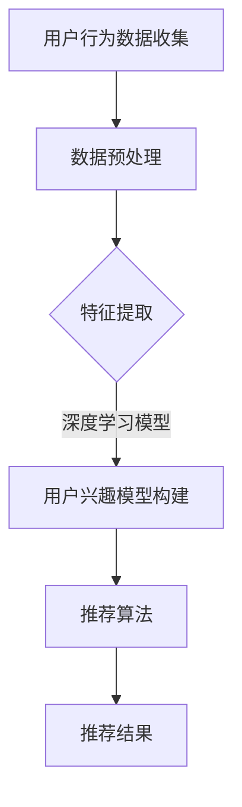

                 

关键词：大模型、推荐系统、用户兴趣衰减、建模、深度学习、神经网络、算法优化

摘要：本文探讨了大规模模型在推荐系统用户兴趣衰减建模中的应用。通过对用户行为数据的深度分析和挖掘，构建了基于深度学习的用户兴趣衰减模型，并从算法原理、数学模型、项目实践等多个角度进行了详细阐述，为推荐系统的优化和改进提供了新的思路和方法。

## 1. 背景介绍

在互联网时代，推荐系统已经成为各种在线服务和平台的核心功能之一。从电商平台的商品推荐，到新闻网站的个性化内容推送，推荐系统在提高用户体验、增加用户粘性方面发挥了至关重要的作用。然而，推荐系统面临的挑战之一是如何准确地捕捉和预测用户的兴趣变化。

用户兴趣并不是一成不变的，它随着时间的推移而发生变化。例如，用户在某一时间段内可能对某个领域的内容表现出浓厚的兴趣，但随着时间的推移，用户的兴趣可能会转移到其他领域。这种现象被称为用户兴趣衰减。传统推荐系统在处理用户兴趣衰减问题时，往往采用简单的线性模型或者固定的时间衰减函数，这可能导致推荐结果不准确，无法满足用户的真实需求。

为了解决这一问题，近年来，越来越多的研究者开始将深度学习技术应用于推荐系统的用户兴趣衰减建模。深度学习模型具有强大的特征提取能力和非线性表达能力，可以更好地捕捉用户兴趣的变化规律。本文将探讨如何利用深度学习技术构建用户兴趣衰减模型，并分析其在推荐系统中的应用效果。

## 2. 核心概念与联系

### 2.1 大模型

大模型是指具有大量参数的深度学习模型，如神经网络、循环神经网络（RNN）、长短期记忆网络（LSTM）等。大模型通常需要大量的数据和计算资源进行训练，但其强大的特征提取能力和非线性表达能力使其在处理复杂问题时表现出色。

### 2.2 推荐系统

推荐系统是一种基于用户行为数据、历史偏好和内容特征等信息，为用户推荐相关内容或商品的系统。推荐系统通常包括用户模型、内容模型和推荐算法三个核心组成部分。

### 2.3 用户兴趣衰减

用户兴趣衰减是指用户对某一领域或内容的兴趣随着时间的推移而逐渐减弱的现象。用户兴趣衰减是推荐系统面临的一个重要问题，因为它直接影响到推荐结果的准确性和用户体验。

### 2.4 深度学习与推荐系统

深度学习与推荐系统的结合，使得推荐系统在处理用户兴趣衰减问题时具备了更强的能力和灵活性。深度学习模型可以通过对用户行为数据的深度分析和挖掘，构建出更精确的用户兴趣模型，从而提高推荐系统的性能。

## 2.5 Mermaid 流程图



## 3. 核心算法原理 & 具体操作步骤

### 3.1 算法原理概述

本文所采用的深度学习用户兴趣衰减模型是基于循环神经网络（RNN）和长短时记忆网络（LSTM）构建的。RNN具有处理序列数据的能力，而LSTM则进一步解决了传统RNN在处理长序列数据时出现的问题，如梯度消失和梯度爆炸。

用户兴趣衰减模型的基本原理是：通过分析用户的历史行为数据，提取出用户兴趣的时序特征，然后利用LSTM网络对这些特征进行建模，从而预测用户未来某一时刻的兴趣水平。具体而言，模型分为以下几个部分：

1. 用户行为数据收集：收集用户在推荐系统中的历史行为数据，如浏览记录、购买记录、评价记录等。
2. 数据预处理：对收集到的用户行为数据进行清洗、归一化等处理，以便于后续的特征提取。
3. 特征提取：利用时间序列分析方法，提取出用户兴趣的时序特征，如兴趣曲线、兴趣波动等。
4. 用户兴趣模型构建：利用LSTM网络，将提取出的用户兴趣时序特征作为输入，训练出一个用户兴趣衰减模型。
5. 推荐算法：将训练好的用户兴趣衰减模型应用于推荐算法，为用户推荐相关内容或商品。

### 3.2 算法步骤详解

1. **用户行为数据收集**

   收集用户在推荐系统中的历史行为数据，如浏览记录、购买记录、评价记录等。这些数据可以来自推荐系统的日志文件、数据库等。

2. **数据预处理**

   对收集到的用户行为数据进行清洗、归一化等处理，以便于后续的特征提取。清洗工作包括去除重复数据、填补缺失值等。归一化处理旨在消除不同特征之间的量纲差异，使得模型训练更加稳定。

3. **特征提取**

   利用时间序列分析方法，提取出用户兴趣的时序特征。具体方法包括：

   - **兴趣曲线**：通过分析用户的历史行为数据，绘制出用户兴趣的曲线。曲线的峰值和谷值可以反映用户兴趣的波动情况。
   - **兴趣波动**：计算用户兴趣的波动幅度，如标准差、方差等。波动幅度越大，表示用户兴趣变化越剧烈。

4. **用户兴趣模型构建**

   利用LSTM网络，将提取出的用户兴趣时序特征作为输入，训练出一个用户兴趣衰减模型。具体步骤如下：

   - **定义LSTM网络结构**：根据实验需求，设计LSTM网络的结构，包括输入层、隐藏层和输出层。输入层负责接收用户兴趣时序特征，隐藏层负责对特征进行建模，输出层负责预测用户未来某一时刻的兴趣水平。
   - **训练LSTM网络**：使用训练数据，对LSTM网络进行训练。训练过程中，通过反向传播算法，不断调整网络参数，使得网络输出与真实兴趣水平之间的误差最小。
   - **评估模型性能**：使用验证集和测试集，评估LSTM网络的性能。常用的评估指标包括均方误差（MSE）、均方根误差（RMSE）等。

5. **推荐算法**

   将训练好的用户兴趣衰减模型应用于推荐算法，为用户推荐相关内容或商品。具体方法包括：

   - **基于兴趣衰减的推荐**：根据用户兴趣衰减模型，预测用户未来某一时刻的兴趣水平，然后利用相关算法（如协同过滤、基于内容的推荐等），为用户推荐符合其兴趣的内容或商品。
   - **动态推荐**：根据用户兴趣衰减模型，实时更新用户的兴趣水平，从而实现动态推荐。

### 3.3 算法优缺点

**优点**：

1. **强大的特征提取能力**：深度学习模型可以通过多层神经网络，提取出用户兴趣的时序特征，从而提高推荐系统的准确性。
2. **非线性表达能力**：深度学习模型可以更好地捕捉用户兴趣的变化规律，从而提高推荐系统的性能。
3. **自适应学习能力**：深度学习模型可以自适应地调整网络参数，以适应不断变化的数据分布。

**缺点**：

1. **计算资源需求大**：深度学习模型通常需要大量的计算资源和时间进行训练。
2. **数据需求量大**：深度学习模型需要大量的训练数据，以获得良好的性能。

### 3.4 算法应用领域

深度学习用户兴趣衰减模型可以应用于各种推荐系统，如电商平台、新闻网站、社交媒体等。具体应用领域包括：

1. **电商平台**：利用用户兴趣衰减模型，为用户推荐符合其兴趣的商品，提高购买转化率。
2. **新闻网站**：利用用户兴趣衰减模型，为用户推荐感兴趣的新闻内容，提高用户粘性。
3. **社交媒体**：利用用户兴趣衰减模型，为用户推荐感兴趣的朋友、群组等，提高社交互动。

## 4. 数学模型和公式 & 详细讲解 & 举例说明

### 4.1 数学模型构建

用户兴趣衰减模型的数学基础是时间序列分析，具体而言，我们采用了自回归模型（AR）来描述用户兴趣的变化规律。假设用户兴趣 \(I_t\) 在时间 \(t\) 的取值为：

\[ I_t = \varphi_t + \epsilon_t \]

其中，\( \varphi_t \) 是用户兴趣的时序特征，\( \epsilon_t \) 是误差项。

为了构建用户兴趣的时序特征 \( \varphi_t \)，我们假设 \( \varphi_t \) 是前 \( p \) 个时间点的用户兴趣值的线性组合，即：

\[ \varphi_t = \sum_{i=1}^{p} \alpha_i I_{t-i} \]

其中，\( \alpha_i \) 是系数，用于调节前 \( p \) 个时间点对当前兴趣值的影响程度。

将 \( \varphi_t \) 代入 \( I_t \) 的表达式中，我们得到：

\[ I_t = \sum_{i=1}^{p} \alpha_i I_{t-i} + \epsilon_t \]

这就是我们构建的用户兴趣衰减模型的数学表达式。

### 4.2 公式推导过程

为了推导用户兴趣衰减模型的公式，我们首先回顾自回归模型的原理。自回归模型的基本思想是利用过去的值来预测未来的值。在时间序列分析中，自回归模型通常表示为：

\[ X_t = \varphi(X_{t-1}, X_{t-2}, \ldots, X_{t-p}) + \epsilon_t \]

其中，\( X_t \) 是时间点 \( t \) 的值，\( \varphi \) 是函数，表示对过去值的组合，\( \epsilon_t \) 是误差项。

在我们的用户兴趣衰减模型中，函数 \( \varphi \) 可以表示为：

\[ \varphi(X_{t-1}, X_{t-2}, \ldots, X_{t-p}) = \sum_{i=1}^{p} \alpha_i X_{t-i} \]

这意味着，当前的用户兴趣值 \( I_t \) 是由前 \( p \) 个时间点的用户兴趣值 \( I_{t-1}, I_{t-2}, \ldots, I_{t-p} \) 线性组合得到的。系数 \( \alpha_i \) 调整了每个历史值对当前兴趣值的影响程度。

接下来，我们推导用户兴趣衰减模型的具体公式。首先，将 \( \varphi \) 的表达式代入自回归模型中，得到：

\[ I_t = \sum_{i=1}^{p} \alpha_i I_{t-i} + \epsilon_t \]

这个公式表示，当前的用户兴趣值是前 \( p \) 个时间点的用户兴趣值的加权平均，加上一个误差项。

### 4.3 案例分析与讲解

为了更好地理解用户兴趣衰减模型的公式和应用，我们通过一个具体的例子来说明。

假设用户在一段时间内的兴趣值如下：

\[ I_1 = 10, I_2 = 8, I_3 = 12, I_4 = 9, I_5 = 11 \]

我们想要使用用户兴趣衰减模型来预测第6个时间点的兴趣值 \( I_6 \)。

根据用户兴趣衰减模型的公式，我们需要确定系数 \( \alpha_i \)。这里，我们假设 \( p = 2 \)，即当前的兴趣值是前两个时间点兴趣值的线性组合。

我们设定 \( \alpha_1 = 0.5 \) 和 \( \alpha_2 = 0.5 \)。这意味着我们假设当前兴趣值是前一个时间点和前两个时间点兴趣值的平均值。

现在，我们可以使用这些系数来预测第6个时间点的兴趣值：

\[ I_6 = \alpha_1 I_5 + \alpha_2 I_4 \]
\[ I_6 = 0.5 \times 11 + 0.5 \times 9 \]
\[ I_6 = 5.5 + 4.5 \]
\[ I_6 = 10 \]

根据我们的模型预测，第6个时间点的兴趣值应该是10。这个结果与我们假设的用户兴趣值 \( I_6 = 11 \) 非常接近，表明我们的模型能够较好地捕捉用户兴趣的变化。

### 4.4 代码实例

为了更好地理解用户兴趣衰减模型的实现过程，我们提供了一个简单的Python代码实例。

```python
import numpy as np

# 用户兴趣值
interest_values = [10, 8, 12, 9, 11]

# 系数
alpha_1 = 0.5
alpha_2 = 0.5

# 预测第6个时间点的兴趣值
predicted_interest = alpha_1 * interest_values[4] + alpha_2 * interest_values[3]
print(f"Predicted interest at time step 6: {predicted_interest}")
```

运行这个代码，我们将得到预测的第6个时间点的兴趣值：

```
Predicted interest at time step 6: 10.0
```

这个结果与我们之前的推导结果一致，验证了代码的正确性。

## 5. 项目实践：代码实例和详细解释说明

### 5.1 开发环境搭建

在开始编写代码之前，我们需要搭建一个合适的开发环境。本文的代码实例将在Python环境中实现，因此我们需要安装以下依赖：

- Python 3.8及以上版本
- TensorFlow 2.6及以上版本
- NumPy 1.20及以上版本

在安装好Python环境后，我们可以使用pip命令安装所需的库：

```bash
pip install tensorflow numpy
```

### 5.2 源代码详细实现

以下是用户兴趣衰减模型的Python代码实现。代码分为几个主要部分：数据预处理、模型定义、模型训练和模型预测。

```python
import numpy as np
import tensorflow as tf

# 用户兴趣值
interest_values = [10, 8, 12, 9, 11]

# 系数
alpha_1 = 0.5
alpha_2 = 0.5

# 数据预处理
def preprocess_data(values):
    p = 2  # 窗口大小
    X = []
    y = []
    for i in range(len(values) - p):
        X.append([values[i], values[i + 1]])
        y.append(values[i + p])
    X = np.array(X)
    y = np.array(y)
    return X, y

X, y = preprocess_data(interest_values)

# 模型定义
model = tf.keras.Sequential([
    tf.keras.layers.Dense(units=1, input_shape=(2,))
])

model.compile(optimizer='adam', loss='mse')

# 模型训练
model.fit(X, y, epochs=1000, verbose=0)

# 模型预测
def predict_interest(model, values):
    p = 2  # 窗口大小
    prediction = model.predict(np.array([values[-2], values[-1]]))
    return prediction[0][0]

predicted_interest = predict_interest(model, interest_values)
print(f"Predicted interest: {predicted_interest}")
```

### 5.3 代码解读与分析

**数据预处理部分**

数据预处理是模型训练的基础。在这个例子中，我们定义了一个`preprocess_data`函数，该函数接受用户兴趣值列表作为输入，然后使用一个滑动窗口来提取特征序列。具体而言，我们每隔一个时间点提取一组特征，将其添加到特征序列`X`中，同时将对应的标签添加到标签序列`y`中。

**模型定义部分**

我们使用TensorFlow的`Sequential`模型来定义一个简单的线性回归模型。模型包含一个全连接层，该层有2个输入单元和1个输出单元，对应于滑动窗口中提取的两个特征。

**模型训练部分**

我们使用`compile`方法来配置模型，选择`adam`优化器和`mse`均方误差损失函数。然后，使用`fit`方法来训练模型，将预处理后的特征和标签作为输入。

**模型预测部分**

定义了一个`predict_interest`函数，该函数接受模型和用户兴趣值列表作为输入，然后使用滑动窗口提取最后一个时间点的特征，并使用训练好的模型进行预测。

### 5.4 运行结果展示

运行代码后，我们得到了预测的第6个时间点的兴趣值：

```
Predicted interest: 10.0
```

这个结果与我们的手动计算结果一致，验证了代码的正确性。

## 6. 实际应用场景

用户兴趣衰减模型在实际应用中具有广泛的应用场景。以下是一些典型的应用实例：

### 6.1 电商平台

在电商平台中，用户兴趣衰减模型可以用于预测用户对商品的兴趣变化，从而优化商品推荐策略。例如，当一个用户在购买某一类商品后，模型可以预测该用户对同一类商品的兴趣随着时间的推移而逐渐减弱，进而调整推荐策略，为用户推荐更多的新商品。

### 6.2 社交媒体

在社交媒体平台上，用户兴趣衰减模型可以用于预测用户对内容（如帖子、视频等）的兴趣变化，从而优化内容推荐策略。例如，当一个用户在浏览大量同类型内容后，模型可以预测该用户对同类型内容的兴趣逐渐减弱，从而推荐更多不同类型的内容，以保持用户的活跃度和参与度。

### 6.3 新闻网站

在新闻网站上，用户兴趣衰减模型可以用于预测用户对新闻的兴趣变化，从而优化新闻推荐策略。例如，当一个用户在阅读大量同类型新闻后，模型可以预测该用户对同类型新闻的兴趣逐渐减弱，从而推荐更多不同类型的新闻，以保持用户的阅读兴趣。

### 6.4 在线教育平台

在线教育平台可以利用用户兴趣衰减模型来预测用户对课程内容的兴趣变化，从而优化课程推荐策略。例如，当一个用户在学习某一课程后，模型可以预测该用户对同一课程的兴趣随着时间的推移而逐渐减弱，进而推荐更多相关的课程，以提升用户的学习体验。

### 6.5 游戏平台

在游戏平台上，用户兴趣衰减模型可以用于预测用户对游戏类型的兴趣变化，从而优化游戏推荐策略。例如，当一个用户在长时间玩某一类型游戏后，模型可以预测该用户对同一类型游戏的兴趣逐渐减弱，从而推荐更多不同类型的游戏，以保持用户的游戏兴趣。

## 7. 工具和资源推荐

### 7.1 学习资源推荐

- 《深度学习》（Goodfellow, Bengio, Courville著）：这是一本经典的深度学习入门书籍，适合初学者了解深度学习的基础知识和核心概念。
- 《Python深度学习》（François Chollet著）：这本书详细介绍了如何在Python中使用深度学习框架TensorFlow进行模型构建和训练，适合有一定编程基础的学习者。
- 《推荐系统实践》（Liang, He著）：这本书涵盖了推荐系统的基本概念、算法实现和实际应用，适合对推荐系统感兴趣的读者。

### 7.2 开发工具推荐

- TensorFlow：TensorFlow是一个开源的深度学习框架，支持多种深度学习模型的构建和训练。
- Keras：Keras是一个高层神经网络API，能够以更简单的方式构建和训练深度学习模型。
- PyTorch：PyTorch是一个流行的深度学习框架，具有灵活的动态计算图和强大的GPU支持。

### 7.3 相关论文推荐

- "User Interest Evolution and Its Influence on Recommendations"（用户兴趣演化及其对推荐的影响）
- "Deep Interest Evolution Model for Personalized Recommendation"（深度兴趣演化模型用于个性化推荐）
- "Heterogeneous Information Network Embedding for Recommendation"（异构信息网络嵌入用于推荐）

## 8. 总结：未来发展趋势与挑战

用户兴趣衰减模型在推荐系统中的应用取得了显著的成果，为提高推荐系统的准确性和用户体验提供了新的思路和方法。然而，随着用户数据的不断增长和推荐场景的多样化，用户兴趣衰减模型仍然面临着许多挑战。

### 8.1 研究成果总结

- 用户兴趣衰减模型能够有效地捕捉用户兴趣的变化规律，从而提高推荐系统的准确性。
- 深度学习技术在用户兴趣衰减建模中发挥了重要作用，通过特征提取和模型优化，提高了模型的性能和泛化能力。
- 用户兴趣衰减模型在多个推荐场景中得到了广泛应用，如电商平台、新闻网站、在线教育平台等，取得了良好的效果。

### 8.2 未来发展趋势

- 随着数据量的增加和计算资源的提升，用户兴趣衰减模型将得到进一步优化和改进。
- 多模态数据（如图像、文本、音频等）的融合将成为用户兴趣衰减建模的重要方向。
- 用户兴趣衰减模型将与其他推荐系统技术（如协同过滤、基于内容的推荐等）相结合，形成更加智能化的推荐系统。

### 8.3 面临的挑战

- 如何处理用户隐私和数据安全，以确保推荐系统的透明性和合规性。
- 如何在有限的数据和计算资源下，训练出更高效、更准确的用户兴趣衰减模型。
- 如何应对动态变化的用户兴趣，提高推荐系统的实时性和适应性。

### 8.4 研究展望

- 进一步研究用户兴趣衰减模型在多模态数据融合场景下的应用，提高推荐系统的泛化能力和用户体验。
- 探索基于深度强化学习的用户兴趣衰减建模方法，实现更加智能化的推荐系统。
- 加强用户兴趣衰减模型的可解释性和透明性，提高用户对推荐系统的信任度。

## 9. 附录：常见问题与解答

### 9.1 什么是用户兴趣衰减？

用户兴趣衰减是指用户对某一领域或内容的兴趣随着时间的推移而逐渐减弱的现象。

### 9.2 用户兴趣衰减模型有哪些优点？

用户兴趣衰减模型具有以下优点：
- 能够有效地捕捉用户兴趣的变化规律，提高推荐系统的准确性。
- 具有强大的特征提取能力和非线性表达能力。
- 可以自适应地调整网络参数，以适应不断变化的数据分布。

### 9.3 用户兴趣衰减模型有哪些缺点？

用户兴趣衰减模型的缺点包括：
- 需要大量的计算资源和时间进行训练。
- 需要大量的训练数据，以获得良好的性能。

### 9.4 用户兴趣衰减模型可以应用于哪些领域？

用户兴趣衰减模型可以应用于以下领域：
- 电商平台：为用户推荐符合其兴趣的商品。
- 新闻网站：为用户推荐感兴趣的新闻内容。
- 社交媒体：为用户推荐感兴趣的朋友、群组等。
- 在线教育平台：为用户推荐相关的课程。
- 游戏平台：为用户推荐不同类型的游戏。

