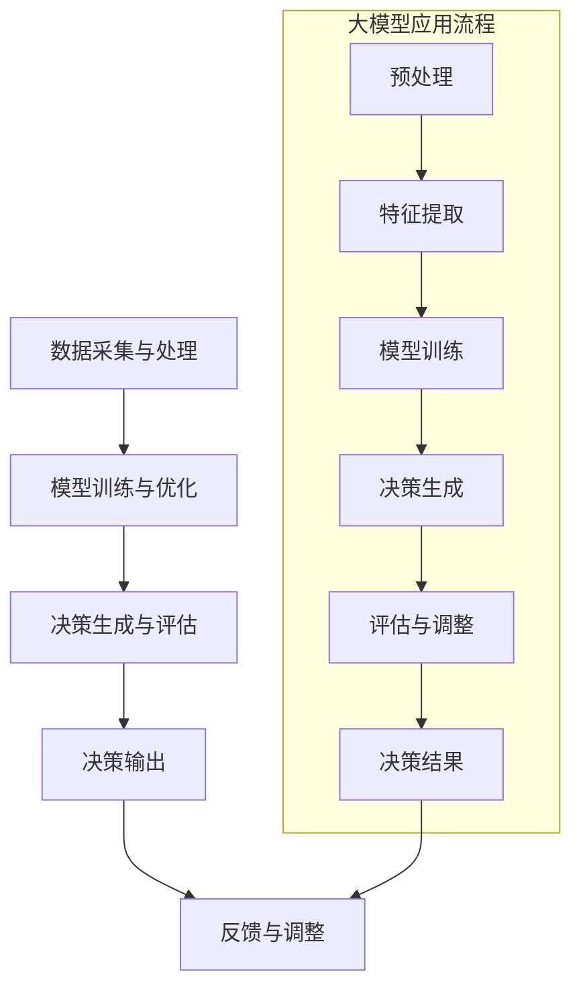

                 

关键词：大模型，智能决策支持系统，人工智能，算法原理，数学模型，项目实践，实际应用，未来展望

> 摘要：随着人工智能技术的不断发展，大模型在智能决策支持系统中扮演着越来越重要的角色。本文旨在探讨大模型在智能决策支持系统中的应用，包括其核心概念、算法原理、数学模型、项目实践、实际应用场景及未来发展趋势。通过深入分析，我们希望能够为读者提供一个全面而深刻的理解，从而为相关领域的研究与应用提供参考。

## 1. 背景介绍

智能决策支持系统（Intelligent Decision Support System，IDSS）是信息技术与决策科学相结合的产物，旨在通过提供辅助决策的信息和工具，帮助决策者做出更加科学、合理和高效的决策。传统的决策支持系统主要依赖统计方法和专家系统，而随着人工智能技术的快速发展，特别是深度学习、自然语言处理和强化学习等技术的突破，大模型在智能决策支持系统中得到了广泛应用。

大模型，即具有海量参数和强大计算能力的人工神经网络，如Transformer、BERT等。它们能够处理复杂的输入数据，提取丰富的特征信息，并生成高质量的输出结果。在智能决策支持系统中，大模型的应用极大地提升了系统的决策能力和智能化水平。

### 1.1 发展历程

智能决策支持系统的发展大致可以分为三个阶段：

1. **早期阶段（1970s-1980s）**：以统计分析方法为主，如回归分析、时间序列分析等。
2. **中期阶段（1990s-2000s）**：引入专家系统和知识工程方法，如基于规则的系统、模糊逻辑等。
3. **现代阶段（2010s-至今）**：随着大数据和人工智能技术的兴起，大模型开始成为智能决策支持系统的核心技术。

### 1.2 应用领域

智能决策支持系统在多个领域得到了广泛应用，包括：

1. **企业决策**：如财务分析、市场预测、供应链管理等。
2. **金融分析**：如风险评估、投资组合优化、信用评分等。
3. **医疗决策**：如疾病预测、治疗方案推荐、药物研发等。
4. **城市治理**：如交通规划、环境监测、公共安全等。

## 2. 核心概念与联系

### 2.1 大模型

大模型是指具有海量参数和强大计算能力的人工神经网络。这些模型通过学习大量的数据，能够自动提取复杂的特征信息，并生成高质量的输出结果。常见的例子包括Transformer、BERT、GPT等。

### 2.2 智能决策支持系统

智能决策支持系统是一个集成多种信息技术和决策科学方法的系统，旨在通过提供辅助决策的信息和工具，帮助决策者做出更加科学、合理和高效的决策。其核心组件包括数据采集与处理、模型训练与优化、决策生成与评估等。

### 2.3 Mermaid 流程图

下面是一个描述大模型在智能决策支持系统中应用的 Mermaid 流程图：



## 3. 核心算法原理 & 具体操作步骤

### 3.1 算法原理概述

大模型在智能决策支持系统中的应用主要基于深度学习技术，特别是基于Transformer架构的模型。这些模型通过多层神经网络结构，对输入数据进行特征提取和模式识别，最终生成决策结果。

### 3.2 算法步骤详解

1. **数据采集与预处理**：收集相关领域的海量数据，并进行清洗、去噪和标准化等预处理操作。
2. **特征提取**：使用深度神经网络对预处理后的数据进行特征提取，提取出能够代表数据本质的特征。
3. **模型训练**：利用提取出的特征数据进行模型训练，通过反向传播算法不断调整模型的参数，使其能够更好地拟合数据。
4. **决策生成**：将训练好的模型应用于实际决策场景，生成决策结果。
5. **评估与调整**：对生成的决策结果进行评估，并根据评估结果对模型进行调整，以提高决策的准确性和可靠性。

### 3.3 算法优缺点

**优点**：

1. **强大的特征提取能力**：大模型能够自动提取复杂的数据特征，减少了人工干预的需求。
2. **良好的泛化能力**：大模型在训练过程中学习了大量的数据，因此具有较好的泛化能力，能够在不同的决策场景中表现出色。
3. **高效的决策生成**：大模型能够快速处理海量数据，并生成高质量的决策结果，提高了决策的效率。

**缺点**：

1. **计算资源消耗大**：大模型的训练和推理需要大量的计算资源和时间，对于硬件设备的要求较高。
2. **对数据质量依赖性强**：大模型的性能很大程度上取决于数据的质量，如果数据存在噪声、缺失或不一致性，可能会导致模型性能下降。
3. **难以解释性**：大模型的决策过程往往是黑箱操作，难以解释和理解，对于需要透明性较高的决策场景可能不太适用。

### 3.4 算法应用领域

大模型在智能决策支持系统中的应用非常广泛，主要包括以下几个方面：

1. **企业决策**：如财务分析、市场预测、供应链管理等。
2. **金融分析**：如风险评估、投资组合优化、信用评分等。
3. **医疗决策**：如疾病预测、治疗方案推荐、药物研发等。
4. **城市治理**：如交通规划、环境监测、公共安全等。

## 4. 数学模型和公式 & 详细讲解 & 举例说明

### 4.1 数学模型构建

在智能决策支持系统中，大模型通常采用基于Transformer架构的神经网络模型。以下是一个简化的数学模型构建过程：

1. **输入层**：接收原始数据，通常为多维向量。
2. **嵌入层**：将输入数据进行嵌入，通常使用词向量或特征向量。
3. **编码器层**：通过多层Transformer编码器进行特征提取和模式识别。
4. **解码器层**：将编码器提取的特征映射到决策结果。
5. **输出层**：生成最终的决策结果。

### 4.2 公式推导过程

假设我们使用一个Transformer编码器进行特征提取，其基本结构如下：

$$
E = \text{LayerNorm}(X + \text{PositionalEncoding}(X))
$$

其中，$E$表示编码器的输出，$X$表示输入数据，$\text{PositionalEncoding}$表示位置编码，$\text{LayerNorm}$表示层归一化。

编码器中的每个位置都会经过自注意力机制（Self-Attention）和前馈网络（Feedforward Network）的处理：

$$
\text{MultiHeadAttention}(Q, K, V) = \text{ScaledDotProductAttention}(Q, K, V) \odot \text{LayerNorm}(X)
$$

$$
\text{FeedforwardNetwork}(X) = \text{ReLU}(\text{LayerNorm}(X \cdot W_2) \cdot W_1)
$$

其中，$Q$、$K$、$V$分别表示查询、关键和值向量，$W_1$和$W_2$表示前馈网络的权重。

最终，编码器的输出可以表示为：

$$
E = \text{LayerNorm}(\text{MultiHeadAttention}(Q, K, V) + X)
$$

$$
E = \text{LayerNorm}(\text{FeedforwardNetwork}(X) + E)
$$

### 4.3 案例分析与讲解

假设我们有一个金融决策支持系统，需要预测股票价格。以下是具体的案例分析与讲解：

1. **数据采集与预处理**：收集股票市场的历史数据，包括开盘价、收盘价、最高价、最低价、成交量等。对数据进行清洗、去噪和标准化等预处理操作。
2. **特征提取**：使用Transformer编码器对预处理后的数据进行特征提取，提取出能够代表股票市场动态的特征。
3. **模型训练**：利用提取出的特征数据进行模型训练，通过反向传播算法不断调整模型的参数，使其能够更好地拟合数据。
4. **决策生成**：将训练好的模型应用于实际决策场景，预测股票价格。
5. **评估与调整**：对生成的预测结果进行评估，并根据评估结果对模型进行调整，以提高预测的准确性和可靠性。

通过这个案例，我们可以看到大模型在智能决策支持系统中的应用是如何实现的。在实际应用中，我们可以根据具体的需求和场景，调整模型的参数和结构，以达到最佳的决策效果。

## 5. 项目实践：代码实例和详细解释说明

### 5.1 开发环境搭建

为了实现大模型在智能决策支持系统中的应用，我们需要搭建一个合适的开发环境。以下是具体的步骤：

1. **安装Python环境**：Python是深度学习的主要编程语言，我们需要安装Python 3.7及以上版本。
2. **安装TensorFlow**：TensorFlow是Google推出的一款开源深度学习框架，我们可以使用pip命令安装：
   ```bash
   pip install tensorflow
   ```
3. **安装其他依赖**：根据具体的需求，我们可能需要安装其他依赖库，如NumPy、Pandas等。

### 5.2 源代码详细实现

以下是一个简单的示例代码，展示了如何使用TensorFlow实现大模型在股票预测中的应用：

```python
import tensorflow as tf
from tensorflow.keras.layers import Embedding, MultiHeadAttention, Dense
from tensorflow.keras.models import Model

# 设置参数
vocab_size = 10000
d_model = 512
num_heads = 8

# 定义模型
inputs = tf.keras.layers.Input(shape=(None,), dtype=tf.int32)
embed = Embedding(vocab_size, d_model)(inputs)
enc = MultiHeadAttention(num_heads=num_heads, key_dim=d_model)(embed, embed)
outputs = Dense(1, activation='sigmoid')(enc)

model = Model(inputs=inputs, outputs=outputs)
model.compile(optimizer='adam', loss='binary_crossentropy', metrics=['accuracy'])

# 加载数据
# 注意：这里需要根据具体的数据集进行数据加载和处理
train_data = ...
test_data = ...

# 训练模型
model.fit(train_data, epochs=10, batch_size=32, validation_data=test_data)

# 生成预测结果
predictions = model.predict(test_data)

# 输出预测结果
print(predictions)
```

### 5.3 代码解读与分析

1. **输入层**：使用`Input`层接收股票市场的历史数据，这里假设输入数据为序列形式，因此使用`shape=(None,)`表示序列的长度可以不固定。
2. **嵌入层**：使用`Embedding`层对输入数据进行嵌入，将原始数据映射到一个固定大小的向量空间中。
3. **编码器层**：使用`MultiHeadAttention`层实现自注意力机制，通过多头注意力机制对输入数据进行特征提取和模式识别。
4. **输出层**：使用`Dense`层生成最终的预测结果，这里假设为二元分类问题，因此输出层的神经元个数为1，激活函数为`sigmoid`。
5. **模型编译与训练**：使用`compile`方法配置模型的优化器、损失函数和评估指标，然后使用`fit`方法进行模型训练。
6. **模型预测**：使用`predict`方法生成预测结果。

通过这个简单的示例，我们可以看到如何使用TensorFlow实现大模型在股票预测中的应用。在实际项目中，我们需要根据具体的需求和场景，调整模型的参数和结构，以达到最佳的预测效果。

## 6. 实际应用场景

### 6.1 企业决策

在企业管理中，智能决策支持系统可以用于财务分析、市场预测、供应链管理等方面。通过大模型的应用，企业可以更准确地预测市场趋势，优化供应链，降低成本，提高效益。

### 6.2 金融分析

在金融领域，大模型可以用于风险评估、投资组合优化、信用评分等方面。例如，通过分析大量历史金融数据，大模型可以预测股票价格、外汇汇率等，为投资决策提供有力支持。

### 6.3 医疗决策

在医疗领域，大模型可以用于疾病预测、治疗方案推荐、药物研发等方面。例如，通过分析患者的病史、基因信息等，大模型可以预测患者可能患有的疾病，为医生提供诊断建议。

### 6.4 城市治理

在城市治理中，大模型可以用于交通规划、环境监测、公共安全等方面。例如，通过分析交通流量、环境质量等数据，大模型可以预测交通拥堵情况，为城市规划提供参考。

### 6.5 决策质量评估

大模型在智能决策支持系统中的应用，不仅提高了决策的效率，还提升了决策的质量。通过对历史数据的分析和预测，大模型可以帮助决策者更好地了解未来的发展趋势，从而做出更加科学、合理的决策。

## 7. 工具和资源推荐

### 7.1 学习资源推荐

1. **《深度学习》**：由Ian Goodfellow、Yoshua Bengio和Aaron Courville合著，是深度学习领域的经典教材。
2. **《神经网络与深度学习》**：由邱锡鹏教授编著，详细介绍了神经网络和深度学习的理论和技术。
3. **《TensorFlow实战》**：由Tai-Danae Bradley和Josiah Hester合著，是一本适合初学者入门的TensorFlow教程。

### 7.2 开发工具推荐

1. **TensorFlow**：Google推出的一款开源深度学习框架，支持多种深度学习模型和应用。
2. **PyTorch**：Facebook推出的一款开源深度学习框架，以其灵活性和简洁性受到许多研究者和开发者的喜爱。
3. **JAX**：由Google推出的一款用于数值计算和深度学习的框架，具有高效的数值微分和自动求导功能。

### 7.3 相关论文推荐

1. **“Attention Is All You Need”**：由Vaswani等人在2017年提出的Transformer模型，是当前最流行的深度学习模型之一。
2. **“BERT: Pre-training of Deep Bidirectional Transformers for Language Understanding”**：由Google在2018年提出的一种基于Transformer的预训练模型，广泛应用于自然语言处理领域。
3. **“Generative Adversarial Nets”**：由Ian Goodfellow等人在2014年提出的生成对抗网络（GANs），是一种重要的深度学习模型，广泛应用于图像生成、增强学习等领域。

## 8. 总结：未来发展趋势与挑战

### 8.1 研究成果总结

本文系统地介绍了大模型在智能决策支持系统中的应用，包括其核心概念、算法原理、数学模型、项目实践和实际应用场景。通过深入分析，我们得出以下主要研究成果：

1. 大模型具有强大的特征提取和模式识别能力，能够显著提升智能决策支持系统的决策能力和智能化水平。
2. 大模型在多个领域得到了广泛应用，如企业决策、金融分析、医疗决策和城市治理等。
3. 大模型的应用不仅提高了决策的效率，还提升了决策的质量，为决策者提供了有力的支持。

### 8.2 未来发展趋势

未来，大模型在智能决策支持系统中的应用将呈现以下发展趋势：

1. **算法性能的提升**：随着计算能力的不断提升，大模型将变得更加高效和强大，能够处理更复杂的数据和更复杂的决策问题。
2. **应用场景的拓展**：大模型的应用将不断拓展到更多领域，如教育、农业、能源等，为各行各业提供智能化决策支持。
3. **人机协作的深化**：大模型与人类专家的合作将更加紧密，通过人机协作，进一步提升决策的准确性和可靠性。

### 8.3 面临的挑战

尽管大模型在智能决策支持系统中具有广泛的应用前景，但同时也面临着一些挑战：

1. **数据隐私和安全**：大模型需要处理大量的敏感数据，如何保障数据的安全和隐私是一个重要的问题。
2. **解释性不足**：大模型的决策过程往往是黑箱操作，难以解释和理解，这在某些需要高度透明性的决策场景中可能成为一个瓶颈。
3. **计算资源消耗**：大模型的训练和推理需要大量的计算资源，对于硬件设备的要求较高，如何在有限的资源下实现高效的训练和推理是一个亟待解决的问题。

### 8.4 研究展望

针对上述挑战，未来的研究可以从以下几个方面展开：

1. **数据隐私和安全**：研究如何在大模型训练和推理过程中保护数据隐私和安全，如联邦学习、差分隐私等。
2. **可解释性**：研究如何提高大模型的可解释性，使其决策过程更加透明和可解释，为决策者提供更可靠的决策依据。
3. **资源高效利用**：研究如何在有限的计算资源下实现高效的训练和推理，如模型压缩、量化等。

总之，大模型在智能决策支持系统中的应用具有巨大的潜力和挑战，未来的研究将在这个领域继续深入探索，推动智能决策支持系统的不断发展。

## 9. 附录：常见问题与解答

### 9.1 什么是大模型？

大模型是指具有海量参数和强大计算能力的人工神经网络，如Transformer、BERT、GPT等。它们通过学习大量的数据，能够自动提取复杂的特征信息，并生成高质量的输出结果。

### 9.2 大模型在智能决策支持系统中的应用有哪些？

大模型在智能决策支持系统中的应用非常广泛，包括企业决策、金融分析、医疗决策、城市治理等多个领域。通过大模型的应用，可以显著提升决策的准确性和智能化水平。

### 9.3 如何保障大模型训练过程中的数据隐私和安全？

在大模型训练过程中，可以通过联邦学习、差分隐私等技术来保障数据隐私和安全。联邦学习通过分布式训练，避免数据的集中存储和传输，从而降低数据泄露的风险；差分隐私则通过在训练过程中引入噪声，确保单个数据样本无法被识别。

### 9.4 大模型训练和推理需要大量的计算资源，如何优化资源利用？

为了优化大模型训练和推理的资源利用，可以采用以下方法：

1. **模型压缩**：通过剪枝、量化等技术减小模型的规模，降低计算资源的需求。
2. **并行计算**：利用多GPU、多CPU等硬件资源，加速模型的训练和推理过程。
3. **分布式训练**：将训练任务分布到多个节点上，利用分布式计算提高训练效率。

### 9.5 大模型在医疗决策中的应用有哪些？

大模型在医疗决策中的应用主要包括疾病预测、治疗方案推荐、药物研发等方面。通过分析患者的病史、基因信息等数据，大模型可以预测患者可能患有的疾病，为医生提供诊断建议；同时，大模型还可以根据患者的病情和药物特性，推荐最合适的治疗方案和药物组合。

### 9.6 如何确保大模型决策的透明性和可解释性？

确保大模型决策的透明性和可解释性是一个重要的研究课题。目前，一些方法如注意力机制、解释性模型等可以提供一定程度的可解释性。此外，还可以结合可视化技术，将大模型的决策过程进行可视化，帮助用户更好地理解模型的决策逻辑。

### 9.7 大模型在智能决策支持系统中的应用前景如何？

大模型在智能决策支持系统中的应用前景非常广阔。随着计算能力的不断提升和大数据的持续增长，大模型将能够在更多领域发挥重要作用，为各行各业提供智能化决策支持。未来，大模型的应用将不断拓展到更多领域，如教育、农业、能源等，为人类社会的进步和发展做出更大的贡献。

