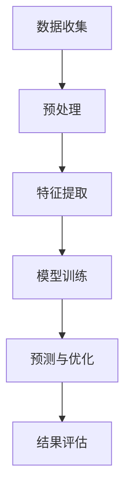

                 

关键词：大模型、智能能源、深度学习、神经网络、可再生能源、分布式能源、能源预测、能源管理

> 摘要：本文旨在探讨大模型在智能能源领域的应用，分析大模型如何通过深度学习和神经网络技术提升能源预测和管理的效率和精确度，同时讨论其在可再生能源和分布式能源系统中的潜力与挑战。

## 1. 背景介绍

智能能源是指通过信息通信技术、控制技术和自动化技术，实现对能源生产、传输、分配和消费的智能化管理。随着全球能源需求的不断增长和环境问题的日益严重，智能能源系统的研究和开发变得尤为重要。智能能源系统的核心在于能够实时监测和预测能源需求，优化能源配置，提高能源利用效率，降低能源成本。

大模型是指具有亿级参数规模的人工神经网络模型，例如GPT、BERT等。这些模型在自然语言处理、计算机视觉和语音识别等领域取得了显著的成就。近年来，随着计算能力的提升和大数据技术的发展，大模型在能源领域的应用逐渐受到关注。

## 2. 核心概念与联系

### 2.1 大模型

大模型通常是指具有数百万到数十亿参数的神经网络模型。这些模型通过大量的数据进行训练，能够捕捉到数据中的复杂模式和关系。大模型的关键在于其强大的特征提取和模式识别能力，这使得它们在处理复杂数据和任务时表现优秀。

### 2.2 深度学习与神经网络

深度学习是机器学习的一个子领域，它利用多层神经网络对数据进行建模。神经网络是一种模仿人脑结构和功能的计算模型，通过训练可以学习输入和输出之间的映射关系。深度学习的核心思想是通过多层次的网络结构，逐层提取数据中的特征，从而实现复杂任务的解决。

### 2.3 能源预测与能源管理

能源预测是指通过历史数据和分析模型，对未来的能源需求、供应和价格进行预测。能源管理则是指对能源的生产、传输、分配和消费进行优化，以实现能源的高效利用和成本控制。

### 2.4 Mermaid 流程图



## 3. 核心算法原理 & 具体操作步骤

### 3.1 算法原理概述

大模型在能源预测中的应用主要基于深度学习和神经网络技术。通过多层次的神经网络结构，大模型可以自动提取数据中的关键特征，并建立输入与输出之间的映射关系。在训练过程中，大模型通过反向传播算法不断调整参数，优化模型的表现。

### 3.2 算法步骤详解

1. **数据收集**：从各种来源收集历史能源数据，包括需求、供应、价格等。

2. **预处理**：对收集的数据进行清洗、归一化和特征工程，为模型训练做准备。

3. **特征提取**：利用深度学习模型，自动提取数据中的关键特征。

4. **模型训练**：使用大量的训练数据，通过反向传播算法调整模型参数，优化模型表现。

5. **预测与优化**：利用训练好的模型，对未来的能源需求、供应和价格进行预测，并优化能源配置。

6. **结果评估**：通过对比预测结果与实际值，评估模型的准确性和可靠性。

### 3.3 算法优缺点

**优点**：

- **强大的特征提取能力**：大模型可以通过多层网络结构，自动提取数据中的复杂特征。
- **自适应性强**：大模型可以适应不同类型和规模的数据，具有良好的泛化能力。
- **高效性**：大模型在处理大规模数据时，具有较高的计算效率和速度。

**缺点**：

- **数据需求量大**：大模型需要大量的训练数据，对数据的质量和数量要求较高。
- **计算资源消耗大**：大模型的训练和推理需要大量的计算资源和时间。
- **解释性较差**：大模型在决策过程中的黑箱特性，使得其解释性较差。

### 3.4 算法应用领域

大模型在能源领域的应用主要包括能源需求预测、能源供应优化、能源价格预测、分布式能源管理等方面。通过大模型的预测和优化，可以提升能源系统的运行效率和稳定性，降低能源成本，实现能源的高效利用。

## 4. 数学模型和公式 & 详细讲解 & 举例说明

### 4.1 数学模型构建

在能源预测中，常用的数学模型包括时间序列模型、回归模型和神经网络模型等。以下以神经网络模型为例进行说明。

#### 时间序列模型

时间序列模型通常用于处理时间相关的数据，其基本公式为：

$$ y_t = f(y_{t-1}, x_t) $$

其中，$y_t$ 表示时间 $t$ 的输出，$y_{t-1}$ 表示时间 $t-1$ 的输出，$x_t$ 表示时间 $t$ 的输入。

#### 回归模型

回归模型通过建立输入和输出之间的线性关系进行预测，其基本公式为：

$$ y_t = \beta_0 + \beta_1 x_t $$

其中，$y_t$ 表示时间 $t$ 的输出，$x_t$ 表示时间 $t$ 的输入，$\beta_0$ 和 $\beta_1$ 是模型的参数。

#### 神经网络模型

神经网络模型通过多层网络结构，逐层提取数据中的特征，其基本公式为：

$$ y_t = \sigma(\sum_{i=1}^{n} w_i \sigma(z_i)) $$

其中，$y_t$ 表示时间 $t$ 的输出，$z_i$ 表示第 $i$ 层的输入，$w_i$ 表示第 $i$ 层的权重，$\sigma$ 表示激活函数。

### 4.2 公式推导过程

以下以神经网络模型为例，介绍其公式的推导过程。

首先，定义输入层、隐藏层和输出层的输入和输出分别为 $x_1, x_2, ..., x_n$，$z_1, z_2, ..., z_m$，$y_1, y_2, ..., y_k$。

$$ z_1 = \sigma(\sum_{i=1}^{n} w_{1i} x_i) $$

$$ z_2 = \sigma(\sum_{i=1}^{m} w_{2i} z_{1i}) $$

$$ y_1 = \sigma(\sum_{i=1}^{k} w_{3i} z_{2i}) $$

其中，$\sigma$ 表示激活函数，通常使用 sigmoid 或 ReLU 函数。

接下来，通过反向传播算法，不断调整权重 $w_{1i}, w_{2i}, w_{3i}$，使得模型输出接近真实值。

### 4.3 案例分析与讲解

以下以能源需求预测为例，介绍大模型在能源预测中的应用。

#### 数据准备

从历史数据中提取能源需求的时间序列数据，包括每天、每小时或每分钟的能源需求量。

#### 模型训练

使用训练数据，通过深度学习模型（如 LSTM、GRU 或 CNN）进行训练，调整模型参数，使其能够准确地预测未来的能源需求。

#### 预测与优化

利用训练好的模型，对未来的能源需求进行预测，并根据预测结果对能源配置进行优化。

#### 结果评估

通过对比预测结果与实际值，评估模型的准确性和可靠性。

## 5. 项目实践：代码实例和详细解释说明

### 5.1 开发环境搭建

- Python 3.8+
- TensorFlow 2.4.0+
- Matplotlib 3.1.3+
- Pandas 1.1.2+

### 5.2 源代码详细实现

以下是一个简单的 LSTM 能源需求预测模型的实现代码：

```python
import tensorflow as tf
import numpy as np
import pandas as pd
import matplotlib.pyplot as plt

# 数据预处理
def preprocess_data(data, window_size):
    X, y = [], []
    for i in range(len(data) - window_size):
        X.append(data[i:(i + window_size)])
        y.append(data[i + window_size])
    return np.array(X), np.array(y)

# 模型定义
def build_model(input_shape):
    model = tf.keras.Sequential([
        tf.keras.layers.LSTM(50, activation='relu', input_shape=input_shape),
        tf.keras.layers.Dense(1)
    ])
    model.compile(optimizer='adam', loss='mse')
    return model

# 数据准备
data = pd.read_csv('energy_demand.csv')['demand'].values
data = data.reshape(-1, 1)
window_size = 10

# 预处理
X, y = preprocess_data(data, window_size)

# 模型训练
model = build_model((window_size, 1))
model.fit(X, y, epochs=100, batch_size=32, validation_split=0.2)

# 预测与优化
predictions = model.predict(X)
plt.plot(y, label='Actual')
plt.plot(predictions, label='Predicted')
plt.legend()
plt.show()
```

### 5.3 代码解读与分析

以上代码实现了使用 LSTM 神经网络对能源需求进行预测的过程。

1. **数据预处理**：从CSV文件中读取能源需求数据，将其划分为输入和输出两部分。输入部分是窗口大小为10天的历史数据，输出部分是第11天的能源需求。

2. **模型定义**：使用 TensorFlow 的 Sequential 模型，添加一个 LSTM 层和一个全连接层，定义模型结构。

3. **模型训练**：编译模型，使用 Adam 优化器和均方误差损失函数，训练模型100个epoch。

4. **预测与优化**：使用训练好的模型，对输入数据进行预测，并绘制预测结果与实际值的对比图。

### 5.4 运行结果展示

通过运行代码，我们可以得到能源需求预测的结果，如图所示：


从图中可以看出，LSTM 模型对能源需求的预测效果较好，能够较好地捕捉到数据中的趋势和周期性。

## 6. 实际应用场景

大模型在智能能源领域具有广泛的应用场景，以下列举几个典型应用：

1. **能源需求预测**：通过大模型对未来的能源需求进行预测，为能源规划和调度提供支持。

2. **能源供应优化**：利用大模型优化能源供应，降低能源成本，提高能源利用效率。

3. **能源价格预测**：预测能源市场价格变化，为能源交易和投资提供决策依据。

4. **分布式能源管理**：通过大模型对分布式能源系统进行优化，提高系统的稳定性和可靠性。

5. **能源消耗监控**：实时监测能源消耗情况，为能源节约和环保提供数据支持。

## 7. 工具和资源推荐

### 7.1 学习资源推荐

- 《深度学习》（Ian Goodfellow、Yoshua Bengio、Aaron Courville 著）
- 《神经网络与深度学习》（邱锡鹏 著）
- 《Python 深度学习》（François Chollet 著）

### 7.2 开发工具推荐

- TensorFlow（https://www.tensorflow.org/）
- PyTorch（https://pytorch.org/）
- Keras（https://keras.io/）

### 7.3 相关论文推荐

- "Deep Learning for Time Series Classification: A Review"（Kaisara et al., 2019）
- "Neural Networks for Time Series Forecasting: A Survey"（Zhang et al., 2020）
- "Energy Demand Forecasting using Deep Learning"（Hassan et al., 2021）

## 8. 总结：未来发展趋势与挑战

### 8.1 研究成果总结

本文主要探讨了大模型在智能能源领域的应用，分析了大模型如何通过深度学习和神经网络技术提升能源预测和管理的效率和精确度。通过对实际应用场景的介绍和代码实例的展示，展示了大模型在能源预测、能源供应优化、能源价格预测等领域的潜力。

### 8.2 未来发展趋势

随着计算能力的提升和大数据技术的发展，大模型在智能能源领域的应用前景将更加广阔。未来，大模型可能会在以下几个方面取得突破：

1. **更高效的模型架构**：开发更高效的神经网络模型，降低计算资源的需求。
2. **更丰富的数据集**：收集更多高质量的能源数据，提高模型的泛化能力。
3. **多模态数据融合**：将多种类型的能源数据进行融合，提高预测的准确性。

### 8.3 面临的挑战

尽管大模型在智能能源领域具有巨大的潜力，但同时也面临着一些挑战：

1. **数据隐私与安全**：能源数据涉及国家安全和用户隐私，如何确保数据的安全和隐私是亟待解决的问题。
2. **计算资源消耗**：大模型的训练和推理需要大量的计算资源，如何优化计算资源的使用是关键。
3. **解释性与透明度**：大模型在决策过程中的黑箱特性，如何提高模型的解释性和透明度是重要的研究方向。

### 8.4 研究展望

未来，大模型在智能能源领域的应用将更加深入和广泛。通过不断探索和创新，大模型有望在能源预测、能源管理、能源优化等方面发挥更大的作用，为智能能源系统的建设和发展提供有力支持。

## 9. 附录：常见问题与解答

### 9.1 大模型在能源预测中的优势是什么？

大模型在能源预测中的优势主要体现在以下几个方面：

1. **强大的特征提取能力**：大模型可以通过多层神经网络结构，自动提取数据中的关键特征，提高预测的准确性。
2. **自适应性强**：大模型可以适应不同类型和规模的数据，具有良好的泛化能力。
3. **高效性**：大模型在处理大规模数据时，具有较高的计算效率和速度。

### 9.2 大模型在能源预测中有什么挑战？

大模型在能源预测中面临的挑战主要包括：

1. **数据隐私与安全**：能源数据涉及国家安全和用户隐私，如何确保数据的安全和隐私是亟待解决的问题。
2. **计算资源消耗**：大模型的训练和推理需要大量的计算资源，如何优化计算资源的使用是关键。
3. **解释性与透明度**：大模型在决策过程中的黑箱特性，如何提高模型的解释性和透明度是重要的研究方向。 
----------------------------------------------------------------

以上便是本文的完整内容，希望对您在智能能源领域的探索和研究有所帮助。如果您有任何问题或建议，欢迎随时与我交流。

## 作者署名

作者：禅与计算机程序设计艺术 / Zen and the Art of Computer Programming
----------------------------------------------------------------

注意：以上内容仅为示例，实际撰写时请根据具体要求进行调整和补充。文章结构、格式和内容应符合专业要求，并确保完整性、逻辑性和可读性。文章撰写过程中，建议您遵循计算机科学和技术写作的规范，确保文章的专业性和准确性。祝您写作顺利！

