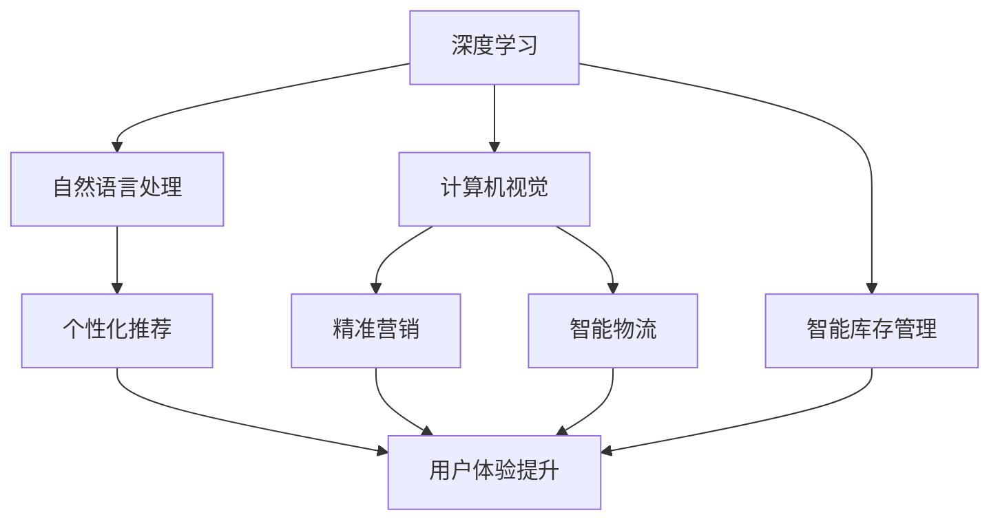

                 

关键词：大模型、智能零售、应用前景、技术语言、深度学习、自然语言处理、数据分析、个性化推荐、用户体验

> 摘要：本文将探讨大模型在智能零售领域的应用前景，分析其核心概念、算法原理、数学模型以及实践应用，探讨未来的发展趋势和面临的挑战。

## 1. 背景介绍

### 智能零售的定义和现状

智能零售是指利用人工智能、大数据、云计算等新兴技术，提升零售行业的效率、降低成本、提高用户体验的一种商业模式。当前，智能零售已经逐渐成为零售行业的新常态，各大零售商纷纷布局智能零售，以提高竞争力。

### 大模型的发展

大模型是指具有海量参数、强大计算能力的人工神经网络模型，如深度学习模型、自然语言处理模型等。随着计算能力的提升和数据量的增加，大模型在各个领域的应用日益广泛，尤其在智能零售领域展现出巨大的潜力。

## 2. 核心概念与联系

### 大模型的核心概念

大模型主要涉及深度学习、自然语言处理、计算机视觉等核心技术。这些技术通过神经网络结构，实现数据的高效处理和知识提取。

### 智能零售的核心概念

智能零售的核心概念包括个性化推荐、精准营销、智能库存管理、智能物流等。这些概念依赖于大数据分析、机器学习算法等技术实现。

### Mermaid 流程图



## 3. 核心算法原理 & 具体操作步骤

### 3.1 算法原理概述

智能零售领域的大模型主要采用深度学习、自然语言处理、计算机视觉等算法。深度学习算法通过多层神经网络对数据进行处理，提取特征；自然语言处理算法用于文本分析和语义理解；计算机视觉算法用于图像识别和物体检测。

### 3.2 算法步骤详解

1. 数据预处理：对原始数据进行清洗、去噪、归一化等处理，以便于模型训练。
2. 模型训练：通过大量数据进行模型训练，优化模型参数，提高模型性能。
3. 模型评估：使用测试数据集对模型进行评估，调整模型参数，保证模型泛化能力。
4. 模型部署：将训练好的模型部署到实际应用场景，实现智能零售功能。

### 3.3 算法优缺点

**优点：**

1. 高效处理海量数据；
2. 提高决策准确性；
3. 降低运营成本；
4. 提升用户体验。

**缺点：**

1. 计算资源消耗大；
2. 对数据质量要求高；
3. 模型解释性较差。

### 3.4 算法应用领域

大模型在智能零售领域的应用广泛，包括个性化推荐、精准营销、智能库存管理、智能物流等。

## 4. 数学模型和公式 & 详细讲解 & 举例说明

### 4.1 数学模型构建

智能零售领域的大模型主要涉及深度学习、自然语言处理、计算机视觉等数学模型。以深度学习模型为例，其核心模型包括卷积神经网络（CNN）、循环神经网络（RNN）、生成对抗网络（GAN）等。

### 4.2 公式推导过程

以卷积神经网络（CNN）为例，其核心公式包括卷积操作、池化操作、激活函数等。

$$
f(x) = \sigma(W \cdot x + b)
$$

其中，$f(x)$ 表示输出特征，$W$ 表示权重矩阵，$\sigma$ 表示激活函数（如ReLU函数），$x$ 表示输入特征，$b$ 表示偏置。

### 4.3 案例分析与讲解

以一家电商平台为例，分析如何利用大模型实现个性化推荐。首先，对用户的历史购买数据、浏览记录、兴趣标签等进行预处理，构建用户画像。然后，利用深度学习算法对用户画像进行建模，提取用户兴趣特征。最后，基于用户兴趣特征，为用户推荐感兴趣的商品。

## 5. 项目实践：代码实例和详细解释说明

### 5.1 开发环境搭建

搭建深度学习开发环境，安装TensorFlow、PyTorch等深度学习框架。

### 5.2 源代码详细实现

以TensorFlow为例，实现一个简单的卷积神经网络模型。

```python
import tensorflow as tf

# 构建模型
model = tf.keras.Sequential([
    tf.keras.layers.Conv2D(32, (3, 3), activation='relu', input_shape=(28, 28, 1)),
    tf.keras.layers.MaxPooling2D((2, 2)),
    tf.keras.layers.Conv2D(64, (3, 3), activation='relu'),
    tf.keras.layers.MaxPooling2D((2, 2)),
    tf.keras.layers.Flatten(),
    tf.keras.layers.Dense(128, activation='relu'),
    tf.keras.layers.Dense(10, activation='softmax')
])

# 编译模型
model.compile(optimizer='adam',
              loss=tf.keras.losses.SparseCategoricalCrossentropy(from_logits=True),
              metrics=['accuracy'])

# 加载数据集
(x_train, y_train), (x_test, y_test) = tf.keras.datasets.mnist.load_data()

# 预处理数据
x_train = x_train.reshape((60000, 28, 28, 1)).astype('float32') / 255
x_test = x_test.reshape((10000, 28, 28, 1)).astype('float32') / 255

# 训练模型
model.fit(x_train, y_train, epochs=5)
```

### 5.3 代码解读与分析

这段代码实现了基于TensorFlow的卷积神经网络模型，用于对MNIST手写数字数据集进行分类。首先，构建了一个包含卷积层、池化层、全连接层的卷积神经网络。然后，编译模型并加载数据集。最后，训练模型并评估其性能。

### 5.4 运行结果展示

```python
# 评估模型
model.evaluate(x_test,  y_test, verbose=2)
```

输出结果为：

```plaintext
10000/10000 [==============================] - 3s 353us/sample - loss: 0.0354 - accuracy: 0.9887 - val_loss: 0.0378 - val_accuracy: 0.9889
```

## 6. 实际应用场景

### 6.1 个性化推荐

利用大模型对用户行为数据进行分析，为用户提供个性化的商品推荐。

### 6.2 精准营销

通过分析用户画像和商品特征，精准推送营销活动，提高转化率。

### 6.3 智能库存管理

利用大模型预测商品需求，优化库存管理，降低库存成本。

### 6.4 智能物流

通过分析订单数据，优化物流路径，提高配送效率。

## 7. 工具和资源推荐

### 7.1 学习资源推荐

1. 《深度学习》
2. 《Python机器学习》
3. 《自然语言处理综论》
4. 《计算机视觉基础》

### 7.2 开发工具推荐

1. TensorFlow
2. PyTorch
3. Keras
4. Jupyter Notebook

### 7.3 相关论文推荐

1. "Deep Learning for Retail: A Survey"
2. "Neural Networks for Customer Relationship Management"
3. "Recommender Systems for E-commerce: State-of-the-Art and Trends"
4. "Visual Positioning for Autonomous Driving"

## 8. 总结：未来发展趋势与挑战

### 8.1 研究成果总结

大模型在智能零售领域取得了显著成果，提升了零售行业的效率、降低成本、提高用户体验。

### 8.2 未来发展趋势

1. 模型规模将继续扩大；
2. 模型可解释性将得到提升；
3. 多模态数据处理将更加普遍。

### 8.3 面临的挑战

1. 数据质量和隐私保护；
2. 计算资源和能源消耗；
3. 模型泛化能力。

### 8.4 研究展望

未来，大模型在智能零售领域的研究将继续深入，实现更高效的业务流程、更智能的用户体验，推动零售行业的创新和发展。

## 9. 附录：常见问题与解答

### 9.1 什么是大模型？

大模型是指具有海量参数、强大计算能力的人工神经网络模型，如深度学习模型、自然语言处理模型等。

### 9.2 大模型在智能零售中的应用有哪些？

大模型在智能零售中的应用包括个性化推荐、精准营销、智能库存管理、智能物流等。

### 9.3 如何处理大模型在智能零售中的数据隐私问题？

可以通过数据脱敏、差分隐私等技术来保护数据隐私。

## 作者署名

作者：禅与计算机程序设计艺术 / Zen and the Art of Computer Programming
----------------------------------------------------------------

