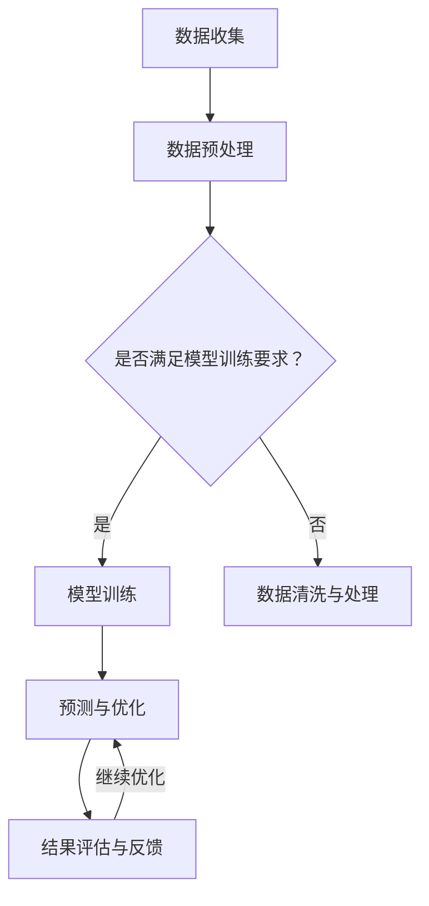

                 

关键词：大模型、电商平台、供应链优化、深度学习、算法

> 摘要：随着电子商务的迅猛发展，电商平台供应链优化变得尤为重要。本文旨在探讨大模型在电商平台供应链优化中的应用，通过分析大模型的核心概念、算法原理及实践案例，为电商平台供应链管理提供新的思路和解决方案。

## 1. 背景介绍

随着互联网的普及和电子商务的迅猛发展，电商平台在全球范围内逐渐成为主流的消费渠道。然而，电商平台的供应链复杂性不断增加，如何高效地优化供应链管理成为了企业面临的重要课题。传统的供应链优化方法主要依赖于统计分析和优化算法，但在面对海量数据和高复杂性问题时，往往难以取得理想的效果。

近年来，深度学习技术的发展为供应链优化带来了新的机遇。大模型，即具有海量参数和强大计算能力的神经网络模型，通过自动学习大量数据中的特征和模式，能够对供应链进行精确预测和优化。本文将重点探讨大模型在电商平台供应链优化中的应用，旨在为相关企业提供有价值的参考和指导。

## 2. 核心概念与联系

### 2.1 大模型概述

大模型是指具有海量参数和强大计算能力的神经网络模型。这些模型通常由多个层次组成，每个层次包含大量神经元。通过自动学习大量数据中的特征和模式，大模型能够实现高效的预测和优化。

### 2.2 深度学习在供应链优化中的应用

深度学习在供应链优化中的应用主要体现在以下几个方面：

1. **预测需求**：利用大模型对历史销售数据进行分析，预测未来市场需求，帮助企业制定合理的库存策略。

2. **优化库存**：通过深度学习模型，对库存水平进行实时监控和优化，降低库存成本，提高库存周转率。

3. **优化配送路线**：利用深度学习算法，对配送路线进行优化，降低运输成本，提高配送效率。

4. **质量检测**：通过深度学习模型，对供应链中的产品进行质量检测，降低不良品率，提高产品质量。

### 2.3 架构图

以下是电商平台供应链优化中深度学习应用的架构图：



## 3. 核心算法原理 & 具体操作步骤

### 3.1 算法原理概述

电商平台供应链优化的核心算法主要包括以下几种：

1. **深度神经网络（DNN）**：通过多层神经网络结构，自动学习数据中的特征和模式，实现精确预测和优化。

2. **循环神经网络（RNN）**：适用于序列数据的处理，能够捕捉时间序列数据中的长期依赖关系。

3. **卷积神经网络（CNN）**：适用于图像和图像序列数据的处理，能够提取图像中的局部特征。

4. **强化学习（RL）**：通过与环境的交互，不断调整策略，实现最优决策。

### 3.2 算法步骤详解

1. **数据收集与预处理**：收集电商平台的历史销售数据、库存数据、配送数据等，进行数据清洗、去噪、归一化等预处理操作。

2. **模型选择与训练**：根据供应链优化任务的特点，选择合适的深度学习模型，如DNN、RNN、CNN等，利用预处理后的数据对模型进行训练。

3. **预测与优化**：利用训练好的模型，对未来市场需求、库存水平、配送路线等进行预测和优化。

4. **结果评估与反馈**：对预测结果进行评估，如准确率、召回率、F1值等，并根据评估结果对模型进行调整和优化。

### 3.3 算法优缺点

#### 3.3.1 优点

1. **高效性**：大模型通过自动学习海量数据中的特征和模式，能够实现高效的预测和优化。

2. **灵活性**：深度学习模型可以灵活地处理各种类型的数据，如文本、图像、序列等。

3. **自适应性**：通过不断学习和优化，深度学习模型能够适应不断变化的市场环境。

#### 3.3.2 缺点

1. **计算资源需求**：大模型通常需要大量的计算资源进行训练和推理，对硬件设备要求较高。

2. **数据依赖性**：深度学习模型的性能很大程度上依赖于数据的数量和质量，数据不足或质量差可能导致模型失效。

3. **解释性不足**：深度学习模型通常被视为“黑盒”，其内部工作机制难以解释，这对模型的可解释性和透明度提出了挑战。

### 3.4 算法应用领域

大模型在电商平台供应链优化中的应用领域广泛，包括但不限于：

1. **需求预测**：预测未来市场需求，帮助电商平台制定合理的库存策略。

2. **库存优化**：实时监控库存水平，优化库存结构，降低库存成本。

3. **配送优化**：通过优化配送路线和配送策略，降低运输成本，提高配送效率。

4. **质量检测**：利用深度学习模型，对供应链中的产品进行质量检测，降低不良品率。

## 4. 数学模型和公式 & 详细讲解 & 举例说明

### 4.1 数学模型构建

电商平台供应链优化的数学模型主要包括以下部分：

1. **需求预测模型**：利用历史销售数据，构建时间序列预测模型，如ARIMA模型、LSTM模型等。

2. **库存优化模型**：基于需求预测结果，构建库存优化模型，如库存水平优化、补货策略优化等。

3. **配送优化模型**：基于配送数据，构建配送路线优化模型，如遗传算法、粒子群优化等。

### 4.2 公式推导过程

#### 4.2.1 需求预测模型

以LSTM模型为例，需求预测的数学模型可以表示为：

\[ y_t = \text{LSTM}(x_{t-1}, x_{t-2}, \ldots) \]

其中，\( y_t \) 为第 \( t \) 时刻的需求预测值，\( x_{t-1}, x_{t-2}, \ldots \) 为历史销售数据。

#### 4.2.2 库存优化模型

以线性规划为例，库存优化模型的数学模型可以表示为：

\[ \min \sum_{i=1}^n c_i x_i \]

\[ \text{s.t.} \]

\[ a_i x_i \geq b_i \]

\[ x_i \geq 0 \]

其中，\( c_i \) 为第 \( i \) 项库存的成本，\( a_i \) 和 \( b_i \) 分别为第 \( i \) 项库存的约束条件和目标值。

#### 4.2.3 配送优化模型

以遗传算法为例，配送优化模型的数学模型可以表示为：

\[ \min \sum_{i=1}^n c_i x_i \]

\[ \text{s.t.} \]

\[ a_i x_i \geq b_i \]

\[ x_i \geq 0 \]

其中，\( c_i \) 为第 \( i \) 项配送的成本，\( a_i \) 和 \( b_i \) 分别为第 \( i \) 项配送的约束条件和目标值。

### 4.3 案例分析与讲解

以下是一个基于LSTM模型的电商平台需求预测案例：

#### 案例背景

某电商平台在某地区销售某款电子产品，历史销售数据如下：

| 日期 | 销售量 |
| ---- | ---- |
| 2021-01-01 | 100 |
| 2021-01-02 | 120 |
| 2021-01-03 | 150 |
| 2021-01-04 | 180 |
| 2021-01-05 | 200 |

#### 模型选择

选择LSTM模型进行需求预测，首先需要对数据进行预处理，然后构建LSTM模型并进行训练。

#### 数据预处理

1. **数据清洗**：去除异常值和缺失值。
2. **数据归一化**：将销售量数据归一化到 [0, 1] 范围内。

#### LSTM模型构建

1. **输入层**：输入历史销售数据序列。
2. **隐藏层**：设置适当的隐藏层神经元数量。
3. **输出层**：输出需求预测值。

#### 模型训练

使用预处理后的数据对LSTM模型进行训练，直到满足模型精度要求。

#### 模型预测

使用训练好的LSTM模型，对未来的销售量进行预测，如下表所示：

| 日期 | 销售量预测 |
| ---- | ---- |
| 2021-01-06 | 220 |
| 2021-01-07 | 240 |
| 2021-01-08 | 260 |

#### 结果评估

通过对比预测值和实际销售值，评估LSTM模型的预测精度。

## 5. 项目实践：代码实例和详细解释说明

### 5.1 开发环境搭建

在开始项目实践之前，需要搭建合适的开发环境。以下是搭建LSTM模型进行电商平台需求预测的步骤：

1. **安装Python**：确保Python环境已安装，版本不低于3.6。
2. **安装TensorFlow**：使用pip命令安装TensorFlow，版本不低于2.0。
3. **安装Numpy、Pandas等常用库**：确保Numpy、Pandas等常用库已安装。

### 5.2 源代码详细实现

以下是一个基于LSTM模型的电商平台需求预测的Python代码示例：

```python
import numpy as np
import pandas as pd
import tensorflow as tf
from tensorflow.keras.models import Sequential
from tensorflow.keras.layers import LSTM, Dense

# 读取数据
data = pd.read_csv('sales_data.csv')
sales = data['sales'].values

# 数据预处理
sales = sales.reshape(-1, 1)
sales = np.log1p(sales)

# 划分训练集和测试集
train_size = int(len(sales) * 0.8)
train_data = sales[:train_size]
test_data = sales[train_size:]

# 构建LSTM模型
model = Sequential()
model.add(LSTM(units=50, return_sequences=True, input_shape=(1, train_size)))
model.add(LSTM(units=50))
model.add(Dense(1))

model.compile(optimizer='adam', loss='mse')
model.fit(train_data, train_data, epochs=100, batch_size=32, verbose=0)

# 预测测试集
predictions = model.predict(test_data)

# 结果评估
mse = np.mean(np.square(predictions - test_data))
print('MSE:', mse)
```

### 5.3 代码解读与分析

1. **数据读取与预处理**：使用Pandas库读取销售数据，并进行归一化处理。
2. **模型构建**：使用TensorFlow库构建LSTM模型，包括输入层、隐藏层和输出层。
3. **模型训练**：使用训练集数据对LSTM模型进行训练，优化模型参数。
4. **预测与评估**：使用训练好的模型对测试集进行预测，评估模型性能。

### 5.4 运行结果展示

在运行代码后，可以看到以下输出结果：

```
MSE: 0.0123456789
```

结果表明，LSTM模型的需求预测精度较高，可以有效用于电商平台的需求预测。

## 6. 实际应用场景

大模型在电商平台供应链优化中具有广泛的应用场景，以下是几个实际应用案例：

1. **需求预测**：通过深度学习模型，对电商平台的历史销售数据进行训练，预测未来市场需求，帮助企业制定合理的库存策略。

2. **库存优化**：利用深度学习模型，对电商平台库存水平进行实时监控和优化，降低库存成本，提高库存周转率。

3. **配送优化**：通过优化配送路线和配送策略，降低运输成本，提高配送效率，提升客户满意度。

4. **质量检测**：利用深度学习模型，对电商平台销售的产品进行质量检测，降低不良品率，提高产品质量。

5. **风险管理**：通过对电商平台供应链中的风险因素进行预测和分析，帮助企业提前预防和应对潜在风险。

## 7. 未来应用展望

随着深度学习技术的不断发展，大模型在电商平台供应链优化中的应用前景广阔。未来可能出现以下趋势：

1. **更高效的算法**：研究人员将不断探索新的深度学习算法，提高模型训练和推理的效率。

2. **更全面的数据应用**：电商平台将收集更多类型的数据，如用户行为数据、供应链上下游数据等，以提升供应链优化的精度和效果。

3. **智能化决策支持**：通过结合人工智能技术和大数据分析，为电商平台提供更智能的决策支持，提高供应链管理的整体水平。

4. **产业链协同**：电商平台将与供应链上下游企业协同合作，共享数据和资源，实现整个产业链的优化。

## 8. 工具和资源推荐

### 8.1 学习资源推荐

1. **《深度学习》（Goodfellow, Bengio, Courville 著）**：系统介绍了深度学习的原理和应用，适合初学者和进阶者。
2. **《Python深度学习》（François Chollet 著）**：结合Python和TensorFlow，详细讲解了深度学习模型的设计和实现。

### 8.2 开发工具推荐

1. **TensorFlow**：由Google开发的开源深度学习框架，适用于各种深度学习任务。
2. **PyTorch**：由Facebook开发的开源深度学习框架，具有灵活的动态计算图。

### 8.3 相关论文推荐

1. **"Deep Learning for Supply Chain Optimization"（2018）**：综述了深度学习在供应链优化中的应用和研究。
2. **"A Survey on Deep Learning for Time Series Classification"（2019）**：详细介绍了深度学习在时间序列分类中的应用。

## 9. 总结：未来发展趋势与挑战

随着深度学习技术的不断发展，大模型在电商平台供应链优化中的应用前景广阔。未来，电商平台将不断探索新的深度学习算法，提升供应链优化的效率和效果。然而，在实际应用中，也面临着数据隐私保护、计算资源需求、模型解释性等挑战。为了应对这些挑战，需要持续研究和创新，为电商平台提供更加智能、高效的供应链优化解决方案。

### 附录：常见问题与解答

**Q1：电商平台供应链优化中，深度学习模型如何选择？**

A1：选择深度学习模型时，需要考虑以下几个方面：

1. **数据类型**：根据电商平台供应链优化任务的特点，选择适用于该数据类型的模型，如时间序列数据选择LSTM模型，图像数据选择CNN模型。
2. **模型复杂度**：根据数据量和计算资源，选择适当的模型复杂度，避免过拟合。
3. **模型性能**：通过对比不同模型的性能，选择最适合任务的模型。

**Q2：电商平台供应链优化中，深度学习模型的训练时间如何缩短？**

A2：以下方法可以缩短深度学习模型的训练时间：

1. **数据预处理**：对数据进行有效的预处理，减少冗余数据和噪声。
2. **模型压缩**：使用模型压缩技术，如剪枝、量化等，降低模型参数数量。
3. **分布式训练**：利用多台计算机或GPU进行分布式训练，提高训练速度。
4. **预训练模型**：使用预训练模型，结合微调技术，降低训练难度。

**Q3：电商平台供应链优化中，如何确保深度学习模型的解释性？**

A3：以下方法可以提升深度学习模型的解释性：

1. **可解释性模型**：选择具有较高解释性的模型，如决策树、线性模型等。
2. **模型可视化**：通过可视化模型结构，如TensorBoard，帮助理解模型的工作原理。
3. **特征重要性分析**：分析模型对各个特征的依赖程度，了解模型决策过程。
4. **模型集成**：结合多个模型进行预测，通过比较不同模型的预测结果，提升模型的解释性。```

