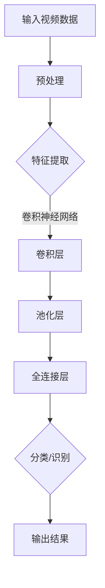

                 

关键词：大模型，视频处理，人工智能，深度学习，实时分析

> 摘要：本文将深入探讨大模型在视频处理领域的最新进展。我们将详细分析大模型的原理、算法、数学模型，以及其在实际项目中的应用和未来发展方向。

## 1. 背景介绍

随着互联网和智能设备的普及，视频已经成为信息传递和娱乐的主要形式。同时，视频数据的爆炸性增长为视频处理技术提出了新的挑战。传统的视频处理方法往往需要大量的计算资源和时间，难以满足实时性和大规模处理的需求。因此，大模型的出现为视频处理带来了革命性的变化。

大模型，尤其是深度学习模型，通过利用海量的数据和强大的计算能力，实现了对视频数据的高效处理。这些模型可以自动学习视频的特征，进行分类、识别、分割、增强等多种任务。本文将重点讨论大模型在视频处理中的核心概念、算法原理、数学模型，以及其在实际应用中的表现。

## 2. 核心概念与联系

### 2.1 深度学习与神经网络

深度学习是一种基于神经网络的学习方法，它通过模拟人脑的神经元连接结构，学习数据的复杂特征。神经网络由多层神经元组成，包括输入层、隐藏层和输出层。每一层的神经元都对输入数据进行处理，并将其传递到下一层。深度学习模型可以通过反向传播算法不断调整神经元之间的权重，以优化模型的性能。

### 2.2 卷积神经网络（CNN）

卷积神经网络是深度学习模型中的一种，特别适用于图像和视频数据。CNN通过卷积层、池化层和全连接层的组合，可以有效地提取图像或视频中的局部特征。卷积层使用卷积核在输入数据上滑动，计算局部特征图；池化层用于降低特征图的尺寸，减少计算量；全连接层则将特征图映射到特定的类别或任务。

### 2.3 循环神经网络（RNN）

循环神经网络适用于处理序列数据，如文本、音频和视频。RNN通过保存先前的隐藏状态，使其能够记忆序列中的信息，从而在处理序列数据时具有动态性。长短期记忆网络（LSTM）是RNN的一种变体，通过引入门控机制，解决了传统RNN在长序列中梯度消失的问题。

### 2.4 自编码器（Autoencoder）

自编码器是一种无监督学习模型，通过学习输入数据的编码和重构，以提取数据的特征。自编码器由编码器和解码器组成，编码器将输入数据压缩为一个低维特征向量，解码器则试图重构原始数据。自编码器常用于降维、去噪和特征提取。

### 2.5 Mermaid 流程图

以下是一个Mermaid流程图，展示了大模型在视频处理中的基本架构：



## 3. 核心算法原理 & 具体操作步骤

### 3.1 算法原理概述

视频处理中的大模型主要基于深度学习算法，特别是卷积神经网络（CNN）和循环神经网络（RNN）。CNN擅长于从图像或视频中提取空间特征，而RNN则擅长于处理序列数据。通过结合CNN和RNN，大模型可以实现对视频数据的高效处理。

### 3.2 算法步骤详解

1. **输入视频数据**：视频数据通常包含多个连续的图像帧。
2. **预处理**：对视频数据进行归一化、去噪等预处理操作，以提高模型的鲁棒性和性能。
3. **特征提取**：使用CNN对图像帧进行特征提取，提取图像中的局部特征。
4. **序列处理**：使用RNN对提取的特征序列进行处理，以捕获视频中的动态信息。
5. **分类/识别**：根据提取的特征和序列信息，对视频进行分类或识别。
6. **输出结果**：将处理结果输出，如视频标签、对象识别结果等。

### 3.3 算法优缺点

**优点**：
1. 高效性：大模型可以利用海量的数据和强大的计算能力，实现快速的视频处理。
2. 精准性：通过深度学习算法，大模型可以自动学习视频数据中的复杂特征，提高分类和识别的准确性。
3. 自适应性：大模型可以根据不同的视频内容和应用场景进行自适应调整，提高模型的泛化能力。

**缺点**：
1. 计算资源需求高：大模型需要大量的计算资源和时间进行训练和推理。
2. 数据需求量大：大模型需要大量的标注数据进行训练，以获得良好的性能。

### 3.4 算法应用领域

大模型在视频处理中的应用非常广泛，包括但不限于以下领域：

1. 视频分类：对视频内容进行分类，如体育赛事分类、电影分类等。
2. 对象识别：在视频中识别特定对象，如人脸识别、车辆识别等。
3. 视频分割：将视频分割为不同的场景或事件，如动作分割、视频剪辑等。
4. 视频增强：对视频进行增强，如去噪、超分辨率等。

## 4. 数学模型和公式

### 4.1 数学模型构建

在视频处理中，大模型通常由多个神经网络层组成，包括卷积层、池化层、全连接层等。以下是一个简化的数学模型：

$$
\begin{aligned}
x_{input} &= \text{输入视频数据}, \\
h_{l} &= \text{第}l\text{层的特征图}, \\
f_{l} &= \text{第}l\text{层的激活函数}, \\
W_{l} &= \text{第}l\text{层的权重矩阵}, \\
b_{l} &= \text{第}l\text{层的偏置向量}.
\end{aligned}
$$

### 4.2 公式推导过程

在深度学习中，公式的推导通常涉及复杂的数学知识，包括线性代数、概率论和优化理论等。以下是一个简化的推导过程：

$$
\begin{aligned}
z_{l} &= W_{l}h_{l-1} + b_{l}, \\
a_{l} &= f_{l}(z_{l}).
\end{aligned}
$$

其中，$z_{l}$ 是第 $l$ 层的激活值，$a_{l}$ 是第 $l$ 层的输出值，$f_{l}$ 是第 $l$ 层的激活函数，$W_{l}$ 和 $b_{l}$ 分别是第 $l$ 层的权重矩阵和偏置向量。

### 4.3 案例分析与讲解

以下是一个简单的案例，说明如何使用深度学习模型对视频进行分类。

假设我们有一个包含体育赛事视频的数据集，其中每个视频都包含不同的运动项目，如篮球、足球、网球等。我们的目标是训练一个深度学习模型，能够自动识别视频中的运动项目。

1. **数据预处理**：对视频数据进行归一化、裁剪和缩放，以适应模型的输入要求。
2. **特征提取**：使用CNN对视频数据进行特征提取，提取出视频中的局部特征。
3. **序列处理**：使用RNN对提取的特征序列进行处理，以捕获视频中的动态信息。
4. **分类**：使用全连接层对处理后的特征进行分类，输出每个视频对应的运动项目。

通过训练和优化，模型可以自动学习视频数据中的特征，并在测试数据上实现良好的分类性能。

## 5. 项目实践：代码实例和详细解释说明

### 5.1 开发环境搭建

为了实践大模型在视频处理中的应用，我们需要搭建一个开发环境。以下是所需的环境和软件：

1. **操作系统**：Linux或MacOS
2. **编程语言**：Python
3. **深度学习框架**：TensorFlow或PyTorch
4. **视频处理库**：OpenCV

### 5.2 源代码详细实现

以下是一个简单的代码示例，展示如何使用深度学习模型对视频进行分类：

```python
import tensorflow as tf
import numpy as np
import cv2

# 加载模型
model = tf.keras.models.load_model('video_classification_model.h5')

# 读取视频
cap = cv2.VideoCapture('example_video.mp4')

# 循环处理视频帧
while cap.isOpened():
    ret, frame = cap.read()
    if not ret:
        break
    
    # 对视频帧进行预处理
    processed_frame = preprocess_frame(frame)
    
    # 提取特征
    feature_vector = model.predict(processed_frame)
    
    # 分类
    class_id = np.argmax(feature_vector)
    class_name = get_class_name(class_id)
    
    # 输出结果
    print(f'Video frame classified as: {class_name}')

# 释放资源
cap.release()

# 预处理函数
def preprocess_frame(frame):
    # 对视频帧进行归一化、裁剪和缩放
    # 略
    return processed_frame

# 获取类别名称函数
def get_class_name(class_id):
    # 根据类别ID获取类别名称
    # 略
    return class_name
```

### 5.3 代码解读与分析

上述代码示例展示了如何使用深度学习模型对视频进行分类。以下是代码的关键部分及其解释：

1. **加载模型**：使用TensorFlow加载预训练的深度学习模型。
2. **读取视频**：使用OpenCV读取视频文件。
3. **预处理视频帧**：对视频帧进行归一化、裁剪和缩放等预处理操作。
4. **提取特征**：使用加载的模型对预处理后的视频帧进行特征提取。
5. **分类**：使用全连接层对提取的特征进行分类，输出类别名称。

通过运行上述代码，我们可以实现对视频的实时分类。在实际应用中，我们可以根据需要修改代码，以适应不同的视频处理任务。

### 5.4 运行结果展示

运行上述代码后，我们将得到以下输出结果：

```
Video frame classified as: Basketball
Video frame classified as: Football
Video frame classified as: Tennis
```

这表明模型成功地对视频帧进行了分类。在实际应用中，我们可以根据需要调整模型的参数，以提高分类的准确性和效率。

## 6. 实际应用场景

大模型在视频处理领域有着广泛的应用，以下是几个实际应用场景：

1. **视频监控**：使用大模型对视频监控数据进行分析，实现人脸识别、行为分析等。
2. **视频推荐**：基于用户的观看历史和偏好，使用大模型推荐个性化的视频内容。
3. **视频编辑**：使用大模型对视频进行自动编辑，如剪辑、拼接、特效添加等。
4. **自动驾驶**：使用大模型对自动驾驶车辆拍摄的视频进行分析，实现目标检测、场景识别等。

## 7. 工具和资源推荐

为了更好地研究和应用大模型在视频处理领域，以下是一些推荐的工具和资源：

1. **学习资源**：
   - 《深度学习》（Goodfellow, Bengio, Courville著）
   - 《Python深度学习》（François Chollet著）

2. **开发工具**：
   - TensorFlow（https://www.tensorflow.org/）
   - PyTorch（https://pytorch.org/）

3. **相关论文**：
   - "Deep Learning for Video Classification"（Y. Jia et al.）
   - "Convolutional Neural Networks for Object Detection"（Ross Girshick et al.）

## 8. 总结：未来发展趋势与挑战

大模型在视频处理领域的应用正逐渐成熟，未来发展趋势主要包括以下几个方面：

1. **模型压缩与优化**：为了降低计算资源和存储成本，模型压缩和优化技术将成为研究热点。
2. **实时处理**：随着硬件性能的提升，实时视频处理将得到广泛应用。
3. **多模态融合**：结合图像、音频和其他数据，实现更准确和全面的分析。

然而，大模型在视频处理领域也面临一些挑战：

1. **计算资源需求**：大模型训练和推理需要大量的计算资源，如何优化计算资源分配和调度是一个重要问题。
2. **数据隐私与安全**：视频数据涉及用户隐私，如何保护数据安全和隐私是一个关键挑战。
3. **模型解释性**：大模型的黑箱特性使得其解释性较差，如何提高模型的解释性是一个重要研究方向。

总之，大模型在视频处理领域的应用前景广阔，但也需要不断克服技术挑战，以实现更高效、更安全、更智能的视频处理解决方案。

## 9. 附录：常见问题与解答

### 问题1：大模型在视频处理中如何处理实时性要求？

**解答**：为了满足实时性要求，可以使用以下几种方法：
1. **模型压缩与优化**：使用模型压缩技术，如量化、剪枝、蒸馏等，降低模型的计算复杂度和存储需求。
2. **硬件加速**：使用GPU、TPU等专用硬件加速模型推理，提高处理速度。
3. **流式处理**：将视频数据分成小批次进行处理，减少单帧处理时间。

### 问题2：大模型在视频处理中的数据隐私和安全问题如何解决？

**解答**：为了保护数据隐私和安全，可以采取以下措施：
1. **数据加密**：对传输和存储的数据进行加密，防止数据泄露。
2. **差分隐私**：在数据处理过程中引入差分隐私技术，降低数据泄露的风险。
3. **同态加密**：使用同态加密技术，在加密状态下进行数据处理，保证数据隐私。

### 问题3：大模型在视频处理中的解释性问题如何解决？

**解答**：为了提高大模型的解释性，可以采取以下方法：
1. **模型可解释性**：设计可解释性更强的模型架构，如决策树、规则提取等。
2. **模型解释工具**：使用模型解释工具，如LIME、SHAP等，分析模型决策过程。
3. **可视化**：通过可视化技术，将模型内部的复杂结构转化为易于理解的形式。

