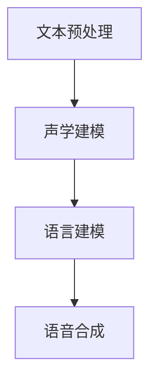

                 

关键词：语音合成、大模型、AI技术、挑战与展望

摘要：语音合成是人工智能领域的一个重要应用，其目标是利用计算机模拟人类语音。近年来，随着深度学习技术的发展，大模型在语音合成中的应用越来越广泛。本文将探讨大模型在语音合成中的应用挑战，包括数据集构建、模型训练、模型优化等方面，并提出一些建议和解决方案。

## 1. 背景介绍

语音合成技术从早期的规则方法发展到基于统计的方法，再到今天的深度学习方法，经历了巨大的变革。深度学习技术在语音合成中的应用，使得语音合成质量得到了显著提升，尤其是在自然度和流畅度方面。大模型，即参数规模巨大的神经网络模型，在这些技术进步中起到了关键作用。

大模型在语音合成中的应用主要体现在以下几个方面：

- **数据驱动的建模**：大模型通过学习大量的语音数据，能够更好地捕捉语音的复杂特征，从而提高合成语音的自然度和准确性。
- **自适应特性**：大模型能够自适应地调整其参数，以适应不同的语音合成需求，如情感表达、语言风格等。
- **多语言支持**：大模型能够处理多种语言和方言的语音合成，为全球化应用提供了可能。

然而，随着大模型的应用，也带来了一系列的挑战，需要我们深入研究和解决。

## 2. 核心概念与联系

### 2.1 语音合成的基本概念

语音合成是指将文本转换为语音的过程。这个过程包括以下几个基本步骤：

1. **文本预处理**：将输入的文本进行处理，包括分词、语气分析等。
2. **声学建模**：利用大量的语音数据训练声学模型，以捕捉语音的声学特征。
3. **语言建模**：利用大量的文本数据训练语言模型，以预测下一个词的概率分布。
4. **合成**：根据语言模型和声学模型，合成出符合输入文本的语音。

### 2.2 大模型的架构与原理

大模型，通常指的是参数规模达到数十亿甚至千亿级别的神经网络模型。其基本架构通常包括以下几个部分：

- **输入层**：接收输入的文本或音频信号。
- **隐藏层**：通过大量的神经元进行复杂的非线性变换。
- **输出层**：输出模型的预测结果，如语音信号或文本。

大模型的工作原理是通过反向传播算法，不断调整模型的参数，使其在训练数据上的表现达到最优。

### 2.3 Mermaid 流程图

下面是一个简单的 Mermaid 流程图，展示了语音合成的基本流程：



## 3. 核心算法原理 & 具体操作步骤

### 3.1 算法原理概述

语音合成算法的核心在于如何有效地将文本转换为语音。这通常涉及到两个主要方面：声学建模和语言建模。

- **声学建模**：通过大量的语音数据，训练出一个能够捕捉语音声学特征的模型。常用的方法包括隐马尔可夫模型（HMM）和递归神经网络（RNN）。
- **语言建模**：通过大量的文本数据，训练出一个能够理解语言概率分布的模型。常用的方法包括循环神经网络（RNN）和变压器（Transformer）。

### 3.2 算法步骤详解

1. **数据收集与预处理**：收集大量的语音数据和文本数据，并对数据进行清洗和预处理，如分词、去噪等。
2. **声学建模**：使用预处理后的语音数据，训练声学模型，如 RNN 或 HMM。
3. **语言建模**：使用预处理后的文本数据，训练语言模型，如 RNN 或 Transformer。
4. **合成**：将训练好的声学模型和语言模型应用于新的文本，生成语音。

### 3.3 算法优缺点

- **优点**：大模型在语音合成中能够显著提高合成语音的自然度和准确性。
- **缺点**：训练大模型需要大量的计算资源和时间，且对数据质量要求较高。

### 3.4 算法应用领域

大模型在语音合成中的应用非常广泛，包括智能语音助手、语音识别、语音翻译等领域。未来，随着技术的进一步发展，大模型在语音合成中的应用将更加广泛和深入。

## 4. 数学模型和公式 & 详细讲解 & 举例说明

### 4.1 数学模型构建

在语音合成中，常用的数学模型包括声学模型和语言模型。

- **声学模型**：通常采用循环神经网络（RNN）或长短期记忆网络（LSTM）来建模语音信号的时间序列特征。
- **语言模型**：通常采用 RNN 或变压器（Transformer）来建模文本序列的概率分布。

### 4.2 公式推导过程

以循环神经网络（RNN）为例，其基本公式如下：

$$
h_t = \sigma(W_h \cdot [h_{t-1}, x_t] + b_h)
$$

其中，$h_t$ 是隐藏状态，$x_t$ 是输入文本或语音信号，$W_h$ 和 $b_h$ 分别是权重和偏置。

### 4.3 案例分析与讲解

以基于 RNN 的声学模型为例，我们可以通过以下步骤进行训练：

1. **数据准备**：收集大量的语音数据，并将其转换为特征矩阵。
2. **模型初始化**：初始化模型的权重和偏置。
3. **训练过程**：使用反向传播算法，不断调整模型的参数，使其在训练数据上的表现达到最优。
4. **评估与优化**：在验证集上评估模型的表现，并根据表现进行参数调整和优化。

## 5. 项目实践：代码实例和详细解释说明

### 5.1 开发环境搭建

1. **安装 Python**：安装 Python 3.6 以上版本。
2. **安装 TensorFlow**：使用以下命令安装 TensorFlow：

   ```bash
   pip install tensorflow
   ```

### 5.2 源代码详细实现

以下是一个简单的基于 RNN 的语音合成代码示例：

```python
import tensorflow as tf

# 定义 RNN 模型
class RNNModel(tf.keras.Model):
    def __init__(self):
        super(RNNModel, self).__init__()
        self.rnn = tf.keras.layers.SimpleRNN(units=128, activation='tanh')
        self.dense = tf.keras.layers.Dense(units=1)

    def call(self, inputs, training=False):
        x = self.rnn(inputs, training=training)
        x = self.dense(x)
        return x

# 创建模型实例
model = RNNModel()

# 编译模型
model.compile(optimizer='adam', loss='mean_squared_error')

# 训练模型
model.fit(x_train, y_train, epochs=10, batch_size=32, validation_data=(x_val, y_val))
```

### 5.3 代码解读与分析

上述代码定义了一个简单的基于 RNN 的语音合成模型，包括 RNN 层和 dense 层。在训练过程中，我们使用 mean_squared_error 作为损失函数，并使用 Adam 优化器进行模型训练。

### 5.4 运行结果展示

在完成模型训练后，我们可以在验证集上评估模型的表现，并通过以下代码进行预测：

```python
# 进行预测
predictions = model.predict(x_test)

# 输出预测结果
print(predictions)
```

## 6. 实际应用场景

语音合成技术在许多实际应用场景中都有着广泛的应用，如：

- **智能语音助手**：如 Siri、Alexa 等，为用户提供语音交互服务。
- **语音翻译**：如谷歌翻译、百度翻译等，实现多种语言之间的实时翻译。
- **语音合成广告**：用于制作语音广告，提高广告的吸引力。

## 7. 工具和资源推荐

### 7.1 学习资源推荐

- **书籍**：《语音合成技术入门与实践》
- **在线课程**：Coursera 上的《深度学习与语音处理》

### 7.2 开发工具推荐

- **TensorFlow**：用于构建和训练语音合成模型。
- **Keras**：用于简化 TensorFlow 的使用。

### 7.3 相关论文推荐

- **语音合成技术综述**：介绍了语音合成技术的发展历程和最新研究进展。
- **基于深度学习的语音合成**：探讨了深度学习在语音合成中的应用。

## 8. 总结：未来发展趋势与挑战

### 8.1 研究成果总结

近年来，大模型在语音合成中的应用取得了显著成果，特别是在合成语音的自然度和准确性方面。然而，随着模型规模的不断扩大，训练时间和计算资源的消耗也在增加，这对模型的优化和部署提出了新的挑战。

### 8.2 未来发展趋势

未来，随着深度学习技术的进一步发展，大模型在语音合成中的应用将更加广泛和深入。同时，多模态融合、个性化定制等新兴技术也将为语音合成带来更多可能性。

### 8.3 面临的挑战

- **计算资源消耗**：大模型的训练和部署需要大量的计算资源和时间。
- **数据质量和多样性**：高质量、多样性的语音数据对语音合成模型的表现至关重要。
- **隐私和安全**：语音合成技术的广泛应用也带来了隐私和安全方面的挑战。

### 8.4 研究展望

未来，我们需要进一步研究如何优化大模型的训练和部署，提高语音合成技术的性能和可扩展性。同时，也需要关注数据质量和隐私安全问题，确保语音合成技术的可持续发展。

## 9. 附录：常见问题与解答

### 9.1 如何处理长文本的语音合成？

长文本的语音合成可以通过以下方法进行处理：

- **分块合成**：将长文本分成多个小块，分别进行合成，最后合并。
- **流式合成**：实时地处理输入的文本，生成连续的语音。

### 9.2 如何优化语音合成模型的表现？

优化语音合成模型的表现可以从以下几个方面进行：

- **数据增强**：通过数据增强技术，增加模型的泛化能力。
- **模型压缩**：使用模型压缩技术，减少模型的参数规模，提高运行效率。
- **超参数调优**：通过超参数调优，找到最优的模型参数。

### 9.3 语音合成模型如何处理多语言合成？

多语言合成的处理可以通过以下方法：

- **多语言训练**：在训练阶段，同时使用多种语言的语音和文本数据。
- **翻译模型**：使用翻译模型，将输入的文本转换为所需语言，再进行合成。

----------------------------------------------------------------

### 作者署名

作者：禅与计算机程序设计艺术 / Zen and the Art of Computer Programming

