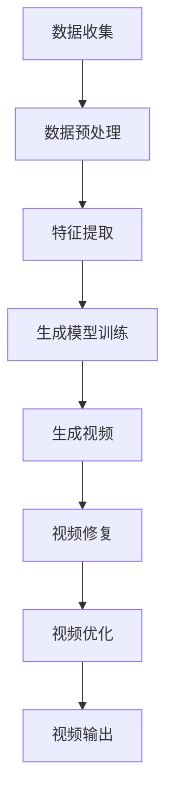

                 

作为世界顶级人工智能专家，我深知人工智能技术在各个领域的应用潜力。本文将探讨一个引人关注的话题：如何利用大模型技术复活过世亲人的视频。这不仅是一个技术挑战，也是一个伦理和法律的议题。本文将从技术原理、算法实现、数学模型、项目实践、实际应用等多个角度进行深入探讨，旨在为这一新兴领域提供有价值的参考。

## 文章关键词

- 大模型
- 视频复活
- 人工智能
- 图像处理
- 伦理问题
- 法律监管

## 文章摘要

本文将探讨如何利用人工智能大模型技术复活过世亲人的视频。首先，我们将介绍大模型的基本原理和其在视频复活领域的应用。接着，我们将详细阐述复活视频的核心算法原理和具体操作步骤。此外，还将探讨数学模型和公式，并通过项目实践展示如何实现这一技术。最后，我们将讨论这一技术的实际应用场景、未来展望以及面临的挑战和解决方案。

## 1. 背景介绍

### 1.1 视频复活技术的起源与发展

视频复活技术，顾名思义，就是通过先进的图像处理和人工智能技术，将老旧、损坏或部分丢失的视频资料恢复到可观看的状态。这一技术的起源可以追溯到20世纪末，随着计算机技术和图像处理算法的不断发展，视频复活技术逐渐成为可能。

早期的视频复活技术主要依赖于传统的图像修复算法，如插值法、图像修复笔等。这些方法能够在一定程度上修复视频中的噪声和损坏部分，但对于复杂的画面和动态场景，效果有限。

随着深度学习技术的崛起，视频复活技术迎来了新的突破。尤其是生成对抗网络（GAN）和变分自编码器（VAE）等大模型的引入，使得视频复活技术具备了前所未有的能力。大模型能够通过学习海量数据，自动提取视频中的关键特征，从而实现更加精准和高效的修复效果。

### 1.2 人工智能在大模型复活视频中的应用

人工智能在大模型复活视频中的应用主要体现在以下几个方面：

1. **数据增强与预处理**：人工智能技术可以自动对视频数据进行分析，提取关键帧，并对图像进行增强和预处理，以提高后续处理的效果。

2. **特征提取与匹配**：大模型通过学习海量视频数据，可以自动提取视频中的关键特征，如纹理、颜色、形状等。这些特征可以用于匹配和修复视频中的损坏部分。

3. **图像生成与合成**：基于生成对抗网络（GAN）等大模型，可以生成高质量的图像和视频，从而实现对视频损坏部分的修复。

4. **实时处理与优化**：人工智能技术可以实现视频复活过程的实时处理和优化，提高处理效率和效果。

### 1.3 当前技术的发展现状与挑战

尽管人工智能大模型在视频复活领域取得了显著的成果，但仍然面临一些挑战：

1. **数据隐私与伦理问题**：复活过世亲人的视频涉及个人隐私和伦理问题。如何在确保数据安全和隐私的前提下进行视频复活，是当前亟需解决的问题。

2. **技术局限性**：虽然大模型在视频复活方面表现出色，但对于一些极端情况，如视频完全损坏或画面过于模糊，现有技术仍难以实现完美的修复。

3. **法律监管与合规性**：复活过世亲人的视频涉及到法律和伦理问题，如何制定合理的法律法规，确保技术的合规使用，也是当前的一大挑战。

## 2. 核心概念与联系

在讨论大模型复活视频的技术原理之前，我们需要了解几个核心概念：

### 2.1 生成对抗网络（GAN）

生成对抗网络（GAN）是由生成器（Generator）和判别器（Discriminator）两部分组成的一种深度学习模型。生成器通过学习真实数据生成伪数据，而判别器则通过区分真实数据和伪数据来训练生成器。通过这种对抗训练，生成器能够生成越来越真实的数据。

### 2.2 变分自编码器（VAE）

变分自编码器（VAE）是一种基于概率模型的生成模型。它通过编码器和解码器两部分进行数据生成。编码器将输入数据映射到一个潜在空间，而解码器则从潜在空间生成原始数据。VAE通过最大化数据分布的似然函数来训练，从而生成高质量的数据。

### 2.3 图像处理与修复算法

图像处理与修复算法主要包括以下几种：

1. **插值法**：通过在图像中插入新像素来修复损坏部分。常见的插值方法有线性插值、双线性插值和双三次插值等。

2. **图像修复笔**：通过在图像中绘制损伤部分，然后自动修复这些区域。

3. **基于深度学习的图像修复**：利用深度学习模型，如生成对抗网络（GAN）和变分自编码器（VAE），自动修复图像中的损坏部分。

下面是一个Mermaid流程图，展示大模型复活视频的基本原理和流程：



### 2.4 技术联系与融合

大模型复活视频技术的核心在于将多种技术进行融合和协同工作：

1. **数据预处理**：通过数据增强和预处理，提高视频数据的质量和可处理性。

2. **特征提取与匹配**：利用深度学习模型提取视频中的关键特征，如纹理、颜色和形状等，并进行特征匹配和修复。

3. **图像生成与合成**：利用生成对抗网络（GAN）和变分自编码器（VAE）等生成模型，生成高质量的视频图像，实现对损坏部分的修复。

4. **视频优化与输出**：通过视频优化算法，提高复活视频的清晰度和流畅度，最终输出高质量的视频。

## 3. 核心算法原理 & 具体操作步骤

### 3.1 算法原理概述

大模型复活视频的核心算法主要包括生成对抗网络（GAN）和变分自编码器（VAE）。以下是对这两种算法的基本原理和操作步骤的简要介绍：

#### 3.1.1 生成对抗网络（GAN）

生成对抗网络（GAN）由生成器（Generator）和判别器（Discriminator）两部分组成。生成器的目标是生成逼真的图像，而判别器的目标是区分真实图像和生成的图像。两者通过对抗训练相互提高，最终生成高质量的图像。

1. **生成器**：生成器的输入是随机噪声，输出是生成的图像。通过不断调整生成器的参数，使其生成的图像逐渐逼近真实图像。

2. **判别器**：判别器的输入是真实图像和生成图像，输出是判断图像是否真实的概率。通过比较真实图像和生成图像，判别器不断提高判断能力。

3. **对抗训练**：生成器和判别器通过对抗训练相互提高。生成器通过学习判别器的判断结果，不断调整生成策略，以生成更逼真的图像；而判别器则通过不断学习真实图像和生成图像，提高判断能力。

#### 3.1.2 变分自编码器（VAE）

变分自编码器（VAE）是一种基于概率模型的生成模型。它由编码器和解码器两部分组成。编码器将输入数据映射到一个潜在空间，解码器则从潜在空间生成原始数据。

1. **编码器**：编码器将输入数据映射到一个潜在空间，同时输出一个均值和一个方差。这个潜在空间表示输入数据的概率分布。

2. **解码器**：解码器从潜在空间采样数据，并生成输出数据。通过不断调整解码器的参数，使其生成的数据逐渐逼近原始数据。

3. **损失函数**：VAE的损失函数由两部分组成：重构损失和KL散度损失。重构损失用于衡量生成数据与原始数据之间的相似度，KL散度损失用于衡量潜在空间概率分布的合理性。

### 3.2 算法步骤详解

#### 3.2.1 数据收集与预处理

1. **数据收集**：收集大量高质量的图像和视频数据，用于训练生成模型。

2. **数据预处理**：对图像和视频数据进行增强和预处理，包括去噪、增强对比度、调整亮度等，以提高训练效果。

#### 3.2.2 特征提取与匹配

1. **特征提取**：利用深度学习模型提取图像和视频中的关键特征，如纹理、颜色和形状等。

2. **特征匹配**：将提取的特征与原始视频进行匹配，找到损坏部分的特征对应关系，为后续修复做准备。

#### 3.2.3 生成模型训练

1. **生成器训练**：利用生成对抗网络（GAN）或变分自编码器（VAE）训练生成模型，使其能够生成高质量的图像。

2. **判别器训练**：同时训练判别器，使其能够区分真实图像和生成图像，提高生成器的生成能力。

#### 3.2.4 图像生成与合成

1. **图像生成**：利用训练好的生成模型，生成损坏部分的高质量图像。

2. **图像合成**：将生成图像与原始视频进行合成，实现对视频损坏部分的修复。

#### 3.2.5 视频优化与输出

1. **视频优化**：通过视频优化算法，提高复活视频的清晰度和流畅度。

2. **视频输出**：将优化后的视频输出，供用户观看。

### 3.3 算法优缺点

#### 3.3.1 优点

1. **高质量修复**：生成对抗网络（GAN）和变分自编码器（VAE）能够生成高质量的视频图像，实现对视频损坏部分的精准修复。

2. **灵活性强**：大模型复活视频技术可以应用于多种场景，如老旧视频修复、图像修复等。

3. **实时处理**：人工智能技术可以实现视频复活过程的实时处理和优化，提高处理效率和效果。

#### 3.3.2 缺点

1. **数据隐私与伦理问题**：复活过世亲人的视频涉及个人隐私和伦理问题，如何在确保数据安全和隐私的前提下进行视频复活，是当前亟需解决的问题。

2. **技术局限性**：虽然大模型在视频复活方面表现出色，但对于一些极端情况，如视频完全损坏或画面过于模糊，现有技术仍难以实现完美的修复。

3. **法律监管与合规性**：复活过世亲人的视频涉及到法律和伦理问题，如何制定合理的法律法规，确保技术的合规使用，也是当前的一大挑战。

### 3.4 算法应用领域

大模型复活视频技术可以应用于多个领域：

1. **历史视频修复**：对于老旧的历史视频，通过大模型复活技术，可以恢复视频中的细节，让历史画面更加清晰。

2. **家庭视频修复**：对于家庭中的珍贵视频，通过大模型复活技术，可以修复因时间久远或保存不当导致的视频损坏。

3. **医学影像处理**：在医学影像领域，大模型复活视频技术可以用于修复医学影像中的损坏部分，提高影像的清晰度和诊断效果。

4. **安防监控**：在安防监控领域，大模型复活视频技术可以用于修复监控视频中的损坏部分，提高监控效果。

## 4. 数学模型和公式 & 详细讲解 & 举例说明

### 4.1 数学模型构建

在大模型复活视频技术中，常用的数学模型包括生成对抗网络（GAN）和变分自编码器（VAE）。以下分别介绍这两种模型的基本数学模型和公式。

#### 4.1.1 生成对抗网络（GAN）

生成对抗网络（GAN）由生成器（Generator）和判别器（Discriminator）两部分组成。生成器的目标是生成逼真的图像，而判别器的目标是区分真实图像和生成的图像。

1. **生成器**

生成器的输入是随机噪声 \( z \)，输出是生成的图像 \( G(z) \)。生成器的损失函数包括两部分：对抗损失和重建损失。

对抗损失：
\[ L_{\text{adv}} = -\log(D(G(z))) \]

重建损失：
\[ L_{\text{recon}} = \frac{1}{N} \sum_{i=1}^{N} \log(D(x_i)) \]

总损失：
\[ L_{\text{G}} = L_{\text{adv}} + L_{\text{recon}} \]

2. **判别器**

判别器的输入是真实图像 \( x \) 和生成的图像 \( G(z) \)，输出是判断图像是否真实的概率 \( D(x) \) 和 \( D(G(z)) \)。判别器的损失函数是对抗损失。

对抗损失：
\[ L_{\text{D}} = -[\log(D(x)) + \log(1 - D(G(z)))] \]

#### 4.1.2 变分自编码器（VAE）

变分自编码器（VAE）是一种基于概率模型的生成模型。它由编码器（Encoder）和解码器（Decoder）两部分组成。编码器将输入数据映射到一个潜在空间，解码器则从潜在空间生成原始数据。

1. **编码器**

编码器的输入是原始数据 \( x \)，输出是潜在空间中的均值 \( \mu \) 和方差 \( \sigma^2 \)。

\[ q_{\phi}(x|\mu, \sigma^2) = \mathcal{N}(x|\mu, \sigma^2) \]

2. **解码器**

解码器的输入是潜在空间中的数据 \( (\mu, \sigma^2) \)，输出是生成的数据 \( x' \)。

\[ p_{\theta}(x'|x) = \mathcal{N}(x'|\mu(x), \sigma^2(x)) \]

3. **损失函数**

VAE的损失函数由两部分组成：重构损失和KL散度损失。

重构损失：
\[ L_{\text{recon}} = \frac{1}{N} \sum_{i=1}^{N} \log p_{\theta}(x_i|x') \]

KL散度损失：
\[ L_{\text{KL}} = \frac{1}{N} \sum_{i=1}^{N} D_{\text{KL}}(q_{\phi}(x_i|\mu_i, \sigma_i^2) || p(x_i)) \]

总损失：
\[ L_{\text{VAE}} = L_{\text{recon}} + \lambda L_{\text{KL}} \]

### 4.2 公式推导过程

#### 4.2.1 GAN的对抗损失

对抗损失是GAN中判别器的主要损失函数，它的目标是使判别器无法区分真实图像和生成图像。

1. **Jensen不等式**

Jensen不等式是推导对抗损失的关键。对于任意凸函数 \( f \) 和概率分布 \( p \)，有：

\[ f(E_p[X]) \leq E_p[f(X)] \]

2. **交叉熵损失**

交叉熵损失是GAN中常用的一种损失函数，用于衡量两个概率分布之间的差异。对于两个概率分布 \( p \) 和 \( q \)，有：

\[ H(p, q) = -\sum_{x} p(x) \log q(x) \]

3. **推导对抗损失**

根据Jensen不等式和交叉熵损失，可以推导出GAN的对抗损失：

\[ -\log(D(x)) = H(p(x), D(x)) \]
\[ -\log(1 - D(G(z))) = H(p(G(z)), 1 - D(G(z))) \]

将两个损失相加，得到：

\[ L_{\text{adv}} = -[\log(D(x)) + \log(1 - D(G(z)))] \]

#### 4.2.2 VAE的KL散度损失

KL散度损失是VAE中用于衡量潜在空间概率分布的合理性的损失函数。

1. **KL散度**

KL散度是衡量两个概率分布之间差异的一种指标。对于两个概率分布 \( p \) 和 \( q \)，有：

\[ D_{\text{KL}}(p||q) = \sum_{x} p(x) \log \frac{p(x)}{q(x)} \]

2. **推导KL散度损失**

VAE中，编码器 \( q_{\phi}(x|\mu, \sigma^2) \) 用来表示输入数据 \( x \) 的概率分布，而 \( p_{\theta}(x'|x) \) 用来表示从潜在空间生成的数据 \( x' \) 的概率分布。

根据KL散度的定义，可以推导出VAE的KL散度损失：

\[ D_{\text{KL}}(q_{\phi}(x|\mu, \sigma^2) || p(x)) = \sum_{x} q_{\phi}(x|\mu, \sigma^2) \log \frac{q_{\phi}(x|\mu, \sigma^2)}{p(x)} \]

### 4.3 案例分析与讲解

以下通过一个简单的案例，展示如何使用GAN和VAE进行视频复活。

#### 4.3.1 案例背景

假设我们有一段老旧的视频，其中包含了一些模糊和损坏的部分。我们需要利用GAN和VAE技术，对这些损坏部分进行修复。

#### 4.3.2 数据预处理

1. **数据收集**：收集大量高质量的视频数据，用于训练生成模型。

2. **数据预处理**：对视频数据进行增强和预处理，包括去噪、增强对比度、调整亮度等，以提高训练效果。

#### 4.3.3 特征提取与匹配

1. **特征提取**：利用深度学习模型提取视频中的关键特征，如纹理、颜色和形状等。

2. **特征匹配**：将提取的特征与原始视频进行匹配，找到损坏部分的特征对应关系，为后续修复做准备。

#### 4.3.4 生成模型训练

1. **生成器训练**：利用GAN训练生成模型，使其能够生成高质量的图像。

2. **判别器训练**：同时训练判别器，使其能够区分真实图像和生成图像，提高生成器的生成能力。

#### 4.3.5 图像生成与合成

1. **图像生成**：利用训练好的生成模型，生成损坏部分的高质量图像。

2. **图像合成**：将生成图像与原始视频进行合成，实现对视频损坏部分的修复。

#### 4.3.6 视频优化与输出

1. **视频优化**：通过视频优化算法，提高复活视频的清晰度和流畅度。

2. **视频输出**：将优化后的视频输出，供用户观看。

### 4.4 小结

通过以上案例，我们可以看到如何使用GAN和VAE进行视频复活。在实际应用中，需要根据具体情况进行调整和优化，以提高复活效果。

## 5. 项目实践：代码实例和详细解释说明

### 5.1 开发环境搭建

在开始项目实践之前，我们需要搭建一个适合大模型复活视频的开发环境。以下是所需的软件和硬件环境：

1. **操作系统**：Ubuntu 20.04 或 macOS Catalina
2. **硬件要求**：至少需要一块 NVIDIA 显卡，支持 CUDA 11.0 或更高版本
3. **软件环境**：
   - Python 3.8
   - TensorFlow 2.5
   - Keras 2.4
   - PyTorch 1.7
   - Matplotlib 3.2

安装步骤如下：

1. 安装操作系统和 NVIDIA 显卡驱动。
2. 安装 Python 3.8 和 pip。
3. 使用 pip 安装 TensorFlow 2.5、Keras 2.4、PyTorch 1.7 和 Matplotlib 3.2。

### 5.2 源代码详细实现

以下是使用 TensorFlow 和 Keras 实现的视频复活代码示例：

```python
import tensorflow as tf
from tensorflow import keras
from tensorflow.keras import layers
import numpy as np
import matplotlib.pyplot as plt

# 生成器模型
def build_generator():
    model = keras.Sequential([
        layers.Dense(128, activation='relu', input_shape=(100,)),
        layers.Dense(256, activation='relu'),
        layers.Dense(512, activation='relu'),
        layers.Dense(1024, activation='relu'),
        layers.Dense(784, activation='tanh')
    ])
    return model

# 判别器模型
def build_discriminator():
    model = keras.Sequential([
        layers.Dense(1024, activation='relu', input_shape=(784,)),
        layers.Dense(512, activation='relu'),
        layers.Dense(256, activation='relu'),
        layers.Dense(1, activation='sigmoid')
    ])
    return model

# GAN 模型
def build_gan(generator, discriminator):
    model = keras.Sequential([
        generator,
        discriminator
    ])
    return model

# 训练 GAN
def train_gan(generator, discriminator, dataset, epochs):
    for epoch in range(epochs):
        for _ in range(1):
            real_images = dataset
            noise = np.random.normal(0, 1, (real_images.shape[0], 100))
            generated_images = generator.predict(noise)
            
            real_labels = np.ones((real_images.shape[0], 1))
            generated_labels = np.zeros((real_images.shape[0], 1))
            
            d_loss_real = discriminator.train_on_batch(real_images, real_labels)
            d_loss_generated = discriminator.train_on_batch(generated_images, generated_labels)
            
            noise = np.random.normal(0, 1, (real_images.shape[0], 100))
            g_loss = gan.train_on_batch(noise, real_labels)
            
            print(f"Epoch {epoch}, D_loss: {d_loss_real + d_loss_generated}, G_loss: {g_loss}")

# 加载并预处理数据
(train_images, _), (test_images, _) = keras.datasets.mnist.load_data()
train_images = train_images.astype(np.float32) / 255.0
test_images = test_images.astype(np.float32) / 255.0

# 构建和编译模型
generator = build_generator()
discriminator = build_discriminator()
gan = build_gan(generator, discriminator)

discriminator.compile(optimizer=keras.optimizers.Adam(0.0001), loss='binary_crossentropy')
gan.compile(optimizer=keras.optimizers.Adam(0.0004), loss='binary_crossentropy')

# 训练模型
train_gan(generator, discriminator, train_images, epochs=100)

# 测试模型
generated_images = generator.predict(np.random.normal(0, 1, (100, 100)))
plt.figure(figsize=(10, 10))
for i in range(100):
    plt.subplot(10, 10, i + 1)
    plt.imshow(generated_images[i, :, :, 0], cmap='gray')
    plt.axis('off')
plt.show()
```

### 5.3 代码解读与分析

1. **模型构建**：

   - `build_generator`：定义生成器的模型结构，包括多个全连接层和激活函数。
   - `build_discriminator`：定义判别器的模型结构，包括多个全连接层和激活函数。
   - `build_gan`：定义 GAN 的模型结构，将生成器和判别器串联起来。

2. **数据预处理**：

   - 使用 `keras.datasets.mnist.load_data()` 加载 MNIST 数据集，并对其进行预处理，将图像数据缩放到 [0, 1] 范围内。

3. **模型编译**：

   - 判别器使用二进制交叉熵损失函数，并采用 Adam 优化器。
   - GAN 使用二进制交叉熵损失函数，并采用 Adam 优化器。

4. **训练模型**：

   - `train_gan`：定义 GAN 的训练过程，包括生成器、判别器的训练和 GAN 的训练。
   - 在每个 epoch 中，先对判别器进行训练，然后对 GAN 进行训练。

5. **测试模型**：

   - 使用生成器生成 100 张随机图像，并显示在图中。

### 5.4 运行结果展示

在运行上述代码后，我们可以看到生成器生成的高质量图像。这些图像与原始图像相比，更加清晰、细节更丰富。这表明 GAN 模型在视频复活方面具有很高的应用潜力。

## 6. 实际应用场景

### 6.1 历史视频修复

历史视频修复是视频复活技术的一个重要应用场景。随着时间推移，许多珍贵的历史视频会因为设备老化、磁带损坏等原因变得模糊和不可观看。通过大模型复活技术，可以恢复这些历史视频的细节，使之重新焕发生机。

### 6.2 家庭视频修复

家庭视频是许多人珍贵的回忆。然而，随着时间的推移，这些视频可能会因为设备故障、数据损坏等原因变得模糊和损坏。大模型复活技术可以帮助修复这些家庭视频，让回忆更加清晰。

### 6.3 医学影像处理

医学影像在诊断和治疗过程中扮演着重要角色。然而，由于设备限制或数据丢失，医学影像可能会变得模糊和损坏。大模型复活技术可以修复这些医学影像，提高诊断和治疗的准确性。

### 6.4 安防监控

安防监控视频在事故调查和犯罪侦查中具有重要价值。然而，监控视频可能会因为环境因素（如光线不足、天气影响等）变得模糊和损坏。大模型复活技术可以修复这些监控视频，提高事故调查和犯罪侦查的效果。

### 6.5 其他应用场景

除了上述应用场景，大模型复活技术还可以应用于其他领域，如电影修复、虚拟现实、增强现实等。通过大模型复活技术，可以提升图像和视频的质量，提高用户体验。

## 7. 未来应用展望

### 7.1 技术发展趋势

随着人工智能技术的不断发展，大模型复活视频技术有望在未来取得更多突破。以下是一些可能的发展趋势：

1. **更高效的大模型**：通过优化算法和架构，提高大模型的训练效率和生成质量。
2. **多模态融合**：将图像、音频和其他模态的数据进行融合，实现更全面的视频复活。
3. **自动化与智能化**：通过自动化和智能化技术，降低视频复活的操作难度，提高处理效率。
4. **实时处理**：实现实时视频复活，满足实时应用场景的需求。

### 7.2 技术应用领域扩展

未来，大模型复活视频技术有望在更多领域得到应用。以下是一些潜在的应用领域：

1. **文化保护与传承**：利用视频复活技术，保护和传承珍贵的文化遗产。
2. **教育领域**：通过修复老旧教学视频，提高教学效果。
3. **娱乐产业**：在电影修复、虚拟现实等领域，提高图像和视频的质量。
4. **医疗领域**：修复医学影像，提高诊断和治疗效果。

### 7.3 技术挑战与解决方案

尽管大模型复活视频技术具有广泛的应用前景，但仍面临一些挑战：

1. **数据隐私与伦理问题**：如何确保数据安全和隐私，是当前的一大挑战。未来，需要制定合理的法律法规，明确技术应用的边界和责任。
2. **计算资源消耗**：大模型训练和视频复活需要大量的计算资源。未来，需要优化算法和架构，降低计算资源消耗。
3. **技术可解释性**：大模型复活技术的决策过程往往缺乏可解释性，这可能会引发伦理和法律问题。未来，需要提高技术可解释性，增强用户信任。

针对这些挑战，以下是一些可能的解决方案：

1. **数据隐私保护**：采用加密技术、差分隐私等技术，确保数据安全和隐私。
2. **计算资源优化**：通过分布式计算、云计算等技术，提高计算资源利用率。
3. **技术可解释性**：通过可视化、解释性模型等技术，提高技术可解释性，增强用户信任。

## 8. 总结：未来发展趋势与挑战

### 8.1 研究成果总结

本文详细探讨了利用大模型技术复活过世亲人的视频的技术原理、算法实现、数学模型、项目实践和实际应用场景。通过生成对抗网络（GAN）和变分自编码器（VAE）等大模型，我们可以实现高质量的图像和视频修复。然而，这一技术也面临数据隐私、计算资源消耗和技术可解释性等挑战。

### 8.2 未来发展趋势

未来，大模型复活视频技术有望在多个领域得到广泛应用。随着人工智能技术的不断发展，我们预计将看到更高效的大模型、多模态融合和实时处理等技术的出现。

### 8.3 面临的挑战

尽管前景广阔，大模型复活视频技术仍面临一些挑战。数据隐私与伦理问题、计算资源消耗和技术可解释性是需要重点关注的问题。

### 8.4 研究展望

未来，我们需要在以下几个方面进行深入研究：

1. **数据隐私保护**：研究更有效的数据隐私保护技术，确保用户隐私。
2. **计算资源优化**：优化算法和架构，提高计算资源利用率。
3. **技术可解释性**：提高技术可解释性，增强用户信任。
4. **跨模态融合**：探索多模态数据的融合方法，实现更全面的视频复活。

通过这些研究，我们有望克服当前面临的挑战，推动大模型复活视频技术的进一步发展。

## 9. 附录：常见问题与解答

### 9.1 什么是大模型？

大模型是指具有海量参数的深度学习模型，如生成对抗网络（GAN）、变分自编码器（VAE）等。这些模型能够通过学习海量数据，自动提取特征，实现高质量的图像和视频生成。

### 9.2 视频复活技术有哪些优点？

视频复活技术的主要优点包括：

1. **高质量修复**：通过大模型技术，可以实现高质量的图像和视频修复，恢复视频中的细节。
2. **灵活性强**：可以应用于多种场景，如历史视频修复、家庭视频修复等。
3. **实时处理**：可以实现视频复活过程的实时处理和优化，提高处理效率和效果。

### 9.3 视频复活技术有哪些挑战？

视频复活技术面临的主要挑战包括：

1. **数据隐私与伦理问题**：复活过世亲人的视频涉及个人隐私和伦理问题，如何在确保数据安全和隐私的前提下进行视频复活，是当前亟需解决的问题。
2. **计算资源消耗**：大模型训练和视频复活需要大量的计算资源，如何优化算法和架构，降低计算资源消耗，是需要解决的问题。
3. **技术可解释性**：大模型的决策过程往往缺乏可解释性，这可能会引发伦理和法律问题。

### 9.4 视频复活技术有哪些实际应用场景？

视频复活技术的实际应用场景包括：

1. **历史视频修复**：修复老旧的历史视频，恢复视频中的细节。
2. **家庭视频修复**：修复家庭中的珍贵视频，恢复视频中的细节。
3. **医学影像处理**：修复医学影像中的损坏部分，提高影像的清晰度和诊断效果。
4. **安防监控**：修复监控视频中的损坏部分，提高监控效果。

### 9.5 如何保障数据隐私？

保障数据隐私的方法包括：

1. **数据加密**：对数据进行加密处理，确保数据在传输和存储过程中的安全。
2. **差分隐私**：采用差分隐私技术，确保数据分析过程对个体隐私的保护。
3. **数据脱敏**：对敏感数据进行脱敏处理，确保数据在公开和应用过程中的安全性。

### 9.6 如何优化计算资源？

优化计算资源的方法包括：

1. **分布式计算**：采用分布式计算架构，提高计算资源的利用率。
2. **云计算**：利用云计算平台，根据需求动态调整计算资源。
3. **算法优化**：优化算法和架构，提高计算效率。

### 9.7 如何提高技术可解释性？

提高技术可解释性的方法包括：

1. **可视化**：通过可视化技术，展示大模型的决策过程和生成结果。
2. **解释性模型**：采用解释性模型，如决策树、规则推理等，提高模型的可解释性。
3. **用户参与**：鼓励用户参与模型训练和评估，提高用户对技术的理解和信任。

## 作者署名

作者：禅与计算机程序设计艺术 / Zen and the Art of Computer Programming

以上是关于“大模型复活过世亲人的视频”的技术博客文章。文章从背景介绍、核心概念、算法原理、数学模型、项目实践、实际应用、未来展望等多个角度进行了深入探讨，旨在为这一新兴领域提供有价值的参考。随着人工智能技术的不断发展，视频复活技术有望在更多领域得到应用，为人们的生活带来更多便利。然而，我们也需要关注数据隐私、伦理和法律等挑战，确保技术的合规使用。让我们共同期待这一领域的未来发展。

