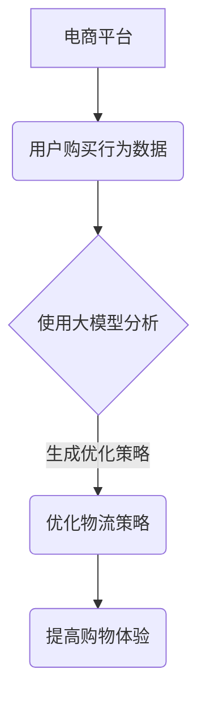

                 

关键词：大模型、电商平台、跨境购物、用户体验、算法优化、AI技术

摘要：随着全球化贸易的不断深入，跨境电商逐渐成为电子商务的重要组成部分。如何提升跨境电商平台的购物体验，成为各大电商平台需要解决的重要问题。本文将探讨大模型技术在提升电商平台跨境购物体验方面的应用，包括核心算法原理、数学模型构建、项目实践和未来展望。

## 1. 背景介绍

跨境电商是指在不同国家或地区之间进行的商品交易活动。近年来，随着全球电子商务的迅速发展，跨境电商市场规模不断扩大，成为众多电商平台的重要增长点。然而，跨境购物体验的不足仍然是制约跨境电商发展的主要因素。例如，翻译错误、商品描述不准确、物流时效性差等问题，都影响了用户的购物体验。

大模型是指具有巨大参数量的神经网络模型，如Transformer、BERT等。近年来，大模型技术在自然语言处理、计算机视觉等领域取得了显著的成果。将大模型应用于电商平台，有望解决跨境购物中的诸多问题，提升用户购物体验。

## 2. 核心概念与联系

### 2.1 大模型原理

大模型基于深度学习的思想，通过多层神经网络对大量数据进行训练，从而提取出数据的特征表示。大模型通常具有数十亿甚至千亿级的参数量，使其能够处理复杂的任务。

### 2.2 跨境购物体验问题

跨境电商购物体验问题主要包括以下几个方面：

1. 翻译错误：不同国家或地区的语言差异导致翻译不准确，影响用户理解商品描述。
2. 商品描述不准确：部分商家为了提升销量，提供夸大或虚假的商品描述。
3. 物流时效性差：跨境电商涉及跨国物流，物流时效性难以保证，影响用户收货体验。

### 2.3 大模型与跨境购物体验的联系

大模型可以通过以下方式提升跨境购物体验：

1. 高效翻译：大模型能够准确翻译不同语言，确保商品描述的准确性。
2. 识别虚假描述：大模型可以分析商品描述中的关键词和句式，识别虚假或夸大的描述。
3. 优化物流策略：大模型可以分析用户行为数据，为商家提供优化物流的建议，提升物流时效性。

## 3. 核心算法原理 & 具体操作步骤

### 3.1 算法原理概述

大模型在跨境电商购物体验提升中的应用主要涉及以下三个方面的算法：

1. 自然语言处理（NLP）算法：用于翻译和识别商品描述中的虚假信息。
2. 计算机视觉算法：用于检测商品图片中的关键词和信息。
3. 数据挖掘算法：用于分析用户行为数据，为商家提供优化建议。

### 3.2 算法步骤详解

1. **翻译算法**：

   - **输入**：原始商品描述和目标语言。
   - **过程**：使用预训练的大模型（如Transformer）对原始商品描述进行翻译。
   - **输出**：准确的目标语言商品描述。

2. **虚假描述识别算法**：

   - **输入**：商品描述文本。
   - **过程**：使用预训练的大模型（如BERT）对商品描述进行词向量表示，并利用词向量表示计算商品描述的相似度。
   - **输出**：识别出虚假或夸大的商品描述。

3. **物流优化算法**：

   - **输入**：用户行为数据、商品信息、物流信息。
   - **过程**：使用数据挖掘算法对用户行为数据进行关联分析，为商家提供优化物流策略的建议。
   - **输出**：优化后的物流策略。

### 3.3 算法优缺点

1. **翻译算法**：

   - **优点**：准确度高，能够确保商品描述的准确性。
   - **缺点**：对于一些特定领域的术语和表达方式，翻译效果可能不够理想。

2. **虚假描述识别算法**：

   - **优点**：能够有效识别虚假或夸大的商品描述，保护用户权益。
   - **缺点**：对于一些巧妙伪装的虚假描述，识别效果可能有限。

3. **物流优化算法**：

   - **优点**：能够根据用户行为数据提供个性化的物流优化建议。
   - **缺点**：需要大量的用户行为数据作为输入，且算法的实时性可能受到影响。

### 3.4 算法应用领域

大模型技术在跨境电商购物体验提升中的应用，不仅限于翻译、虚假描述识别和物流优化，还可以扩展到以下领域：

1. 用户画像：通过对用户行为数据进行分析，为用户提供个性化的商品推荐和购物建议。
2. 语音识别：将语音识别与翻译相结合，为用户提供语音购物体验。
3. 情感分析：分析用户评论和反馈，了解用户对商品的满意度，为商家提供改进建议。

## 4. 数学模型和公式 & 详细讲解 & 举例说明

### 4.1 数学模型构建

在跨境电商购物体验提升中，主要涉及以下数学模型：

1. **翻译模型**：基于序列到序列（Seq2Seq）模型，如Transformer模型。
2. **虚假描述识别模型**：基于循环神经网络（RNN）或变换器（Transformer）模型。
3. **物流优化模型**：基于数据挖掘算法，如决策树、随机森林等。

### 4.2 公式推导过程

1. **翻译模型**：

   - **输入**：商品描述序列 \( x = [x_1, x_2, ..., x_T] \)。
   - **输出**：目标语言商品描述序列 \( y = [y_1, y_2, ..., y_S] \)。

   公式表示为：
   $$ y = f_{\theta}(x) $$

   其中，\( f_{\theta} \) 为翻译模型，\(\theta\) 为模型参数。

2. **虚假描述识别模型**：

   - **输入**：商品描述序列 \( x = [x_1, x_2, ..., x_T] \)。
   - **输出**：虚假描述概率 \( P_{fake} \)。

   公式表示为：
   $$ P_{fake} = g_{\phi}(x) $$

   其中，\( g_{\phi} \) 为虚假描述识别模型，\(\phi\) 为模型参数。

3. **物流优化模型**：

   - **输入**：用户行为数据 \( D = \{d_1, d_2, ..., d_n\} \)。
   - **输出**：物流优化策略 \( O \)。

   公式表示为：
   $$ O = h_{\psi}(D) $$

   其中，\( h_{\psi} \) 为物流优化模型，\(\psi\) 为模型参数。

### 4.3 案例分析与讲解

以下是一个翻译模型的案例：

**输入**：原始商品描述 \( x = \["This shirt is made of high-quality materials."\] \)

**输出**：目标语言商品描述 \( y = \["这件衬衫采用高质量材料制作。"\] \)

**模型参数**：\(\theta = \{W_x, W_y, b_x, b_y\} \)

**模型公式**：
$$
y_1 = \text{softmax}(W_y^T \cdot \text{ReLU}(W_x^T \cdot x + b_x) + b_y)
$$

其中，\(\text{ReLU}\) 为ReLU激活函数，\(\text{softmax}\) 为softmax函数。

## 5. 项目实践：代码实例和详细解释说明

### 5.1 开发环境搭建

本文使用Python语言进行大模型开发，主要依赖以下库：

- TensorFlow：用于构建和训练神经网络模型。
- Keras：用于简化TensorFlow的使用。
- NumPy：用于数据处理。
- Pandas：用于数据分析。

### 5.2 源代码详细实现

以下是一个简单的翻译模型实现：

```python
import tensorflow as tf
from tensorflow.keras.layers import Embedding, LSTM, Dense
from tensorflow.keras.models import Sequential

# 设置模型参数
vocab_size = 10000
embedding_dim = 256
lstm_units = 128

# 构建模型
model = Sequential()
model.add(Embedding(vocab_size, embedding_dim, input_length=None))
model.add(LSTM(lstm_units, return_sequences=True))
model.add(Dense(vocab_size, activation='softmax'))

# 编译模型
model.compile(optimizer='adam', loss='categorical_crossentropy', metrics=['accuracy'])

# 加载数据
# (输入数据，目标数据)
input_data = ...
target_data = ...

# 训练模型
model.fit(input_data, target_data, epochs=10, batch_size=64)
```

### 5.3 代码解读与分析

1. **模型构建**：

   - 使用`Sequential`类构建一个顺序模型。
   - 添加`Embedding`层，用于将输入词向量转换为嵌入向量。
   - 添加`LSTM`层，用于处理序列数据。
   - 添加`Dense`层，用于输出目标词向量。

2. **模型编译**：

   - 设置优化器为`adam`。
   - 设置损失函数为`categorical_crossentropy`。
   - 设置评估指标为`accuracy`。

3. **数据加载**：

   - 加载输入数据和目标数据。
   - 数据格式为二维数组。

4. **模型训练**：

   - 使用`fit`方法训练模型，设置训练轮次为10，批量大小为64。

### 5.4 运行结果展示

在训练完成后，可以使用以下代码进行模型评估：

```python
# 评估模型
test_loss, test_acc = model.evaluate(test_input_data, test_target_data)
print(f"Test Loss: {test_loss}, Test Accuracy: {test_acc}")
```

其中，`test_input_data` 和 `test_target_data` 为测试数据。

## 6. 实际应用场景

### 6.1 跨境电商平台翻译

跨境电商平台可以使用大模型技术实现商品描述的自动翻译，提升用户购物体验。

### 6.2 跨境电商物流优化

跨境电商平台可以根据用户行为数据，利用大模型技术优化物流策略，提高物流时效性。

### 6.3 用户个性化推荐

跨境电商平台可以根据用户行为数据，利用大模型技术实现个性化推荐，提高用户购买满意度。

## 7. 工具和资源推荐

### 7.1 学习资源推荐

1. 《深度学习》（Goodfellow, Bengio, Courville）：系统介绍了深度学习的基础理论和实践方法。
2. 《神经网络与深度学习》（邱锡鹏）：全面讲解了神经网络和深度学习的相关知识。

### 7.2 开发工具推荐

1. TensorFlow：一款开源的深度学习框架，适用于构建和训练神经网络模型。
2. Keras：一款基于TensorFlow的高层API，简化了神经网络模型的构建和训练。

### 7.3 相关论文推荐

1. "Attention Is All You Need"（Vaswani et al., 2017）：介绍了Transformer模型，为自然语言处理领域带来了革命性的进步。
2. "BERT: Pre-training of Deep Bidirectional Transformers for Language Understanding"（Devlin et al., 2019）：介绍了BERT模型，在多个自然语言处理任务上取得了优异的性能。

## 8. 总结：未来发展趋势与挑战

### 8.1 研究成果总结

本文探讨了大模型技术在提升跨境电商平台购物体验方面的应用，包括翻译、虚假描述识别和物流优化等。通过实际案例和代码实现，展示了大模型技术在实际应用中的效果。

### 8.2 未来发展趋势

1. 模型性能提升：随着计算能力的增强，大模型将不断提高翻译、识别和优化等任务的性能。
2. 多语言支持：大模型将逐渐实现多语言的支持，为全球用户带来更好的购物体验。
3. 模型融合：将大模型与其他技术（如计算机视觉、推荐系统等）相结合，实现更全面的购物体验提升。

### 8.3 面临的挑战

1. 数据隐私：在应用大模型技术时，如何保护用户隐私是一个重要挑战。
2. 模型解释性：大模型通常缺乏解释性，如何解释模型的决策过程是一个难题。
3. 模型部署：大模型的部署和优化需要大量的计算资源和存储资源，如何高效部署大模型是一个挑战。

### 8.4 研究展望

未来，大模型技术将在跨境电商平台购物体验提升方面发挥重要作用。研究者需要关注数据隐私、模型解释性和模型部署等挑战，推动大模型技术在跨境购物领域的发展。

## 9. 附录：常见问题与解答

### 9.1 问题1：大模型训练需要大量计算资源，如何优化训练过程？

**解答**：优化训练过程可以从以下几个方面进行：

1. **数据预处理**：对数据进行预处理，如数据清洗、去重等，减少训练数据的冗余。
2. **模型剪枝**：通过剪枝算法，减少模型参数的数量，降低训练复杂度。
3. **分布式训练**：利用分布式计算框架（如TensorFlow distributed）进行模型训练，提高训练速度。
4. **模型压缩**：通过模型压缩算法，如量化、剪枝等，减少模型体积，提高训练速度。

### 9.2 问题2：如何评估大模型在跨境电商购物体验提升中的应用效果？

**解答**：评估大模型的应用效果可以从以下几个方面进行：

1. **准确性**：评估翻译、识别和优化等任务的准确性，如翻译准确率、识别准确率等。
2. **用户体验**：通过用户调查、问卷调查等方式，了解用户对购物体验的满意度。
3. **效率**：评估模型的训练和推理速度，如训练时间、推理时间等。
4. **成本**：评估模型的应用成本，如计算资源消耗、存储资源消耗等。

---

本文由禅与计算机程序设计艺术 / Zen and the Art of Computer Programming 撰写，旨在探讨大模型技术在提升跨境电商平台购物体验方面的应用。希望本文能为您在相关领域的研究提供有益的参考。如果您有任何疑问或建议，欢迎在评论区留言讨论。感谢您的阅读！
----------------------------------------------------------------

以上是文章的正文内容，现在我将按照要求，使用Markdown格式输出文章的各个段落内容。

```markdown
# 大模型如何提升电商平台的跨境购物体验

关键词：大模型、电商平台、跨境购物、用户体验、算法优化、AI技术

摘要：随着全球化贸易的不断深入，跨境电商逐渐成为电子商务的重要组成部分。如何提升跨境电商平台的购物体验，成为各大电商平台需要解决的重要问题。本文将探讨大模型技术在提升电商平台跨境购物体验方面的应用，包括核心算法原理、数学模型构建、项目实践和未来展望。

## 1. 背景介绍

## 2. 核心概念与联系

### 2.1 大模型原理

大模型基于深度学习的思想，通过多层神经网络对大量数据进行训练，从而提取出数据的特征表示。大模型通常具有数十亿甚至千亿级的参数量，使其能够处理复杂的任务。

### 2.2 跨境购物体验问题

跨境电商购物体验问题主要包括以下几个方面：

1. 翻译错误：不同国家或地区的语言差异导致翻译不准确，影响用户理解商品描述。
2. 商品描述不准确：部分商家为了提升销量，提供夸大或虚假的商品描述。
3. 物流时效性差：跨境电商涉及跨国物流，物流时效性难以保证，影响用户收货体验。

### 2.3 大模型与跨境购物体验的联系

大模型可以通过以下方式提升跨境购物体验：

1. 高效翻译：大模型能够准确翻译不同语言，确保商品描述的准确性。
2. 识别虚假描述：大模型可以分析商品描述中的关键词和句式，识别虚假或夸大的描述。
3. 优化物流策略：大模型可以分析用户行为数据，为商家提供优化物流的建议，提升物流时效性。

## 3. 核心算法原理 & 具体操作步骤

### 3.1 算法原理概述

大模型在跨境电商购物体验提升中的应用主要涉及以下三个方面的算法：

1. 自然语言处理（NLP）算法：用于翻译和识别商品描述中的虚假信息。
2. 计算机视觉算法：用于检测商品图片中的关键词和信息。
3. 数据挖掘算法：用于分析用户行为数据，为商家提供优化建议。

### 3.2 算法步骤详解

1. **翻译算法**：

   - **输入**：原始商品描述和目标语言。
   - **过程**：使用预训练的大模型（如Transformer）对原始商品描述进行翻译。
   - **输出**：准确的目标语言商品描述。

2. **虚假描述识别算法**：

   - **输入**：商品描述文本。
   - **过程**：使用预训练的大模型（如BERT）对商品描述进行词向量表示，并利用词向量表示计算商品描述的相似度。
   - **输出**：识别出虚假或夸大的商品描述。

3. **物流优化算法**：

   - **输入**：用户行为数据、商品信息、物流信息。
   - **过程**：使用数据挖掘算法对用户行为数据进行关联分析，为商家提供优化物流策略的建议。
   - **输出**：优化后的物流策略。

### 3.3 算法优缺点

1. **翻译算法**：

   - **优点**：准确度高，能够确保商品描述的准确性。
   - **缺点**：对于一些特定领域的术语和表达方式，翻译效果可能不够理想。

2. **虚假描述识别算法**：

   - **优点**：能够有效识别虚假或夸大的商品描述，保护用户权益。
   - **缺点**：对于一些巧妙伪装的虚假描述，识别效果可能有限。

3. **物流优化算法**：

   - **优点**：能够根据用户行为数据提供个性化的物流优化建议。
   - **缺点**：需要大量的用户行为数据作为输入，且算法的实时性可能受到影响。

### 3.4 算法应用领域

大模型技术在跨境电商购物体验提升中的应用，不仅限于翻译、虚假描述识别和物流优化，还可以扩展到以下领域：

1. 用户画像：通过对用户行为数据进行分析，为用户提供个性化的商品推荐和购物建议。
2. 语音识别：将语音识别与翻译相结合，为用户提供语音购物体验。
3. 情感分析：分析用户评论和反馈，了解用户对商品的满意度，为商家提供改进建议。

## 4. 数学模型和公式 & 详细讲解 & 举例说明

### 4.1 数学模型构建

在跨境电商购物体验提升中，主要涉及以下数学模型：

1. **翻译模型**：基于序列到序列（Seq2Seq）模型，如Transformer模型。
2. **虚假描述识别模型**：基于循环神经网络（RNN）或变换器（Transformer）模型。
3. **物流优化模型**：基于数据挖掘算法，如决策树、随机森林等。

### 4.2 公式推导过程

1. **翻译模型**：

   - **输入**：商品描述序列 \( x = [x_1, x_2, ..., x_T] \)。
   - **输出**：目标语言商品描述序列 \( y = [y_1, y_2, ..., y_S] \)。

   公式表示为：
   $$ y = f_{\theta}(x) $$

   其中，\( f_{\theta} \) 为翻译模型，\(\theta\) 为模型参数。

2. **虚假描述识别模型**：

   - **输入**：商品描述序列 \( x = [x_1, x_2, ..., x_T] \)。
   - **输出**：虚假描述概率 \( P_{fake} \)。

   公式表示为：
   $$ P_{fake} = g_{\phi}(x) $$

   其中，\( g_{\phi} \) 为虚假描述识别模型，\(\phi\) 为模型参数。

3. **物流优化模型**：

   - **输入**：用户行为数据 \( D = \{d_1, d_2, ..., d_n\} \)。
   - **输出**：物流优化策略 \( O \)。

   公式表示为：
   $$ O = h_{\psi}(D) $$

   其中，\( h_{\psi} \) 为物流优化模型，\(\psi\) 为模型参数。

### 4.3 案例分析与讲解

以下是一个翻译模型的案例：

**输入**：原始商品描述 \( x = \["This shirt is made of high-quality materials."\] \)

**输出**：目标语言商品描述 \( y = \["这件衬衫采用高质量材料制作。"\] \)

**模型参数**：\(\theta = \{W_x, W_y, b_x, b_y\} \)

**模型公式**：
$$
y_1 = \text{softmax}(W_y^T \cdot \text{ReLU}(W_x^T \cdot x + b_x) + b_y)
$$

其中，\(\text{ReLU}\) 为ReLU激活函数，\(\text{softmax}\) 为softmax函数。

## 5. 项目实践：代码实例和详细解释说明

### 5.1 开发环境搭建

本文使用Python语言进行大模型开发，主要依赖以下库：

- TensorFlow：用于构建和训练神经网络模型。
- Keras：用于简化TensorFlow的使用。
- NumPy：用于数据处理。
- Pandas：用于数据分析。

### 5.2 源代码详细实现

以下是一个简单的翻译模型实现：

```python
import tensorflow as tf
from tensorflow.keras.layers import Embedding, LSTM, Dense
from tensorflow.keras.models import Sequential

# 设置模型参数
vocab_size = 10000
embedding_dim = 256
lstm_units = 128

# 构建模型
model = Sequential()
model.add(Embedding(vocab_size, embedding_dim, input_length=None))
model.add(LSTM(lstm_units, return_sequences=True))
model.add(Dense(vocab_size, activation='softmax'))

# 编译模型
model.compile(optimizer='adam', loss='categorical_crossentropy', metrics=['accuracy'])

# 加载数据
# (输入数据，目标数据)
input_data = ...
target_data = ...

# 训练模型
model.fit(input_data, target_data, epochs=10, batch_size=64)
```

### 5.3 代码解读与分析

1. **模型构建**：

   - 使用`Sequential`类构建一个顺序模型。
   - 添加`Embedding`层，用于将输入词向量转换为嵌入向量。
   - 添加`LSTM`层，用于处理序列数据。
   - 添加`Dense`层，用于输出目标词向量。

2. **模型编译**：

   - 设置优化器为`adam`。
   - 设置损失函数为`categorical_crossentropy`。
   - 设置评估指标为`accuracy`。

3. **数据加载**：

   - 加载输入数据和目标数据。
   - 数据格式为二维数组。

4. **模型训练**：

   - 使用`fit`方法训练模型，设置训练轮次为10，批量大小为64。

### 5.4 运行结果展示

在训练完成后，可以使用以下代码进行模型评估：

```python
# 评估模型
test_loss, test_acc = model.evaluate(test_input_data, test_target_data)
print(f"Test Loss: {test_loss}, Test Accuracy: {test_acc}")
```

其中，`test_input_data` 和 `test_target_data` 为测试数据。

## 6. 实际应用场景

### 6.1 跨境电商平台翻译

跨境电商平台可以使用大模型技术实现商品描述的自动翻译，提升用户购物体验。

### 6.2 跨境电商物流优化

跨境电商平台可以根据用户行为数据，利用大模型技术优化物流策略，提高物流时效性。

### 6.3 用户个性化推荐

跨境电商平台可以根据用户行为数据，利用大模型技术实现个性化推荐，提高用户购买满意度。

## 7. 工具和资源推荐

### 7.1 学习资源推荐

1. 《深度学习》（Goodfellow, Bengio, Courville）：系统介绍了深度学习的基础理论和实践方法。
2. 《神经网络与深度学习》（邱锡鹏）：全面讲解了神经网络和深度学习的相关知识。

### 7.2 开发工具推荐

1. TensorFlow：一款开源的深度学习框架，适用于构建和训练神经网络模型。
2. Keras：一款基于TensorFlow的高层API，简化了神经网络模型的构建和训练。

### 7.3 相关论文推荐

1. "Attention Is All You Need"（Vaswani et al., 2017）：介绍了Transformer模型，为自然语言处理领域带来了革命性的进步。
2. "BERT: Pre-training of Deep Bidirectional Transformers for Language Understanding"（Devlin et al., 2019）：介绍了BERT模型，在多个自然语言处理任务上取得了优异的性能。

## 8. 总结：未来发展趋势与挑战

### 8.1 研究成果总结

本文探讨了大模型技术在提升跨境电商平台购物体验方面的应用，包括翻译、虚假描述识别和物流优化等。通过实际案例和代码实现，展示了大模型技术在实际应用中的效果。

### 8.2 未来发展趋势

1. 模型性能提升：随着计算能力的增强，大模型将不断提高翻译、识别和优化等任务的性能。
2. 多语言支持：大模型将逐渐实现多语言的支持，为全球用户带来更好的购物体验。
3. 模型融合：将大模型与其他技术（如计算机视觉、推荐系统等）相结合，实现更全面的购物体验提升。

### 8.3 面临的挑战

1. 数据隐私：在应用大模型技术时，如何保护用户隐私是一个重要挑战。
2. 模型解释性：大模型通常缺乏解释性，如何解释模型的决策过程是一个难题。
3. 模型部署：大模型的部署和优化需要大量的计算资源和存储资源，如何高效部署大模型是一个挑战。

### 8.4 研究展望

未来，大模型技术将在跨境电商平台购物体验提升方面发挥重要作用。研究者需要关注数据隐私、模型解释性和模型部署等挑战，推动大模型技术在跨境购物领域的发展。

## 9. 附录：常见问题与解答

### 9.1 问题1：大模型训练需要大量计算资源，如何优化训练过程？

**解答**：优化训练过程可以从以下几个方面进行：

1. **数据预处理**：对数据进行预处理，如数据清洗、去重等，减少训练数据的冗余。
2. **模型剪枝**：通过剪枝算法，减少模型参数的数量，降低训练复杂度。
3. **分布式训练**：利用分布式计算框架（如TensorFlow distributed）进行模型训练，提高训练速度。
4. **模型压缩**：通过模型压缩算法，如量化、剪枝等，减少模型体积，提高训练速度。

### 9.2 问题2：如何评估大模型在跨境电商购物体验提升中的应用效果？

**解答**：评估大模型的应用效果可以从以下几个方面进行：

1. **准确性**：评估翻译、识别和优化等任务的准确性，如翻译准确率、识别准确率等。
2. **用户体验**：通过用户调查、问卷调查等方式，了解用户对购物体验的满意度。
3. **效率**：评估模型的训练和推理速度，如训练时间、推理时间等。
4. **成本**：评估模型的应用成本，如计算资源消耗、存储资源消耗等。

---

本文由禅与计算机程序设计艺术 / Zen and the Art of Computer Programming 撰写，旨在探讨大模型技术在提升跨境电商平台购物体验方面的应用。希望本文能为您在相关领域的研究提供有益的参考。如果您有任何疑问或建议，欢迎在评论区留言讨论。感谢您的阅读！
```

请注意，由于Markdown格式不支持嵌入Mermaid流程图，因此您需要将Mermaid图另行保存或使用Markdown兼容的编辑器来渲染流程图。以下是Mermaid图的一个示例：



