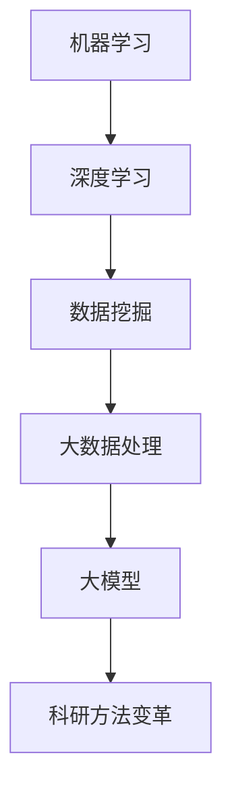

                 

关键词：大模型，科研方法，算法，人工智能，数据处理，数据挖掘，机器学习，深度学习

> 摘要：随着人工智能技术的飞速发展，大模型（如GPT-3、BERT等）的出现为科研方法带来了前所未有的改变。本文将从背景介绍、核心概念与联系、核心算法原理与操作步骤、数学模型与公式、项目实践、实际应用场景、工具和资源推荐以及未来发展趋势与挑战等方面，全面探讨大模型对科研方法的深远影响。

## 1. 背景介绍

近年来，人工智能技术（AI）的飞速发展引起了全球科技界和产业界的广泛关注。特别是在深度学习领域，通过引入大规模神经网络模型，研究人员已经取得了许多突破性的成果。大模型（Large-scale Models）因此应运而生，成为当前人工智能研究的重要方向。大模型具有以下几个显著特点：

1. **参数规模巨大**：大模型的参数数量往往达到数亿甚至数十亿，这使得它们具有更高的表达能力和更广的适用范围。
2. **训练数据量庞大**：大模型需要大量的训练数据来达到较好的性能，这有助于提高模型的泛化能力和准确性。
3. **计算资源需求高**：大模型训练通常需要大量的计算资源，包括高性能计算硬件和大规模分布式计算集群。
4. **多模态处理能力**：大模型能够处理多种类型的输入数据，如图像、文本、声音等，从而实现更复杂和更广泛的应用。

大模型的出现为科研方法带来了深刻的变革。首先，大模型在数据挖掘、自然语言处理、计算机视觉等领域取得了显著成效，为传统科研方法提供了强有力的工具。其次，大模型的研究和应用推动了新的科研范式，如数据驱动科研、模型驱动科研等。此外，大模型还促进了跨学科的合作，如计算机科学与生物学、物理学等领域的交叉研究。

## 2. 核心概念与联系

为了深入理解大模型对科研方法的改变，我们首先需要了解几个核心概念，包括机器学习、深度学习、数据挖掘和大数据处理等。

### 2.1 机器学习（Machine Learning）

机器学习是一种使计算机能够从数据中学习并做出决策或预测的技术。其基本思想是通过统计方法、优化算法和模式识别技术，从历史数据中提取规律，从而在没有明确编程的情况下实现智能行为。

### 2.2 深度学习（Deep Learning）

深度学习是机器学习的一个分支，它利用多层神经网络（如图神经网络、卷积神经网络等）对数据进行处理和分析。深度学习模型具有高度的表达能力，可以自动提取数据中的复杂特征。

### 2.3 数据挖掘（Data Mining）

数据挖掘是一种从大量数据中发现有价值信息的过程。它涉及多种技术和方法，如关联规则学习、分类、聚类和异常检测等。

### 2.4 大数据处理（Big Data Processing）

大数据处理是指对大规模数据的存储、管理和分析。大数据处理通常需要分布式计算技术和云计算平台的支持。

### 2.5 Mermaid 流程图

以下是关于大模型对科研方法改变的核心概念和架构的 Mermaid 流程图：



## 3. 核心算法原理 & 具体操作步骤

### 3.1 算法原理概述

大模型的算法原理主要基于深度学习和大数据处理技术。深度学习模型通过多层神经网络对数据进行处理，每层神经网络都能够提取数据的特征，并逐步将特征抽象化。大数据处理技术则提供了对大规模数据的高效存储、管理和分析能力。大模型通过这些技术，能够从海量数据中提取有价值的信息，从而为科研方法带来变革。

### 3.2 算法步骤详解

大模型的算法步骤可以分为以下几个阶段：

1. **数据收集与预处理**：收集大量的数据，并进行数据清洗、归一化和特征提取等预处理操作。
2. **模型设计与训练**：设计合适的深度学习模型，并使用预处理后的数据对其进行训练。
3. **模型评估与优化**：评估模型的性能，并通过调整模型参数和结构进行优化。
4. **模型应用与部署**：将训练好的模型应用于实际问题中，并进行部署。

### 3.3 算法优缺点

大模型的优点包括：

1. **强大的数据处理能力**：大模型能够处理大规模、多类型的复杂数据，从而提高了数据的利用效率。
2. **高效的模型训练**：大模型通过并行计算和分布式计算技术，能够实现高效的模型训练。
3. **出色的性能表现**：大模型在多个领域都取得了突破性的成果，展现了强大的性能表现。

然而，大模型也存在一些缺点，如：

1. **计算资源需求高**：大模型训练通常需要大量的计算资源和时间，这限制了其应用范围。
2. **数据依赖性大**：大模型性能的提高很大程度上依赖于大规模的训练数据，因此在数据匮乏的情况下可能会表现不佳。

### 3.4 算法应用领域

大模型在多个领域都取得了显著的成果，包括：

1. **自然语言处理**：大模型在文本分类、机器翻译、问答系统等方面表现优异，已成为自然语言处理领域的重要工具。
2. **计算机视觉**：大模型在图像分类、目标检测、图像生成等方面具有强大的能力，为计算机视觉领域带来了新的突破。
3. **数据挖掘**：大模型能够从海量数据中提取有价值的信息，为数据挖掘提供了强有力的支持。
4. **生物信息学**：大模型在基因序列分析、蛋白质结构预测等方面具有广泛应用，为生物信息学研究提供了新的手段。

## 4. 数学模型和公式 & 详细讲解 & 举例说明

### 4.1 数学模型构建

大模型的数学模型通常基于深度学习理论，主要包括以下几个部分：

1. **神经元激活函数**：如ReLU、Sigmoid、Tanh等。
2. **损失函数**：如交叉熵损失、均方误差等。
3. **优化算法**：如随机梯度下降、Adam等。

### 4.2 公式推导过程

以深度学习中的卷积神经网络（CNN）为例，其公式推导过程如下：

1. **卷积操作**：

   $$ (f_{ij})_{m,n} = \sum_{k=1}^{K} \sum_{l=1}^{L} w_{kl} \cdot x_{i+k,j+l} $$

   其中，$f_{ij}$ 表示卷积结果，$w_{kl}$ 表示卷积核，$x_{i+k,j+l}$ 表示输入数据。

2. **激活函数**：

   $$ a_{ij} = \max(0, f_{ij}) $$

   其中，$a_{ij}$ 表示激活后的结果。

3. **全连接层**：

   $$ z_{j} = \sum_{i=1}^{M} w_{ji} \cdot a_{ij} + b_{j} $$

   其中，$z_{j}$ 表示全连接层的输出，$w_{ji}$ 表示权重，$a_{ij}$ 表示卷积层的输出，$b_{j}$ 表示偏置。

4. **损失函数**：

   $$ J = \frac{1}{2} \sum_{i=1}^{N} (y_i - \hat{y}_i)^2 $$

   其中，$J$ 表示损失函数，$y_i$ 表示真实标签，$\hat{y}_i$ 表示预测标签。

### 4.3 案例分析与讲解

假设我们有一个图像分类任务，需要将图像分类为猫或狗。以下是使用大模型进行图像分类的案例：

1. **数据收集与预处理**：收集大量猫和狗的图像，并进行数据清洗、归一化和数据增强等预处理操作。
2. **模型设计与训练**：设计一个卷积神经网络模型，包括卷积层、池化层和全连接层，并使用预处理后的数据对其进行训练。
3. **模型评估与优化**：评估模型的性能，并通过调整模型参数和结构进行优化。
4. **模型应用与部署**：将训练好的模型应用于实际的图像分类任务，并在测试集上进行验证。

通过以上步骤，我们可以使用大模型对图像分类任务进行高效、准确的预测。

## 5. 项目实践：代码实例和详细解释说明

### 5.1 开发环境搭建

为了实现大模型的图像分类项目，我们需要搭建以下开发环境：

1. **Python**：用于编写代码。
2. **PyTorch**：用于构建和训练深度学习模型。
3. **CUDA**：用于加速模型训练。

### 5.2 源代码详细实现

以下是一个简单的图像分类项目的源代码实现：

```python
import torch
import torchvision
import torchvision.transforms as transforms
import torch.nn as nn
import torch.optim as optim

# 数据集预处理
transform = transforms.Compose([
    transforms.Resize(256),
    transforms.CenterCrop(224),
    transforms.ToTensor(),
    transforms.Normalize(mean=[0.485, 0.456, 0.406], std=[0.229, 0.224, 0.225]),
])

# 加载数据集
train_set = torchvision.datasets.ImageFolder(root='./data/train', transform=transform)
train_loader = torch.utils.data.DataLoader(train_set, batch_size=32, shuffle=True)

# 模型定义
model = nn.Sequential(
    nn.Conv2d(3, 64, 3, padding=1),
    nn.ReLU(),
    nn.MaxPool2d(2, 2),
    nn.Conv2d(64, 128, 3, padding=1),
    nn.ReLU(),
    nn.MaxPool2d(2, 2),
    nn.Flatten(),
    nn.Linear(128 * 56 * 56, 1024),
    nn.ReLU(),
    nn.Linear(1024, 2),
    nn.Softmax(dim=1)
)

# 损失函数和优化器
criterion = nn.CrossEntropyLoss()
optimizer = optim.Adam(model.parameters(), lr=0.001)

# 模型训练
for epoch in range(10):
    for images, labels in train_loader:
        optimizer.zero_grad()
        outputs = model(images)
        loss = criterion(outputs, labels)
        loss.backward()
        optimizer.step()
    print(f'Epoch [{epoch+1}/10], Loss: {loss.item()}')

# 模型评估
with torch.no_grad():
    correct = 0
    total = 0
    for images, labels in test_loader:
        outputs = model(images)
        _, predicted = torch.max(outputs.data, 1)
        total += labels.size(0)
        correct += (predicted == labels).sum().item()
    print(f'Accuracy: {100 * correct / total}%')
```

### 5.3 代码解读与分析

以上代码实现了一个简单的图像分类项目，主要包括以下几个部分：

1. **数据集预处理**：使用 torchvision 库加载数据集，并进行数据清洗、归一化和数据增强等预处理操作。
2. **模型定义**：使用 PyTorch 库定义一个卷积神经网络模型，包括卷积层、池化层和全连接层。
3. **损失函数和优化器**：定义交叉熵损失函数和 Adam 优化器。
4. **模型训练**：使用训练集对模型进行训练，并在每个 epoch 后计算训练损失。
5. **模型评估**：使用测试集对模型进行评估，并计算分类准确率。

通过以上步骤，我们可以使用大模型对图像分类任务进行高效、准确的预测。

## 6. 实际应用场景

大模型在多个实际应用场景中展现出了强大的能力，以下是几个典型应用场景：

### 6.1 自然语言处理

在自然语言处理领域，大模型被广泛应用于文本分类、机器翻译、问答系统等任务。例如，GPT-3 模型在机器翻译任务上已经达到了与人类翻译相近的水平，BERT 模型在文本分类任务中取得了出色的性能。

### 6.2 计算机视觉

在计算机视觉领域，大模型在图像分类、目标检测、图像生成等方面取得了显著的成果。例如，InceptionV3 模型在图像分类任务中取得了很高的准确率，Mask R-CNN 模型在目标检测任务中展现了强大的能力。

### 6.3 数据挖掘

在大数据处理和数据挖掘领域，大模型能够从海量数据中提取有价值的信息，为商业决策、风险控制等提供了有力支持。例如，通过使用大模型进行客户行为分析，企业可以更好地了解客户需求，提高客户满意度。

### 6.4 生物信息学

在生物信息学领域，大模型在基因序列分析、蛋白质结构预测等方面具有广泛应用。例如，AlphaFold2 模型在蛋白质结构预测任务中取得了突破性的成果，为生物科学研究提供了新的手段。

## 7. 工具和资源推荐

为了更好地学习和应用大模型，以下是一些建议的资源和工具：

### 7.1 学习资源推荐

1. **书籍**：《深度学习》（Goodfellow, Bengio, Courville 著）、《神经网络与深度学习》（邱锡鹏 著）。
2. **在线课程**：Coursera 上的《深度学习》课程、Udacity 上的《深度学习工程师纳米学位》。
3. **开源项目**：GitHub 上的 PyTorch、TensorFlow 等。

### 7.2 开发工具推荐

1. **编程语言**：Python。
2. **深度学习框架**：PyTorch、TensorFlow、Keras。
3. **数据预处理工具**：NumPy、Pandas。

### 7.3 相关论文推荐

1. **《A Theoretically Grounded Application of Dropout in Recurrent Neural Networks》**：提出将 Dropout 技术应用于循环神经网络，提高了模型的性能。
2. **《Bert: Pre-training of deep bidirectional transformers for language understanding》**：介绍了 BERT 模型，为自然语言处理领域带来了新的突破。
3. **《An image database for evaluating object detection and semantic segmentation algorithms & A Large-Scale Dataset for Object Detection in Real-world Scenes》**：提出了用于评估目标检测算法的大型图像数据集。

## 8. 总结：未来发展趋势与挑战

大模型作为人工智能领域的重要研究方向，其在科研方法中的应用正在不断拓展和深化。未来，大模型的发展趋势主要包括以下几个方面：

1. **模型规模不断扩大**：随着计算资源和数据资源的增加，大模型的规模将不断增大，从而提高模型的性能和泛化能力。
2. **多模态处理能力增强**：大模型将具备更强的多模态处理能力，能够同时处理多种类型的输入数据，如文本、图像、声音等，从而实现更复杂的应用。
3. **跨学科研究深化**：大模型将在生物信息学、物理学、计算机科学等领域发挥更大的作用，推动跨学科研究的发展。

然而，大模型的发展也面临着一些挑战：

1. **计算资源需求**：大模型训练通常需要大量的计算资源，这对计算硬件和分布式计算技术提出了更高的要求。
2. **数据隐私与安全**：大规模数据处理过程中涉及大量敏感信息，如何确保数据隐私和安全成为亟待解决的问题。
3. **模型解释性**：大模型通常具有复杂的结构和参数，如何解释模型的行为和预测结果成为了一个重要的研究课题。

总之，大模型对科研方法的改变是深远和革命性的。通过深入研究和应用大模型，我们可以期待在各个领域取得更加突破性的成果。

## 9. 附录：常见问题与解答

### 9.1 大模型与普通模型的区别是什么？

大模型与普通模型的主要区别在于其参数规模、数据依赖性和计算资源需求。大模型通常具有数十亿甚至数百亿的参数，能够处理大规模、多类型的复杂数据，但同时也需要更多的计算资源和时间进行训练。

### 9.2 大模型在自然语言处理中的应用有哪些？

大模型在自然语言处理中有着广泛的应用，包括文本分类、机器翻译、问答系统、文本生成等。例如，GPT-3 模型在机器翻译任务上已经达到了与人类翻译相近的水平，BERT 模型在文本分类任务中取得了出色的性能。

### 9.3 大模型对数据质量和数据量的要求是什么？

大模型对数据质量和数据量都有较高的要求。数据质量方面，要求数据真实、可靠、具有代表性；数据量方面，大模型需要大量的训练数据来达到较好的性能，从而提高模型的泛化能力和准确性。

### 9.4 如何优化大模型的计算性能？

优化大模型的计算性能可以从以下几个方面入手：

1. **硬件升级**：使用更高性能的计算硬件，如 GPU、TPU 等。
2. **分布式计算**：使用分布式计算技术，如多 GPU 并行训练、数据并行训练等。
3. **模型压缩**：通过模型剪枝、量化等技术减小模型规模，提高计算效率。
4. **算法优化**：使用更高效的训练算法，如 Adam 优化器、混合精度训练等。

---

# 结语

大模型作为人工智能领域的重要研究方向，其应用已经深刻改变了科研方法。通过对大模型的深入研究与应用，我们有望在各个领域取得更加突破性的成果。同时，我们也需要面对大模型所带来的计算资源需求、数据隐私和安全、模型解释性等挑战。展望未来，大模型将继续推动人工智能技术的发展，为人类带来更多的可能性。感谢您的阅读，希望本文对您有所启发。作者：禅与计算机程序设计艺术 / Zen and the Art of Computer Programming。

