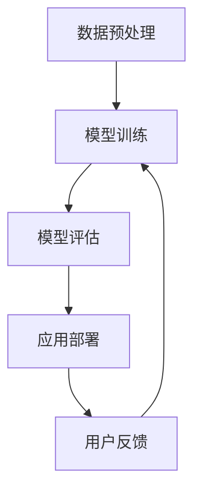

                 

关键词：大模型、应用场景、创业者、新技术、增长点、人工智能

> 摘要：本文将深入探讨大模型在各领域的应用场景，分析创业者如何利用大模型技术发掘新的增长点，以及未来发展的趋势和面临的挑战。

## 1. 背景介绍

在过去的几年里，人工智能技术取得了飞速发展，尤其是大模型的应用场景越来越广泛。大模型，如GPT、BERT等，通过深度学习和大规模数据训练，已经展示出强大的数据处理和生成能力。随着技术的不断成熟，大模型的应用已经从理论研究走向实际应用，逐渐渗透到各个行业，成为创业者挖掘新增长点的关键工具。

### 1.1 大模型的发展历程

大模型的发展可以追溯到深度学习的兴起。自2006年深度信念网络（Deep Belief Networks, DBN）提出以来，深度学习经历了快速的发展。随着计算能力的提升和数据的积累，深度神经网络（DNN）的模型规模和训练数据量不断增加，最终演化出了如今的大模型。

### 1.2 大模型的应用现状

目前，大模型已经在自然语言处理、计算机视觉、语音识别等领域取得了显著的成果。例如，GPT-3在文本生成、机器翻译等方面展现了超凡的能力；BERT在问答系统、文本分类等方面具有优越的性能。这些应用不仅提升了技术的实用性，也为创业者提供了丰富的创新机会。

## 2. 核心概念与联系

为了更好地理解大模型的应用，我们首先需要了解其核心概念和架构。以下是一个简化的Mermaid流程图，展示了大模型的主要组成部分：



### 2.1 数据预处理

数据预处理是模型训练的第一步，其目标是清洗、格式化和标注数据，使其适合模型训练。这一步骤的目的是提高数据质量和减少噪声，从而提高模型的训练效果。

### 2.2 模型训练

模型训练是利用大量数据训练神经网络的过程。通过调整网络权重，模型可以学会对新的输入数据进行预测。训练过程通常涉及多次迭代，每次迭代都会根据损失函数调整权重。

### 2.3 模型评估

模型评估是检验模型性能的重要步骤。常用的评估指标包括准确率、召回率、F1值等。通过评估，可以判断模型是否达到预期效果，并为进一步优化提供依据。

### 2.4 应用部署

应用部署是将训练好的模型部署到实际场景中，使其能够为用户提供服务。这一步骤通常涉及模型优化、接口设计、系统集成等工作。

### 2.5 用户反馈

用户反馈是持续优化模型的关键。通过收集用户反馈，可以发现模型存在的问题和改进方向，从而不断迭代和优化模型。

## 3. 核心算法原理 & 具体操作步骤

### 3.1 算法原理概述

大模型的核心算法是深度学习，其基本原理是模拟人脑神经元的工作方式，通过多层神经网络进行数据传递和计算。深度学习通过多次迭代训练，不断调整网络权重，从而提高模型对数据的拟合能力。

### 3.2 算法步骤详解

#### 3.2.1 数据预处理

数据预处理主要包括数据清洗、格式化和标注。具体步骤如下：

1. 数据清洗：去除重复数据、噪声数据和异常数据。
2. 数据格式化：将数据转换为统一的格式，如CSV或JSON。
3. 数据标注：对数据进行分类或标注，为模型训练提供标签。

#### 3.2.2 模型训练

模型训练分为以下几个步骤：

1. 初始化权重：随机初始化网络权重。
2. 前向传播：将输入数据传递到网络中，计算输出结果。
3. 反向传播：根据输出结果和标签，计算损失函数，并反向传播梯度。
4. 权重更新：根据梯度调整网络权重。
5. 重复步骤2-4，直到达到训练目标或迭代次数。

#### 3.2.3 模型评估

模型评估主要包括以下几个步骤：

1. 准备测试集：从原始数据中划分一部分作为测试集。
2. 预测：使用训练好的模型对测试集进行预测。
3. 计算评估指标：根据预测结果和实际标签，计算评估指标，如准确率、召回率等。

#### 3.2.4 应用部署

应用部署主要包括以下几个步骤：

1. 模型优化：对训练好的模型进行优化，提高模型性能和效率。
2. 接口设计：设计模型接口，使其能够与前端应用进行通信。
3. 系统集成：将模型集成到现有系统中，提供相应的服务。

### 3.3 算法优缺点

#### 优点：

1. 强大的数据处理能力：大模型可以处理大规模、复杂的数据。
2. 高效的预测能力：通过深度学习，模型可以快速对输入数据进行预测。
3. 广泛的应用领域：大模型可以应用于自然语言处理、计算机视觉、语音识别等多个领域。

#### 缺点：

1. 训练时间较长：大模型需要大量数据进行训练，训练时间较长。
2. 需要大量计算资源：大模型训练需要大量计算资源，成本较高。
3. 数据隐私和安全问题：大模型在训练过程中需要使用大量数据，涉及数据隐私和安全问题。

### 3.4 算法应用领域

大模型已经在多个领域取得了显著的应用成果，以下是一些主要应用领域：

1. 自然语言处理：文本生成、机器翻译、问答系统等。
2. 计算机视觉：图像分类、目标检测、人脸识别等。
3. 语音识别：语音合成、语音识别、语音情感分析等。
4. 医疗健康：疾病诊断、医学影像分析、健康风险评估等。
5. 金融科技：风险管理、信用评估、智能投顾等。

## 4. 数学模型和公式 & 详细讲解 & 举例说明

### 4.1 数学模型构建

大模型的数学基础是深度学习，其核心是多层感知机（Multilayer Perceptron, MLP）。以下是一个简化的多层感知机模型：

$$
y = \sigma(W_2 \cdot \sigma(W_1 \cdot x + b_1) + b_2)
$$

其中，$x$是输入数据，$y$是输出结果，$W_1$和$W_2$是权重矩阵，$b_1$和$b_2$是偏置项，$\sigma$是激活函数。

### 4.2 公式推导过程

多层感知机的推导过程涉及前向传播和反向传播。以下是简要的推导过程：

#### 前向传播：

1. 输入层到隐藏层的计算：
$$
z_1 = W_1 \cdot x + b_1
$$
$$
a_1 = \sigma(z_1)
$$

2. 隐藏层到输出层的计算：
$$
z_2 = W_2 \cdot a_1 + b_2
$$
$$
y = \sigma(z_2)
$$

#### 反向传播：

1. 计算输出层的误差：
$$
\delta_2 = (y - t) \cdot \sigma'(z_2)
$$

2. 计算隐藏层的误差：
$$
\delta_1 = (W_2 \cdot \delta_2) \cdot \sigma'(z_1)
$$

3. 更新权重和偏置项：
$$
W_1 = W_1 - \alpha \cdot \delta_1 \cdot x^T
$$
$$
W_2 = W_2 - \alpha \cdot \delta_2 \cdot a_1^T
$$
$$
b_1 = b_1 - \alpha \cdot \delta_1
$$
$$
b_2 = b_2 - \alpha \cdot \delta_2
$$

其中，$\alpha$是学习率，$t$是实际标签。

### 4.3 案例分析与讲解

#### 案例一：文本分类

假设我们有一个文本分类问题，需要判断一篇文本属于哪一类。我们可以使用多层感知机模型进行分类。

1. 数据预处理：对文本进行分词、去停用词、词向量化等预处理操作。

2. 模型训练：使用预处理后的数据训练多层感知机模型，调整权重和偏置项。

3. 模型评估：使用测试集对模型进行评估，计算准确率、召回率等指标。

4. 应用部署：将训练好的模型部署到线上服务，接收用户输入的文本，进行分类预测。

#### 案例二：图像识别

假设我们有一个图像识别问题，需要判断一张图片的类别。我们可以使用卷积神经网络（Convolutional Neural Network, CNN）进行图像识别。

1. 数据预处理：对图像进行归一化、裁剪等预处理操作。

2. 模型训练：使用预处理后的图像数据训练CNN模型，调整权重和偏置项。

3. 模型评估：使用测试集对模型进行评估，计算准确率、召回率等指标。

4. 应用部署：将训练好的模型部署到线上服务，接收用户上传的图像，进行类别预测。

## 5. 项目实践：代码实例和详细解释说明

### 5.1 开发环境搭建

1. 安装Python和相关的深度学习库，如TensorFlow或PyTorch。

2. 安装必要的依赖库，如NumPy、Pandas等。

### 5.2 源代码详细实现

以下是一个简单的文本分类项目的代码示例：

```python
import tensorflow as tf
from tensorflow.keras.models import Sequential
from tensorflow.keras.layers import Dense, Embedding, GlobalAveragePooling1D
from tensorflow.keras.preprocessing.sequence import pad_sequences
from tensorflow.keras.preprocessing.text import Tokenizer

# 数据预处理
tokenizer = Tokenizer(num_words=10000)
tokenizer.fit_on_texts(train_texts)
train_sequences = tokenizer.texts_to_sequences(train_texts)
train_padded = pad_sequences(train_sequences, maxlen=500)

# 构建模型
model = Sequential()
model.add(Embedding(10000, 16))
model.add(GlobalAveragePooling1D())
model.add(Dense(16, activation='relu'))
model.add(Dense(1, activation='sigmoid'))

# 编译模型
model.compile(optimizer='adam', loss='binary_crossentropy', metrics=['accuracy'])

# 训练模型
model.fit(train_padded, train_labels, epochs=10, validation_split=0.2)
```

### 5.3 代码解读与分析

上述代码是一个简单的文本分类项目，主要包括以下步骤：

1. 数据预处理：使用Tokenizer将文本转换为序列，并使用pad_sequences对序列进行填充，使其长度一致。

2. 构建模型：使用Sequential构建一个序列模型，包括嵌入层（Embedding）、全局平均池化层（GlobalAveragePooling1D）、全连接层（Dense）等。

3. 编译模型：编译模型，设置优化器、损失函数和评价指标。

4. 训练模型：使用fit方法训练模型，设置训练轮次和验证比例。

### 5.4 运行结果展示

运行上述代码后，模型会开始训练，并在训练过程中打印出训练进度和评估结果。训练完成后，我们可以使用测试集对模型进行评估，计算准确率、召回率等指标。

## 6. 实际应用场景

### 6.1 自然语言处理

大模型在自然语言处理（Natural Language Processing, NLP）领域有着广泛的应用。例如，文本生成、机器翻译、问答系统等。创业者可以利用大模型的技术，开发出具有竞争力的文本处理工具，如智能客服、智能写作助手等。

### 6.2 计算机视觉

计算机视觉（Computer Vision）领域也是大模型的重要应用场景。例如，图像识别、目标检测、人脸识别等。创业者可以通过大模型技术开发出智能监控、自动驾驶等应用，提升行业的智能化水平。

### 6.3 医疗健康

医疗健康领域对大模型的需求日益增长。例如，疾病诊断、医学影像分析、健康风险评估等。创业者可以利用大模型技术开发出智能医疗设备、健康管理系统等，为用户提供更加精准、高效的健康服务。

### 6.4 金融科技

金融科技（FinTech）领域的大模型应用主要包括风险管理、信用评估、智能投顾等。创业者可以通过大模型技术提供更精确的风险评估和投资建议，为金融行业带来新的增长点。

## 7. 未来应用展望

随着大模型技术的不断成熟，未来将会有更多的应用场景被发掘。以下是一些潜在的应用领域：

### 7.1 教育科技

大模型可以用于智能教学、个性化学习等领域，为教育行业带来新的变革。

### 7.2 智能制造

大模型可以用于智能制造的各个环节，如预测性维护、质量控制等，提高生产效率。

### 7.3 物联网

大模型可以用于物联网（IoT）的数据分析，实现智能监控、预测性维护等功能。

### 7.4 人工智能助手

大模型可以用于开发更智能的人工智能助手，提供更自然、更人性化的交互体验。

## 8. 工具和资源推荐

### 8.1 学习资源推荐

1. 《深度学习》（Deep Learning）—— Ian Goodfellow、Yoshua Bengio、Aaron Courville 著
2. 《动手学深度学习》（Dive into Deep Learning）—— Aidan Noller、Amanda Casari、Lars Borchert 著

### 8.2 开发工具推荐

1. TensorFlow
2. PyTorch
3. Keras

### 8.3 相关论文推荐

1. "Generative Adversarial Nets"（生成对抗网络）—— Ian J. Goodfellow 等，2014年
2. "BERT: Pre-training of Deep Bidirectional Transformers for Language Understanding"（BERT：用于语言理解的深度双向变换器预训练）—— Jacob Devlin 等，2018年

## 9. 总结：未来发展趋势与挑战

### 9.1 研究成果总结

大模型技术的发展取得了显著的成果，已在多个领域展示了强大的应用潜力。随着计算能力和数据资源的不断丰富，大模型技术将继续推动人工智能的发展。

### 9.2 未来发展趋势

1. 大模型将更加普及，应用于更多行业和领域。
2. 大模型将更加智能化，具备更强的自我学习和优化能力。
3. 大模型将更加注重数据隐私和安全，保护用户数据。

### 9.3 面临的挑战

1. 计算资源需求：大模型训练需要大量计算资源，成本较高。
2. 数据隐私：大模型在训练过程中需要处理大量数据，涉及数据隐私和安全问题。
3. 模型可解释性：大模型在决策过程中缺乏透明度，难以解释。

### 9.4 研究展望

未来，大模型技术将在以下方面取得突破：

1. 模型压缩与优化：降低计算资源需求，提高模型性能。
2. 数据隐私保护：开发新型算法，保障数据隐私和安全。
3. 模型可解释性：提高模型的可解释性，增强用户信任。

## 附录：常见问题与解答

### 问题1：大模型训练需要哪些计算资源？

解答：大模型训练需要高性能的计算资源，通常包括GPU、TPU等。此外，还需要大量的存储空间和带宽。

### 问题2：大模型在训练过程中如何避免过拟合？

解答：为了避免过拟合，可以采用以下方法：

1. 数据增强：增加训练数据量，提高模型泛化能力。
2. 正则化：添加正则化项，减少模型复杂度。
3. 早停法：在训练过程中提前停止训练，避免模型过度拟合训练数据。

### 问题3：大模型在应用中如何保证数据隐私和安全？

解答：为了保证数据隐私和安全，可以采用以下方法：

1. 数据加密：对数据进行加密处理，防止数据泄露。
2. 差分隐私：在数据处理过程中引入噪声，保护用户隐私。
3. 数据脱敏：对敏感数据进行脱敏处理，降低隐私泄露风险。

## 作者署名

作者：禅与计算机程序设计艺术 / Zen and the Art of Computer Programming

----------------------------------------------------------------
### 总结

本文从背景介绍、核心概念与联系、算法原理、数学模型、项目实践、实际应用场景、未来展望、工具和资源推荐等方面，全面探讨了大模型在各个领域的应用场景，以及创业者如何利用大模型技术发掘新增长点。随着大模型技术的不断成熟，未来将会有更多的应用场景被发掘，为各个领域带来新的变革和机遇。同时，我们也需要关注大模型在计算资源需求、数据隐私和安全、模型可解释性等方面面临的挑战，并寻找有效的解决方案。作者禅与计算机程序设计艺术在此预祝各位创业者能够在大模型技术的帮助下，创造出更多有影响力的产品和服务。

