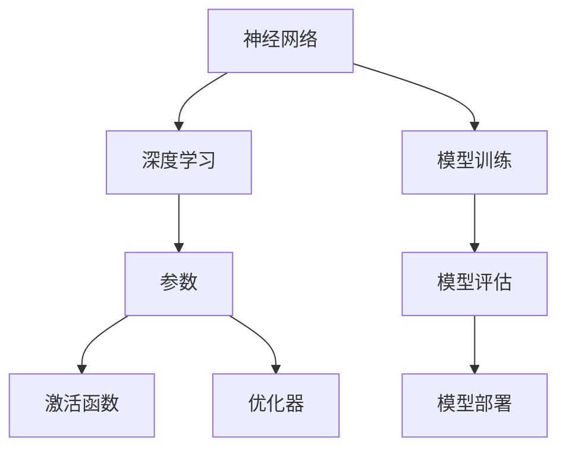

                 

关键词：大模型，应用开发，实战指南，算法原理，数学模型，项目实践，未来展望

> 摘要：本文旨在为读者提供一份系统的大模型应用开发实战指南。通过深入解析大模型的背景、核心概念、算法原理、数学模型、项目实践以及未来展望，帮助读者全面理解大模型应用开发的本质和方法，为后续的深入研究与实践奠定基础。

## 1. 背景介绍

在过去的几十年中，计算机科学和人工智能领域取得了令人瞩目的进展。特别是深度学习技术的崛起，推动了人工智能从理论走向实践。而大模型（Large Models）作为深度学习技术的核心组成部分，成为当前研究和应用的热点。

大模型是指具有数十亿甚至数万亿参数的神经网络模型。这些模型能够通过大量的数据进行训练，从而在图像识别、自然语言处理、语音识别等任务上取得突破性的成果。然而，大模型的开发与应用并非易事，需要深入理解其背后的算法原理、数学模型以及实际操作步骤。

本文将围绕大模型应用开发的主题，系统介绍相关核心概念、算法原理、数学模型、项目实践以及未来展望，旨在为读者提供一份全面的实战指南。

## 2. 核心概念与联系

为了更好地理解大模型，我们首先需要了解一些核心概念，包括神经网络、深度学习、参数、激活函数、优化器等。以下是一个简单的 Mermaid 流程图，展示了这些核心概念之间的联系：



### 2.1 神经网络

神经网络是一种模拟人脑结构和功能的计算模型。它由多个神经元（节点）组成，每个神经元通过权重连接到其他神经元。在神经网络中，信息通过节点之间的连接传递，并通过激活函数进行非线性变换。

### 2.2 深度学习

深度学习是神经网络的一种特殊形式，它通过增加网络的层数（即深度）来提高模型的复杂度和表达能力。深度学习模型通常由多个隐藏层组成，这些隐藏层可以自动学习数据的特征表示。

### 2.3 参数

参数是神经网络模型中的关键组成部分，用于描述神经元之间的连接强度和激活阈值。在训练过程中，参数会根据训练数据不断调整，以优化模型的性能。

### 2.4 激活函数

激活函数用于对神经元的输出进行非线性变换，以引入模型的表达能力。常见的激活函数包括 sigmoid、ReLU、Tanh 等。

### 2.5 优化器

优化器是用于调整模型参数的工具，其目标是使模型在训练过程中收敛到最优解。常见的优化器包括梯度下降、Adam、RMSprop 等。

### 2.6 模型训练、评估与部署

模型训练、评估和部署是神经网络应用开发的三个关键环节。模型训练是指通过大量的数据进行迭代，调整模型参数以优化模型性能。模型评估是指使用独立的测试数据对模型进行性能评估，以判断模型的泛化能力。模型部署是指将训练好的模型部署到实际应用环境中，为用户提供服务。

## 3. 核心算法原理 & 具体操作步骤

### 3.1 算法原理概述

大模型的训练过程涉及多个核心算法，其中最关键的是反向传播算法和优化算法。反向传播算法是一种用于计算模型参数梯度的算法，它通过反向传播误差信号来更新模型参数。优化算法则用于调整模型参数，以优化模型性能。

### 3.2 算法步骤详解

#### 3.2.1 反向传播算法

1. **前向传播**：将输入数据传递到模型中，通过网络计算输出结果。
2. **计算损失**：计算输出结果与真实值之间的差异，得到损失函数值。
3. **反向传播**：计算损失函数关于模型参数的梯度，并反向传播误差信号。
4. **更新参数**：根据梯度信息调整模型参数，以减少损失函数值。

#### 3.2.2 优化算法

1. **初始化参数**：随机初始化模型参数。
2. **计算梯度**：使用反向传播算法计算模型参数的梯度。
3. **更新参数**：根据梯度信息调整模型参数。
4. **迭代更新**：重复步骤 2 和 3，直到模型收敛。

### 3.3 算法优缺点

#### 3.3.1 优点

- **强大的表达能力**：大模型通过增加参数数量和层数，可以自动学习复杂的特征表示。
- **广泛的适用性**：大模型在图像识别、自然语言处理、语音识别等领域取得了显著的成果。

#### 3.3.2 缺点

- **计算资源需求大**：大模型需要大量的计算资源和存储空间。
- **训练时间较长**：大模型需要大量的数据进行训练，训练时间较长。

### 3.4 算法应用领域

大模型在多个领域取得了显著的成果，包括：

- **计算机视觉**：例如图像识别、目标检测、图像分割等。
- **自然语言处理**：例如文本分类、机器翻译、情感分析等。
- **语音识别**：例如语音识别、语音合成等。
- **推荐系统**：例如商品推荐、新闻推荐等。

## 4. 数学模型和公式 & 详细讲解 & 举例说明

### 4.1 数学模型构建

大模型的数学模型主要涉及以下几个方面：

- **前向传播**：输入数据经过多层神经网络计算，得到输出结果。
- **反向传播**：计算损失函数关于模型参数的梯度，并反向传播误差信号。
- **优化算法**：根据梯度信息调整模型参数。

### 4.2 公式推导过程

#### 4.2.1 前向传播

假设有一个多层神经网络，其输入为 \( x \)，输出为 \( y \)，隐藏层节点数为 \( h \)。在 \( k \) 层中，输出 \( z_k \) 和激活值 \( a_k \) 分别为：

\[ z_k = \sum_{j} w_{kj} a_{j,k-1} + b_k \]
\[ a_k = \sigma(z_k) \]

其中，\( \sigma \) 是激活函数，通常取 ReLU 或 sigmoid 函数。

#### 4.2.2 反向传播

假设损失函数为 \( J \)，模型参数为 \( \theta \)，梯度为 \( \frac{\partial J}{\partial \theta} \)。在反向传播过程中，我们需要计算每个参数的梯度。

\[ \frac{\partial J}{\partial \theta} = \frac{\partial J}{\partial z_k} \frac{\partial z_k}{\partial \theta} \]

#### 4.2.3 优化算法

常用的优化算法有梯度下降、Adam、RMSprop 等。以梯度下降为例，其更新规则为：

\[ \theta = \theta - \alpha \frac{\partial J}{\partial \theta} \]

其中，\( \alpha \) 是学习率。

### 4.3 案例分析与讲解

#### 4.3.1 图像识别

以图像识别为例，输入为 \( 28 \times 28 \) 的像素值，输出为类别标签。假设使用一个简单的卷积神经网络，包含两个卷积层和一个全连接层。

1. **前向传播**：

   - 第一层卷积：计算卷积操作，得到特征图。
   - 第二层卷积：对特征图进行卷积操作，得到更高级别的特征图。
   - 全连接层：将特征图展平，输入到全连接层进行分类。

2. **反向传播**：

   - 计算损失函数值。
   - 反向传播误差信号，计算每个参数的梯度。
   - 使用梯度下降算法更新参数。

3. **优化算法**：

   - 初始化参数。
   - 计算梯度。
   - 更新参数。
   - 迭代更新，直到模型收敛。

## 5. 项目实践：代码实例和详细解释说明

### 5.1 开发环境搭建

在开发大模型项目时，需要搭建一个稳定高效的开发环境。以下是一个简单的搭建步骤：

1. 安装 Python：版本要求 3.6 或以上。
2. 安装深度学习框架：例如 TensorFlow、PyTorch 等。
3. 安装其他依赖库：例如 NumPy、Pandas 等。

### 5.2 源代码详细实现

以下是一个简单的卷积神经网络实现，用于图像识别任务：

```python
import torch
import torch.nn as nn

class CNN(nn.Module):
    def __init__(self):
        super(CNN, self).__init__()
        self.conv1 = nn.Conv2d(1, 32, 3, 1)
        self.conv2 = nn.Conv2d(32, 64, 3, 1)
        self.fc1 = nn.Linear(64 * 5 * 5, 128)
        self.fc2 = nn.Linear(128, 10)

    def forward(self, x):
        x = nn.ReLU()(self.conv1(x))
        x = nn.ReLU()(self.conv2(x))
        x = x.view(-1, 64 * 5 * 5)
        x = nn.ReLU()(self.fc1(x))
        x = self.fc2(x)
        return x
```

### 5.3 代码解读与分析

1. **模型定义**：

   - 使用 `nn.Module` 基类定义一个 CNN 模型。
   - 定义两个卷积层和两个全连接层。

2. **前向传播**：

   - 使用 ReLU 激活函数。
   - 将输入数据展平，输入到全连接层。

3. **反向传播**：

   - 使用 PyTorch 的自动微分机制，计算损失函数关于模型参数的梯度。

### 5.4 运行结果展示

以下是一个简单的训练过程：

```python
model = CNN()
optimizer = torch.optim.Adam(model.parameters(), lr=0.001)
criterion = nn.CrossEntropyLoss()

for epoch in range(10):
    for batch in data_loader:
        inputs, targets = batch
        optimizer.zero_grad()
        outputs = model(inputs)
        loss = criterion(outputs, targets)
        loss.backward()
        optimizer.step()
    print(f'Epoch {epoch+1}, Loss: {loss.item()}')
```

## 6. 实际应用场景

大模型在多个领域取得了显著的成果，以下是一些实际应用场景：

### 6.1 计算机视觉

- **图像识别**：如人脸识别、物体检测、图像分割等。
- **视频分析**：如行为识别、目标跟踪、事件检测等。

### 6.2 自然语言处理

- **文本分类**：如情感分析、垃圾邮件过滤等。
- **机器翻译**：如英文翻译、多语言翻译等。
- **对话系统**：如语音助手、聊天机器人等。

### 6.3 语音识别

- **语音识别**：如语音转文字、语音搜索等。
- **语音合成**：如语音助手、广告配音等。

### 6.4 推荐系统

- **商品推荐**：如电商推荐、电影推荐等。
- **新闻推荐**：如新闻头条、个性化推送等。

## 7. 工具和资源推荐

### 7.1 学习资源推荐

- **书籍**：《深度学习》、《Python深度学习实战》等。
- **在线课程**：Coursera、Udacity、edX 等平台上的深度学习相关课程。

### 7.2 开发工具推荐

- **深度学习框架**：TensorFlow、PyTorch、Keras 等。
- **数据处理工具**：Pandas、NumPy、Scikit-learn 等。

### 7.3 相关论文推荐

- **计算机视觉**：《卷积神经网络在图像识别中的应用》、《人脸识别的最新进展》等。
- **自然语言处理**：《自然语言处理综述》、《机器翻译的最新进展》等。
- **语音识别**：《语音识别技术综述》、《语音合成技术综述》等。

## 8. 总结：未来发展趋势与挑战

### 8.1 研究成果总结

大模型在图像识别、自然语言处理、语音识别等领域取得了显著的成果，推动了人工智能技术的快速发展。

### 8.2 未来发展趋势

- **算法优化**：提升大模型的训练效率、减少计算资源需求。
- **跨领域应用**：探索大模型在更多领域的应用，如生物信息学、金融等。
- **知识图谱**：构建大模型与知识图谱的融合模型，实现更智能的推理与决策。

### 8.3 面临的挑战

- **计算资源需求**：大模型需要大量的计算资源和存储空间，对硬件设备提出了更高的要求。
- **数据隐私**：在大规模数据处理过程中，如何保护用户隐私成为一个重要问题。
- **模型可解释性**：如何解释大模型的行为，使其更具透明性和可解释性。

### 8.4 研究展望

随着深度学习技术的不断发展，大模型在未来将会在更多领域取得突破性成果。同时，我们也需要关注其带来的挑战，并积极探索解决方案。

## 9. 附录：常见问题与解答

### 9.1 什么是大模型？

大模型是指具有数十亿甚至数万亿参数的神经网络模型。

### 9.2 大模型的优势有哪些？

大模型具有强大的表达能力，可以自动学习复杂的特征表示，并在多个领域取得了显著的成果。

### 9.3 大模型的劣势有哪些？

大模型需要大量的计算资源和存储空间，训练时间较长。

### 9.4 如何搭建大模型开发环境？

安装 Python、深度学习框架（如 TensorFlow、PyTorch）以及其他依赖库。

### 9.5 大模型在哪些领域有应用？

大模型在图像识别、自然语言处理、语音识别、推荐系统等领域有广泛应用。

---

以上是《大模型应用开发的实战指南》的完整内容。希望本文能为读者提供一份有价值的参考，帮助读者更好地理解大模型应用开发的本质和方法。在后续的研究与实践中，读者可以不断探索和尝试，为人工智能技术的发展贡献自己的力量。作者：禅与计算机程序设计艺术 / Zen and the Art of Computer Programming。

