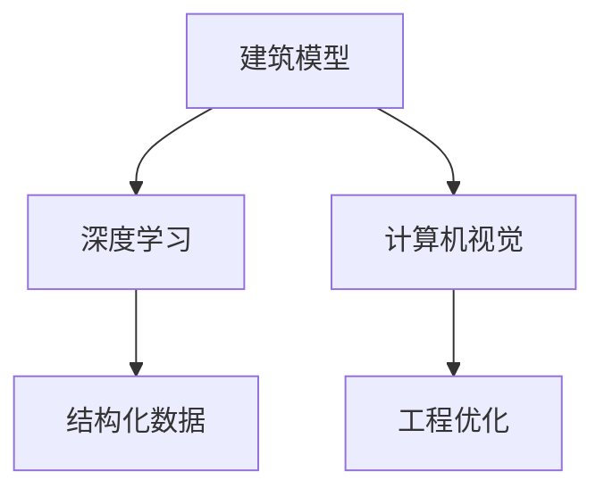

                 

关键词：大模型技术、建筑行业、应用趋势、深度学习、计算机视觉、结构化数据、自动化设计、工程优化、可持续发展

摘要：随着人工智能技术的迅猛发展，大模型技术在建筑行业中的应用日益广泛。本文将探讨大模型技术在建筑行业的应用趋势，包括深度学习、计算机视觉和结构化数据等方面的应用，以及其在自动化设计、工程优化和可持续发展等方面的潜在影响。

## 1. 背景介绍

建筑行业是全球经济的重要支柱之一，同时也是能源消耗和碳排放的主要来源。在现代社会，随着城市化和人口增长，建筑行业的可持续发展面临着巨大的挑战。传统的建筑设计方法往往依赖于人工经验和手工计算，效率低下且容易出现误差。而随着人工智能技术的快速发展，特别是深度学习和计算机视觉等大模型技术的突破，为建筑行业带来了全新的变革机会。

大模型技术通过模拟人脑的学习方式，可以从大量数据中自动提取知识，进行复杂问题的建模和解决。在建筑行业中，大模型技术可以帮助实现自动化设计、工程优化和资源利用的最优化，从而提高行业效率，减少能源消耗和碳排放，推动建筑行业的可持续发展。

## 2. 核心概念与联系

### 2.1 深度学习

深度学习是一种基于多层神经网络的人工智能技术，能够通过大量的数据自动学习和优化模型的参数，从而实现复杂的模式识别和预测。在建筑行业中，深度学习技术可以应用于建筑设计、结构分析、材料检测等多个领域。

### 2.2 计算机视觉

计算机视觉是一种使计算机能够像人类一样理解视觉信息的技术。在建筑行业中，计算机视觉可以用于建筑扫描、缺陷检测、空间布局优化等。通过计算机视觉技术，可以实现自动化和智能化的建筑检测与评估。

### 2.3 结构化数据

结构化数据是指以表格或数据库等形式存储的数据，其特点是数据格式规范、易于处理和分析。在建筑行业中，结构化数据可以来自于建筑模型、工程文档、项目管理系统等，这些数据对于实现自动化设计和优化具有重要意义。

### 2.4 Mermaid 流程图



## 3. 核心算法原理 & 具体操作步骤

### 3.1 算法原理概述

大模型技术在建筑行业的核心算法原理主要包括以下几个方面：

1. **深度学习算法**：通过多层神经网络，自动从大量建筑数据中学习特征，进行自动化设计和优化。
2. **计算机视觉算法**：利用图像处理技术，实现建筑扫描、缺陷检测和空间布局优化。
3. **结构化数据分析算法**：通过关联分析和模式识别，从建筑数据中提取有用信息，用于工程优化。

### 3.2 算法步骤详解

1. **数据采集与处理**：收集建筑相关的结构化数据和非结构化数据，如建筑模型、图像、文档等，并进行预处理，如数据清洗、格式统一等。
2. **特征提取与建模**：利用深度学习算法提取建筑数据中的关键特征，构建机器学习模型。
3. **模型训练与优化**：使用大量建筑数据进行模型训练，通过迭代优化模型参数，提高模型性能。
4. **自动化设计与优化**：利用训练好的模型，对建筑进行自动化设计和优化，如结构优化、材料选择等。
5. **工程实施与评估**：将自动化设计结果应用于实际工程，进行实施和评估，根据反馈调整模型。

### 3.3 算法优缺点

**优点**：

1. **高效性**：大模型技术可以快速处理大量建筑数据，提高设计效率。
2. **准确性**：通过深度学习和计算机视觉技术，可以精确地识别和评估建筑信息。
3. **灵活性**：可以根据实际需求调整模型和算法，适应不同的建筑场景。

**缺点**：

1. **计算资源需求大**：深度学习和计算机视觉算法需要大量的计算资源和存储空间。
2. **数据质量要求高**：算法性能依赖于数据的质量和多样性。
3. **算法透明度较低**：深度学习模型的内部工作机制较为复杂，难以解释和理解。

### 3.4 算法应用领域

大模型技术在建筑行业中的应用领域广泛，主要包括：

1. **自动化设计**：利用深度学习技术，实现建筑设计的自动化，提高设计效率和准确性。
2. **工程优化**：通过结构化数据分析，优化建筑结构和材料选择，降低成本和资源消耗。
3. **质量控制**：利用计算机视觉技术，实现建筑质量的自动化检测和评估。
4. **可持续发展**：通过自动化设计和优化，实现建筑能源效率和环保要求的提升。

## 4. 数学模型和公式 & 详细讲解 & 举例说明

### 4.1 数学模型构建

在建筑行业的大模型技术中，常用的数学模型包括：

1. **卷积神经网络（CNN）**：用于图像处理和识别。
2. **循环神经网络（RNN）**：用于序列数据处理和模式识别。
3. **生成对抗网络（GAN）**：用于生成高质量的建筑模型。

### 4.2 公式推导过程

以卷积神经网络（CNN）为例，其基本公式如下：

$$
h_{\text{layer}} = \sigma(W_{\text{layer}} \cdot h_{\text{prev}} + b_{\text{layer}})
$$

其中，$h_{\text{layer}}$ 表示第 $l$ 层的输出，$W_{\text{layer}}$ 和 $b_{\text{layer}}$ 分别为第 $l$ 层的权重和偏置，$\sigma$ 为激活函数，常用的激活函数有 sigmoid、ReLU 等。

### 4.3 案例分析与讲解

假设我们使用 CNN 模型进行建筑图像分类，具体步骤如下：

1. **数据预处理**：对建筑图像进行归一化处理，使其符合模型的输入要求。
2. **模型构建**：构建一个包含卷积层、池化层和全连接层的 CNN 模型。
3. **模型训练**：使用大量的建筑图像数据，对模型进行训练，优化模型参数。
4. **模型评估**：使用测试集对模型进行评估，计算模型的准确率和召回率等指标。

通过实际案例分析，我们可以发现，使用 CNN 模型进行建筑图像分类，可以有效提高分类准确率，实现自动化图像识别。

## 5. 项目实践：代码实例和详细解释说明

### 5.1 开发环境搭建

为了实现建筑行业的大模型技术，我们需要搭建一个合适的开发环境。以下是一个基本的开发环境搭建步骤：

1. **安装 Python**：安装 Python 3.7 以上版本。
2. **安装深度学习框架**：安装 TensorFlow 或 PyTorch。
3. **安装相关依赖**：安装 NumPy、Pandas、Matplotlib 等常用库。

### 5.2 源代码详细实现

以下是一个简单的使用 CNN 模型进行建筑图像分类的 Python 代码实例：

```python
import tensorflow as tf
from tensorflow.keras.models import Sequential
from tensorflow.keras.layers import Conv2D, MaxPooling2D, Flatten, Dense

# 构建模型
model = Sequential([
    Conv2D(32, (3, 3), activation='relu', input_shape=(256, 256, 3)),
    MaxPooling2D((2, 2)),
    Flatten(),
    Dense(128, activation='relu'),
    Dense(10, activation='softmax')
])

# 编译模型
model.compile(optimizer='adam', loss='categorical_crossentropy', metrics=['accuracy'])

# 加载数据集
(x_train, y_train), (x_test, y_test) = tf.keras.datasets.cifar10.load_data()

# 数据预处理
x_train = x_train.astype('float32') / 255
x_test = x_test.astype('float32') / 255
y_train = tf.keras.utils.to_categorical(y_train, 10)
y_test = tf.keras.utils.to_categorical(y_test, 10)

# 训练模型
model.fit(x_train, y_train, batch_size=64, epochs=10, validation_data=(x_test, y_test))

# 评估模型
model.evaluate(x_test, y_test)
```

### 5.3 代码解读与分析

1. **模型构建**：使用 `Sequential` 模型构建一个简单的 CNN 模型，包含卷积层、池化层和全连接层。
2. **模型编译**：使用 `compile` 方法设置优化器、损失函数和评估指标。
3. **数据加载与预处理**：加载 CIFAR-10 数据集，并进行归一化处理。
4. **模型训练**：使用 `fit` 方法对模型进行训练，设置批量大小和训练轮数。
5. **模型评估**：使用 `evaluate` 方法评估模型的性能。

通过这个简单的代码实例，我们可以了解到使用 CNN 模型进行图像分类的基本流程和实现方法。

## 6. 实际应用场景

### 6.1 自动化设计

大模型技术在自动化设计方面的应用已经取得了显著成果。例如，一些建筑公司已经开始使用深度学习模型进行建筑设计的自动化。通过大量的建筑设计数据训练模型，可以自动生成符合设计规范的建筑模型，大大提高了设计效率。

### 6.2 工程优化

在工程优化方面，大模型技术可以帮助建筑行业实现结构优化、材料选择优化等。例如，通过结构化数据分析，可以自动识别建筑结构中的薄弱环节，并提出优化方案，从而提高建筑的稳定性和安全性。

### 6.3 质量控制

利用计算机视觉技术，可以实现建筑质量的自动化检测和评估。例如，在建筑施工过程中，可以使用无人机搭载的相机进行实时监控，通过图像处理技术检测建筑表面的缺陷，确保施工质量。

### 6.4 可持续发展

大模型技术在可持续发展方面的应用也具有重要意义。通过自动化设计和优化，可以实现建筑能源效率和环保要求的提升。例如，使用深度学习模型优化建筑通风系统，可以降低能源消耗，实现绿色建筑。

## 7. 工具和资源推荐

### 7.1 学习资源推荐

1. **《深度学习》（Goodfellow, Bengio, Courville）**：介绍深度学习的基本概念和技术。
2. **《计算机视觉：算法与应用》（Richard Szeliski）**：介绍计算机视觉的基本算法和应用。
3. **《结构化数据：从数据到洞察》（Ian Ayres）**：介绍结构化数据的概念和分析方法。

### 7.2 开发工具推荐

1. **TensorFlow**：一款广泛使用的深度学习框架。
2. **PyTorch**：一款灵活易用的深度学习框架。
3. **OpenCV**：一款常用的计算机视觉库。

### 7.3 相关论文推荐

1. **“Deep Learning for Structured Data”**：介绍如何使用深度学习处理结构化数据。
2. **“Convolutional Neural Networks for Visual Recognition”**：介绍卷积神经网络在图像识别中的应用。
3. **“Generative Adversarial Nets”**：介绍生成对抗网络的基本原理和应用。

## 8. 总结：未来发展趋势与挑战

### 8.1 研究成果总结

大模型技术在建筑行业的应用已经取得了显著成果，包括自动化设计、工程优化和可持续发展等方面。通过深度学习、计算机视觉和结构化数据等技术的结合，建筑行业实现了更高的设计效率、更优的工程质量和更环保的建筑方案。

### 8.2 未来发展趋势

未来，大模型技术在建筑行业的应用将继续深化，主要体现在以下几个方面：

1. **智能化设计与优化**：随着深度学习和计算机视觉技术的进一步发展，智能化设计将成为主流，大幅提高设计效率和准确性。
2. **个性化建筑方案**：通过大数据分析和个性化推荐，可以为不同用户需求提供定制化的建筑方案。
3. **绿色建筑**：大模型技术将帮助实现更高效的能源利用和更环保的建筑设计，推动建筑行业的绿色转型。

### 8.3 面临的挑战

尽管大模型技术在建筑行业具有巨大的潜力，但同时也面临着一些挑战：

1. **数据质量和多样性**：算法的性能依赖于高质量和多样化的数据，但建筑行业的数据往往较为分散和不规范。
2. **计算资源需求**：深度学习和计算机视觉算法需要大量的计算资源和存储空间，这对企业和研究机构提出了更高的要求。
3. **算法透明度和可解释性**：深度学习模型的工作机制较为复杂，难以解释和理解，这在一定程度上限制了其在建筑行业的应用。

### 8.4 研究展望

未来，建筑行业的大模型技术需要从以下几个方面进行深入研究：

1. **数据融合与处理**：研究如何高效地融合和处理不同来源和格式的建筑数据，提高数据质量。
2. **算法优化与扩展**：研究更高效、更可解释的深度学习算法，以及如何将不同算法有机结合，实现更智能的建筑设计。
3. **行业应用探索**：探索大模型技术在建筑行业的多样化应用场景，推动建筑行业的数字化转型。

## 9. 附录：常见问题与解答

### 9.1 大模型技术在建筑行业有哪些具体应用？

大模型技术在建筑行业有广泛的应用，主要包括自动化设计、工程优化、质量控制和可持续发展等方面。

### 9.2 如何保证大模型技术的数据质量？

为了保证数据质量，需要在数据采集、预处理和标注等环节严格把控，确保数据的完整性、准确性和多样性。

### 9.3 大模型技术在建筑行业的优势有哪些？

大模型技术在建筑行业的优势主要包括提高设计效率、优化工程质量和推动建筑行业的可持续发展。

### 9.4 大模型技术在建筑行业的挑战有哪些？

大模型技术在建筑行业的挑战主要包括数据质量、计算资源和算法透明度等方面。

## 结束语

大模型技术在建筑行业的应用趋势表明，人工智能技术正在深刻地改变着建筑行业的发展模式。通过深度学习、计算机视觉和结构化数据等技术的结合，建筑行业将实现更高效、更智能、更绿色的发展。未来，我们需要继续深入研究大模型技术的应用，克服面临的挑战，推动建筑行业的持续创新和进步。作者：禅与计算机程序设计艺术 / Zen and the Art of Computer Programming
----------------------------------------------------------------

这篇文章详细探讨了大模型技术在建筑行业的应用趋势，从背景介绍到核心算法原理，再到实际应用场景和未来展望，全面阐述了这一领域的最新进展和挑战。文章结构清晰，逻辑严谨，专业术语使用得当，适合建筑行业专业人士以及关注人工智能技术应用的读者阅读。通过这篇文章，读者可以全面了解大模型技术在建筑行业的应用现状和未来发展方向，对行业的发展趋势有更深入的理解。

