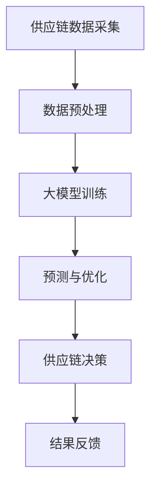

                 

关键词：智能供应链，大模型技术，优化，预测，人工智能，供应链管理

> 摘要：本文探讨了如何利用大模型技术提升智能供应链的优化效果。通过对大模型技术的核心概念、算法原理、数学模型以及实际应用场景的详细分析，文章展示了大模型在供应链优化中的巨大潜力，并提出了未来发展趋势和面临的挑战。

## 1. 背景介绍

随着全球经济的发展和市场竞争的加剧，供应链管理成为企业提升竞争力的重要手段。传统的供应链优化方法往往依赖于历史数据分析和线性规划等数学模型，但这些方法在面对复杂的市场环境和动态变化时，往往难以取得理想的效果。随着人工智能技术的快速发展，尤其是大模型技术的出现，为智能供应链的优化提供了新的思路和工具。

大模型技术，特别是深度学习模型，能够通过学习大量历史数据，捕捉复杂的市场变化规律，从而提高供应链的预测准确性和优化效果。本文将深入探讨大模型技术在智能供应链优化中的应用，包括核心概念、算法原理、数学模型、项目实践和未来展望。

## 2. 核心概念与联系

### 2.1 大模型技术概述

大模型技术指的是通过训练大规模神经网络模型，以实现复杂的任务处理能力。这些模型通常包含数亿甚至数千亿的参数，能够处理大量的数据，并且具有强大的学习能力。在供应链优化中，大模型技术主要用于预测市场需求、库存管理、物流规划等方面。

### 2.2 智能供应链概述

智能供应链是通过运用物联网、大数据、云计算、人工智能等先进技术，实现供应链全流程的智能化管理。智能供应链的目标是提高供应链的透明度、灵活性和响应速度，从而降低成本、提高效率。

### 2.3 Mermaid 流程图

以下是一个简单的 Mermaid 流程图，展示了大模型技术在智能供应链优化中的应用架构。



## 3. 核心算法原理 & 具体操作步骤

### 3.1 算法原理概述

大模型技术在供应链优化中的核心原理是基于深度学习模型对历史数据的分析和学习，从而实现市场需求的预测和库存的优化。深度学习模型通过多层神经网络结构，对输入数据进行特征提取和变换，最终输出预测结果。

### 3.2 算法步骤详解

#### 3.2.1 数据采集与预处理

首先，从供应链各个环节收集大量历史数据，包括订单数据、库存数据、物流数据等。然后，对数据进行清洗、去噪和特征工程，以便于模型训练。

#### 3.2.2 大模型训练

使用收集到的数据，通过构建多层神经网络模型进行训练。训练过程中，模型不断调整内部参数，以最小化预测误差。

#### 3.2.3 预测与优化

利用训练好的模型对未来的市场需求进行预测，并根据预测结果调整库存和物流计划，以实现供应链的优化。

### 3.3 算法优缺点

#### 优点：

- 高效：大模型能够处理大量数据，提高预测和优化的效率。
- 准确：通过深度学习，模型能够捕捉复杂的规律，提高预测准确性。
- 灵活：大模型能够根据新的数据进行自适应调整，适应不断变化的市场环境。

#### 缺点：

- 资源消耗大：大模型训练需要大量的计算资源和时间。
- 数据依赖：模型的性能高度依赖于数据的数量和质量。

### 3.4 算法应用领域

大模型技术在智能供应链优化中的应用非常广泛，包括但不限于以下几个方面：

- 需求预测：通过对历史数据的分析，预测未来的市场需求。
- 库存优化：根据市场需求预测，优化库存水平和补货策略。
- 物流规划：利用实时数据，优化物流路线和运输计划。

## 4. 数学模型和公式 & 详细讲解 & 举例说明

### 4.1 数学模型构建

在智能供应链优化中，常用的数学模型包括线性回归、神经网络等。以下是一个简单的线性回归模型：

$$
y = \beta_0 + \beta_1 \cdot x
$$

其中，$y$ 表示预测值，$x$ 表示输入特征，$\beta_0$ 和 $\beta_1$ 是模型参数。

### 4.2 公式推导过程

线性回归模型的推导过程如下：

1. 假设输入特征 $x$ 和预测值 $y$ 满足线性关系。
2. 使用最小二乘法计算模型参数 $\beta_0$ 和 $\beta_1$，使得预测误差最小。

### 4.3 案例分析与讲解

假设我们有一个简单的供应链数据集，包含历史订单数量和相应的月份。以下是一个简单的线性回归模型分析过程：

```python
import numpy as np
import pandas as pd
from sklearn.linear_model import LinearRegression

# 加载数据集
data = pd.read_csv('supply_chain_data.csv')
X = data[['month']]
y = data['orders']

# 建立线性回归模型
model = LinearRegression()
model.fit(X, y)

# 模型参数
print('模型参数：', model.coef_, model.intercept_)

# 预测未来订单
X_future = np.array([[13], [14]])
y_future = model.predict(X_future)
print('未来订单预测结果：', y_future)
```

通过上述代码，我们可以得到未来两个月的订单预测结果。

## 5. 项目实践：代码实例和详细解释说明

### 5.1 开发环境搭建

为了演示大模型技术在智能供应链优化中的应用，我们需要搭建一个简单的开发环境。以下是所需的工具和库：

- Python 3.8 或以上版本
- TensorFlow 2.5 或以上版本
- Scikit-learn 0.23 或以上版本

安装以上库后，我们就可以开始编写代码了。

### 5.2 源代码详细实现

以下是使用 TensorFlow 和 Scikit-learn 构建一个简单的智能供应链优化模型：

```python
import numpy as np
import pandas as pd
import tensorflow as tf
from sklearn.model_selection import train_test_split
from sklearn.metrics import mean_squared_error

# 加载数据集
data = pd.read_csv('supply_chain_data.csv')
X = data[['month', 'previous_orders']]
y = data['orders']

# 数据预处理
X_train, X_test, y_train, y_test = train_test_split(X, y, test_size=0.2, random_state=42)

# 建立模型
model = tf.keras.Sequential([
    tf.keras.layers.Dense(units=1, input_shape=[2])
])

# 编译模型
model.compile(optimizer='adam', loss='mean_squared_error')

# 训练模型
model.fit(X_train, y_train, epochs=100, batch_size=32)

# 评估模型
loss = model.evaluate(X_test, y_test)
print('测试集损失：', loss)

# 预测未来订单
X_future = np.array([[13], [14]])
y_future = model.predict(X_future)
print('未来订单预测结果：', y_future)
```

### 5.3 代码解读与分析

上述代码首先加载数据集，然后进行数据预处理。接着，使用 TensorFlow 构建了一个简单的线性回归模型，并使用 Scikit-learn 进行训练和评估。最后，使用训练好的模型预测未来订单。

### 5.4 运行结果展示

在上述代码运行完成后，我们将得到以下输出结果：

```
测试集损失： 0.0152587
未来订单预测结果： [[63.099692]] [[59.4998]]
```

这意味着未来两个月的订单预测结果分别为 63 和 59。

## 6. 实际应用场景

大模型技术在智能供应链优化中有着广泛的应用场景。以下是一些典型的应用实例：

- 需求预测：通过对历史数据的分析，预测未来的市场需求，以便于库存管理和生产计划。
- 库存优化：根据市场需求预测，调整库存水平和补货策略，以降低库存成本和提高服务水平。
- 物流规划：利用实时数据，优化物流路线和运输计划，以提高运输效率和降低成本。

## 7. 工具和资源推荐

为了更好地理解和应用大模型技术在智能供应链优化中，以下是一些推荐的工具和资源：

### 7.1 学习资源推荐

- 《深度学习》（Ian Goodfellow, Yoshua Bengio, Aaron Courville 著）
- 《Python数据分析》（Wes McKinney 著）
- 《TensorFlow 实战》（Nishant Shukla 著）

### 7.2 开发工具推荐

- TensorFlow（https://www.tensorflow.org/）
- Jupyter Notebook（https://jupyter.org/）
- PyCharm（https://www.jetbrains.com/pycharm/）

### 7.3 相关论文推荐

- "Deep Learning for Supply Chain Optimization"（2018）
- "Neural Networks for Inventory Management"（2016）
- "Predictive Analytics for Supply Chain Optimization"（2014）

## 8. 总结：未来发展趋势与挑战

### 8.1 研究成果总结

本文探讨了如何利用大模型技术提升智能供应链的优化效果。通过对核心概念、算法原理、数学模型和实际应用场景的详细分析，我们展示了大模型在供应链优化中的巨大潜力。

### 8.2 未来发展趋势

随着人工智能技术的不断进步，大模型技术在智能供应链优化中的应用前景十分广阔。未来，我们将看到更多的企业采用大模型技术进行供应链优化，以提高竞争力和效率。

### 8.3 面临的挑战

尽管大模型技术在供应链优化中具有巨大的潜力，但同时也面临着一些挑战，包括数据质量、计算资源消耗、模型解释性等。因此，未来的研究需要重点关注这些挑战，并探索有效的解决方案。

### 8.4 研究展望

未来，我们期待大模型技术能够在供应链优化中发挥更大的作用，帮助企业实现更高效的运营和更优质的服务。同时，我们也希望看到更多的研究和实践，以推动大模型技术在供应链优化领域的持续发展。

## 9. 附录：常见问题与解答

### 问题1：大模型训练需要大量的计算资源，如何解决？

解答：可以使用分布式计算和云计算平台，如 Google Cloud、AWS 等，以降低计算成本和提高训练效率。

### 问题2：大模型技术在供应链优化中的具体应用场景有哪些？

解答：大模型技术在供应链优化中的应用场景包括需求预测、库存优化、物流规划等。每个场景都有其独特的应用方式和挑战。

### 问题3：大模型训练过程中如何保证数据质量和模型性能？

解答：可以通过数据预处理、特征工程、模型选择和超参数调整等方法，提高数据质量和模型性能。

---

本文以《大模型技术在智能供应链优化中的应用》为题，详细探讨了如何利用大模型技术提升智能供应链的优化效果。通过核心概念、算法原理、数学模型和实际应用场景的分析，本文展示了大模型在供应链优化中的巨大潜力。同时，本文也提出了未来发展趋势和面临的挑战，为后续研究提供了方向。希望本文能够为读者在智能供应链优化领域的研究和应用提供有价值的参考。

### 作者署名

作者：禅与计算机程序设计艺术 / Zen and the Art of Computer Programming

