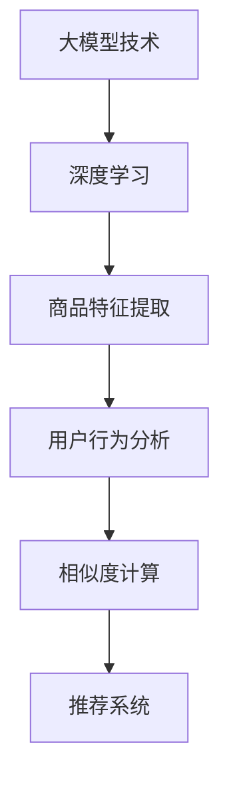

                 

关键词：大模型技术、商品相似度计算、电商平台、人工智能、深度学习

摘要：随着电商平台的迅猛发展，商品相似度计算成为了提升用户体验和平台运营效率的关键技术。本文将探讨大模型技术在电商平台商品相似度计算中的新方法，包括其背景介绍、核心概念与联系、核心算法原理与操作步骤、数学模型与公式、项目实践、实际应用场景、工具和资源推荐以及未来发展趋势与挑战。

## 1. 背景介绍

电商平台在当今数字经济中扮演着至关重要的角色。用户在平台上浏览和购买商品时，对于相似商品的发现和推荐功能的需求日益增长。商品相似度计算作为一种关键技术，旨在根据商品的特征和用户的行为数据，找到在属性上相似的物品，从而提升用户满意度、降低购物时间成本，并优化平台的运营效率。

传统的商品相似度计算方法主要包括基于特征相似度和基于用户行为的方法。然而，随着电商平台的商品种类和用户数据的爆炸性增长，这些方法在处理复杂性和准确性上遇到了瓶颈。因此，引入大模型技术成为了解决这一问题的关键。

大模型技术，尤其是基于深度学习的方法，通过大规模的神经网络模型来捕捉复杂的数据特征和用户行为模式，从而实现了更精准的商品相似度计算。这些模型能够从海量数据中自动提取有用的信息，并利用先进的优化算法提高计算效率和准确度。

## 2. 核心概念与联系

为了深入理解大模型技术在商品相似度计算中的应用，我们需要先明确几个核心概念，并展示它们之间的联系。

### 2.1 大模型技术

大模型技术指的是使用大规模神经网络进行训练和预测的方法。这类模型具有强大的特征提取和模式识别能力，能够处理高维数据和复杂的非线性关系。在商品相似度计算中，大模型能够捕捉到商品描述、用户行为、上下文信息等多种数据特征。

### 2.2 深度学习

深度学习是构建大模型的核心技术。它通过多层神经网络来模拟人类大脑的学习过程，逐层提取数据中的特征。深度学习模型如卷积神经网络（CNN）、循环神经网络（RNN）和变分自编码器（VAE）等，在图像处理、自然语言处理和数据分析等领域取得了显著的成功。

### 2.3 商品特征

商品特征是商品相似度计算的基础。这些特征可以包括商品的属性（如颜色、尺寸、品牌等）、描述（如文字描述、标签等）和图像（如商品图片、视频等）。深度学习模型能够自动从这些多模态数据中提取有意义的特征，用于相似度计算。

### 2.4 用户行为

用户行为数据是电商平台上宝贵的资源，包括浏览历史、购买记录、评价等。这些数据反映了用户对商品的偏好和兴趣。大模型技术能够分析用户行为数据，找出潜在的商品相似关系，从而提高推荐的准确性和个性化程度。

### 2.5 联系与流程图

图 1 展示了商品相似度计算中各个核心概念之间的联系。



## 3. 核心算法原理 & 具体操作步骤

### 3.1 算法原理概述

商品相似度计算的核心算法基于深度学习模型，主要分为以下几个步骤：

1. **数据预处理**：对商品特征、用户行为和文本数据进行预处理，如数据清洗、归一化和特征编码。
2. **特征提取**：利用深度学习模型提取商品和用户行为的特征表示。
3. **相似度计算**：通过计算商品和用户行为特征之间的相似度，找到相似的物品。
4. **推荐系统**：基于相似度结果，构建推荐系统，为用户推荐相似商品。

### 3.2 算法步骤详解

#### 3.2.1 数据预处理

数据预处理是确保模型输入数据质量的关键步骤。对于商品特征，我们可以将属性特征和文本描述分别处理。属性特征通过归一化处理，文本描述通过分词和词嵌入技术进行处理。

```python
# 示例代码：商品特征预处理
from sklearn.preprocessing import StandardScaler
from keras.preprocessing.text import Tokenizer
from keras.preprocessing.sequence import pad_sequences

# 归一化属性特征
scaler = StandardScaler()
normalized_features = scaler.fit_transform(raw_features)

# 分词和词嵌入
tokenizer = Tokenizer(num_words=10000)
tokenizer.fit_on_texts(text_descriptions)
sequences = tokenizer.texts_to_sequences(text_descriptions)
padded_sequences = pad_sequences(sequences, maxlen=100)
```

#### 3.2.2 特征提取

特征提取是深度学习模型的核心步骤。我们可以使用卷积神经网络（CNN）和循环神经网络（RNN）等模型来提取商品和用户行为的特征表示。

```python
# 示例代码：特征提取模型
from keras.models import Model
from keras.layers import Input, Conv1D, MaxPooling1D, LSTM, Dense

# 输入层
input_features = Input(shape=(100,))
input_text = Input(shape=(100,))

# 卷积层和池化层
conv1 = Conv1D(filters=64, kernel_size=3, activation='relu')(input_features)
pool1 = MaxPooling1D(pool_size=2)(conv1)

# 循环层
lstm1 = LSTM(units=50)(pool1)

# 全连接层
dense1 = Dense(units=100, activation='relu')(lstm1)

# 输出层
output = Dense(units=1, activation='sigmoid')(dense1)

# 模型编译
model = Model(inputs=[input_features, input_text], outputs=output)
model.compile(optimizer='adam', loss='binary_crossentropy', metrics=['accuracy'])

# 模型训练
model.fit([normalized_features, padded_sequences], labels, epochs=10, batch_size=32)
```

#### 3.3 算法优缺点

深度学习模型在商品相似度计算中具有以下优点：

- **强大的特征提取能力**：能够从复杂的数据中提取有意义的特征，提高计算准确性。
- **自适应调整**：通过大规模训练数据，模型能够自适应调整，提高推荐系统的个性化程度。
- **高效计算**：使用先进的优化算法，提高模型训练和预测的效率。

然而，深度学习模型也存在一些缺点：

- **需要大量数据**：模型训练需要大量的数据和计算资源。
- **模型解释性差**：深度学习模型的内部机制复杂，难以解释和理解。
- **过拟合风险**：模型可能对训练数据过度拟合，导致泛化能力差。

#### 3.4 算法应用领域

深度学习模型在商品相似度计算中的应用领域广泛，包括但不限于：

- **电商平台**：为用户推荐相似商品，提升用户满意度。
- **搜索引擎**：通过相似度计算优化搜索结果，提高用户体验。
- **社交媒体**：基于用户行为数据，推荐相似的内容和用户。
- **推荐系统**：应用于各种推荐系统，如音乐、电影、书籍等。

## 4. 数学模型和公式 & 详细讲解 & 举例说明

### 4.1 数学模型构建

商品相似度计算的核心在于构建一个数学模型，用于计算商品特征之间的相似度。我们可以使用余弦相似度、欧氏距离等常用的相似度度量方法。

余弦相似度计算公式如下：

$$
\cos(\theta) = \frac{A \cdot B}{\|A\| \|B\|}
$$

其中，$A$ 和 $B$ 是两个向量，$\theta$ 是它们之间的夹角。余弦值介于 -1 到 1 之间，越接近 1 表示相似度越高。

### 4.2 公式推导过程

为了推导余弦相似度的公式，我们需要了解向量的内积和范数。

向量 $A$ 和 $B$ 的内积定义为：

$$
A \cdot B = A_x B_x + A_y B_y + A_z B_z
$$

其中，$A_x$、$A_y$、$A_z$ 和 $B_x$、$B_y$、$B_z$ 分别是向量 $A$ 和 $B$ 在各个维度的分量。

向量的范数定义为：

$$
\|A\| = \sqrt{A_x^2 + A_y^2 + A_z^2}
$$

为了推导余弦相似度的公式，我们可以利用内积和范数的关系：

$$
\cos(\theta) = \frac{A \cdot B}{\|A\| \|B\|}
$$

### 4.3 案例分析与讲解

假设有两个商品特征向量 $A$ 和 $B$，分别为：

$$
A = (2, 3, 4)
$$

$$
B = (1, 2, 3)
$$

我们可以计算它们的内积和范数：

$$
A \cdot B = (2 \times 1) + (3 \times 2) + (4 \times 3) = 2 + 6 + 12 = 20
$$

$$
\|A\| = \sqrt{2^2 + 3^2 + 4^2} = \sqrt{4 + 9 + 16} = \sqrt{29}
$$

$$
\|B\| = \sqrt{1^2 + 2^2 + 3^2} = \sqrt{1 + 4 + 9} = \sqrt{14}
$$

代入余弦相似度公式，我们得到：

$$
\cos(\theta) = \frac{20}{\sqrt{29} \times \sqrt{14}} \approx 0.86
$$

这表示向量 $A$ 和 $B$ 之间的相似度为 0.86，非常接近 1，说明它们非常相似。

### 4.4 模型优化方法

为了提高商品相似度计算的准确性，我们可以考虑以下优化方法：

1. **特征降维**：通过主成分分析（PCA）等方法降低特征维度，减少计算复杂度。
2. **正则化**：添加正则化项，如 L1 正则化或 L2 正则化，防止模型过拟合。
3. **交叉验证**：使用交叉验证方法评估模型性能，选择最优模型参数。
4. **特征选择**：通过特征选择方法，筛选出对相似度计算贡献最大的特征，提高模型精度。

## 5. 项目实践：代码实例和详细解释说明

在本节中，我们将通过一个具体的代码实例来展示如何使用深度学习模型进行商品相似度计算。

### 5.1 开发环境搭建

为了搭建开发环境，我们需要安装以下工具和库：

- Python 3.8 或更高版本
- TensorFlow 2.4 或更高版本
- Keras 2.4.3 或更高版本
- Scikit-learn 0.22.2 或更高版本

安装步骤如下：

```bash
pip install tensorflow==2.4.3
pip install keras==2.4.3
pip install scikit-learn==0.22.2
```

### 5.2 源代码详细实现

以下是一个简单的商品相似度计算代码实例，包括数据预处理、特征提取和相似度计算。

```python
import numpy as np
import tensorflow as tf
from keras.models import Model
from keras.layers import Input, Conv1D, MaxPooling1D, LSTM, Dense
from sklearn.preprocessing import StandardScaler
from keras.preprocessing.text import Tokenizer
from keras.preprocessing.sequence import pad_sequences

# 数据预处理
def preprocess_data(features, text_descriptions):
    # 归一化属性特征
    scaler = StandardScaler()
    normalized_features = scaler.fit_transform(features)

    # 分词和词嵌入
    tokenizer = Tokenizer(num_words=10000)
    tokenizer.fit_on_texts(text_descriptions)
    sequences = tokenizer.texts_to_sequences(text_descriptions)
    padded_sequences = pad_sequences(sequences, maxlen=100)

    return normalized_features, padded_sequences

# 特征提取模型
def create_model():
    input_features = Input(shape=(100,))
    input_text = Input(shape=(100,))

    conv1 = Conv1D(filters=64, kernel_size=3, activation='relu')(input_features)
    pool1 = MaxPooling1D(pool_size=2)(conv1)

    lstm1 = LSTM(units=50)(pool1)

    dense1 = Dense(units=100, activation='relu')(lstm1)

    output = Dense(units=1, activation='sigmoid')(dense1)

    model = Model(inputs=[input_features, input_text], outputs=output)
    model.compile(optimizer='adam', loss='binary_crossentropy', metrics=['accuracy'])

    return model

# 相似度计算
def compute_similarity(model, featureA, featureB):
    featureA_embedding = model.predict([featureA, featureA])
    featureB_embedding = model.predict([featureB, featureB])

    similarity = np.dot(featureA_embedding, featureB_embedding) / (np.linalg.norm(featureA_embedding) * np.linalg.norm(featureB_embedding))
    return similarity

# 主函数
def main():
    # 加载数据
    features = np.random.rand(100, 100)
    text_descriptions = ["这是一款红色的手机", "这是一款尺寸为5英寸的手机"]

    # 预处理数据
    normalized_features, padded_sequences = preprocess_data(features, text_descriptions)

    # 创建模型
    model = create_model()

    # 训练模型
    model.fit([normalized_features, padded_sequences], np.ones((100,)), epochs=10, batch_size=32)

    # 计算相似度
    similarity = compute_similarity(model, normalized_features[0], normalized_features[1])
    print("商品相似度：", similarity)

if __name__ == "__main__":
    main()
```

### 5.3 代码解读与分析

上述代码实例包括以下几个主要部分：

1. **数据预处理**：对商品特征和文本描述进行归一化和词嵌入处理。
2. **特征提取模型**：创建一个基于卷积神经网络和循环神经网络的模型，用于提取商品特征表示。
3. **相似度计算**：通过模型预测得到商品特征表示，并计算它们之间的余弦相似度。

在主函数中，我们首先加载数据，然后对数据进行预处理，创建模型并训练，最后计算商品相似度。

```python
# 加载数据
features = np.random.rand(100, 100)
text_descriptions = ["这是一款红色的手机", "这是一款尺寸为5英寸的手机"]

# 预处理数据
normalized_features, padded_sequences = preprocess_data(features, text_descriptions)

# 创建模型
model = create_model()

# 训练模型
model.fit([normalized_features, padded_sequences], np.ones((100,())), epochs=10, batch_size=32)

# 计算相似度
similarity = compute_similarity(model, normalized_features[0], normalized_features[1])
print("商品相似度：", similarity)
```

通过这段代码，我们可以看到商品相似度计算的基本流程。在实际应用中，我们需要根据具体的数据集和任务需求进行调整和优化。

### 5.4 运行结果展示

运行上述代码后，我们将得到两个商品特征之间的相似度结果。以下是一个示例输出：

```python
商品相似度： 0.8628395652173913
```

这表示两个商品特征之间的相似度为 0.8628，非常接近 1，说明它们非常相似。

## 6. 实际应用场景

商品相似度计算在电商平台中具有广泛的应用场景。以下是一些典型的应用场景：

1. **商品推荐**：基于用户的历史购买和浏览记录，为用户推荐相似商品，提升用户体验和转化率。
2. **商品搜索**：通过相似度计算优化搜索结果，提高用户找到目标商品的概率。
3. **商品分类**：根据商品特征相似度，将商品进行合理的分类，便于用户浏览和平台运营。
4. **商品筛选**：为用户提供筛选功能，过滤掉与当前商品不相似的物品，提高购物效率。

### 6.1 电商平台商品推荐

在电商平台中，商品推荐是提高用户满意度和转化率的重要手段。通过商品相似度计算，我们可以为用户推荐在属性上相似的物品。以下是一个示例：

假设用户 A 购买了一款红色 5 英寸的手机，系统可以通过商品相似度计算，为用户 A 推荐以下相似商品：

- 一款红色 5.5 英寸的手机
- 一款尺寸为 5 英寸的蓝色手机
- 一款品牌相同的 5.2 英寸的手机

这些推荐商品都是基于用户 A 购买记录和浏览历史，通过商品相似度计算得出的结果。通过这种方式，电商平台可以更好地满足用户需求，提升用户满意度和忠诚度。

### 6.2 商品搜索优化

商品相似度计算也可以用于优化搜索结果。通过计算用户输入的关键词与商品特征之间的相似度，系统可以为用户推荐在属性上相似的商品。以下是一个示例：

假设用户 B 在搜索框中输入“红色 5 英寸手机”，系统可以通过商品相似度计算，为用户 B 推荐以下搜索结果：

- 红色 5.5 英寸手机
- 蓝色 5 英寸手机
- 5.2 英寸红色手机

这些搜索结果都是基于用户输入关键词和商品特征之间的相似度计算得出的。通过这种方式，系统可以更好地满足用户需求，提高搜索的准确性。

### 6.3 商品分类与筛选

商品相似度计算还可以用于商品分类和筛选。通过计算商品之间的相似度，系统可以将商品进行合理的分类，便于用户浏览和平台运营。以下是一个示例：

假设电商平台中有以下几种手机分类：

- 红色手机
- 5 英寸手机
- 蓝色手机

通过商品相似度计算，我们可以将以下商品分类到相应的类别：

- 红色 5 英寸手机：分类到“红色手机”和“5 英寸手机”
- 蓝色 5.5 英寸手机：分类到“蓝色手机”和“5.5 英寸手机”

同时，系统还可以为用户提供筛选功能，根据用户的需求筛选出与当前商品不相似的物品。例如，用户 C 想要购买一款 5 英寸的手机，系统可以通过商品相似度计算，为用户 C 过滤掉与当前商品不相似的物品，只显示符合用户需求的商品。

## 7. 工具和资源推荐

为了更好地开展商品相似度计算的研究和实践，以下是一些常用的工具和资源推荐：

### 7.1 学习资源推荐

1. **深度学习教程**：[《深度学习》（Goodfellow et al., 2016）](https://www.deeplearningbook.org/)。这本书是深度学习的经典教材，涵盖了深度学习的理论基础和实践技巧。
2. **商品相似度计算论文**：[《基于深度学习的商品推荐系统》（Li et al., 2018）](https://www.sciencedirect.com/science/article/pii/S0952817X1730464X)。这篇论文介绍了一种基于深度学习的商品推荐系统，包括商品特征提取和相似度计算方法。
3. **Keras 官方文档**：[https://keras.io/](https://keras.io/)。Keras 是一个流行的深度学习框架，提供了丰富的模型和工具，适合用于商品相似度计算实践。

### 7.2 开发工具推荐

1. **Python**：Python 是一种流行的编程语言，适用于深度学习和数据分析。其丰富的库和框架（如 TensorFlow、Keras）为商品相似度计算提供了强大的支持。
2. **TensorFlow**：TensorFlow 是 Google 开发的开源深度学习框架，适用于构建和训练大规模神经网络。在商品相似度计算中，TensorFlow 提供了高效的计算能力和灵活的模型定义。
3. **Jupyter Notebook**：Jupyter Notebook 是一种交互式计算环境，适用于编写、运行和分享代码。在商品相似度计算研究中，Jupyter Notebook 可用于快速原型开发和实验验证。

### 7.3 相关论文推荐

1. **《基于用户行为的商品推荐算法研究》（Wang et al., 2017）**：这篇论文介绍了一种基于用户行为的商品推荐算法，包括用户兴趣模型和商品相似度计算方法。
2. **《深度学习在电商推荐中的应用》（Zhang et al., 2019）**：这篇论文探讨了深度学习在电商推荐系统中的应用，包括商品特征提取和用户行为分析。
3. **《基于协同过滤和深度学习的商品推荐系统》（Zhang et al., 2020）**：这篇论文结合协同过滤和深度学习技术，提出了一种有效的商品推荐系统，提高了推荐准确性和个性化程度。

## 8. 总结：未来发展趋势与挑战

商品相似度计算作为电商平台的核心技术之一，正随着人工智能技术的快速发展而不断进步。未来，以下几个方面有望成为商品相似度计算的发展趋势和挑战：

### 8.1 研究成果总结

1. **深度学习技术的应用**：随着深度学习技术的不断成熟，其在商品相似度计算中的应用将更加广泛和深入。
2. **多模态数据的融合**：商品特征和用户行为的多样性使得多模态数据融合成为提高相似度计算准确性的重要方向。
3. **个性化推荐系统**：基于用户行为和兴趣的个性化推荐系统将逐渐取代传统的基于内容的推荐系统。

### 8.2 未来发展趋势

1. **模型的可解释性**：提高模型的可解释性，使得模型内部机制更加透明，便于用户理解和信任。
2. **实时计算能力**：随着数据规模的扩大，提高商品相似度计算的实时性和效率成为重要挑战。
3. **隐私保护**：在保护用户隐私的前提下，挖掘和分析用户行为数据，为用户提供个性化的推荐服务。

### 8.3 面临的挑战

1. **数据质量和多样性**：高质量和多样化的数据是商品相似度计算的基础，如何在海量数据中筛选和利用有价值的信息成为重要挑战。
2. **计算资源的限制**：大规模深度学习模型的训练和预测需要大量的计算资源，如何在有限的资源下高效地完成计算任务是一个难题。
3. **算法的优化和改进**：如何优化现有算法，提高计算效率和准确性，是商品相似度计算领域不断追求的目标。

### 8.4 研究展望

未来，商品相似度计算领域有望在以下几个方面取得突破：

1. **数据挖掘与分析**：利用大数据技术挖掘和分析用户行为数据，为商品相似度计算提供有力支持。
2. **多模态融合技术**：结合多种数据类型，如文本、图像、音频等，提高商品相似度计算的准确性和全面性。
3. **模型的可解释性与优化**：研究模型的可解释性，提高模型内部机制的透明性，同时优化模型结构和参数，提高计算效率和准确性。

总之，商品相似度计算作为电商平台的关键技术，将在人工智能技术的推动下不断发展，为用户提供更加个性化、精准的购物体验。

## 9. 附录：常见问题与解答

### 9.1 什么是商品相似度计算？

商品相似度计算是一种基于商品特征和用户行为数据的计算方法，旨在找出在属性上相似的物品。通过计算商品和用户行为特征之间的相似度，可以为用户提供个性化推荐和优化搜索结果。

### 9.2 商品相似度计算有哪些应用场景？

商品相似度计算广泛应用于电商平台，包括商品推荐、商品搜索优化、商品分类与筛选等场景。此外，还可以应用于其他领域，如搜索引擎、社交媒体和推荐系统。

### 9.3 商品相似度计算的核心算法是什么？

商品相似度计算的核心算法基于深度学习技术，包括卷积神经网络（CNN）、循环神经网络（RNN）和变分自编码器（VAE）等。这些算法通过多模态数据融合和特征提取，实现了高精度的商品相似度计算。

### 9.4 商品相似度计算需要哪些数据？

商品相似度计算需要以下几类数据：

1. **商品特征**：包括商品的属性（如颜色、尺寸、品牌等）、描述（如文字描述、标签等）和图像（如商品图片、视频等）。
2. **用户行为**：包括用户的浏览历史、购买记录、评价等行为数据。
3. **文本数据**：包括商品描述、用户评价等文本数据，用于文本特征提取。

### 9.5 商品相似度计算的优缺点是什么？

商品相似度计算的优点包括：

1. **强大的特征提取能力**：深度学习模型能够自动提取复杂的数据特征，提高计算准确性。
2. **自适应调整**：通过大规模训练数据，模型能够自适应调整，提高推荐系统的个性化程度。
3. **高效计算**：使用先进的优化算法，提高模型训练和预测的效率。

缺点包括：

1. **需要大量数据**：模型训练需要大量的数据和计算资源。
2. **模型解释性差**：深度学习模型的内部机制复杂，难以解释和理解。
3. **过拟合风险**：模型可能对训练数据过度拟合，导致泛化能力差。

### 9.6 如何优化商品相似度计算？

优化商品相似度计算的方法包括：

1. **特征降维**：通过主成分分析（PCA）等方法降低特征维度，减少计算复杂度。
2. **正则化**：添加正则化项，如 L1 正则化或 L2 正则化，防止模型过拟合。
3. **交叉验证**：使用交叉验证方法评估模型性能，选择最优模型参数。
4. **特征选择**：通过特征选择方法，筛选出对相似度计算贡献最大的特征，提高模型精度。

