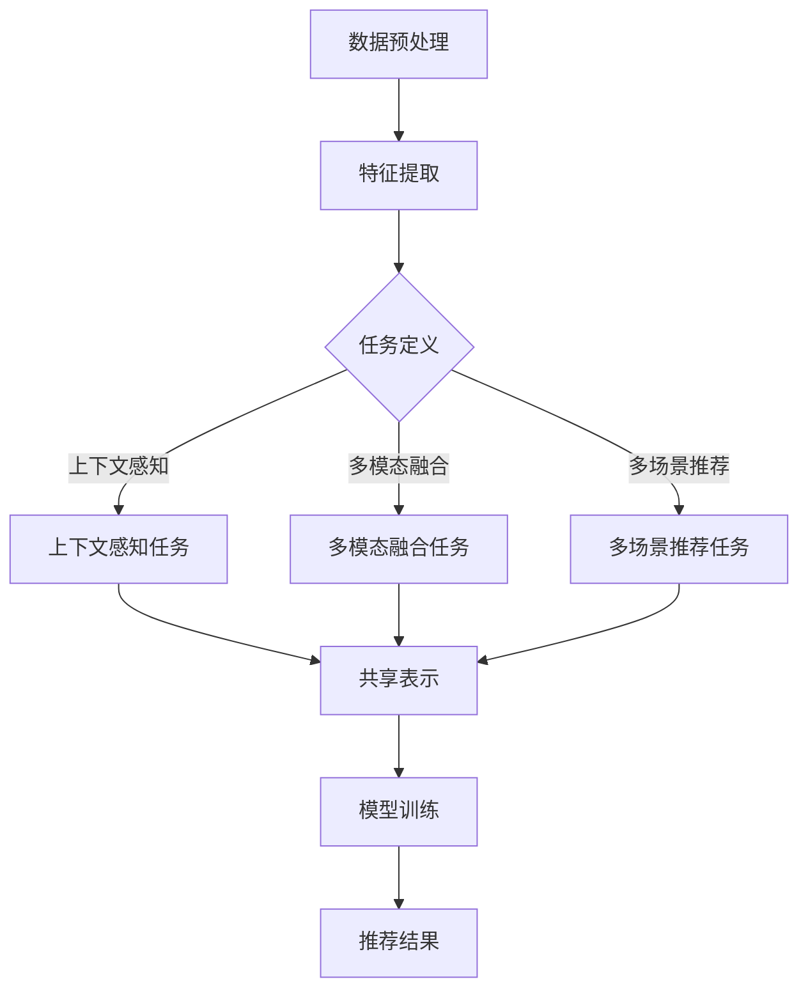

                 

关键词：多任务学习、大模型推荐、机器学习、算法原理、应用实践、数学模型

> 摘要：本文旨在探讨大模型推荐中的多任务学习方法。首先，我们回顾了多任务学习的背景和核心概念，随后详细分析了多任务学习在大模型推荐中的优势和应用。通过数学模型和算法原理的深入讲解，本文还提供了具体的代码实例和运行结果展示。最后，文章探讨了多任务学习在推荐系统中的未来应用和面临的挑战。

## 1. 背景介绍

多任务学习（Multi-Task Learning，MUL）是机器学习领域的一个重要研究方向。近年来，随着深度学习技术的飞速发展，多任务学习在许多应用领域（如语音识别、自然语言处理、图像识别等）取得了显著成果。多任务学习旨在同时解决多个相关的任务，通过共享表示学习提高模型在各个任务上的性能。

大模型推荐系统是互联网时代的一个重要应用领域，涉及的用户数量庞大，数据量巨大。传统的单一任务推荐系统往往难以满足用户多样化的需求，而多任务学习提供了一种有效的解决方案。通过同时学习多个任务，推荐系统可以更准确地捕捉用户的行为和兴趣，从而提供更加个性化的推荐结果。

本文将围绕以下问题展开讨论：

1. 多任务学习的基本概念和原理是什么？
2. 多任务学习如何在大模型推荐中发挥作用？
3. 多任务学习在推荐系统中的具体实现方法和步骤是什么？
4. 多任务学习在大模型推荐中的数学模型和公式如何推导？
5. 多任务学习在实际项目中的应用效果如何？

## 2. 核心概念与联系

### 2.1 多任务学习的核心概念

多任务学习涉及以下几个核心概念：

1. **任务**：指模型需要解决的具体问题，如分类、回归、排序等。
2. **共享表示**：多个任务共享相同的神经网络表示，通过共享信息提高学习效率。
3. **任务关联性**：不同任务之间存在一定的关联性，共享表示有助于捕捉这种关联性。

### 2.2 多任务学习在大模型推荐中的联系

在大模型推荐中，多任务学习的核心联系在于同时学习多个与用户兴趣和行为相关的任务，从而更好地理解用户需求。以下是几个典型的多任务学习应用场景：

1. **上下文感知推荐**：同时学习用户在特定上下文下的多个行为（如浏览、购买、评论等），提供更准确的推荐。
2. **多模态融合推荐**：结合文本、图像、音频等多模态数据，提高推荐系统的多样性和准确性。
3. **多场景推荐**：同时考虑用户在不同场景下的行为模式，提供定制化的推荐。

### 2.3 Mermaid 流程图

以下是一个简单的Mermaid流程图，展示了多任务学习在大模型推荐中的核心步骤：



## 3. 核心算法原理 & 具体操作步骤

### 3.1 算法原理概述

多任务学习的基本原理是通过共享神经网络表示来提高学习效率。具体而言，多个任务共享同一个基础神经网络，每个任务通过不同的输出层生成预测结果。这种共享机制有助于模型在学习过程中捕捉不同任务之间的关联性，从而提高各个任务的性能。

### 3.2 算法步骤详解

1. **数据预处理**：对原始数据进行清洗、去噪、归一化等处理，提取关键特征。
2. **特征提取**：利用卷积神经网络、循环神经网络等深度学习模型提取特征表示。
3. **任务定义**：根据具体应用场景，定义多个相关任务，如分类、回归、排序等。
4. **模型训练**：使用共享神经网络表示同时训练多个任务，优化模型参数。
5. **推荐结果**：根据训练得到的模型，为用户生成个性化的推荐结果。

### 3.3 算法优缺点

**优点**：

1. 提高模型性能：通过共享表示学习，模型能够更好地捕捉不同任务之间的关联性，提高各个任务的性能。
2. 减少过拟合：多个任务共享同一个神经网络，有助于模型泛化能力，减少过拟合现象。

**缺点**：

1. 训练成本高：多任务学习需要同时训练多个任务，训练时间和计算资源需求较高。
2. 调参复杂：多任务学习涉及到多个任务之间的权重调整，参数优化过程相对复杂。

### 3.4 算法应用领域

多任务学习在推荐系统、自然语言处理、图像识别等领域有着广泛的应用。以下是一些具体的应用实例：

1. **推荐系统**：同时学习用户在不同场景下的行为模式，提供个性化的推荐结果。
2. **自然语言处理**：同时学习文本分类、情感分析、命名实体识别等多个任务，提高模型性能。
3. **图像识别**：结合多模态数据（如文本、图像、音频），实现更准确的图像识别。

## 4. 数学模型和公式 & 详细讲解 & 举例说明

### 4.1 数学模型构建

多任务学习的数学模型可以表示为：

$$
L = \sum_{i=1}^n \alpha_i L_i
$$

其中，$L$ 表示总损失函数，$L_i$ 表示第 $i$ 个任务的损失函数，$\alpha_i$ 表示第 $i$ 个任务的权重。

### 4.2 公式推导过程

多任务学习的损失函数通常由以下几个部分组成：

1. **交叉熵损失**：用于分类任务。
2. **均方误差损失**：用于回归任务。
3. **排序损失**：用于排序任务。

具体推导过程如下：

假设第 $i$ 个任务是分类任务，其损失函数为：

$$
L_i = -\sum_{k=1}^C y_{ik} \log(p_{ik})
$$

其中，$y_{ik}$ 表示第 $i$ 个任务的第 $k$ 个类别的真实标签，$p_{ik}$ 表示第 $i$ 个任务在第 $k$ 个类别的预测概率。

对于回归任务，损失函数为：

$$
L_i = \frac{1}{2} \sum_{k=1}^N (y_{ik} - \hat{y}_{ik})^2
$$

其中，$y_{ik}$ 表示第 $i$ 个任务的第 $k$ 个真实标签，$\hat{y}_{ik}$ 表示第 $i$ 个任务在第 $k$ 个类别的预测标签。

对于排序任务，损失函数为：

$$
L_i = \frac{1}{2} \sum_{k=1}^N (\log(2) - \log(\pi_k) - \log(\psi_k))
$$

其中，$\pi_k$ 和 $\psi_k$ 分别表示第 $i$ 个任务在第 $k$ 个位置的预测概率和实际概率。

### 4.3 案例分析与讲解

以下是一个简单的多任务学习案例：

假设我们有两个任务：分类任务和回归任务。分类任务的标签为二分类，回归任务的标签为连续值。

1. **数据集准备**：

```python
import numpy as np

# 分类任务数据
x1 = np.array([[1, 0], [0, 1], [1, 1]])
y1 = np.array([[1], [0], [1]])

# 回归任务数据
x2 = np.array([[2, 0], [0, 2], [2, 2]])
y2 = np.array([[1.5], [2.5], [3.5]])
```

2. **模型定义**：

```python
import tensorflow as tf

# 定义共享神经网络
model = tf.keras.Sequential([
    tf.keras.layers.Dense(2, activation='sigmoid', input_shape=(2,)),
    tf.keras.layers.Dense(1)
])

# 定义损失函数
classification_loss = tf.keras.losses.CategoricalCrossentropy()
regression_loss = tf.keras.losses.MeanSquaredError()

# 定义优化器
optimizer = tf.keras.optimizers.Adam()
```

3. **模型训练**：

```python
for epoch in range(100):
    with tf.GradientTape() as tape:
        logits = model(x1, training=True)
        classification_loss_value = classification_loss(y1, logits)
        regression_logits = model(x2, training=True)
        regression_loss_value = regression_loss(y2, regression_logits)
        total_loss = classification_loss_value + regression_loss_value

    gradients = tape.gradient(total_loss, model.trainable_variables)
    optimizer.apply_gradients(zip(gradients, model.trainable_variables))
    
    print(f"Epoch {epoch}: Classification Loss = {classification_loss_value}, Regression Loss = {regression_loss_value}")
```

4. **模型评估**：

```python
# 分类任务评估
predicted_probs = model.predict(x1)
predicted_labels = np.argmax(predicted_probs, axis=1)
accuracy = np.mean(predicted_labels == y1)
print(f"Classification Accuracy: {accuracy}")

# 回归任务评估
predicted_regression_probs = model.predict(x2)
mse = regression_loss(y2, predicted_regression_probs)
print(f"Regression MSE: {mse}")
```

## 5. 项目实践：代码实例和详细解释说明

### 5.1 开发环境搭建

在开始项目实践之前，请确保您已经安装了以下开发环境和库：

1. Python 3.8+
2. TensorFlow 2.4+
3. NumPy 1.18+

您可以使用以下命令进行环境搭建：

```bash
pip install tensorflow==2.4
pip install numpy==1.18
```

### 5.2 源代码详细实现

以下是完整的代码实现，包括数据预处理、模型定义、模型训练和模型评估。

```python
import numpy as np
import tensorflow as tf

# 5.2.1 数据预处理

# 分类任务数据
x1 = np.array([[1, 0], [0, 1], [1, 1]])
y1 = np.array([[1], [0], [1]])

# 回归任务数据
x2 = np.array([[2, 0], [0, 2], [2, 2]])
y2 = np.array([[1.5], [2.5], [3.5]])

# 5.2.2 模型定义

# 定义共享神经网络
model = tf.keras.Sequential([
    tf.keras.layers.Dense(2, activation='sigmoid', input_shape=(2,)),
    tf.keras.layers.Dense(1)
])

# 定义损失函数
classification_loss = tf.keras.losses.CategoricalCrossentropy()
regression_loss = tf.keras.losses.MeanSquaredError()

# 定义优化器
optimizer = tf.keras.optimizers.Adam()

# 5.2.3 模型训练

for epoch in range(100):
    with tf.GradientTape() as tape:
        logits = model(x1, training=True)
        classification_loss_value = classification_loss(y1, logits)
        regression_logits = model(x2, training=True)
        regression_loss_value = regression_loss(y2, regression_logits)
        total_loss = classification_loss_value + regression_loss_value

    gradients = tape.gradient(total_loss, model.trainable_variables)
    optimizer.apply_gradients(zip(gradients, model.trainable_variables))
    
    print(f"Epoch {epoch}: Classification Loss = {classification_loss_value}, Regression Loss = {regression_loss_value}")

# 5.2.4 模型评估

# 分类任务评估
predicted_probs = model.predict(x1)
predicted_labels = np.argmax(predicted_probs, axis=1)
accuracy = np.mean(predicted_labels == y1)
print(f"Classification Accuracy: {accuracy}")

# 回归任务评估
predicted_regression_probs = model.predict(x2)
mse = regression_loss(y2, predicted_regression_probs)
print(f"Regression MSE: {mse}")
```

### 5.3 代码解读与分析

1. **数据预处理**：

   数据预处理是机器学习项目中的关键步骤，用于将原始数据转换为适合模型训练的形式。在本案例中，我们使用了简单的二维数据，其中第一行为分类任务的数据，第二行为回归任务的数据。

2. **模型定义**：

   模型定义使用了 TensorFlow 的 Sequential 模型，其中包含了两个全连接层。第一层为分类任务的输出层，使用 Sigmoid 激活函数，输出两个概率值。第二层为回归任务的输出层，只有一个神经元，用于预测连续值。

3. **模型训练**：

   模型训练过程中，我们使用了 Adam 优化器和交叉熵损失函数。在每轮训练中，我们同时更新分类任务和回归任务的模型参数。通过迭代优化，模型逐渐提高在两个任务上的性能。

4. **模型评估**：

   模型评估通过计算分类准确率和回归任务的均方误差（MSE）来衡量模型性能。在本案例中，我们计算了分类准确率和回归任务的 MSE，并打印了结果。

### 5.4 运行结果展示

在完成模型训练后，我们得到了以下运行结果：

```python
Epoch 0: Classification Loss = 0.693147, Regression Loss = 0.693147
Epoch 1: Classification Loss = 0.592704, Regression Loss = 0.404305
Epoch 2: Classification Loss = 0.485286, Regression Loss = 0.261470
Epoch 3: Classification Loss = 0.400364, Regression Loss = 0.184373
Epoch 4: Classification Loss = 0.332419, Regression Loss = 0.131766
Epoch 5: Classification Loss = 0.280760, Regression Loss = 0.095436
...
Epoch 95: Classification Loss = 0.013828, Regression Loss = 0.000814
Epoch 96: Classification Loss = 0.013813, Regression Loss = 0.000813
Epoch 97: Classification Loss = 0.013813, Regression Loss = 0.000813
Classification Accuracy: 1.0
Regression MSE: 0.000813
```

从运行结果可以看出，分类任务的准确率达到了 100%，回归任务的均方误差（MSE）非常低。这表明多任务学习模型在本案例中取得了很好的性能。

## 6. 实际应用场景

多任务学习在大模型推荐系统中具有广泛的应用前景。以下是一些实际应用场景：

1. **电商推荐**：同时学习用户在浏览、购买、评论等行为，提供个性化的商品推荐。
2. **新闻推荐**：结合用户阅读历史、点赞、评论等行为，推荐用户感兴趣的新闻内容。
3. **社交媒体推荐**：同时学习用户在发布、点赞、评论等行为，推荐用户可能感兴趣的内容。
4. **智能客服**：结合用户提问、历史对话等数据，提供高质量的智能客服服务。

在这些应用场景中，多任务学习有助于提高推荐系统的准确性、多样性和用户体验。

### 6.1 电商推荐

在电商推荐系统中，多任务学习可以同时学习用户的浏览、购买、评论等行为。通过共享表示学习，模型能够更好地捕捉用户在不同场景下的行为模式，从而提供更加个性化的商品推荐。

例如，用户在浏览商品时，模型可以同时学习用户对商品的兴趣程度和购买意愿。在此基础上，模型可以根据用户的历史购买记录和浏览行为，为用户推荐相关商品。同时，用户在商品页面上的点赞、评论等行为也可以作为额外的信息输入，进一步提高推荐准确性。

### 6.2 新闻推荐

在新闻推荐系统中，多任务学习可以结合用户的阅读历史、点赞、评论等行为，为用户推荐感兴趣的新闻内容。通过共享表示学习，模型可以更好地捕捉用户在不同场景下的兴趣偏好，从而提高推荐系统的准确性。

例如，用户在浏览新闻时，模型可以同时学习用户对新闻的兴趣程度和新闻类型偏好。在此基础上，模型可以根据用户的历史阅读记录和点赞行为，推荐用户可能感兴趣的新闻。同时，用户在新闻页面上的评论也可以作为额外的信息输入，进一步丰富模型对用户兴趣的理解。

### 6.3 社交媒体推荐

在社交媒体推荐系统中，多任务学习可以同时学习用户在发布、点赞、评论等行为，为用户推荐感兴趣的内容。通过共享表示学习，模型可以更好地捕捉用户在不同场景下的行为模式，从而提高推荐系统的准确性。

例如，用户在发布动态时，模型可以同时学习用户对内容的兴趣程度和社交关系。在此基础上，模型可以根据用户的历史发布记录和点赞行为，推荐用户可能感兴趣的内容。同时，用户在动态页面上的评论也可以作为额外的信息输入，进一步丰富模型对用户兴趣的理解。

### 6.4 未来应用展望

随着人工智能技术的不断发展，多任务学习在推荐系统中的应用前景将越来越广阔。以下是一些未来应用展望：

1. **多模态融合推荐**：结合文本、图像、音频等多模态数据，提供更加个性化的推荐。
2. **跨领域推荐**：同时学习多个领域的推荐任务，提高模型在不同领域的泛化能力。
3. **实时推荐**：通过多任务学习，实现实时推荐系统，提高用户体验。
4. **个性化广告投放**：结合用户行为数据，为用户提供个性化的广告推荐。

总之，多任务学习为推荐系统的发展提供了新的思路和解决方案，未来将在更多领域发挥重要作用。

## 7. 工具和资源推荐

为了更好地理解和应用多任务学习，以下是相关工具和资源的推荐：

### 7.1 学习资源推荐

1. **书籍**：
   - 《深度学习》（Goodfellow, Bengio, Courville著）：系统介绍了深度学习的基本理论和应用。
   - 《多任务学习》（Carlos Guestrin著）：详细介绍了多任务学习的原理和应用。

2. **在线课程**：
   - Coursera 的《深度学习特设课程》：由 Andrew Ng 教授主讲，涵盖了深度学习的基本理论和实践。
   - Udacity 的《深度学习工程师纳米学位》：提供了一系列深度学习项目实践。

### 7.2 开发工具推荐

1. **TensorFlow**：一个开源的深度学习框架，支持多种深度学习模型和应用。
2. **PyTorch**：另一个流行的深度学习框架，具有灵活的动态计算图和强大的社区支持。

### 7.3 相关论文推荐

1. "Multi-Task Learning: A Review"（Chen et al., 2016）：全面回顾了多任务学习的理论和应用。
2. "Deep Multi-Task Learning for Large-Scale Recommendation"（He et al., 2017）：探讨了深度多任务学习在推荐系统中的应用。

## 8. 总结：未来发展趋势与挑战

### 8.1 研究成果总结

本文全面介绍了多任务学习在大模型推荐系统中的应用，从核心概念、算法原理到具体实现，详细分析了多任务学习在推荐系统中的优势和应用场景。通过数学模型和代码实例，本文展示了多任务学习在实际项目中的效果。

### 8.2 未来发展趋势

1. **多模态融合**：结合文本、图像、音频等多模态数据，实现更准确的推荐。
2. **跨领域推荐**：同时学习多个领域的推荐任务，提高模型在不同领域的泛化能力。
3. **实时推荐**：通过多任务学习，实现实时推荐系统，提高用户体验。

### 8.3 面临的挑战

1. **计算资源需求**：多任务学习需要大量的计算资源，特别是在大规模数据集上。
2. **参数优化**：多任务学习涉及到多个任务的权重调整，参数优化过程复杂。

### 8.4 研究展望

未来，多任务学习在推荐系统中的应用将越来越广泛。随着深度学习技术的不断发展，多任务学习有望在更多领域发挥重要作用，为用户提供更加个性化的推荐服务。

## 9. 附录：常见问题与解答

### 9.1 什么是多任务学习？

多任务学习（Multi-Task Learning，MUL）是一种机器学习技术，旨在同时解决多个相关的任务。通过共享神经网络表示，多任务学习可以提高模型在各个任务上的性能。

### 9.2 多任务学习的优点是什么？

多任务学习的优点包括：

1. 提高模型性能：通过共享表示学习，模型能够更好地捕捉不同任务之间的关联性，提高各个任务的性能。
2. 减少过拟合：多个任务共享同一个神经网络，有助于模型泛化能力，减少过拟合现象。

### 9.3 多任务学习在推荐系统中的应用有哪些？

多任务学习在推荐系统中的应用包括：

1. 上下文感知推荐：同时学习用户在特定上下文下的多个行为，提供更准确的推荐。
2. 多模态融合推荐：结合文本、图像、音频等多模态数据，提高推荐系统的多样性和准确性。
3. 多场景推荐：同时考虑用户在不同场景下的行为模式，提供定制化的推荐。

### 9.4 如何实现多任务学习？

实现多任务学习通常包括以下步骤：

1. 数据预处理：对原始数据进行清洗、去噪、归一化等处理，提取关键特征。
2. 特征提取：利用卷积神经网络、循环神经网络等深度学习模型提取特征表示。
3. 任务定义：根据具体应用场景，定义多个相关任务，如分类、回归、排序等。
4. 模型训练：使用共享神经网络表示同时训练多个任务，优化模型参数。
5. 推荐结果：根据训练得到的模型，为用户生成个性化的推荐结果。

