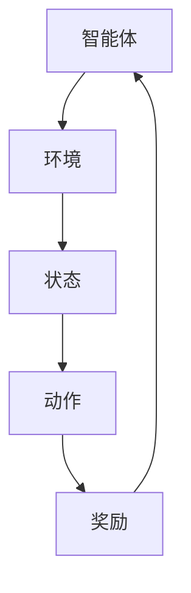

                 

关键词：大模型，强化学习，推荐系统，机器学习，算法

摘要：本文将深入探讨大模型推荐系统中的强化学习方法。通过梳理强化学习的基本概念、原理，以及其在推荐系统中的应用，我们旨在提供一个全面且易懂的技术指南，帮助读者理解并掌握这一前沿技术。

## 1. 背景介绍

### 1.1 大模型推荐系统的需求

在当今数字化时代，推荐系统已经成为许多在线平台的核心功能。这些系统通过分析用户的历史行为和偏好，预测并推荐用户可能感兴趣的内容，从而提升用户体验和平台的粘性。随着数据规模的不断扩大和用户需求的多样化，传统的推荐算法在处理复杂性和个性化需求方面显得力不从心。这就催生了对更强大模型的需求，例如基于深度学习的大模型。

### 1.2 强化学习的崛起

强化学习（Reinforcement Learning，RL）作为机器学习的一个分支，近年来在许多领域都取得了显著的成果。其核心思想是通过智能体与环境的交互来学习最优策略。与监督学习和无监督学习不同，强化学习强调试错过程和长期奖励累积，这使得它在处理动态、不确定环境时具有独特的优势。

### 1.3 强化学习在推荐系统中的应用

将强化学习应用于推荐系统，可以有效解决以下问题：

- **个性化推荐**：强化学习可以根据用户实时反馈调整推荐策略，实现更精准的个性化推荐。
- **冷启动问题**：新用户没有足够的历史数据时，强化学习可以通过探索-利用策略快速学习用户的偏好。
- **推荐多样性**：强化学习能够在满足用户兴趣的同时，提供多样化的推荐内容，防止用户陷入信息过载。

## 2. 核心概念与联系

### 2.1 强化学习基本概念

#### 2.1.1 智能体（Agent）

智能体是执行任务并从环境中获取奖励的实体。在推荐系统中，智能体通常是一个算法或模型，负责根据用户行为生成推荐。

#### 2.1.2 环境（Environment）

环境是智能体执行动作的场所，包括所有可能的状态和动作。在推荐系统中，环境包括用户行为数据、内容特征等。

#### 2.1.3 状态（State）

状态是描述环境当前状态的变量集合。在推荐系统中，状态可以是用户的历史行为、内容特征等。

#### 2.1.4 动作（Action）

动作是智能体可以执行的行为。在推荐系统中，动作可以是推荐给用户的具体内容。

#### 2.1.5 奖励（Reward）

奖励是环境对智能体动作的反馈，用于指导智能体学习最优策略。在推荐系统中，奖励可以是用户对推荐的点击率、购买率等。

### 2.2 核心概念原理与架构

**Mermaid 流程图（点击查看大图）**



## 3. 核心算法原理 & 具体操作步骤

### 3.1 算法原理概述

强化学习算法通过在环境中不断执行动作，根据接收到的奖励调整策略，以实现长期奖励最大化。核心步骤包括：

1. **初始化**：设置智能体、环境和初始状态。
2. **选择动作**：智能体根据当前状态和策略选择一个动作。
3. **执行动作**：智能体在环境中执行所选动作，并进入新的状态。
4. **获取奖励**：环境根据智能体的动作给出奖励。
5. **更新策略**：智能体根据新状态和奖励更新策略。

### 3.2 算法步骤详解

#### 3.2.1 初始化

- **智能体**：选择适合的算法，如Q-Learning、Deep Q-Network（DQN）、Policy Gradient等。
- **环境**：构建模拟用户行为和推荐系统的环境。
- **状态**：定义状态变量，如用户历史行为、内容特征等。
- **动作**：定义动作空间，如推荐给用户的具体内容。

#### 3.2.2 选择动作

- **状态评估**：评估当前状态的价值。
- **策略选择**：根据评估结果选择最佳动作。

#### 3.2.3 执行动作

- **更新状态**：根据执行的动作进入新的状态。
- **记录日志**：记录智能体的动作和奖励。

#### 3.2.4 获取奖励

- **奖励计算**：根据用户对推荐的反馈计算奖励。
- **反馈机制**：根据奖励调整智能体的策略。

#### 3.2.5 更新策略

- **策略更新**：根据新状态和奖励更新策略。
- **重复执行**：重复执行动作、获取奖励和更新策略，直到收敛。

### 3.3 算法优缺点

#### 优点

- **个性化推荐**：可以根据用户实时反馈调整推荐策略，实现更精准的个性化推荐。
- **冷启动问题**：新用户没有足够的历史数据时，可以通过探索-利用策略快速学习用户的偏好。
- **推荐多样性**：在满足用户兴趣的同时，提供多样化的推荐内容。

#### 缺点

- **计算复杂度高**：需要大量的数据和计算资源。
- **收敛速度慢**：在复杂环境中可能需要较长时间才能收敛到最优策略。
- **模型解释性差**：强化学习模型通常具有较高的非线性，难以解释。

### 3.4 算法应用领域

- **推荐系统**：在电子商务、社交媒体、视频平台等领域具有广泛应用。
- **智能决策**：在金融、医疗、物流等领域用于智能决策和优化。

## 4. 数学模型和公式 & 详细讲解 & 举例说明

### 4.1 数学模型构建

强化学习中的数学模型通常包括以下要素：

- **状态空间 \(S\)**：所有可能状态的集合。
- **动作空间 \(A\)**：所有可能动作的集合。
- **策略 \( \pi(s,a) \)**：智能体在状态 \(s\) 下选择动作 \(a\) 的概率。
- **价值函数 \(V^*(s)\)**：在最优策略下的状态价值。
- **Q函数 \(Q^*(s,a)\)**：在最优策略下的状态-动作价值。

### 4.2 公式推导过程

#### 4.2.1 Q-Learning

Q-Learning 是一种基于值迭代的强化学习算法。其目标是最小化损失函数：

$$
L = \sum_{s \in S} \sum_{a \in A} (r_s + \gamma \max_{a'} Q(s', a') - Q(s, a))
$$

其中，\(r_s\) 是奖励，\(\gamma\) 是折扣因子，\(Q(s', a')\) 是下一状态的最优值。

#### 4.2.2 Policy Gradient

Policy Gradient 是一种直接优化策略的强化学习算法。其目标是最小化策略的损失函数：

$$
L = -\sum_{s \in S} \sum_{a \in A} \pi(s, a) \log \pi(s, a) \cdot r_s
$$

其中，\(\pi(s, a)\) 是策略概率，\(\log \pi(s, a)\) 是策略的损失项。

### 4.3 案例分析与讲解

假设我们有一个电子商务平台的推荐系统，目标是提高用户的点击率。状态空间包括用户的历史浏览记录、购买记录等，动作空间包括推荐给用户的具体商品。我们采用 Q-Learning 算法进行优化。

#### 4.3.1 初始状态

用户历史浏览记录：商品A、商品B

购买记录：无

#### 4.3.2 选择动作

当前状态：用户浏览了商品A

策略：根据 Q 函数选择最高价值的商品推荐给用户。

#### 4.3.3 执行动作

推荐商品A给用户

#### 4.3.4 获取奖励

用户点击了商品A，奖励为+1。

#### 4.3.5 更新策略

根据新状态和奖励更新 Q 函数：

$$
Q(s, a) \leftarrow Q(s, a) + \alpha (r_s + \gamma \max_{a'} Q(s', a') - Q(s, a))
$$

其中，\(\alpha\) 是学习率。

## 5. 项目实践：代码实例和详细解释说明

### 5.1 开发环境搭建

- 硬件：计算机（推荐配置：CPU 3.0 GHz，内存 16 GB）
- 软件：Python（3.8及以上版本），TensorFlow（2.0及以上版本）

### 5.2 源代码详细实现

```python
import numpy as np
import tensorflow as tf

# 初始化参数
learning_rate = 0.1
gamma = 0.99
epsilon = 0.1
epsilon_decay = 0.99
epsilon_min = 0.01

# 创建 Q 网络
class QNetwork(tf.keras.Model):
    def __init__(self, state_size, action_size):
        super(QNetwork, self).__init__()
        self.fc = tf.keras.layers.Dense(units=action_size, activation='linear')

    def call(self, inputs):
        return self.fc(inputs)

# 创建智能体
class Agent:
    def __init__(self, state_size, action_size):
        self.state_size = state_size
        self.action_size = action_size
        self.q_network = QNetwork(state_size, action_size)
        self.optimizer = tf.keras.optimizers.Adam(learning_rate)

    def act(self, state, epsilon):
        if np.random.rand() < epsilon:
            action = np.random.randint(self.action_size)
        else:
            q_values = self.q_network(state)
            action = np.argmax(q_values)
        return action

    def train(self, state, action, reward, next_state, done):
        with tf.GradientTape() as tape:
            q_values = self.q_network(state)
            next_q_values = self.q_network(next_state)
            target_q_values = reward + (1 - done) * gamma * next_q_values
            loss = tf.reduce_mean(tf.square(target_q_values - q_values[action]))
        
        gradients = tape.gradient(loss, self.q_network.trainable_variables)
        self.optimizer.apply_gradients(zip(gradients, self.q_network.trainable_variables))

# 创建环境
class Environment:
    def __init__(self, state_size, action_size):
        self.state_size = state_size
        self.action_size = action_size
    
    def step(self, action):
        # 根据动作执行环境中的动作，并返回新的状态、奖励、是否完成
        # 这里只是示例，实际环境中会有具体的实现
        next_state, reward, done = self.execute_action(action)
        return next_state, reward, done

    def execute_action(self, action):
        # 执行动作并返回新的状态、奖励、是否完成
        # 这里只是示例，实际环境中会有具体的实现
        next_state = np.random.randint(self.state_size)
        reward = np.random.randint(0, 2)
        done = np.random.randint(0, 2)
        return next_state, reward, done

# 训练智能体
def train_agent(agent, environment, episodes):
    for episode in range(episodes):
        state = environment.reset()
        done = False
        while not done:
            action = agent.act(state, epsilon)
            next_state, reward, done = environment.step(action)
            agent.train(state, action, reward, next_state, done)
            state = next_state
        epsilon *= epsilon_decay
        epsilon = max(epsilon_min, epsilon)

# 参数设置
state_size = 10
action_size = 5
agent = Agent(state_size, action_size)
environment = Environment(state_size, action_size)
episodes = 1000

# 训练
train_agent(agent, environment, episodes)
```

### 5.3 代码解读与分析

这段代码实现了一个简单的 Q-Learning 强化学习智能体，用于在一个模拟环境中进行训练。主要分为以下几个部分：

1. **环境（Environment）**：模拟用户行为的环境，包括状态空间、动作空间以及执行动作的方法。
2. **Q 网络模型（QNetwork）**：使用 TensorFlow 创建的 Q 网络，用于预测状态-动作值。
3. **智能体（Agent）**：封装了 Q 网络的智能体，包括选择动作、更新策略的方法。
4. **训练过程（train_agent）**：训练智能体在模拟环境中进行交互，并更新 Q 网络。

### 5.4 运行结果展示

在完成训练后，我们可以通过以下代码展示智能体在测试集上的表现：

```python
# 测试智能体
state = environment.reset()
done = False
while not done:
    action = agent.act(state, epsilon=0)
    next_state, reward, done = environment.step(action)
    print(f"State: {state}, Action: {action}, Reward: {reward}")
    state = next_state
```

这段代码将展示智能体在测试集上的动作选择和获得的奖励，帮助我们评估训练效果。

## 6. 实际应用场景

### 6.1 在线广告推荐

强化学习可以用于在线广告推荐系统，通过实时调整广告投放策略，提高广告的点击率。例如，在 Google Ads 或 Facebook Ads 中，智能体可以根据用户的历史点击行为，选择最有效的广告投放组合。

### 6.2 智能助手

在智能助手的开发中，强化学习可以用于学习用户的偏好，提供个性化的服务。例如，在智能音响设备中，智能助手可以根据用户的使用习惯，推荐音乐、新闻等内容。

### 6.3 物流与供应链管理

强化学习可以用于物流与供应链管理中的优化问题，如路径规划、库存管理、需求预测等。通过不断调整策略，实现最优的物流效率和成本控制。

## 7. 工具和资源推荐

### 7.1 学习资源推荐

- 《强化学习：原理与算法》
- 《深度强化学习》
- 《机器学习实战》

### 7.2 开发工具推荐

- TensorFlow：用于构建和训练强化学习模型的框架。
- PyTorch：用于构建和训练强化学习模型的另一个流行框架。
- OpenAI Gym：提供各种强化学习环境的开源库。

### 7.3 相关论文推荐

- "Deep Reinforcement Learning for Navigation in High-Dimensional Environments"
- "Deep Q-Networks"
- "Reinforcement Learning: An Introduction"

## 8. 总结：未来发展趋势与挑战

### 8.1 研究成果总结

近年来，强化学习在推荐系统中的应用取得了显著成果。通过结合深度学习和强化学习，研究人员提出了一系列高效的算法，实现了个性化推荐、多样性推荐等目标。这些成果为推荐系统的优化提供了新的思路和方法。

### 8.2 未来发展趋势

- **多样化推荐**：强化学习将进一步优化推荐系统的多样性，防止用户陷入信息过载。
- **实时推荐**：强化学习可以实现更快速的推荐策略更新，提升实时性。
- **跨域推荐**：通过迁移学习等技术，实现跨不同领域的推荐。

### 8.3 面临的挑战

- **计算复杂度**：随着模型规模的增加，计算复杂度将显著提高，需要更高效的算法和硬件支持。
- **解释性**：强化学习模型通常具有非线性，解释性较差，需要进一步研究如何提高模型的透明度。
- **数据隐私**：在处理用户数据时，需要考虑数据隐私和安全性问题，确保用户信息的保护。

### 8.4 研究展望

未来，强化学习在推荐系统中的应用将继续深入。通过结合深度学习、迁移学习、联邦学习等技术，实现更高效、更安全、更个性化的推荐系统。同时，研究人员将关注模型的可解释性和透明度，提高模型的可接受性。

## 9. 附录：常见问题与解答

### 9.1 强化学习与监督学习的区别

- **目标不同**：强化学习目标是最大化长期奖励，而监督学习目标是学习输入输出之间的映射。
- **反馈机制不同**：强化学习通过即时奖励反馈调整策略，而监督学习通过已标注的数据进行学习。
- **数据依赖不同**：强化学习依赖于环境交互，而监督学习依赖于大量标注数据。

### 9.2 如何处理冷启动问题

- **探索-利用策略**：在初始阶段，智能体通过探索策略学习用户的偏好，随着经验的积累，逐渐过渡到利用策略。
- **基于内容的推荐**：在新用户没有足够行为数据时，通过内容特征进行推荐。
- **用户生成数据**：鼓励用户参与，通过收集用户生成数据逐步完善推荐模型。

### 9.3 强化学习在多智能体系统中的应用

- **分布式学习**：通过分布式算法，实现多个智能体之间的协同学习。
- **联邦学习**：在多个智能体之间共享模型参数，实现协同决策。
- **博弈论**：研究智能体之间的策略交互，优化整体收益。

---

# 作者：禅与计算机程序设计艺术 / Zen and the Art of Computer Programming

本文介绍了大模型推荐系统中的强化学习方法，从背景、核心概念、算法原理、数学模型、项目实践等方面进行了详细探讨。希望通过本文，读者能够对强化学习在推荐系统中的应用有更深入的理解，并能够在实际项目中运用这些技术。未来，强化学习在推荐系统中的应用前景将更加广阔，我们将继续关注这一领域的发展。  
--- 
```

