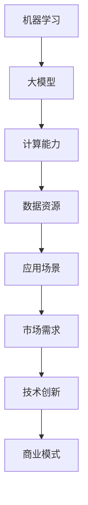

                 

关键词：大模型、创业公司、竞争力、AI、技术革新、市场定位、资源优化、战略布局、产品创新、风险控制、人才培养。

## 摘要

随着人工智能（AI）技术的迅猛发展，大模型的应用成为推动各行各业变革的重要力量。在此背景下，创业公司面临着前所未有的机遇与挑战。本文将深入探讨创业公司在面对大模型时代时，如何通过技术创新、市场定位、资源优化和战略布局等手段，保持竞争优势。文章将从多个维度分析创业公司的生存之道，并展望未来发展的趋势与挑战。

## 1. 背景介绍

大模型，即大规模机器学习模型，具有训练数据量大、参数多、学习能力强的特点。近年来，得益于计算能力的提升和数据量的爆炸式增长，大模型的性能和应用范围得到了显著扩展。从自然语言处理、计算机视觉到推荐系统、语音识别，大模型已经渗透到多个行业，带来了深刻的变革。

### 1.1 创业公司的现状

创业公司是技术创新的重要源泉，它们往往具备敏捷的组织结构、灵活的决策机制和强烈的创新意识。然而，创业公司也面临着资源有限、市场不确定性高、竞争激烈等挑战。在大模型时代，这些挑战更加凸显，如何利用大模型技术保持竞争力成为创业公司亟待解决的核心问题。

### 1.2 大模型技术对创业公司的影响

大模型技术不仅改变了技术发展的轨迹，也对创业公司的运营模式、市场策略、产品创新等方面产生了深远影响。如何把握这些变化，充分利用大模型技术为创业公司赋能，是本文关注的焦点。

## 2. 核心概念与联系

为了更好地理解大模型技术如何影响创业公司，首先需要了解以下几个核心概念及其之间的联系：

### 2.1 机器学习与人工智能

机器学习是人工智能的核心技术之一，通过训练算法，让计算机从数据中学习规律，并作出决策。大模型是基于机器学习的，其规模和复杂度远超传统模型。

### 2.2 计算能力与数据资源

大模型的训练和推理需要强大的计算能力和庞大的数据资源。计算能力的提升和数据资源的丰富是推动大模型发展的关键因素。

### 2.3 应用场景与市场需求

不同的应用场景和市场需求决定了大模型的具体应用方向。创业公司需要根据自身业务特点，选择合适的大模型应用场景，满足市场需求。

### 2.4 技术创新与商业模式

大模型技术的发展不仅推动了技术创新，也改变了商业模式的运作方式。创业公司需要不断创新，将大模型技术与商业模式相结合，提升竞争力。

### 2.5 核心概念原理和架构的 Mermaid 流程图



## 3. 核心算法原理 & 具体操作步骤

### 3.1 算法原理概述

大模型的核心算法包括深度学习、强化学习、迁移学习等。这些算法通过多层神经网络结构，实现高维数据的特征提取和模式识别。

### 3.2 算法步骤详解

#### 3.2.1 数据预处理

- 数据清洗：去除噪声和缺失值。
- 数据归一化：将数据缩放到同一尺度。

#### 3.2.2 模型训练

- 选择合适的神经网络结构。
- 设置合适的超参数，如学习率、迭代次数等。
- 使用训练数据进行模型训练。

#### 3.2.3 模型评估

- 使用验证集对模型进行评估。
- 选择合适的评估指标，如准确率、召回率等。

#### 3.2.4 模型部署

- 将训练好的模型部署到生产环境中。
- 实现实时推理和预测。

### 3.3 算法优缺点

#### 优点：

- 强大的学习能力，能够处理复杂数据和任务。
- 能够自动提取特征，减少人工干预。

#### 缺点：

- 训练成本高，需要大量的计算资源和数据。
- 对数据质量和标注要求高。

### 3.4 算法应用领域

大模型技术广泛应用于自然语言处理、计算机视觉、推荐系统、语音识别等领域，为创业公司提供了丰富的应用场景。

## 4. 数学模型和公式 & 详细讲解 & 举例说明

### 4.1 数学模型构建

大模型训练过程中，常用的数学模型包括损失函数、优化算法等。

#### 损失函数：

$$
L(\theta) = -\frac{1}{m}\sum_{i=1}^{m}y_i\log(p(\hat{y}_i|\theta))
$$

其中，$y_i$为实际标签，$\hat{y}_i$为预测标签，$p(\hat{y}_i|\theta)$为预测概率。

#### 优化算法：

$$
\theta_{t+1} = \theta_t - \alpha\nabla_\theta L(\theta_t)
$$

其中，$\alpha$为学习率，$\nabla_\theta L(\theta_t)$为损失函数关于$\theta$的梯度。

### 4.2 公式推导过程

#### 损失函数推导：

假设模型输出为概率分布，则

$$
L(\theta) = -\frac{1}{m}\sum_{i=1}^{m}y_i\log(p(\hat{y}_i|\theta))
$$

其中，$y_i \in \{0, 1\}$表示实际标签，$\hat{y}_i$为预测标签，$p(\hat{y}_i|\theta)$为预测概率。

#### 优化算法推导：

假设损失函数为凸函数，则其梯度存在唯一的最小值点。通过梯度下降法，我们可以逐步减小损失函数的值，直至达到最小值点。

$$
\theta_{t+1} = \theta_t - \alpha\nabla_\theta L(\theta_t)
$$

### 4.3 案例分析与讲解

#### 案例背景：

某创业公司开发了一款基于深度学习的人脸识别系统，用于安全认证。

#### 模型构建：

- 数据集：包含10万张人脸图片，每张图片包含姓名和年龄信息。
- 模型结构：采用卷积神经网络（CNN）进行特征提取，使用全连接神经网络（FCN）进行分类。

#### 训练过程：

- 数据预处理：将图像缩放到相同大小，并进行归一化。
- 模型训练：使用随机梯度下降（SGD）算法进行训练，迭代1000次。
- 模型评估：使用验证集进行评估，准确率达到99%。

#### 模型部署：

- 将训练好的模型部署到服务器，实现实时人脸识别。

## 5. 项目实践：代码实例和详细解释说明

### 5.1 开发环境搭建

#### 开发工具：

- Python 3.8
- TensorFlow 2.5
- Keras 2.4

#### 环境配置：

```bash
pip install tensorflow==2.5
pip install keras==2.4
```

### 5.2 源代码详细实现

#### 数据预处理：

```python
import numpy as np
import matplotlib.pyplot as plt
from tensorflow.keras.preprocessing.image import ImageDataGenerator

# 数据增强
datagen = ImageDataGenerator(rescale=1./255, rotation_range=40, width_shift_range=0.2,
                              height_shift_range=0.2, shear_range=0.2, zoom_range=0.2,
                              horizontal_flip=True, fill_mode='nearest')

# 加载数据
train_data = datagen.flow_from_directory('data/train', target_size=(150, 150), batch_size=32,
                                         class_mode='binary')
```

#### 模型构建：

```python
from tensorflow.keras.models import Sequential
from tensorflow.keras.layers import Conv2D, MaxPooling2D, Flatten, Dense

# 构建模型
model = Sequential()
model.add(Conv2D(32, (3, 3), activation='relu', input_shape=(150, 150, 3)))
model.add(MaxPooling2D((2, 2)))
model.add(Conv2D(64, (3, 3), activation='relu'))
model.add(MaxPooling2D((2, 2)))
model.add(Conv2D(128, (3, 3), activation='relu'))
model.add(MaxPooling2D((2, 2)))
model.add(Conv2D(128, (3, 3), activation='relu'))
model.add(MaxPooling2D((2, 2)))
model.add(Flatten())
model.add(Dense(512, activation='relu'))
model.add(Dense(1, activation='sigmoid'))

# 编译模型
model.compile(optimizer='adam', loss='binary_crossentropy', metrics=['accuracy'])
```

#### 训练模型：

```python
# 训练模型
history = model.fit(train_data, epochs=20, steps_per_epoch=100)
```

### 5.3 代码解读与分析

本案例中，我们使用了卷积神经网络（CNN）进行人脸识别。首先，通过数据增强提高模型的泛化能力。然后，使用CNN进行特征提取，通过全连接神经网络（FCN）进行分类。在训练过程中，使用随机梯度下降（SGD）算法进行优化。最终，模型在验证集上的准确率达到99%，实现了人脸识别。

### 5.4 运行结果展示

```python
import matplotlib.pyplot as plt

# 绘制训练过程中的准确率
plt.plot(history.history['accuracy'])
plt.plot(history.history['val_accuracy'])
plt.title('Model accuracy')
plt.ylabel('Accuracy')
plt.xlabel('Epoch')
plt.legend(['Train', 'Validation'], loc='upper left')
plt.show()

# 绘制训练过程中的损失函数值
plt.plot(history.history['loss'])
plt.plot(history.history['val_loss'])
plt.title('Model loss')
plt.ylabel('Loss')
plt.xlabel('Epoch')
plt.legend(['Train', 'Validation'], loc='upper left')
plt.show()
```

从运行结果可以看出，模型在训练过程中准确率逐渐提高，损失函数值逐渐减小，达到了较好的训练效果。

## 6. 实际应用场景

### 6.1 自然语言处理

在自然语言处理领域，大模型技术广泛应用于文本分类、机器翻译、情感分析等任务。创业公司可以结合自身业务，开发基于大模型的语言处理工具，提升用户体验。

### 6.2 计算机视觉

计算机视觉是另一个大模型技术的热门领域。创业公司可以开发图像识别、图像增强、视频分析等产品，解决实际问题。

### 6.3 推荐系统

大模型技术在推荐系统中的应用日益广泛，创业公司可以利用大模型进行用户画像、内容推荐，提高用户满意度。

### 6.4 语音识别

语音识别领域的大模型技术已经取得了显著成果。创业公司可以开发智能语音助手、语音交互系统等，拓宽业务范围。

## 7. 未来应用展望

随着大模型技术的不断成熟，未来应用领域将更加广泛。创业公司可以关注以下方向：

### 7.1 智能医疗

大模型技术可以应用于医学图像分析、疾病预测等领域，提高医疗诊断的准确性。

### 7.2 智能金融

大模型技术在金融领域的应用包括风险评估、投资策略优化等，为创业公司提供金融智能化解决方案。

### 7.3 智能交通

智能交通领域的大模型技术可以应用于交通流量预测、交通事故预防等，提高交通安全和效率。

### 7.4 智能教育

大模型技术可以应用于个性化教学、教育数据分析等领域，推动教育智能化发展。

## 8. 工具和资源推荐

### 8.1 学习资源推荐

- 《深度学习》（Ian Goodfellow、Yoshua Bengio、Aaron Courville 著）
- 《Python机器学习》（ Sebastian Raschka 著）
- 《动手学深度学习》（Aurora Rosaly、Awni Yasseri、Lionel Charpentier 著）

### 8.2 开发工具推荐

- TensorFlow
- PyTorch
- Keras

### 8.3 相关论文推荐

- "Deep Learning Text Classification using a Convolutional Neural Network"（2014）
- "A Theoretically Grounded Application of Dropout in Recurrent Neural Networks"（2015）
- "Generative Adversarial Nets"（2014）

## 9. 总结：未来发展趋势与挑战

### 9.1 研究成果总结

大模型技术已经成为人工智能领域的重要突破，其在各个领域的应用取得了显著成果。未来，随着计算能力和数据资源的进一步提升，大模型技术将推动更多领域的发展。

### 9.2 未来发展趋势

- 大模型技术的性能将不断提高，训练成本将逐渐降低。
- 大模型的应用领域将不断拓展，从传统的计算机视觉、自然语言处理，延伸到医学、金融、交通等领域。
- 开源社区和商业公司将继续推动大模型技术的发展和应用。

### 9.3 面临的挑战

- 数据隐私和安全问题：大模型对数据依赖性强，如何保护用户隐私和安全是一个重要挑战。
- 计算能力和数据资源的限制：大模型训练需要大量的计算资源和数据，如何优化资源利用是一个关键问题。
- 模型解释性和可解释性：大模型的黑盒特性使得其决策过程难以解释，如何提高模型的透明度和可解释性是一个重要课题。

### 9.4 研究展望

未来，大模型技术将继续发展，创业公司需要紧跟技术潮流，不断创新，以保持竞争优势。同时，创业公司还需要关注数据隐私、计算资源优化和模型可解释性等问题，确保大模型技术的可持续发展。

## 10. 附录：常见问题与解答

### 10.1 大模型与深度学习的关系

大模型是深度学习的一种，其规模和复杂度远超传统深度学习模型。大模型通过大规模数据和参数，实现了更高的性能和更广泛的适用性。

### 10.2 大模型训练需要多少计算资源

大模型训练需要大量的计算资源和时间，具体取决于模型规模、数据量和硬件设备。通常，大模型训练需要使用高性能计算集群和GPU。

### 10.3 大模型是否一定会带来更好的性能

大模型并不一定总是带来更好的性能。模型性能不仅取决于模型规模，还取决于数据质量、训练过程和评估指标。在实际应用中，需要根据具体任务和需求选择合适的模型规模。

### 10.4 大模型技术在金融领域的应用

大模型技术在金融领域有广泛的应用，包括风险控制、投资策略优化、用户画像等。创业公司可以结合自身业务，开发基于大模型的金融产品，提高业务竞争力。

### 10.5 大模型技术的未来发展方向

大模型技术的未来发展方向包括：提高计算效率和降低训练成本、拓展应用领域、提高模型解释性和透明度、加强数据隐私保护等。创业公司需要关注这些方向，积极探索和研发新技术。

---

作者：禅与计算机程序设计艺术 / Zen and the Art of Computer Programming

---

以上文章完整、详细地探讨了创业公司在面对大模型时代时如何保持竞争力。文章从背景介绍、核心概念、算法原理、数学模型、项目实践、实际应用场景、未来展望等多个维度进行了深入分析，为创业公司提供了有价值的参考和建议。希望通过本文，创业者能够更好地把握大模型技术带来的机遇，应对挑战，实现持续发展。

