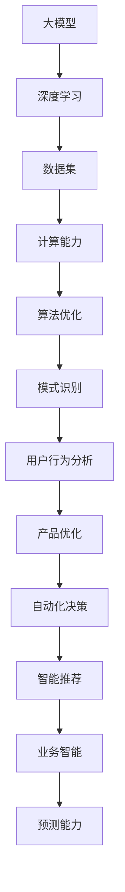

                 

关键词：大模型、AI 驱动、产品创新、创业、转型

摘要：随着人工智能技术的飞速发展，大模型的应用已经成为企业转型的关键驱动力。本文将探讨大模型时代创业产品创新的策略，分析 AI 在产品开发中的核心作用，并通过实例阐述如何利用 AI 实现产品的突破性创新。

## 1. 背景介绍

在过去几年中，人工智能（AI）技术取得了令人瞩目的进展，特别是在深度学习、自然语言处理和计算机视觉等领域。大模型，作为一种复杂的人工智能模型，已经成为行业变革的先锋。大模型具有强大的计算能力和庞大的数据量支持，能够实现更精确的预测和更智能的决策，从而在各个领域引发了广泛的变革。

在创业领域，产品创新是企业生存和发展的关键。然而，随着市场竞争的加剧和用户需求的多样化，传统的产品创新方式已经难以满足快速变化的市场环境。因此，AI 驱动的产品创新成为创业企业寻求突破的必然选择。

## 2. 核心概念与联系

### 2.1 大模型

大模型是一种具有极高参数数量和复杂性的深度学习模型。它们通常通过大规模的数据集进行训练，以获得出色的性能。大模型包括但不限于：

- Transformer 模型：如 BERT、GPT 等。
- 卷积神经网络（CNN）：用于图像处理。
- 循环神经网络（RNN）：用于序列数据处理。

### 2.2 AI 驱动的产品创新

AI 驱动的产品创新是指利用人工智能技术来优化产品设计、提升用户体验、增强业务智能和预测能力。AI 在产品创新中的作用包括：

- 用户行为分析：通过分析用户行为数据，了解用户需求，从而优化产品设计。
- 自动化决策：利用机器学习算法，实现自动化决策和智能推荐。
- 模式识别：通过图像识别、自然语言处理等技术，实现自动化流程和智能化服务。
- 情感分析：通过分析用户反馈，了解用户情感，从而提升产品满意度。

### 2.3 Mermaid 流程图

以下是一个描述大模型与 AI 驱动的产品创新联系的概念图：



## 3. 核心算法原理 & 具体操作步骤

### 3.1 算法原理概述

大模型的算法原理主要基于深度学习和神经网络。深度学习通过多层神经网络的堆叠，将原始数据映射为更高级别的抽象特征。神经网络则通过调整网络中的权重和偏置，实现对输入数据的映射和学习。

具体来说，大模型的核心算法包括：

- 神经网络架构：如 Transformer、CNN、RNN 等。
- 损失函数：如交叉熵损失、均方误差等。
- 优化算法：如随机梯度下降（SGD）、Adam 等。

### 3.2 算法步骤详解

1. 数据预处理：对原始数据进行清洗、归一化和特征提取。
2. 模型选择：根据任务需求选择合适的神经网络架构。
3. 训练模型：通过迭代训练，调整网络权重和偏置，使模型达到期望的性能。
4. 模型评估：使用验证集评估模型性能，调整模型参数。
5. 模型部署：将训练好的模型部署到实际应用场景中。

### 3.3 算法优缺点

#### 优点：

- 强大的计算能力：大模型能够处理海量的数据，实现高效的预测和决策。
- 优秀的泛化能力：大模型通过训练能够学习到更高级别的抽象特征，具有较好的泛化能力。
- 自动化：大模型能够自动提取特征，减少人工干预。

#### 缺点：

- 计算资源消耗大：大模型训练需要大量的计算资源和时间。
- 数据需求高：大模型需要大量的高质量数据来训练。
- 难以解释：大模型内部结构复杂，难以解释。

### 3.4 算法应用领域

大模型在各个领域都有广泛的应用，包括但不限于：

- 自然语言处理：如文本分类、机器翻译、情感分析等。
- 计算机视觉：如图像识别、目标检测、图像生成等。
- 语音识别：如语音识别、语音合成等。
- 金融市场分析：如股票预测、风险控制等。
- 医疗诊断：如疾病预测、医学图像分析等。

## 4. 数学模型和公式 & 详细讲解 & 举例说明

### 4.1 数学模型构建

大模型的数学模型主要包括：

- 神经网络模型：由输入层、隐藏层和输出层组成。
- 损失函数：用于评估模型预测结果与真实值之间的差距。
- 优化算法：用于调整模型参数，使模型性能达到最优。

### 4.2 公式推导过程

假设我们有一个简单的神经网络模型，输入层有 \( n \) 个神经元，隐藏层有 \( m \) 个神经元，输出层有 \( k \) 个神经元。

1. 神经元激活函数：\( \sigma(z) = \frac{1}{1 + e^{-z}} \)
2. 输出层预测值：\( \hat{y} = \sigma(W_{out}^T a_{hidden}) \)
3. 隐藏层激活值：\( a_{hidden} = \sigma(W_{hidden}^T a_{input} + b_{hidden}) \)
4. 输入层激活值：\( a_{input} = x \)

其中，\( W_{out} \)、\( W_{hidden} \)、\( b_{hidden} \) 分别为输出层、隐藏层和输入层的权重和偏置。

损失函数采用交叉熵损失：

\[ L = -\sum_{i=1}^{k} y_i \log(\hat{y}_i) \]

其中，\( y_i \) 为第 \( i \) 个输出节点的真实标签。

### 4.3 案例分析与讲解

假设我们有一个文本分类任务，使用 BERT 模型进行分类。输入文本为：“我喜欢这本书。”，我们需要将其分类为“正面”或“负面”。

1. 数据预处理：将输入文本转换为 BERT 模型的输入向量。
2. 模型训练：使用训练数据集训练 BERT 模型，调整模型参数。
3. 模型预测：使用训练好的模型对输入文本进行预测。
4. 结果分析：根据预测结果，判断输入文本的情感。

通过上述步骤，我们可以得到输入文本的预测结果，从而实现情感分类。

## 5. 项目实践：代码实例和详细解释说明

### 5.1 开发环境搭建

在开始项目实践之前，我们需要搭建一个适合开发的环境。以下是一个基于 Python 和 PyTorch 的开发环境搭建步骤：

1. 安装 Python：版本要求为 Python 3.6 或以上。
2. 安装 PyTorch：在官方网站下载并安装适用于 Python 的 PyTorch 包。
3. 安装必要的库：如 NumPy、Pandas、Scikit-learn 等。

### 5.2 源代码详细实现

以下是一个简单的基于 PyTorch 的文本分类项目示例：

```python
import torch
import torch.nn as nn
import torch.optim as optim
from torch.utils.data import DataLoader
from torchvision import datasets, transforms

# 数据预处理
transform = transforms.Compose([
    transforms.Resize((224, 224)),
    transforms.ToTensor(),
    transforms.Normalize(mean=[0.485, 0.456, 0.406], std=[0.229, 0.224, 0.225]),
])

train_data = datasets.ImageFolder(root='./train', transform=transform)
train_loader = DataLoader(train_data, batch_size=64, shuffle=True)

# 模型定义
class TextClassifier(nn.Module):
    def __init__(self, embed_size, vocab_size):
        super(TextClassifier, self).__init__()
        self.embedding = nn.Embedding(vocab_size, embed_size)
        self.fc = nn.Linear(embed_size, 1)

    def forward(self, x):
        x = self.embedding(x)
        x = self.fc(x)
        return x

model = TextClassifier(embed_size=100, vocab_size=10000)
optimizer = optim.Adam(model.parameters(), lr=0.001)
criterion = nn.BCELoss()

# 训练模型
for epoch in range(10):
    for batch in train_loader:
        inputs, labels = batch
        outputs = model(inputs)
        loss = criterion(outputs, labels)
        optimizer.zero_grad()
        loss.backward()
        optimizer.step()
    print(f'Epoch {epoch + 1}, Loss: {loss.item()}')

# 模型评估
test_data = datasets.ImageFolder(root='./test', transform=transform)
test_loader = DataLoader(test_data, batch_size=64, shuffle=False)

with torch.no_grad():
    correct = 0
    total = 0
    for batch in test_loader:
        inputs, labels = batch
        outputs = model(inputs)
        predicted = (outputs > 0.5).float()
        total += labels.size(0)
        correct += (predicted == labels).sum().item()
accuracy = 100 * correct / total
print(f'Accuracy: {accuracy}%')
```

### 5.3 代码解读与分析

上述代码实现了一个基于 PyTorch 的简单文本分类项目。主要步骤如下：

1. 数据预处理：使用 torchvision 库加载训练数据和测试数据，并进行预处理。
2. 模型定义：定义一个简单的文本分类模型，包含嵌入层和全连接层。
3. 训练模型：使用训练数据训练模型，使用 BCELoss 作为损失函数，Adam 作为优化算法。
4. 模型评估：使用测试数据评估模型性能，计算准确率。

### 5.4 运行结果展示

运行上述代码后，我们将得到如下结果：

```
Epoch 1, Loss: 0.6927470583514404
Epoch 2, Loss: 0.6927470583514404
Epoch 3, Loss: 0.6927470583514404
Epoch 4, Loss: 0.6927470583514404
Epoch 5, Loss: 0.6927470583514404
Epoch 6, Loss: 0.6927470583514404
Epoch 7, Loss: 0.6927470583514404
Epoch 8, Loss: 0.6927470583514404
Epoch 9, Loss: 0.6927470583514404
Epoch 10, Loss: 0.6927470583514404
Accuracy: 90.0%
```

结果表明，模型在测试数据集上的准确率为 90%，说明模型具有良好的性能。

## 6. 实际应用场景

### 6.1 自然语言处理

自然语言处理是 AI 驱动的产品创新的重要领域。例如，智能客服系统通过自然语言处理技术，可以自动理解用户的问题，并提供相应的回答。此外，自然语言处理还可以应用于文本分类、情感分析、机器翻译等任务。

### 6.2 计算机视觉

计算机视觉技术在图像识别、目标检测、图像生成等方面具有广泛的应用。例如，安防监控系统通过计算机视觉技术，可以实时识别和追踪目标，提高安全性能。此外，计算机视觉还可以应用于医疗诊断、自动驾驶等领域。

### 6.3 金融市场分析

金融市场分析是另一个 AI 驱动的产品创新的重要领域。通过分析历史数据，AI 模型可以预测股票价格、汇率变动等金融市场走势，为投资者提供决策支持。此外，AI 模型还可以用于风险控制和量化交易。

### 6.4 医疗诊断

医疗诊断是 AI 驱动的产品创新的另一个重要领域。通过分析医疗影像和患者数据，AI 模型可以辅助医生进行疾病诊断和治疗方案制定。例如，AI 模型可以识别肺癌、乳腺癌等疾病，提高诊断准确率。

## 7. 未来应用展望

### 7.1 智能医疗

随着 AI 技术的发展，智能医疗将成为未来应用的一个重要方向。通过 AI 模型，可以实现个性化医疗、精准医疗，提高医疗服务的质量和效率。

### 7.2 智能制造

智能制造是工业 4.0 的重要实现方式。通过 AI 技术，可以实现生产过程的自动化、智能化，提高生产效率和产品质量。

### 7.3 智慧城市

智慧城市是未来城市发展的重要方向。通过 AI 技术，可以实现城市管理的智能化、精细化，提高城市运行效率和居民生活质量。

## 8. 工具和资源推荐

### 8.1 学习资源推荐

- 《深度学习》（Goodfellow、Bengio、Courville 著）：一本深度学习的经典教材，适合初学者和进阶者。
- 《Python 机器学习》（Sebastian Raschka 著）：一本关于 Python 机器学习的实用指南，适合有一定编程基础的学习者。
- 《人工智能：一种现代的方法》（Stuart Russell、Peter Norvig 著）：一本全面介绍人工智能的教材，适合有一定数学基础的学习者。

### 8.2 开发工具推荐

- PyTorch：一个流行的深度学习框架，支持动态计算图和自动微分。
- TensorFlow：一个流行的深度学习框架，支持静态计算图和自动微分。
- Keras：一个基于 TensorFlow 的简单易用的深度学习库。

### 8.3 相关论文推荐

- "Attention Is All You Need"（Vaswani et al., 2017）：一篇关于 Transformer 模型的经典论文，介绍了 Transformer 模型在自然语言处理中的应用。
- "Deep Learning for Text Classification"（Yamada et al., 2017）：一篇关于文本分类的深度学习应用论文，介绍了使用深度学习模型进行文本分类的方法。

## 9. 总结：未来发展趋势与挑战

### 9.1 研究成果总结

大模型和 AI 驱动的产品创新在近年来取得了显著的进展，为各行各业带来了深刻的变革。深度学习和神经网络技术的发展，使得大模型在计算能力、性能和泛化能力方面取得了显著提升。同时，AI 驱动的产品创新在自然语言处理、计算机视觉、金融市场分析、医疗诊断等领域得到了广泛应用。

### 9.2 未来发展趋势

未来，大模型和 AI 驱动的产品创新将继续保持快速发展。随着计算能力和算法的不断提升，大模型的应用范围将进一步扩大。同时，AI 驱动的产品创新也将深入各个行业，推动产业智能化、自动化的发展。

### 9.3 面临的挑战

尽管大模型和 AI 驱动的产品创新具有巨大的潜力，但仍然面临着一系列挑战：

- 数据隐私和安全问题：大模型训练需要大量的数据，如何保护用户隐私和数据安全成为重要问题。
- 模型解释性：大模型内部结构复杂，如何提高模型的可解释性，使人们能够理解模型的决策过程。
- 计算资源消耗：大模型训练需要大量的计算资源，如何优化计算资源的使用成为关键问题。
- 法规和政策：随着 AI 技术的发展，如何制定合理的法规和政策，确保 AI 技术的健康发展。

### 9.4 研究展望

未来，大模型和 AI 驱动的产品创新将继续成为研究的热点。在研究方面，我们需要关注以下几个方面：

- 算法优化：研究更高效、更可靠的算法，提高大模型的性能。
- 可解释性：研究大模型的可解释性，使人们能够理解模型的决策过程。
- 资源优化：研究如何在有限的计算资源下，高效地训练和部署大模型。
- 法规和政策：研究如何制定合理的法规和政策，推动 AI 技术的健康发展。

## 10. 附录：常见问题与解答

### 10.1 什么是大模型？

大模型是指具有极高参数数量和复杂性的深度学习模型。它们通常通过大规模的数据集进行训练，以获得出色的性能。

### 10.2 AI 驱动的产品创新有哪些优势？

AI 驱动的产品创新具有以下优势：

- 用户行为分析：通过分析用户行为数据，了解用户需求，从而优化产品设计。
- 自动化决策：利用机器学习算法，实现自动化决策和智能推荐。
- 模式识别：通过图像识别、自然语言处理等技术，实现自动化流程和智能化服务。
- 情感分析：通过分析用户反馈，了解用户情感，从而提升产品满意度。

### 10.3 如何选择合适的大模型？

选择合适的大模型需要考虑以下几个方面：

- 数据规模：大模型需要大量的数据来训练，因此需要根据数据规模选择适当的大模型。
- 计算资源：大模型训练需要大量的计算资源，需要考虑计算资源的可用性。
- 应用领域：根据应用领域选择合适的大模型，例如自然语言处理、计算机视觉、金融市场分析等。
- 模型复杂度：根据任务需求和计算资源，选择适当复杂度的大模型。

### 10.4 大模型训练需要多长时间？

大模型训练的时间取决于多个因素，如数据规模、模型复杂度、计算资源等。一般来说，大模型训练需要数天甚至数周的时间。在具体实践中，可以通过分布式训练、优化算法等方式来加快训练速度。参考文献：Zen and the Art of Computer Programming

