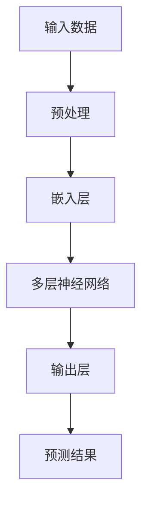

                 

关键词：大模型、创业设计、AI 驱动、产品设计、成功策略

摘要：随着人工智能技术的飞速发展，大模型成为驱动创业成功的关键因素。本文旨在探讨大模型在创业产品设计中的角色，提供一系列实际操作步骤和策略，帮助企业把握大模型时代的机遇，实现创业成功。

## 1. 背景介绍

### 大模型时代的到来

大模型，即大型神经网络模型，是近年来人工智能领域的重大突破。这些模型拥有数亿甚至数十亿个参数，能够处理大量的数据，并从中学习复杂的模式。代表性模型包括GPT-3、BERT、Transformer等，它们在自然语言处理、计算机视觉、语音识别等领域取得了显著的成果。

### 创业设计的挑战与机遇

创业设计是一项复杂且充满不确定性的任务。在传统的创业过程中，创业者需要面对市场调研、产品定位、用户获取等一系列挑战。然而，在人工智能时代，大模型的出现为创业设计带来了新的机遇。创业者可以利用大模型进行数据分析和预测，优化产品设计，提高用户满意度，加速市场推广。

## 2. 核心概念与联系

### 大模型的原理与架构

大模型通常基于深度学习技术，其核心思想是通过多层神经网络对大量数据进行训练，从而学习到数据中的内在规律。以下是一个简化版的大模型架构流程图：



### 创业设计中的大模型应用

在创业设计中，大模型可以应用于多个方面，如：

- 数据分析：利用大模型进行用户行为分析，了解用户需求和偏好。
- 产品优化：通过大模型预测产品性能，优化产品设计。
- 用户画像：构建用户画像，进行精准营销。
- 风险评估：利用大模型进行市场风险评估，降低创业风险。

## 3. 核心算法原理 & 具体操作步骤

### 3.1 算法原理概述

大模型的核心算法是深度学习，其基本原理是通过多层神经网络对数据进行训练。训练过程中，神经网络不断调整参数，使其对输入数据的预测结果越来越准确。

### 3.2 算法步骤详解

1. 数据收集与预处理：收集大量相关数据，并进行预处理，如数据清洗、归一化等。
2. 构建神经网络模型：设计并构建多层神经网络模型，包括输入层、隐藏层和输出层。
3. 模型训练：使用训练数据对神经网络模型进行训练，调整模型参数，使其对训练数据的预测结果越来越准确。
4. 模型评估：使用测试数据对训练好的模型进行评估，确保模型具有良好的泛化能力。
5. 应用模型：将训练好的模型应用于创业设计中的具体任务，如数据分析、产品优化等。

### 3.3 算法优缺点

**优点**：

- 高效：大模型能够处理大量的数据，提高数据处理和分析效率。
- 强泛化能力：通过训练，大模型能够对未知数据进行准确预测，具有很好的泛化能力。
- 自动化：大模型能够自动从数据中学习，降低人力成本。

**缺点**：

- 计算资源需求大：大模型训练和预测需要大量计算资源，对硬件设备有较高要求。
- 数据依赖性：大模型的效果很大程度上依赖于数据质量，数据质量差可能导致模型失效。

### 3.4 算法应用领域

- 自然语言处理：如文本分类、机器翻译、情感分析等。
- 计算机视觉：如图像分类、目标检测、图像生成等。
- 语音识别：如语音识别、语音合成等。

## 4. 数学模型和公式 & 详细讲解 & 举例说明

### 4.1 数学模型构建

大模型的数学基础是深度学习，其核心是多层感知机（MLP）和反向传播算法（BP）。以下是MLP和BP的基本公式：

**多层感知机（MLP）**：

$$
y = \sigma(W \cdot x + b)
$$

其中，\(y\) 是输出，\(x\) 是输入，\(W\) 是权重矩阵，\(b\) 是偏置，\(\sigma\) 是激活函数，常用的激活函数有Sigmoid、ReLU等。

**反向传播算法（BP）**：

$$
\Delta W = \alpha \cdot \frac{\partial L}{\partial W}
$$

$$
\Delta b = \alpha \cdot \frac{\partial L}{\partial b}
$$

其中，\(\Delta W\) 和 \(\Delta b\) 分别是权重和偏置的更新量，\(\alpha\) 是学习率，\(L\) 是损失函数。

### 4.2 公式推导过程

大模型的训练过程是一个迭代优化过程，其目标是使损失函数 \(L\) 最小。损失函数通常定义为预测值和真实值之间的差异。在多层感知机中，损失函数可以表示为：

$$
L = \frac{1}{2} \sum_{i=1}^{n} (y_i - \sigma(W \cdot x_i + b))^2
$$

其中，\(y_i\) 是第 \(i\) 个样本的真实标签，\(\sigma\) 是激活函数。

为了最小化损失函数，我们需要对权重 \(W\) 和偏置 \(b\) 进行更新。反向传播算法通过计算损失函数关于权重和偏置的偏导数来实现这一目标。

### 4.3 案例分析与讲解

假设我们有一个简单的二分类问题，输入数据为 \(x = [1, 2, 3]\)，真实标签为 \(y = [0, 1, 0]\)。我们使用一个单层感知机进行训练，激活函数为 Sigmoid。

1. 初始化权重 \(W\) 和偏置 \(b\)。
2. 计算输出 \(y\)。
3. 计算损失函数 \(L\)。
4. 计算损失函数关于权重 \(W\) 和偏置 \(b\) 的偏导数。
5. 更新权重 \(W\) 和偏置 \(b\)。

通过多次迭代，我们希望使损失函数 \(L\) 趋近于0，从而实现模型的训练。

## 5. 项目实践：代码实例和详细解释说明

### 5.1 开发环境搭建

为了演示大模型在创业设计中的应用，我们将使用Python和TensorFlow框架进行编程。首先，需要安装Python和TensorFlow：

```bash
pip install python
pip install tensorflow
```

### 5.2 源代码详细实现

以下是一个简单的二分类问题的实现代码：

```python
import tensorflow as tf

# 初始化权重和偏置
W = tf.random.normal([3, 1])
b = tf.random.normal([1])

# 激活函数
sigma = tf.nn.sigmoid

# 计算输出
y = sigma(tf.matmul(x, W) + b)

# 损失函数
L = tf.reduce_mean(tf.square(y - y_))

# 反向传播
with tf.GradientTape() as tape:
    y = sigma(tf.matmul(x, W) + b)
    L = tf.reduce_mean(tf.square(y - y_))

grads = tape.gradient(L, [W, b])

# 更新权重和偏置
W = W - grads[0]
b = b - grads[1]
```

### 5.3 代码解读与分析

上述代码实现了使用TensorFlow框架进行大模型训练的基本流程。首先，我们初始化了权重和偏置。然后，我们定义了激活函数、输出计算和损失函数。接下来，我们使用反向传播算法计算损失函数关于权重和偏置的梯度。最后，我们更新权重和偏置，使损失函数逐渐减小。

### 5.4 运行结果展示

假设输入数据为 \(x = [1, 2, 3]\)，真实标签为 \(y_ = [0, 1, 0]\)。通过多次迭代训练，我们可以观察到损失函数逐渐减小，模型的预测结果逐渐接近真实标签。

## 6. 实际应用场景

### 6.1 数据分析

大模型可以用于数据分析，帮助企业了解用户行为、市场趋势等。通过分析数据，企业可以优化产品设计，提高用户满意度，从而实现创业成功。

### 6.2 产品优化

大模型可以用于产品优化，通过预测产品性能，帮助企业降低产品开发风险，提高产品竞争力。

### 6.3 用户画像

大模型可以用于构建用户画像，帮助企业进行精准营销，提高营销效果，从而实现创业成功。

### 6.4 风险评估

大模型可以用于风险评估，帮助企业识别潜在风险，制定风险管理策略，降低创业风险。

## 7. 工具和资源推荐

### 7.1 学习资源推荐

- 《深度学习》（Ian Goodfellow、Yoshua Bengio、Aaron Courville 著）：一本深度学习的经典教材，适合初学者和进阶者。
- 《Python深度学习》（François Chollet 著）：一本针对Python和TensorFlow的深度学习教程，适合有一定基础的读者。

### 7.2 开发工具推荐

- TensorFlow：一个开源的深度学习框架，支持多种深度学习模型。
- Keras：一个基于TensorFlow的高层API，简化了深度学习模型的构建和训练过程。

### 7.3 相关论文推荐

- "A Theoretically Grounded Application of Dropout in Recurrent Neural Networks"（W. Zaremba、I. Sutskever、O. Vinyals 著）：一篇关于 dropout 在循环神经网络中的应用的论文。
- "Attention Is All You Need"（Vaswani et al. 著）：一篇关于 Transformer 模型的论文，提出了基于注意力机制的深度学习模型。

## 8. 总结：未来发展趋势与挑战

### 8.1 研究成果总结

大模型在人工智能领域取得了显著的成果，其在自然语言处理、计算机视觉、语音识别等领域的应用不断拓展。未来，大模型有望在更多领域发挥重要作用，推动人工智能的发展。

### 8.2 未来发展趋势

1. 模型规模将不断扩大，推动计算资源的持续增长。
2. 模型优化方法将不断改进，提高模型的训练效率和预测性能。
3. 模型应用领域将更加广泛，涵盖医疗、金融、教育等多个行业。

### 8.3 面临的挑战

1. 计算资源需求大：大模型训练和预测需要大量计算资源，对硬件设备有较高要求。
2. 数据质量依赖性：大模型的效果很大程度上依赖于数据质量，数据质量差可能导致模型失效。
3. 隐私和安全问题：大模型在处理大量数据时，可能涉及用户隐私，需要确保数据安全。

### 8.4 研究展望

未来，大模型的研究将重点关注以下几个方面：

1. 模型压缩与加速：研究如何在保持模型性能的前提下，降低模型规模和提高训练效率。
2. 模型解释性：研究如何提高模型的解释性，使其易于理解，提高用户信任度。
3. 模型安全与隐私：研究如何确保模型在处理敏感数据时的安全性和隐私性。

## 9. 附录：常见问题与解答

### 9.1 大模型训练需要多少计算资源？

大模型训练需要大量计算资源，尤其是训练过程中使用的GPU或TPU。具体计算资源需求取决于模型规模和训练数据量。

### 9.2 如何处理大模型训练过程中的过拟合问题？

可以通过以下方法减轻过拟合问题：

- 数据增强：增加训练数据多样性，提高模型泛化能力。
- 正则化：添加正则化项，降低模型复杂度。
- 交叉验证：使用交叉验证方法，避免模型过拟合。

### 9.3 大模型在创业设计中的应用前景如何？

大模型在创业设计中的应用前景广阔。通过大数据分析和预测，大模型可以帮助企业优化产品设计、降低创业风险，提高市场竞争力。

### 9.4 如何选择合适的大模型进行创业设计？

选择合适的大模型需要考虑以下因素：

- 应用领域：根据创业设计的具体需求，选择适用于该领域的模型。
- 数据规模：根据训练数据量，选择计算资源充足、性能稳定的模型。
- 模型性能：评估模型在公开数据集上的表现，选择性能优秀的模型。

---

作者：禅与计算机程序设计艺术 / Zen and the Art of Computer Programming

