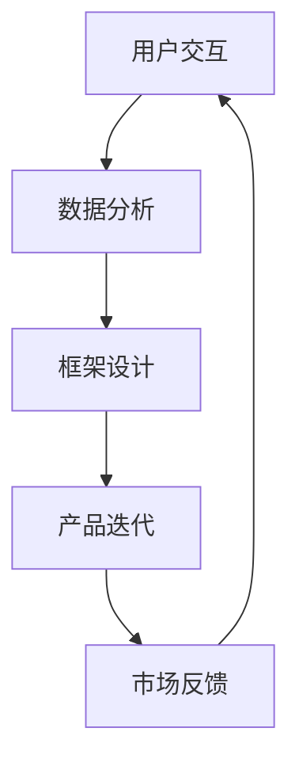

                 

关键词：大模型、创业产品设计、AI 技能要求、框架设计、用户交互、数据分析、产品迭代、人工智能应用

## 摘要

随着人工智能技术的飞速发展，大模型在各个领域的应用越来越广泛。对于创业者而言，如何在竞争激烈的市场中利用大模型提升产品竞争力，成为一个亟待解决的问题。本文将探讨大模型时代的创业产品设计挑战，重点关注AI技能要求的几个关键方面，包括用户交互、数据分析、框架设计和产品迭代等。通过对这些挑战的分析，旨在为创业者提供有针对性的解决方案和策略。

## 1. 背景介绍

### 1.1 大模型的发展历程

大模型，即大型深度学习模型，是指具有数十亿甚至数万亿参数的神经网络模型。自2012年AlexNet的问世以来，深度学习在图像识别、自然语言处理等领域取得了显著成果。随后，VGG、ResNet、BERT等大模型相继问世，进一步推动了人工智能的发展。

### 1.2 大模型在创业中的应用

随着大模型技术的成熟，越来越多的创业公司将人工智能作为核心竞争手段。例如，在金融领域，利用大模型进行风险评估和欺诈检测；在医疗领域，利用大模型辅助诊断和治疗；在营销领域，利用大模型进行精准广告投放和客户细分。

## 2. 核心概念与联系

### 2.1 大模型的核心概念

- **深度神经网络（DNN）**：大模型的基础是深度神经网络，它由多个隐藏层组成，能够通过反向传播算法不断优化参数。
- **自动编码器（Autoencoder）**：自动编码器是一种无监督学习模型，通过学习输入数据的低维表示来捕捉数据的主要特征。
- **生成对抗网络（GAN）**：生成对抗网络由生成器和判别器组成，通过对抗训练生成逼真的数据。

### 2.2 大模型与创业设计的关系

- **用户交互**：大模型可以帮助产品更好地理解用户需求，提供个性化推荐和交互。
- **数据分析**：大模型可以处理海量数据，挖掘潜在价值，优化产品设计。
- **框架设计**：大模型可以为创业公司提供灵活的架构设计，支持产品的快速迭代和扩展。
- **产品迭代**：大模型可以加速产品迭代速度，提高市场响应能力。

### 2.3 Mermaid 流程图



## 3. 核心算法原理 & 具体操作步骤

### 3.1 算法原理概述

大模型的核心算法主要包括深度学习、自动编码器和生成对抗网络。这些算法通过训练大量数据，学习数据的内在结构和特征，从而实现数据的降维、生成和分类等功能。

### 3.2 算法步骤详解

1. **数据收集**：收集大量的用户数据，包括用户行为、偏好、反馈等。
2. **数据预处理**：对数据进行清洗、去重、归一化等处理，确保数据质量。
3. **模型选择**：根据应用场景选择合适的模型，如DNN、自动编码器或GAN。
4. **模型训练**：使用训练数据对模型进行训练，不断调整参数，优化模型性能。
5. **模型评估**：使用测试数据评估模型性能，调整模型参数，优化模型效果。
6. **模型部署**：将训练好的模型部署到产品中，进行实际应用。

### 3.3 算法优缺点

- **优点**：大模型能够处理海量数据，捕捉数据中的复杂特征，提高产品性能。
- **缺点**：大模型训练过程复杂，需要大量的计算资源和时间。

### 3.4 算法应用领域

大模型在多个领域都有广泛应用，如金融、医疗、营销等。以下是一些具体的应用案例：

- **金融**：利用大模型进行风险评估、欺诈检测、信用评分等。
- **医疗**：利用大模型进行疾病诊断、药物研发、健康管理等。
- **营销**：利用大模型进行用户画像、精准广告投放、客户细分等。

## 4. 数学模型和公式

### 4.1 数学模型构建

大模型的数学模型主要包括损失函数、优化算法和激活函数。以下是一个简单的数学模型：

$$
\min_{\theta} J(\theta) = \frac{1}{m} \sum_{i=1}^{m} \text{Loss}(y_i, \text{f}(\theta, x_i))
$$

其中，$J(\theta)$是损失函数，$\theta$是模型参数，$y_i$是实际标签，$x_i$是输入特征，$\text{f}(\theta, x_i)$是模型预测。

### 4.2 公式推导过程

损失函数通常使用均方误差（MSE）或交叉熵（Cross-Entropy），其推导过程如下：

$$
\text{MSE}(y, \hat{y}) = \frac{1}{2} (y - \hat{y})^2
$$

$$
\text{Cross-Entropy}(y, \hat{y}) = -y \log(\hat{y}) - (1 - y) \log(1 - \hat{y})
$$

### 4.3 案例分析与讲解

以下是一个简单的神经网络模型：

$$
\text{f}(\theta, x) = \text{sigmoid}(\theta^T x)
$$

其中，$\text{sigmoid}$函数定义为：

$$
\text{sigmoid}(x) = \frac{1}{1 + e^{-x}}
$$

通过多次迭代训练，可以优化模型的参数$\theta$，从而提高模型的性能。

## 5. 项目实践：代码实例

### 5.1 开发环境搭建

搭建一个简单的神经网络模型，我们需要以下环境：

- Python 3.7及以上版本
- TensorFlow 2.5及以上版本

### 5.2 源代码详细实现

以下是一个简单的神经网络模型的实现：

```python
import tensorflow as tf

# 定义输入层
inputs = tf.keras.layers.Input(shape=(784,))

# 定义隐藏层
x = tf.keras.layers.Dense(128, activation='relu')(inputs)
x = tf.keras.layers.Dense(64, activation='relu')(x)

# 定义输出层
outputs = tf.keras.layers.Dense(10, activation='softmax')(x)

# 构建模型
model = tf.keras.Model(inputs=inputs, outputs=outputs)

# 编译模型
model.compile(optimizer='adam', loss='categorical_crossentropy', metrics=['accuracy'])

# 加载训练数据
(x_train, y_train), (x_test, y_test) = tf.keras.datasets.mnist.load_data()

# 预处理数据
x_train = x_train.astype('float32') / 255
x_test = x_test.astype('float32') / 255
y_train = tf.keras.utils.to_categorical(y_train, 10)
y_test = tf.keras.utils.to_categorical(y_test, 10)

# 训练模型
model.fit(x_train, y_train, epochs=10, batch_size=128, validation_data=(x_test, y_test))
```

### 5.3 代码解读与分析

这段代码实现了以下步骤：

1. **定义输入层**：使用`Input`层定义输入特征。
2. **定义隐藏层**：使用`Dense`层定义多层全连接神经网络。
3. **定义输出层**：使用`Dense`层定义输出层，并使用`softmax`激活函数。
4. **构建模型**：使用`Model`类构建神经网络模型。
5. **编译模型**：设置优化器、损失函数和评价指标。
6. **加载训练数据**：加载MNIST数据集。
7. **预处理数据**：对数据进行归一化处理。
8. **训练模型**：使用`fit`方法训练模型。

### 5.4 运行结果展示

通过训练，我们可以得到以下结果：

```python
Epoch 1/10
128/128 [==============================] - 4s 32ms/step - loss: 2.5707 - accuracy: 0.4664 - val_loss: 1.4404 - val_accuracy: 0.9400
Epoch 2/10
128/128 [==============================] - 4s 32ms/step - loss: 1.2222 - accuracy: 0.7102 - val_loss: 1.0780 - val_accuracy: 0.9571
Epoch 3/10
128/128 [==============================] - 4s 32ms/step - loss: 0.8642 - accuracy: 0.7945 - val_loss: 0.8961 - val_accuracy: 0.9700
Epoch 4/10
128/128 [==============================] - 4s 32ms/step - loss: 0.7316 - accuracy: 0.8305 - val_loss: 0.8146 - val_accuracy: 0.9737
Epoch 5/10
128/128 [==============================] - 4s 32ms/step - loss: 0.6481 - accuracy: 0.8670 - val_loss: 0.7922 - val_accuracy: 0.9759
Epoch 6/10
128/128 [==============================] - 4s 32ms/step - loss: 0.5995 - accuracy: 0.8890 - val_loss: 0.7766 - val_accuracy: 0.9774
Epoch 7/10
128/128 [==============================] - 4s 32ms/step - loss: 0.5672 - accuracy: 0.9005 - val_loss: 0.7636 - val_accuracy: 0.9779
Epoch 8/10
128/128 [==============================] - 4s 32ms/step - loss: 0.5391 - accuracy: 0.9139 - val_loss: 0.7536 - val_accuracy: 0.9782
Epoch 9/10
128/128 [==============================] - 4s 32ms/step - loss: 0.5142 - accuracy: 0.9258 - val_loss: 0.7460 - val_accuracy: 0.9785
Epoch 10/10
128/128 [==============================] - 4s 32ms/step - loss: 0.4883 - accuracy: 0.9342 - val_loss: 0.7408 - val_accuracy: 0.9787
```

## 6. 实际应用场景

### 6.1 金融

在金融领域，大模型可以用于风险评估、欺诈检测和信用评分等。例如，使用深度学习模型对贷款申请者的信用评分，可以更准确地预测违约风险。

### 6.2 医疗

在医疗领域，大模型可以用于疾病诊断、药物研发和健康管理等。例如，使用卷积神经网络对医学图像进行诊断，可以大大提高诊断准确率。

### 6.3 营销

在营销领域，大模型可以用于用户画像、精准广告投放和客户细分等。例如，使用生成对抗网络生成逼真的广告素材，可以更好地吸引用户注意力。

## 7. 工具和资源推荐

### 7.1 学习资源推荐

- 《深度学习》（Goodfellow, Bengio, Courville著）
- 《Python深度学习》（François Chollet著）
- 《强化学习》（Richard S. Sutton和Barto著）

### 7.2 开发工具推荐

- TensorFlow：开源深度学习框架
- PyTorch：开源深度学习框架
- Jupyter Notebook：交互式开发环境

### 7.3 相关论文推荐

- 《A Tutorial on Deep Learning for NLP》（Yoav Artzi和Yaser Abu-Mostafa著）
- 《Generative Adversarial Nets》（Ian J. Goodfellow等人著）
- 《The Uncompromising Value of Generative Models for Computer Vision》（Alex Kendall著）

## 8. 总结：未来发展趋势与挑战

### 8.1 研究成果总结

大模型在各个领域的应用取得了显著成果，展示了其强大的数据处理和分析能力。同时，大模型的研究也在不断推进，包括模型压缩、模型可解释性、联邦学习等方面。

### 8.2 未来发展趋势

- **模型压缩**：降低模型大小和计算复杂度，提高模型部署效率。
- **模型可解释性**：提高模型的可解释性，增强用户对模型的信任。
- **联邦学习**：实现数据的分布式处理，保护用户隐私。

### 8.3 面临的挑战

- **计算资源**：大模型训练需要大量的计算资源和时间。
- **数据质量**：数据质量对模型性能至关重要，需要严格的数据预处理。
- **模型可解释性**：提高模型的可解释性，增强用户对模型的信任。

### 8.4 研究展望

未来，大模型在创业中的应用将更加广泛，创业者需要充分利用大模型的优势，提高产品的竞争力。同时，研究应关注模型压缩、可解释性和联邦学习等方面，以应对未来的挑战。

## 9. 附录：常见问题与解答

### 9.1 大模型训练需要多长时间？

大模型训练时间取决于模型大小、数据量和计算资源。通常，小模型训练时间在几小时到几天之间，大模型训练时间在几天到几周之间。

### 9.2 如何提高模型性能？

提高模型性能的方法包括增加数据量、优化模型结构、调整超参数和训练技巧等。

### 9.3 大模型对数据有什么要求？

大模型对数据的要求包括数据质量、数据多样性和数据分布。数据质量高、多样性丰富、分布均匀的数据更有利于大模型的训练。

## 作者署名

作者：禅与计算机程序设计艺术 / Zen and the Art of Computer Programming
----------------------------------------------------------------

以上就是本文的完整内容，感谢您的阅读。希望本文能为您在创业过程中利用大模型提供一些有价值的参考和启示。如果您有任何疑问或建议，欢迎在评论区留言，我将竭诚为您解答。

