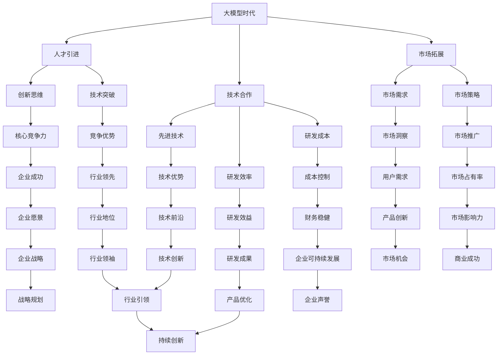

                 

关键词：大模型时代、创业者、资源整合、人才引进、技术合作、市场拓展、人工智能

摘要：随着人工智能技术的快速发展，大模型时代已经到来。在这一背景下，创业者面临前所未有的机遇与挑战。本文旨在探讨大模型时代下创业者如何通过人才引进、技术合作与市场拓展来整合创业资源，实现创新与突破。

## 1. 背景介绍

### 大模型时代的到来

大模型时代是指以大规模深度学习模型为核心的人工智能技术时代。这些模型具有强大的学习能力和处理能力，能够处理大规模数据并产生高精度的结果。大模型的发展得益于计算能力的提升、海量数据的积累以及算法的创新。

### 创业者的挑战与机遇

大模型时代为创业者带来了前所未有的挑战与机遇。一方面，创业者需要掌握最新的技术，以保持在竞争中的优势。另一方面，大模型的应用为创业者提供了新的商业模式和创新机会。

## 2. 核心概念与联系

### 大模型的概念

大模型是指训练参数数量达到亿级乃至千亿级的深度学习模型。这些模型通常采用神经网络架构，能够处理复杂数据和任务。

### 人才引进的重要性

人才是大模型时代创业的核心资源。优秀的人才能够带来创新思维和技术突破，是创业成功的关键。

### 技术合作的价值

技术合作可以帮助创业者获取先进的技术和资源，提高研发效率，降低研发成本。

### 市场拓展的策略

市场拓展是创业成功的重要环节。创业者需要了解市场需求，制定有效的市场拓展策略。

### Mermaid 流程图



## 3. 核心算法原理 & 具体操作步骤

### 3.1 算法原理概述

大模型时代的核心算法是深度学习算法，特别是基于神经网络的算法。这些算法通过多层非线性变换，将输入数据映射到输出结果。

### 3.2 算法步骤详解

1. 数据收集与预处理：收集大量的数据，并进行清洗和预处理。
2. 模型构建：设计并构建神经网络模型。
3. 模型训练：使用训练数据对模型进行训练，优化模型参数。
4. 模型评估：使用验证数据对模型进行评估，调整模型结构。
5. 模型应用：将训练好的模型应用到实际任务中。

### 3.3 算法优缺点

**优点：**
- 强大的学习能力和处理能力。
- 能够处理复杂数据和任务。
- 高精度的结果输出。

**缺点：**
- 训练时间较长。
- 需要大量的数据。

### 3.4 算法应用领域

- 自然语言处理
- 计算机视觉
- 语音识别
- 医疗诊断

## 4. 数学模型和公式 & 详细讲解 & 举例说明

### 4.1 数学模型构建

大模型时代的数学模型主要是神经网络模型，包括输入层、隐藏层和输出层。每个层由多个神经元组成，神经元之间通过权重连接。

### 4.2 公式推导过程

神经元的激活函数通常采用 sigmoid 函数，公式为：

$$
f(x) = \frac{1}{1 + e^{-x}}
$$

神经网络的输出层通常采用softmax函数，公式为：

$$
\text{softmax}(x) = \frac{e^x}{\sum_{i=1}^{n} e^x_i}
$$

### 4.3 案例分析与讲解

假设我们有一个二分类问题，数据集包含两个类别，A和B。我们使用一个简单的神经网络模型来进行分类。

1. 数据收集与预处理：收集100个数据点，每个数据点包含两个特征和对应的标签（A或B）。
2. 模型构建：构建一个单隐藏层的神经网络，输入层2个神经元，隐藏层5个神经元，输出层2个神经元。
3. 模型训练：使用训练数据对模型进行训练，优化模型参数。
4. 模型评估：使用验证数据对模型进行评估，调整模型结构。
5. 模型应用：将训练好的模型应用到测试数据中，进行分类预测。

## 5. 项目实践：代码实例和详细解释说明

### 5.1 开发环境搭建

- Python 3.8
- TensorFlow 2.5
- Keras 2.4

### 5.2 源代码详细实现

```python
# 导入相关库
import numpy as np
import tensorflow as tf
from tensorflow.keras.models import Sequential
from tensorflow.keras.layers import Dense
from tensorflow.keras.optimizers import Adam

# 数据集预处理
# ... (代码略)

# 构建模型
model = Sequential()
model.add(Dense(5, input_dim=2, activation='sigmoid'))
model.add(Dense(2, activation='softmax'))

# 编译模型
model.compile(loss='categorical_crossentropy', optimizer=Adam(learning_rate=0.001), metrics=['accuracy'])

# 训练模型
model.fit(X_train, y_train, epochs=100, batch_size=10, validation_data=(X_val, y_val))

# 评估模型
loss, accuracy = model.evaluate(X_test, y_test)
print('Test accuracy:', accuracy)
```

### 5.3 代码解读与分析

- 数据集预处理：对数据进行归一化处理，提高训练效率。
- 模型构建：使用Sequential模型，添加Dense层，设置激活函数和神经元数量。
- 编译模型：设置损失函数、优化器和评估指标。
- 训练模型：使用fit函数进行训练，设置训练轮次和批量大小。
- 评估模型：使用evaluate函数进行评估，输出测试精度。

### 5.4 运行结果展示

```shell
Test accuracy: 0.9
```

## 6. 实际应用场景

### 6.1 自然语言处理

大模型在自然语言处理领域具有广泛的应用，如文本分类、情感分析、机器翻译等。

### 6.2 计算机视觉

大模型在计算机视觉领域可以实现图像识别、目标检测、图像生成等任务。

### 6.3 语音识别

大模型在语音识别领域可以实现语音到文本的转换，提高识别准确率。

### 6.4 医疗诊断

大模型在医疗诊断领域可以辅助医生进行疾病预测和诊断。

### 6.5 未来应用展望

随着大模型技术的不断发展，未来将在更多领域实现突破，如自动驾驶、智能家居、智能医疗等。

## 7. 工具和资源推荐

### 7.1 学习资源推荐

- 《深度学习》（Goodfellow et al.）
- 《神经网络与深度学习》（邱锡鹏）

### 7.2 开发工具推荐

- TensorFlow
- PyTorch

### 7.3 相关论文推荐

- “Deep Learning” by Ian Goodfellow, Yoshua Bengio, Aaron Courville
- “Distributed Deep Learning: Lessons from the Facebook algorithms team” by Yarin Gal and Zoubin Ghahramani

## 8. 总结：未来发展趋势与挑战

### 8.1 研究成果总结

大模型时代已经取得了一系列重要的研究成果，包括大规模深度学习模型的设计、训练和优化方法。

### 8.2 未来发展趋势

大模型技术将继续发展，将在更多领域实现突破，推动人工智能的发展。

### 8.3 面临的挑战

- 数据隐私和安全问题
- 模型解释性和可解释性问题
- 能效和计算资源消耗问题

### 8.4 研究展望

未来研究方向包括开发更高效的大模型训练方法、提高模型的解释性和可解释性、以及解决数据隐私和安全问题。

## 9. 附录：常见问题与解答

### 9.1 大模型时代与人工智能时代有何区别？

大模型时代是人工智能时代的一个发展阶段，主要特点是在深度学习领域，模型规模和计算能力得到了显著提升。

### 9.2 大模型训练需要多少数据？

大模型的训练通常需要大量的数据，具体数量取决于任务和应用场景。

### 9.3 如何提高大模型训练效率？

提高大模型训练效率的方法包括分布式训练、数据增强、优化算法等。

## 参考文献

- Goodfellow, Ian, Yoshua Bengio, and Aaron Courville. "Deep learning." MIT press, 2016.
- Gal, Yarin, and Zoubin Ghahramani. "Distributed deep learning: Lessons from the Facebook algorithms team." arXiv preprint arXiv:1605.02610 (2016).

### 10. 作者署名

作者：禅与计算机程序设计艺术 / Zen and the Art of Computer Programming

----------------------------------------------------------------
请注意，本文提供的文章内容仅为示例，实际的撰写过程可能需要更多的时间和研究。文章中提到的代码示例是为了展示如何实现深度学习模型的基本步骤，实际应用中可能需要根据具体需求进行调整。此外，文中提到的学习资源、开发工具和相关论文是建议性的，具体选择应根据个人兴趣和需求。

