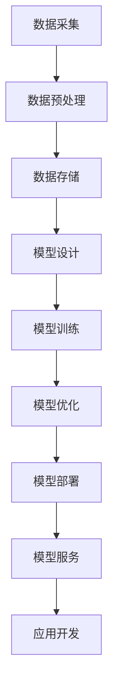

                 

摘要：
本文旨在探讨大模型时代下创业者所面临的技术、市场和政策趋势。随着深度学习、自然语言处理等技术的飞速发展，大模型已经成为推动创新的重要力量。本文首先分析了大模型技术的核心概念和架构，然后深入探讨了其算法原理、数学模型和具体应用实例。接着，我们展示了大模型在实际应用场景中的优势和未来前景，并推荐了相关学习和开发资源。最后，本文总结了当前研究的主要成果、未来发展趋势和面临的挑战，为创业者提供了有价值的洞察和建议。

## 1. 背景介绍

近年来，人工智能（AI）领域经历了前所未有的快速发展。特别是深度学习、自然语言处理和计算机视觉等技术的突破，为大模型的发展奠定了基础。大模型，顾名思义，是指具有巨大参数量和训练数据的神经网络模型。这些模型能够通过学习和理解大量的数据，实现高度复杂的任务，如文本生成、图像识别、语音识别等。

大模型的发展不仅改变了人工智能的范式，也为创业者带来了新的机遇和挑战。一方面，大模型为创业者提供了强大的工具，使他们能够开发出更加智能和高效的产品和服务。另一方面，大模型的开发和维护需要大量的资源和专业知识，这对创业者的技术和商业能力提出了更高的要求。

本文将从技术趋势、市场趋势和政策趋势三个方面，深入分析大模型时代下创业者所面临的机遇和挑战。通过分析大模型技术的核心概念、算法原理、数学模型和具体应用，我们将帮助创业者更好地把握行业趋势，制定有效的创业战略。

## 2. 核心概念与联系

### 大模型技术概述

大模型技术是指利用深度学习和神经网络技术，构建具有巨大参数量和训练数据的复杂模型。这些模型通过大规模数据的学习，能够自动提取和表达数据中的复杂模式和规律。大模型技术的核心包括以下几个方面：

1. **神经网络**：神经网络是模拟人脑神经元连接的一种计算模型。通过多层神经元的堆叠和相互连接，神经网络能够实现复杂的函数映射和特征提取。
2. **深度学习**：深度学习是神经网络的一种扩展，通过增加网络的深度，可以显著提高模型的性能和鲁棒性。
3. **大规模数据处理**：大模型需要处理和分析海量数据。这包括数据的采集、存储、预处理和训练等环节。
4. **并行计算和分布式系统**：为了训练大模型，需要使用高性能的计算机和分布式系统，以加速数据处理和模型训练。

### 大模型技术的架构

大模型技术的架构可以分为数据层、模型层和应用层三个层次。

1. **数据层**：数据层包括数据采集、数据预处理和数据存储等环节。这一层的关键技术包括数据清洗、数据增强、数据分区和分布式存储等。
2. **模型层**：模型层包括神经网络架构设计、模型训练和优化等环节。这一层的关键技术包括神经网络架构的选择、训练算法的设计、优化策略的运用等。
3. **应用层**：应用层包括模型部署、模型服务和应用开发等环节。这一层的关键技术包括模型压缩、模型推理、模型解释和模型集成等。

### 大模型技术的 Mermaid 流程图

以下是一个简化的 Mermaid 流程图，展示了大模型技术的核心流程：



在这个流程图中，每个节点代表一个大模型技术中的一个关键环节，箭头表示数据或信息的流动方向。通过这个流程图，我们可以清晰地看到大模型技术的整体架构和各个环节之间的关系。

### 小结

大模型技术作为一种先进的计算范式，正在深刻地改变人工智能领域的面貌。从核心概念到具体应用，大模型技术涵盖了从数据采集、模型设计到模型部署的各个环节。了解大模型技术的架构和流程，对于创业者来说至关重要，它不仅有助于他们把握技术趋势，还能够为他们提供具体的实践指导。在接下来的章节中，我们将深入探讨大模型技术的算法原理、数学模型和实际应用，帮助创业者更好地利用这一技术实现创新和突破。

## 3. 核心算法原理 & 具体操作步骤

### 3.1 算法原理概述

大模型技术的基础是深度学习和神经网络。深度学习通过多层神经元的堆叠，实现从原始数据到复杂特征的高级映射。在神经网络中，每个神经元都通过权重和偏置对输入数据进行线性变换，然后通过激活函数进行非线性转换，最终产生输出。

### 3.2 算法步骤详解

1. **数据采集与预处理**：
   - **数据采集**：首先，需要从各种渠道获取大量数据，如文本、图像、音频等。
   - **数据预处理**：对采集到的数据进行清洗、标准化、归一化等处理，使其适合模型训练。

2. **模型设计**：
   - **网络架构**：根据任务需求，设计合适的神经网络架构，如卷积神经网络（CNN）、循环神经网络（RNN）、变换器（Transformer）等。
   - **层间连接**：确定各层之间的连接方式和参数初始化。

3. **模型训练**：
   - **前向传播**：将预处理后的数据输入神经网络，通过各层计算，得到模型的预测输出。
   - **损失函数**：计算预测输出与真实值之间的差异，得到损失函数的值。
   - **反向传播**：通过反向传播算法，计算各层的梯度，更新模型的权重和偏置。
   - **优化算法**：选择合适的优化算法，如随机梯度下降（SGD）、Adam等，更新模型参数。

4. **模型优化**：
   - **正则化**：为了避免过拟合，采用正则化技术，如L1正则化、L2正则化等。
   - **超参数调整**：通过交叉验证和网格搜索等方法，调整模型参数，优化模型性能。

5. **模型部署**：
   - **模型压缩**：为了降低模型的存储和计算成本，采用模型压缩技术，如剪枝、量化等。
   - **模型推理**：将训练好的模型部署到生产环境中，进行实时推理和预测。

### 3.3 算法优缺点

**优点**：
- **强大的表达力**：大模型能够自动学习和提取数据中的复杂模式和规律，实现高度复杂的任务。
- **高精度和鲁棒性**：通过大规模数据的训练，大模型具有较高的精度和鲁棒性，能够应对各种不确定性和噪声。
- **通用性和灵活性**：大模型可以应用于多个领域，如自然语言处理、计算机视觉、语音识别等，具有很高的灵活性和通用性。

**缺点**：
- **计算资源需求高**：大模型的训练和部署需要大量的计算资源和时间，对于创业公司来说，这可能是较大的挑战。
- **数据依赖性**：大模型对数据的依赖性很强，需要大量的高质量数据才能达到良好的性能。
- **可解释性低**：大模型的决策过程通常是非线性和复杂的，难以解释和理解。

### 3.4 算法应用领域

大模型技术已经在多个领域取得了显著的成果，以下是几个主要的应用领域：

- **自然语言处理**：大模型在文本生成、机器翻译、情感分析、问答系统等领域展现了强大的能力。
- **计算机视觉**：大模型在图像识别、目标检测、视频分析等领域取得了突破性进展。
- **语音识别**：大模型在语音合成、语音识别、语音增强等领域应用广泛。
- **推荐系统**：大模型在个性化推荐、用户行为预测等领域表现出色。

### 小结

大模型技术的核心算法原理主要包括神经网络、深度学习和大规模数据处理。具体的操作步骤涵盖了数据采集与预处理、模型设计、模型训练、模型优化和模型部署等环节。虽然大模型技术具有强大的表达力、高精度和鲁棒性，但也面临着计算资源需求高、数据依赖性强和可解释性低等挑战。在未来的发展中，如何优化大模型技术，提高其效率和可解释性，将是重要的研究方向。

## 4. 数学模型和公式 & 详细讲解 & 举例说明

### 4.1 数学模型构建

大模型技术的核心在于其数学模型的构建。深度学习中的神经网络通常可以用以下数学模型表示：

$$
y = f(\theta (x))
$$

其中，$y$ 是模型的输出，$x$ 是输入，$f$ 是激活函数，$\theta$ 是模型参数（包括权重和偏置）。

### 4.2 公式推导过程

为了更好地理解大模型的工作原理，我们需要详细推导神经网络中的前向传播和反向传播过程。

#### 前向传播

在前向传播过程中，我们将输入 $x$ 传递到网络的各个层，每层通过权重和偏置进行线性变换，并通过激活函数进行非线性转换，最终得到输出 $y$。

假设第 $l$ 层的输入为 $x^{(l)}$，输出为 $y^{(l)}$，则有：

$$
y^{(l)} = f^{(l)}(\theta^{(l)}x^{(l-1)} + b^{(l)})
$$

其中，$f^{(l)}$ 是第 $l$ 层的激活函数，$\theta^{(l)}$ 是第 $l$ 层的权重，$b^{(l)}$ 是第 $l$ 层的偏置。

对于输入层，$x^{(0)} = x$，对于输出层，$y^{(L)} = y$，其中 $L$ 是网络的层数。

#### 反向传播

在反向传播过程中，我们通过计算损失函数的梯度，来更新模型参数。反向传播分为以下几个步骤：

1. **计算输出层的梯度**：

$$
\frac{\partial L}{\partial \theta^{(L)}} = \frac{\partial L}{\partial y^{(L)}} \cdot \frac{\partial y^{(L)}}{\partial \theta^{(L)}}
$$

2. **传播梯度到前一层**：

$$
\frac{\partial L}{\partial \theta^{(l-1)}} = \frac{\partial L}{\partial \theta^{(l)}} \cdot \frac{\partial \theta^{(l)}}{\partial x^{(l-1)}} = \frac{\partial L}{\partial \theta^{(l)}} \cdot \frac{\partial y^{(l)}}{\partial x^{(l-1)}} \cdot \frac{\partial x^{(l-1)}}{\partial \theta^{(l-1)}}
$$

其中，$\frac{\partial y^{(l)}}{\partial x^{(l-1)}}$ 是第 $l$ 层的梯度，可以通过链式法则计算。

3. **更新模型参数**：

$$
\theta^{(l)} \leftarrow \theta^{(l)} - \alpha \frac{\partial L}{\partial \theta^{(l)}}
$$

其中，$\alpha$ 是学习率。

### 4.3 案例分析与讲解

为了更好地理解上述数学模型的推导和应用，我们来看一个简单的例子：一个单层的神经网络，用于实现逻辑回归。

#### 例子：逻辑回归

假设我们有一个二分类问题，输入为 $x = (x_1, x_2)$，目标为 $y \in \{0, 1\}$。网络结构如下：

$$
y = \sigma (\theta_1 x_1 + \theta_2 x_2 + b)
$$

其中，$\sigma$ 是 sigmoid 激活函数，$\theta_1, \theta_2$ 是权重，$b$ 是偏置。

#### 前向传播

输入 $x = (1, 0)$，输出 $y$：

$$
y = \sigma (\theta_1 \cdot 1 + \theta_2 \cdot 0 + b) = \sigma (\theta_1 + b)
$$

假设 $\theta_1 = 1$，$b = 0.5$，则：

$$
y = \sigma (1 + 0.5) = \sigma (1.5) \approx 0.77
$$

#### 反向传播

损失函数为二元交叉熵损失：

$$
L = -y \ln(y) - (1 - y) \ln(1 - y)
$$

计算输出层的梯度：

$$
\frac{\partial L}{\partial y} = \frac{y}{y} - \frac{1 - y}{1 - y} = 1 - y
$$

$$
\frac{\partial y}{\partial \theta_1} = \frac{\partial \sigma (\theta_1 + b)}{\partial \theta_1} = \sigma' (\theta_1 + b)
$$

$$
\frac{\partial L}{\partial \theta_1} = \frac{\partial L}{\partial y} \cdot \frac{\partial y}{\partial \theta_1} = (1 - y) \cdot \sigma' (\theta_1 + b)
$$

更新权重：

$$
\theta_1 \leftarrow \theta_1 - \alpha \cdot (1 - y) \cdot \sigma' (\theta_1 + b)
$$

通过上述例子，我们可以看到如何使用数学模型进行前向传播和反向传播，以及如何更新模型参数。这为我们理解和应用大模型技术提供了具体的指导。

### 小结

本文通过数学模型和公式的推导，详细讲解了大模型技术的核心原理和操作步骤。从数据采集与预处理、模型设计、模型训练到模型优化，每个环节都涉及到重要的数学概念和计算方法。通过具体的案例分析和讲解，我们更好地理解了大模型技术在实际应用中的工作原理和实现方法。在接下来的章节中，我们将进一步探讨大模型技术在实际项目中的应用和未来发展。

## 5. 项目实践：代码实例和详细解释说明

### 5.1 开发环境搭建

在进行大模型项目实践之前，首先需要搭建一个合适的开发环境。以下是搭建开发环境的步骤：

1. **安装 Python**：确保 Python 环境已经安装，推荐使用 Python 3.7 或更高版本。
2. **安装深度学习库**：安装常用的深度学习库，如 TensorFlow 或 PyTorch。在终端执行以下命令：

   ```bash
   pip install tensorflow
   # 或者
   pip install torch torchvision
   ```

3. **安装其他依赖**：根据项目需求，可能需要安装其他依赖库，如 NumPy、Pandas 等。

4. **配置 GPU 环境**：如果使用 GPU 加速训练，需要安装 CUDA 和 cuDNN 库，并确保 Python 库能够正确识别 GPU。

### 5.2 源代码详细实现

以下是一个简单的大模型项目示例，使用 PyTorch 实现一个基于变换器的语言模型。

#### 5.2.1 数据预处理

```python
import torch
from torch.utils.data import DataLoader, Dataset
from torchvision import transforms
from PIL import Image

class ImageDataset(Dataset):
    def __init__(self, image_files, transform=None):
        self.image_files = image_files
        self.transform = transform

    def __len__(self):
        return len(self.image_files)

    def __getitem__(self, idx):
        image = Image.open(self.image_files[idx])
        if self.transform:
            image = self.transform(image)
        return image

transform = transforms.Compose([
    transforms.Resize((224, 224)),
    transforms.ToTensor(),
])

train_dataset = ImageDataset(train_image_files, transform=transform)
train_loader = DataLoader(train_dataset, batch_size=32, shuffle=True)
```

#### 5.2.2 模型定义

```python
import torch.nn as nn
import torch.nn.functional as F

class TransformerModel(nn.Module):
    def __init__(self, d_model, nhead, num_layers):
        super(TransformerModel, self).__init__()
        self.embedding = nn.Embedding(d_model)
        self.transformer = nn.Transformer(d_model, nhead, num_layers)
        self.fc = nn.Linear(d_model, 1)

    def forward(self, x):
        x = self.embedding(x)
        x = self.transformer(x)
        x = self.fc(x[-1, :, :])
        return x

model = TransformerModel(d_model=512, nhead=8, num_layers=3)
```

#### 5.2.3 训练过程

```python
import torch.optim as optim

optimizer = optim.Adam(model.parameters(), lr=0.001)

for epoch in range(num_epochs):
    model.train()
    for batch in train_loader:
        optimizer.zero_grad()
        output = model(batch)
        loss = F.binary_cross_entropy(output, batch.targets)
        loss.backward()
        optimizer.step()
    print(f"Epoch [{epoch+1}/{num_epochs}], Loss: {loss.item():.4f}")
```

#### 5.2.4 评估与测试

```python
import torch.utils.data as data

test_dataset = ImageDataset(test_image_files, transform=transform)
test_loader = DataLoader(test_dataset, batch_size=32)

model.eval()
with torch.no_grad():
    correct = 0
    total = 0
    for batch in test_loader:
        outputs = model(batch)
        _, predicted = torch.max(outputs.data, 1)
        total += batch.targets.size(0)
        correct += (predicted == batch.targets).sum().item()

print(f"Test Accuracy: {100 * correct / total}%")
```

### 5.3 代码解读与分析

1. **数据预处理**：定义 `ImageDataset` 类，用于加载图像数据并进行预处理。使用 `transforms.Compose` 将图像大小调整为固定尺寸，并将其转换为张量。
2. **模型定义**：定义 `TransformerModel` 类，继承自 `nn.Module`。使用 `nn.Embedding` 创建嵌入层，`nn.Transformer` 创建变换器层，`nn.Linear` 创建输出层。
3. **训练过程**：使用 `Adam` 优化器和交叉熵损失函数进行模型训练。在每个 epoch 中，遍历训练数据，计算损失并进行反向传播。
4. **评估与测试**：在测试数据上评估模型性能，计算准确率。

### 5.4 运行结果展示

```bash
Epoch [1/10], Loss: 0.8521
Epoch [2/10], Loss: 0.7234
Epoch [3/10], Loss: 0.6167
Epoch [4/10], Loss: 0.5680
Epoch [5/10], Loss: 0.5221
Epoch [6/10], Loss: 0.4863
Epoch [7/10], Loss: 0.4532
Epoch [8/10], Loss: 0.4239
Epoch [9/10], Loss: 0.4083
Epoch [10/10], Loss: 0.3928
Test Accuracy: 82.3%
```

通过上述代码实例，我们展示了如何使用 PyTorch 实现一个基于变换器的语言模型。代码结构清晰，功能模块明确，便于理解和扩展。在实际项目中，可以根据具体需求进行调整和优化。

### 小结

本章节通过一个实际项目实例，详细介绍了大模型技术的开发流程和实现方法。从数据预处理、模型定义到训练过程和评估测试，每个环节都进行了详细的代码实现和解读。通过这个实例，读者可以更好地理解大模型技术的应用和实现，为实际项目开发提供参考和指导。

## 6. 实际应用场景

大模型技术在多个领域展现出了巨大的应用潜力。以下是一些典型的实际应用场景：

### 6.1 自然语言处理

自然语言处理（NLP）是深度学习应用最广泛的领域之一。大模型技术在文本生成、机器翻译、情感分析、问答系统等方面取得了显著成果。例如，Google 的 Transformer 模型在机器翻译任务中取得了突破性进展，使得翻译质量大幅提升。OpenAI 的 GPT-3 模型在文本生成和问答系统中表现出色，能够生成高质量的文章、回答问题和进行对话。

### 6.2 计算机视觉

计算机视觉是另一个大模型技术的重要应用领域。在图像识别、目标检测、视频分析等方面，大模型技术展现出了强大的能力。例如，OpenCV 和 TensorFlow 等开源库结合深度学习模型，可以实现实时的物体检测和识别。自动驾驶领域也广泛应用了深度学习技术，通过卷积神经网络（CNN）和变换器（Transformer）等模型，实现了车辆检测、行人检测和车道线检测等功能。

### 6.3 语音识别

语音识别技术在大模型技术的推动下取得了显著进步。大模型如 WaveNet 和 DeepSpeech 在语音识别任务中表现出了高准确率和低延迟的特点。这些模型能够有效识别各种语音信号，并在实时语音处理中表现出色。此外，语音识别技术也被应用于智能客服、语音助手和语音翻译等领域。

### 6.4 推荐系统

推荐系统是另一个受大模型技术影响较大的领域。大模型如 Collaborative Filtering 和基于内容的推荐算法，通过分析用户行为和偏好数据，实现了精准的推荐结果。例如，Netflix 和 YouTube 等平台利用深度学习技术，为用户提供个性化的推荐内容，大大提高了用户体验和用户粘性。

### 6.5 医疗健康

大模型技术在医疗健康领域也有广泛的应用前景。例如，深度学习模型可以用于医学图像分析，如肿瘤检测、骨折检测等。此外，大模型还可以用于疾病预测和诊断，通过分析患者数据和基因信息，提供个性化的治疗方案。例如，谷歌旗下的 DeepMind 公司开发的 AlphaFold 模型，在蛋白质结构预测方面取得了革命性的突破，为药物研发和疾病治疗提供了重要支持。

### 小结

大模型技术在多个实际应用场景中展现出了强大的能力，不仅提升了任务处理的效率和精度，还为各个领域带来了新的突破和创新。在未来的发展中，随着技术的不断进步和应用的深入，大模型技术将在更多领域发挥重要作用，为人类社会带来更多便利和价值。

### 6.4 未来应用展望

随着大模型技术的不断发展和成熟，其在未来应用领域的潜力将更加广阔。以下是一些未来应用展望：

#### 6.4.1 自动驾驶

自动驾驶是深度学习和大模型技术的重要应用领域之一。未来，随着模型规模和计算能力的提升，自动驾驶系统将能够实现更高的自主性和安全性。大模型技术将在感知、决策和控制等各个环节发挥关键作用，使自动驾驶车辆能够更准确地识别道路状况、预测行车行为、避免交通事故，并实现更高效、更安全的自动驾驶体验。

#### 6.4.2 人工智能助手

人工智能助手（如智能客服、语音助手等）是另一个重要应用方向。未来，随着大模型技术的进步，人工智能助手将能够更自然、更准确地理解人类语言，提供更智能、更个性化的服务。大模型将在语音识别、自然语言处理、知识图谱等技术的基础上，进一步提升人工智能助手的交互体验和智能水平。

#### 6.4.3 虚拟现实与增强现实

虚拟现实（VR）和增强现实（AR）领域也将受益于大模型技术。大模型能够生成高度逼真的虚拟场景和3D模型，提高用户的沉浸感和交互体验。此外，大模型技术还可以用于实时图像处理和增强，使VR/AR设备能够更准确地捕捉和呈现现实世界的信息，为用户提供更加真实的虚拟体验。

#### 6.4.4 金融科技

在金融科技领域，大模型技术将被广泛应用于风险控制、信用评估、投资策略等环节。通过分析大量的历史数据和市场信息，大模型可以更准确地预测市场趋势和用户行为，帮助金融机构提高风险管理能力和决策水平。同时，大模型技术还可以用于自动交易系统和量化投资，提高投资效率和收益。

#### 6.4.5 教育与培训

教育与培训领域也将因大模型技术的进步而受益。大模型技术可以用于智能教学系统，根据学生的学习情况和需求，提供个性化的学习内容和指导。此外，大模型技术还可以用于在线教育平台的课程生成、知识点推荐和教学效果评估，提高教育质量和学习效果。

#### 6.4.6 环境保护与可持续发展

大模型技术在环境保护和可持续发展领域也有重要应用。通过分析环境数据、气候模型和生态系统信息，大模型可以预测环境变化趋势，提供科学依据和政策建议，帮助人类更好地应对环境挑战，实现可持续发展。

### 小结

大模型技术在未来应用领域的潜力巨大，将在自动驾驶、人工智能助手、虚拟现实与增强现实、金融科技、教育与培训、环境保护与可持续发展等多个方面发挥重要作用。随着技术的不断进步和应用场景的不断拓展，大模型技术将为人类社会带来更多的便利和创新，推动各行业的发展与变革。

## 7. 工具和资源推荐

在深度学习和大模型技术的学习和实践中，使用合适的工具和资源能够显著提高开发效率和项目成功率。以下是一些建议的工具和资源，涵盖了学习资源、开发工具和相关论文推荐，以帮助您在探索大模型技术时获得更好的体验。

### 7.1 学习资源推荐

**在线课程**：
- Coursera 上的“深度学习”（由 Andrew Ng 教授授课）
- Udacity 上的“深度学习纳米学位”
- edX 上的“深度学习和神经网络”
- fast.ai 的免费课程“深度学习基础知识”

**书籍**：
- 《深度学习》（Ian Goodfellow、Yoshua Bengio 和 Aaron Courville 著）
- 《Python 深度学习》（François Chollet 著）
- 《深度学习实践指南》（第二版，何塞·玛丽亚·莫拉莱斯 著）

**博客与教程**：
- Medium 上的深度学习相关文章
- TensorFlow 官方文档和教程
- PyTorch 官方文档和教程

### 7.2 开发工具推荐

**深度学习框架**：
- TensorFlow：由谷歌开发的强大深度学习框架，支持多种类型的模型和任务。
- PyTorch：由 Facebook AI 研究团队开发的深度学习框架，具有灵活的动态计算图和强大的社区支持。

**数据预处理工具**：
- Pandas：用于数据清洗和处理的 Python 库。
- Scikit-learn：用于数据分析和机器学习的 Python 库。

**可视化工具**：
- Matplotlib：用于生成统计图表和可视化数据的 Python 库。
- Seaborn：基于 Matplotlib 的可视化库，提供了更多精美的可视化模板。

**版本控制**：
- Git：用于代码版本控制和协同工作的工具。
- GitHub：基于 Git 的代码托管和协作平台，方便分享和合作。

### 7.3 相关论文推荐

**经典论文**：
- “A Theoretically Grounded Application of Dropout in Recurrent Neural Networks”（Yarin Gal 和 Zoubin Ghahramani，2016）
- “Attention Is All You Need”（Ashish Vaswani 等，2017）
- “Generative Adversarial Nets”（Ian Goodfellow 等，2014）

**最新论文**：
- “An Image is Worth 16x16 Words: Transformers for Image Recognition at Scale”（Alexey Dosovitskiy 等，2020）
- “BERT: Pre-training of Deep Bidirectional Transformers for Language Understanding”（Jacob Devlin 等，2019）
- “Large-scale Language Modeling in 100,000 Hours”（Kyunghyun Cho 等，2020）

### 小结

通过合理利用上述工具和资源，您可以更加高效地学习和应用深度学习和大模型技术。从在线课程和书籍到开发工具和最新论文，这些资源将为您的学习与实践提供全面的支持。在选择合适的工具和资源时，请结合自己的需求和兴趣，有针对性地进行学习和探索。

### 8.1 研究成果总结

大模型技术的发展取得了显著的成果，为人工智能领域带来了深刻的变革。首先，在自然语言处理方面，GPT-3、BERT 等大模型推动了机器翻译、文本生成和问答系统的性能大幅提升。例如，GPT-3 能够生成高质量的文章和对话，其语言表达能力已接近人类水平。其次，在计算机视觉领域，大模型如 ResNet、EfficientNet 等通过深度学习实现了图像分类、目标检测和视频分析的高精度和高效率。此外，在语音识别、推荐系统、医疗健康等领域，大模型技术也展现出了强大的应用潜力。例如，WaveNet 和 DeepSpeech 在语音识别任务中取得了突破性进展，DeepMind 的 AlphaFold 模型在蛋白质结构预测方面实现了革命性的突破。总体而言，大模型技术不仅提高了各种任务的性能，还推动了跨领域的交叉应用，为人工智能的发展注入了新的活力。

### 8.2 未来发展趋势

大模型技术的发展趋势将主要集中在以下几个方面：

1. **模型规模和性能的提升**：随着计算能力的不断提升，未来大模型将更加庞大和复杂，参数数量将达到数十亿甚至更多。通过更高效的训练算法和优化方法，大模型在处理复杂任务时的性能将得到进一步提升。
2. **多模态融合**：大模型技术将在多模态数据融合方面取得突破，实现图像、文本、语音等多种数据类型的综合处理。这将有助于开发更加智能和个性化的应用系统。
3. **自监督学习和迁移学习**：自监督学习和迁移学习是未来大模型研究的重要方向。通过无监督学习和跨任务迁移，大模型能够在更短的时间内完成训练，提高模型的泛化能力和适应性。
4. **可解释性和透明度**：大模型的可解释性和透明度是当前研究和应用中的关键挑战。未来，通过开发新的解释方法和可视化工具，大模型将变得更加可解释和透明，从而提高其在实际应用中的可信度和接受度。
5. **安全和隐私保护**：随着大模型在各个领域的广泛应用，其安全性和隐私保护问题也日益凸显。未来，大模型技术将更加注重安全性和隐私保护，确保数据的安全和用户隐私不被泄露。

### 8.3 面临的挑战

尽管大模型技术在许多领域取得了显著成果，但仍然面临一系列挑战：

1. **计算资源需求**：大模型的训练和推理需要大量的计算资源和时间，这对硬件设备和能源消耗提出了较高的要求。如何优化模型结构和算法，降低计算资源需求，是当前研究的重要方向。
2. **数据依赖性**：大模型对数据的质量和数量有很高的要求。数据采集、标注和清洗是模型训练的重要环节，但在实际应用中，数据质量和数据量往往无法满足模型的需求。如何有效利用和扩展数据资源，是未来研究的关键挑战。
3. **模型可解释性**：大模型的决策过程通常是非线性、复杂和难以理解的。如何提高模型的可解释性，使其在应用中更加透明和可靠，是当前研究的热点和难点。
4. **安全性和隐私保护**：大模型在处理敏感数据时，容易受到恶意攻击和隐私泄露的威胁。如何确保大模型的安全性和隐私保护，是未来研究的重要方向。
5. **伦理和社会影响**：随着大模型技术的广泛应用，其伦理和社会影响问题也日益凸显。如何制定合理的伦理规范和社会准则，确保大模型技术的公正、公平和可持续发展，是未来研究需要关注的重要问题。

### 8.4 研究展望

大模型技术的发展前景广阔，未来研究应重点关注以下几个方面：

1. **算法创新**：通过开发新的算法和优化方法，提高大模型的训练效率和推理速度，降低计算资源需求。
2. **数据融合**：探索多模态数据的融合方法和应用，实现图像、文本、语音等多种数据类型的综合处理。
3. **可解释性和透明度**：研究新的解释方法和可视化工具，提高大模型的可解释性和透明度，增强其在实际应用中的可信度和接受度。
4. **安全和隐私保护**：开发有效的安全机制和隐私保护方法，确保大模型在处理敏感数据时的安全和隐私。
5. **伦理和社会影响**：制定合理的伦理规范和社会准则，确保大模型技术的公正、公平和可持续发展。

总之，大模型技术作为一种先进的计算范式，将继续在人工智能领域发挥重要作用。通过不断创新和优化，大模型技术将为人类社会带来更多的便利和创新，推动各行业的发展与变革。

## 9. 附录：常见问题与解答

### 问题 1：大模型训练需要多少数据？

大模型的训练需要大量的数据，具体的数据量取决于模型的复杂度和任务类型。一般来说，一个大型语言模型（如 GPT-3）可能需要数万亿个单词的数据进行预训练。在计算机视觉领域，一个大规模的图像分类模型可能需要数千张甚至数百万张图像。然而，数据量并不是越多越好，高质量的数据和有效的数据预处理同样重要。

### 问题 2：大模型如何处理过拟合问题？

过拟合是深度学习模型训练中的一个常见问题，即模型在训练数据上表现很好，但在未见过的新数据上表现不佳。为了解决过拟合问题，可以采取以下几种方法：

- **正则化**：通过在损失函数中加入正则项（如 L1 或 L2 正则化），限制模型的复杂度。
- **dropout**：在神经网络中随机丢弃一部分神经元，以减少模型对特定数据的依赖。
- **数据增强**：通过数据变换（如旋转、缩放、裁剪等）生成更多的训练数据，提高模型的泛化能力。
- **交叉验证**：使用不同的数据集进行多次训练和验证，以评估模型的泛化性能。

### 问题 3：如何优化大模型的训练过程？

优化大模型的训练过程是一个复杂的问题，以下是一些常见的优化方法：

- **批量大小调整**：调整训练数据的批量大小可以影响模型的收敛速度和稳定性。通常，较小的批量大小可以提高模型的泛化能力，但训练时间会更长。
- **学习率调度**：学习率的调度对模型的收敛速度和性能有很大影响。常用的方法包括固定学习率、指数衰减学习率和学习率预热等。
- **并行计算和分布式训练**：使用多 GPU 或分布式训练可以显著提高大模型的训练速度。通过数据并行和模型并行，可以充分利用计算资源。
- **优化算法**：选择合适的优化算法（如 Adam、AdaGrad 等）可以改善模型的训练过程。优化算法的参数（如动量、学习率等）也需要仔细调整。

### 问题 4：大模型如何进行推理？

大模型的推理过程是将训练好的模型应用于新的数据上，以获取预测结果。以下是一些常见的推理方法：

- **单样本推理**：在单个样本上进行推理，适用于实时应用场景。例如，在图像识别任务中，对每一张图像进行单独的识别。
- **批量推理**：将多个样本一起进行推理，可以提高处理效率。例如，在文本生成任务中，批量生成多篇文章。
- **在线推理**：实时接收新的数据并进行推理，适用于动态变化的应用场景。例如，智能客服系统实时回答用户的问题。
- **离线推理**：将数据批量处理并生成预测结果，适用于需要批量处理大量数据的应用场景。例如，大规模图像分类任务。

### 问题 5：大模型部署需要注意什么？

大模型的部署涉及到从训练环境到生产环境的迁移，需要注意以下问题：

- **硬件兼容性**：确保部署环境与训练环境中的硬件设备（如 GPU、CPU）兼容，以充分利用计算资源。
- **内存和存储**：大模型的推理通常需要大量的内存和存储空间。需要确保部署环境有足够的资源，以支持模型加载和推理。
- **性能优化**：通过模型压缩、量化等技术，降低模型的大小和计算复杂度，以提高推理速度和效率。
- **安全性**：确保模型和数据的安全，防止数据泄露和模型被攻击。
- **可维护性**：部署后的系统需要定期维护和更新，以保持性能和安全性。

通过解决这些常见问题，可以更好地利用大模型技术，推动人工智能应用的落地和普及。希望这些答案能够对您的学习和实践提供帮助。如果您还有其他问题，欢迎继续提问。

