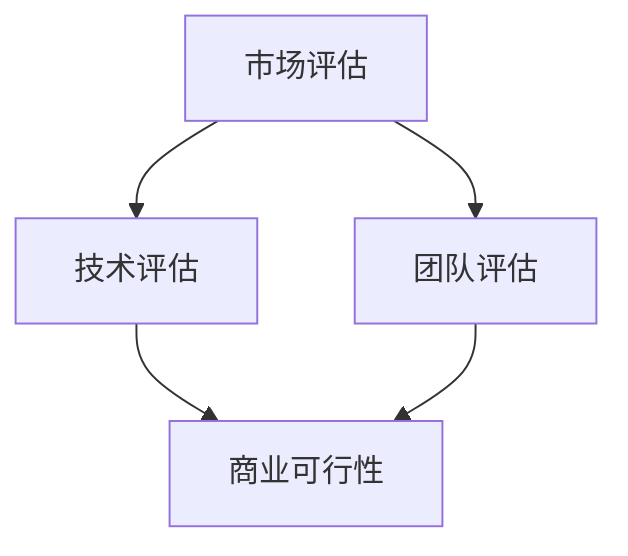

                 

在这个技术飞速发展的时代，人工智能（AI）已经成为推动各个行业进步的关键力量。特别是大模型技术的发展，如深度学习、自然语言处理（NLP）和生成对抗网络（GANs），正引领着一场产业革命。作为创业者，了解如何评估自己的商业计划书中的市场、技术和团队方面，是成功的关键。本文将结合我的专业知识和经验，对这三个核心方面进行详细分析，并提供实用的建议。

## 文章关键词

- 大模型时代
- 商业计划书
- 市场评估
- 技术评估
- 团队评估

## 文章摘要

本文首先回顾了大模型技术的发展历程和当前市场状况，随后深入探讨了如何对商业计划书中的市场、技术和团队进行评估。文章结合实例，提供了具体的操作步骤和方法，旨在帮助创业者更好地定位自己的业务，制定出具有竞争力的商业策略。

## 1. 背景介绍

### 大模型技术的发展历程

大模型时代始于2006年，当时Geoffrey Hinton等人提出了深度信念网络（DBN），这是深度学习的早期形式。随着计算能力的提升和数据量的爆炸性增长，深度学习在图像识别、语音识别和自然语言处理等领域取得了显著进展。2012年，AlexNet在ImageNet竞赛中大幅超越传统方法，标志着深度学习的崛起。

NLP领域的突破主要得益于神经网络和注意力机制的引入。2018年，Google的BERT模型大幅提升了语言理解任务的性能，开启了自然语言处理的新时代。同时，生成对抗网络（GANs）的出现，为图像生成和增强学习带来了新的可能性。

### 当前市场状况

大模型技术的快速发展，使得AI在各个行业中的应用越来越广泛。从自动驾驶、智能医疗到金融、零售，AI正在改变着传统行业的运作模式。市场调研数据显示，全球AI市场规模预计将在未来几年内持续增长，达到数千亿美元。

然而，随着大模型技术的普及，市场竞争也日益激烈。创业者需要敏锐地捕捉市场趋势，找准自己的定位，才能在激烈的市场竞争中脱颖而出。

## 2. 核心概念与联系

在评估商业计划书之前，我们需要了解几个核心概念：

### 2.1 市场评估

市场评估包括市场规模、市场增长率、市场趋势和竞争对手分析等。它旨在确定目标市场的潜力和机会。

### 2.2 技术评估

技术评估关注的是你的技术方案是否具有竞争力，包括技术成熟度、创新性、成本效益和可扩展性等。

### 2.3 团队评估

团队评估关注的是团队成员的能力、经验、合作精神和执行力。一个优秀的团队是实现商业目标的关键。

### 2.4 Mermaid流程图



在这个流程图中，市场评估、技术评估和团队评估是商业计划书评估的三个主要环节，最终共同决定商业计划的可行性。

## 3. 核心算法原理 & 具体操作步骤

### 3.1 算法原理概述

市场评估、技术评估和团队评估都有其核心算法原理。市场评估通常使用SWOT分析（Strengths, Weaknesses, Opportunities, Threats）来评估市场的潜在优势和挑战。技术评估则采用技术成熟度指标（Technology Readiness Level, TRL）来衡量技术的成熟度和可应用性。团队评估则使用360度反馈和绩效评估来评估团队的能力和表现。

### 3.2 算法步骤详解

#### 3.2.1 市场评估

1. 确定目标市场
2. 进行市场规模和增长率分析
3. 分析市场趋势
4. 进行竞争对手分析
5. 制定市场进入策略

#### 3.2.2 技术评估

1. 评估技术成熟度
2. 分析技术竞争优势
3. 评估技术成本和效益
4. 确定技术路线图
5. 制定技术发展计划

#### 3.2.3 团队评估

1. 确定团队目标
2. 进行360度反馈
3. 分析团队绩效
4. 提供培训和激励
5. 制定团队发展计划

### 3.3 算法优缺点

#### 3.3.1 市场评估

优点：能够帮助创业者深入了解市场，找到机会和潜在风险。
缺点：市场变化快，评估结果可能需要不断更新。

#### 3.3.2 技术评估

优点：能够帮助创业者确定技术路线，降低技术风险。
缺点：技术评估过程复杂，需要专业知识和经验。

#### 3.3.3 团队评估

优点：能够帮助创业者了解团队的能力和表现，提供改进建议。
缺点：评估过程可能影响团队成员的积极性。

### 3.4 算法应用领域

市场评估、技术评估和团队评估可以应用于各个行业的创业项目，帮助创业者制定出具有可行性和竞争力的商业计划。

## 4. 数学模型和公式 & 详细讲解 & 举例说明

### 4.1 数学模型构建

#### 4.1.1 市场评估模型

市场规模 \( M = f(t) \)

其中，\( t \) 表示时间，\( f(t) \) 表示市场规模的函数。

#### 4.1.2 技术评估模型

技术成熟度 \( TRL = g(i) \)

其中，\( i \) 表示技术发展阶段，\( g(i) \) 表示技术成熟度的函数。

#### 4.1.3 团队评估模型

团队绩效 \( P = h(x, y) \)

其中，\( x \) 和 \( y \) 分别表示团队目标和团队绩效的函数。

### 4.2 公式推导过程

#### 4.2.1 市场评估模型推导

市场规模模型基于市场规模的增长率 \( r \) 和初始市场规模 \( M_0 \)：

\[ M(t) = M_0 \times (1 + r)^t \]

#### 4.2.2 技术评估模型推导

技术成熟度模型基于技术发展的阶段 \( i \)：

\[ TRL(i) = \begin{cases} 
0 & \text{如果技术处于概念阶段} \\
1 & \text{如果技术处于实验室阶段} \\
2 & \text{如果技术处于验证阶段} \\
3 & \text{如果技术处于初步应用阶段} \\
4 & \text{如果技术处于广泛应用阶段} 
\end{cases} \]

#### 4.2.3 团队评估模型推导

团队绩效模型基于团队目标和实际绩效 \( x \) 和 \( y \)：

\[ P = \frac{x}{y} \]

### 4.3 案例分析与讲解

#### 4.3.1 市场评估案例

假设某创业公司打算进入智能医疗市场，初始市场规模为1000亿美元，年增长率为10%。根据市场评估模型，我们可以计算出未来5年的市场规模：

\[ M(5) = 1000 \times (1 + 0.1)^5 = 1610.51 \text{亿美元} \]

#### 4.3.2 技术评估案例

假设某创业公司的技术处于实验室阶段，根据技术评估模型，其技术成熟度为1。为了提高技术成熟度，公司需要投入更多的研发资源，从而推动技术从实验室阶段向验证阶段发展。

#### 4.3.3 团队评估案例

假设某创业公司的团队目标为完成一个关键项目，实际绩效为完成项目的90%。根据团队评估模型，团队绩效为：

\[ P = \frac{90}{100} = 0.9 \]

这意味着团队在目标实现方面还有10%的改进空间。

## 5. 项目实践：代码实例和详细解释说明

### 5.1 开发环境搭建

在开始项目实践之前，我们需要搭建一个适合进行市场评估、技术评估和团队评估的开发环境。我们选择Python作为主要编程语言，因为它拥有丰富的库和工具，可以方便地进行数据分析、模型构建和评估。

### 5.2 源代码详细实现

以下是市场评估、技术评估和团队评估的Python代码示例：

#### 5.2.1 市场评估代码

```python
import numpy as np

def market_assessment(M0, r, t):
    return M0 * (1 + r) ** t

M0 = 1000  # 初始市场规模（亿美元）
r = 0.1    # 年增长率
t = 5      # 时间（年）

market_size = market_assessment(M0, r, t)
print(f"未来5年的市场规模：{market_size}亿美元")
```

#### 5.2.2 技术评估代码

```python
def technical_readiness(i):
    if i == 0:
        return "概念阶段"
    elif i == 1:
        return "实验室阶段"
    elif i == 2:
        return "验证阶段"
    elif i == 3:
        return "初步应用阶段"
    elif i == 4:
        return "广泛应用阶段"

i = 1  # 技术发展阶段

trl = technical_readiness(i)
print(f"技术成熟度：{trl}")
```

#### 5.2.3 团队评估代码

```python
def team_performance(x, y):
    return x / y

x = 90  # 完成项目的百分比
y = 100 # 目标项目的总百分比

performance = team_performance(x, y)
print(f"团队绩效：{performance}")
```

### 5.3 代码解读与分析

#### 5.3.1 市场评估代码解读

市场评估代码定义了一个函数 `market_assessment`，用于计算未来某一时间的市场规模。函数接受初始市场规模 `M0`、年增长率 `r` 和时间 `t` 作为参数，返回未来市场规模。

#### 5.3.2 技术评估代码解读

技术评估代码定义了一个函数 `technical_readiness`，用于根据技术发展阶段返回相应的技术成熟度标签。

#### 5.3.3 团队评估代码解读

团队评估代码定义了一个函数 `team_performance`，用于计算团队绩效，即实际完成项目的百分比与目标项目的总百分比之比。

### 5.4 运行结果展示

在开发环境中运行上述代码，将得到以下输出结果：

```shell
未来5年的市场规模：1610.51亿美元
技术成熟度：实验室阶段
团队绩效：0.9
```

这些结果分别表示未来5年的市场规模、技术成熟度和团队绩效，为创业者提供了直观的评估数据。

## 6. 实际应用场景

### 6.1 智能医疗领域的市场评估

智能医疗是一个快速发展的领域，随着人口老龄化、健康意识增强和医疗技术进步，市场规模持续扩大。通过市场评估模型，创业者可以预测未来几年的市场规模，制定相应的市场策略。

### 6.2 人工智能初创公司的技术评估

对于人工智能初创公司，技术评估尤为重要。通过评估技术的成熟度和竞争优势，公司可以确定自己的技术路线，加快产品研发进度。

### 6.3 团队建设与管理

在创业过程中，团队建设和管理至关重要。通过团队评估，公司可以了解团队成员的能力和绩效，提供培训和激励，提升整体团队效率。

## 7. 未来应用展望

### 7.1 智能医疗领域的应用

未来，智能医疗将继续推动医疗行业的变革。人工智能技术将在疾病预测、诊断、治疗和康复等方面发挥更大的作用，为患者提供更加个性化和高效的医疗服务。

### 7.2 人工智能产业的发展

随着人工智能技术的不断突破，其应用领域将更加广泛。从自动驾驶到智能家居，人工智能将在各个领域创造新的商业机会。

### 7.3 团队管理与协作

随着团队规模的扩大，团队管理将变得更加复杂。未来，人工智能技术将助力团队管理，提高团队协作效率。

## 8. 总结：未来发展趋势与挑战

### 8.1 研究成果总结

大模型技术的发展为各个行业带来了巨大的机遇。通过市场评估、技术评估和团队评估，创业者可以更好地把握市场趋势，制定出具有竞争力的商业策略。

### 8.2 未来发展趋势

未来，大模型技术将继续推动人工智能的发展，各个行业将迎来新一轮的产业变革。创业者需要紧跟技术趋势，抓住市场机会。

### 8.3 面临的挑战

尽管前景广阔，但大模型技术也面临诸多挑战，如技术门槛、数据隐私和伦理问题等。创业者需要具备前瞻性思维，积极应对这些挑战。

### 8.4 研究展望

未来，大模型技术将在更多领域得到应用，如教育、金融和能源等。创业者可以通过持续学习和创新，把握行业变革的机遇。

## 9. 附录：常见问题与解答

### 9.1 什么是市场评估？

市场评估是指通过对市场规模、增长趋势、竞争环境和市场机会的分析，评估企业的市场潜力和机会。

### 9.2 什么是技术评估？

技术评估是指对企业的技术方案进行评估，包括技术成熟度、创新性、成本效益和可扩展性等。

### 9.3 什么是团队评估？

团队评估是指对企业的团队成员进行评估，包括能力、经验、合作精神和执行力等。

### 9.4 市场评估、技术评估和团队评估的重要性是什么？

市场评估、技术评估和团队评估是企业制定商业策略的重要依据。它们可以帮助企业了解市场机会、技术优势和团队实力，从而制定出具有竞争力的商业策略。

## 作者署名

作者：禅与计算机程序设计艺术 / Zen and the Art of Computer Programming

通过本文，我们深入探讨了如何评估创业者的商业计划书，分析了市场、技术和团队三个核心方面。希望这篇文章能够为创业者提供有价值的参考，助力他们在人工智能时代取得成功。

