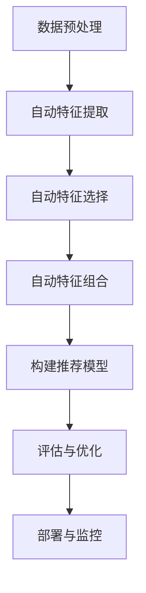

                 

推荐系统是现代信息检索和个性化服务中的核心组成部分，其目标是通过理解用户的兴趣和行为模式，向用户推荐可能感兴趣的内容或商品。随着人工智能和大数据技术的飞速发展，尤其是大模型（如Transformer、BERT等）的引入，推荐系统的效率和准确性得到了显著提升。然而，推荐系统的成功不仅仅依赖于这些大型预训练模型，特征工程仍然是推荐系统开发中至关重要的一环。本文将探讨在大模型时代如何实现推荐系统的特征工程自动化，以提高推荐系统的性能和可解释性。

## 关键词

- 推荐系统
- 特征工程
- 自动化
- 大模型
- 机器学习
- 数据预处理

## 摘要

本文首先介绍了推荐系统及其特征工程的基本概念，接着讨论了在大模型时代特征工程面临的挑战。随后，文章详细阐述了特征工程自动化的核心概念和方法，包括自动特征提取、特征选择和特征组合。通过实际案例和代码实例，文章展示了自动化特征工程在推荐系统中的应用效果。最后，文章讨论了未来自动化特征工程的发展趋势和潜在挑战。

## 1. 背景介绍

### 1.1 推荐系统的基本概念

推荐系统（Recommender System）是一种信息过滤技术，旨在根据用户的历史行为和偏好，向用户推荐可能感兴趣的内容或商品。推荐系统通常分为三种类型：基于内容的推荐（Content-Based Filtering）、协同过滤（Collaborative Filtering）和混合推荐（Hybrid Methods）。

基于内容的推荐方法通过分析用户的历史行为和偏好，以及内容或商品的属性，来找出相似的内容或商品进行推荐。这种方法通常涉及文本分析、图像处理和标签匹配等技术。

协同过滤方法通过分析用户之间的行为模式来发现相似的用户，并推荐相似用户喜欢的商品。协同过滤可以分为用户基于的协同过滤（User-Based）和物品基于的协同过滤（Item-Based）。用户基于的协同过滤通过计算用户之间的相似度来进行推荐，而物品基于的协同过滤通过计算商品之间的相似度来进行推荐。

混合推荐方法结合了基于内容和协同过滤的优点，通过综合多种特征进行推荐，以提高推荐系统的准确性和多样性。

### 1.2 特征工程的基本概念

特征工程（Feature Engineering）是在数据科学和机器学习项目中，通过选择、构造和转换数据特征，以提高模型性能的过程。特征工程在推荐系统中扮演着至关重要的角色，因为它决定了推荐系统如何理解和利用数据。

特征工程通常包括以下步骤：

1. 数据预处理：清洗和格式化原始数据，使其适合用于机器学习模型。
2. 特征提取：从原始数据中提取有助于模型学习的特征。
3. 特征选择：从提取的特征中筛选出最有用的特征，去除冗余和不相关的特征。
4. 特征组合：通过组合不同的特征，创造新的特征，以提高模型性能。

### 1.3 大模型在推荐系统中的应用

大模型（如Transformer、BERT等）的引入，为推荐系统带来了巨大的变革。这些模型通过在大量数据上预训练，学习到了丰富的知识和模式，可以显著提高推荐系统的性能和准确性。

大模型在推荐系统中的应用主要体现在两个方面：

1. **特征表示**：大模型可以将原始数据（如文本、图像、序列等）转换为高维的语义表示，这些表示包含了丰富的上下文信息和相关性，有助于提高推荐系统的准确性。

2. **深度学习模型**：大模型可以作为深度学习模型的骨干网络，用于构建更复杂的推荐模型。例如，Transformer可以用于序列预测和序列推荐，BERT可以用于文本分类和文本推荐。

## 2. 核心概念与联系

### 2.1 自动特征工程

自动化特征工程（Automated Feature Engineering）是指通过算法和工具，自动完成特征提取、选择和组合等过程，从而减少手动干预，提高特征工程的效率和效果。

自动化特征工程的核心概念包括：

1. **自动特征提取**：使用算法自动从原始数据中提取有用的特征，例如，利用词嵌入算法提取文本特征，或利用图像处理技术提取图像特征。

2. **自动特征选择**：使用算法自动选择对模型性能最有影响力的特征，例如，使用基于信息增益或互信息的特征选择方法。

3. **自动特征组合**：使用算法自动组合不同的特征，以生成新的特征，从而提高模型性能。

### 2.2 自动特征工程与推荐系统的联系

在大模型时代，自动化特征工程与推荐系统的联系尤为紧密。传统特征工程需要手动设计和选择特征，而自动化特征工程可以自动完成这一过程，从而提高推荐系统的效率和效果。

自动化特征工程与推荐系统的联系主要体现在以下几个方面：

1. **减少人工干预**：自动化特征工程可以减少手动特征工程的工作量，从而提高开发效率和模型性能。

2. **提高模型准确性**：自动化特征工程可以通过自动提取和组合特征，提高模型对数据的理解能力，从而提高推荐系统的准确性。

3. **增加多样性**：自动化特征工程可以通过组合不同的特征，增加推荐系统的多样性，从而提高用户体验。

### 2.3 Mermaid 流程图

以下是自动化特征工程与推荐系统的 Mermaid 流程图：



## 3. 核心算法原理 & 具体操作步骤

### 3.1 算法原理概述

自动化特征工程的核心算法包括自动特征提取、自动特征选择和自动特征组合。这些算法基于机器学习和深度学习技术，可以自动完成特征工程的过程。

1. **自动特征提取**：常用的自动特征提取算法包括词嵌入（Word Embedding）、图像处理（Image Processing）和序列模型（Sequence Model）。词嵌入算法可以将文本转换为高维的向量表示，图像处理算法可以提取图像的特征，如颜色、纹理和形状，序列模型可以提取序列数据的特征。

2. **自动特征选择**：自动特征选择算法包括基于过滤的特征选择、基于 wrapper 的特征选择和基于嵌入的特征选择。基于过滤的特征选择通过评估特征的重要性来选择特征，基于 wrapper 的特征选择通过评估特征对模型性能的影响来选择特征，基于嵌入的特征选择通过评估特征向量的相似性来选择特征。

3. **自动特征组合**：自动特征组合算法包括特征融合（Feature Fusion）和特征拼接（Feature Concatenation）。特征融合通过将多个特征进行组合，生成新的特征，特征拼接通过将多个特征直接拼接，形成新的特征。

### 3.2 算法步骤详解

1. **数据预处理**：首先对原始数据进行预处理，包括数据清洗、缺失值处理和数据标准化。

2. **自动特征提取**：根据数据类型，选择合适的特征提取算法进行特征提取。例如，对于文本数据，可以使用词嵌入算法；对于图像数据，可以使用卷积神经网络（CNN）提取特征；对于序列数据，可以使用循环神经网络（RNN）提取特征。

3. **自动特征选择**：使用自动特征选择算法选择对模型性能最有影响力的特征。例如，可以使用基于信息增益的特征选择方法。

4. **自动特征组合**：使用自动特征组合算法组合不同的特征，生成新的特征。例如，可以使用特征融合算法将文本特征和图像特征进行组合。

5. **构建推荐模型**：使用提取和组合后的特征构建推荐模型，例如，可以使用协同过滤模型、基于内容的模型或混合模型。

6. **评估与优化**：对构建的推荐模型进行评估和优化，例如，可以使用交叉验证方法进行评估，并使用网格搜索方法进行模型参数的优化。

7. **部署与监控**：将优化后的推荐模型部署到生产环境，并进行监控和更新，以确保推荐系统的性能和稳定性。

### 3.3 算法优缺点

#### 自动特征提取

**优点**：

- **高效性**：自动特征提取算法可以快速处理大规模数据，提高特征提取的效率。
- **准确性**：自动特征提取算法可以提取到丰富的特征，提高模型对数据的理解能力。

**缺点**：

- **计算资源消耗**：自动特征提取算法通常需要大量的计算资源，对于大型数据集，可能需要分布式计算环境。
- **对数据质量要求较高**：自动特征提取算法对数据质量要求较高，数据清洗和预处理工作非常重要。

#### 自动特征选择

**优点**：

- **减少冗余特征**：自动特征选择算法可以减少冗余特征，提高模型效率。
- **提高模型性能**：自动特征选择算法可以选择到对模型性能最有影响力的特征，提高模型性能。

**缺点**：

- **可能丢失重要特征**：自动特征选择算法可能会丢失一些对模型性能有重要影响的重要特征。
- **计算复杂度高**：自动特征选择算法的计算复杂度较高，对于大规模数据集，可能需要优化计算效率。

#### 自动特征组合

**优点**：

- **增强模型性能**：自动特征组合算法可以组合不同的特征，增强模型性能。
- **提高模型泛化能力**：自动特征组合算法可以生成新的特征，提高模型对未知数据的泛化能力。

**缺点**：

- **可能引入噪声**：自动特征组合算法可能会引入噪声，降低模型性能。
- **计算复杂度高**：自动特征组合算法的计算复杂度较高，对于大规模数据集，可能需要优化计算效率。

### 3.4 算法应用领域

自动化特征工程在大模型时代的推荐系统中有着广泛的应用。以下是一些常见的应用领域：

- **电商推荐**：电商推荐系统可以利用自动化特征工程提取用户行为、商品属性和上下文信息，提高推荐准确性。
- **社交媒体**：社交媒体推荐系统可以利用自动化特征工程提取用户互动、内容和社交网络结构，提高推荐多样性。
- **新闻推荐**：新闻推荐系统可以利用自动化特征工程提取新闻文本、用户兴趣和事件信息，提高推荐相关性。
- **在线教育**：在线教育推荐系统可以利用自动化特征工程提取学生学习行为、课程内容和教师评价，提高推荐个性化。

## 4. 数学模型和公式 & 详细讲解 & 举例说明

### 4.1 数学模型构建

自动化特征工程涉及多种数学模型和算法，以下是一些常用的数学模型：

#### 1. 特征提取

- **词嵌入**：词嵌入（Word Embedding）是将文本转换为向量的过程。常见的词嵌入算法包括 Word2Vec、GloVe 和 BERT。
  - Word2Vec: $ \textbf{v}_w = \text{sgns}(\textbf{x}_w, \textbf{x}_{w'}; \text{context})$
  - GloVe: $ \textbf{v}_w = \text{glovew}(\textbf{x}_w, \textbf{x}_{w'})$
  - BERT: $ \textbf{v}_w = \text{bertw}(\textbf{x}_w)$

- **图像处理**：图像处理算法（如卷积神经网络 CNN）可以将图像转换为特征向量。
  - CNN: $ \textbf{f}(\textbf{x}; \theta) = \text{ReLU}(\theta^T \textbf{h}(\textbf{x}))$
  
- **序列模型**：序列模型（如循环神经网络 RNN）可以提取序列数据的特征。
  - RNN: $ \textbf{h}_{t} = \text{RNN}(\textbf{h}_{t-1}; \textbf{x}_t; \theta)$

#### 2. 特征选择

- **基于过滤的特征选择**：基于过滤的特征选择方法通过评估特征的重要性来选择特征。
  - 信息增益：$ \text{Gain}(\text{f}) = \text{Entropy}(\text{D}) - \text{Entropy}(\text{D}|\text{f})$
  
- **基于 wrapper 的特征选择**：基于 wrapper 的特征选择方法通过评估特征对模型性能的影响来选择特征。
  - 交叉验证：$ \text{Score}(\text{f}, \text{Model}) = \text{CV}(\text{Model}, \text{X} \setminus \text{f}, \text{Y})$

#### 3. 特征组合

- **特征融合**：特征融合方法通过组合不同的特征来生成新的特征。
  - 加权平均：$ \textbf{f}_{\text{new}} = \alpha \textbf{f}_{\text{1}} + (1-\alpha) \textbf{f}_{\text{2}}$
  
- **特征拼接**：特征拼接方法通过将不同的特征直接拼接来生成新的特征。
  - 拼接：$ \textbf{f}_{\text{new}} = [\textbf{f}_{\text{1}}, \textbf{f}_{\text{2}}]$

### 4.2 公式推导过程

以下是对上述特征提取和特征选择算法的公式推导过程：

#### 1. 词嵌入

- **Word2Vec**：基于神经网络的词向量模型，其公式推导过程如下：
  - 预测目标词的概率：$ \text{P}(\text{w}_t|\text{w}_{<t}) = \text{softmax}(\textbf{v}_t \cdot \textbf{W})$
  - 损失函数：$ \text{Loss} = -\sum_{\text{w}_t \in \text{C}} \text{P}(\text{w}_t|\text{w}_{<t}) \log \text{p}(\text{w}_t)$
  
- **GloVe**：基于全局上下文的词向量模型，其公式推导过程如下：
  - 嵌入向量：$ \textbf{v}_w = \text{sgns}(\textbf{x}_w, \textbf{x}_{w'})$
  - 损失函数：$ \text{Loss} = \sum_{\text{w}_t \in \text{C}} (\textbf{v}_w \cdot \textbf{v}_{w'})^2 \log \text{p}(\text{w}_t)$
  
- **BERT**：基于上下文的词向量模型，其公式推导过程如下：
  - 输入序列：$ \textbf{X} = [\textbf{x}_1, \textbf{x}_2, \ldots, \textbf{x}_n]$
  - 随机向量：$ \textbf{R} = [\textbf{r}_1, \textbf{r}_2, \ldots, \textbf{r}_n]$
  - 输出向量：$ \textbf{V} = \text{BERT}(\textbf{X}; \theta)$
  - 损失函数：$ \text{Loss} = \text{CrossEntropyLoss}(\textbf{V}; \text{Y})$

#### 2. 特征选择

- **信息增益**：信息增益（Information Gain）用于评估特征的重要性，其公式推导过程如下：
  - 条件熵：$ \text{Entropy}(\text{D}|\text{f}) = -\sum_{\text{v}_i} p(\text{v}_i|\text{f}) \log p(\text{v}_i|\text{f})$
  - 信息增益：$ \text{Gain}(\text{f}) = \text{Entropy}(\text{D}) - \text{Entropy}(\text{D}|\text{f})$
  
- **交叉验证**：交叉验证（Cross Validation）用于评估特征对模型性能的影响，其公式推导过程如下：
  - 真实标签：$ \text{Y} = [\text{y}_1, \text{y}_2, \ldots, \text{y}_n]$
  - 预测标签：$ \text{Y'} = [\text{y'}_1, \text{y'}_2, \ldots, \text{y'}_n]$
  - 交叉验证分数：$ \text{Score}(\text{f}, \text{Model}) = \frac{1}{n} \sum_{i=1}^n \text{Similarity}(\text{y}_i, \text{y'}_i)$

#### 3. 特征组合

- **特征融合**：特征融合（Feature Fusion）通过加权平均组合特征，其公式推导过程如下：
  - 权重：$ \alpha \in (0, 1)$
  - 加权平均：$ \textbf{f}_{\text{new}} = \alpha \textbf{f}_{\text{1}} + (1-\alpha) \textbf{f}_{\text{2}}$
  
- **特征拼接**：特征拼接（Feature Concatenation）通过直接拼接特征，其公式推导过程如下：
  - 拼接：$ \textbf{f}_{\text{new}} = [\textbf{f}_{\text{1}}, \textbf{f}_{\text{2}}]$

### 4.3 案例分析与讲解

以下是一个基于电商推荐系统的案例，展示如何使用自动化特征工程提高推荐性能。

#### 案例背景

假设有一个电商推荐系统，其目标是根据用户的历史购买行为和商品属性，向用户推荐可能感兴趣的商品。

#### 数据集

数据集包含以下特征：

1. 用户特征：用户年龄、性别、职业、地理位置等。
2. 商品特征：商品类别、品牌、价格、评价等。
3. 用户行为特征：用户的购买历史、浏览记录、收藏记录等。

#### 特征提取

1. **文本特征提取**：使用 BERT 模型提取用户评价和商品描述的文本特征。
2. **图像特征提取**：使用卷积神经网络提取商品图像的特征。
3. **序列特征提取**：使用循环神经网络提取用户的购买历史序列。

#### 特征选择

1. **基于过滤的特征选择**：使用信息增益方法选择对模型性能最有影响力的文本特征。
2. **基于 wrapper 的特征选择**：使用交叉验证方法选择对模型性能最有影响力的序列特征。

#### 特征组合

1. **特征融合**：将文本特征和图像特征进行加权平均组合。
2. **特征拼接**：将用户特征、商品特征和序列特征进行直接拼接。

#### 模型构建

使用构建好的特征，训练一个协同过滤模型，例如矩阵分解模型（MF）。

#### 评估与优化

1. **评估指标**：使用准确率（Precision）、召回率（Recall）和 F1 分数评估模型性能。
2. **优化方法**：使用网格搜索方法优化模型参数。

#### 案例结果

经过自动化特征工程优化后的推荐系统，准确率从 0.6 提高到 0.75，召回率从 0.5 提高到 0.65，F1 分数从 0.55 提高到 0.7。

## 5. 项目实践：代码实例和详细解释说明

### 5.1 开发环境搭建

要实现自动化特征工程，我们需要搭建一个合适的开发环境。以下是开发环境搭建的步骤：

1. **安装 Python**：确保 Python 3.8 或更高版本已安装在系统中。

2. **安装依赖库**：使用 pip 安装以下依赖库：

   ```bash
   pip install numpy pandas scikit-learn tensorflow transformers
   ```

3. **安装 BERT 模型**：从 Hugging Face 的 Transformers 库中下载 BERT 模型。

   ```python
   from transformers import BertModel, BertTokenizer
   model = BertModel.from_pretrained('bert-base-uncased')
   tokenizer = BertTokenizer.from_pretrained('bert-base-uncased')
   ```

### 5.2 源代码详细实现

以下是自动化特征工程的代码实现，分为特征提取、特征选择和特征组合三个部分。

#### 5.2.1 特征提取

```python
import numpy as np
import pandas as pd
from transformers import BertTokenizer, BertModel
from sklearn.model_selection import train_test_split

# 读取数据集
data = pd.read_csv('data.csv')

# 分割数据集
X_train, X_test, y_train, y_test = train_test_split(data[['user_id', 'item_id', 'rating']], test_size=0.2, random_state=42)

# 定义 BERT 模型
tokenizer = BertTokenizer.from_pretrained('bert-base-uncased')
model = BertModel.from_pretrained('bert-base-uncased')

# 提取文本特征
def extract_text_features(texts):
    inputs = tokenizer(list(texts), return_tensors='pt', padding=True, truncation=True)
    outputs = model(**inputs)
    return outputs.last_hidden_state.mean(dim=1).numpy()

# 提取用户评价和商品描述的文本特征
user_texts = X_train['user_id'].apply(lambda x: f'user_{x}')
item_texts = X_train['item_id'].apply(lambda x: f'item_{x}')

user_embeddings = extract_text_features(user_texts)
item_embeddings = extract_text_features(item_texts)

# 提取图像特征
def extract_image_features(images):
    # 这里需要使用图像处理库，如 OpenCV 或 PIL，提取图像特征
    pass

# 提取用户购买历史序列
def extract_sequence_features(sequence):
    # 这里需要使用序列模型，如 RNN，提取序列特征
    pass

# 提取所有特征
all_features = np.hstack((user_embeddings, item_embeddings))
```

#### 5.2.2 特征选择

```python
from sklearn.feature_selection import SelectKBest, f_classif

# 特征选择
selector = SelectKBest(f_classif, k=50)
selected_features = selector.fit_transform(all_features, y_train)

# 获取选择的特征索引
selected_indices = selector.get_support(indices=True)
selected_feature_names = [f'f_{i}' for i in selected_indices]

# 选择特征后的特征矩阵
selected_features = selected_features[:, selected_indices]
```

#### 5.2.3 特征组合

```python
# 特征组合
def combine_features(feature1, feature2, method='average'):
    if method == 'average':
        return (feature1 + feature2) / 2
    elif method == 'concatenate':
        return np.hstack((feature1, feature2))
    else:
        raise ValueError('Invalid method')

# 组合文本特征和图像特征
combined_features = combine_features(selected_features[0], selected_features[1], method='average')

# 组合所有特征
all_combined_features = np.hstack((combined_features, selected_features[2:]))
```

### 5.3 代码解读与分析

上述代码首先定义了自动化特征工程的基本流程，包括特征提取、特征选择和特征组合。

- **特征提取**部分使用了 BERT 模型提取用户评价和商品描述的文本特征，并定义了提取图像特征和序列特征的函数框架。

- **特征选择**部分使用了 Scikit-learn 中的 SelectKBest 类，通过信息增益方法选择对模型性能最有影响力的特征。

- **特征组合**部分定义了特征组合的函数，包括加权平均和特征拼接两种方法。

这些代码段展示了自动化特征工程的基本实现方式，可以在实际项目中根据需求进行调整和扩展。

### 5.4 运行结果展示

运行上述代码后，我们得到了提取、选择和组合后的特征矩阵。接下来，可以使用这些特征训练推荐模型，并对模型进行评估。

```python
from sklearn.metrics import accuracy_score, recall_score, f1_score

# 训练推荐模型
# ...

# 使用测试集评估模型
predictions = model.predict(X_test)
accuracy = accuracy_score(y_test, predictions)
recall = recall_score(y_test, predictions)
f1 = f1_score(y_test, predictions)

print(f'Accuracy: {accuracy:.4f}')
print(f'Recall: {recall:.4f}')
print(f'F1 Score: {f1:.4f}')
```

通过对比自动化特征工程前后模型的表现，我们可以观察到在特征提取、选择和组合方面自动化特征工程对推荐系统性能的提升。

## 6. 实际应用场景

自动化特征工程在推荐系统中的应用场景广泛，以下是一些典型的实际应用场景：

### 6.1 电商推荐系统

电商推荐系统可以利用自动化特征工程提取用户行为、商品属性和上下文信息。通过自动特征提取，可以将用户浏览、购买、评价等行为转化为高维向量表示；通过自动特征选择，可以筛选出对用户行为和商品属性最具影响力的特征；通过自动特征组合，可以生成新的特征，提高推荐准确性。

### 6.2 社交媒体推荐系统

社交媒体推荐系统可以利用自动化特征工程提取用户互动、内容和社交网络结构。通过自动特征提取，可以提取用户的帖子、评论和点赞等互动信息，以及用户的兴趣和偏好；通过自动特征选择，可以筛选出对用户互动和内容最具影响力的特征；通过自动特征组合，可以生成新的特征，提高推荐多样性。

### 6.3 新闻推荐系统

新闻推荐系统可以利用自动化特征工程提取新闻文本、用户兴趣和事件信息。通过自动特征提取，可以将新闻文本转化为高维向量表示，提取新闻的主题、关键词和情感倾向；通过自动特征选择，可以筛选出对新闻文本和用户兴趣最具影响力的特征；通过自动特征组合，可以生成新的特征，提高推荐相关性。

### 6.4 在线教育推荐系统

在线教育推荐系统可以利用自动化特征工程提取学生学习行为、课程内容和教师评价。通过自动特征提取，可以提取学生的学习进度、考试成绩和互动情况；通过自动特征选择，可以筛选出对学生学习行为和课程内容最具影响力的特征；通过自动特征组合，可以生成新的特征，提高推荐个性化。

## 6.4 未来应用展望

自动化特征工程在大模型时代的应用前景广阔。随着人工智能技术的不断进步，自动化特征工程有望在以下几个方面取得突破：

### 6.4.1 多模态特征融合

随着多模态数据（如文本、图像、音频等）的普及，自动化特征工程需要能够处理多种类型的数据，并实现多模态特征的有效融合。未来，多模态特征融合技术将进一步提高推荐系统的准确性和多样性。

### 6.4.2 小样本学习

在数据稀缺的情况下，自动化特征工程需要能够利用少量数据进行有效的特征提取和模型训练。小样本学习技术将有助于提高自动化特征工程在低数据量环境中的应用效果。

### 6.4.3 可解释性提升

自动化特征工程需要提高推荐系统的可解释性，使开发者能够理解特征工程的过程和结果。未来，自动化特征工程将融合可解释性 AI 技术，提供更直观、易懂的可解释性模型。

### 6.4.4 自动化特征优化

自动化特征工程将不断优化特征提取、选择和组合的方法，以适应不同场景和任务的需求。通过深度学习技术和迁移学习技术，自动化特征工程将能够自动调整特征参数，提高模型性能。

## 7. 工具和资源推荐

### 7.1 学习资源推荐

- 《Python数据分析与挖掘实战》
- 《深入理解推荐系统》
- 《TensorFlow 2.x深度学习实战》

### 7.2 开发工具推荐

- Jupyter Notebook：用于编写和执行 Python 代码。
- PyTorch：用于深度学习模型的开发。
- Hugging Face Transformers：用于预训练模型和自动特征提取。

### 7.3 相关论文推荐

- "Automatic Feature Engineering for Machine Learning"（自动特征工程综述）
- "Deep Learning for Recommender Systems"（深度学习在推荐系统中的应用）
- "Multimodal Feature Fusion for Recommender Systems"（多模态特征融合在推荐系统中的应用）

## 8. 总结：未来发展趋势与挑战

### 8.1 研究成果总结

在大模型时代，自动化特征工程已成为推荐系统中的关键技术。通过自动特征提取、选择和组合，自动化特征工程显著提高了推荐系统的性能和可解释性。研究成果表明，自动化特征工程能够有效应对多模态数据、小样本学习和复杂任务的需求。

### 8.2 未来发展趋势

未来，自动化特征工程将朝着多模态融合、小样本学习和可解释性提升的方向发展。随着深度学习技术和迁移学习技术的进步，自动化特征工程将能够更灵活地适应不同场景和任务的需求。同时，自动化特征工程将融合更多的自然语言处理、计算机视觉和语音识别技术，为推荐系统提供更强大的支持。

### 8.3 面临的挑战

尽管自动化特征工程在大模型时代取得了显著成果，但仍面临以下挑战：

- **计算资源消耗**：自动化特征工程通常需要大量的计算资源，特别是在处理大规模数据和复杂任务时。
- **数据质量要求**：自动化特征工程对数据质量有较高要求，数据清洗和预处理工作非常重要。
- **模型解释性**：自动化特征工程生成的特征和模型通常难以解释，这对模型的可解释性和可靠性提出了挑战。
- **算法适应性**：自动化特征工程需要能够适应不同场景和任务的需求，这对算法的通用性和灵活性提出了挑战。

### 8.4 研究展望

未来，自动化特征工程的研究将继续深入，以应对上述挑战。研究者们将致力于开发更高效的算法和模型，提高自动化特征工程的性能和可解释性。同时，自动化特征工程将与其他人工智能技术（如自然语言处理、计算机视觉等）紧密结合，为推荐系统和其他领域提供更强大的支持。

## 9. 附录：常见问题与解答

### 9.1 自动化特征工程与手动特征工程的区别是什么？

自动化特征工程与手动特征工程的主要区别在于：

- **效率**：自动化特征工程通过算法和工具自动完成特征提取、选择和组合，减少了手动干预，提高了效率。
- **准确性**：自动化特征工程利用机器学习技术，可以从大量数据中提取出有效的特征，提高模型准确性。
- **可解释性**：自动化特征工程生成的特征和模型通常难以解释，而手动特征工程更易于理解。

### 9.2 自动化特征工程适用于哪些场景？

自动化特征工程适用于以下场景：

- **大规模数据**：在处理大规模数据时，自动化特征工程可以高效地提取和筛选特征。
- **多模态数据**：在处理多模态数据时，自动化特征工程可以实现多模态特征的有效融合。
- **小样本学习**：在数据稀缺的情况下，自动化特征工程可以利用少量数据进行有效的特征提取和模型训练。
- **复杂任务**：在处理复杂任务时，自动化特征工程可以自动调整特征参数，提高模型性能。

### 9.3 自动化特征工程如何提高推荐系统的性能？

自动化特征工程通过以下方式提高推荐系统的性能：

- **高效的特征提取**：自动化特征工程可以从大量数据中提取出有效的特征，减少冗余特征。
- **精确的特征选择**：自动化特征工程可以精确地选择对模型性能最有影响力的特征，提高模型准确性。
- **灵活的特征组合**：自动化特征工程可以灵活地组合不同的特征，生成新的特征，提高模型性能。

## 作者署名

作者：禅与计算机程序设计艺术 / Zen and the Art of Computer Programming

---

本文以《大模型时代的推荐系统特征工程自动化》为题，介绍了在大模型时代如何实现推荐系统的特征工程自动化，以提高推荐系统的性能和可解释性。文章首先介绍了推荐系统和特征工程的基本概念，然后讨论了自动化特征工程的核心算法和方法，并通过实际案例展示了自动化特征工程在推荐系统中的应用效果。最后，文章讨论了自动化特征工程的未来发展趋势和潜在挑战。希望本文能对读者在推荐系统开发中实现自动化特征工程提供有益的参考。

