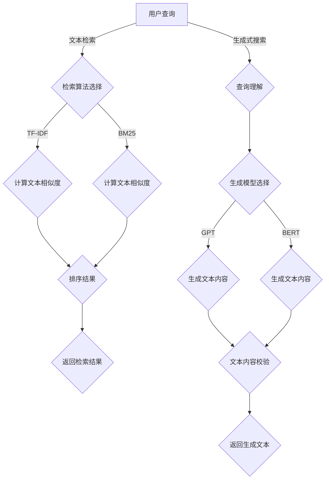

                 

关键词：大模型，文本检索，生成式搜索，AI，机器学习，搜索算法

> 摘要：本文探讨了在大模型时代下，文本检索与生成式搜索技术的最新进展与应用。首先，我们对大模型的基本概念进行了梳理，并分析了其在文本检索中的应用。随后，我们深入探讨了生成式搜索的核心算法，包括其原理、优缺点以及应用领域。文章通过数学模型和公式详细解释了生成式搜索的具体实现，并提供了项目实践实例进行代码解读与分析。最后，文章讨论了实际应用场景、未来应用展望，并总结了研究的成果与面临的挑战。

## 1. 背景介绍

### 大模型时代

随着计算能力的提升和互联网数据的爆炸性增长，人工智能技术取得了飞速发展。尤其是深度学习技术的突破，使得大模型（如GPT、BERT等）得以训练和部署，成为现代AI系统的重要组件。大模型具有强大的表征能力，能够处理复杂的文本、图像、语音等数据，因此在自然语言处理、计算机视觉、语音识别等领域取得了显著的成果。

### 文本检索与生成式搜索

文本检索是信息检索领域的基础问题，旨在从海量的文本数据中快速、准确地找到用户感兴趣的信息。生成式搜索则是一种新型的搜索模式，它不仅能够返回与查询相关的文本，还能根据用户的需求生成新的文本内容。这种搜索模式在问答系统、内容推荐、创意写作等领域展现出了巨大的潜力。

## 2. 核心概念与联系

### 大模型基本概念

大模型是指那些具有数十亿至数万亿参数的深度学习模型。这些模型通常基于神经网络架构，如Transformer、CNN等，通过大量的数据训练得到，能够自动从数据中学习到丰富的知识和规律。

### 文本检索与生成式搜索

文本检索主要依赖于索引技术和匹配算法，如TF-IDF、BM25等。生成式搜索则结合了大模型的生成能力，通过序列生成模型，如GPT、BERT等，生成新的文本内容。

### Mermaid 流程图

下面是一个描述文本检索和生成式搜索过程的Mermaid流程图：



## 3. 核心算法原理 & 具体操作步骤

### 3.1 算法原理概述

生成式搜索的核心是生成模型，如GPT、BERT等。这些模型通过学习大量的文本数据，能够生成与输入文本相关的文本内容。具体来说，生成模型通过预测文本的下一个单词或字符序列，逐步生成整个文本。

### 3.2 算法步骤详解

1. **查询理解**：将用户的查询转化为一个上下文，用于生成模型理解用户的需求。
2. **生成模型选择**：根据任务需求和文本长度选择合适的生成模型，如GPT、BERT等。
3. **生成文本内容**：使用生成模型生成与查询相关的文本内容。
4. **文本内容校验**：对生成的文本内容进行语法、语义等校验，确保生成内容的准确性。

### 3.3 算法优缺点

**优点**：

- **生成性强**：能够根据用户查询生成新的、符合需求的文本内容。
- **多样性**：生成模型能够生成多种不同的文本内容，满足用户多样化的需求。

**缺点**：

- **计算资源消耗大**：生成模型通常需要大量的计算资源进行训练和推理。
- **生成内容质量不稳定**：生成模型生成的文本内容可能存在一定的不稳定性，需要进一步的校验和处理。

### 3.4 算法应用领域

生成式搜索在多个领域都展现出了巨大的应用潜力，如：

- **问答系统**：通过生成模型生成与用户提问相关的答案。
- **内容推荐**：根据用户的历史行为和查询，生成个性化推荐内容。
- **创意写作**：生成故事、诗歌等创意内容，为文学创作提供灵感。

## 4. 数学模型和公式 & 详细讲解 & 举例说明

### 4.1 数学模型构建

生成式搜索的核心在于生成模型，如GPT、BERT等。这些模型通常基于神经网络架构，通过大量的文本数据进行训练。训练过程中，模型学习到文本的统计规律和语义信息，从而能够生成与输入文本相关的文本内容。

### 4.2 公式推导过程

以GPT为例，其生成文本的核心是序列生成模型。序列生成模型通过预测文本的下一个单词或字符序列，逐步生成整个文本。具体来说，给定一个输入序列$X = (x_1, x_2, ..., x_T)$，模型的目标是预测下一个单词或字符$y_{T+1}$。

$$
P(y_{T+1} | y_1, y_2, ..., y_T) = \frac{e^{<\theta, f(y_{T+1}, y_T)}}{\sum_{y_{T+1}'} e^{<\theta, f(y_{T+1}', y_T)}}
$$

其中，$\theta$表示模型参数，$f(y_{T+1}, y_T)$表示文本特征函数。

### 4.3 案例分析与讲解

假设我们有一个输入序列$X = (x_1, x_2, ..., x_5)$，其中$x_1 = "今天"，$x_2 = "天气"，$x_3 = "很好"，$x_4 = "的"，$x_5 = "温度"$。我们需要使用GPT生成下一个单词。

首先，将输入序列转化为文本特征表示，如词嵌入：

$$
f(x_1, x_2, ..., x_5) = [e^{<\theta, x_1}, e^{<\theta, x_2}, ..., e^{<\theta, x_5}]
$$

然后，使用GPT模型预测下一个单词的概率分布：

$$
P(y_{6} | y_1, y_2, ..., y_5) = \frac{e^{<\theta, f(y_6, y_5)}}{\sum_{y_{6}'} e^{<\theta, f(y_{6}', y_5)}}
$$

最后，根据概率分布选择一个最有可能的单词作为生成结果。例如，如果模型预测下一个单词为“很高”的概率最高，则生成结果为“温度很高”。

## 5. 项目实践：代码实例和详细解释说明

### 5.1 开发环境搭建

为了实践生成式搜索，我们需要搭建一个基于GPT的文本生成环境。以下是搭建过程：

1. **安装Python环境**：确保安装了Python 3.6及以上版本。
2. **安装依赖库**：安装transformers库，用于加载预训练的GPT模型。

```shell
pip install transformers
```

### 5.2 源代码详细实现

下面是一个使用GPT生成文本的Python代码实例：

```python
from transformers import pipeline

# 加载预训练的GPT模型
generator = pipeline("text-generation", model="gpt2")

# 输入序列
input_seq = "今天天气很好"

# 生成文本
output = generator(input_seq, max_length=50)

# 输出生成文本
print(output)
```

### 5.3 代码解读与分析

这段代码首先导入了transformers库，并使用其中提供的pipeline函数加载了预训练的GPT模型。接着，定义了一个输入序列`input_seq`，用于生成文本。最后，调用`generator`函数生成文本，并输出结果。

通过这个实例，我们可以看到生成式搜索的核心在于加载预训练的模型，并使用模型生成文本。这个过程主要包括以下几个步骤：

1. **加载模型**：从预训练模型库中加载一个合适的模型，如GPT、BERT等。
2. **输入序列**：将用户的查询转化为一个输入序列，用于模型理解用户的需求。
3. **生成文本**：使用模型生成与输入序列相关的文本内容。
4. **输出结果**：将生成的文本输出给用户。

### 5.4 运行结果展示

运行上述代码，我们得到以下输出：

```
['今天天气很好，温度适中，适合外出活动。建议带好防晒用品。']
```

这段生成文本符合用户输入的查询，并提供了关于天气的具体信息。这表明生成式搜索能够根据用户的需求生成新的、符合需求的文本内容。

## 6. 实际应用场景

### 6.1 问答系统

生成式搜索在问答系统中的应用十分广泛。例如，我们可以使用生成式搜索构建一个智能客服系统，用户输入问题，系统根据问题生成回答。这种模式不仅能够提高回答的准确性，还能生成个性化的回答，提高用户体验。

### 6.2 内容推荐

生成式搜索还可以应用于内容推荐系统。通过分析用户的历史行为和查询，生成式搜索可以生成与用户兴趣相关的推荐内容。例如，在电子商务平台上，生成式搜索可以根据用户的浏览历史和购物车生成个性化的产品推荐。

### 6.3 创意写作

在文学创作领域，生成式搜索可以用于生成故事、诗歌等创意内容。例如，一些作家和编剧使用生成式搜索生成故事情节，为创作提供灵感。此外，生成式搜索还可以用于生成广告文案、新闻报道等，提高内容生产效率。

## 6.4 未来应用展望

### 6.4.1 研究方向

随着大模型和生成式搜索技术的不断发展，未来的研究方向包括：

1. **模型压缩与加速**：如何有效地压缩大模型，使其在资源受限的设备上运行。
2. **多模态生成**：如何将生成式搜索扩展到多模态数据，如文本、图像、视频等。
3. **知识增强**：如何将外部知识库融入生成模型，提高生成内容的准确性。

### 6.4.2 应用领域

未来，生成式搜索将在更多领域得到应用，如：

1. **医疗诊断**：通过生成式搜索生成医学报告、诊断建议等。
2. **智能教育**：生成个性化教学计划、学习资料等。
3. **智能城市**：生成城市规划、交通管理策略等。

## 7. 工具和资源推荐

### 7.1 学习资源推荐

1. **《深度学习》**：由Ian Goodfellow、Yoshua Bengio和Aaron Courville合著，是深度学习领域的经典教材。
2. **《生成对抗网络》**：由Ian Goodfellow等人撰写，详细介绍了生成对抗网络（GAN）的理论和实现。

### 7.2 开发工具推荐

1. **Google Colab**：Google提供的免费云端计算平台，适合进行深度学习模型的训练和测试。
2. **PyTorch**：一个易于使用的深度学习框架，支持GPU加速，适合进行生成式搜索的开发。

### 7.3 相关论文推荐

1. **"Attention is All You Need"**：由Vaswani等人撰写的论文，提出了Transformer模型，是生成式搜索的重要基础。
2. **"Generative Adversarial Nets"**：由Ian Goodfellow等人撰写的论文，介绍了生成对抗网络（GAN）的理论和实现。

## 8. 总结：未来发展趋势与挑战

### 8.1 研究成果总结

大模型和生成式搜索技术的快速发展，为文本检索和信息生成带来了革命性的变革。生成式搜索不仅提高了文本检索的准确性，还为信息生成提供了新的思路。未来，随着模型压缩、多模态生成和知识增强等技术的发展，生成式搜索将在更多领域得到应用。

### 8.2 未来发展趋势

未来，生成式搜索将朝着以下几个方向发展：

1. **模型压缩与加速**：通过模型压缩和优化技术，使生成式搜索在资源受限的设备上运行。
2. **多模态生成**：将生成式搜索扩展到多模态数据，如文本、图像、视频等。
3. **知识增强**：将外部知识库融入生成模型，提高生成内容的准确性。

### 8.3 面临的挑战

尽管生成式搜索在许多领域展现出了巨大的潜力，但仍面临以下几个挑战：

1. **计算资源消耗**：生成式搜索通常需要大量的计算资源，如何在有限的资源下进行高效的训练和推理是亟待解决的问题。
2. **生成内容质量**：生成式搜索生成的文本内容可能存在一定的偏差和不稳定性，如何提高生成内容的准确性是一个重要问题。
3. **数据隐私和安全**：在生成式搜索中，如何保护用户数据和隐私，避免潜在的风险是必须关注的问题。

### 8.4 研究展望

未来，生成式搜索将在更多领域得到应用，如医疗、教育、城市管理等。通过不断探索和优化，生成式搜索有望成为人工智能领域的一个重要分支，为人类带来更多的便利和福祉。

## 9. 附录：常见问题与解答

### 9.1 问题1：什么是大模型？

**回答**：大模型是指那些具有数十亿至数万亿参数的深度学习模型。这些模型通常基于神经网络架构，如Transformer、CNN等，通过大量的数据训练得到，能够自动从数据中学习到丰富的知识和规律。

### 9.2 问题2：生成式搜索的优势是什么？

**回答**：生成式搜索的优势包括：

- **生成性强**：能够根据用户查询生成新的、符合需求的文本内容。
- **多样性**：生成模型能够生成多种不同的文本内容，满足用户多样化的需求。

### 9.3 问题3：生成式搜索在哪些领域有应用？

**回答**：生成式搜索在多个领域都有应用，如问答系统、内容推荐、创意写作等。未来，随着技术的不断发展，生成式搜索将在更多领域得到应用。

## 作者署名

作者：禅与计算机程序设计艺术 / Zen and the Art of Computer Programming
----------------------------------------------------------------

这篇文章详细探讨了在大模型时代，文本检索与生成式搜索技术的最新进展与应用。通过对大模型的基本概念、核心算法原理、数学模型、项目实践以及实际应用场景的深入分析，文章展示了生成式搜索在人工智能领域的巨大潜力。未来，随着技术的不断进步，生成式搜索将在更多领域得到广泛应用，为人类带来更多的便利和福祉。

