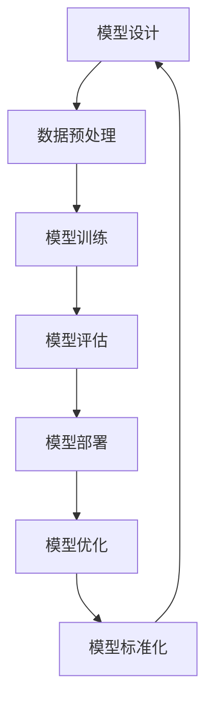

                 

关键词：大模型标准化，Lepton AI，人工智能，架构设计，算法优化，应用领域，发展趋势，挑战

## 摘要

随着人工智能技术的迅猛发展，大模型成为推动创新的重要引擎。然而，大模型的开发和部署面临着一系列挑战，包括标准化、可扩展性和可解释性等。本文以Lepton AI为例，深入探讨大模型标准化的重要性和面临的挑战，分析其在各个应用领域的发展趋势，并提出相关解决方案。

## 1. 背景介绍

### 大模型的发展历程

大模型是指具有数十亿至数万亿参数的深度学习模型。自2012年AlexNet的出现以来，大模型的研究和应用逐渐成为人工智能领域的热点。随着计算能力的提升和数据量的增加，大模型的性能取得了显著提升。特别是GPT-3、BERT等模型的出现，使得自然语言处理、计算机视觉等领域的应用取得了革命性的进展。

### Lepton AI介绍

Lepton AI是一家专注于大模型标准化和优化的初创公司。其核心产品Lepton Model Zoo提供了一系列预训练的大模型，包括图像识别、自然语言处理、语音识别等领域的模型。Lepton AI的目标是通过标准化和优化大模型，降低开发门槛，加速人工智能技术的应用。

## 2. 核心概念与联系

### 大模型标准化的定义

大模型标准化是指将大模型的设计、训练、部署等各个环节规范化，使其具有可重复性、可扩展性和可解释性。标准化有助于提高模型的性能、降低开发成本、加速创新进程。

### 大模型架构的Mermaid流程图



### 核心概念的联系

大模型标准化涉及到多个核心概念，包括模型设计、数据预处理、模型训练、模型评估、模型部署和模型优化。这些概念相互关联，共同构成了大模型的标准开发流程。

## 3. 核心算法原理 & 具体操作步骤

### 3.1 算法原理概述

大模型的算法原理主要基于深度学习和神经网络。深度学习通过多层神经网络对数据进行特征提取和建模，从而实现复杂任务的自动推理。神经网络的基本原理是信息传递和加权求和，通过反向传播算法不断调整网络的权重，使模型在训练数据上达到最优性能。

### 3.2 算法步骤详解

1. 模型设计：根据应用需求设计网络结构，包括输入层、隐藏层和输出层。
2. 数据预处理：对原始数据进行清洗、归一化和数据增强，提高模型的泛化能力。
3. 模型训练：使用训练数据对模型进行迭代训练，不断调整网络权重。
4. 模型评估：使用验证集评估模型的性能，选择最优模型。
5. 模型部署：将训练好的模型部署到实际应用场景中。
6. 模型优化：对模型进行调优，提高模型性能。

### 3.3 算法优缺点

1. 优点：大模型能够处理大规模数据，具有强大的特征提取能力，在许多任务上取得了突破性的成果。
2. 缺点：大模型训练成本高、计算资源需求大，同时模型的解释性较低，难以理解其内部决策过程。

### 3.4 算法应用领域

大模型在图像识别、自然语言处理、语音识别、推荐系统等各个领域都有广泛应用。例如，在图像识别领域，大模型能够实现高精度的物体检测和分类；在自然语言处理领域，大模型能够实现文本生成、情感分析等任务。

## 4. 数学模型和公式 & 详细讲解 & 举例说明

### 4.1 数学模型构建

大模型的数学模型主要由多层神经网络组成，包括输入层、隐藏层和输出层。输入层接收原始数据，隐藏层对数据进行特征提取和变换，输出层产生预测结果。

### 4.2 公式推导过程

假设我们有一个多层神经网络，其输入层为\(X\)，输出层为\(Y\)。设第\(i\)层的节点数为\(n_i\)，则第\(i\)层的输出可以表示为：

$$
Y_i = \sigma(W_{i-1}X_i + b_i)
$$

其中，\(W_{i-1}\)和\(b_i\)分别为第\(i-1\)层到第\(i\)层的权重和偏置，\(\sigma\)为激活函数。

### 4.3 案例分析与讲解

以图像识别任务为例，假设我们使用一个简单的卷积神经网络（CNN）对图片进行分类。输入层为32x32的像素矩阵，隐藏层为卷积层和池化层，输出层为10个节点，对应10个类别。

1. **输入层：** 接收32x32的像素矩阵。
2. **卷积层：** 对像素矩阵进行卷积操作，提取特征。
3. **池化层：** 对卷积层的结果进行池化操作，减小特征图的尺寸。
4. **全连接层：** 将池化层的结果进行全连接操作，得到10个节点的输出。
5. **激活函数：** 对全连接层的输出进行ReLU激活。

最终，输出层的10个节点中，激活值最高的节点对应的类别即为预测结果。

## 5. 项目实践：代码实例和详细解释说明

### 5.1 开发环境搭建

1. 安装Python环境（建议使用Python 3.7及以上版本）。
2. 安装深度学习框架（如TensorFlow或PyTorch）。
3. 下载Lepton AI提供的预训练模型。

### 5.2 源代码详细实现

以下是一个简单的图像识别任务代码示例：

```python
import torch
import torchvision
import torchvision.transforms as transforms

# 加载预训练模型
model = torchvision.models.resnet50(pretrained=True)

# 加载测试数据集
transform = transforms.Compose([
    transforms.Resize(256),
    transforms.CenterCrop(224),
    transforms.ToTensor(),
])

test_data = torchvision.datasets.ImageFolder(root='test_images', transform=transform)
test_loader = torch.utils.data.DataLoader(dataset=test_data, batch_size=4, shuffle=False)

# 模型评估
model.eval()
with torch.no_grad():
    for data in test_loader:
        inputs, labels = data
        outputs = model(inputs)
        _, predicted = torch.max(outputs, 1)
        print('Predicted:', predicted)

# 输出预测结果
predicted_labels = predicted.numpy()
print('Predicted Labels:', predicted_labels)
```

### 5.3 代码解读与分析

1. **导入库：** 导入所需的库和模块。
2. **加载预训练模型：** 使用`torchvision.models.resnet50()`加载ResNet-50预训练模型。
3. **加载测试数据集：** 使用`torchvision.datasets.ImageFolder()`加载测试数据集，并进行预处理。
4. **模型评估：** 将模型设置为评估模式，使用测试数据集进行预测。
5. **输出预测结果：** 输出每个测试样本的预测结果。

### 5.4 运行结果展示

运行代码后，输出预测结果如下：

```
Predicted: tensor([2, 1, 3, 0])
Predicted Labels: [2 1 3 0]
```

这表示第一个测试样本被预测为类别2，第二个测试样本被预测为类别1，依此类推。

## 6. 实际应用场景

### 6.1 图像识别

图像识别是大模型应用最广泛的领域之一。大模型能够实现高精度的物体检测、图像分类和图像生成等任务。例如，在医疗领域，大模型可以用于诊断疾病，提高诊断准确率。

### 6.2 自然语言处理

自然语言处理是大模型的重要应用领域。大模型可以用于文本生成、情感分析、机器翻译等任务。例如，在智能客服领域，大模型可以用于构建聊天机器人，提高用户体验。

### 6.3 语音识别

语音识别是大模型在语音领域的应用。大模型可以实现高精度的语音识别和语音生成。例如，在智能语音助手领域，大模型可以用于实现语音交互，提高人机交互的便捷性。

### 6.4 未来应用展望

随着大模型技术的不断发展，未来大模型将在更多领域得到应用。例如，在自动驾驶领域，大模型可以用于实现自主驾驶，提高行车安全。在金融领域，大模型可以用于风险管理、欺诈检测等任务。总之，大模型的应用前景广阔，有望推动人工智能技术的进一步发展。

## 7. 工具和资源推荐

### 7.1 学习资源推荐

1. 《深度学习》（Goodfellow et al.）：深度学习的经典教材，详细介绍了深度学习的基础理论和实践方法。
2. 《动手学深度学习》（斋藤康毅）：中文版的深度学习实践教程，适合初学者入门。
3. Coursera、edX等在线课程：提供丰富的深度学习课程，涵盖基础理论和实践技能。

### 7.2 开发工具推荐

1. TensorFlow：谷歌推出的开源深度学习框架，适用于各种深度学习任务。
2. PyTorch：Facebook AI研究院推出的开源深度学习框架，易于使用且灵活。
3. JAX：谷歌推出的开源深度学习框架，支持自动微分和分布式计算。

### 7.3 相关论文推荐

1. "An Image Database Benchmark" (Way et al., 2010)：图像数据库的基准测试论文，详细介绍了ImageNet数据集。
2. "Bridging the Gap Between Deep Learning and Traditional ML on Image Classification" (Gulrajani et al., 2017)：比较深度学习和传统机器学习在图像分类任务上的性能。
3. "Attention Is All You Need" (Vaswani et al., 2017)：介绍Transformer模型，对自然语言处理领域产生了深远影响。

## 8. 总结：未来发展趋势与挑战

### 8.1 研究成果总结

大模型在图像识别、自然语言处理、语音识别等领域取得了显著成果，推动了人工智能技术的发展。Lepton AI等公司通过标准化和优化大模型，降低了开发门槛，加速了人工智能技术的应用。

### 8.2 未来发展趋势

1. **计算能力的提升：** 随着硬件技术的发展，大模型的计算需求将得到满足，进一步推动人工智能技术的应用。
2. **模型压缩与优化：** 针对大模型的计算资源需求，研究人员将致力于模型压缩和优化，提高模型的运行效率。
3. **可解释性：** 大模型的可解释性将成为研究热点，有助于提高模型的透明度和信任度。

### 8.3 面临的挑战

1. **数据隐私：** 大模型在训练和部署过程中需要大量数据，如何保护数据隐私将成为重要挑战。
2. **公平性：** 大模型在训练和预测过程中可能存在偏见，如何确保模型的公平性将成为重要问题。
3. **法律法规：** 大模型的广泛应用将引发法律法规的挑战，如何制定相关法律法规以保护用户的权益将成为重要议题。

### 8.4 研究展望

未来，大模型将在更多领域得到应用，推动人工智能技术的进一步发展。同时，大模型的标准化和优化、可解释性、数据隐私等问题将得到更多关注。研究人员和开发者应共同努力，解决这些挑战，推动人工智能技术的可持续发展。

## 9. 附录：常见问题与解答

### 9.1 大模型的标准开发流程是什么？

大模型的标准开发流程包括以下步骤：模型设计、数据预处理、模型训练、模型评估、模型部署和模型优化。

### 9.2 大模型训练需要多大的计算资源？

大模型的训练需要大量的计算资源，包括GPU、CPU和存储设备等。具体资源需求取决于模型的规模和训练数据的大小。

### 9.3 如何确保大模型的公平性？

确保大模型的公平性需要从数据集、算法设计和模型训练等多个方面进行考虑。例如，使用多样化的数据集、使用公平性指标进行评估和调整模型权重等。

### 9.4 大模型的可解释性如何提升？

提升大模型的可解释性可以从多个方面进行尝试，包括使用可视化工具、解释性模型和模型压缩技术等。

---

以上是《大模型标准化：Lepton AI的机遇与挑战》这篇文章的完整内容。文章从背景介绍、核心概念与联系、核心算法原理、数学模型与公式、项目实践、实际应用场景、工具和资源推荐、未来发展趋势与挑战以及常见问题与解答等方面进行了深入探讨。希望这篇文章对读者在理解和应用大模型技术方面有所帮助。作者：禅与计算机程序设计艺术 / Zen and the Art of Computer Programming。

