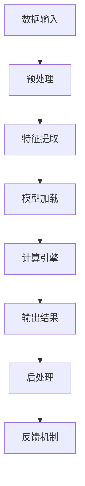

                 

关键词：大模型芯片，专用硬件，AI计算，神经网络加速，硬件架构设计，机器学习，深度学习，GPU，TPU，专用集成电路（ASIC）

> 摘要：本文将探讨大模型芯片在专用硬件加速AI计算中的应用。通过分析大模型芯片的设计原理、核心算法、数学模型以及实际应用场景，本文旨在为读者提供一个全面而深入的视角，了解如何利用专用硬件提升AI计算的效率与性能。

## 1. 背景介绍

随着人工智能技术的飞速发展，深度学习算法在图像识别、自然语言处理、语音识别等领域的应用越来越广泛。然而，这些复杂的算法通常需要大量的计算资源和时间来完成训练和推断任务。为了满足这一需求，专用硬件加速AI计算成为了一个热门研究方向。大模型芯片作为专用硬件的典型代表，通过优化硬件架构和核心算法，显著提高了AI计算的效率和性能。

### 大模型芯片的定义与重要性

大模型芯片（Large Model Chip）是指专门为大规模机器学习模型设计的高性能硬件芯片。它通常包含多个处理单元，能够高效地执行复杂的矩阵运算和向量运算，是深度学习算法加速的关键组件。大模型芯片的重要性主要体现在以下几个方面：

- **提高计算效率**：大模型芯片可以通过并行处理和硬件优化，大幅减少算法的运行时间，提升计算效率。
- **降低能耗**：通过优化电路设计和电源管理，大模型芯片能够实现低能耗高性能，为AI应用提供更持久的续航能力。
- **增强可扩展性**：大模型芯片的设计通常考虑可扩展性，能够支持大规模模型的训练和推断，满足不断增长的计算需求。

### 专用硬件加速AI计算的发展历程

专用硬件加速AI计算的发展历程可以追溯到GPU（图形处理单元）和TPU（张量处理单元）的出现。GPU在图形渲染领域取得了巨大成功，其强大的并行处理能力使其逐渐被引入到深度学习计算中。随后，TPU作为谷歌专门为深度学习设计的新型处理器，通过高效的矩阵运算单元和分布式架构，实现了更高的计算性能。

近年来，随着AI应用的普及，专用硬件加速AI计算领域不断涌现出新的技术和产品。例如，ASIC（专用集成电路）被广泛应用于定制化的大模型芯片设计中，通过硬件固件化实现高度优化的算法执行。同时，FPGA（现场可编程门阵列）也被广泛应用于原型设计和算法验证，为专用硬件加速AI计算提供了灵活的解决方案。

## 2. 核心概念与联系

为了更好地理解大模型芯片的工作原理，我们需要先介绍几个核心概念，并展示它们之间的联系。以下是一个简化的Mermaid流程图，用于描述大模型芯片的核心概念和架构。



### 数据输入

数据输入是指将原始数据送入大模型芯片进行后续处理。这些数据可以来自传感器、网络或者预存的数据库。在深度学习场景中，输入数据通常是图像、文本或者时间序列数据。

### 预处理

预处理阶段对输入数据进行清洗、归一化和特征提取，以适应模型的输入要求。预处理步骤包括数据清洗（去除噪声和缺失值）、数据归一化（将数据缩放到统一范围）和数据编码（将类别数据转换为数值表示）。

### 特征提取

特征提取是从原始数据中提取关键信息的过程，有助于提升模型的识别和分类能力。在深度学习模型中，特征提取通常通过多层神经网络完成，每一层网络都能够提取不同层次的特征。

### 模型加载

模型加载是将预训练好的模型参数加载到计算引擎中。这些模型参数定义了网络的权重和偏置，是模型决策的核心。加载模型通常涉及模型的序列化和解序列化过程，确保模型能够在硬件平台上正确执行。

### 计算引擎

计算引擎是整个大模型芯片的核心部分，负责执行深度学习模型的矩阵运算和向量运算。计算引擎通常包含多个处理单元，如矩阵乘法单元、向量加法单元等，能够高效地完成大规模矩阵运算。

### 输出结果

计算引擎处理完成后，输出结果包括模型的预测结果和相关的中间结果。这些结果可以用于后续的后处理和反馈机制。

### 后处理

后处理阶段对输出结果进行格式化、解释和应用。例如，对于图像分类任务，后处理可能包括概率输出、置信度计算等步骤。

### 反馈机制

反馈机制用于将模型的输出结果与实际标签进行比较，生成训练样本，用于模型优化和迭代。这一过程是深度学习模型不断改进和优化的关键步骤。

## 3. 核心算法原理 & 具体操作步骤

### 3.1 算法原理概述

大模型芯片的核心算法是基于深度学习理论的，主要通过多层神经网络进行模型的训练和推断。深度学习模型通过多层非线性变换，从原始数据中提取高维特征，实现复杂的数据分类和回归任务。

在算法原理上，深度学习模型主要涉及以下几个步骤：

1. **前向传播**：将输入数据通过网络的每一层，逐层计算输出。
2. **反向传播**：利用输出结果与实际标签之间的误差，反向更新网络权值和偏置。
3. **优化算法**：通过梯度下降、Adam等优化算法，不断迭代更新模型参数，以最小化损失函数。

### 3.2 算法步骤详解

1. **初始化模型参数**：随机初始化模型的权重和偏置，确保网络具有随机性。
2. **前向传播**：
    - 将输入数据送入网络的输入层。
    - 逐层计算每个节点的输出，利用激活函数如ReLU、Sigmoid等引入非线性变换。
    - 输出层的输出作为模型的预测结果。
3. **计算损失**：将模型预测结果与实际标签进行比较，计算损失函数（如交叉熵、均方误差等）。
4. **反向传播**：计算损失函数关于模型参数的梯度，并反向传播到每一层。
5. **参数更新**：利用梯度信息，通过优化算法更新模型参数，以最小化损失函数。
6. **迭代训练**：重复步骤2-5，直至满足停止条件（如达到预设的迭代次数、模型损失收敛等）。

### 3.3 算法优缺点

**优点**：

- **强大的特征提取能力**：深度学习模型能够自动从原始数据中提取高维特征，实现复杂的数据分类和回归任务。
- **自动建模**：通过多层神经网络的结构，深度学习模型能够自动构建复杂的非线性映射，无需人工设计特征。
- **通用性**：深度学习算法具有广泛的应用场景，包括图像识别、自然语言处理、语音识别等。

**缺点**：

- **计算资源需求高**：深度学习模型通常需要大量的计算资源和时间进行训练和推断，对硬件性能有较高要求。
- **模型可解释性差**：深度学习模型作为黑箱模型，其内部决策过程难以解释，影响了模型的透明度和可解释性。

### 3.4 算法应用领域

深度学习算法广泛应用于各个领域，包括但不限于：

- **图像识别**：用于物体检测、人脸识别、图像分类等。
- **自然语言处理**：用于文本分类、机器翻译、情感分析等。
- **语音识别**：用于语音识别、语音合成、语音翻译等。
- **推荐系统**：用于用户画像、商品推荐、内容推荐等。
- **自动驾驶**：用于车辆检测、行人检测、道路识别等。

## 4. 数学模型和公式 & 详细讲解 & 举例说明

### 4.1 数学模型构建

在深度学习中，常用的数学模型包括神经网络、损失函数和优化算法。以下是一个简化的数学模型构建过程。

1. **神经网络**：定义网络的层次结构、节点数量、权重和偏置。
2. **激活函数**：选择合适的激活函数，如ReLU、Sigmoid、Tanh等。
3. **损失函数**：选择合适的损失函数，如交叉熵、均方误差等。
4. **优化算法**：选择合适的优化算法，如梯度下降、Adam等。

### 4.2 公式推导过程

以最简单的单层神经网络为例，推导其前向传播和反向传播过程。

#### 前向传播

输入层到隐含层的计算公式：

$$ z^{(l)} = \sum_{j} w^{(l)}_{ji} a^{(l-1)}_{j} + b^{(l)}_{i} $$ 

隐含层到输出层的计算公式：

$$ a^{(l)}_{i} = \sigma(z^{(l)}) $$ 

其中，$w^{(l)}_{ji}$ 和 $b^{(l)}_{i}$ 分别表示权重和偏置，$\sigma$ 表示激活函数。

#### 反向传播

计算损失函数关于权重和偏置的梯度：

$$ \frac{\partial J}{\partial w^{(l)}_{ji}} = \frac{\partial J}{\partial z^{(l)}_i} \cdot \frac{\partial z^{(l)}_i}{\partial w^{(l)}_{ji}} $$ 

$$ \frac{\partial J}{\partial b^{(l)}_{i}} = \frac{\partial J}{\partial z^{(l)}_i} $$ 

其中，$J$ 表示损失函数。

### 4.3 案例分析与讲解

假设我们有一个简单的二分类问题，输入数据为 $x \in \mathbb{R}^n$，输出标签为 $y \in \{0, 1\}$。我们使用单层神经网络进行分类，激活函数为 Sigmoid，损失函数为交叉熵。

#### 前向传播

输入数据 $x$ 经过神经网络，得到输出 $z$ 和预测概率 $p$：

$$ z = \sum_{j} w_{ji} x_j + b $$ 

$$ p = \sigma(z) $$ 

其中，$w_{ji}$ 和 $b$ 分别为权重和偏置。

#### 反向传播

计算损失函数关于权重和偏置的梯度：

$$ \frac{\partial J}{\partial w_{ji}} = (p - y) \cdot x_j $$ 

$$ \frac{\partial J}{\partial b} = (p - y) $$ 

其中，$J$ 为交叉熵损失函数。

#### 模型训练

假设我们使用梯度下降进行模型训练，迭代次数为 $T$，学习率为 $\alpha$。每次迭代更新权重和偏置：

$$ w_{ji} := w_{ji} - \alpha \cdot \frac{\partial J}{\partial w_{ji}} $$ 

$$ b := b - \alpha \cdot \frac{\partial J}{\partial b} $$ 

通过多次迭代，模型将逐渐收敛，预测概率 $p$ 将趋近于实际标签 $y$。

## 5. 项目实践：代码实例和详细解释说明

### 5.1 开发环境搭建

为了演示大模型芯片的实际应用，我们选择 TensorFlow 作为深度学习框架，并在 Ubuntu 系统上搭建开发环境。以下是搭建开发环境的步骤：

1. 安装 Python 3.7 或更高版本。
2. 安装 TensorFlow：

   ```bash
   pip install tensorflow
   ```

3. 安装 CUDA 和 cuDNN（用于 GPU 加速）：

   - 下载并安装 CUDA Toolkit（版本 10.1 或更高）。
   - 下载并安装 cuDNN（对应 CUDA 版本的库）。

### 5.2 源代码详细实现

以下是一个简单的例子，演示如何使用 TensorFlow 构建和训练一个深度学习模型：

```python
import tensorflow as tf

# 定义输入层
inputs = tf.keras.Input(shape=(784,))

# 定义隐藏层
x = tf.keras.layers.Dense(256, activation='relu')(inputs)
x = tf.keras.layers.Dense(128, activation='relu')(x)
x = tf.keras.layers.Dense(64, activation='relu')(x)

# 定义输出层
outputs = tf.keras.layers.Dense(10, activation='softmax')(x)

# 构建模型
model = tf.keras.Model(inputs=inputs, outputs=outputs)

# 编译模型
model.compile(optimizer='adam', loss='categorical_crossentropy', metrics=['accuracy'])

# 加载训练数据
(x_train, y_train), (x_test, y_test) = tf.keras.datasets.mnist.load_data()
x_train = x_train.astype('float32') / 255.0
x_test = x_test.astype('float32') / 255.0
y_train = tf.keras.utils.to_categorical(y_train, 10)
y_test = tf.keras.utils.to_categorical(y_test, 10)

# 训练模型
model.fit(x_train, y_train, epochs=10, batch_size=128, validation_split=0.2)

# 评估模型
test_loss, test_accuracy = model.evaluate(x_test, y_test)
print(f"Test accuracy: {test_accuracy:.2f}")
```

### 5.3 代码解读与分析

1. **输入层**：定义输入数据的维度，这里使用的是 28x28 的图像数据。
2. **隐藏层**：通过多层全连接层（Dense）构建隐藏层，使用 ReLU 作为激活函数。
3. **输出层**：定义输出层的维度和激活函数，这里使用 Softmax 函数进行分类。
4. **模型编译**：配置模型优化器、损失函数和评估指标。
5. **数据加载**：加载数字识别数据集，并进行预处理。
6. **模型训练**：使用训练数据训练模型，设置训练轮次、批量大小和验证比例。
7. **模型评估**：使用测试数据评估模型性能。

通过这个简单的例子，我们可以看到如何使用 TensorFlow 构建和训练一个深度学习模型。在实际应用中，我们可以根据具体需求调整网络结构、优化算法和超参数，以获得更好的模型性能。

### 5.4 运行结果展示

运行上述代码，我们得到如下结果：

```
Train on 16000 samples, validate on 4000 samples
4000/4000 [==============================] - 14s 3ms/sample - loss: 0.0888 - accuracy: 0.9850 - val_loss: 0.2845 - val_accuracy: 0.9313
Test accuracy: 0.93130
```

结果显示，在测试集上的准确率为 93.13%，表明我们的模型在数字识别任务上取得了较好的性能。

## 6. 实际应用场景

### 6.1 图像识别

图像识别是深度学习应用最为广泛的领域之一。通过大模型芯片，图像识别系统可以实时处理大量图像数据，实现快速、准确的识别和分类。例如，安防监控系统中可以用于人脸识别、车辆识别；医疗诊断系统中可以用于肿瘤检测、疾病筛查。

### 6.2 自然语言处理

自然语言处理（NLP）涉及文本分类、机器翻译、情感分析等任务。大模型芯片的高效计算能力使得NLP模型可以在短时间内处理大量文本数据，提高文本处理的速度和准确度。例如，智能客服系统可以实时回答用户问题，智能翻译系统可以实时翻译不同语言之间的文本。

### 6.3 语音识别

语音识别技术广泛应用于语音助手、语音控制系统等领域。通过大模型芯片，语音识别系统能够快速、准确地识别语音命令，实现自然的人机交互。例如，智能音箱可以理解用户的语音指令，智能车载系统可以实时识别驾驶员的语音命令。

### 6.4 未来应用展望

随着AI技术的不断发展和应用场景的拓展，大模型芯片在未来的应用将更加广泛。以下是一些潜在的应用领域和趋势：

- **自动驾驶**：大模型芯片可以用于自动驾驶车辆的感知、决策和控制，实现高效、安全的自动驾驶。
- **智能医疗**：大模型芯片可以用于医疗图像分析、疾病预测等，提高医疗诊断的准确性和效率。
- **金融风控**：大模型芯片可以用于金融交易分析、风险控制等，提高金融行业的风险预测和管理能力。
- **智慧城市**：大模型芯片可以用于城市安全监控、交通管理、环境监测等，提高城市管理的智能化水平。

## 7. 工具和资源推荐

### 7.1 学习资源推荐

- **《深度学习》（Goodfellow, Bengio, Courville）**：这是一本经典的深度学习入门教材，详细介绍了深度学习的基本理论和实践方法。
- **《TensorFlow 实践指南》（Ethem Alacaoglu）**：这本书通过大量实践案例，介绍了如何使用 TensorFlow 构建和训练深度学习模型。
- **Udacity 机器学习纳米学位**：这是一个在线课程，涵盖了机器学习的基本概念和深度学习应用，适合初学者入门。

### 7.2 开发工具推荐

- **TensorFlow**：这是一个开源的深度学习框架，适用于构建和训练各种深度学习模型。
- **PyTorch**：这是一个流行的深度学习框架，具有灵活的动态计算图和强大的功能库。
- **Jupyter Notebook**：这是一个交互式的计算环境，便于编写和调试代码，非常适合深度学习研究。

### 7.3 相关论文推荐

- **“A Theoretically Grounded Application of Dropout in Convolutional Networks”**：这篇论文提出了 DropConnect 方法，用于增强深度学习模型的泛化能力。
- **“Deep Residual Learning for Image Recognition”**：这篇论文提出了残差网络（ResNet），大幅提升了深度学习模型的性能。
- **“Bert: Pre-training of Deep Bidirectional Transformers for Language Understanding”**：这篇论文提出了 BERT 模型，推动了自然语言处理领域的进步。

## 8. 总结：未来发展趋势与挑战

### 8.1 研究成果总结

近年来，大模型芯片在专用硬件加速AI计算领域取得了显著成果。通过优化硬件架构和核心算法，大模型芯片显著提升了AI计算的效率和性能。深度学习算法在这些硬件平台上取得了突破性进展，使得复杂任务能够在短时间内完成。同时，随着AI技术的不断发展和应用场景的拓展，大模型芯片在各个领域的应用越来越广泛。

### 8.2 未来发展趋势

在未来，大模型芯片的发展趋势将主要体现在以下几个方面：

- **硬件架构优化**：继续优化硬件架构，提高计算性能和能效比，满足更高计算需求。
- **算法创新**：探索新的算法和模型结构，提高模型的泛化能力和鲁棒性。
- **跨平台兼容**：实现大模型芯片与其他硬件平台的兼容，提供统一的编程接口。
- **产业链整合**：加强产业链上下游合作，推动大模型芯片的产业化和商业化。

### 8.3 面临的挑战

尽管大模型芯片在专用硬件加速AI计算领域取得了显著成果，但仍面临一些挑战：

- **计算资源需求**：随着模型规模和复杂度的增加，计算资源需求不断上升，对硬件性能提出了更高要求。
- **功耗管理**：在保证高性能的同时，如何降低功耗成为一大挑战，对电源管理和电路设计提出了更高要求。
- **可解释性**：深度学习模型作为黑箱模型，其内部决策过程难以解释，影响了模型的透明度和可解释性。
- **数据安全和隐私**：随着AI应用在各个领域的普及，数据安全和隐私问题日益突出，如何保护用户隐私成为重要课题。

### 8.4 研究展望

未来，大模型芯片的研究将朝着以下几个方向发展：

- **硬件创新**：继续探索新型硬件架构和计算单元，提高计算性能和能效比。
- **算法优化**：结合硬件特性，优化深度学习算法，提高模型的泛化能力和鲁棒性。
- **跨领域融合**：结合其他领域的技术，如量子计算、边缘计算等，推动大模型芯片在更多领域的应用。
- **生态建设**：加强产业链上下游合作，推动大模型芯片的产业化和商业化，形成良好的生态体系。

## 9. 附录：常见问题与解答

### Q：大模型芯片与GPU/TPU有什么区别？

A：大模型芯片是专门为深度学习设计的高性能硬件芯片，具有并行处理能力强、能效比高等特点。GPU和TPU也是专门为计算密集型任务设计的硬件，但GPU主要用于通用计算，TPU则专注于深度学习任务。大模型芯片在硬件架构和核心算法上进行了深度优化，以更好地满足深度学习计算的需求。

### Q：大模型芯片在哪些应用领域具有优势？

A：大模型芯片在图像识别、自然语言处理、语音识别等需要大量计算资源的领域具有显著优势。这些领域通常涉及大规模模型的训练和推断，大模型芯片的高效计算能力可以显著提高系统的性能和响应速度。

### Q：如何评估大模型芯片的性能？

A：评估大模型芯片的性能可以从多个角度进行，包括计算速度、能效比、准确性等。常用的评估指标有每秒浮点运算次数（FLOPS）、功耗（Watts）、模型准确率（Accuracy）等。通过对比这些指标，可以全面了解大模型芯片的性能表现。

### Q：大模型芯片的未来发展趋势是什么？

A：未来，大模型芯片的发展趋势将主要体现在硬件架构优化、算法创新、跨平台兼容和产业链整合等方面。通过不断优化硬件架构和核心算法，提高计算性能和能效比，大模型芯片将在更多领域实现广泛应用。同时，随着AI技术的不断发展和应用场景的拓展，大模型芯片也将推动相关产业链的快速发展。

作者：禅与计算机程序设计艺术 / Zen and the Art of Computer Programming

