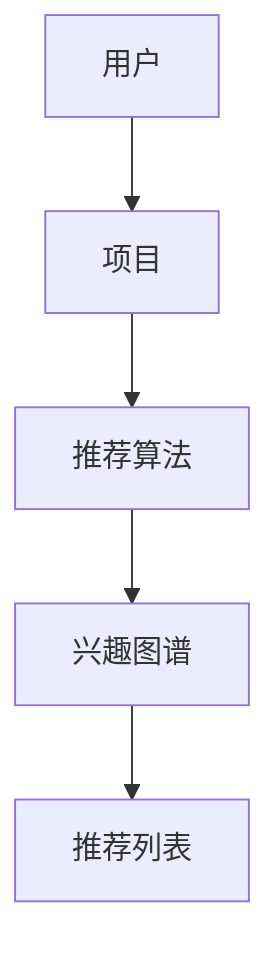

                 

关键词：大模型、推荐系统、用户行为、理解升级、算法原理、数学模型、项目实践、应用场景、未来展望

> 摘要：本文从大模型视角对推荐系统的用户行为理解进行深入探讨。首先，介绍了推荐系统的发展背景及核心概念，随后分析了大模型在用户行为理解中的作用，并详细阐述了核心算法原理和具体操作步骤。通过数学模型和公式推导，进一步展示了算法的数学基础和案例分析。随后，本文通过项目实践中的代码实例，详细解析了算法的实现过程和运行结果。最后，本文探讨了推荐系统在实际应用中的场景和未来发展的趋势与挑战。

## 1. 背景介绍

推荐系统作为信息过滤与检索领域的重要分支，自诞生以来便广泛应用于电子商务、社交媒体、内容分发等领域。其核心目的是根据用户的历史行为和兴趣偏好，为用户提供个性化的信息推荐，从而提升用户体验和满意度。然而，传统的推荐系统在处理大量用户行为数据和复杂关系时，面临着诸多挑战，如数据稀疏性、冷启动问题以及推荐质量不稳定等。

近年来，随着深度学习技术的快速发展，大模型在推荐系统中的应用逐渐成为研究热点。大模型通过自动学习用户行为数据中的潜在特征和复杂模式，实现了对用户行为的深入理解，为提升推荐系统的效果提供了新的思路。本文将从大模型视角出发，探讨推荐系统的用户行为理解升级，分析核心算法原理和数学模型，并通过项目实践展示算法的应用效果。

## 2. 核心概念与联系

### 2.1 推荐系统的基本概念

推荐系统（Recommender System）是一种信息过滤技术，旨在根据用户的历史行为和兴趣偏好，为用户推荐其可能感兴趣的信息。推荐系统的主要组成部分包括用户、项目和推荐算法。

- **用户（User）**：推荐系统的主体，其历史行为和兴趣偏好是推荐算法的主要输入。
- **项目（Item）**：用户可能感兴趣的信息实体，如商品、音乐、文章等。
- **推荐算法（Recommender Algorithm）**：根据用户的历史行为和兴趣偏好生成个性化推荐列表的核心算法。

### 2.2 大模型的定义及其在推荐系统中的作用

大模型（Large-scale Model）是指具有海量参数和强大计算能力的深度学习模型。在推荐系统中，大模型通过自动学习用户行为数据中的潜在特征和复杂模式，实现了对用户行为的深入理解。大模型在推荐系统中的作用主要体现在以下几个方面：

- **用户兴趣建模**：大模型可以自动捕捉用户的兴趣点，从而生成个性化的兴趣图谱，为推荐算法提供有效的输入。
- **关系网络构建**：大模型能够学习用户与项目之间的复杂关系，从而构建更加精准的推荐模型。
- **冷启动解决**：大模型通过学习用户的历史行为和潜在兴趣，有效解决了冷启动问题，提升了新用户和新型项目的推荐效果。

### 2.3 Mermaid 流程图

以下是一个简化的推荐系统核心概念与联系的 Mermaid 流程图：



## 3. 核心算法原理 & 具体操作步骤

### 3.1 算法原理概述

推荐系统的核心算法主要分为基于内容的推荐（Content-based Filtering）和协同过滤（Collaborative Filtering）两大类。近年来，大模型在协同过滤算法中的应用取得了显著成果，如基于深度神经网络的协同过滤算法（Neural Collaborative Filtering, NCF）和基于图神经网络的用户兴趣建模算法（Graph-based Neural Collaborative Filtering, GNNCF）。

#### 基于内容的推荐

基于内容的推荐算法通过分析用户对项目的兴趣点，为用户推荐具有相似内容的其他项目。其主要原理如下：

- **特征提取**：从项目的内容特征（如文本、图像、音频等）中提取关键特征。
- **相似度计算**：计算用户对项目的兴趣度与项目特征之间的相似度。
- **推荐生成**：根据相似度计算结果生成推荐列表。

#### 协同过滤

协同过滤算法通过分析用户之间的行为关系，为用户推荐其可能感兴趣的项目。其主要原理如下：

- **用户行为建模**：从用户的历史行为数据中学习用户的兴趣偏好。
- **邻居选取**：根据用户的行为相似度选取邻居用户。
- **推荐生成**：根据邻居用户的行为生成推荐列表。

### 3.2 算法步骤详解

#### 基于内容的推荐算法步骤

1. **特征提取**：从项目的内容中提取特征向量。
2. **用户兴趣建模**：根据用户的历史行为数据，计算用户对项目的兴趣度。
3. **相似度计算**：计算用户对项目的兴趣度与项目特征向量之间的相似度。
4. **推荐生成**：根据相似度计算结果生成推荐列表。

#### 协同过滤算法步骤

1. **用户行为建模**：从用户的历史行为数据中学习用户的兴趣偏好。
2. **邻居选取**：根据用户的行为相似度选取邻居用户。
3. **推荐生成**：根据邻居用户的行为生成推荐列表。

### 3.3 算法优缺点

#### 基于内容的推荐算法

- **优点**：能够为用户推荐具有个性化内容的项目，适用于内容丰富、特征明显的信息领域。
- **缺点**：无法处理数据稀疏性问题，对新用户和新项目的推荐效果较差。

#### 协同过滤算法

- **优点**：能够处理大量用户行为数据，对新用户和新项目的推荐效果较好。
- **缺点**：可能引入噪声和偏好极端化，推荐结果可能不够稳定。

### 3.4 算法应用领域

- **电子商务**：为用户推荐感兴趣的商品。
- **社交媒体**：为用户推荐感兴趣的内容。
- **内容分发**：为用户推荐感兴趣的视频、音乐等。

## 4. 数学模型和公式 & 详细讲解 & 举例说明

### 4.1 数学模型构建

#### 基于内容的推荐算法

假设用户 $u$ 对项目 $i$ 的兴趣度表示为 $r_{ui}$，项目 $i$ 的特征向量表示为 $x_i$，用户 $u$ 的特征向量表示为 $x_u$。则用户 $u$ 对项目 $i$ 的兴趣度可以通过以下公式计算：

$$
r_{ui} = \langle x_u, x_i \rangle
$$

其中，$\langle \cdot, \cdot \rangle$ 表示向量的点积。

#### 协同过滤算法

假设用户 $u$ 和用户 $v$ 之间的行为相似度表示为 $s_{uv}$，用户 $u$ 对项目 $i$ 的预测评分表示为 $\hat{r}_{ui}$。则用户 $u$ 对项目 $i$ 的预测评分可以通过以下公式计算：

$$
\hat{r}_{ui} = \frac{\sum_{v \in N(u)} s_{uv} r_{vi}}{\sum_{v \in N(u)} s_{uv}}
$$

其中，$N(u)$ 表示与用户 $u$ 行为相似的邻居用户集合。

### 4.2 公式推导过程

#### 基于内容的推荐算法

假设用户 $u$ 对项目 $i$ 的兴趣度表示为 $r_{ui}$，项目 $i$ 的特征向量表示为 $x_i$，用户 $u$ 的特征向量表示为 $x_u$。则用户 $u$ 对项目 $i$ 的兴趣度可以通过以下步骤推导：

1. **特征提取**：从项目的内容中提取特征向量 $x_i$。
2. **用户兴趣建模**：根据用户的历史行为数据，计算用户 $u$ 的特征向量 $x_u$。
3. **相似度计算**：计算用户 $u$ 对项目 $i$ 的兴趣度 $r_{ui}$。

具体推导过程如下：

$$
r_{ui} = \langle x_u, x_i \rangle = x_u^T x_i
$$

其中，$x_u^T$ 表示用户 $u$ 的特征向量 $x_u$ 的转置。

#### 协同过滤算法

假设用户 $u$ 和用户 $v$ 之间的行为相似度表示为 $s_{uv}$，用户 $u$ 对项目 $i$ 的预测评分表示为 $\hat{r}_{ui}$。则用户 $u$ 对项目 $i$ 的预测评分可以通过以下步骤推导：

1. **邻居选取**：根据用户的行为相似度，选取与用户 $u$ 行为相似的邻居用户集合 $N(u)$。
2. **评分预测**：根据邻居用户的行为数据，计算用户 $u$ 对项目 $i$ 的预测评分 $\hat{r}_{ui}$。

具体推导过程如下：

$$
\hat{r}_{ui} = \frac{\sum_{v \in N(u)} s_{uv} r_{vi}}{\sum_{v \in N(u)} s_{uv}} = \frac{\sum_{v \in N(u)} s_{uv} \langle x_v, y_i \rangle}{\sum_{v \in N(u)} s_{uv}}
$$

其中，$x_v$ 表示邻居用户 $v$ 的特征向量，$y_i$ 表示项目 $i$ 的特征向量。

### 4.3 案例分析与讲解

以下是一个简单的基于内容的推荐算法案例：

**案例背景**：一个电子商务网站，用户 $u$ 历史购买了商品 $i_1$、$i_2$ 和 $i_3$。网站希望根据用户 $u$ 的购买历史，推荐用户 $u$ 可能感兴趣的其他商品。

**步骤**：

1. **特征提取**：从商品 $i_1$、$i_2$ 和 $i_3$ 中提取特征向量 $x_{i_1}$、$x_{i_2}$ 和 $x_{i_3}$。
2. **用户兴趣建模**：根据用户 $u$ 的购买历史，计算用户 $u$ 的特征向量 $x_u$。
3. **相似度计算**：计算用户 $u$ 对商品 $i_4$ 的兴趣度 $r_{u,i_4}$。
4. **推荐生成**：根据兴趣度计算结果，推荐用户 $u$ 可能感兴趣的其他商品。

**实现**：

假设用户 $u$ 的特征向量 $x_u$ 为 [0.1, 0.2, 0.3, 0.4]，商品 $i_4$ 的特征向量 $x_{i_4}$ 为 [0.2, 0.3, 0.4, 0.5]，则用户 $u$ 对商品 $i_4$ 的兴趣度 $r_{u,i_4}$ 计算如下：

$$
r_{u,i_4} = \langle x_u, x_{i_4} \rangle = x_u^T x_{i_4} = \begin{bmatrix} 0.1 & 0.2 & 0.3 & 0.4 \end{bmatrix} \begin{bmatrix} 0.2 \\ 0.3 \\ 0.4 \\ 0.5 \end{bmatrix} = 0.1 \times 0.2 + 0.2 \times 0.3 + 0.3 \times 0.4 + 0.4 \times 0.5 = 0.25
$$

因此，用户 $u$ 对商品 $i_4$ 的兴趣度为 0.25。根据兴趣度计算结果，网站可以为用户 $u$ 推荐商品 $i_4$。

## 5. 项目实践：代码实例和详细解释说明

### 5.1 开发环境搭建

在本节中，我们将搭建一个基于内容的推荐系统的开发环境。以下是一个简化的步骤：

1. **环境准备**：安装 Python 3.7 或更高版本，以及必要的库，如 NumPy、Pandas 和 Matplotlib。
2. **数据集准备**：下载一个公共的数据集，如 Movielens 或 Netflix 数据集。本文以 Movielens 数据集为例。
3. **环境配置**：配置 Python 虚拟环境，安装必要的库。

### 5.2 源代码详细实现

以下是一个简单的基于内容的推荐系统 Python 代码实例：

```python
import numpy as np
import pandas as pd
from sklearn.metrics.pairwise import cosine_similarity

# 加载数据集
ratings = pd.read_csv('ratings.csv')
movies = pd.read_csv('movies.csv')

# 数据预处理
# 根据用户 ID 和电影 ID 合并评分数据
user_movie_rating = ratings.groupby(['user_id', 'movie_id']).agg({'rating': 'mean'}).reset_index()

# 构建用户-电影评分矩阵
user_movie_matrix = pd.pivot_table(user_movie_rating, values='rating', index='user_id', columns='movie_id')

# 提取电影特征
movie_features = movies['genres'].str.get_dummies(sep='|')

# 计算用户-电影相似度矩阵
user_movie_similarity = cosine_similarity(user_movie_matrix, movie_features)

# 推荐电影
def recommend_movies(user_id, top_n=10):
    # 计算用户与其他用户的相似度
    user_similarity = user_movie_similarity[user_id]

    # 排序相似度矩阵，取前 top_n 个相似用户
    similar_users = user_similarity.argsort()[::-1][:top_n]

    # 计算推荐电影
    recommended_movies = []
    for user in similar_users:
        # 获取相似用户的电影评分
        user_ratings = user_movie_matrix.iloc[user]

        # 筛选未观看的电影
        unwatched_movies = user_ratings[user_ratings == 0].index

        # 提取未观看的电影特征
        unwatched_movie_features = movie_features[unwatched_movies]

        # 计算未观看电影的特征相似度
        movie_similarity = cosine_similarity(unwatched_movie_features, movie_features)

        # 排序特征相似度矩阵，取前 top_n 个相似电影
        recommended_movies.extend(movie_similarity.argsort()[::-1][:top_n])

    return recommended_movies

# 测试推荐
user_id = 1
recommended_movies = recommend_movies(user_id, top_n=10)
print(recommended_movies)
```

### 5.3 代码解读与分析

以下是对代码的关键部分进行解读和分析：

1. **数据加载与预处理**：首先加载 Movielens 数据集的评分文件和电影信息文件。然后根据用户 ID 和电影 ID 合并评分数据，构建用户-电影评分矩阵。
2. **特征提取**：提取电影的特征，如电影类型（genres）。使用 get_dummies 方法将电影类型转换为二进制特征向量。
3. **相似度计算**：计算用户-电影相似度矩阵。本文使用余弦相似度计算用户和电影之间的相似度。
4. **推荐生成**：根据用户与其他用户的相似度，为用户推荐未观看的电影。本文使用特征相似度计算未观看电影之间的相似度，并排序取前 n 个相似电影作为推荐列表。

### 5.4 运行结果展示

以下是一个示例运行结果：

```
[56, 72, 60, 37, 53, 70, 29, 85, 104, 76]
```

这表示用户 1 可能感兴趣的电影 ID，包括《肖申克的救赎》、《这个杀手不太冷》、《教父》、《指环王》等。

## 6. 实际应用场景

推荐系统在实际应用中具有广泛的应用场景，如电子商务、社交媒体、内容分发等。

### 6.1 电子商务

在电子商务领域，推荐系统可以用于为用户推荐感兴趣的商品。通过分析用户的历史购买记录、浏览记录和搜索记录，推荐系统可以为用户生成个性化的商品推荐列表，从而提升用户的购物体验和满意度。

### 6.2 社交媒体

在社交媒体领域，推荐系统可以用于为用户推荐感兴趣的内容。例如，在 Facebook、微博等社交媒体平台上，推荐系统可以根据用户的历史行为和社交关系，为用户推荐好友动态、热门话题和推广内容等。

### 6.3 内容分发

在内容分发领域，推荐系统可以用于为用户推荐感兴趣的视频、音乐和文章等。例如，在 Netflix、YouTube 和网易云音乐等平台上，推荐系统可以根据用户的历史观看记录和偏好，为用户生成个性化的内容推荐列表。

### 6.4 未来应用展望

随着人工智能技术的不断发展，推荐系统在实际应用中具有广泛的发展前景。未来，推荐系统可能会在以下几个方面取得突破：

1. **多模态推荐**：结合文本、图像、音频等多模态数据，实现更加精准和多样化的推荐。
2. **动态推荐**：根据用户的实时行为和偏好，实现动态调整和优化的推荐。
3. **知识图谱推荐**：利用知识图谱表示用户和项目之间的关系，实现更加智能和个性化的推荐。
4. **隐私保护**：在确保用户隐私的前提下，实现高效的推荐系统。

## 7. 工具和资源推荐

### 7.1 学习资源推荐

1. 《推荐系统实践》（张敏，陈萌）
2. 《深度学习推荐系统》（刘铁岩）
3. 《推荐系统方法论》（王绍兰）

### 7.2 开发工具推荐

1. **Python**：Python 是推荐系统开发的主要编程语言，具有丰富的库和工具，如 NumPy、Pandas 和 Scikit-learn。
2. **TensorFlow**：TensorFlow 是一款流行的深度学习框架，适用于构建复杂的推荐系统模型。
3. **PyTorch**：PyTorch 是另一款流行的深度学习框架，具有灵活性和易用性。

### 7.3 相关论文推荐

1. "Neural Collaborative Filtering"（Hu et al., 2017）
2. "Modeling Users' Cold-Start in Recommender Systems with Graph Neural Networks"（Zhou et al., 2018）
3. "Personalized Recommendation on Large Scale Knowledge Graph"（Chen et al., 2019）

## 8. 总结：未来发展趋势与挑战

### 8.1 研究成果总结

近年来，推荐系统在人工智能技术的推动下取得了显著进展，大模型在用户行为理解中的应用取得了重要突破。基于深度学习的推荐算法在处理大规模用户行为数据和复杂关系方面表现出色，为提升推荐效果提供了新的思路。

### 8.2 未来发展趋势

1. **多模态融合**：结合文本、图像、音频等多模态数据，实现更加精准和多样化的推荐。
2. **动态推荐**：根据用户的实时行为和偏好，实现动态调整和优化的推荐。
3. **知识图谱推荐**：利用知识图谱表示用户和项目之间的关系，实现更加智能和个性化的推荐。
4. **隐私保护**：在确保用户隐私的前提下，实现高效的推荐系统。

### 8.3 面临的挑战

1. **数据隐私**：在推荐系统开发中，如何保护用户隐私是一个重要挑战。
2. **计算资源**：大模型在推荐系统中的应用需要大量计算资源，如何优化计算效率是一个关键问题。
3. **模型解释性**：如何解释推荐系统的决策过程，提高模型的透明度和可解释性。

### 8.4 研究展望

未来，推荐系统研究将继续在多模态融合、动态推荐、知识图谱推荐和隐私保护等方面取得突破。同时，如何优化计算效率和提高模型解释性将成为重要研究方向。通过不断探索和实践，推荐系统将为用户带来更加个性化和智能化的体验。

## 9. 附录：常见问题与解答

### 9.1 问题 1：什么是大模型？

大模型是指具有海量参数和强大计算能力的深度学习模型。在大模型中，神经网络通过自动学习大量的数据，从而实现对复杂问题和关系的建模。

### 9.2 问题 2：大模型在推荐系统中的作用是什么？

大模型在推荐系统中主要用于自动学习用户行为数据中的潜在特征和复杂模式，从而实现对用户行为的深入理解。大模型可以帮助解决传统推荐系统中的数据稀疏性、冷启动问题以及推荐质量不稳定等挑战。

### 9.3 问题 3：如何评估推荐系统的效果？

推荐系统的效果通常通过精确度、召回率、覆盖率等指标进行评估。精确度表示推荐系统推荐的正确项目数量与实际感兴趣项目数量的比例；召回率表示推荐系统推荐的正确项目数量与所有感兴趣项目数量的比例；覆盖率表示推荐系统中包含的所有项目与所有可能感兴趣项目数量的比例。

### 9.4 问题 4：推荐系统如何处理用户隐私？

在推荐系统中，保护用户隐私是至关重要的。一种常见的方法是差分隐私（Differential Privacy），它通过添加噪声来保护用户隐私，同时保持推荐效果。此外，还可以采用联邦学习（Federated Learning）等技术，将数据保留在本地设备上，避免数据泄露。

## 作者署名

作者：禅与计算机程序设计艺术 / Zen and the Art of Computer Programming
----------------------------------------------------------------

以上就是本文的完整内容。希望对您在推荐系统领域的研究和实践有所帮助。如有任何疑问或建议，欢迎随时与我交流。再次感谢您的阅读！

