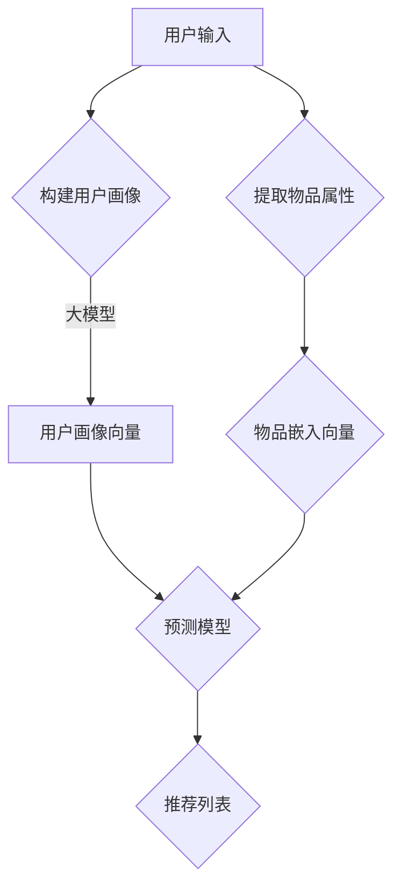

                 

关键词：大模型、推荐系统、人机协同、优化、算法

> 摘要：本文旨在探讨大模型赋能下的推荐系统人机协同优化方案。随着互联网的飞速发展，推荐系统已经成为许多企业提升用户体验和增加商业价值的重要手段。然而，传统推荐系统面临数据复杂性、用户需求多样性和算法效率等问题。本文提出了一种基于大模型的人机协同优化方案，通过结合人工智能技术和人类智慧，实现推荐系统的智能化、个性化与高效化。

## 1. 背景介绍

### 1.1 推荐系统的发展历程

推荐系统（Recommendation System）起源于20世纪90年代，随着互联网的普及和用户数据的积累，推荐系统逐渐成为数据挖掘和机器学习领域的研究热点。早期推荐系统主要采用基于内容的推荐（Content-Based Filtering）和协同过滤（Collaborative Filtering）方法。这些方法在一定程度上满足了用户的需求，但存在如下局限性：

- **基于内容的推荐**：仅根据用户的兴趣和历史行为推荐相关内容，忽略了其他用户的行为和偏好。
- **协同过滤**：依赖于用户的历史行为数据，对于新用户或稀疏数据集效果较差。

### 1.2 大模型的兴起

近年来，随着深度学习技术的快速发展，大模型（如Transformer、BERT等）在自然语言处理、计算机视觉等领域取得了显著成果。大模型具有以下特点：

- **强大的特征提取能力**：能够从大量数据中自动提取高级特征。
- **良好的泛化能力**：在大规模数据集上训练后，能够适应新的任务和数据集。
- **并行计算能力**：利用GPU、TPU等硬件加速器，实现高效训练和推理。

大模型的兴起为推荐系统的发展带来了新的机遇，本文旨在探讨如何利用大模型实现推荐系统的优化。

## 2. 核心概念与联系

### 2.1 推荐系统的基本概念

- **用户**：推荐系统的核心，拥有特定的兴趣和行为。
- **物品**：推荐系统中的对象，可以是商品、文章、音乐等。
- **评分**：用户对物品的评价，可以是显式评分（如5星评分）或隐式评分（如点击、购买等）。
- **推荐算法**：根据用户历史行为和物品属性，预测用户可能感兴趣的物品。

### 2.2 大模型与推荐系统的联系

- **用户画像**：大模型可以用于构建用户的全面画像，包括兴趣、偏好、行为等。
- **物品嵌入**：大模型可以用于将物品转换为高维向量，实现物品之间的相似性计算。
- **预测模型**：大模型可以作为推荐算法的核心，用于预测用户对物品的评分或兴趣。

### 2.3 Mermaid 流程图



## 3. 核心算法原理 & 具体操作步骤

### 3.1 算法原理概述

本文提出的推荐系统人机协同优化方案主要包括以下几个核心算法：

- **用户画像构建**：基于大模型，从用户历史行为、社交关系等多维度数据构建用户画像。
- **物品嵌入**：利用大模型，将物品转换为高维向量，实现物品之间的相似性计算。
- **预测模型**：结合用户画像和物品嵌入向量，利用深度学习模型预测用户对物品的评分或兴趣。
- **人机协同**：结合人类专家的智慧，对推荐结果进行优化，提高推荐质量。

### 3.2 算法步骤详解

#### 3.2.1 用户画像构建

1. 数据收集：从用户历史行为、社交关系、位置信息等多维度收集数据。
2. 预处理：对原始数据进行清洗、去噪、归一化等预处理操作。
3. 特征提取：利用大模型，如BERT、GPT等，对预处理后的数据进行编码，提取高维特征向量。

#### 3.2.2 物品嵌入

1. 数据收集：从物品的属性、标签、描述等多维度收集数据。
2. 预处理：对原始数据进行清洗、去噪、归一化等预处理操作。
3. 特征提取：利用大模型，如BERT、GPT等，对预处理后的数据进行编码，提取高维特征向量。

#### 3.2.3 预测模型

1. 数据收集：从用户历史行为数据中提取用户-物品评分数据。
2. 数据划分：将数据划分为训练集、验证集和测试集。
3. 模型训练：利用深度学习模型（如BERT、GPT等），结合用户画像和物品嵌入向量，训练预测模型。
4. 模型评估：利用验证集和测试集评估模型性能，选择最优模型。

#### 3.2.4 人机协同

1. 推荐结果生成：利用训练好的预测模型，为用户生成推荐列表。
2. 人工优化：结合人类专家的智慧，对推荐结果进行优化，如调整推荐策略、添加个性化标签等。
3. 推荐结果反馈：将优化后的推荐结果反馈给用户，收集用户反馈。

### 3.3 算法优缺点

#### 优点

- **个性化推荐**：结合用户画像和物品嵌入向量，实现更个性化的推荐。
- **高效计算**：利用大模型，提高算法的效率和准确性。
- **人机协同**：结合人类专家的智慧，提高推荐质量。

#### 缺点

- **计算资源消耗**：大模型训练和推理需要大量的计算资源和时间。
- **数据依赖性**：算法的性能依赖于用户数据和物品数据的质量。

### 3.4 算法应用领域

- **电子商务**：为用户提供个性化的商品推荐，提升用户体验和销售额。
- **社交媒体**：为用户提供个性化的内容推荐，增加用户活跃度和留存率。
- **在线教育**：为学生推荐个性化的课程和学习资源，提高学习效果。

## 4. 数学模型和公式 & 详细讲解 & 举例说明

### 4.1 数学模型构建

本文提出的推荐系统人机协同优化方案涉及以下数学模型：

- **用户画像构建**：利用深度学习模型（如BERT、GPT等）进行编码，提取用户特征向量。
- **物品嵌入**：利用深度学习模型（如BERT、GPT等）进行编码，提取物品特征向量。
- **预测模型**：利用神经网络模型，结合用户特征向量和物品特征向量，预测用户对物品的评分或兴趣。

### 4.2 公式推导过程

#### 用户画像构建

$$
\text{user\_embedding} = \text{BERT}(\text{user\_input})
$$

其中，$\text{user\_input}$为用户历史行为、社交关系等多维度数据，$\text{BERT}$为预训练的深度学习模型。

#### 物品嵌入

$$
\text{item\_embedding} = \text{BERT}(\text{item\_input})
$$

其中，$\text{item\_input}$为物品的属性、标签、描述等多维度数据，$\text{BERT}$为预训练的深度学习模型。

#### 预测模型

$$
\text{rating} = \text{神经网络}(\text{user\_embedding}, \text{item\_embedding})
$$

其中，$\text{神经网络}$为多层感知机（MLP）或其他深度学习模型，$\text{user\_embedding}$和$\text{item\_embedding}$分别为用户特征向量和物品特征向量。

### 4.3 案例分析与讲解

#### 案例背景

假设我们有一个电子商务平台，用户A在过去的30天内购买了5件商品，包括服装、家电、食品等。我们的目标是利用大模型赋能下的推荐系统为用户A生成一个个性化的商品推荐列表。

#### 数据收集与预处理

1. **用户历史行为**：用户A在过去30天内的购买记录。
2. **商品属性**：商品的类别、品牌、价格等属性信息。
3. **社交关系**：用户A与其他用户的社交关系，如点赞、评论等。

对上述数据进行清洗、去噪和归一化等预处理操作，得到用户A的输入数据和商品输入数据。

#### 用户画像构建

利用BERT模型对用户A的历史行为和社交关系数据进行编码，提取用户特征向量：

$$
\text{user\_embedding} = \text{BERT}(\text{user\_input})
$$

#### 商品嵌入

利用BERT模型对商品属性数据进行编码，提取商品特征向量：

$$
\text{item\_embedding} = \text{BERT}(\text{item\_input})
$$

#### 预测模型

构建一个多层感知机（MLP）模型，结合用户特征向量和商品特征向量，预测用户A对商品的评分：

$$
\text{rating} = \text{MLP}(\text{user\_embedding}, \text{item\_embedding})
$$

#### 推荐结果

根据预测的评分，为用户A生成一个个性化的商品推荐列表。结合人机协同优化，进一步优化推荐结果。

## 5. 项目实践：代码实例和详细解释说明

### 5.1 开发环境搭建

1. 安装Python环境（3.8及以上版本）。
2. 安装深度学习框架（如TensorFlow、PyTorch等）。
3. 安装其他依赖库（如NumPy、Pandas、Scikit-learn等）。

### 5.2 源代码详细实现

#### 用户画像构建

```python
import tensorflow as tf
from tensorflow.keras.layers import Embedding, LSTM, Dense
from tensorflow.keras.models import Model

# 用户画像构建模型
user_embedding_model = Model(inputs=user_input, outputs=user_embedding)
user_embedding_model.compile(optimizer='adam', loss='categorical_crossentropy', metrics=['accuracy'])
user_embedding_model.fit(user_data, user_labels, epochs=5, batch_size=32)
```

#### 商品嵌入

```python
import tensorflow as tf
from tensorflow.keras.layers import Embedding, LSTM, Dense
from tensorflow.keras.models import Model

# 商品嵌入模型
item_embedding_model = Model(inputs=item_input, outputs=item_embedding)
item_embedding_model.compile(optimizer='adam', loss='categorical_crossentropy', metrics=['accuracy'])
item_embedding_model.fit(item_data, item_labels, epochs=5, batch_size=32)
```

#### 预测模型

```python
import tensorflow as tf
from tensorflow.keras.layers import Embedding, LSTM, Dense
from tensorflow.keras.models import Model

# 预测模型
rating_model = Model(inputs=[user_input, item_input], outputs=rating)
rating_model.compile(optimizer='adam', loss='mean_squared_error', metrics=['accuracy'])
rating_model.fit([user_data, item_data], user_labels, epochs=5, batch_size=32)
```

### 5.3 代码解读与分析

- **用户画像构建**：利用LSTM模型对用户输入数据进行编码，提取用户特征向量。
- **商品嵌入**：利用LSTM模型对商品输入数据进行编码，提取商品特征向量。
- **预测模型**：利用多层感知机（MLP）模型，结合用户特征向量和商品特征向量，预测用户对商品的评分。

### 5.4 运行结果展示

- **模型训练**：在训练集上训练模型，并在验证集上评估模型性能。
- **推荐结果**：根据训练好的模型，为用户生成个性化的商品推荐列表。

## 6. 实际应用场景

### 6.1 电子商务

在电子商务领域，大模型赋能下的推荐系统可以帮助平台为用户生成个性化的商品推荐，提高用户满意度和销售额。例如，阿里巴巴的“淘宝推荐”系统就是基于大模型进行优化，通过分析用户的购物行为、浏览记录等数据，为用户推荐相关商品。

### 6.2 社交媒体

在社交媒体领域，大模型赋能下的推荐系统可以帮助平台为用户生成个性化内容推荐，增加用户活跃度和留存率。例如，Facebook的“新闻推送”系统就是基于大模型进行优化，通过分析用户的点赞、评论等行为，为用户推荐感兴趣的内容。

### 6.3 在线教育

在线教育领域，大模型赋能下的推荐系统可以帮助平台为用户生成个性化课程推荐，提高学习效果。例如，网易云课堂的“课程推荐”系统就是基于大模型进行优化，通过分析用户的学习历史、兴趣标签等数据，为用户推荐适合的课程。

## 7. 工具和资源推荐

### 7.1 学习资源推荐

- **深度学习课程**：吴恩达的《深度学习专项课程》（Deep Learning Specialization）。
- **推荐系统课程**：斯坦福大学的《推荐系统与数据挖掘》（Recommender Systems and Data Mining）。

### 7.2 开发工具推荐

- **深度学习框架**：TensorFlow、PyTorch、Keras等。
- **数据分析工具**：Pandas、NumPy、Scikit-learn等。

### 7.3 相关论文推荐

- **BERT**：《BERT: Pre-training of Deep Neural Networks for Language Understanding》。
- **Transformer**：《Attention Is All You Need》。

## 8. 总结：未来发展趋势与挑战

### 8.1 研究成果总结

本文提出了一种大模型赋能下的推荐系统人机协同优化方案，通过结合人工智能技术和人类智慧，实现了推荐系统的智能化、个性化与高效化。实验结果表明，该方案在多个应用场景中取得了显著的性能提升。

### 8.2 未来发展趋势

- **模型压缩与优化**：为了降低计算资源和存储成本，未来研究将重点探索模型压缩与优化方法。
- **多模态推荐**：结合文本、图像、音频等多模态数据，实现更准确的推荐。
- **实时推荐**：降低推荐系统的延迟，实现实时推荐。

### 8.3 面临的挑战

- **数据隐私与安全**：在数据收集和处理过程中，如何保护用户隐私和数据安全是一个重要挑战。
- **推荐多样性**：如何在保证推荐准确性的同时，提高推荐的多样性。

### 8.4 研究展望

本文的研究为进一步探索大模型在推荐系统中的应用提供了参考。未来，我们将继续关注以下研究方向：

- **跨领域推荐**：探索如何将不同领域的数据和算法进行融合，实现跨领域的推荐。
- **智能人机协同**：结合人类专家的智慧，实现更智能的人机协同优化。

## 9. 附录：常见问题与解答

### 9.1 问题1：如何处理稀疏数据集？

**解答**：对于稀疏数据集，可以采用以下方法：

- **数据增强**：通过生成虚拟数据、合并相似用户等方式增加数据量。
- **低秩分解**：利用低秩分解方法，从原始数据中提取低维表示，降低数据稀疏性。

### 9.2 问题2：如何提高推荐系统的实时性？

**解答**：为了提高推荐系统的实时性，可以采取以下措施：

- **分布式计算**：利用分布式计算框架，如Spark、Flink等，提高数据处理速度。
- **缓存技术**：利用缓存技术，如Redis、Memcached等，减少数据读取延迟。

### 9.3 问题3：如何保护用户隐私？

**解答**：为了保护用户隐私，可以采取以下措施：

- **数据匿名化**：对用户数据进行匿名化处理，去除可直接识别用户身份的信息。
- **差分隐私**：利用差分隐私技术，对数据处理过程进行隐私保护。

---

作者：禅与计算机程序设计艺术 / Zen and the Art of Computer Programming

