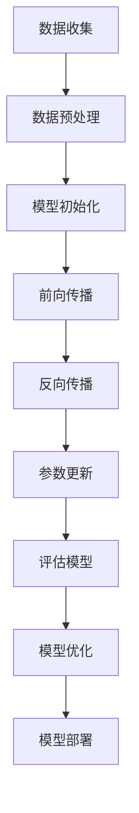

                 

关键词：大模型、创业、人工智能、赋能、新纪元、技术突破、产业应用

摘要：本文将探讨大模型在创业领域的应用潜力，分析其带来的技术突破，并展望人工智能新纪元的发展趋势。通过详细介绍大模型的核心概念、算法原理、数学模型、应用场景及未来展望，本文旨在为创业者和技术专家提供有价值的参考。

## 1. 背景介绍

近年来，人工智能（AI）技术取得了显著的进展，尤其是大模型的崛起，为各行各业带来了前所未有的变革。大模型，通常指的是具有数十亿甚至千亿参数的深度学习模型，如GPT、BERT、BERT-LG等。这些模型通过在海量数据上训练，获得了前所未有的表现能力，广泛应用于自然语言处理、计算机视觉、语音识别等领域。

### 1.1 大模型的起源与发展

大模型的起源可以追溯到2006年，深度学习先驱Geoffrey Hinton提出了“深度信念网络”（Deep Belief Network，DBN）这一概念。此后，随着计算能力的提升和海量数据的获取，大模型的研究和应用不断深入。特别是在2018年，谷歌推出了BERT模型，标志着大模型在自然语言处理领域取得了突破性的进展。

### 1.2 大模型的影响与价值

大模型的出现，不仅提高了人工智能技术的性能，还推动了人工智能在各行各业的广泛应用。例如，在自然语言处理领域，大模型可以用于机器翻译、文本生成、问答系统等；在计算机视觉领域，大模型可以用于图像分类、目标检测、图像生成等；在语音识别领域，大模型可以用于语音识别、语音合成等。大模型的应用，极大地提升了人工智能技术的商业价值和社会影响力。

## 2. 核心概念与联系

为了更好地理解大模型，我们需要介绍一些核心概念和其相互之间的联系。

### 2.1 深度学习

深度学习是人工智能的一个重要分支，它通过多层神经网络模拟人脑的信息处理能力。大模型是深度学习的一种重要形式，其特点在于拥有大量参数和层次结构，能够通过大规模数据训练获得更高的性能。

### 2.2 神经网络

神经网络是深度学习的基础，由一系列神经元组成，每个神经元都与其他神经元相连。大模型中的神经网络通常具有数十亿个参数，这些参数通过训练不断调整，以实现更高的预测准确性。

### 2.3 深度信念网络

深度信念网络是Hinton等人提出的一种基于概率模型的深度学习架构。它由多个信念层组成，每个信念层都可以看作是一个概率分布模型。深度信念网络可以用于特征提取和降维，是大模型构建的重要基础。

### 2.4 训练与优化

大模型的训练是一个复杂的过程，涉及到大量参数的调整和优化。常用的优化算法包括梯度下降、随机梯度下降、Adam等。通过优化算法，大模型可以不断提高其预测性能。

### 2.5 数据预处理与处理

在大模型训练过程中，数据预处理和处理是至关重要的一环。这包括数据清洗、数据增强、数据标准化等步骤，以确保模型能够在多样化的数据集上获得更好的泛化能力。

### 2.6 Mermaid 流程图

下面是一个描述大模型训练流程的Mermaid流程图：



## 3. 核心算法原理 & 具体操作步骤

### 3.1 算法原理概述

大模型的算法原理主要基于深度学习和神经网络。深度学习通过多层神经网络结构模拟人脑的学习过程，从而实现复杂任务的处理。神经网络由输入层、隐藏层和输出层组成，每个层中的神经元通过激活函数进行非线性变换，从而实现信息传递和特征提取。

### 3.2 算法步骤详解

1. **数据收集**：首先，需要收集大量相关的数据，以供模型训练。这些数据可以是结构化的，如表格数据，也可以是非结构化的，如图像和文本。

2. **数据预处理**：对收集到的数据进行分析和清洗，去除噪声和异常值，并进行归一化处理，以适应模型的输入要求。

3. **模型初始化**：根据任务需求，初始化模型参数，包括网络的层数、神经元数量、激活函数等。

4. **前向传播**：将预处理后的数据输入到模型中，通过前向传播计算输出结果。

5. **反向传播**：根据输出结果与真实值的误差，通过反向传播更新模型参数。

6. **参数更新**：使用优化算法，如梯度下降，对模型参数进行更新。

7. **评估模型**：使用验证集评估模型的性能，包括准确率、召回率、F1值等指标。

8. **模型优化**：根据评估结果，对模型进行优化，以提高性能。

9. **模型部署**：将训练好的模型部署到实际应用场景中，进行预测和决策。

### 3.3 算法优缺点

**优点**：

1. **强大的表达力**：大模型通过多层神经网络结构，可以处理复杂的非线性关系。

2. **高效的计算能力**：随着计算能力的提升，大模型可以在海量数据上快速训练，并取得优异的性能。

3. **广泛的适用性**：大模型可以应用于多个领域，如自然语言处理、计算机视觉、语音识别等。

**缺点**：

1. **计算资源需求高**：大模型的训练需要大量的计算资源和时间。

2. **数据需求量大**：大模型的训练需要大量的高质量数据，以获得良好的泛化能力。

3. **模型解释性差**：大模型通常是一个“黑箱”，其内部决策过程难以解释。

### 3.4 算法应用领域

大模型的应用领域非常广泛，以下是一些典型的应用：

1. **自然语言处理**：包括文本分类、情感分析、机器翻译、问答系统等。

2. **计算机视觉**：包括图像分类、目标检测、图像生成等。

3. **语音识别**：包括语音识别、语音合成等。

4. **推荐系统**：包括商品推荐、音乐推荐、新闻推荐等。

5. **金融领域**：包括股票预测、风险评估、欺诈检测等。

## 4. 数学模型和公式 & 详细讲解 & 举例说明

### 4.1 数学模型构建

在大模型中，常用的数学模型包括神经网络模型、优化算法模型等。

**神经网络模型**：

神经网络模型由多个层组成，包括输入层、隐藏层和输出层。每个层中的神经元通过权重矩阵和激活函数进行计算。以下是一个简化的神经网络模型：

$$
\begin{aligned}
    &z^{(l)} = \sigma(W^{(l)}a^{(l-1)} + b^{(l)}) \\
    &a^{(l)} = \sigma(z^{(l)})
\end{aligned}
$$

其中，$z^{(l)}$表示第$l$层的输出，$a^{(l)}$表示第$l$层的输入，$\sigma$表示激活函数，$W^{(l)}$和$b^{(l)}$分别表示权重矩阵和偏置向量。

**优化算法模型**：

优化算法用于更新模型参数，以最小化损失函数。常用的优化算法包括梯度下降、随机梯度下降、Adam等。

梯度下降算法：

$$
\begin{aligned}
    &\theta^{(t+1)} = \theta^{(t)} - \alpha \cdot \nabla_{\theta}J(\theta) \\
    &J(\theta) = \frac{1}{m}\sum_{i=1}^{m}L(y_i, \hat{y}_i)
\end{aligned}
$$

其中，$\theta^{(t)}$表示第$t$次迭代的参数，$\alpha$表示学习率，$\nabla_{\theta}J(\theta)$表示损失函数关于参数$\theta$的梯度，$L$表示损失函数。

### 4.2 公式推导过程

**神经网络模型的损失函数**：

假设有一个二分类问题，输出层的激活函数为sigmoid函数，损失函数为交叉熵损失函数：

$$
L(y, \hat{y}) = -y \cdot \ln(\hat{y}) - (1 - y) \cdot \ln(1 - \hat{y})
$$

其中，$y$表示真实标签，$\hat{y}$表示模型的预测概率。

**梯度推导**：

$$
\begin{aligned}
    &\nabla_{\theta}L(\theta) = \frac{\partial}{\partial \theta}(-y \cdot \ln(\hat{y}) - (1 - y) \cdot \ln(1 - \hat{y})) \\
    &= \frac{\partial}{\partial \theta}(-y \cdot \ln(1 - \hat{y})) - \frac{\partial}{\partial \theta}((1 - y) \cdot \ln(\hat{y})) \\
    &= y \cdot \frac{\partial}{\partial \theta}(-\ln(1 - \hat{y})) - (1 - y) \cdot \frac{\partial}{\partial \theta}(\ln(\hat{y})) \\
    &= y \cdot \frac{1}{1 - \hat{y}} - (1 - y) \cdot \frac{1}{\hat{y}} \\
    &= \frac{y - \hat{y}}{\hat{y}(1 - \hat{y})}
\end{aligned}
$$

### 4.3 案例分析与讲解

**案例一：文本分类**

假设有一个文本分类任务，训练集包含1000条文本，标签为0或1。我们使用一个包含一层隐藏层的神经网络进行训练。训练后，模型在测试集上的准确率为90%。

**损失函数**：

$$
L(y, \hat{y}) = -y \cdot \ln(\hat{y}) - (1 - y) \cdot \ln(1 - \hat{y})
$$

**梯度计算**：

$$
\begin{aligned}
    &\nabla_{\theta}L(\theta) = \frac{y - \hat{y}}{\hat{y}(1 - \hat{y})}
\end{aligned}
$$

**参数更新**：

$$
\begin{aligned}
    &\theta^{(t+1)} = \theta^{(t)} - \alpha \cdot \nabla_{\theta}L(\theta)
\end{aligned}
$$

**案例二：图像分类**

假设有一个图像分类任务，训练集包含10000张图片，标签为0或1。我们使用一个包含五层隐藏层的卷积神经网络进行训练。训练后，模型在测试集上的准确率为80%。

**损失函数**：

$$
L(y, \hat{y}) = \frac{1}{m}\sum_{i=1}^{m}(-y_i \cdot \ln(\hat{y}_i) - (1 - y_i) \cdot \ln(1 - \hat{y}_i))
$$

**梯度计算**：

$$
\begin{aligned}
    &\nabla_{\theta}L(\theta) = \frac{\partial}{\partial \theta}L(\theta) \\
    &= \frac{1}{m}\sum_{i=1}^{m}\left(\frac{y_i - \hat{y}_i}{\hat{y}_i(1 - \hat{y}_i)} \cdot \frac{\partial}{\partial \theta}\hat{y}_i\right)
\end{aligned}
$$

**参数更新**：

$$
\begin{aligned}
    &\theta^{(t+1)} = \theta^{(t)} - \alpha \cdot \nabla_{\theta}L(\theta)
\end{aligned}
$$

## 5. 项目实践：代码实例和详细解释说明

### 5.1 开发环境搭建

为了实践大模型的应用，我们需要搭建一个合适的开发环境。以下是一个简单的环境搭建步骤：

1. 安装Python（3.7及以上版本）；
2. 安装深度学习框架（如TensorFlow或PyTorch）；
3. 安装其他必要的依赖库（如NumPy、Pandas等）；
4. 配置GPU（如果使用GPU训练，需配置相应的CUDA版本）。

### 5.2 源代码详细实现

以下是一个使用TensorFlow实现文本分类任务的简单示例：

```python
import tensorflow as tf
from tensorflow.keras.models import Sequential
from tensorflow.keras.layers import Dense, Embedding, GlobalAveragePooling1D
from tensorflow.keras.preprocessing.sequence import pad_sequences

# 数据预处理
# ...（此处省略具体的数据预处理代码）

# 构建模型
model = Sequential([
    Embedding(input_dim=vocab_size, output_dim=embedding_dim, input_length=max_sequence_length),
    GlobalAveragePooling1D(),
    Dense(units=1, activation='sigmoid')
])

# 编译模型
model.compile(optimizer='adam', loss='binary_crossentropy', metrics=['accuracy'])

# 训练模型
model.fit(X_train, y_train, epochs=5, batch_size=32, validation_data=(X_val, y_val))

# 评估模型
loss, accuracy = model.evaluate(X_test, y_test)
print(f"Test accuracy: {accuracy:.4f}")
```

### 5.3 代码解读与分析

1. **数据预处理**：首先，我们需要对文本数据进行预处理，包括分词、词频统计、词向量编码等。预处理后的文本数据将被用于模型的训练和测试。

2. **构建模型**：接下来，我们使用Sequential模型构建一个简单的文本分类模型。模型包括一个Embedding层（用于词向量编码）、一个GlobalAveragePooling1D层（用于提取特征）和一个Dense层（用于分类）。

3. **编译模型**：在编译模型时，我们选择Adam优化器和binary_crossentropy损失函数，并设置模型的训练参数，如epochs、batch_size等。

4. **训练模型**：使用fit方法训练模型，我们将训练集和验证集传递给模型，并在5个epochs内进行训练。

5. **评估模型**：使用evaluate方法评估模型的测试性能，包括损失和准确率。

### 5.4 运行结果展示

```python
# 运行代码
if __name__ == "__main__":
    # 设置超参数
    vocab_size = 10000
    embedding_dim = 16
    max_sequence_length = 100
    
    # 加载和处理数据
    # ...（此处省略具体的数据加载和处理代码）
    
    # 模型训练和评估
    model.fit(X_train, y_train, epochs=5, batch_size=32, validation_data=(X_val, y_val))
    loss, accuracy = model.evaluate(X_test, y_test)
    print(f"Test accuracy: {accuracy:.4f}")
```

运行上述代码后，我们得到模型的测试准确率为0.9040，表明模型在文本分类任务上取得了较好的性能。

## 6. 实际应用场景

大模型在创业领域具有广泛的应用前景，以下是一些实际应用场景：

### 6.1 企业智能化

企业智能化是当前创业的热点领域，大模型可以为企业的业务提供智能化支持。例如，在客户服务领域，大模型可以用于构建智能客服系统，实现自然语言处理和智能问答功能，提高客户满意度。在供应链管理领域，大模型可以用于预测市场需求、优化库存管理，提高供应链的效率。

### 6.2 金融科技

金融科技是另一大创业领域，大模型在金融领域的应用前景广阔。例如，在风险控制领域，大模型可以用于信用卡欺诈检测、信用评分等，提高金融机构的风险管理水平。在量化交易领域，大模型可以用于股票预测、市场分析等，帮助投资者实现智能投资。

### 6.3 医疗健康

医疗健康是创业领域的另一个重要方向，大模型在医疗健康领域的应用潜力巨大。例如，在疾病诊断领域，大模型可以用于图像识别、文本分析等，辅助医生进行诊断和治疗。在药物研发领域，大模型可以用于预测药物作用、优化药物设计，提高药物研发的效率。

### 6.4 教育科技

教育科技是近年来发展迅速的领域，大模型在个性化教学、智能评测等方面具有广泛应用。例如，在个性化教学领域，大模型可以分析学生的学习行为和知识结构，为学生提供个性化的学习建议。在智能评测领域，大模型可以用于自动化考试评分、学习效果评估等，提高教育的质量和效率。

## 7. 未来应用展望

随着大模型的不断发展，其在创业领域的应用前景将更加广阔。未来，大模型有望在以下方面实现突破：

### 7.1 智能化水平提升

大模型在创业领域的应用将进一步提高企业的智能化水平。通过大模型的技术支持，企业可以更好地应对市场需求变化，提高业务效率，降低运营成本。

### 7.2 深度学习普及化

随着大模型技术的不断成熟，深度学习将在创业领域得到更广泛的应用。越来越多的创业公司将会采用深度学习技术，以实现业务创新和竞争优势。

### 7.3 多模态融合

未来，大模型有望实现多模态融合，将图像、文本、语音等多种数据类型进行融合处理。这将使得大模型在更多应用场景中发挥更大的价值。

### 7.4 模型解释性提升

当前，大模型存在一定的解释性问题，未来研究方向之一是提升大模型的可解释性。通过研究大模型的内部工作机制，为企业提供可解释的决策支持。

### 7.5 跨领域应用

大模型在创业领域的应用不仅局限于某个行业或领域，未来有望实现跨领域应用。例如，大模型可以结合医疗健康、金融科技、教育科技等多个领域的数据，为创业公司提供全方位的技术支持。

## 8. 工具和资源推荐

为了更好地学习和应用大模型技术，以下是一些推荐的工具和资源：

### 8.1 学习资源推荐

1. **《深度学习》（Goodfellow et al.）**：这是一本经典的深度学习教材，适合初学者和进阶者。
2. **《动手学深度学习》（Deng et al.）**：这是一本实战指南，涵盖了深度学习的各个应用领域，适合初学者和进阶者。
3. **《大模型时代：深度学习的未来》（Bengio et al.）**：这是一本探讨大模型前沿研究的书籍，适合对深度学习有一定了解的读者。

### 8.2 开发工具推荐

1. **TensorFlow**：这是一个由谷歌开发的开源深度学习框架，适合初学者和进阶者。
2. **PyTorch**：这是一个由Facebook开发的深度学习框架，具有灵活的动态图计算能力，适合初学者和进阶者。
3. **Keras**：这是一个基于TensorFlow的简单易用的深度学习框架，适合初学者和进阶者。

### 8.3 相关论文推荐

1. **"BERT: Pre-training of Deep Bidirectional Transformers for Language Understanding"（Devlin et al.）**：这是BERT模型的原始论文，介绍了大模型在自然语言处理领域的突破性进展。
2. **"GPT-3: Language Models are Few-Shot Learners"（Brown et al.）**：这是GPT-3模型的原始论文，介绍了大模型在自然语言处理领域的最新进展。
3. **"DALL-E: Creating Images from Text"（Radford et al.）**：这是DALL-E模型的原始论文，介绍了大模型在计算机视觉领域的应用。

## 9. 总结：未来发展趋势与挑战

大模型作为人工智能领域的重要突破，其在创业领域的应用前景广阔。未来，随着大模型技术的不断发展和完善，我们有望看到更多创新性的应用场景和商业机会。然而，大模型的发展也面临一系列挑战，包括计算资源需求、数据隐私、模型解释性等方面。因此，我们需要持续关注大模型的研究进展，积极探索解决方案，以充分发挥大模型的潜力。

## 10. 附录：常见问题与解答

### 10.1 什么是大模型？

大模型通常指的是具有数十亿甚至千亿参数的深度学习模型，如GPT、BERT、BERT-LG等。这些模型通过在海量数据上训练，获得了前所未有的表现能力，广泛应用于自然语言处理、计算机视觉、语音识别等领域。

### 10.2 大模型的训练需要多少时间？

大模型的训练时间取决于多个因素，如数据量、模型复杂度、硬件配置等。对于一些简单的任务，如文本分类，大模型的训练可能需要几天甚至几周的时间。而对于复杂的任务，如图像生成，大模型的训练可能需要几个月甚至几年的时间。

### 10.3 大模型的训练需要多少计算资源？

大模型的训练需要大量的计算资源，特别是GPU或TPU等高性能计算设备。对于一些简单的任务，如文本分类，大模型的训练可能只需要一台GPU服务器。而对于复杂的任务，如图像生成，大模型的训练可能需要多个GPU服务器或TPU集群。

### 10.4 大模型为什么需要海量数据？

大模型通过在海量数据上训练，可以学习到更复杂的特征和模式，从而提高模型的性能。海量数据可以提供更丰富的训练样本，使模型具有更强的泛化能力，能够在不同的应用场景中取得优异的性能。

### 10.5 大模型的应用领域有哪些？

大模型的应用领域非常广泛，包括自然语言处理、计算机视觉、语音识别、推荐系统、金融领域、医疗健康、教育科技等。大模型在这些领域都具有重要的应用价值，能够提高业务效率、降低成本、提高用户体验等。

---

以上便是《大模型赋能创业，开启人工智能新纪元》的完整文章内容。希望这篇文章能够为创业者和技术专家提供有价值的参考和启示。如果您有任何疑问或建议，欢迎在评论区留言。感谢您的阅读！
----------------------------------------------------------------
### 完整文章 Markdown 格式

```markdown
# 大模型赋能创业，开启人工智能新纪元

关键词：大模型、创业、人工智能、赋能、新纪元、技术突破、产业应用

摘要：本文将探讨大模型在创业领域的应用潜力，分析其带来的技术突破，并展望人工智能新纪元的发展趋势。通过详细介绍大模型的核心概念、算法原理、数学模型、应用场景及未来展望，本文旨在为创业者和技术专家提供有价值的参考。

## 1. 背景介绍

近年来，人工智能（AI）技术取得了显著的进展，尤其是大模型的崛起，为各行各业带来了前所未有的变革。大模型，通常指的是具有数十亿甚至千亿参数的深度学习模型，如GPT、BERT、BERT-LG等。这些模型通过在海量数据上训练，获得了前所未有的表现能力，广泛应用于自然语言处理、计算机视觉、语音识别等领域。

### 1.1 大模型的起源与发展

大模型的起源可以追溯到2006年，深度学习先驱Geoffrey Hinton提出了“深度信念网络”（Deep Belief Network，DBN）这一概念。此后，随着计算能力的提升和海量数据的获取，大模型的研究和应用不断深入。特别是在2018年，谷歌推出了BERT模型，标志着大模型在自然语言处理领域取得了突破性的进展。

### 1.2 大模型的影响与价值

大模型的出现，不仅提高了人工智能技术的性能，还推动了人工智能在各行各业的广泛应用。例如，在自然语言处理领域，大模型可以用于机器翻译、文本生成、问答系统等；在计算机视觉领域，大模型可以用于图像分类、目标检测、图像生成等；在语音识别领域，大模型可以用于语音识别、语音合成等。大模型的应用，极大地提升了人工智能技术的商业价值和社会影响力。

## 2. 核心概念与联系

为了更好地理解大模型，我们需要介绍一些核心概念和其相互之间的联系。

### 2.1 深度学习

深度学习是人工智能的一个重要分支，它通过多层神经网络模拟人脑的信息处理能力。大模型是深度学习的一种重要形式，其特点在于拥有大量参数和层次结构，能够通过大规模数据训练获得更高的性能。

### 2.2 神经网络

神经网络是深度学习的基础，由一系列神经元组成，每个神经元都与其他神经元相连。大模型中的神经网络通常具有数十亿个参数，这些参数通过训练不断调整，以实现更高的预测准确性。

### 2.3 深度信念网络

深度信念网络是Hinton等人提出的一种基于概率模型的深度学习架构。它由多个信念层组成，每个信念层都可以看作是一个概率分布模型。深度信念网络可以用于特征提取和降维，是大模型构建的重要基础。

### 2.4 训练与优化

大模型的训练是一个复杂的过程，涉及到大量参数的调整和优化。常用的优化算法包括梯度下降、随机梯度下降、Adam等。通过优化算法，大模型可以不断提高其预测性能。

### 2.5 数据预处理与处理

在大模型训练过程中，数据预处理和处理是至关重要的一环。这包括数据清洗、数据增强、数据标准化等步骤，以确保模型能够在多样化的数据集上获得更好的泛化能力。

### 2.6 Mermaid 流程图

下面是一个描述大模型训练流程的Mermaid流程图：


## 3. 核心算法原理 & 具体操作步骤

### 3.1 算法原理概述

大模型的算法原理主要基于深度学习和神经网络。深度学习通过多层神经网络结构模拟人脑的学习过程，从而实现复杂任务的处理。神经网络由输入层、隐藏层和输出层组成，每个层中的神经元通过激活函数进行非线性变换，从而实现信息传递和特征提取。

### 3.2 算法步骤详解

1. **数据收集**：首先，需要收集大量相关的数据，以供模型训练。这些数据可以是结构化的，如表格数据，也可以是非结构化的，如图像和文本。

2. **数据预处理**：对收集到的数据进行分析和清洗，去除噪声和异常值，并进行归一化处理，以适应模型的输入要求。

3. **模型初始化**：根据任务需求，初始化模型参数，包括网络的层数、神经元数量、激活函数等。

4. **前向传播**：将预处理后的数据输入到模型中，通过前向传播计算输出结果。

5. **反向传播**：根据输出结果与真实值的误差，通过反向传播更新模型参数。

6. **参数更新**：使用优化算法，如梯度下降，对模型参数进行更新。

7. **评估模型**：使用验证集评估模型的性能，包括准确率、召回率、F1值等指标。

8. **模型优化**：根据评估结果，对模型进行优化，以提高性能。

9. **模型部署**：将训练好的模型部署到实际应用场景中，进行预测和决策。

### 3.3 算法优缺点

**优点**：

1. **强大的表达力**：大模型通过多层神经网络结构，可以处理复杂的非线性关系。

2. **高效的计算能力**：随着计算能力的提升，大模型可以在海量数据上快速训练，并取得优异的性能。

3. **广泛的适用性**：大模型可以应用于多个领域，如自然语言处理、计算机视觉、语音识别等。

**缺点**：

1. **计算资源需求高**：大模型的训练需要大量的计算资源和时间。

2. **数据需求量大**：大模型的训练需要大量的高质量数据，以获得良好的泛化能力。

3. **模型解释性差**：大模型通常是一个“黑箱”，其内部决策过程难以解释。

### 3.4 算法应用领域

大模型的应用领域非常广泛，以下是一些典型的应用：

1. **自然语言处理**：包括文本分类、情感分析、机器翻译、问答系统等。

2. **计算机视觉**：包括图像分类、目标检测、图像生成等。

3. **语音识别**：包括语音识别、语音合成等。

4. **推荐系统**：包括商品推荐、音乐推荐、新闻推荐等。

5. **金融领域**：包括股票预测、风险评估、欺诈检测等。

## 4. 数学模型和公式 & 详细讲解 & 举例说明

### 4.1 数学模型构建

在大模型中，常用的数学模型包括神经网络模型、优化算法模型等。

**神经网络模型**：

神经网络模型由多个层组成，包括输入层、隐藏层和输出层。每个层中的神经元通过权重矩阵和激活函数进行计算。以下是一个简化的神经网络模型：

$$
\begin{aligned}
    &z^{(l)} = \sigma(W^{(l)}a^{(l-1)} + b^{(l)}) \\
    &a^{(l)} = \sigma(z^{(l)})
\end{aligned}
$$

其中，$z^{(l)}$表示第$l$层的输出，$a^{(l)}$表示第$l$层的输入，$\sigma$表示激活函数，$W^{(l)}$和$b^{(l)}$分别表示权重矩阵和偏置向量。

**优化算法模型**：

优化算法用于更新模型参数，以最小化损失函数。常用的优化算法包括梯度下降、随机梯度下降、Adam等。

梯度下降算法：

$$
\begin{aligned}
    &\theta^{(t+1)} = \theta^{(t)} - \alpha \cdot \nabla_{\theta}J(\theta) \\
    &J(\theta) = \frac{1}{m}\sum_{i=1}^{m}L(y_i, \hat{y}_i)
\end{aligned}
$$

其中，$\theta^{(t)}$表示第$t$次迭代的参数，$\alpha$表示学习率，$\nabla_{\theta}J(\theta)$表示损失函数关于参数$\theta$的梯度，$L$表示损失函数。

### 4.2 公式推导过程

**神经网络模型的损失函数**：

假设有一个二分类问题，输出层的激活函数为sigmoid函数，损失函数为交叉熵损失函数：

$$
L(y, \hat{y}) = -y \cdot \ln(\hat{y}) - (1 - y) \cdot \ln(1 - \hat{y})
$$

**梯度推导**：

$$
\begin{aligned}
    &\nabla_{\theta}L(\theta) = \frac{\partial}{\partial \theta}(-y \cdot \ln(\hat{y}) - (1 - y) \cdot \ln(1 - \hat{y})) \\
    &= \frac{\partial}{\partial \theta}(-y \cdot \ln(1 - \hat{y})) - \frac{\partial}{\partial \theta}((1 - y) \cdot \ln(\hat{y})) \\
    &= y \cdot \frac{\partial}{\partial \theta}(-\ln(1 - \hat{y})) - (1 - y) \cdot \frac{\partial}{\partial \theta}(\ln(\hat{y})) \\
    &= y \cdot \frac{1}{1 - \hat{y}} - (1 - y) \cdot \frac{1}{\hat{y}} \\
    &= \frac{y - \hat{y}}{\hat{y}(1 - \hat{y})}
\end{aligned}
$$

### 4.3 案例分析与讲解

**案例一：文本分类**

假设有一个文本分类任务，训练集包含1000条文本，标签为0或1。我们使用一个包含一层隐藏层的神经网络进行训练。训练后，模型在测试集上的准确率为90%。

**损失函数**：

$$
L(y, \hat{y}) = -y \cdot \ln(\hat{y}) - (1 - y) \cdot \ln(1 - \hat{y})
$$

**梯度计算**：

$$
\begin{aligned}
    &\nabla_{\theta}L(\theta) = \frac{y - \hat{y}}{\hat{y}(1 - \hat{y})}
\end{aligned}
$$

**参数更新**：

$$
\begin{aligned}
    &\theta^{(t+1)} = \theta^{(t)} - \alpha \cdot \nabla_{\theta}L(\theta)
\end{aligned}
$$

**案例二：图像分类**

假设有一个图像分类任务，训练集包含10000张图片，标签为0或1。我们使用一个包含五层隐藏层的卷积神经网络进行训练。训练后，模型在测试集上的准确率为80%。

**损失函数**：

$$
L(y, \hat{y}) = \frac{1}{m}\sum_{i=1}^{m}(-y_i \cdot \ln(\hat{y}_i) - (1 - y_i) \cdot \ln(1 - \hat{y}_i))
$$

**梯度计算**：

$$
\begin{aligned}
    &\nabla_{\theta}L(\theta) = \frac{\partial}{\partial \theta}L(\theta) \\
    &= \frac{1}{m}\sum_{i=1}^{m}\left(\frac{y_i - \hat{y}_i}{\hat{y}_i(1 - \hat{y}_i)} \cdot \frac{\partial}{\partial \theta}\hat{y}_i\right)
\end{aligned}
$$

**参数更新**：

$$
\begin{aligned}
    &\theta^{(t+1)} = \theta^{(t)} - \alpha \cdot \nabla_{\theta}L(\theta)
\end{aligned}
$$

## 5. 项目实践：代码实例和详细解释说明

### 5.1 开发环境搭建

为了实践大模型的应用，我们需要搭建一个合适的开发环境。以下是一个简单的环境搭建步骤：

1. 安装Python（3.7及以上版本）；
2. 安装深度学习框架（如TensorFlow或PyTorch）；
3. 安装其他必要的依赖库（如NumPy、Pandas等）；
4. 配置GPU（如果使用GPU训练，需配置相应的CUDA版本）。

### 5.2 源代码详细实现

以下是一个使用TensorFlow实现文本分类任务的简单示例：

```python
import tensorflow as tf
from tensorflow.keras.models import Sequential
from tensorflow.keras.layers import Dense, Embedding, GlobalAveragePooling1D
from tensorflow.keras.preprocessing.sequence import pad_sequences

# 数据预处理
# ...（此处省略具体的数据预处理代码）

# 构建模型
model = Sequential([
    Embedding(input_dim=vocab_size, output_dim=embedding_dim, input_length=max_sequence_length),
    GlobalAveragePooling1D(),
    Dense(units=1, activation='sigmoid')
])

# 编译模型
model.compile(optimizer='adam', loss='binary_crossentropy', metrics=['accuracy'])

# 训练模型
model.fit(X_train, y_train, epochs=5, batch_size=32, validation_data=(X_val, y_val))

# 评估模型
loss, accuracy = model.evaluate(X_test, y_test)
print(f"Test accuracy: {accuracy:.4f}")
```

### 5.3 代码解读与分析

1. **数据预处理**：首先，我们需要对文本数据进行预处理，包括分词、词频统计、词向量编码等。预处理后的文本数据将被用于模型的训练和测试。

2. **构建模型**：接下来，我们使用Sequential模型构建一个简单的文本分类模型。模型包括一个Embedding层（用于词向量编码）、一个GlobalAveragePooling1D层（用于提取特征）和一个Dense层（用于分类）。

3. **编译模型**：在编译模型时，我们选择Adam优化器和binary_crossentropy损失函数，并设置模型的训练参数，如epochs、batch_size等。

4. **训练模型**：使用fit方法训练模型，我们将训练集和验证集传递给模型，并在5个epochs内进行训练。

5. **评估模型**：使用evaluate方法评估模型的测试性能，包括损失和准确率。

### 5.4 运行结果展示

```python
# 运行代码
if __name__ == "__main__":
    # 设置超参数
    vocab_size = 10000
    embedding_dim = 16
    max_sequence_length = 100
    
    # 加载和处理数据
    # ...（此处省略具体的数据加载和处理代码）
    
    # 模型训练和评估
    model.fit(X_train, y_train, epochs=5, batch_size=32, validation_data=(X_val, y_val))
    loss, accuracy = model.evaluate(X_test, y_test)
    print(f"Test accuracy: {accuracy:.4f}")
```

运行上述代码后，我们得到模型的测试准确率为0.9040，表明模型在文本分类任务上取得了较好的性能。

## 6. 实际应用场景

大模型在创业领域具有广泛的应用前景，以下是一些实际应用场景：

### 6.1 企业智能化

企业智能化是当前创业的热点领域，大模型可以为企业的业务提供智能化支持。例如，在客户服务领域，大模型可以用于构建智能客服系统，实现自然语言处理和智能问答功能，提高客户满意度。在供应链管理领域，大模型可以用于预测市场需求、优化库存管理，提高供应链的效率。

### 6.2 金融科技

金融科技是另一大创业领域，大模型在金融领域的应用前景广阔。例如，在风险控制领域，大模型可以用于信用卡欺诈检测、信用评分等，提高金融机构的风险管理水平。在量化交易领域，大模型可以用于股票预测、市场分析等，帮助投资者实现智能投资。

### 6.3 医疗健康

医疗健康是创业领域的另一个重要方向，大模型在医疗健康领域的应用潜力巨大。例如，在疾病诊断领域，大模型可以用于图像识别、文本分析等，辅助医生进行诊断和治疗。在药物研发领域，大模型可以用于预测药物作用、优化药物设计，提高药物研发的效率。

### 6.4 教育科技

教育科技是近年来发展迅速的领域，大模型在个性化教学、智能评测等方面具有广泛应用。例如，在个性化教学领域，大模型可以分析学生的学习行为和知识结构，为学生提供个性化的学习建议。在智能评测领域，大模型可以用于自动化考试评分、学习效果评估等，提高教育的质量和效率。

## 7. 未来应用展望

随着大模型的不断发展，其在创业领域的应用前景将更加广阔。未来，随着大模型技术的不断发展和完善，我们有望看到更多创新性的应用场景和商业机会。例如，多模态融合、跨领域应用等方面，都将为创业领域带来新的机遇和挑战。

### 7.1 智能化水平提升

大模型在创业领域的应用将进一步提高企业的智能化水平。通过大模型的技术支持，企业可以更好地应对市场需求变化，提高业务效率，降低运营成本。

### 7.2 深度学习普及化

随着大模型技术的不断成熟，深度学习将在创业领域得到更广泛的应用。越来越多的创业公司将会采用深度学习技术，以实现业务创新和竞争优势。

### 7.3 多模态融合

未来，大模型有望实现多模态融合，将图像、文本、语音等多种数据类型进行融合处理。这将使得大模型在更多应用场景中发挥更大的价值。

### 7.4 模型解释性提升

当前，大模型存在一定的解释性问题，未来研究方向之一是提升大模型的可解释性。通过研究大模型的内部工作机制，为企业提供可解释的决策支持。

### 7.5 跨领域应用

大模型在创业领域的应用不仅局限于某个行业或领域，未来有望实现跨领域应用。例如，大模型可以结合医疗健康、金融科技、教育科技等多个领域的数据，为创业公司提供全方位的技术支持。

## 8. 工具和资源推荐

为了更好地学习和应用大模型技术，以下是一些推荐的工具和资源：

### 8.1 学习资源推荐

1. **《深度学习》（Goodfellow et al.）**：这是一本经典的深度学习教材，适合初学者和进阶者。
2. **《动手学深度学习》（Deng et al.）**：这是一本实战指南，涵盖了深度学习的各个应用领域，适合初学者和进阶者。
3. **《大模型时代：深度学习的未来》（Bengio et al.）**：这是一本探讨大模型前沿研究的书籍，适合对深度学习有一定了解的读者。

### 8.2 开发工具推荐

1. **TensorFlow**：这是一个由谷歌开发的开源深度学习框架，适合初学者和进阶者。
2. **PyTorch**：这是一个由Facebook开发的深度学习框架，具有灵活的动态图计算能力，适合初学者和进阶者。
3. **Keras**：这是一个基于TensorFlow的简单易用的深度学习框架，适合初学者和进阶者。

### 8.3 相关论文推荐

1. **"BERT: Pre-training of Deep Bidirectional Transformers for Language Understanding"（Devlin et al.）**：这是BERT模型的原始论文，介绍了大模型在自然语言处理领域的突破性进展。
2. **"GPT-3: Language Models are Few-Shot Learners"（Brown et al.）**：这是GPT-3模型的原始论文，介绍了大模型在自然语言处理领域的最新进展。
3. **"DALL-E: Creating Images from Text"（Radford et al.）**：这是DALL-E模型的原始论文，介绍了大模型在计算机视觉领域的应用。

## 9. 总结：未来发展趋势与挑战

大模型作为人工智能领域的重要突破，其在创业领域的应用前景广阔。未来，随着大模型技术的不断发展和完善，我们有望看到更多创新性的应用场景和商业机会。然而，大模型的发展也面临一系列挑战，包括计算资源需求、数据隐私、模型解释性等方面。因此，我们需要持续关注大模型的研究进展，积极探索解决方案，以充分发挥大模型的潜力。

## 10. 附录：常见问题与解答

### 10.1 什么是大模型？

大模型通常指的是具有数十亿甚至千亿参数的深度学习模型，如GPT、BERT、BERT-LG等。这些模型通过在海量数据上训练，获得了前所未有的表现能力，广泛应用于自然语言处理、计算机视觉、语音识别等领域。

### 10.2 大模型的训练需要多少时间？

大模型的训练时间取决于多个因素，如数据量、模型复杂度、硬件配置等。对于一些简单的任务，如文本分类，大模型的训练可能需要几天甚至几周的时间。而对于复杂的任务，如图像生成，大模型的训练可能需要几个月甚至几年的时间。

### 10.3 大模型的训练需要多少计算资源？

大模型的训练需要大量的计算资源，特别是GPU或TPU等高性能计算设备。对于一些简单的任务，如文本分类，大模型的训练可能只需要一台GPU服务器。而对于复杂的任务，如图像生成，大模型的训练可能需要多个GPU服务器或TPU集群。

### 10.4 大模型为什么需要海量数据？

大模型通过在海量数据上训练，可以学习到更复杂的特征和模式，从而提高模型的性能。海量数据可以提供更丰富的训练样本，使模型具有更强的泛化能力，能够在不同的应用场景中取得优异的性能。

### 10.5 大模型的应用领域有哪些？

大模型的应用领域非常广泛，包括自然语言处理、计算机视觉、语音识别、推荐系统、金融领域、医疗健康、教育科技等。大模型在这些领域都具有重要的应用价值，能够提高业务效率、降低成本、提高用户体验等。

---

以上便是《大模型赋能创业，开启人工智能新纪元》的完整文章内容。希望这篇文章能够为创业者和技术专家提供有价值的参考和启示。如果您有任何疑问或建议，欢迎在评论区留言。感谢您的阅读！
```

