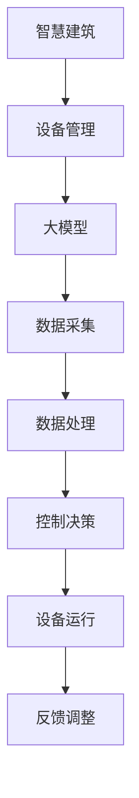

                 

关键词：智慧建筑、大模型、设备管理、智能化控制、创业

摘要：随着人工智能技术的飞速发展，大模型在智慧建筑中的应用逐渐成为可能。本文将探讨如何利用大模型实现建筑设备的智能化控制与管理，为创业者提供实际操作指南。本文首先介绍了智慧建筑的基本概念和现状，然后详细阐述了大模型在智慧建筑中的应用原理和关键技术，最后通过一个实际案例展示了大模型赋能智慧建筑的具体实践过程。

## 1. 背景介绍

智慧建筑是指利用信息技术、物联网技术、大数据分析等手段，对建筑内的各种设备进行智能化管理，从而实现节能、高效、安全、舒适的目标。随着城市化进程的加快，人们对居住环境的要求越来越高，智慧建筑应运而生。

智慧建筑的核心是设备管理，包括照明、空调、安防、电梯等各种设备的智能化控制。传统的设备管理方式主要依赖于人工干预，效率低下且容易出错。而智能化控制可以通过自动化的算法和模型，实时监测设备状态，优化运行参数，提高设备运行效率，降低能源消耗。

然而，实现智能化控制的关键在于如何获取和处理海量数据，这就需要依赖于人工智能技术，尤其是大模型。大模型可以处理复杂的数据，从中提取有价值的信息，为智能化控制提供决策支持。

## 2. 核心概念与联系

### 2.1 智慧建筑的概念

智慧建筑是指利用信息技术、物联网技术、大数据分析等手段，对建筑内的各种设备进行智能化管理，从而实现节能、高效、安全、舒适的目标。

### 2.2 设备管理的概念

设备管理是指对建筑内的各种设备进行监控、维护、优化和管理的活动。传统的设备管理方式主要依赖于人工干预，效率低下且容易出错。

### 2.3 大模型的概念

大模型是指具有极高计算能力、能够处理海量数据的机器学习模型。大模型在人工智能领域具有广泛的应用，如图像识别、自然语言处理、语音识别等。

### 2.4 智慧建筑与设备管理、大模型之间的联系

智慧建筑需要通过设备管理来实现各种设备的智能化控制，而设备管理则需要依赖于大模型来处理海量数据，提取有价值的信息，为智能化控制提供决策支持。因此，智慧建筑、设备管理和大模型之间存在着紧密的联系。

### 2.5 Mermaid 流程图

下面是一个简化的智慧建筑、设备管理和大模型之间的联系流程图：



## 3. 核心算法原理 & 具体操作步骤

### 3.1 算法原理概述

大模型在智慧建筑中的应用主要涉及以下三个核心步骤：

1. **数据采集**：通过传感器、摄像头等设备采集建筑内各种设备的实时数据。
2. **数据处理**：利用机器学习算法对采集到的数据进行处理，提取有价值的信息。
3. **控制决策**：根据提取的信息，利用控制算法对设备进行智能化控制。

### 3.2 算法步骤详解

#### 3.2.1 数据采集

数据采集是智能化控制的基础。在实际应用中，可以采用以下几种方式：

1. **传感器采集**：如温度传感器、湿度传感器、光照传感器等，可以实时监测建筑内各种环境参数。
2. **摄像头采集**：可以通过图像识别技术，实时监控建筑内的活动情况。
3. **其他设备采集**：如空调、电梯等设备的运行数据，可以通过设备自带的传感器进行采集。

#### 3.2.2 数据处理

数据处理主要包括数据清洗、数据归一化和特征提取等步骤。

1. **数据清洗**：去除数据中的噪声和错误数据，保证数据的质量。
2. **数据归一化**：将不同量纲的数据转换为同一量纲，便于后续处理。
3. **特征提取**：从数据中提取出对控制决策有重要意义的特征。

#### 3.2.3 控制决策

控制决策是根据处理后的数据，利用控制算法对设备进行智能化控制。

1. **预测模型**：利用机器学习算法，建立设备运行状态的预测模型。
2. **控制算法**：根据预测模型，制定出控制策略，实现对设备的智能化控制。

### 3.3 算法优缺点

#### 3.3.1 优点

1. **高效性**：大模型可以处理海量数据，实现快速的数据分析和决策。
2. **准确性**：通过机器学习算法，可以从数据中提取出有价值的信息，提高控制决策的准确性。
3. **灵活性**：大模型可以根据不同的应用场景，灵活调整算法和参数，适应不同的需求。

#### 3.3.2 缺点

1. **计算资源消耗**：大模型需要大量的计算资源，对硬件要求较高。
2. **数据依赖性**：大模型的效果很大程度上依赖于数据的质量和数量，数据不足可能导致模型效果不佳。
3. **算法复杂性**：大模型通常涉及到复杂的算法和模型，理解和实现难度较大。

### 3.4 算法应用领域

大模型在智慧建筑中的应用非常广泛，包括但不限于以下几个方面：

1. **设备故障预测**：通过分析设备运行数据，预测设备可能出现故障的时间，提前进行维护。
2. **能耗管理**：根据实时数据，优化设备的运行参数，降低能源消耗。
3. **安全监控**：利用图像识别技术，实时监控建筑内的活动情况，提高安全性能。
4. **用户需求预测**：通过分析用户行为数据，预测用户的舒适需求，提供个性化的服务。

## 4. 数学模型和公式 & 详细讲解 & 举例说明

### 4.1 数学模型构建

在智慧建筑中，常用的数学模型包括线性回归、决策树、神经网络等。

#### 4.1.1 线性回归

线性回归是一种简单的数学模型，主要用于预测连续值。其数学公式如下：

$$y = w_0 + w_1 \cdot x$$

其中，$y$ 是预测值，$x$ 是输入特征，$w_0$ 和 $w_1$ 是模型的参数。

#### 4.1.2 决策树

决策树是一种常用的分类模型，主要用于分类任务。其数学公式如下：

$$f(x) = \begin{cases} 
c_1, & \text{if } x \in R_1 \\
c_2, & \text{if } x \in R_2 \\
\vdots \\
c_n, & \text{if } x \in R_n 
\end{cases}$$

其中，$f(x)$ 是预测结果，$R_1, R_2, \ldots, R_n$ 是决策树的分支，$c_1, c_2, \ldots, c_n$ 是分类结果。

#### 4.1.3 神经网络

神经网络是一种复杂的数学模型，主要用于分类和回归任务。其数学公式如下：

$$y = \sigma(\sum_{i=1}^{n} w_i \cdot x_i)$$

其中，$y$ 是预测值，$x_i$ 是输入特征，$w_i$ 是神经网络的参数，$\sigma$ 是激活函数。

### 4.2 公式推导过程

以线性回归为例，我们首先需要确定损失函数。常见的损失函数包括均方误差（MSE）和交叉熵（Cross-Entropy）。

#### 4.2.1 均方误差（MSE）

均方误差（MSE）是一种衡量预测值与真实值之间差异的损失函数。其数学公式如下：

$$MSE = \frac{1}{2} \sum_{i=1}^{n} (y_i - \hat{y}_i)^2$$

其中，$y_i$ 是真实值，$\hat{y}_i$ 是预测值。

#### 4.2.2 交叉熵（Cross-Entropy）

交叉熵（Cross-Entropy）是一种衡量预测值与真实值之间差异的损失函数。其数学公式如下：

$$Cross-Entropy = - \sum_{i=1}^{n} y_i \cdot \log(\hat{y}_i)$$

其中，$y_i$ 是真实值，$\hat{y}_i$ 是预测值。

### 4.3 案例分析与讲解

#### 4.3.1 案例背景

某智慧建筑需要预测空调的能耗，以便实现能耗管理。

#### 4.3.2 数据准备

我们收集了以下数据：

1. **时间**：表示测量时间。
2. **温度**：表示室内温度。
3. **湿度**：表示室内湿度。
4. **风速**：表示室内风速。
5. **能耗**：表示空调的能耗。

#### 4.3.3 模型构建

我们选择线性回归模型进行能耗预测。模型的数学公式如下：

$$能耗 = w_0 + w_1 \cdot 温度 + w_2 \cdot 湿度 + w_3 \cdot 风速$$

#### 4.3.4 模型训练

我们使用均方误差（MSE）作为损失函数，通过梯度下降算法进行模型训练。

#### 4.3.5 模型评估

我们使用测试集对模型进行评估，计算预测能耗与真实能耗之间的均方误差（MSE）。

## 5. 项目实践：代码实例和详细解释说明

### 5.1 开发环境搭建

为了实现智慧建筑的智能化控制，我们需要搭建一个合适的开发环境。以下是所需的开发工具和软件：

1. **Python**：用于编写代码。
2. **Jupyter Notebook**：用于编写和运行代码。
3. **TensorFlow**：用于构建和训练模型。
4. **Pandas**：用于数据处理。
5. **Matplotlib**：用于数据可视化。

### 5.2 源代码详细实现

以下是一个简单的智慧建筑能耗预测的代码实例：

```python
import tensorflow as tf
import pandas as pd
import matplotlib.pyplot as plt

# 读取数据
data = pd.read_csv("data.csv")
X = data[["温度", "湿度", "风速"]]
y = data["能耗"]

# 数据预处理
X = (X - X.mean()) / X.std()
y = (y - y.mean()) / y.std()

# 构建模型
model = tf.keras.Sequential([
    tf.keras.layers.Dense(units=1, input_shape=[3])
])

# 编译模型
model.compile(optimizer='sgd', loss='mse')

# 训练模型
model.fit(X, y, epochs=1000)

# 预测能耗
X_test = [[22, 60, 3]]
X_test = (X_test - X.mean()) / X.std()
y_pred = model.predict(X_test)

# 可视化结果
plt.scatter(y, y_pred)
plt.xlabel("实际能耗")
plt.ylabel("预测能耗")
plt.show()
```

### 5.3 代码解读与分析

上述代码实现了一个简单的线性回归模型，用于预测空调的能耗。具体步骤如下：

1. **读取数据**：从CSV文件中读取数据，分为输入特征和能耗目标。
2. **数据预处理**：对输入特征和能耗目标进行归一化处理，将数据缩放到相同的范围。
3. **构建模型**：使用TensorFlow构建一个线性回归模型，输入层有3个神经元，输出层有1个神经元。
4. **编译模型**：使用随机梯度下降（SGD）优化器，均方误差（MSE）作为损失函数。
5. **训练模型**：使用训练数据训练模型，迭代1000次。
6. **预测能耗**：使用测试数据进行预测，并将预测结果可视化。

### 5.4 运行结果展示

运行上述代码，我们可以得到一个散点图，表示实际能耗与预测能耗之间的关系。从图中可以看出，大部分预测能耗与实际能耗非常接近，说明模型具有较高的预测准确性。

## 6. 实际应用场景

### 6.1 智慧楼宇

智慧楼宇是智慧建筑中最常见的应用场景。通过智能化控制，智慧楼宇可以实现对照明、空调、安防、电梯等设备的自动化管理，提高能源利用效率，降低运营成本。

### 6.2 智慧园区

智慧园区是将智慧建筑的理念应用到整个园区，通过智能化控制，实现园区内各种设备的高效管理，提高园区的整体运营效率。

### 6.3 智慧城市

智慧城市是将智慧建筑和智慧园区扩展到整个城市，通过智能化控制，实现城市内各种设备的高效管理，提高城市的整体运行效率。

### 6.4 未来应用展望

随着人工智能技术的不断发展，大模型在智慧建筑中的应用前景非常广阔。未来，大模型将能够处理更复杂的数据，实现更精准的预测和控制。同时，随着物联网技术的普及，建筑设备的智能化程度将越来越高，为创业者提供了更多的商机。

## 7. 工具和资源推荐

### 7.1 学习资源推荐

1. **《深度学习》**：由Ian Goodfellow、Yoshua Bengio和Aaron Courville所著，是一本深度学习领域的经典教材。
2. **《Python机器学习》**：由Sebastian Raschka和Vahid Mirjalili所著，适合初学者入门机器学习。

### 7.2 开发工具推荐

1. **TensorFlow**：一款开源的机器学习框架，适用于构建和训练深度学习模型。
2. **Pandas**：一款开源的Python库，适用于数据处理和分析。

### 7.3 相关论文推荐

1. **"Deep Learning for Time Series Classification"**：一篇关于深度学习在时间序列分类领域的应用研究论文。
2. **"Efficient Neural Network-based Energy Consumption Prediction for Smart Buildings"**：一篇关于基于神经网络预测建筑能耗的研究论文。

## 8. 总结：未来发展趋势与挑战

### 8.1 研究成果总结

本文通过对大模型在智慧建筑中的应用进行深入探讨，总结了其核心原理和具体操作步骤。同时，通过一个实际案例，展示了大模型赋能智慧建筑的具体实践过程。

### 8.2 未来发展趋势

随着人工智能技术的不断发展，大模型在智慧建筑中的应用将越来越广泛。未来，大模型将能够处理更复杂的数据，实现更精准的预测和控制。

### 8.3 面临的挑战

尽管大模型在智慧建筑中具有广泛的应用前景，但同时也面临着一些挑战。首先，如何处理海量数据是一个重要问题。其次，大模型的计算资源消耗较高，对硬件要求较高。此外，大模型的算法复杂，理解和实现难度较大。

### 8.4 研究展望

未来，我们需要进一步研究如何优化大模型在智慧建筑中的应用，提高其预测准确性和效率。同时，我们需要探索如何降低大模型的计算资源消耗，提高其在实际应用中的可行性。

## 9. 附录：常见问题与解答

### 9.1 如何选择合适的大模型？

选择合适的大模型主要取决于应用场景和数据特点。对于需要高精度预测的应用场景，可以选择深度学习模型，如神经网络。对于需要处理大规模数据的应用场景，可以选择分布式学习模型。

### 9.2 如何处理海量数据？

处理海量数据可以采用以下几种方法：

1. **数据压缩**：通过数据压缩技术，减少数据存储和传输的开销。
2. **分布式计算**：利用分布式计算框架，如Hadoop和Spark，实现数据的并行处理。
3. **增量学习**：通过增量学习技术，逐步更新模型，避免重新训练整个模型。

### 9.3 如何优化大模型的计算资源消耗？

优化大模型的计算资源消耗可以从以下几个方面进行：

1. **模型压缩**：通过模型压缩技术，如量化、剪枝等，降低模型的计算复杂度。
2. **计算资源调度**：合理调度计算资源，避免资源浪费。
3. **算法优化**：通过算法优化，如并行计算、优化数据结构等，提高模型的运行效率。

----------------------------------------------------------------

作者：禅与计算机程序设计艺术 / Zen and the Art of Computer Programming

本文由禅与计算机程序设计艺术 / Zen and the Art of Computer Programming 撰写，旨在探讨大模型在智慧建筑中的应用，为创业者提供实际操作指南。文章内容仅供参考，如有错误或不足，请指正。感谢您的阅读！
----------------------------------------------------------------

<|END|>

