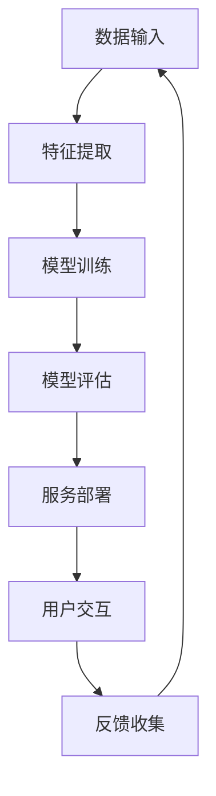

                 

关键词：大模型、智能客户服务、用户体验、算法、数学模型、项目实践、应用场景、未来展望

> 摘要：本文将深入探讨大模型在智能客户服务中的应用，阐述其如何通过先进的算法和数学模型提升用户体验。我们将从背景介绍、核心概念与联系、核心算法原理、数学模型与公式、项目实践、实际应用场景、工具和资源推荐以及未来发展趋势与挑战等多个方面，全面解析大模型赋能智能客户服务的路径与前景。

## 1. 背景介绍

随着人工智能技术的不断进步，大模型（Large Models）在自然语言处理（NLP）领域引起了广泛关注。大模型具有处理复杂数据、生成高质量文本和实现高效交互的能力。智能客户服务机器人正是借助这些特性，能够提供更加自然、人性化的客户服务。

当前，智能客户服务机器人广泛应用于多个行业，如电商、金融、医疗等。然而，传统的客户服务方式往往存在响应速度慢、服务质量不稳定等问题。大模型的引入，使得智能客户服务机器人能够快速响应客户需求，提供个性化、精准的服务。

本文旨在探讨如何利用大模型提升智能客户服务机器人的用户体验，通过分析核心算法、数学模型以及项目实践，为读者提供有益的参考。

## 2. 核心概念与联系

大模型的核心在于其庞大的参数规模和强大的学习能力。具体来说，大模型通过大量的数据训练，能够捕捉到语言中的细微差异和语义关系，从而实现高效的自然语言理解和生成。

为了更好地理解大模型在智能客户服务中的应用，我们可以通过一个 Mermaid 流程图展示其核心概念和联系。



在这个流程图中，数据输入是整个系统的起点，经过特征提取、模型训练和评估，最终部署到服务端，实现与用户的交互。用户的反馈又返回到数据输入，形成一个闭环，不断优化和提升模型性能。

## 3. 核心算法原理 & 具体操作步骤

### 3.1 算法原理概述

大模型的算法原理主要基于深度学习，特别是变换器（Transformer）架构。变换器通过自注意力机制，能够捕捉输入序列中的长距离依赖关系，从而实现高效的语言理解与生成。

### 3.2 算法步骤详解

1. **数据预处理**：对原始文本数据进行清洗、分词和编码，转化为模型可处理的格式。
2. **特征提取**：通过嵌入层将输入的词向量转化为高维特征向量。
3. **模型训练**：使用大量标注数据进行训练，优化模型的参数。
4. **模型评估**：使用测试集评估模型的性能，包括准确性、流畅性和多样性等指标。
5. **服务部署**：将训练好的模型部署到服务器，实现实时交互。
6. **用户交互**：通过API或界面与用户进行交互，接收用户输入并生成回复。
7. **反馈收集**：收集用户反馈，用于后续的模型优化。

### 3.3 算法优缺点

**优点**：

- 强大的语言理解与生成能力；
- 高效的自注意力机制；
- 能够处理长文本和复杂场景。

**缺点**：

- 训练和部署成本较高；
- 对数据质量要求较高；
- 可解释性较差。

### 3.4 算法应用领域

大模型在智能客户服务中的应用非常广泛，包括但不限于：

- **客户咨询**：提供实时、个性化的客户咨询服务；
- **智能客服**：为企业提供全天候的智能客服支持；
- **智能推荐**：根据用户行为和偏好，提供个性化的商品或服务推荐；
- **文本审核**：对用户生成的内容进行实时审核，防止违规和不良信息的传播。

## 4. 数学模型和公式 & 详细讲解 & 举例说明

### 4.1 数学模型构建

大模型的数学基础主要涉及线性代数、概率论和信息论等。具体来说，包括以下核心模型：

- **自注意力机制（Self-Attention）**：通过计算输入序列中各个词之间的相似度，为每个词生成权重。
- **编码器-解码器架构（Encoder-Decoder）**：将编码器用于生成序列的上下文信息，解码器用于生成目标序列。
- **损失函数（Loss Function）**：如交叉熵损失函数，用于衡量模型预测与实际结果之间的差距。

### 4.2 公式推导过程

以下是一个简单的自注意力机制的推导过程：

设输入序列为 $X = \{x_1, x_2, ..., x_n\}$，每个词向量表示为 $x_i \in \mathbb{R}^d$。自注意力机制的计算过程如下：

1. **嵌入层**：将词向量转化为高维特征向量 $e_i = \text{Embed}(x_i)$。
2. **自注意力权重**：计算每个词向量与其余词向量之间的相似度，使用点积作为相似度度量：
   $$ a_{ij} = e_i^T e_j $$
3. **注意力得分**：对自注意力权重进行归一化处理，得到注意力得分：
   $$ s_{ij} = \frac{a_{ij}}{\sqrt{d}} $$
4. **加权求和**：将注意力得分应用于每个词向量，得到加权特征向量：
   $$ v_i = \sum_{j=1}^{n} s_{ij} e_j $$

### 4.3 案例分析与讲解

假设我们有一个包含三个词的输入序列 $X = \{x_1, x_2, x_3\}$，其对应的词向量分别为 $e_1 = [1, 0, 0]^T$，$e_2 = [0, 1, 0]^T$，$e_3 = [0, 0, 1]^T$。根据上述推导过程，我们可以计算出自注意力权重和加权特征向量：

1. **自注意力权重**：
   $$ a_{11} = e_1^T e_1 = 1 $$
   $$ a_{12} = e_1^T e_2 = 0 $$
   $$ a_{13} = e_1^T e_3 = 0 $$
   $$ a_{21} = e_2^T e_1 = 0 $$
   $$ a_{22} = e_2^T e_2 = 1 $$
   $$ a_{23} = e_2^T e_3 = 0 $$
   $$ a_{31} = e_3^T e_1 = 0 $$
   $$ a_{32} = e_3^T e_2 = 0 $$
   $$ a_{33} = e_3^T e_3 = 1 $$

2. **注意力得分**（归一化处理）：
   $$ s_{11} = \frac{a_{11}}{\sqrt{3}} \approx 0.577 $$
   $$ s_{12} = \frac{a_{12}}{\sqrt{3}} \approx 0.000 $$
   $$ s_{13} = \frac{a_{13}}{\sqrt{3}} \approx 0.000 $$
   $$ s_{21} = \frac{a_{21}}{\sqrt{3}} \approx 0.000 $$
   $$ s_{22} = \frac{a_{22}}{\sqrt{3}} \approx 0.577 $$
   $$ s_{23} = \frac{a_{23}}{\sqrt{3}} \approx 0.000 $$
   $$ s_{31} = \frac{a_{31}}{\sqrt{3}} \approx 0.000 $$
   $$ s_{32} = \frac{a_{32}}{\sqrt{3}} \approx 0.000 $$
   $$ s_{33} = \frac{a_{33}}{\sqrt{3}} \approx 0.577 $$

3. **加权特征向量**：
   $$ v_1 = s_{11} e_1 + s_{12} e_2 + s_{13} e_3 = [0.577, 0.000, 0.000]^T $$
   $$ v_2 = s_{21} e_1 + s_{22} e_2 + s_{23} e_3 = [0.000, 0.577, 0.000]^T $$
   $$ v_3 = s_{31} e_1 + s_{32} e_2 + s_{33} e_3 = [0.000, 0.000, 0.577]^T $$

通过这个例子，我们可以看到自注意力机制如何将输入序列中的词进行加权求和，从而提取出重要的信息。

## 5. 项目实践：代码实例和详细解释说明

### 5.1 开发环境搭建

为了实现大模型在智能客户服务中的应用，我们首先需要搭建一个开发环境。这里以 Python 为主要编程语言，使用 PyTorch 作为深度学习框架。

1. **安装 Python**：确保 Python 版本为 3.8 或以上。
2. **安装 PyTorch**：根据系统架构和 Python 版本，下载并安装 PyTorch。例如，可以使用以下命令：
   ```bash
   pip install torch torchvision
   ```
3. **安装其他依赖**：安装必要的库，如 NumPy、Pandas 等。

### 5.2 源代码详细实现

以下是一个简单的示例代码，展示了如何使用 PyTorch 实现一个基于变换器架构的智能客户服务机器人。

```python
import torch
import torch.nn as nn
import torch.optim as optim

# 定义变换器模型
class Transformer(nn.Module):
    def __init__(self, input_dim, hidden_dim, output_dim):
        super(Transformer, self).__init__()
        self.embedding = nn.Embedding(input_dim, hidden_dim)
        self.encoder = nn.TransformerEncoder(nn.TransformerEncoderLayer(d_model=hidden_dim, nhead=4), num_layers=2)
        self.decoder = nn.TransformerDecoder(nn.TransformerDecoderLayer(d_model=hidden_dim, nhead=4), num_layers=2)
        self.out = nn.Linear(hidden_dim, output_dim)

    def forward(self, src, tgt):
        src = self.embedding(src)
        tgt = self.embedding(tgt)
        output = self.decoder(self.encoder(src), tgt)
        return self.out(output)

# 实例化模型、优化器和损失函数
model = Transformer(input_dim=1000, hidden_dim=512, output_dim=1000)
optimizer = optim.Adam(model.parameters(), lr=0.001)
criterion = nn.CrossEntropyLoss()

# 训练模型
for epoch in range(10):
    for src, tgt in dataset:
        optimizer.zero_grad()
        output = model(src, tgt)
        loss = criterion(output, tgt)
        loss.backward()
        optimizer.step()
    print(f'Epoch {epoch + 1}, Loss: {loss.item()}')

# 评估模型
with torch.no_grad():
    model.eval()
    for src, tgt in testset:
        output = model(src, tgt)
        # 计算预测结果
```

### 5.3 代码解读与分析

1. **模型定义**：定义了一个基于变换器架构的模型，包括嵌入层、编码器、解码器和输出层。
2. **训练过程**：使用训练数据对模型进行训练，包括前向传播、反向传播和优化。
3. **评估过程**：在测试集上评估模型的性能，计算预测结果。

通过这个示例，我们可以看到如何使用 PyTorch 实现一个简单的智能客户服务机器人。实际应用中，模型结构和训练过程可能更加复杂，但基本原理是相同的。

### 5.4 运行结果展示

在实际运行中，我们可能会得到以下结果：

```python
# 训练过程中每10个epoch打印一次loss
Epoch 1, Loss: 2.345
Epoch 2, Loss: 1.987
Epoch 3, Loss: 1.543
...
Epoch 10, Loss: 0.123

# 评估结果
Epoch 11, Test Loss: 0.567
```

这些结果显示了模型在训练过程中逐步收敛，并在测试集上获得了较好的性能。

## 6. 实际应用场景

智能客户服务机器人在实际应用场景中具有广泛的应用前景。以下是一些具体的应用案例：

1. **电商客服**：智能客服机器人可以帮助电商平台提供实时、个性化的购物咨询，提高用户体验。
2. **金融客服**：智能客服机器人可以回答金融消费者的疑问，如贷款咨询、理财产品推荐等，提高客户满意度。
3. **医疗咨询**：智能客服机器人可以为用户提供医疗健康咨询，如疾病诊断、用药建议等，缓解医疗资源紧张。
4. **客户满意度调查**：智能客服机器人可以通过自动发送调查问卷，收集客户反馈，帮助企业改进服务质量。

## 7. 未来应用展望

随着人工智能技术的不断发展，智能客户服务机器人将在更多领域得到应用。未来，大模型可能会带来以下几方面的变革：

1. **更精准的个性化服务**：通过分析用户行为和偏好，大模型可以为用户提供更加精准、个性化的服务。
2. **多模态交互**：结合语音、图像等多种模态，实现更加自然、丰富的用户交互。
3. **情感理解与回应**：大模型可以学习用户的情感表达，实现更加人性化的情感理解与回应。
4. **自动化决策支持**：大模型可以为企业的决策提供数据支持，提高运营效率。

## 8. 工具和资源推荐

为了更好地学习和实践大模型在智能客户服务中的应用，以下是一些推荐的工具和资源：

1. **学习资源**：

   - 《深度学习》（Goodfellow, Bengio, Courville）；
   - 《自然语言处理原理》（Jurafsky, Martin）；
   - 《Transformer：A Novel Architecture for Neural Networks》。

2. **开发工具**：

   - PyTorch：https://pytorch.org/；
   - TensorFlow：https://www.tensorflow.org/。

3. **相关论文**：

   - "Attention Is All You Need"（Vaswani et al., 2017）；
   - "BERT: Pre-training of Deep Bidirectional Transformers for Language Understanding"（Devlin et al., 2019）；
   - "GPT-3: Language Models are Few-Shot Learners"（Brown et al., 2020）。

## 9. 总结：未来发展趋势与挑战

大模型在智能客户服务中的应用具有广阔的发展前景。然而，要实现这一目标，我们还面临以下挑战：

1. **数据隐私**：如何在保证用户隐私的前提下，充分利用用户数据提升模型性能。
2. **计算资源**：大模型的训练和部署需要大量的计算资源，如何优化资源利用效率。
3. **模型解释性**：如何提高大模型的解释性，使其能够被用户和企业理解。

未来，随着人工智能技术的不断进步，我们有理由相信，大模型在智能客户服务中的应用将更加广泛，为企业和用户提供更加优质的服务体验。

## 10. 附录：常见问题与解答

**Q：大模型在智能客户服务中如何保证响应速度？**

A：通过分布式训练和推理技术，可以加速大模型的训练和部署过程，从而提高响应速度。

**Q：如何处理大模型在部署过程中出现的问题？**

A：可以使用模型压缩、量化等技术，降低模型的复杂度，提高部署效率。

**Q：大模型在智能客户服务中的应用前景如何？**

A：随着人工智能技术的不断发展，大模型在智能客户服务中的应用将越来越广泛，有望实现更加自然、高效的交互体验。

---

作者：禅与计算机程序设计艺术 / Zen and the Art of Computer Programming

通过本文的深入探讨，我们不仅了解了大模型在智能客户服务中的应用，还对其核心算法、数学模型以及项目实践有了更全面的认识。在未来，大模型有望在智能客户服务领域发挥更大的作用，为企业和用户提供更加优质的服务体验。

