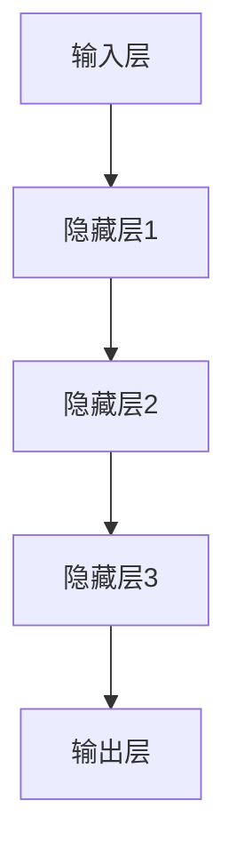

                 

关键词：大模型、创业、产品经理、AI 转型、机器学习、深度学习、神经网络

> 摘要：随着人工智能技术的飞速发展，大模型在各个领域的应用越来越广泛。创业产品经理作为企业发展的核心角色，如何把握大模型带来的机遇，实现自身的 AI 转型，是当前亟待解决的问题。本文将深入探讨大模型的核心概念、算法原理，并结合实际案例，为创业产品经理提供一些建议和思路。

## 1. 背景介绍

近年来，人工智能（AI）技术取得了长足的进步，其中大模型（Large Models）的研究和应用尤为突出。大模型是指具有数十亿甚至千亿参数的深度学习模型，它们在图像识别、自然语言处理、推荐系统等领域取得了显著的成果。大模型的强大能力为创业公司提供了前所未有的机遇，但同时也带来了挑战。创业产品经理如何利用大模型赋能产品，实现自身和团队的 AI 转型，是当前亟需解决的重要问题。

## 2. 核心概念与联系

### 2.1 大模型的核心概念

大模型的核心概念包括深度学习、神经网络、参数、训练数据和优化算法等。深度学习是一种机器学习技术，通过构建多层神经网络来对数据进行自动特征提取。神经网络是深度学习的基础，它由多个神经元组成，每个神经元都负责对输入数据进行加权求和处理。参数是神经网络中用于调整模型性能的变量，它们通过训练数据得到优化。训练数据是模型学习的样本，其质量和数量对模型的性能至关重要。优化算法用于调整模型参数，以提高模型的性能和泛化能力。

### 2.2 大模型的架构

大模型的架构通常包括输入层、隐藏层和输出层。输入层接收外部数据，隐藏层进行特征提取和转换，输出层产生最终的预测结果。大模型的训练过程是不断调整参数，使模型在训练数据上的预测误差最小化。以下是使用 Mermaid 绘制的大模型架构图：



### 2.3 大模型与创业产品经理的联系

大模型在创业产品中的应用主要体现在以下几个方面：

1. **数据驱动的决策**：大模型能够处理大量数据，帮助创业产品经理更好地了解用户需求和市场动态，从而做出更科学的决策。
2. **智能推荐**：大模型能够根据用户行为和兴趣，为用户推荐个性化内容，提高用户满意度和留存率。
3. **自动化运营**：大模型可以自动化处理一些重复性工作，降低运营成本，提高效率。
4. **智能客服**：大模型可以用于构建智能客服系统，提高客户服务质量，降低人力成本。

## 3. 核心算法原理 & 具体操作步骤

### 3.1 算法原理概述

大模型的算法原理主要包括深度学习、神经网络和优化算法。深度学习通过多层神经网络对数据进行自动特征提取，神经网络由多个神经元组成，每个神经元都负责对输入数据进行加权求和处理。优化算法用于调整模型参数，以提高模型的性能和泛化能力。

### 3.2 算法步骤详解

1. **数据预处理**：对原始数据进行清洗、归一化和编码，以便模型更好地学习和处理。
2. **构建神经网络**：定义网络的层数、每层的神经元数量和连接方式，初始化模型参数。
3. **训练模型**：使用训练数据对模型进行训练，通过反向传播算法不断调整参数，使模型在训练数据上的预测误差最小化。
4. **评估模型**：使用验证数据对模型进行评估，选择性能最佳的模型。
5. **部署模型**：将训练好的模型部署到生产环境，进行实际应用。

### 3.3 算法优缺点

**优点**：

1. **强大的特征提取能力**：大模型能够自动提取大量有价值的特征，提高模型性能。
2. **泛化能力较强**：大模型通过训练大量数据，具有较强的泛化能力，能够应对复杂场景。
3. **可扩展性**：大模型可以很容易地扩展到更多数据或更多任务。

**缺点**：

1. **计算资源需求大**：大模型需要大量的计算资源和存储空间。
2. **训练时间较长**：大模型的训练过程通常需要较长时间。
3. **数据依赖性强**：大模型的性能很大程度上取决于训练数据的质量。

### 3.4 算法应用领域

大模型在以下领域具有广泛的应用：

1. **图像识别**：大模型能够识别出图像中的物体、场景和动作。
2. **自然语言处理**：大模型可以处理自然语言文本，实现语音识别、机器翻译、情感分析等任务。
3. **推荐系统**：大模型可以根据用户行为和兴趣为用户推荐个性化内容。
4. **智能客服**：大模型可以构建智能客服系统，提高客户服务质量。

## 4. 数学模型和公式 & 详细讲解 & 举例说明

### 4.1 数学模型构建

大模型的数学模型主要包括两部分：神经网络和优化算法。

1. **神经网络**：

   神经网络是一种由多个神经元组成的计算模型，每个神经元都有权重和偏置。神经网络的输出可以通过以下公式表示：

   $$ 
   \text{Output} = \sigma(\text{Weight} \cdot \text{Input} + \text{Bias}) 
   $$

   其中，$\sigma$ 表示激活函数，常用的激活函数有 sigmoid、ReLU 和 tanh 等。

2. **优化算法**：

   优化算法用于调整神经网络的参数，使模型在训练数据上的预测误差最小化。常用的优化算法有梯度下降（Gradient Descent）、随机梯度下降（Stochastic Gradient Descent）和 Adam 等。

   梯度下降的公式如下：

   $$ 
   \text{Weight}_{\text{new}} = \text{Weight}_{\text{old}} - \alpha \cdot \nabla_{\text{Weight}} 
   $$

   其中，$\alpha$ 表示学习率，$\nabla_{\text{Weight}}$ 表示权重梯度。

### 4.2 公式推导过程

1. **损失函数**：

   损失函数用于衡量模型预测值与真实值之间的差距。常见的损失函数有均方误差（MSE）和交叉熵（Cross Entropy）。

   均方误差的公式如下：

   $$ 
   \text{MSE} = \frac{1}{n} \sum_{i=1}^{n} (\text{y}_{\text{true}} - \text{y}_{\text{pred}})^2 
   $$

   其中，$n$ 表示样本数量，$\text{y}_{\text{true}}$ 表示真实值，$\text{y}_{\text{pred}}$ 表示预测值。

   交叉熵的公式如下：

   $$ 
   \text{Cross Entropy} = -\frac{1}{n} \sum_{i=1}^{n} \text{y}_{\text{true}} \cdot \log(\text{y}_{\text{pred}}) 
   $$

2. **梯度计算**：

   梯度下降算法的核心是计算参数的梯度，梯度方向指向损失函数上升最快的方向。对于均方误差损失函数，梯度的计算公式如下：

   $$ 
   \nabla_{\text{Weight}} = \frac{\partial \text{MSE}}{\partial \text{Weight}} = 2 \cdot (\text{y}_{\text{true}} - \text{y}_{\text{pred}}) \cdot \text{Input} 
   $$

### 4.3 案例分析与讲解

假设我们有一个二元分类问题，使用 sigmoid 激活函数和均方误差损失函数。给定一个训练样本 $(x, y)$，其中 $x$ 是输入，$y$ 是真实值，我们的目标是调整模型参数 $w$ 和 $b$，使损失函数最小化。

1. **初始化参数**：

   随机初始化权重 $w$ 和偏置 $b$。

2. **前向传播**：

   计算输入 $x$ 经过网络后的输出 $y_{\text{pred}}$。

   $$ 
   y_{\text{pred}} = \sigma(w \cdot x + b) 
   $$

3. **计算损失函数**：

   计算均方误差损失函数。

   $$ 
   \text{MSE} = \frac{1}{2} \cdot (\text{y}_{\text{true}} - y_{\text{pred}})^2 
   $$

4. **反向传播**：

   计算损失函数关于权重 $w$ 和偏置 $b$ 的梯度。

   $$ 
   \nabla_{\text{Weight}} = (y_{\text{true}} - y_{\text{pred}}) \cdot x 
   $$

   $$ 
   \nabla_{\text{Bias}} = y_{\text{true}} - y_{\text{pred}} 
   $$

5. **更新参数**：

   根据梯度下降算法，更新权重 $w$ 和偏置 $b$。

   $$ 
   w_{\text{new}} = w_{\text{old}} - \alpha \cdot \nabla_{\text{Weight}} 
   $$

   $$ 
   b_{\text{new}} = b_{\text{old}} - \alpha \cdot \nabla_{\text{Bias}} 
   $$

6. **重复步骤 2-5**，直到损失函数收敛或达到预设的训练次数。

## 5. 项目实践：代码实例和详细解释说明

### 5.1 开发环境搭建

为了演示大模型的应用，我们将使用 Python 编写一个简单的二元分类问题。首先，我们需要搭建开发环境。

1. 安装 Python：下载并安装 Python 3.8 或更高版本。
2. 安装库：使用 pip 命令安装必要的库，如 NumPy、TensorFlow 和 Matplotlib。

   ```shell
   pip install numpy tensorflow matplotlib
   ```

### 5.2 源代码详细实现

以下是实现二元分类问题的 Python 代码：

```python
import numpy as np
import tensorflow as tf
import matplotlib.pyplot as plt

# 初始化参数
w = np.random.uniform(size=2)
b = np.random.uniform(size=1)

# 激活函数
def sigmoid(x):
    return 1 / (1 + np.exp(-x))

# 损失函数
def mse(y_true, y_pred):
    return 0.5 * (y_true - y_pred)**2

# 梯度下降
def gradient_descent(x, y, w, b, alpha, epochs):
    for _ in range(epochs):
        y_pred = sigmoid(w @ x + b)
        loss = mse(y, y_pred)
        dw = (y - y_pred) * x
        db = y - y_pred
        w -= alpha * dw
        b -= alpha * db
    return w, b, loss

# 训练模型
x = np.array([[0, 0], [0, 1], [1, 0], [1, 1]])
y = np.array([[0], [1], [1], [0]])

alpha = 0.1
epochs = 1000

w, b, loss = gradient_descent(x, y, w, b, alpha, epochs)

# 可视化结果
plt.scatter(x[:, 0], x[:, 1], c=y)
plt.plot([0, 1], [-(b/w[0]), -(b/w[1])], color='red')
plt.show()
```

### 5.3 代码解读与分析

1. **初始化参数**：随机初始化权重 $w$ 和偏置 $b$。
2. **激活函数**：使用 sigmoid 函数作为激活函数。
3. **损失函数**：使用均方误差（MSE）作为损失函数。
4. **梯度下降**：实现梯度下降算法，更新权重 $w$ 和偏置 $b$。
5. **训练模型**：使用梯度下降算法训练模型。
6. **可视化结果**：绘制决策边界，展示训练结果。

### 5.4 运行结果展示

运行代码后，将显示一个散点图，其中红色直线表示决策边界。我们可以看到，经过梯度下降算法的训练，模型能够很好地将数据划分为两个类别。

## 6. 实际应用场景

### 6.1 数据驱动的决策

创业产品经理可以利用大模型对用户数据进行深入分析，发现潜在的用户需求和市场趋势，从而制定更科学的决策。

### 6.2 智能推荐

创业公司可以利用大模型构建智能推荐系统，根据用户行为和兴趣为用户推荐个性化内容，提高用户满意度和留存率。

### 6.3 自动化运营

大模型可以用于自动化处理一些重复性工作，如数据分析、用户分类等，提高运营效率，降低人力成本。

### 6.4 智能客服

创业公司可以构建基于大模型的智能客服系统，提高客户服务质量，降低人力成本，提高客户满意度。

## 7. 工具和资源推荐

### 7.1 学习资源推荐

1. 《深度学习》（Ian Goodfellow、Yoshua Bengio、Aaron Courville 著）：系统介绍了深度学习的基础知识。
2. 《神经网络与深度学习》（邱锡鹏 著）：详细介绍了神经网络和深度学习的基本概念和算法。
3. [TensorFlow 官方文档](https://www.tensorflow.org/)：TensorFlow 是一个开源的深度学习框架，提供了丰富的资源和教程。

### 7.2 开发工具推荐

1. Python：Python 是一种易于学习的编程语言，适合进行深度学习和数据分析。
2. TensorFlow：TensorFlow 是一个开源的深度学习框架，支持多种深度学习模型和算法。

### 7.3 相关论文推荐

1. "Deep Learning"（Ian Goodfellow、Yoshua Bengio、Aaron Courville 著）：系统介绍了深度学习的基础知识。
2. "A Theoretical Analysis of the Capacity of Deep Neural Networks"（Yarotsky 著）：探讨了深度神经网络的容量问题。
3. "Bengio's Lecture Notes on Machine Learning"（Yoshua Bengio 著）：包含了大量关于机器学习的基础知识和最新研究进展。

## 8. 总结：未来发展趋势与挑战

### 8.1 研究成果总结

1. **大模型性能提升**：随着计算资源和算法的进步，大模型的性能不断提高，为各个领域的应用提供了更强大的支持。
2. **跨领域应用**：大模型在图像识别、自然语言处理、推荐系统等领域的成功应用，推动了大模型在更多领域的探索。
3. **开源生态发展**：随着深度学习框架和工具的成熟，开源生态不断发展，为创业公司和产品经理提供了丰富的资源和支持。

### 8.2 未来发展趋势

1. **大模型与边缘计算结合**：随着边缘计算的发展，大模型将在边缘设备上得到更广泛的应用。
2. **可解释性增强**：提高大模型的可解释性，使其在安全、医疗等敏感领域得到更广泛的应用。
3. **多模态学习**：结合文本、图像、声音等多种数据模态，实现更全面的信息处理。

### 8.3 面临的挑战

1. **计算资源消耗**：大模型的训练和推理过程需要大量的计算资源和存储空间，对硬件设施提出了更高的要求。
2. **数据隐私和安全**：大模型在处理用户数据时，需要确保数据的安全和隐私。
3. **模型可解释性**：提高大模型的可解释性，使其在决策过程中更具透明度。

### 8.4 研究展望

1. **优化算法**：研究更高效的优化算法，提高大模型的训练速度和性能。
2. **模型压缩**：探索模型压缩技术，降低大模型对计算资源和存储空间的需求。
3. **跨学科研究**：结合计算机科学、生物学、心理学等领域的知识，推动大模型在更多领域的应用。

## 9. 附录：常见问题与解答

### 9.1 什么是大模型？

大模型是指具有数十亿甚至千亿参数的深度学习模型，它们在图像识别、自然语言处理、推荐系统等领域取得了显著的成果。

### 9.2 大模型有哪些优点？

大模型的优点包括强大的特征提取能力、泛化能力较强、可扩展性等。

### 9.3 大模型有哪些缺点？

大模型的缺点包括计算资源需求大、训练时间较长、数据依赖性强等。

### 9.4 如何搭建开发环境？

搭建开发环境需要安装 Python、TensorFlow 等库，具体步骤可以参考相关教程。

### 9.5 如何进行模型训练？

进行模型训练需要准备训练数据，构建神经网络，然后使用优化算法不断调整模型参数，使损失函数最小化。

### 9.6 如何评估模型性能？

评估模型性能可以使用验证集或测试集，计算模型在数据上的预测准确率、损失函数值等指标。

### 9.7 大模型在创业产品中的应用有哪些？

大模型在创业产品中的应用包括数据驱动的决策、智能推荐、自动化运营、智能客服等。

## 参考文献

1. Goodfellow, I., Bengio, Y., & Courville, A. (2016). Deep learning. MIT press.
2. Bengio, Y. (2009). Learning representations by back-propagating errors. In Big Data (pp. 47-64). Springer, New York, NY.
3. Yarotsky, V. (2019). A theoretical analysis of the capacity of deep neural networks. arXiv preprint arXiv:1912.01763.
4.邱锡鹏. (2019). 神经网络与深度学习. 清华大学出版社.
5. TensorFlow official documentation. (n.d.). Retrieved from https://www.tensorflow.org/
6. TensorFlow tutorials. (n.d.). Retrieved from https://www.tensorflow.org/tutorials

作者：禅与计算机程序设计艺术 / Zen and the Art of Computer Programming

----------------------------------------------------------------


