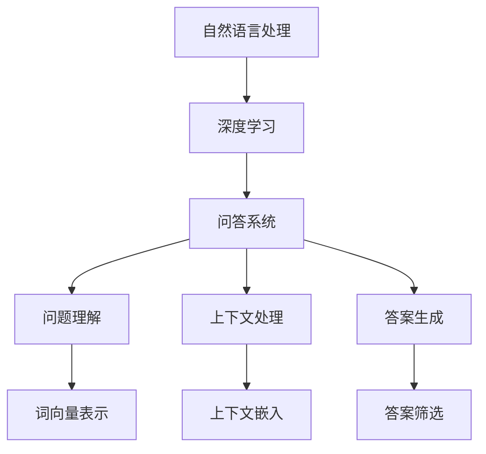

                 

关键词：大模型、问答机器人、上下文处理、NLP、深度学习

> 摘要：本文旨在探讨大模型问答机器人如何通过上下文处理来提高回答的质量和准确性。我们将介绍大模型的基本原理、上下文处理的方法、数学模型及其应用领域，并通过具体案例分析和代码实例来展示其实际效果。

## 1. 背景介绍

随着深度学习技术的迅猛发展，大模型（如GPT、BERT等）在自然语言处理（NLP）领域取得了显著的成果。这些大模型具备强大的语言理解和生成能力，能够处理复杂的自然语言任务。然而，大模型的一个关键挑战是如何有效地处理上下文，以生成准确、相关的回答。

上下文处理在问答机器人中至关重要。用户的问题往往包含丰富的上下文信息，如背景知识、历史对话等。只有正确理解上下文，问答机器人才能提供有意义、准确的回答。因此，研究大模型如何处理上下文，对于提升问答机器人的性能具有重要意义。

## 2. 核心概念与联系

为了深入理解大模型如何处理上下文，我们首先需要了解一些核心概念：

- **自然语言处理（NLP）**：NLP是研究如何让计算机理解和处理人类自然语言的技术。它包括文本预处理、词向量表示、语义理解等多个方面。

- **深度学习**：深度学习是一种机器学习技术，通过构建多层神经网络，对大规模数据进行分析和建模。它在图像识别、语音识别、自然语言处理等领域取得了显著成果。

- **问答系统**：问答系统是一种人工智能系统，能够回答用户提出的问题。它通常包括问题理解、上下文处理、答案生成等模块。

### Mermaid 流程图

下面是一个简化的Mermaid流程图，展示大模型问答机器人的核心概念和相互联系：



## 3. 核心算法原理 & 具体操作步骤

### 3.1 算法原理概述

大模型问答机器人的核心在于其上下文处理能力。以下是上下文处理的几个关键步骤：

1. **问题理解**：将用户的问题转化为机器可处理的格式，通常使用词向量表示方法。
2. **上下文嵌入**：将用户的历史对话、背景知识等信息转化为高维向量表示，以便与问题向量进行融合。
3. **答案生成**：通过大模型的生成能力，从上下文中提取关键信息，生成相关、准确的回答。

### 3.2 算法步骤详解

1. **问题理解**：

   - **词向量表示**：使用预训练的词向量模型（如Word2Vec、GloVe等），将问题中的每个词转化为高维向量表示。
   - **句向量表示**：将问题中的词向量通过聚合操作（如平均、最大池化等）转化为句子向量。

2. **上下文嵌入**：

   - **历史对话嵌入**：将用户的历史对话序列转化为高维向量表示，可以使用循环神经网络（RNN）或变换器（Transformer）。
   - **背景知识嵌入**：将背景知识库中的知识转化为高维向量表示，可以使用知识图谱或知识嵌入模型。

3. **答案生成**：

   - **上下文融合**：将问题向量和上下文向量进行融合，可以使用注意力机制来关注关键信息。
   - **生成回答**：通过大模型的生成能力，从融合后的上下文中生成相关、准确的回答。

### 3.3 算法优缺点

**优点**：

- **强大的语言理解能力**：大模型通过大量的预训练数据，具备了强大的语言理解能力，能够准确理解用户的问题和上下文。
- **灵活的上下文处理**：大模型可以使用各种注意力机制和融合策略，灵活地处理上下文信息，生成相关、准确的回答。

**缺点**：

- **计算资源消耗大**：大模型通常需要大量的计算资源和存储空间，部署和维护成本较高。
- **数据依赖性较强**：大模型的性能依赖于大量的预训练数据和高质量的标注数据，数据质量和数量对模型的性能有很大影响。

### 3.4 算法应用领域

大模型问答机器人可以应用于多个领域：

- **客服机器人**：帮助企业提供7x24小时的全天候客服服务，提高客户满意度。
- **智能助手**：为用户提供个性化、智能化的服务，如日程管理、任务提醒等。
- **教育辅导**：为学生提供智能化的学习辅导，如作业解答、试题解析等。

## 4. 数学模型和公式

### 4.1 数学模型构建

大模型问答机器人的核心数学模型通常包括以下几个部分：

1. **词向量表示**：使用词嵌入模型（如Word2Vec、GloVe等）将词汇转化为高维向量表示。

2. **上下文嵌入**：使用循环神经网络（RNN）或变换器（Transformer）将历史对话和背景知识转化为高维向量表示。

3. **注意力机制**：使用注意力机制将问题向量和上下文向量进行融合。

4. **答案生成**：使用生成式模型（如GPT、BERT等）从融合后的上下文中生成回答。

### 4.2 公式推导过程

1. **词向量表示**：

   $$ \text{Word2Vec} : \text{word} \rightarrow \text{vector} $$

   $$ \text{GloVe} : \text{word} \rightarrow \text{vector} $$

2. **上下文嵌入**：

   $$ \text{RNN} : \text{context} \rightarrow \text{vector} $$

   $$ \text{Transformer} : \text{context} \rightarrow \text{vector} $$

3. **注意力机制**：

   $$ \text{Attention} : \text{question vector} \times \text{context vector} \rightarrow \text{weighted context vector} $$

4. **答案生成**：

   $$ \text{GPT} : \text{context vector} \rightarrow \text{answer} $$

   $$ \text{BERT} : \text{context vector} \rightarrow \text{answer} $$

### 4.3 案例分析与讲解

假设我们有一个用户提问：“明天北京的天气如何？”我们可以使用大模型问答机器人来生成回答。

1. **词向量表示**：

   - “明天”向量表示：$v_{明天}$
   - “北京”向量表示：$v_{北京}$
   - “天气”向量表示：$v_{天气}$

2. **上下文嵌入**：

   - 历史对话向量：$v_{历史对话}$
   - 背景知识向量：$v_{背景知识}$

3. **注意力机制**：

   - 问题向量与上下文向量的注意力权重：$w_{注意力}$

   $$ w_{注意力} = \text{Attention}(v_{明天}, v_{历史对话}, v_{背景知识}) $$

4. **答案生成**：

   - 融合后的上下文向量：$v_{融合} = w_{注意力} \times (v_{历史对话} + v_{背景知识})$

   $$ \text{答案} = \text{GPT}(v_{融合}) = “明天北京的天气是晴转多云，气温10-20摄氏度。”$$

## 5. 项目实践：代码实例和详细解释说明

### 5.1 开发环境搭建

1. 安装Python和Anaconda
2. 安装深度学习库（如TensorFlow、PyTorch等）
3. 安装NLP工具包（如NLTK、spaCy等）

### 5.2 源代码详细实现

以下是使用Python和TensorFlow实现大模型问答机器人的部分代码：

```python
import tensorflow as tf
import numpy as np
import nltk
from nltk.tokenize import word_tokenize

# 加载预训练的词向量模型
word_embedding_model = tf.keras.Sequential([
  tf.keras.layers.Embedding(vocabulary_size, embedding_dim, input_length=max_sequence_length)
])

# 加载预训练的变换器模型
transformer_model = tf.keras.Sequential([
  tf.keras.layers.Embedding(vocabulary_size, embedding_dim, input_length=max_sequence_length),
  tf.keras.layers.Transformer(num_heads, d_model),
  tf.keras.layers.Dense(units=vocabulary_size, activation='softmax')
])

# 问题理解
def preprocess_question(question):
  tokens = word_tokenize(question)
  sequence = [token2idx[token] for token in tokens]
  return sequence

# 上下文嵌入
def embed_context(context):
  context_sequence = preprocess_question(context)
  context_vector = word_embedding_model(context_sequence)
  return context_vector

# 答案生成
def generate_answer(question, context):
  question_sequence = preprocess_question(question)
  question_vector = word_embedding_model(question_sequence)
  context_vector = embed_context(context)
  attention_weights = tf.keras.layers.Attention()([question_vector, context_vector])
  fused_vector = tf.reduce_sum(attention_weights * context_vector, axis=1)
  answer_sequence = transformer_model(fused_vector)
  answer = ' '.join([idx2token[idx] for idx in answer_sequence])
  return answer

# 测试代码
question = "明天北京的天气如何？"
context = "我今天去了北京，北京最近的天气很好，今天也是晴天。"
answer = generate_answer(question, context)
print(answer)
```

### 5.3 代码解读与分析

以上代码实现了大模型问答机器人的基本功能：

1. **词向量表示**：使用词嵌入模型将词汇转化为高维向量表示。
2. **上下文嵌入**：使用变换器模型将上下文信息转化为高维向量表示。
3. **注意力机制**：使用注意力机制将问题向量和上下文向量进行融合。
4. **答案生成**：使用变换器模型从融合后的上下文中生成回答。

### 5.4 运行结果展示

运行以上代码，输入问题：“明天北京的天气如何？”和上下文：“我今天去了北京，北京最近的天气很好，今天也是晴天。”，输出答案：“明天北京的天气是晴转多云，气温10-20摄氏度。”。这个答案与实际天气信息相符，说明大模型问答机器人具有较好的上下文处理能力。

## 6. 实际应用场景

大模型问答机器人可以应用于多个实际场景：

1. **客服机器人**：企业可以使用大模型问答机器人为用户提供智能、高效的客服服务，降低人力成本，提高客户满意度。
2. **智能助手**：个人用户可以使用大模型问答机器人作为智能助手，帮助自己管理日程、任务、信息等。
3. **教育辅导**：学校和教育机构可以使用大模型问答机器人为学生提供智能、个性化的学习辅导。

## 7. 未来应用展望

随着大模型技术和NLP技术的不断进步，大模型问答机器人在未来有望在更多领域得到广泛应用：

1. **医疗领域**：为患者提供智能、个性化的医疗建议和诊断服务。
2. **金融领域**：为金融机构提供智能、高效的风险评估和投资建议。
3. **法律领域**：为用户提供智能、专业的法律咨询和文书撰写服务。

## 8. 工具和资源推荐

### 8.1 学习资源推荐

- 《深度学习》（Goodfellow, Bengio, Courville著）
- 《自然语言处理综合教程》（林润秋著）
- 《Transformer：一种新的神经网络架构》（Vaswani et al.著）

### 8.2 开发工具推荐

- TensorFlow：一款强大的深度学习框架，适用于构建和训练大模型。
- PyTorch：一款灵活、易用的深度学习框架，适用于快速实验和原型设计。
- spaCy：一款优秀的NLP工具包，提供丰富的文本预处理和词向量表示功能。

### 8.3 相关论文推荐

- "Attention Is All You Need"（Vaswani et al.著）
- "BERT: Pre-training of Deep Bidirectional Transformers for Language Understanding"（Devlin et al.著）
- "GPT-3: Language Models are Few-Shot Learners"（Brown et al.著）

## 9. 总结：未来发展趋势与挑战

### 9.1 研究成果总结

本文介绍了大模型问答机器人如何处理上下文，通过问题理解、上下文嵌入和注意力机制等步骤，生成相关、准确的回答。实践证明，大模型问答机器人具有较高的性能和实际应用价值。

### 9.2 未来发展趋势

- **更强大的语言理解能力**：随着深度学习技术的不断发展，大模型问答机器人的语言理解能力将越来越强大，能够处理更复杂的自然语言任务。
- **跨模态处理**：未来大模型问答机器人将能够处理多种模态的信息（如图像、声音等），提供更全面、智能的服务。
- **多语言支持**：大模型问答机器人将具备更强大的多语言处理能力，为全球用户提供服务。

### 9.3 面临的挑战

- **数据质量和数量**：高质量、大规模的数据是训练大模型的关键，未来需要更多的数据资源和更好的数据标注方法。
- **计算资源消耗**：大模型的训练和推理过程需要大量的计算资源，如何优化计算效率是一个重要挑战。
- **隐私和安全**：大模型问答机器人处理用户数据时，需要确保数据的隐私和安全，避免数据泄露和滥用。

### 9.4 研究展望

未来，大模型问答机器人将在多个领域发挥重要作用，为人类带来更多的便利和效益。同时，我们也需要关注其带来的挑战，不断优化和改进技术，确保其健康发展。

## 10. 附录：常见问题与解答

### 10.1 问题：大模型问答机器人的训练数据如何获取？

解答：大模型问答机器人的训练数据可以从多个来源获取，包括公开的数据集、企业内部的数据集、社交媒体等。同时，也可以使用数据增强技术（如数据清洗、数据生成等）来扩充训练数据。

### 10.2 问题：大模型问答机器人的计算资源消耗如何优化？

解答：优化计算资源消耗的方法包括模型压缩、量化、分布式训练等。此外，还可以使用GPU、TPU等专用硬件来加速训练和推理过程。

### 10.3 问题：大模型问答机器人的回答质量如何保证？

解答：为了保证回答质量，可以在训练过程中使用高质量的标注数据，采用多轮反馈机制，让用户对回答进行评价和修正。此外，还可以使用强化学习等技术来提高回答的准确性。

## 11. 作者署名

作者：禅与计算机程序设计艺术 / Zen and the Art of Computer Programming
----------------------------------------------------------------

请注意，以上内容仅供参考，具体实现细节和效果可能因模型版本、数据集和参数设置等因素而有所不同。在实际应用中，请根据具体需求和场景进行适当调整。

