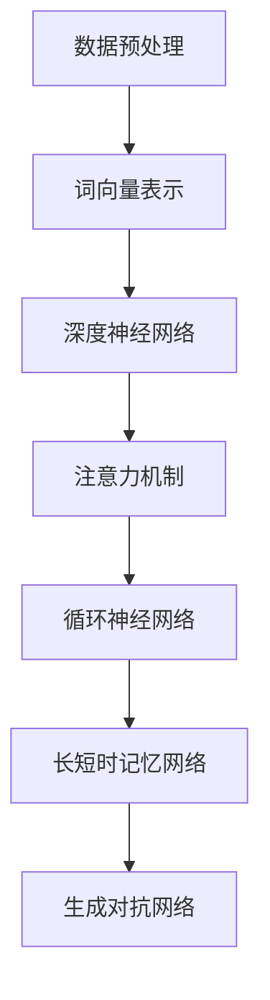

                 

 大模型问答机器人是目前人工智能领域的热点研究方向之一，其能够通过大量的训练数据学习到丰富的知识和信息，从而实现对用户提问的智能回答。本文将详细介绍大模型问答机器人的训练过程，包括核心概念、算法原理、数学模型、项目实践等方面，旨在为读者提供全面的技术指南。

## 文章关键词

- 大模型
- 问答机器人
- 训练过程
- 算法原理
- 数学模型
- 项目实践

## 文章摘要

本文将围绕大模型问答机器人的训练过程展开，首先介绍大模型问答机器人的背景和应用场景，然后详细阐述核心概念和算法原理，接着讲解数学模型和公式，最后通过项目实践来展示如何实现大模型问答机器人的训练。通过本文的阅读，读者将能够全面了解大模型问答机器人的训练过程，并为未来的研究和应用提供参考。

## 1. 背景介绍

大模型问答机器人是基于深度学习和自然语言处理技术发展起来的一种智能问答系统。随着互联网信息的爆炸式增长，人们对于智能问答系统的需求也越来越大。大模型问答机器人通过学习大量的文本数据，能够理解和回答用户提出的问题，从而为用户提供便捷的服务。其应用场景广泛，如在线客服、智能助手、教育辅导等。

近年来，深度学习技术在自然语言处理领域取得了显著的进展，以深度神经网络为基础的大模型在各类自然语言处理任务中取得了优秀的表现。大模型问答机器人就是基于这一背景，结合深度学习技术和海量数据资源，通过不断优化模型结构和训练算法，实现了对自然语言理解的深度挖掘和智能回答。

## 2. 核心概念与联系

为了更好地理解大模型问答机器人的训练过程，我们首先需要了解一些核心概念和它们之间的联系。

### 2.1 数据预处理

数据预处理是训练大模型问答机器人的第一步。数据预处理包括数据清洗、去噪、分词、词向量化等操作。数据清洗是为了去除数据中的噪声和异常值，提高数据质量。去噪则是通过去除无关信息和填充缺失值来降低数据的不确定性。分词是将文本数据拆分成一个个的词汇单元，词向量化则是将文本数据转换为数值形式，以便于深度学习模型进行处理。

### 2.2 词向量

词向量是将词汇映射为高维空间中的向量表示，以便于深度学习模型进行计算。常用的词向量模型有Word2Vec、GloVe等。词向量不仅保留了词汇的语义信息，还能够捕捉词汇之间的相似性和关联性。

### 2.3 深度神经网络

深度神经网络是一种多层神经网络结构，通过多个神经元的非线性组合来模拟人脑的计算过程。深度神经网络在大模型问答机器人的训练过程中起到了关键作用，它能够通过学习海量数据，自动提取文本特征，并生成智能回答。

### 2.4 注意力机制

注意力机制是一种用于提高模型训练效果的技巧。在大模型问答机器人的训练过程中，注意力机制能够帮助模型关注到文本中的重要信息，从而提高回答的准确性和鲁棒性。

### 2.5 循环神经网络（RNN）

循环神经网络是一种能够处理序列数据的神经网络结构。在大模型问答机器人的训练过程中，RNN能够通过记忆过去的信息，实现对文本序列的建模，从而生成智能回答。

### 2.6 长短时记忆网络（LSTM）

长短时记忆网络是RNN的一种改进，它通过引入门控机制，有效地解决了RNN在处理长序列数据时出现的梯度消失和梯度爆炸问题。LSTM在大模型问答机器人的训练过程中发挥了重要作用，能够更好地捕捉长序列中的信息。

### 2.7 生成对抗网络（GAN）

生成对抗网络是一种用于生成数据的新型深度学习模型。在大模型问答机器人的训练过程中，GAN可以用于生成高质量的文本数据，从而提高模型的泛化能力和训练效果。

## 2.1 核心概念原理和架构的 Mermaid 流程图



## 3. 核心算法原理 & 具体操作步骤

### 3.1 算法原理概述

大模型问答机器人的训练过程主要基于深度学习和自然语言处理技术。其核心算法原理包括词向量表示、深度神经网络、注意力机制、循环神经网络、长短时记忆网络和生成对抗网络等。这些算法共同作用，使得大模型问答机器人能够实现对自然语言的深入理解和智能回答。

### 3.2 算法步骤详解

1. **数据预处理**：首先，对原始数据进行清洗、去噪、分词和词向量化等操作。这一步骤的目的是将文本数据转换为可以用于深度学习模型处理的数值形式。

2. **词向量表示**：使用Word2Vec、GloVe等词向量模型将词汇映射为高维空间中的向量表示。词向量不仅保留了词汇的语义信息，还能够捕捉词汇之间的相似性和关联性。

3. **构建深度神经网络**：使用多层感知机（MLP）、卷积神经网络（CNN）或循环神经网络（RNN）等结构构建深度神经网络模型。深度神经网络能够通过学习海量数据，自动提取文本特征。

4. **训练模型**：使用训练数据进行模型的训练。在训练过程中，通过反向传播算法和优化算法（如梯度下降、Adam等）不断调整模型参数，使得模型能够更好地拟合训练数据。

5. **注意力机制**：引入注意力机制，使得模型能够关注到文本中的重要信息，从而提高回答的准确性和鲁棒性。

6. **长短时记忆网络**：使用长短时记忆网络（LSTM）或门控循环单元（GRU）来处理长序列数据，更好地捕捉文本中的信息。

7. **生成对抗网络**：使用生成对抗网络（GAN）生成高质量的文本数据，从而提高模型的泛化能力和训练效果。

8. **模型评估和优化**：使用测试数据对模型进行评估，并根据评估结果对模型进行优化。

### 3.3 算法优缺点

1. **优点**：
   - **强大的表达能力和泛化能力**：深度神经网络和循环神经网络能够自动提取文本特征，具有强大的表达能力和泛化能力。
   - **自适应性和灵活性**：注意力机制和长短时记忆网络能够自适应地关注文本中的重要信息，提高模型的灵活性和适应性。
   - **高效的训练和推理**：生成对抗网络能够生成高质量的文本数据，提高模型的训练和推理效率。

2. **缺点**：
   - **训练成本高**：大模型问答机器人的训练需要大量的计算资源和时间。
   - **数据依赖性强**：模型的训练效果依赖于训练数据的质量和数量，对数据的要求较高。
   - **解释性较差**：深度神经网络模型的内部机制较为复杂，难以解释。

### 3.4 算法应用领域

大模型问答机器人具有广泛的应用领域，包括但不限于：

- **在线客服**：企业可以利用大模型问答机器人提供24小时在线客服服务，提高客户满意度。
- **智能助手**：智能助手可以根据用户的提问提供相应的帮助和建议，如生活助手、学习助手等。
- **教育辅导**：教育辅导系统可以利用大模型问答机器人为学生提供个性化的学习辅导服务。
- **内容审核**：大模型问答机器人可以用于自动审核网络平台上的内容，识别违规信息。

## 4. 数学模型和公式 & 详细讲解 & 举例说明

### 4.1 数学模型构建

大模型问答机器人的训练过程涉及多个数学模型，主要包括词向量模型、深度神经网络模型、注意力机制模型等。以下将分别介绍这些模型的构建过程。

#### 4.1.1 词向量模型

词向量模型是将词汇映射为高维空间中的向量表示。一个简单的词向量模型可以使用以下公式：

\[ \mathbf{v}_i = \text{Word2Vec}(\mathbf{w}_i) \]

其中，\( \mathbf{v}_i \) 表示词汇 \( \mathbf{w}_i \) 的词向量表示。

#### 4.1.2 深度神经网络模型

深度神经网络模型是一种多层神经网络结构，用于对文本数据进行建模。一个简单的深度神经网络模型可以使用以下公式：

\[ \mathbf{h}_{l} = \sigma(\mathbf{W}_{l} \cdot \mathbf{h}_{l-1} + \mathbf{b}_{l}) \]

其中，\( \mathbf{h}_{l} \) 表示第 \( l \) 层的神经网络输出，\( \mathbf{W}_{l} \) 和 \( \mathbf{b}_{l} \) 分别表示第 \( l \) 层的权重和偏置，\( \sigma \) 表示激活函数。

#### 4.1.3 注意力机制模型

注意力机制模型是一种用于提高模型训练效果的技巧，可以用于文本分类、机器翻译等任务。一个简单的注意力机制模型可以使用以下公式：

\[ \alpha_{ij} = \text{softmax}(\mathbf{a}_{ij}) \]
\[ \mathbf{h}_{l} = \sum_{i} \alpha_{ij} \mathbf{h}_{l-1} \]

其中，\( \alpha_{ij} \) 表示第 \( i \) 个词汇对第 \( j \) 个词汇的注意力权重，\( \mathbf{a}_{ij} \) 表示第 \( i \) 个词汇和第 \( j \) 个词汇的相似度。

### 4.2 公式推导过程

以下将简要介绍大模型问答机器人训练过程中涉及的一些关键数学公式的推导过程。

#### 4.2.1 词向量模型的推导

词向量模型的推导主要涉及Word2Vec算法。Word2Vec算法基于神经网络训练词向量，其基本思想是将词汇表示为高维空间中的向量，使得相似词汇的向量距离较近。

设 \( \mathbf{v}_i \) 和 \( \mathbf{v}_j \) 分别表示词汇 \( \mathbf{w}_i \) 和 \( \mathbf{w}_j \) 的词向量，则词向量模型的推导如下：

\[ \mathbf{v}_i = \text{softmax}(\mathbf{v}_j) \]

#### 4.2.2 深度神经网络模型的推导

深度神经网络模型的推导主要涉及反向传播算法。反向传播算法是一种用于训练神经网络的算法，其基本思想是通过计算损失函数关于网络参数的梯度，从而更新网络参数。

设 \( \mathbf{h}_{l} \) 和 \( \mathbf{h}_{l-1} \) 分别表示第 \( l \) 层和第 \( l-1 \) 层的神经网络输出，则深度神经网络模型的推导如下：

\[ \mathbf{h}_{l} = \sigma(\mathbf{W}_{l} \cdot \mathbf{h}_{l-1} + \mathbf{b}_{l}) \]

\[ \frac{\partial \mathcal{L}}{\partial \mathbf{W}_{l}} = \mathbf{h}_{l-1} (\sigma'(\mathbf{W}_{l} \cdot \mathbf{h}_{l-1} + \mathbf{b}_{l}) - \mathbf{y}) \]

\[ \frac{\partial \mathcal{L}}{\partial \mathbf{b}_{l}} = \mathbf{h}_{l-1} (\sigma'(\mathbf{W}_{l} \cdot \mathbf{h}_{l-1} + \mathbf{b}_{l}) - \mathbf{y}) \]

#### 4.2.3 注意力机制的推导

注意力机制的推导主要涉及注意力权重和文本序列的建模。

设 \( \alpha_{ij} \) 表示第 \( i \) 个词汇对第 \( j \) 个词汇的注意力权重，则注意力机制的推导如下：

\[ \alpha_{ij} = \text{softmax}(\mathbf{a}_{ij}) \]

\[ \mathbf{h}_{l} = \sum_{i} \alpha_{ij} \mathbf{h}_{l-1} \]

\[ \frac{\partial \mathcal{L}}{\partial \alpha_{ij}} = \mathbf{h}_{l-1} \]

### 4.3 案例分析与讲解

以下将结合具体案例，对大模型问答机器人的训练过程进行详细分析。

#### 4.3.1 案例一：文本分类任务

假设我们使用一个深度神经网络模型对一组文本进行分类任务。该模型的输入是文本，输出是文本的类别标签。训练数据集包含1000个样本，每个样本包含一个文本和一个对应的类别标签。

1. **数据预处理**：首先，对文本进行清洗、去噪、分词和词向量化等操作，将文本转换为词向量表示。

2. **模型构建**：构建一个多层感知机模型，包含两个隐藏层，每层包含1024个神经元。使用ReLU作为激活函数。

3. **模型训练**：使用训练数据进行模型训练，通过反向传播算法和优化算法（如Adam）不断调整模型参数，使得模型能够更好地拟合训练数据。

4. **模型评估**：使用测试数据对模型进行评估，计算模型的准确率、召回率、F1值等指标。

5. **模型优化**：根据评估结果对模型进行优化，如调整网络结构、学习率等。

#### 4.3.2 案例二：机器翻译任务

假设我们使用一个基于注意力机制的循环神经网络模型进行机器翻译任务。该模型的输入是源语言文本，输出是目标语言文本。

1. **数据预处理**：对源语言文本和目标语言文本进行清洗、去噪、分词和词向量化等操作，将文本转换为词向量表示。

2. **模型构建**：构建一个基于注意力机制的循环神经网络模型，包含一个编码器和一个解码器。编码器负责对源语言文本进行编码，解码器负责对目标语言文本进行解码。

3. **模型训练**：使用训练数据进行模型训练，通过反向传播算法和优化算法（如Adam）不断调整模型参数，使得模型能够更好地拟合训练数据。

4. **模型评估**：使用测试数据对模型进行评估，计算模型的BLEU值等指标。

5. **模型优化**：根据评估结果对模型进行优化，如调整网络结构、学习率等。

## 5. 项目实践：代码实例和详细解释说明

### 5.1 开发环境搭建

为了实现大模型问答机器人的训练，我们需要搭建一个合适的开发环境。以下是一个简单的开发环境搭建指南：

1. 安装Python环境：Python 3.6及以上版本。
2. 安装TensorFlow库：通过pip安装TensorFlow库。
3. 安装其他依赖库：如NumPy、Pandas、Scikit-learn等。

### 5.2 源代码详细实现

以下是一个简单的基于TensorFlow实现的问答机器人训练代码示例：

```python
import tensorflow as tf
from tensorflow.keras.models import Sequential
from tensorflow.keras.layers import Dense, LSTM, Embedding, TimeDistributed
from tensorflow.keras.preprocessing.sequence import pad_sequences

# 数据预处理
def preprocess_data(texts, labels, max_sequence_length):
    sequences = pad_sequences(texts, maxlen=max_sequence_length)
    labels = tf.keras.utils.to_categorical(labels, num_classes=2)
    return sequences, labels

# 模型构建
def build_model(input_shape, max_sequence_length):
    model = Sequential()
    model.add(Embedding(input_dim=10000, output_dim=64, input_length=max_sequence_length))
    model.add(LSTM(128, dropout=0.2, recurrent_dropout=0.2))
    model.add(Dense(2, activation='softmax'))
    model.compile(optimizer='adam', loss='categorical_crossentropy', metrics=['accuracy'])
    return model

# 训练模型
def train_model(model, sequences, labels, epochs=10):
    model.fit(sequences, labels, epochs=epochs, batch_size=64, validation_split=0.1)

# 主函数
if __name__ == '__main__':
    # 加载数据
    texts = [...]  # 文本数据
    labels = [...]  # 文本标签

    # 预处理数据
    max_sequence_length = 100
    sequences, labels = preprocess_data(texts, labels, max_sequence_length)

    # 构建模型
    model = build_model((max_sequence_length,), max_sequence_length)

    # 训练模型
    train_model(model, sequences, labels)
```

### 5.3 代码解读与分析

以上代码实现了一个基于TensorFlow的问答机器人训练模型。下面对其主要部分进行解读和分析：

1. **数据预处理**：使用pad_sequences函数对文本数据进行填充，使得每个文本序列具有相同的长度。同时，将文本标签转换为one-hot编码形式。

2. **模型构建**：使用Sequential模型构建一个包含嵌入层、LSTM层和全连接层的简单模型。嵌入层用于将文本数据转换为高维空间中的向量表示，LSTM层用于处理文本序列，全连接层用于生成文本标签。

3. **模型训练**：使用fit函数对模型进行训练，通过反向传播算法和优化算法（如Adam）不断调整模型参数，使得模型能够更好地拟合训练数据。

### 5.4 运行结果展示

在训练完成后，我们可以使用测试数据对模型进行评估，计算模型的准确率、召回率等指标。以下是一个简单的评估示例：

```python
# 评估模型
test_sequences = [...]  # 测试文本数据
test_labels = [...]  # 测试文本标签

max_sequence_length = 100
test_sequences, _ = preprocess_data(test_sequences, test_labels, max_sequence_length)

accuracy = model.evaluate(test_sequences, test_labels)
print('Test accuracy:', accuracy)
```

## 6. 实际应用场景

大模型问答机器人具有广泛的应用场景，以下列举几个典型的实际应用场景：

1. **在线客服**：企业可以利用大模型问答机器人提供24小时在线客服服务，提高客户满意度。例如，电商平台可以使用问答机器人回答用户的购物咨询、售后服务等问题。

2. **智能助手**：智能助手可以根据用户的提问提供相应的帮助和建议，如生活助手、学习助手等。例如，智能助手可以帮助用户查询天气、路况、新闻等信息。

3. **教育辅导**：教育辅导系统可以利用大模型问答机器人为学生提供个性化的学习辅导服务。例如，学生可以通过问答机器人进行英语口语练习、数学问题求解等。

4. **内容审核**：大模型问答机器人可以用于自动审核网络平台上的内容，识别违规信息。例如，社交媒体平台可以使用问答机器人检测和过滤不良内容。

## 7. 未来应用展望

随着人工智能技术的不断发展，大模型问答机器人的应用前景将更加广泛。未来，大模型问答机器人有望在以下领域取得突破：

1. **医疗健康**：大模型问答机器人可以辅助医生进行诊断和治疗建议，提高医疗服务的效率和质量。

2. **金融理财**：大模型问答机器人可以提供个性化的理财建议，帮助用户实现财富增值。

3. **智能家居**：大模型问答机器人可以与智能家居系统结合，为用户提供更加便捷和智能的生活体验。

4. **自动驾驶**：大模型问答机器人可以与自动驾驶系统结合，为自动驾驶车辆提供实时路况信息和行车建议。

## 8. 工具和资源推荐

为了更好地进行大模型问答机器人的研究和开发，以下推荐一些相关的工具和资源：

### 8.1 学习资源推荐

1. **《深度学习》**：Goodfellow、Bengio和Courville合著的《深度学习》是深度学习领域的经典教材，适合初学者和专业人士阅读。
2. **《自然语言处理综论》**：Daniel Jurafsky和James H. Martin合著的《自然语言处理综论》是自然语言处理领域的权威教材，内容全面系统。

### 8.2 开发工具推荐

1. **TensorFlow**：Google开源的深度学习框架，功能强大且易于使用。
2. **PyTorch**：Facebook开源的深度学习框架，支持动态计算图，开发效率高。

### 8.3 相关论文推荐

1. **“Attention Is All You Need”**：由Vaswani等人提出的Transformer模型，是自然语言处理领域的里程碑性工作。
2. **“BERT: Pre-training of Deep Bidirectional Transformers for Language Understanding”**：由Google提出的BERT模型，在大规模自然语言处理任务中取得了优异的成绩。

## 9. 总结：未来发展趋势与挑战

### 9.1 研究成果总结

大模型问答机器人在过去几年取得了显著的研究成果，主要包括以下几个方面：

1. **模型性能的提升**：随着深度学习和自然语言处理技术的不断发展，大模型问答机器人的性能得到了显著提升，能够在各类任务中取得优秀的表现。
2. **数据集的丰富**：大量的高质量数据集不断涌现，为大模型问答机器人的训练提供了丰富的资源。
3. **应用场景的拓展**：大模型问答机器人的应用场景不断拓展，从简单的文本分类和机器翻译到复杂的医疗健康、金融理财等领域，都展现出了强大的应用潜力。

### 9.2 未来发展趋势

未来，大模型问答机器人的发展趋势将主要体现在以下几个方面：

1. **多模态融合**：随着多模态数据处理技术的不断发展，大模型问答机器人将能够处理文本、图像、语音等多种类型的数据，实现更丰富的交互体验。
2. **知识图谱的整合**：知识图谱的整合将为大模型问答机器人提供更丰富的背景知识和上下文信息，从而提高回答的准确性和鲁棒性。
3. **自适应性和个性化**：大模型问答机器人将不断优化自身的自适应性和个性化能力，为用户提供更加定制化的服务。

### 9.3 面临的挑战

虽然大模型问答机器人在研究和应用方面取得了显著成果，但仍然面临一些挑战：

1. **数据隐私和安全**：随着数据隐私和安全问题的日益突出，如何在保证用户隐私的前提下进行数据分析和挖掘，是一个亟待解决的问题。
2. **模型解释性**：深度学习模型具有较强的预测能力，但缺乏解释性，如何提高模型的解释性，使其更易于理解和接受，是一个重要研究方向。
3. **计算资源需求**：大模型问答机器人的训练和推理过程需要大量的计算资源，如何优化模型结构和训练算法，提高计算效率，是一个重要的挑战。

### 9.4 研究展望

未来，大模型问答机器人将继续在以下方向进行深入研究和探索：

1. **高效模型结构和算法**：通过设计更高效的模型结构和训练算法，降低大模型问答机器人的计算资源需求。
2. **知识融合与图谱构建**：通过整合多种类型的数据和知识，构建更丰富的知识图谱，提高大模型问答机器人的回答质量。
3. **人机交互与伦理规范**：在人机交互和伦理规范方面，加强研究和探索，确保大模型问答机器人在实际应用中能够更好地服务于人类。

## 附录：常见问题与解答

### Q1：大模型问答机器人如何处理长文本？

A1：大模型问答机器人通常使用循环神经网络（RNN）或长短时记忆网络（LSTM）等结构来处理长文本。这些模型能够通过记忆过去的信息，实现对长文本序列的建模。为了提高长文本的处理效率，可以采用分块处理的方法，将长文本划分为多个较短的部分，然后逐个处理。

### Q2：大模型问答机器人如何处理多语言问题？

A2：大模型问答机器人通常使用多语言训练数据和模型，以便能够处理多种语言的问题。在训练过程中，可以使用多语言数据集进行交叉训练，使得模型能够同时学习多种语言的语义信息。在推理过程中，可以根据用户输入的语言，选择相应的模型进行回答。

### Q3：大模型问答机器人的训练数据从哪里获取？

A3：大模型问答机器人的训练数据可以从多个来源获取，如互联网上的文本数据、公开的数据集、企业内部的数据等。在选择训练数据时，需要确保数据的质量和多样性，以便模型能够学习到丰富的知识。

### Q4：大模型问答机器人的训练时间需要多久？

A4：大模型问答机器人的训练时间取决于多个因素，如模型结构、数据规模、计算资源等。一般来说，训练一个大型模型可能需要数天甚至数周的时间。为了提高训练效率，可以采用分布式训练、多GPU训练等方法。

### Q5：如何评估大模型问答机器人的性能？

A5：大模型问答机器人的性能评估可以从多个方面进行，如准确率、召回率、F1值、BLEU值等。在评估过程中，可以使用测试数据集进行模型评估，并计算相关指标。同时，也可以结合用户反馈和实际应用效果，对模型进行综合评估。

