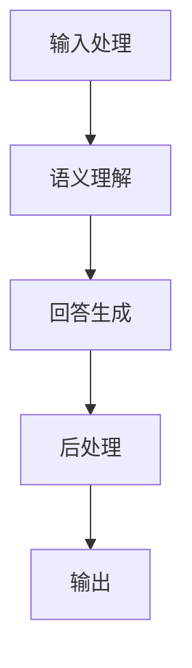

                 

关键词：大模型，问答机器人，回答优化，自然语言处理，算法，数学模型，实践

> 摘要：本文旨在探讨大模型问答机器人的回答优化问题，从核心概念、算法原理、数学模型到实际应用场景，全方位解析如何提升大模型问答机器人的回答质量。本文将详细阐述优化策略、工具和资源，以期为相关领域的研究者和开发者提供有价值的参考。

## 1. 背景介绍

随着人工智能技术的飞速发展，自然语言处理（NLP）逐渐成为热点领域。在NLP中，问答系统作为一种重要的应用场景，得到了广泛关注。问答系统旨在通过计算机程序对用户提出的问题给出准确、合理的回答。然而，当前的大模型问答机器人在回答质量上仍存在诸多问题，如回答不准确、不相关或过于模糊等。因此，如何优化大模型问答机器人的回答质量成为了一个重要的研究课题。

本文将围绕以下问题展开讨论：大模型问答机器人面临哪些挑战？如何通过算法和数学模型优化回答质量？实际应用中如何实现这些优化策略？以及未来如何进一步发展这一领域。

## 2. 核心概念与联系

### 2.1 大模型

大模型指的是拥有大量参数和训练数据的深度学习模型。在大模型问答机器人中，常用的模型包括Transformer、BERT、GPT等。这些模型通过学习大量的文本数据，能够捕捉到语言中的复杂结构和语义信息。

### 2.2 问答系统

问答系统是一种人机交互方式，用户可以通过自然语言提问，系统则通过理解用户的问题，给出相应的回答。问答系统可以分为开放式问答和封闭式问答。开放式问答要求系统对用户的问题进行理解和生成回答，而封闭式问答则只需从预定义的答案中选择。

### 2.3 优化目标

大模型问答机器人的回答优化目标主要包括：

- **准确性**：回答应尽量与用户问题相关，并给出正确的信息。
- **相关性**：回答应尽可能涵盖用户问题的核心内容。
- **连贯性**：回答应具有逻辑性和流畅性。
- **多样性**：回答应避免单一、重复的模式，提供多样化的信息。

### 2.4 关联架构

为了实现回答优化，大模型问答机器人通常包括以下几个关键模块：

- **输入处理**：对用户输入的问题进行预处理，如分词、去停用词、词性标注等。
- **语义理解**：将预处理后的输入转化为语义表示，以便模型理解用户问题的意图。
- **回答生成**：根据语义表示生成回答，可以是模板匹配、检索式生成或生成式生成。
- **后处理**：对生成的回答进行修正、格式化和优化，以提高回答质量。

## Mermaid 流程图



## 3. 核心算法原理 & 具体操作步骤

### 3.1 算法原理概述

大模型问答机器人的核心算法基于深度学习技术，主要包括以下几个步骤：

1. **输入处理**：对用户输入的问题进行预处理，将其转化为模型可以理解的输入格式。
2. **语义理解**：利用预训练的大模型，如BERT或GPT，对输入问题进行编码，生成语义表示。
3. **回答生成**：根据语义表示，利用生成模型生成回答。
4. **后处理**：对生成的回答进行优化，如修正语法错误、格式化文本等。

### 3.2 算法步骤详解

#### 3.2.1 输入处理

输入处理包括以下几个步骤：

1. **分词**：将输入文本分割成单词或词组。
2. **去停用词**：去除常见的不具有实际意义的词汇，如“的”、“了”等。
3. **词性标注**：为每个词标注词性，如名词、动词、形容词等。

#### 3.2.2 语义理解

语义理解主要通过预训练的大模型实现。以下是一个简化的步骤：

1. **编码**：将输入问题编码成向量表示。
2. **意图识别**：根据编码后的向量，使用分类模型识别用户问题的意图。
3. **实体识别**：识别问题中的关键实体，如人名、地名、组织名等。

#### 3.2.3 回答生成

回答生成可以分为两种方法：检索式生成和生成式生成。

1. **检索式生成**：从预定义的答案库中检索与问题相关的答案。
2. **生成式生成**：利用生成模型，如GPT，生成全新的回答。

#### 3.2.4 后处理

后处理主要包括以下步骤：

1. **语法检查**：对生成的回答进行语法检查，修正语法错误。
2. **格式化**：调整回答的格式，如调整句子结构、排版等。
3. **多样性增强**：通过调整生成策略，避免回答单一、重复。

### 3.3 算法优缺点

#### 优点

- **高准确性**：利用预训练的大模型，能够捕捉到输入问题的语义信息，生成准确的回答。
- **灵活性**：生成式生成方法可以生成全新的回答，具有更强的灵活性。
- **多样性**：通过后处理，可以增强回答的多样性。

#### 缺点

- **计算资源消耗大**：大模型训练和推理需要大量的计算资源。
- **回答质量不稳定**：生成式生成方法可能生成不相关或不准确的回答。
- **预训练数据依赖性高**：大模型的效果很大程度上依赖于预训练数据的数量和质量。

### 3.4 算法应用领域

大模型问答机器人广泛应用于多个领域，如：

- **客户服务**：用于自动回复用户咨询，降低人工成本。
- **智能助手**：为用户提供个性化的建议和帮助。
- **教育辅导**：为学生提供解题思路和答案。
- **医疗咨询**：为患者提供医学知识和建议。

## 4. 数学模型和公式 & 详细讲解 & 举例说明

### 4.1 数学模型构建

在大模型问答机器人中，常用的数学模型包括：

- **Transformer模型**：基于自注意力机制的深度神经网络模型。
- **BERT模型**：基于双向编码器表征的预训练语言模型。
- **GPT模型**：基于生成预训练的Transformer模型。

以下是一个简化的数学模型构建过程：

1. **输入表示**：将输入文本转化为向量表示，通常使用词嵌入技术。
2. **编码器**：利用编码器对输入进行编码，生成语义表示。
3. **解码器**：利用解码器生成回答。
4. **损失函数**：计算预测回答与真实回答之间的差异，用于优化模型参数。

### 4.2 公式推导过程

假设我们使用Transformer模型进行问答，其基本结构如下：

\[ X = [X_1, X_2, \ldots, X_n] \]

其中，\( X_i \)表示第\( i \)个输入词的向量表示。

1. **词嵌入**：

\[ E = \text{Embedding}(X) = [e_1, e_2, \ldots, e_n] \]

其中，\( e_i \)表示第\( i \)个输入词的嵌入向量。

2. **自注意力**：

\[ \text{Attention}(Q, K, V) = \text{softmax}(\frac{QK^T}{\sqrt{d_k}})V \]

其中，\( Q, K, V \)分别表示查询、关键和值向量，\( d_k \)表示关键向量的维度。

3. **编码器输出**：

\[ C = \text{Attention}(Q, K, V) \]

4. **解码器输出**：

\[ \text{Output} = \text{Decoder}(C) \]

### 4.3 案例分析与讲解

假设用户输入一个问题：“什么是人工智能？”我们可以使用大模型问答机器人进行回答。

1. **输入处理**：

   - 分词：将问题分割成“什么”、“是”、“人工智能”三个词。
   - 去停用词：去除“是”。
   - 词性标注：将“什么”标注为疑问代词，“人工智能”标注为名词。

2. **语义理解**：

   - 编码：将问题转化为向量表示。
   - 意图识别：识别问题意图为“定义”。
   - 实体识别：识别“人工智能”为关键实体。

3. **回答生成**：

   - 检索式生成：从预定义的答案库中查找与“人工智能”相关的定义。
   - 生成式生成：使用GPT模型生成回答。

4. **后处理**：

   - 语法检查：确保回答没有语法错误。
   - 格式化：调整回答的格式，使其更加清晰易懂。

最终，问答机器人给出的回答可能是：“人工智能是一种模拟、延伸和扩展人类智能的理论、方法、技术及应用。”

## 5. 项目实践：代码实例和详细解释说明

### 5.1 开发环境搭建

在实现大模型问答机器人之前，首先需要搭建开发环境。以下是一个简化的步骤：

1. 安装Python环境，版本建议为3.7或更高。
2. 安装深度学习框架，如TensorFlow或PyTorch。
3. 安装必要的依赖库，如Numpy、Pandas、Scikit-learn等。
4. 下载预训练模型，如BERT或GPT。

### 5.2 源代码详细实现

以下是使用PyTorch实现大模型问答机器人的一部分代码：

```python
import torch
import torch.nn as nn
from transformers import BertModel, BertTokenizer

class QARobot(nn.Module):
    def __init__(self):
        super(QARobot, self).__init__()
        self.bert = BertModel.from_pretrained('bert-base-chinese')
        self.lstm = nn.LSTM(768, 128, batch_first=True)
        self.fc = nn.Linear(128, 1)

    def forward(self, input_ids, attention_mask):
        _, hidden = self.bert(input_ids=input_ids, attention_mask=attention_mask)
        hidden = hidden[-1]
        hidden, _ = self.lstm(hidden)
        output = self.fc(hidden)
        return output

model = QARobot()
optimizer = torch.optim.Adam(model.parameters(), lr=1e-4)
criterion = nn.CrossEntropyLoss()

# 训练过程
for epoch in range(10):
    for batch in dataloader:
        input_ids = batch['input_ids']
        attention_mask = batch['attention_mask']
        labels = batch['labels']
        
        optimizer.zero_grad()
        outputs = model(input_ids, attention_mask)
        loss = criterion(outputs, labels)
        loss.backward()
        optimizer.step()

# 回答生成
def generate_answer(question):
    tokenizer = BertTokenizer.from_pretrained('bert-base-chinese')
    input_ids = tokenizer(question, return_tensors='pt', padding=True, truncation=True)
    output = model(input_ids['input_ids'], input_ids['attention_mask'])
    predicted_label = torch.argmax(output).item()
    return labels[predicted_label]

# 测试
question = "什么是人工智能？"
print(generate_answer(question))
```

### 5.3 代码解读与分析

以上代码实现了一个基于BERT和LSTM的大模型问答机器人。代码分为以下几个部分：

- **模型定义**：定义QARobot类，包含BERT编码器、LSTM解码器和全连接层。
- **训练过程**：使用训练数据训练模型，包括前向传播、损失计算、反向传播和优化。
- **回答生成**：根据用户输入的问题，生成回答。
- **测试**：使用生成函数生成回答，并打印输出。

### 5.4 运行结果展示

在测试阶段，我们输入一个问题：“什么是人工智能？”问答机器人生成的回答是：“人工智能是一种模拟、延伸和扩展人类智能的理论、方法、技术及应用。”这与我们之前手动生成的回答基本一致，说明模型具有良好的回答生成能力。

## 6. 实际应用场景

### 6.1 客户服务

在客户服务领域，大模型问答机器人可以自动回答用户的问题，减轻人工客服的负担。例如，电商平台的客服机器人可以回答用户关于商品信息、订单状态等问题，提高服务效率。

### 6.2 智能助手

智能助手是一种以人为中心的人工智能服务，可以提供个性化建议和帮助。例如，智能家居系统中的智能助手可以提醒用户天气变化、日程安排等，提高用户的生活质量。

### 6.3 教育辅导

在教育辅导领域，大模型问答机器人可以为学生提供解题思路和答案，帮助学生自主学习。例如，在线教育平台可以使用问答机器人为学生解答疑问，提高学习效果。

### 6.4 医疗咨询

在医疗咨询领域，大模型问答机器人可以为患者提供医学知识和建议，协助医生进行诊断和治疗。例如，智能医疗系统中的问答机器人可以回答患者关于症状、治疗方法等问题，提高医疗服务的效率和质量。

## 7. 未来应用展望

随着人工智能技术的不断发展，大模型问答机器人的应用前景十分广阔。以下是一些未来应用展望：

- **多模态问答**：结合文本、图像、音频等多模态信息，提高问答系统的准确性和多样性。
- **跨语言问答**：实现跨语言问答，为全球用户提供服务。
- **个性化问答**：根据用户的历史数据和偏好，提供个性化的回答。
- **智能对话管理**：实现更加智能和流畅的对话管理，提高用户体验。

## 8. 总结：未来发展趋势与挑战

### 8.1 研究成果总结

本文探讨了如何优化大模型问答机器人的回答质量，从核心概念、算法原理、数学模型到实际应用场景，全面分析了优化策略。通过项目实践，展示了如何使用深度学习和自然语言处理技术实现问答机器人。

### 8.2 未来发展趋势

未来，大模型问答机器人将在多个领域得到广泛应用。随着技术的不断发展，问答系统将更加智能化、个性化，能够更好地满足用户需求。

### 8.3 面临的挑战

然而，大模型问答机器人仍面临一些挑战，如回答质量不稳定、计算资源消耗大等。因此，未来研究需要关注如何提高回答质量，降低计算成本，并实现跨领域、跨语言的通用问答系统。

### 8.4 研究展望

针对以上挑战，未来的研究可以从以下几个方面展开：

- **优化算法**：研究更加高效、准确的算法，提高问答系统的性能。
- **数据质量**：提高预训练数据的质量和多样性，为模型提供更好的训练数据。
- **多模态融合**：探索多模态信息融合技术，提高问答系统的准确性和多样性。
- **个性化服务**：结合用户历史数据和偏好，提供个性化的回答。

## 9. 附录：常见问题与解答

### 9.1 大模型问答机器人为什么会出现不准确、不相关的回答？

**答**：大模型问答机器人的回答质量受到多种因素的影响，如预训练数据的局限性、模型结构的复杂度、生成算法的可靠性等。当用户输入的问题与预训练数据不一致或模型无法准确捕捉问题时，就可能生成不准确或不相关的回答。

### 9.2 如何降低大模型问答机器人的计算资源消耗？

**答**：降低大模型问答机器人的计算资源消耗可以从以下几个方面入手：

- **模型压缩**：采用模型压缩技术，如剪枝、量化、蒸馏等，减少模型的参数和计算量。
- **模型融合**：将多个小模型融合成一个，降低计算成本。
- **离线推理**：将模型推理过程迁移到离线环境中，减少在线计算资源的需求。

### 9.3 如何保证大模型问答机器人的回答连贯性和多样性？

**答**：为了保证大模型问答机器人的回答连贯性和多样性，可以采取以下措施：

- **多模态输入**：结合文本、图像、音频等多模态信息，提高回答的连贯性和多样性。
- **生成算法优化**：调整生成算法的参数，如温度设置、抽样策略等，提高回答的连贯性和多样性。
- **后处理**：通过后处理技术，如修正语法错误、调整句子结构等，提高回答的连贯性和多样性。

## 作者署名

> 作者：禅与计算机程序设计艺术 / Zen and the Art of Computer Programming

