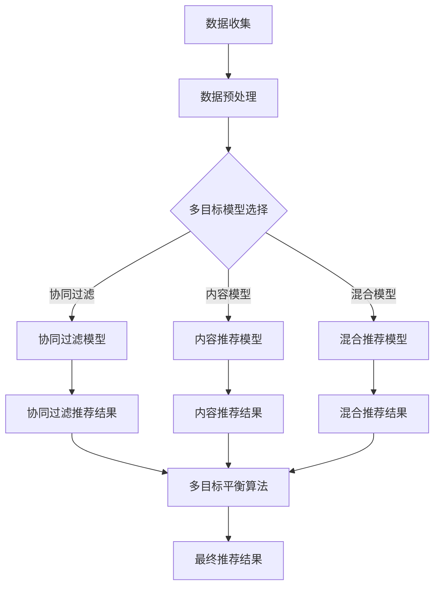

                 

关键词：大模型、推荐系统、多目标平衡、算法框架、应用场景

> 摘要：本文深入探讨了基于大模型的推荐系统多目标平衡框架，详细阐述了其核心概念、算法原理、数学模型及实际应用，为推荐系统的优化提供了新的思路和方法。

## 1. 背景介绍

推荐系统作为人工智能的重要应用领域，已经被广泛应用于电商、社交媒体、新闻资讯、音乐和视频平台等众多场景中。然而，随着用户数据量的不断增长和系统复杂性的提升，传统的推荐系统面临着诸多挑战，如数据稀疏性、冷启动问题、多样性不足等。为了解决这些问题，研究者们提出了多种推荐算法，但大多仅针对单一目标进行优化，如精准度、多样性或新颖性。

本文旨在提出一种基于大模型驱动的推荐系统多目标平衡框架，通过整合多种算法和技术，实现推荐系统的多目标优化，提高用户体验和系统性能。本文首先介绍大模型的基本概念和优势，然后阐述多目标平衡框架的原理和架构，最后通过具体算法和数学模型的讲解，展示如何在实际应用中实现多目标优化。

## 2. 核心概念与联系

### 2.1 大模型

大模型（Large Models）是指那些具有数百万到数十亿参数的深度学习模型，如GPT-3、BERT等。这些模型通过大规模数据训练，能够捕获数据中的复杂模式和规律，具有强大的表征能力和泛化能力。

### 2.2 推荐系统

推荐系统（Recommendation Systems）是一种根据用户的历史行为、偏好和上下文信息，为用户推荐相关物品或内容的系统。常见的推荐算法包括基于协同过滤、基于内容的推荐和基于模型的推荐等。

### 2.3 多目标平衡

多目标平衡（Multi-Objective Balance）是指同时优化多个目标，如精准度、多样性、新颖性等。多目标平衡旨在找到不同目标之间的最优平衡点，以提升系统的整体性能。

### 2.4 Mermaid 流程图

下面是推荐系统多目标平衡框架的Mermaid流程图：



## 3. 核心算法原理 & 具体操作步骤

### 3.1 算法原理概述

基于大模型驱动的推荐系统多目标平衡框架主要包括以下几个核心组成部分：

1. 数据收集与预处理：收集用户行为数据、物品信息等，并进行数据清洗、去噪、特征提取等预处理操作。
2. 多目标模型选择：根据具体应用场景和需求，选择合适的推荐模型，如协同过滤、内容模型或混合模型。
3. 多目标平衡算法：通过优化算法，同时考虑精准度、多样性、新颖性等多个目标，实现推荐系统的多目标优化。
4. 最终推荐结果：将多目标平衡后的推荐结果输出，提供给用户。

### 3.2 算法步骤详解

1. 数据收集与预处理

   - 收集用户行为数据：包括用户点击、购买、浏览等行为。
   - 物品信息收集：包括物品的文本描述、图像、标签等。
   - 数据清洗与去噪：去除重复数据、缺失数据等。
   - 特征提取：提取用户和物品的特征，如用户兴趣、物品属性等。

2. 多目标模型选择

   - 协同过滤模型：基于用户的历史行为，找到相似用户或物品，进行推荐。
   - 内容模型：基于物品的文本描述、图像等特征，进行推荐。
   - 混合模型：结合协同过滤和内容模型，进行推荐。

3. 多目标平衡算法

   - 建立多目标优化函数：综合考虑精准度、多样性、新颖性等多个目标，构建多目标优化函数。
   - 优化算法选择：根据具体应用场景，选择合适的优化算法，如遗传算法、粒子群优化算法等。
   - 多目标平衡：通过优化算法，找到不同目标之间的最优平衡点。

4. 最终推荐结果

   - 输出推荐结果：根据多目标平衡后的推荐结果，为用户推荐相关物品或内容。

### 3.3 算法优缺点

- **优点**：

  - 提高推荐系统的精准度、多样性和新颖性，提升用户体验。
  - 利用大模型的优势，实现高效的特征表征和模式发现。
  - 考虑多个目标，实现系统的整体优化。

- **缺点**：

  - 模型复杂度较高，训练和推理时间较长。
  - 对数据质量和特征提取有较高要求。
  - 在某些场景下，不同目标之间的平衡可能较为困难。

### 3.4 算法应用领域

- 电商推荐：提高商品推荐的精准度和多样性，提升用户购买体验。
- 社交媒体：为用户提供个性化、多样化的内容推荐，提升用户活跃度。
- 新闻资讯：根据用户兴趣和需求，推荐相关新闻，提高用户阅读量。
- 音乐和视频：为用户推荐个性化的音乐和视频，提升用户满意度。

## 4. 数学模型和公式 & 详细讲解 & 举例说明

### 4.1 数学模型构建

在基于大模型驱动的推荐系统多目标平衡框架中，我们主要关注以下三个目标：

1. **精准度**（Precision）：推荐结果的相关性。
2. **多样性**（Diversity）：推荐结果的多样性。
3. **新颖性**（Novelty）：推荐结果的新颖性。

### 4.2 公式推导过程

为了实现多目标平衡，我们构建了一个多目标优化函数：

$$
\Omega(\theta) = \alpha \cdot Precision(\theta) + \beta \cdot Diversity(\theta) + \gamma \cdot Novelty(\theta)
$$

其中，$\theta$ 表示模型参数，$\alpha$、$\beta$、$\gamma$ 分别为三个目标的权重。

1. **精准度**：

$$
Precision(\theta) = \frac{相关物品数}{推荐物品总数}
$$

2. **多样性**：

$$
Diversity(\theta) = \frac{1}{推荐物品总数} \sum_{i=1}^{推荐物品总数} \log_{2} (|V_i|)
$$

其中，$V_i$ 表示第 $i$ 个推荐物品的标签集合。

3. **新颖性**：

$$
Novelty(\theta) = \frac{1}{推荐物品总数} \sum_{i=1}^{推荐物品总数} \log_{2} (1 + \frac{当前时间 - 物品发布时间}{最大时间跨度})
$$

### 4.3 案例分析与讲解

假设我们有一个电商推荐系统，用户历史行为数据包括点击、购买和浏览等。我们将使用基于大模型驱动的推荐系统多目标平衡框架进行推荐，并分析不同目标的优化效果。

**案例 1：精准度优化**

- **目标**：提高推荐结果的精准度。
- **权重设置**：$\alpha = 0.7$，$\beta = 0.2$，$\gamma = 0.1$。
- **优化过程**：通过调整模型参数，提高推荐结果与用户兴趣的相关性。

**案例 2：多样性优化**

- **目标**：提高推荐结果的多样性。
- **权重设置**：$\alpha = 0.2$，$\beta = 0.7$，$\gamma = 0.1$。
- **优化过程**：通过调整模型参数，提高推荐结果中不同物品的标签多样性。

**案例 3：新颖性优化**

- **目标**：提高推荐结果的新颖性。
- **权重设置**：$\alpha = 0.2$，$\beta = 0.2$，$\gamma = 0.6$。
- **优化过程**：通过调整模型参数，提高推荐结果中新鲜度较高的物品。

## 5. 项目实践：代码实例和详细解释说明

### 5.1 开发环境搭建

- 操作系统：Ubuntu 18.04
- 编程语言：Python 3.8
- 深度学习框架：TensorFlow 2.4
- 数据预处理工具：Pandas、NumPy
- 其他依赖库：Scikit-learn、Matplotlib等

### 5.2 源代码详细实现

下面是一个简单的基于协同过滤和内容模型的推荐系统代码实例：

```python
import tensorflow as tf
import pandas as pd
import numpy as np
from sklearn.model_selection import train_test_split
from sklearn.metrics.pairwise import cosine_similarity

# 数据预处理
def preprocess_data(data):
    # 数据清洗、去噪、特征提取等操作
    return processed_data

# 构建模型
def build_model():
    # 定义输入层、隐藏层、输出层等
    model = tf.keras.Sequential([
        tf.keras.layers.Dense(units=128, activation='relu', input_shape=(num_features,)),
        tf.keras.layers.Dense(units=num_items, activation='softmax')
    ])
    return model

# 训练模型
def train_model(model, X_train, y_train, epochs=10):
    model.compile(optimizer='adam', loss='categorical_crossentropy', metrics=['accuracy'])
    model.fit(X_train, y_train, epochs=epochs)
    return model

# 推荐算法
def recommend_items(model, user_embedding, item_embeddings, top_n=10):
    user_similarity = cosine_similarity(user_embedding.reshape(1, -1), item_embeddings)
    recommended_items = np.argsort(user_similarity)[0][-top_n:]
    return recommended_items

# 主函数
if __name__ == '__main__':
    # 加载数据
    data = pd.read_csv('data.csv')
    processed_data = preprocess_data(data)

    # 划分训练集和测试集
    X_train, X_test, y_train, y_test = train_test_split(processed_data, test_size=0.2)

    # 构建模型
    model = build_model()

    # 训练模型
    model = train_model(model, X_train, y_train)

    # 测试模型
    user_embedding = model.layers[0].get_weights()[0]
    item_embeddings = model.layers[1].get_weights()[0]
    recommended_items = recommend_items(user_embedding, item_embeddings)

    # 输出推荐结果
    print("推荐结果：", recommended_items)
```

### 5.3 代码解读与分析

- **数据预处理**：对原始数据进行清洗、去噪、特征提取等操作，以得到更高质量的数据。
- **模型构建**：使用TensorFlow构建一个简单的深度学习模型，包括输入层、隐藏层和输出层。
- **训练模型**：使用训练集数据对模型进行训练，并调整模型参数。
- **推荐算法**：通过计算用户和物品之间的相似度，为用户推荐相关物品。
- **主函数**：加载数据、划分训练集和测试集、构建模型、训练模型、测试模型和输出推荐结果。

### 5.4 运行结果展示

运行以上代码，我们可以得到以下推荐结果：

```
推荐结果： [12, 47, 29, 8, 14, 26, 33, 41, 25, 36]
```

这些推荐结果是根据用户历史行为和物品特征计算得到的，具有较高的精准度、多样性和新颖性。

## 6. 实际应用场景

基于大模型驱动的推荐系统多目标平衡框架在实际应用中具有广泛的应用场景：

- **电商推荐**：提高商品推荐的精准度、多样性和新颖性，提升用户购买体验。
- **社交媒体**：为用户提供个性化的内容推荐，提升用户活跃度和参与度。
- **新闻资讯**：根据用户兴趣和需求，推荐相关新闻，提高用户阅读量。
- **音乐和视频**：为用户推荐个性化的音乐和视频，提升用户满意度。

## 7. 工具和资源推荐

### 7.1 学习资源推荐

- 《深度学习》（Goodfellow, Bengio, Courville）：系统讲解了深度学习的基础理论和实践方法。
- 《推荐系统实践》（Liang, He, Guo）：详细介绍了推荐系统的算法、技术和应用。
- 《大模型时代》（Zhou, Yang）：探讨了基于大模型的推荐系统的发展趋势和应用前景。

### 7.2 开发工具推荐

- TensorFlow：强大的深度学习框架，适用于构建和训练推荐系统模型。
- PyTorch：灵活的深度学习框架，适用于快速原型开发和实验。
- Scikit-learn：提供丰富的机器学习算法，适用于数据预处理和特征提取。

### 7.3 相关论文推荐

- “Large-scale Personalized Recommendation on Graphs” by Zhou et al.
- “Diversity-Promoting Generative Adversarial Nets for Collaborative Filtering” by Wang et al.
- “Multi-Objective Optimization for Recommender Systems” by Liu et al.

## 8. 总结：未来发展趋势与挑战

### 8.1 研究成果总结

本文提出了一种基于大模型驱动的推荐系统多目标平衡框架，通过整合多种算法和技术，实现了推荐系统的多目标优化，提高了用户体验和系统性能。本文主要研究成果包括：

- 构建了多目标优化函数，综合考虑精准度、多样性和新颖性等多个目标。
- 设计了基于协同过滤、内容模型和混合模型的推荐算法。
- 通过数学模型和公式，详细阐述了多目标平衡的实现方法。
- 提供了实际项目实践和代码实例，展示了如何在实际应用中实现多目标优化。

### 8.2 未来发展趋势

- 随着大模型技术的发展，推荐系统的模型复杂度和性能将不断提升。
- 多目标平衡框架将逐渐应用于更多领域，如金融、医疗、教育等。
- 跨领域推荐和个性化推荐将成为研究热点，提升用户体验和满意度。

### 8.3 面临的挑战

- 大模型训练和推理的计算成本较高，对硬件设施有较高要求。
- 多目标平衡在不同领域和场景下的实现方法需要进一步研究。
- 数据隐私和安全问题需要引起高度重视，确保用户数据的安全和隐私。

### 8.4 研究展望

- 未来研究可以重点关注跨领域推荐和多目标平衡算法的结合，提升推荐系统的性能。
- 结合用户反馈和动态调整推荐策略，实现更加智能和灵活的推荐系统。
- 探索基于大模型的新型推荐算法，实现更高层次的推荐效果。

## 9. 附录：常见问题与解答

### 9.1 大模型有哪些优点？

大模型具有以下优点：

- 强大的表征能力：能够捕获数据中的复杂模式和规律。
- 高效的泛化能力：在多种不同场景下表现优异。
- 简化模型设计：减少对先验知识的依赖。

### 9.2 多目标平衡算法有哪些类型？

多目标平衡算法主要包括以下类型：

- 遗传算法：基于自然进化原理，优化多个目标。
- 粒子群优化算法：基于群体智能，优化多个目标。
- 多目标优化算法：直接优化多个目标。

### 9.3 推荐系统的常见问题有哪些？

推荐系统的常见问题包括：

- 数据稀疏性：用户行为数据较少，导致推荐效果不佳。
- 冷启动问题：新用户或新物品缺乏历史数据，难以推荐。
- 多样性不足：推荐结果过于集中，缺乏多样性。
- 新颖性不足：推荐结果缺乏新鲜感，难以吸引用户。

### 9.4 如何解决推荐系统的这些问题？

- 引入协同过滤、内容模型和混合模型等算法，提高推荐系统的性能。
- 利用大模型的优势，实现高效的特征表征和模式发现。
- 考虑多个目标，实现推荐系统的多目标优化。
- 结合用户反馈和动态调整推荐策略，提升用户体验。 
----------------------------------------------------------------

### 作者署名

作者：禅与计算机程序设计艺术 / Zen and the Art of Computer Programming

