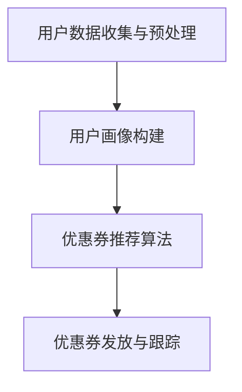

                 

关键词：大模型、电商、个性化、优惠券、策略、算法、技术、应用

> 摘要：本文深入探讨了大模型在电商领域中的应用，尤其是如何利用大模型实现个性化优惠券的分发策略。通过分析当前电商行业的需求和挑战，本文提出了一种基于大模型驱动的优惠券分发方案，详细阐述了其核心概念、算法原理、数学模型、项目实践以及未来应用展望。文章旨在为电商企业提供一套科学的个性化优惠券分发策略，从而提升用户满意度和平台竞争力。

## 1. 背景介绍

### 1.1 电商行业现状

随着互联网的快速发展，电商行业已经成为全球商业领域的重要组成部分。根据统计数据显示，全球电商市场规模持续增长，预计在未来几年内仍将保持高速发展态势。然而，随着市场规模的不断扩大，电商平台之间的竞争也日益激烈。为了提高用户黏性和平台竞争力，电商平台纷纷开始关注用户个性化需求，并通过个性化营销策略来提升用户体验。

### 1.2 个性化优惠券的意义

优惠券是电商平台常用的营销手段之一，通过发放优惠券，可以刺激用户的消费欲望，提升用户购买率。然而，传统的优惠券发放方式往往缺乏个性化，无法精准地满足用户的需求，导致优惠券的有效利用率较低。因此，个性化优惠券的发放策略成为电商行业亟待解决的问题。

### 1.3 大模型在个性化优惠券分发中的应用

近年来，人工智能技术的发展为电商行业带来了新的机遇。特别是大模型技术的应用，使得个性化优惠券的分发变得更加高效和精准。大模型可以通过对用户行为数据的深度分析，了解用户的个性化需求，从而实现优惠券的智能推荐。本文将探讨如何利用大模型技术，构建一种有效的个性化优惠券分发策略。

## 2. 核心概念与联系

### 2.1 大模型技术概述

大模型是指具有大规模参数和复杂结构的神经网络模型，如Transformer、BERT等。大模型可以通过对海量数据进行训练，提取出数据中的潜在模式和规律，从而实现高性能的预测和分类任务。

### 2.2 个性化优惠券的概念

个性化优惠券是指根据用户的个性化需求和偏好，为其定制化的优惠券。个性化优惠券的发放需要基于用户的购买历史、浏览行为、偏好等信息，通过算法进行精准推荐。

### 2.3 大模型与个性化优惠券的分发

大模型可以用于构建用户画像、分析用户行为、预测用户需求等任务，从而为个性化优惠券的分发提供数据支持。具体来说，大模型可以通过以下步骤实现个性化优惠券的分发：

1. 用户数据收集与预处理：收集用户的购买历史、浏览行为、偏好等信息，并进行数据清洗和预处理。
2. 用户画像构建：利用大模型对用户数据进行训练，构建用户的个性化画像。
3. 优惠券推荐算法：根据用户的个性化画像，利用推荐算法为用户推荐个性化优惠券。
4. 优惠券发放与跟踪：将推荐出的优惠券发放给用户，并跟踪优惠券的使用效果，为后续优化提供数据支持。

### 2.4 Mermaid 流程图

## 3. 核心算法原理 & 具体操作步骤

### 3.1 算法原理概述

本文采用基于Transformer的大模型进行用户画像构建和优惠券推荐。Transformer模型具有并行计算能力、全局信息利用能力以及长距离依赖处理能力，可以有效提高个性化优惠券推荐的准确性和效率。

### 3.2 算法步骤详解

#### 3.2.1 用户数据收集与预处理

1. **数据来源**：收集用户的购买历史、浏览行为、偏好等信息，如商品种类、购买时间、浏览时长、评价等。
2. **数据清洗**：对收集到的数据进行清洗，去除重复、错误和不完整的数据。
3. **特征提取**：对清洗后的数据进行特征提取，如将商品种类转换为类别编码、将购买时间转换为时间序列编码等。

#### 3.2.2 用户画像构建

1. **输入序列构建**：将用户的购买历史、浏览行为、偏好等信息按照时间顺序组成一个输入序列。
2. **Transformer 模型训练**：使用Transformer模型对输入序列进行训练，提取用户画像的特征。
3. **用户画像表示**：将训练好的Transformer模型用于用户画像表示，将用户画像转换为高维特征向量。

#### 3.2.3 优惠券推荐算法

1. **优惠券库构建**：构建一个包含多种优惠券的库，每种优惠券对应一个向量表示。
2. **相似度计算**：计算用户画像与优惠券库中优惠券之间的相似度。
3. **推荐策略**：根据相似度计算结果，为用户推荐个性化优惠券。

#### 3.2.4 优惠券发放与跟踪

1. **优惠券发放**：将推荐出的个性化优惠券发放给用户。
2. **优惠券使用跟踪**：记录优惠券的使用情况，如使用次数、使用率等，为后续优化提供数据支持。

### 3.3 算法优缺点

#### 优点

1. **高效性**：基于Transformer的大模型可以快速地处理大量用户数据，提高优惠券推荐效率。
2. **准确性**：通过深度学习技术，大模型可以提取用户画像的潜在特征，提高优惠券推荐的准确性。
3. **灵活性**：大模型可以根据用户行为数据的动态变化，实时调整优惠券推荐策略。

#### 缺点

1. **计算资源消耗**：大模型训练和推理需要大量的计算资源和时间。
2. **数据质量要求高**：用户行为数据的准确性和完整性对大模型的性能有较大影响。

### 3.4 算法应用领域

1. **电商平台**：通过个性化优惠券分发策略，提升用户购买率和平台竞争力。
2. **在线零售**：根据用户偏好推荐合适的优惠券，促进商品销售。
3. **金融行业**：为用户提供个性化的金融产品推荐，提高客户满意度。

## 4. 数学模型和公式 & 详细讲解 & 举例说明

### 4.1 数学模型构建

#### 4.1.1 Transformer 模型

Transformer模型是一种基于自注意力机制的深度神经网络模型，可以用于序列到序列的任务，如文本生成、机器翻译等。本文采用Transformer模型构建用户画像和优惠券推荐系统。

#### 4.1.2 用户画像表示

设$U$为用户集合，$V$为商品集合，$C$为优惠券集合。用户的个性化画像可以用一个高维向量表示，$u_i \in \mathbb{R}^n$表示用户$u_i$的个性化画像，其中$n$为特征维度。

#### 4.1.3 优惠券表示

设$c_j \in \mathbb{R}^m$为优惠券$

