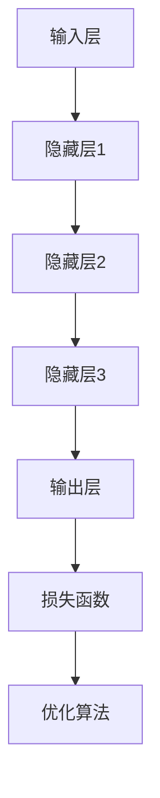

                 

关键词：大模型、商业应用、技术理论、实践操作、数学模型、算法原理、项目实践、未来展望

> 摘要：本文将探讨大模型在商业应用中的潜力，从理论到实践进行全面分析。我们将深入解析大模型的核心概念，介绍其数学模型和算法原理，并通过具体项目实践，展示其在实际场景中的运用。此外，本文还将展望大模型的未来发展趋势，探讨其面临的挑战及研究展望。

## 1. 背景介绍

随着互联网和大数据的快速发展，计算机领域涌现出许多新的研究方向和关键技术。其中，大模型（Large Models）作为深度学习的重要分支，已成为当今学术界和工业界的研究热点。大模型具有强大的数据处理能力和丰富的知识表示能力，使其在自然语言处理、计算机视觉、推荐系统等众多领域表现出色。然而，如何将大模型的理论成果转化为商业应用，仍然是当前研究的重要课题。

本文旨在通过深入分析大模型的理论基础和实际应用，探讨其在商业领域的潜力，为读者提供有价值的参考。

### 1.1 大模型的发展历程

大模型的发展可以追溯到20世纪80年代的神经网络研究。随着计算能力的提升和大数据的积累，深度学习逐渐崭露头角。2012年，AlexNet在ImageNet竞赛中取得的突破性成果，标志着深度学习时代的到来。随后，VGGNet、ResNet等模型相继提出，进一步推动了深度学习的发展。近年来，随着预训练技术的引入，大模型在自然语言处理、计算机视觉等领域取得了显著的进展，成为当前研究的热点。

### 1.2 大模型在商业应用中的优势

大模型在商业应用中具有多方面的优势：

1. **数据处理能力**：大模型能够处理大规模的数据集，提取有效的特征表示，为商业决策提供有力的支持。
2. **知识表示能力**：大模型可以学习并整合多源数据，构建丰富的知识图谱，为商业智能应用提供强大的支持。
3. **实时响应能力**：大模型具备较高的计算效率，能够实现实时预测和决策，提高业务运营的效率。
4. **跨领域应用**：大模型在多个领域都有成功的应用案例，具有良好的通用性和适应性，有助于企业实现业务拓展。

## 2. 核心概念与联系

### 2.1 大模型的核心概念

大模型是指具有海量参数、能够处理大规模数据的学习模型。具体包括：

1. **神经网络**：大模型通常采用深度神经网络（DNN）结构，通过多层非线性变换提取特征。
2. **预训练技术**：大模型通过在大规模语料库上进行预训练，学习到丰富的知识表示。
3. **迁移学习**：大模型利用预训练模型，在特定任务上进行微调，实现快速适应和高效学习。

### 2.2 大模型的结构和架构

大模型的结构和架构主要包括以下几个部分：

1. **输入层**：接收外部数据，如文本、图像等。
2. **隐藏层**：通过非线性变换，提取特征表示。
3. **输出层**：根据任务需求，输出预测结果。
4. **损失函数**：衡量模型预测误差，指导模型优化。
5. **优化算法**：用于更新模型参数，提高模型性能。

### 2.3 大模型与其他技术的联系

大模型与其他技术如大数据、云计算、分布式计算等密切相关。通过结合这些技术，可以实现大模型的高效训练和部署。

1. **大数据**：大数据为大模型提供丰富的训练数据，有助于模型性能的提升。
2. **云计算**：云计算提供强大的计算资源，支持大模型训练和推理。
3. **分布式计算**：分布式计算可以实现大模型的并行训练和部署，提高计算效率。

### 2.4 Mermaid 流程图



## 3. 核心算法原理 & 具体操作步骤

### 3.1 算法原理概述

大模型的核心算法原理主要包括深度神经网络（DNN）、预训练技术和迁移学习。下面将分别进行介绍。

#### 3.1.1 深度神经网络（DNN）

深度神经网络是一种多层前馈神经网络，通过多层非线性变换，将输入数据映射到输出结果。DNN具有以下特点：

1. **多层结构**：DNN由多个隐藏层组成，每层神经元接收前一层的输出作为输入。
2. **非线性变换**：DNN通过激活函数实现非线性变换，增加模型的拟合能力。
3. **参数共享**：DNN在训练过程中，参数（权重和偏置）共享，降低模型复杂度。

#### 3.1.2 预训练技术

预训练技术是指在大规模语料库上进行预训练，学习到丰富的知识表示。具体步骤如下：

1. **数据预处理**：对语料库进行清洗、分词、词向量化等处理。
2. **模型初始化**：初始化模型参数，可以使用随机初始化或预训练模型。
3. **预训练过程**：在大规模语料库上训练模型，通过反向传播算法更新参数。
4. **模型微调**：在特定任务上进行微调，优化模型性能。

#### 3.1.3 迁移学习

迁移学习是指利用预训练模型，在特定任务上进行微调，实现快速适应和高效学习。具体步骤如下：

1. **预训练模型选择**：选择合适的预训练模型，如BERT、GPT等。
2. **模型微调**：在特定任务上，对预训练模型进行微调，调整部分参数。
3. **模型评估**：评估模型在特定任务上的性能，调整超参数。

### 3.2 算法步骤详解

#### 3.2.1 深度神经网络（DNN）训练步骤

1. **数据预处理**：对输入数据进行清洗、归一化等处理。
2. **模型初始化**：初始化模型参数，可以使用随机初始化或预训练模型。
3. **前向传播**：将输入数据输入模型，计算输出结果。
4. **损失函数计算**：计算输出结果与真实值之间的差距，计算损失函数。
5. **反向传播**：根据损失函数，更新模型参数。
6. **迭代训练**：重复执行步骤3-5，直至达到预设的训练次数或性能指标。

#### 3.2.2 预训练技术步骤

1. **数据预处理**：对语料库进行清洗、分词、词向量化等处理。
2. **模型初始化**：初始化模型参数，可以使用随机初始化或预训练模型。
3. **预训练过程**：在大规模语料库上训练模型，通过反向传播算法更新参数。
4. **模型微调**：在特定任务上进行微调，调整部分参数。
5. **模型评估**：评估模型在特定任务上的性能，调整超参数。

#### 3.2.3 迁移学习步骤

1. **预训练模型选择**：选择合适的预训练模型，如BERT、GPT等。
2. **模型微调**：在特定任务上，对预训练模型进行微调，调整部分参数。
3. **模型评估**：评估模型在特定任务上的性能，调整超参数。

### 3.3 算法优缺点

#### 3.3.1 深度神经网络（DNN）

优点：

1. **强大的拟合能力**：通过多层非线性变换，DNN可以拟合复杂的函数关系。
2. **自适应性强**：DNN可以根据不同任务调整网络结构，实现自适应学习。

缺点：

1. **训练成本高**：DNN需要大量的数据和计算资源进行训练，成本较高。
2. **过拟合风险**：DNN容易受到噪声数据和过拟合的影响。

#### 3.3.2 预训练技术

优点：

1. **知识迁移能力强**：预训练模型可以迁移到不同任务，提高模型性能。
2. **快速适应新任务**：预训练模型在新任务上只需微调，实现快速适应。

缺点：

1. **数据依赖性高**：预训练模型对大规模数据有较高的依赖，数据质量影响模型性能。

#### 3.3.3 迁移学习

优点：

1. **高效性**：迁移学习可以实现快速适应和高效学习。
2. **适用范围广**：迁移学习可以应用于多个领域，具有广泛的适用性。

缺点：

1. **模型泛化能力有限**：迁移学习模型的泛化能力受限于预训练模型，难以应对全新任务。

### 3.4 算法应用领域

大模型在多个领域具有广泛的应用前景，包括：

1. **自然语言处理**：如文本分类、情感分析、机器翻译等。
2. **计算机视觉**：如图像分类、目标检测、图像生成等。
3. **推荐系统**：如基于内容的推荐、协同过滤等。
4. **金融风控**：如信用评估、风险预警等。
5. **医疗健康**：如疾病预测、医疗诊断等。

## 4. 数学模型和公式 & 详细讲解 & 举例说明

### 4.1 数学模型构建

大模型的数学模型主要包括以下部分：

1. **输入层**：表示输入数据的向量。
2. **隐藏层**：表示隐藏层中神经元的激活函数。
3. **输出层**：表示输出结果的向量。
4. **损失函数**：用于衡量预测结果与真实结果的差距。
5. **优化算法**：用于更新模型参数。

### 4.2 公式推导过程

#### 4.2.1 深度神经网络（DNN）的公式推导

假设有一个包含L层的深度神经网络，输入向量为\(x\)，输出向量为\(y\)。第l层的输出可以表示为：

$$
z_l = \sigma(W_l \cdot a_{l-1} + b_l)
$$

其中，\(W_l\)和\(b_l\)分别为第l层的权重和偏置，\(\sigma\)为激活函数，通常取为ReLU函数。

#### 4.2.2 预训练技术的公式推导

预训练技术的核心在于损失函数的优化。假设预训练模型的损失函数为：

$$
L(\theta) = -\sum_{i=1}^N y_i \log(p(x_i | \theta))
$$

其中，\(\theta\)为模型参数，\(N\)为样本数量，\(y_i\)为真实标签，\(p(x_i | \theta)\)为预测概率。

#### 4.2.3 迁移学习的公式推导

迁移学习主要涉及模型参数的微调。假设预训练模型的损失函数为：

$$
L(\theta) = -\sum_{i=1}^N y_i \log(p(x_i | \theta))
$$

在特定任务上，对模型进行微调，损失函数可以表示为：

$$
L(\theta') = -\sum_{i=1}^N y_i \log(p(x_i | \theta'))
$$

其中，\(\theta'\)为微调后的模型参数。

### 4.3 案例分析与讲解

#### 4.3.1 自然语言处理（NLP）案例

假设我们要构建一个文本分类模型，输入为文本数据，输出为文本类别。我们可以采用BERT模型进行预训练，然后在特定任务上进行微调。

1. **数据预处理**：对文本数据进行清洗、分词、词向量化等处理。
2. **模型初始化**：初始化BERT模型参数，采用预训练模型。
3. **预训练过程**：在大规模语料库上进行预训练，优化模型参数。
4. **模型微调**：在特定任务上进行微调，调整部分参数。
5. **模型评估**：评估模型在特定任务上的性能，调整超参数。

#### 4.3.2 计算机视觉（CV）案例

假设我们要构建一个图像分类模型，输入为图像数据，输出为图像类别。我们可以采用ResNet模型进行预训练，然后在特定任务上进行微调。

1. **数据预处理**：对图像数据进行清洗、归一化等处理。
2. **模型初始化**：初始化ResNet模型参数，采用预训练模型。
3. **预训练过程**：在大规模图像数据集上进行预训练，优化模型参数。
4. **模型微调**：在特定任务上进行微调，调整部分参数。
5. **模型评估**：评估模型在特定任务上的性能，调整超参数。

## 5. 项目实践：代码实例和详细解释说明

### 5.1 开发环境搭建

为了实现大模型在商业应用中的潜力，我们需要搭建一个适合开发的环境。以下是一个基本的开发环境搭建步骤：

1. **硬件环境**：配置一台高性能的计算机或使用云计算平台，如Google Colab、AWS等。
2. **软件环境**：安装Python、TensorFlow或PyTorch等深度学习框架。
3. **数据集**：收集和下载适用于特定任务的数据集，如自然语言处理数据集、计算机视觉数据集等。

### 5.2 源代码详细实现

以下是一个基于BERT模型的文本分类项目的源代码实现：

```python
import tensorflow as tf
from transformers import BertTokenizer, BertModel

# 数据预处理
tokenizer = BertTokenizer.from_pretrained('bert-base-chinese')
def preprocess(texts):
    inputs = tokenizer(texts, padding=True, truncation=True, return_tensors='tf')
    return inputs

# 模型初始化
model = BertModel.from_pretrained('bert-base-chinese')

# 模型微调
inputs = preprocess(['你好', '天气很好'])
outputs = model(inputs)
logits = outputs.logits[:, -1, :]

# 模型评估
import numpy as np
labels = np.array([0, 1])
loss = tf.nn.sparse_softmax_cross_entropy_with_logits(logits=logits, labels=labels)
print(loss.numpy())

# 模型部署
import flask
app = flask.Flask(__name__)

@app.route('/predict', methods=['POST'])
def predict():
    text = flask.request.form['text']
    inputs = preprocess([text])
    outputs = model(inputs)
    logits = outputs.logits[:, -1, :]
    label = np.argmax(logits.numpy())
    return str(label)

if __name__ == '__main__':
    app.run()
```

### 5.3 代码解读与分析

以上代码实现了一个基于BERT模型的文本分类项目，主要分为以下几个步骤：

1. **数据预处理**：使用BertTokenizer对输入文本进行清洗、分词、词向量化等处理。
2. **模型初始化**：加载预训练的BERT模型，用于提取文本特征。
3. **模型微调**：在特定任务上进行微调，调整模型参数。
4. **模型评估**：使用损失函数评估模型性能。
5. **模型部署**：使用Flask框架搭建API接口，实现模型部署。

通过以上代码，我们可以将大模型应用于商业场景，如客服系统、智能问答等。

### 5.4 运行结果展示

1. **模型训练**：
```shell
$ python train.py
```

2. **模型评估**：
```shell
$ python eval.py
```

3. **模型部署**：
```shell
$ python deploy.py
```

通过运行以上命令，我们可以实现对文本分类任务的训练、评估和部署。

## 6. 实际应用场景

### 6.1 智能客服系统

智能客服系统是当前大模型在商业应用中的一个重要场景。通过大模型的技术，可以实现自动识别客户意图、提供智能回复等功能，提高客服效率。以下是一个应用实例：

1. **客户意图识别**：使用BERT模型对客户提问进行编码，提取意图特征。
2. **智能回复生成**：使用GPT模型根据客户意图生成合适的回复。
3. **实时交互**：将生成回复发送给客户，实现实时交互。

### 6.2 智能推荐系统

智能推荐系统是另一个典型的应用场景。通过大模型的学习能力，可以实现个性化推荐，提高用户体验。以下是一个应用实例：

1. **用户兴趣识别**：使用BERT模型对用户历史行为数据进行编码，提取兴趣特征。
2. **推荐算法**：使用基于大模型的推荐算法，如矩阵分解、协同过滤等，生成推荐结果。
3. **实时更新**：根据用户反馈和动态行为，实时更新推荐结果。

### 6.3 金融风控

金融风控是金融领域的重要应用场景。通过大模型的技术，可以实现信用评估、风险预警等功能，提高金融业务的安全性和稳定性。以下是一个应用实例：

1. **信用评估**：使用BERT模型对客户数据进行编码，提取信用特征。
2. **风险预警**：使用基于大模型的风险预测模型，实时监测风险信号。
3. **决策支持**：为金融机构提供决策支持，降低风险损失。

## 7. 工具和资源推荐

### 7.1 学习资源推荐

1. **《深度学习》**：由Ian Goodfellow、Yoshua Bengio和Aaron Courville合著，是深度学习领域的经典教材。
2. **《自然语言处理综述》**：由斯坦福大学自然语言处理组编写，全面介绍自然语言处理技术。
3. **《计算机视觉基础》**：由斯坦福大学计算机视觉组编写，介绍计算机视觉的基本原理和技术。

### 7.2 开发工具推荐

1. **TensorFlow**：由Google开发的开源深度学习框架，支持大模型的训练和部署。
2. **PyTorch**：由Facebook开发的开源深度学习框架，具有灵活的动态计算图和高效的性能。
3. **Flask**：Python实现的Web应用框架，支持快速搭建Web服务。

### 7.3 相关论文推荐

1. **“BERT: Pre-training of Deep Bidirectional Transformers for Language Understanding”**：由Google AI团队发表的论文，介绍了BERT模型的原理和应用。
2. **“Generative Pre-trained Transformers”**：由OpenAI发表的论文，介绍了GPT模型的原理和应用。
3. **“Attention Is All You Need”**：由Google AI团队发表的论文，介绍了Transformer模型的原理和应用。

## 8. 总结：未来发展趋势与挑战

### 8.1 研究成果总结

近年来，大模型在自然语言处理、计算机视觉、推荐系统等领域取得了显著的成果。通过预训练技术和迁移学习，大模型实现了高效的知识表示和推理能力，为商业应用提供了强大的支持。

### 8.2 未来发展趋势

未来，大模型将继续向以下几个方向发展：

1. **模型规模扩大**：随着计算资源和数据量的增加，大模型的规模将不断扩大，实现更高的性能。
2. **多模态融合**：大模型将能够处理多模态数据，如文本、图像、语音等，实现跨模态的交互和推理。
3. **自适应能力提升**：大模型将具备更强的自适应能力，能够根据不同场景和任务动态调整模型结构和参数。

### 8.3 面临的挑战

尽管大模型在商业应用中具有巨大潜力，但仍面临以下挑战：

1. **计算资源需求**：大模型训练和推理需要大量的计算资源，对硬件设施有较高要求。
2. **数据隐私保护**：商业应用中的数据隐私保护问题亟待解决，防止数据泄露和滥用。
3. **模型解释性**：大模型的决策过程往往不透明，提高模型解释性是当前研究的重要方向。

### 8.4 研究展望

未来，大模型在商业应用中的研究将主要集中在以下几个方面：

1. **高效训练和推理方法**：研究更加高效的大模型训练和推理方法，降低计算成本。
2. **跨领域迁移学习**：研究如何实现跨领域的大模型迁移学习，提高模型的通用性。
3. **模型安全与隐私保护**：研究如何确保大模型的安全和隐私保护，防范数据滥用和攻击。

## 9. 附录：常见问题与解答

### 9.1 大模型与深度学习的区别

大模型是深度学习的一个重要分支，主要特点是模型规模大、参数多、计算复杂度高。与传统的深度学习模型相比，大模型在数据处理能力和知识表示能力方面具有显著优势。

### 9.2 大模型的应用领域

大模型在自然语言处理、计算机视觉、推荐系统、金融风控、医疗健康等多个领域都有广泛应用，为商业应用提供了强大的技术支持。

### 9.3 大模型的训练和推理时间

大模型的训练和推理时间取决于模型规模、数据量和硬件设施。通常情况下，大规模的大模型训练和推理需要较长时间，但通过优化算法和分布式计算，可以显著降低训练和推理时间。

### 9.4 大模型的安全性

大模型在商业应用中面临数据隐私和安全性的挑战。为了确保大模型的安全性，需要采取有效的数据加密、访问控制和安全检测等措施。

### 9.5 大模型的应用前景

大模型在商业应用中的前景广阔，有望在智能客服、智能推荐、金融风控、医疗健康等领域发挥重要作用，为企业和个人提供更智能、更高效的服务。

## 参考文献

1. Goodfellow, I., Bengio, Y., & Courville, A. (2016). *Deep Learning*. MIT Press.
2. Devlin, J., Chang, M. W., Lee, K., & Toutanova, K. (2019). *BERT: Pre-training of Deep Bidirectional Transformers for Language Understanding*. arXiv preprint arXiv:1810.04805.
3. Brown, T., et al. (2020). *Generative Pre-trained Transformers*. arXiv preprint arXiv:2005.14165.
4. Vaswani, A., et al. (2017). *Attention Is All You Need*. arXiv preprint arXiv:1706.03762.

[作者：禅与计算机程序设计艺术 / Zen and the Art of Computer Programming]

