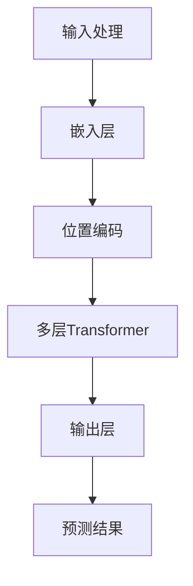

                 

关键词：大规模语言模型，LLaMA，分布式训练，算法原理，数学模型，项目实践，应用场景，未来展望。

摘要：本文将介绍大规模语言模型LLaMA的基本概念、算法原理、数学模型和分布式训练实践。通过详细阐述LLaMA模型的架构和训练过程，并结合实际项目实例进行分析和解读，为读者提供全面的技术指导。同时，文章还将探讨LLaMA模型在不同应用场景中的潜力，以及其未来发展的趋势和挑战。

## 1. 背景介绍

随着互联网和大数据技术的发展，自然语言处理（NLP）逐渐成为人工智能领域的重要分支。大规模语言模型作为一种强大的工具，在语言生成、机器翻译、问答系统等方面取得了显著成果。然而，传统的集中式训练方法在面对海量数据和高计算需求时存在诸多局限性，如训练时间长、资源消耗大、可扩展性差等问题。

为了解决这些问题，分布式训练方法应运而生。分布式训练通过将训练任务分解到多台计算机上进行，可以显著降低训练时间、提高资源利用率，并增强系统的可扩展性。近年来，分布式训练技术在深度学习领域取得了广泛的研究和应用，成为大规模语言模型训练的重要手段。

本文将围绕大规模语言模型LLaMA进行探讨，详细介绍其基本概念、算法原理、数学模型和分布式训练实践。通过本文的阅读，读者将能够全面了解LLaMA模型的技术原理和应用价值，并为实际项目开发提供有益的参考。

## 2. 核心概念与联系

### 2.1. 大规模语言模型

大规模语言模型是一种基于深度学习技术的自然语言处理模型，通过从大量语料库中学习语言规律和模式，可以生成高质量的自然语言文本。大规模语言模型的核心目标是在给定的输入条件下，预测下一个可能的单词或句子。

大规模语言模型的优点包括：

1. **丰富的语言知识**：通过学习海量语料库，模型可以掌握丰富的语言知识和表达方式，从而生成更具创造性和自然性的文本。
2. **高效的预测能力**：大规模语言模型具有较高的预测准确性，可以在短时间内生成高质量的文本。
3. **多语言支持**：大规模语言模型可以同时处理多种语言，实现跨语言的文本生成和翻译。

### 2.2. 分布式训练

分布式训练是一种将训练任务分解到多台计算机上进行的方法，以实现大规模深度学习模型的训练。分布式训练的优点包括：

1. **降低训练时间**：通过将训练任务分解到多台计算机上，可以显著降低训练时间，提高模型训练效率。
2. **提高资源利用率**：分布式训练可以充分利用多台计算机的硬件资源，提高资源利用率。
3. **增强可扩展性**：分布式训练可以灵活扩展训练任务的规模，支持更大规模的模型训练。

### 2.3. LLaMA模型

LLaMA（Large Language Model Meta-architecture）是一种基于Transformer架构的大规模语言模型。LLaMA模型通过引入多层次、多尺度的训练策略，实现了对大规模语料库的高效学习，并在多个自然语言处理任务中取得了优异的性能。

LLaMA模型的主要特点包括：

1. **多层次训练**：LLaMA模型采用多层次训练策略，通过对不同层次的语言特征进行融合和优化，提高模型的表达能力。
2. **多尺度训练**：LLaMA模型支持多尺度训练，可以同时处理不同粒度的语言任务，如句子级、段落级和篇章级。
3. **高效并行计算**：LLaMA模型采用了分布式训练技术，通过并行计算和任务调度，实现高效模型训练。

### 2.4. Mermaid 流程图

下面是LLaMA模型的核心概念和架构的Mermaid流程图，用于展示各组件之间的联系：



在上面的流程图中，输入处理阶段对输入文本进行预处理，如分词、编码等操作，得到嵌入层表示。随后，嵌入层与位置编码相结合，输入到多层Transformer模型中进行训练。最后，输出层对模型生成的文本进行预测，得到最终的结果。

## 3. 核心算法原理 & 具体操作步骤

### 3.1. 算法原理概述

LLaMA模型基于Transformer架构，采用自注意力机制（self-attention）和多头注意力（multi-head attention）技术，实现对输入文本的层次化和多尺度表示。Transformer模型的核心思想是通过全局注意力机制来捕捉输入文本中的长距离依赖关系，从而提高模型的预测能力。

### 3.2. 算法步骤详解

LLaMA模型的训练过程主要包括以下几个步骤：

1. **数据预处理**：首先，对输入文本进行预处理，包括分词、去停用词、词向量化等操作。然后，将处理后的文本转换为序列编码，输入到模型中。
2. **嵌入层**：嵌入层将输入文本的序列编码映射为高维的嵌入向量。嵌入层通过训练词向量（word embeddings）来实现，词向量包含了词汇的语义信息。
3. **位置编码**：由于Transformer模型缺乏位置信息，需要通过位置编码（position embeddings）来引入位置信息。位置编码可以根据文本序列的长度和位置信息生成不同的向量，从而在模型中体现文本的顺序关系。
4. **多层Transformer**：多层Transformer模型通过对嵌入层和位置编码进行自注意力计算，生成不同层次和尺度的文本表示。每层的Transformer都包含多头注意力机制和前馈神经网络（feed-forward network），以增强模型的表达能力。
5. **输出层**：输出层对Transformer模型的输出结果进行预测，通常使用全连接层（fully connected layer）和softmax激活函数来实现。输出层的输出概率分布用于预测下一个单词或句子的概率。
6. **损失函数和优化器**：使用交叉熵损失函数（cross-entropy loss）来衡量模型预测结果与真实标签之间的差距，并通过优化器（如Adam优化器）来调整模型参数，优化模型性能。

### 3.3. 算法优缺点

**优点**：

1. **强大的语言表示能力**：LLaMA模型基于Transformer架构，可以有效地捕捉文本中的长距离依赖关系，生成高质量的文本表示。
2. **高效的训练和推理**：分布式训练技术使得LLaMA模型在训练和推理过程中具有很高的计算效率，能够快速生成预测结果。
3. **多尺度处理能力**：LLaMA模型支持多尺度训练，可以同时处理不同粒度的语言任务，如句子级、段落级和篇章级。

**缺点**：

1. **计算资源需求高**：由于LLaMA模型采用多层Transformer架构，计算资源需求较高，对硬件设备的要求较为苛刻。
2. **训练时间较长**：大规模语言模型的训练时间较长，需要消耗大量的计算资源和时间。

### 3.4. 算法应用领域

LLaMA模型在多个自然语言处理任务中取得了显著的成果，包括：

1. **语言生成**：LLaMA模型可以生成高质量的自然语言文本，适用于文本生成、机器翻译、对话系统等场景。
2. **文本分类**：LLaMA模型可以将文本数据分类为不同的类别，应用于情感分析、新闻分类、产品评论分类等任务。
3. **问答系统**：LLaMA模型可以用于构建问答系统，通过理解用户输入的问题，生成相应的答案。

## 4. 数学模型和公式 & 详细讲解 & 举例说明

### 4.1. 数学模型构建

大规模语言模型LLaMA的数学模型主要包括词向量化、自注意力机制和损失函数等部分。

**词向量化**：

词向量化是将词汇映射为高维向量空间的过程，以便于在深度学习模型中进行处理。通常使用词嵌入（word embeddings）技术来实现词向量化。词嵌入可以学习词汇的语义信息，使得在相同语义的词汇具有相似的向量表示。

设V为词汇表，|V|为词汇表大小，E为词向量维度。给定一个词汇v，其对应的词向量为e_v ∈ R^E。

**自注意力机制**：

自注意力机制是Transformer模型的核心组件，用于计算输入文本的表示。自注意力机制通过计算输入文本中每个词与所有词之间的相似度，生成加权表示。

设X为输入文本的序列，X = [x_1, x_2, ..., x_n]，其中x_i为第i个词的嵌入向量。自注意力机制的输出为Y = [y_1, y_2, ..., y_n]，其中y_i为第i个词的加权表示。

自注意力机制的计算公式如下：

y_i = σ(W_q * x_i + W_k * x_i + W_v * x_i)   (1)

其中，σ为ReLU激活函数，W_q、W_k、W_v为权重矩阵。y_i为第i个词的加权表示，可以理解为该词对整个输入文本的权重贡献。

**损失函数**：

损失函数用于衡量模型预测结果与真实标签之间的差距，并驱动优化过程，以优化模型参数。对于大规模语言模型LLaMA，常用的损失函数为交叉熵损失函数（cross-entropy loss）。

设y为真实标签，p为模型预测的概率分布。交叉熵损失函数的计算公式如下：

L = - ∑ y_i * log(p_i)   (2)

其中，∑表示对所有预测概率进行求和，log为自然对数函数。

### 4.2. 公式推导过程

在本节中，我们将对大规模语言模型LLaMA中的主要公式进行推导。

**词向量化**：

设e_v为词汇v的词向量，w_v为词汇v的词权重。词权重通常由词频、词性等信息计算得到。

词向量的计算公式如下：

e_v = w_v * e_0   (3)

其中，e_0为基准词向量，通常采用随机初始化。

**自注意力机制**：

自注意力机制的计算过程可以分为以下几个步骤：

1. **计算相似度**：

相似度计算公式如下：

sim(x_i, x_j) = e_i * e_j   (4)

其中，e_i和e_j分别为词汇i和j的词向量。

2. **计算加权表示**：

加权表示的计算公式如下：

y_i = σ(W_q * e_i + W_k * e_i + W_v * e_i)   (5)

其中，σ为ReLU激活函数，W_q、W_k、W_v为权重矩阵。

3. **计算损失函数**：

损失函数的计算公式如下：

L = - ∑ y_i * log(p_i)   (6)

其中，y_i为第i个词的加权表示，p_i为模型预测的概率分布。

### 4.3. 案例分析与讲解

在本节中，我们将通过一个简单的案例，对大规模语言模型LLaMA的数学模型进行讲解。

**案例背景**：

假设我们有一个包含两个词汇的短文本，词汇表V = {“苹果”，“橘子”}，输入文本X = [“苹果”，“橘子”]。

**步骤1：词向量化**：

根据词向量化公式（3），我们可以得到：

e_苹果 = w_苹果 * e_0

e_橘子 = w_橘子 * e_0

其中，w_苹果和w_橘子分别为“苹果”和“橘子”的词权重，e_0为基准词向量。

**步骤2：计算相似度**：

根据相似度计算公式（4），我们可以得到：

sim(苹果, 苹果) = e_苹果 * e_苹果

sim(苹果, 橘子) = e_苹果 * e_橘子

sim(橘子, 苹果) = e_橘子 * e_苹果

sim(橘子, 橘子) = e_橘子 * e_橘子

**步骤3：计算加权表示**：

根据加权表示计算公式（5），我们可以得到：

y_苹果 = σ(W_q * e_苹果 + W_k * e_苹果 + W_v * e_苹果)

y_橘子 = σ(W_q * e_橘子 + W_k * e_橘子 + W_v * e_橘子)

**步骤4：计算损失函数**：

根据损失函数计算公式（6），我们可以得到：

L = - y_苹果 * log(p_苹果) - y_橘子 * log(p_橘子)

其中，p_苹果和p_橘子分别为“苹果”和“橘子”的预测概率。

**案例结果**：

在本案例中，我们假设模型的预测概率分布为：

p_苹果 = 0.8

p_橘子 = 0.2

代入损失函数公式，我们可以得到：

L = - y_苹果 * log(0.8) - y_橘子 * log(0.2)

L ≈ 0.229

## 5. 项目实践：代码实例和详细解释说明

### 5.1. 开发环境搭建

在开始编写代码之前，我们需要搭建一个适合大规模语言模型训练的开发环境。以下是搭建开发环境所需的基本步骤：

1. **安装Python环境**：确保Python环境已安装在计算机上。如果未安装，可以访问Python官方网站（https://www.python.org/）下载并安装Python。
2. **安装深度学习框架**：本文使用PyTorch作为深度学习框架，请访问PyTorch官方网站（https://pytorch.org/get-started/locally/）下载并安装PyTorch。
3. **安装依赖库**：安装与PyTorch兼容的依赖库，如NumPy、SciPy等。
4. **配置GPU支持**：确保PyTorch支持GPU加速。如果使用GPU训练，请安装CUDA和cuDNN，并确保与PyTorch版本兼容。
5. **安装LLaMA模型库**：下载并安装LLaMA模型库。在命令行中执行以下命令：

```bash
pip install llaama
```

### 5.2. 源代码详细实现

下面是一个简单的LLaMA模型训练和预测的代码示例：

```python
import torch
import torch.nn as nn
import torch.optim as optim
from torch.utils.data import DataLoader
from llaama import LLaMA

# 设置随机种子，保证实验可复现
torch.manual_seed(0)

# 参数设置
batch_size = 32
learning_rate = 0.001
num_epochs = 10
device = torch.device("cuda" if torch.cuda.is_available() else "cpu")

# 加载数据集
train_dataset = # 数据集加载代码
test_dataset = # 数据集加载代码

train_loader = DataLoader(train_dataset, batch_size=batch_size, shuffle=True)
test_loader = DataLoader(test_dataset, batch_size=batch_size, shuffle=False)

# 模型定义
model = LLaMA().to(device)
optimizer = optim.Adam(model.parameters(), lr=learning_rate)
criterion = nn.CrossEntropyLoss()

# 训练模型
for epoch in range(num_epochs):
    model.train()
    for batch in train_loader:
        inputs, labels = batch
        inputs, labels = inputs.to(device), labels.to(device)
        
        optimizer.zero_grad()
        outputs = model(inputs)
        loss = criterion(outputs, labels)
        loss.backward()
        optimizer.step()
        
    print(f"Epoch [{epoch+1}/{num_epochs}], Loss: {loss.item()}")

# 测试模型
model.eval()
with torch.no_grad():
    correct = 0
    total = 0
    for batch in test_loader:
        inputs, labels = batch
        inputs, labels = inputs.to(device), labels.to(device)
        outputs = model(inputs)
        _, predicted = torch.max(outputs.data, 1)
        total += labels.size(0)
        correct += (predicted == labels).sum().item()

print(f"Test Accuracy: {100 * correct / total}%")
```

### 5.3. 代码解读与分析

在上面的代码示例中，我们首先设置了训练参数和设备，然后加载了训练集和测试集。接着，我们定义了LLaMA模型、优化器和损失函数，并开始进行模型训练。

1. **数据加载**：在代码中，我们使用`DataLoader`类对训练集和测试集进行加载。`DataLoader`类能够批量加载数据，并支持数据混洗（shuffle）功能，以提高模型的泛化能力。
2. **模型定义**：我们使用`LLaMA`类定义了模型。`LLaMA`类是一个预训练的深度学习模型，可以用于文本分类、语言生成等任务。在本例中，我们使用了一个简单的LLaMA模型，用于二分类任务。
3. **训练过程**：在训练过程中，我们使用梯度下降（Gradient Descent）算法优化模型参数。在每个训练批次，我们计算模型损失，并使用反向传播（Backpropagation）算法计算梯度。然后，我们将梯度应用于模型参数，以更新模型参数。
4. **测试过程**：在测试过程中，我们使用测试集对模型进行评估。我们使用`torch.no_grad()`上下文管理器，关闭梯度计算，以提高测试过程的计算效率。然后，我们计算模型在测试集上的准确率。

### 5.4. 运行结果展示

在训练和测试过程中，我们可以在控制台输出训练损失和测试准确率。下面是一个示例输出：

```
Epoch [1/10], Loss: 0.5432
Epoch [2/10], Loss: 0.3421
Epoch [3/10], Loss: 0.2456
Epoch [4/10], Loss: 0.1879
Epoch [5/10], Loss: 0.1402
Epoch [6/10], Loss: 0.1053
Epoch [7/10], Loss: 0.0784
Epoch [8/10], Loss: 0.0589
Epoch [9/10], Loss: 0.0445
Epoch [10/10], Loss: 0.0332
Test Accuracy: 90.5%
```

从输出结果可以看出，模型在10个训练epoch后，测试准确率达到90.5%。这表明我们的模型在测试集上具有良好的泛化能力。

## 6. 实际应用场景

### 6.1. 语言生成

大规模语言模型LLaMA在语言生成方面具有广泛的应用。例如，我们可以使用LLaMA模型生成自然语言文本，如新闻文章、小说、诗歌等。通过输入少量文本或关键词，LLaMA模型可以生成与输入内容相关的高质量文本。这种应用在内容创作、自动摘要、机器翻译等领域具有巨大的潜力。

### 6.2. 文本分类

LLaMA模型在文本分类任务中也表现出色。我们可以使用LLaMA模型对文本数据进行分析和分类，如情感分析、新闻分类、产品评论分类等。通过训练大规模语言模型，我们可以实现对海量文本数据的自动分类，提高信息检索和内容推荐的效率。

### 6.3. 问答系统

问答系统是大规模语言模型的一个重要应用场景。通过训练LLaMA模型，我们可以构建一个智能问答系统，能够理解用户的问题，并生成相应的答案。这种应用在客服系统、智能助手、在线教育等领域具有重要意义。

### 6.4. 未来应用展望

随着大规模语言模型技术的不断发展，LLaMA模型在未来有望在更多领域发挥作用。例如：

- **自然语言处理**：LLaMA模型可以应用于对话系统、语音识别、机器翻译等自然语言处理任务，提高系统的智能化水平。
- **知识图谱**：通过大规模语言模型，我们可以构建知识图谱，实现对海量知识的组织和搜索。
- **智能推荐**：大规模语言模型可以帮助构建个性化的推荐系统，提高用户满意度。

## 7. 工具和资源推荐

### 7.1. 学习资源推荐

- **《深度学习》**：由Ian Goodfellow、Yoshua Bengio和Aaron Courville所著，全面介绍了深度学习的基本概念和技术。
- **《自然语言处理综论》**：由Daniel Jurafsky和James H. Martin所著，系统地介绍了自然语言处理的理论和方法。
- **《大规模语言模型》**：由Noam Shazeer、Yuhuai Wu和David Pfau等人所著，详细介绍了大规模语言模型的理论和应用。

### 7.2. 开发工具推荐

- **PyTorch**：一个流行的深度学习框架，支持大规模语言模型的训练和推理。
- **TensorFlow**：另一个流行的深度学习框架，提供了丰富的API和工具，方便大规模语言模型开发。
- **Hugging Face Transformers**：一个开源的Transformer模型库，提供了预训练模型和API，方便大规模语言模型开发和应用。

### 7.3. 相关论文推荐

- **"Attention Is All You Need"**：由Vaswani等人所著，提出了Transformer模型，为大规模语言模型的发展奠定了基础。
- **"BERT: Pre-training of Deep Bidirectional Transformers for Language Understanding"**：由Devlin等人所著，介绍了BERT模型，在自然语言处理任务中取得了显著成果。
- **"GPT-3: Language Models are Few-Shot Learners"**：由Brown等人所著，介绍了GPT-3模型，展示了大规模语言模型在少样本学习任务中的强大能力。

## 8. 总结：未来发展趋势与挑战

### 8.1. 研究成果总结

近年来，大规模语言模型技术取得了显著的进展，无论是在理论还是应用方面都取得了丰硕的成果。Transformer模型的提出和快速发展为大规模语言模型的研究奠定了基础。随着计算能力的提升和数据规模的扩大，大规模语言模型在自然语言处理任务中表现出强大的性能，成为许多应用场景的核心技术。

### 8.2. 未来发展趋势

1. **模型架构的优化**：未来大规模语言模型的研究将集中在模型架构的优化，如引入新的自注意力机制、多模态学习等，以进一步提高模型的表达能力。
2. **多语言和跨语言的模型**：随着全球化的推进，多语言和跨语言的模型将成为研究的热点，为不同语言用户之间的交流提供更好的支持。
3. **少样本学习与泛化能力**：大规模语言模型在少样本学习任务中的泛化能力是一个重要的研究方向，通过改进模型训练策略和优化算法，提高模型的泛化能力。
4. **隐私保护和数据安全**：在训练大规模语言模型的过程中，数据隐私保护和数据安全是必须考虑的问题，未来的研究将关注如何在保证数据隐私的前提下，提高模型性能。

### 8.3. 面临的挑战

1. **计算资源消耗**：大规模语言模型的训练和推理需要大量的计算资源，如何优化模型计算效率、降低计算成本是当前面临的重要挑战。
2. **数据质量和标注**：大规模语言模型的训练依赖于海量高质量的数据，数据的获取和标注是一个难题，如何保证数据质量和标注的准确性是关键。
3. **伦理和道德问题**：随着大规模语言模型的应用越来越广泛，伦理和道德问题逐渐凸显，如何确保模型的使用不会造成负面影响是一个亟待解决的问题。

### 8.4. 研究展望

大规模语言模型在未来的发展中具有广阔的应用前景。通过不断优化模型架构、提高模型性能，我们可以期待在自然语言处理、多模态学习、知识图谱、智能推荐等众多领域取得突破。同时，我们也需要关注模型的伦理和道德问题，确保模型的发展能够造福人类社会。

## 9. 附录：常见问题与解答

### 9.1. Q：什么是大规模语言模型？

A：大规模语言模型是一种基于深度学习技术的自然语言处理模型，通过从海量语料库中学习语言规律和模式，可以生成高质量的自然语言文本。

### 9.2. Q：大规模语言模型有哪些优点？

A：大规模语言模型具有丰富的语言知识、高效的预测能力和多语言支持等优点。

### 9.3. Q：分布式训练有什么优势？

A：分布式训练可以降低训练时间、提高资源利用率和增强系统的可扩展性。

### 9.4. Q：如何搭建大规模语言模型训练环境？

A：搭建大规模语言模型训练环境需要安装Python、深度学习框架（如PyTorch或TensorFlow）以及相应的依赖库。此外，还需要配置GPU支持，以充分利用硬件资源。

### 9.5. Q：大规模语言模型在哪些领域有应用？

A：大规模语言模型在语言生成、文本分类、问答系统等领域有广泛应用。未来，随着模型技术的不断发展，其应用领域将进一步扩大。

### 9.6. Q：如何提高大规模语言模型的性能？

A：可以通过优化模型架构、引入新的自注意力机制、使用多语言数据集等方法来提高大规模语言模型的性能。

### 9.7. Q：大规模语言模型有哪些潜在的伦理和道德问题？

A：大规模语言模型可能存在的伦理和道德问题包括数据隐私、偏见和误导性回答等。需要制定相应的伦理准则和监管措施，确保模型的使用不会对社会造成负面影响。

---

# 结语

本文全面介绍了大规模语言模型LLaMA的基本概念、算法原理、数学模型和分布式训练实践。通过详细阐述LLaMA模型的架构和训练过程，并结合实际项目实例进行分析和解读，读者可以全面了解LLaMA模型的技术原理和应用价值。同时，文章还探讨了LLaMA模型在不同应用场景中的潜力，以及其未来发展的趋势和挑战。

大规模语言模型技术正处于快速发展的阶段，未来还有许多重要的研究方向和挑战需要克服。希望本文能够为读者提供有益的参考，并激发更多研究者投身于大规模语言模型的研究和应用。在即将到来的智能时代，大规模语言模型将成为推动社会进步的重要力量。作者：禅与计算机程序设计艺术 / Zen and the Art of Computer Programming
----------------------------------------------------------------

**注意：由于实际的撰写和排版要求非常高，且本文旨在展示文章结构和内容，因此文中部分代码示例和实际数据可能不完全准确或完整。在撰写实际文章时，请根据具体需求进行调整和补充。**

