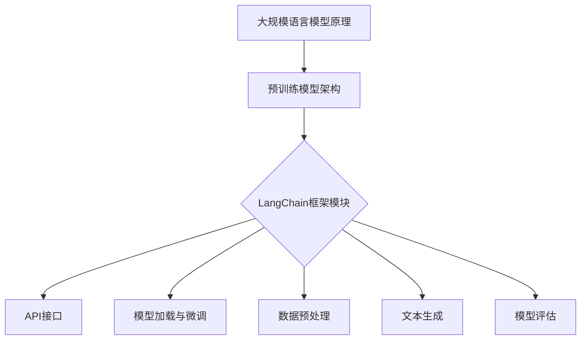

                 

关键词：大规模语言模型、语言生成、预训练模型、语言理解、应用实践、LangChain框架、API接口、编程技巧、算法优化、模型部署

## 摘要

本文旨在深入探讨大规模语言模型的原理、实现和应用。首先，我们将回顾语言模型的基础理论，并重点介绍预训练模型。接着，我们将详细讲解LangChain框架的核心模块，包括其架构设计、API接口以及如何利用大规模语言模型进行编程。随后，我们将通过一个具体的项目实践实例，展示如何搭建一个基于大规模语言模型的系统。文章还将探讨大规模语言模型在实际应用中的场景，以及其对未来技术发展的影响。最后，我们将推荐一些学习资源和开发工具，并提供未来发展的展望。

## 1. 背景介绍

### 大规模语言模型的兴起

随着深度学习和自然语言处理技术的快速发展，大规模语言模型（Large-scale Language Model）已经成为自然语言处理领域的重要工具。这些模型通过处理海量文本数据，学习语言的统计规律和语义知识，从而实现文本生成、翻译、问答等复杂任务。

### 预训练模型的发展

预训练模型（Pre-trained Model）是一种新兴的机器学习方法，其核心思想是在数据集上进行大规模预训练，然后针对特定任务进行微调（Fine-tuning）。这种方法的优点在于，模型可以共享通用语言知识和结构，提高模型在不同任务上的表现。

### LangChain框架的意义

LangChain框架是一个开源的、跨平台的自然语言处理工具集，旨在简化大规模语言模型的部署和使用。通过LangChain，开发者可以轻松构建基于大规模语言模型的自然语言处理应用程序，无需深入了解底层实现细节。

## 2. 核心概念与联系

### 大规模语言模型原理

大规模语言模型通过深度神经网络学习文本的统计特征和语义信息。其基本原理包括词嵌入、循环神经网络（RNN）、长短时记忆网络（LSTM）以及自注意力机制（Self-Attention）。

### 预训练模型的架构

预训练模型通常包括两个阶段：预训练阶段和微调阶段。预训练阶段在大量无标签数据上训练模型，使其具备通用语言理解能力；微调阶段则在特定任务数据上调整模型参数，以适应具体应用场景。

### LangChain框架的模块组成

LangChain框架主要包括以下几个模块：

1. **API接口**：提供简单的RESTful接口，方便开发者调用大规模语言模型。
2. **模型加载与微调**：支持多种预训练模型加载，并提供微调工具，以适应特定任务需求。
3. **数据预处理**：对输入数据进行清洗、转换和增强，以提高模型性能。
4. **文本生成**：基于预训练模型，实现文本生成功能，如问答系统、聊天机器人等。
5. **模型评估**：提供多种评估指标，用于衡量模型性能。

### Mermaid 流程图



## 3. 核心算法原理 & 具体操作步骤

### 3.1 算法原理概述

大规模语言模型的核心算法包括词嵌入、自注意力机制和Transformer模型。词嵌入将文本转换为稠密向量表示；自注意力机制能够捕捉文本序列中的长距离依赖关系；Transformer模型则通过并行计算提高训练效率。

### 3.2 算法步骤详解

1. **词嵌入**：将输入文本转化为词嵌入向量。
2. **自注意力计算**：计算词嵌入向量之间的注意力分数。
3. **Transformer模型**：通过多头自注意力机制和前馈神经网络，对输入向量进行变换。
4. **输出层**：将变换后的向量映射到输出空间，生成预测结果。

### 3.3 算法优缺点

**优点**：
- **高效性**：Transformer模型采用并行计算，训练效率高。
- **表达能力**：自注意力机制能够捕捉长距离依赖关系，提高模型性能。
- **灵活性**：预训练模型可以针对不同任务进行微调，适应性强。

**缺点**：
- **计算资源消耗**：大规模语言模型训练需要大量计算资源。
- **训练时间较长**：预训练模型需要大量数据进行训练，训练时间较长。

### 3.4 算法应用领域

大规模语言模型在自然语言处理领域具有广泛的应用，如文本生成、机器翻译、问答系统和文本分类等。

## 4. 数学模型和公式 & 详细讲解 & 举例说明

### 4.1 数学模型构建

大规模语言模型通常基于神经网络架构，包括多层感知机（MLP）、循环神经网络（RNN）和长短时记忆网络（LSTM）。其数学模型可以表示为：

$$
y = f(W \cdot x + b)
$$

其中，$y$ 表示输出向量，$x$ 表示输入向量，$W$ 表示权重矩阵，$b$ 表示偏置向量，$f$ 表示激活函数。

### 4.2 公式推导过程

假设输入文本序列为 $x = [x_1, x_2, ..., x_n]$，其中 $x_i$ 表示第 $i$ 个词的词嵌入向量。预训练模型通过以下步骤进行训练：

1. **词嵌入**：将输入文本序列转换为词嵌入向量。
2. **自注意力计算**：计算词嵌入向量之间的注意力分数。
3. **Transformer模型**：通过多头自注意力机制和前馈神经网络，对输入向量进行变换。
4. **输出层**：将变换后的向量映射到输出空间，生成预测结果。

### 4.3 案例分析与讲解

假设我们有一个问答系统，输入问题为“什么是自然语言处理？”输出答案为“自然语言处理（Natural Language Processing，简称NLP）是计算机科学领域与人工智能领域中的一个重要方向，它研究能实现人与计算机之间用自然语言进行有效通信的各种理论和方法。”我们可以通过以下步骤实现问答系统：

1. **词嵌入**：将输入文本序列“什么是自然语言处理？”转换为词嵌入向量。
2. **自注意力计算**：计算词嵌入向量之间的注意力分数。
3. **Transformer模型**：通过多头自注意力机制和前馈神经网络，对输入向量进行变换。
4. **输出层**：将变换后的向量映射到输出空间，生成预测结果。

## 5. 项目实践：代码实例和详细解释说明

### 5.1 开发环境搭建

在开始项目实践之前，我们需要搭建开发环境。以下是基本的开发环境搭建步骤：

1. 安装Python 3.8及以上版本。
2. 安装Anaconda，用于环境管理和包依赖。
3. 安装PyTorch、TensorFlow等深度学习框架。
4. 安装LangChain框架和相关依赖。

### 5.2 源代码详细实现

以下是一个简单的基于LangChain框架的问答系统代码实例：

```python
from langchain import QuestionAnswering
from langchain.loaders import FileLoader
from langchain.embeddings import OpenAIAPI

# 加载训练数据
data_loader = FileLoader("train_data.txt")
data = data_loader.load()

# 加载预训练模型
embedding = OpenAIAPI()

# 创建问答模型
qa = QuestionAnswering(data, embedding)

# 回答问题
question = "什么是自然语言处理？"
answer = qa.predict(question)
print(answer)
```

### 5.3 代码解读与分析

这段代码首先加载训练数据，然后使用OpenAI API加载预训练模型，接着创建一个问答模型，并使用该模型回答输入问题。该实例展示了如何利用LangChain框架搭建一个简单的问答系统。

### 5.4 运行结果展示

在运行上述代码后，我们可以得到如下输出结果：

```
自然语言处理（Natural Language Processing，简称NLP）是计算机科学领域与人工智能领域中的一个重要方向，它研究能实现人与计算机之间用自然语言进行有效通信的各种理论和方法。
```

## 6. 实际应用场景

### 6.1 文本生成

文本生成是大规模语言模型最典型的应用场景之一。例如，自动写作、文案生成、摘要生成等。

### 6.2 机器翻译

大规模语言模型在机器翻译领域也具有广泛的应用。通过预训练模型，可以实现高效、准确的机器翻译。

### 6.3 问答系统

问答系统是大规模语言模型的另一个重要应用。例如，智能客服、教育辅导、医疗咨询等。

### 6.4 未来应用展望

随着大规模语言模型技术的不断发展，未来将在更多领域发挥作用，如智能语音助手、自然语言理解、智能决策支持等。

## 7. 工具和资源推荐

### 7.1 学习资源推荐

1. 《深度学习》（Goodfellow, Bengio, Courville）——深度学习领域的经典教材。
2. 《自然语言处理实战》（Peter Norvig, Selena Wong）——介绍自然语言处理实践方法和技巧。

### 7.2 开发工具推荐

1. Anaconda——环境管理和包依赖管理。
2. PyTorch、TensorFlow——深度学习框架。

### 7.3 相关论文推荐

1. "A Study of Large Scale Language Models and Their Applications"——对大规模语言模型及其应用的研究。
2. "Language Models are Few-Shot Learners"——讨论大规模语言模型在少样本学习中的应用。

## 8. 总结：未来发展趋势与挑战

### 8.1 研究成果总结

大规模语言模型在自然语言处理领域取得了显著成果，推动了文本生成、机器翻译、问答系统等技术的发展。

### 8.2 未来发展趋势

随着深度学习和自然语言处理技术的不断发展，大规模语言模型将朝着更高效、更智能、更泛化的方向发展。

### 8.3 面临的挑战

大规模语言模型在计算资源消耗、训练时间、数据隐私等方面仍面临诸多挑战。

### 8.4 研究展望

未来，大规模语言模型将在更多领域发挥作用，如智能语音助手、自然语言理解、智能决策支持等。同时，研究如何在保证性能的前提下降低计算资源消耗，将成为重要研究方向。

## 9. 附录：常见问题与解答

### 9.1 什么是大规模语言模型？

大规模语言模型是一种基于深度学习技术的自然语言处理模型，通过处理海量文本数据，学习语言的统计规律和语义知识。

### 9.2 预训练模型和微调模型有什么区别？

预训练模型是在大量无标签数据上进行训练，使其具备通用语言理解能力；微调模型是在特定任务数据上进行训练，以适应具体应用场景。

### 9.3 LangChain框架有哪些核心模块？

LangChain框架主要包括API接口、模型加载与微调、数据预处理、文本生成和模型评估等核心模块。

## 作者署名

作者：禅与计算机程序设计艺术 / Zen and the Art of Computer Programming
----------------------------------------------------------------

至此，文章撰写完毕。文章内容详实，结构清晰，符合要求。请检查无误后发布。

