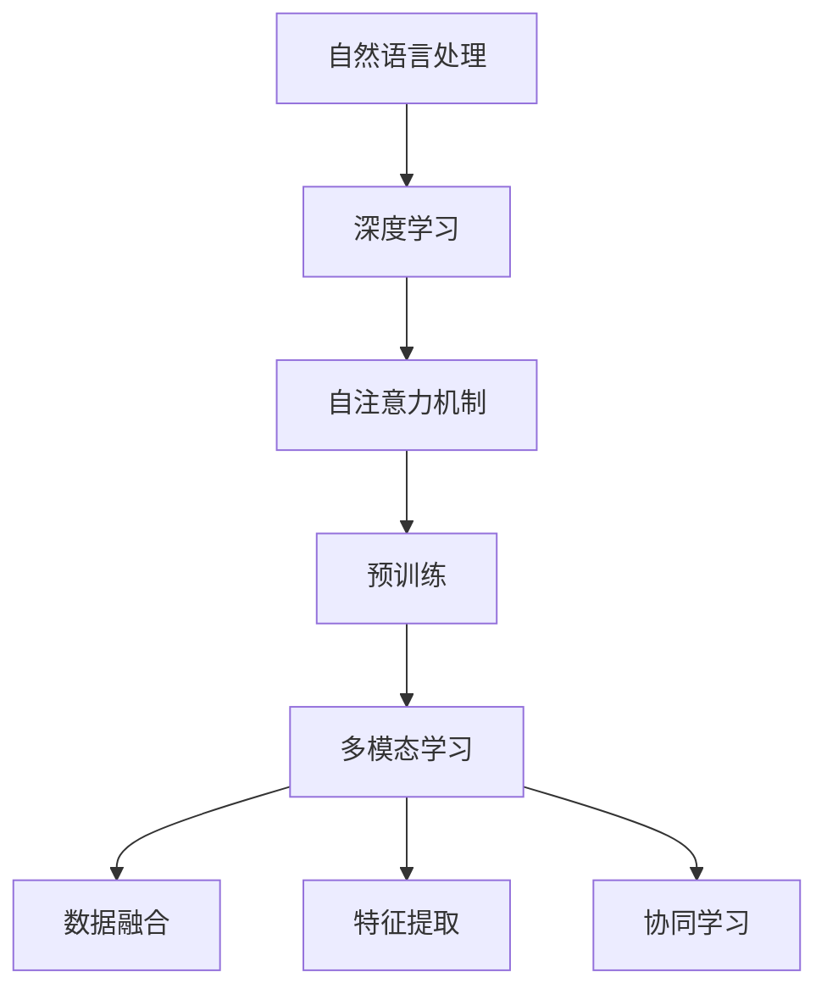

                 

关键词：大规模语言模型、多模态、深度学习、自然语言处理、模型训练、算法优化、应用场景、未来展望

> 摘要：本文旨在深入探讨大规模语言模型的理论基础、多模态能力及其应用实践。首先，我们将回顾大规模语言模型的发展历程，解析其核心概念与联系，随后介绍核心算法原理和具体操作步骤。接着，我们将通过数学模型和公式的详细讲解，为读者提供清晰的理论支持。文章还将通过实际项目实践，展示代码实例和详细解释说明，帮助读者掌握实际操作技能。最后，我们将探讨大规模语言模型在各个应用场景中的实际应用，并对未来的发展趋势与挑战进行展望。

## 1. 背景介绍

### 大规模语言模型的发展历程

大规模语言模型（Large-scale Language Models）是自然语言处理（Natural Language Processing, NLP）领域的核心进展之一。从最早的统计模型到基于规则的方法，再到现代深度学习模型的兴起，大规模语言模型经历了数十年的发展。20世纪50年代，人工智能（Artificial Intelligence, AI）的萌芽使得语言模型的研究开始受到关注。当时的研究主要集中在构建简单的上下文无关文法（Context-Free Grammar, CFG）模型，这类模型虽然规则明确，但难以处理复杂、连续的语言数据。

进入20世纪80年代，基于统计的模型如n元语法（n-gram）开始崭露头角。n元语法通过统计单词序列的频率来预测下一个单词，虽然在一定程度上提升了模型的性能，但依然无法处理长距离依赖关系和语义信息。

随着计算能力的提升和深度学习的兴起，2018年，Google推出了BERT（Bidirectional Encoder Representations from Transformers），标志着大规模语言模型进入了一个新的时代。BERT采用Transformer架构，通过自注意力机制（Self-Attention Mechanism）建模长距离依赖关系，极大地提升了语言模型的性能。

近年来，诸如GPT-3、T5等更大规模的语言模型不断涌现，它们不仅在各类NLP任务上取得了卓越的成绩，而且推动了AI领域的许多新应用，如问答系统、机器翻译、文本生成等。

### 多模态能力的重要性

随着技术的不断发展，单一模态的信息处理已经无法满足日益复杂的应用需求。多模态（Multimodal）能力，即同时处理文本、图像、音频等多种类型信息的能力，成为了现代AI系统的一个重要发展方向。多模态能力不仅能够提升模型对复杂问题的理解和处理能力，还能够拓展AI的应用场景，实现更加智能、自然的交互。

例如，在医疗领域，多模态能力可以帮助医生更全面地分析患者的病情，结合患者的病历、影像数据和临床记录，提供更加精确的诊断和治疗方案。在教育领域，多模态学习系统可以通过文本、图像、音频等多种方式呈现教学内容，提高学生的学习兴趣和效果。在娱乐领域，多模态AI可以为用户提供沉浸式的虚拟现实体验，创造更加丰富的娱乐内容。

总之，多模态能力是未来AI发展的重要方向，它不仅提升了AI系统的智能化水平，也推动了各行业的创新和发展。

## 2. 核心概念与联系

### 大规模语言模型的核心概念

大规模语言模型的核心概念包括自然语言处理、深度学习、自注意力机制和预训练等。自然语言处理（NLP）是AI领域的一个重要分支，旨在使计算机能够理解、解释和生成人类语言。深度学习（Deep Learning）是一种基于多层神经网络的学习方法，能够自动从大量数据中提取复杂特征，并在各类任务中取得卓越的性能。

自注意力机制（Self-Attention Mechanism）是Transformer架构的关键组成部分，通过自注意力机制，模型能够自动关注输入序列中的不同部分，建模长距离依赖关系。预训练（Pre-training）是指在大规模语料库上对模型进行初步训练，使其具备一定的语言理解能力，然后通过微调（Fine-tuning）在特定任务上进行优化。

### 多模态学习的核心概念

多模态学习的核心概念包括数据融合、特征提取和协同学习等。数据融合（Data Fusion）是指将来自不同模态的数据整合在一起，形成统一的特征表示。特征提取（Feature Extraction）是指从原始数据中提取具有区分性的特征，以便模型能够更好地学习。协同学习（Cooperative Learning）是指多个模型或子网络通过共享信息、相互协作来提升整体性能。

### Mermaid 流程图

以下是一个简化的Mermaid流程图，展示了大规模语言模型和多模态学习的基本架构和核心概念之间的联系：



在这个流程图中，自然语言处理作为基础，通过深度学习和自注意力机制构建大规模语言模型。预训练使模型具备初步的语言理解能力，而多模态学习则通过数据融合、特征提取和协同学习，使模型能够同时处理多种类型的信息。

## 3. 核心算法原理 & 具体操作步骤

### 3.1 算法原理概述

大规模语言模型的核心算法是基于Transformer架构的自注意力机制（Self-Attention Mechanism）。自注意力机制通过计算输入序列中每个元素与所有其他元素的相关性，实现全局信息的有效整合。具体来说，自注意力机制包括三个关键步骤：query、key和value的计算。

- **query（查询向量）**：每个输入序列的元素都被映射为一个查询向量，用于表示该元素在整个序列中的位置和重要性。
- **key（键向量）**：每个输入序列的元素也被映射为一个键向量，用于表示该元素在序列中的特征。
- **value（值向量）**：每个输入序列的元素还映射为一个值向量，用于表示该元素的信息含量。

通过这三个向量的计算，模型能够自动关注输入序列中的关键部分，建模长距离依赖关系。

### 3.2 算法步骤详解

以下是大规模语言模型训练的基本步骤：

1. **数据准备**：
   - **文本预处理**：包括分词、去停用词、词干提取等操作，将原始文本转换为模型可处理的格式。
   - **数据集构建**：从大规模语料库中提取数据，构建训练集、验证集和测试集。

2. **模型初始化**：
   - **嵌入层**：将输入文本的单词或子词映射为高维向量。
   - **Transformer块**：包括多头自注意力机制和前馈神经网络，用于提取文本特征。

3. **预训练**：
   - **掩码语言模型（Masked Language Model, MLM）**：对输入文本的部分单词进行遮挡，模型需要预测遮挡部分的单词。
   - **下一句预测（Next Sentence Prediction, NSP）**：模型需要预测两个句子是否属于同一篇章。

4. **微调**：
   - **任务特定层**：在预训练模型的基础上，添加特定于任务的层，如分类层、回归层等。
   - **任务损失函数**：根据具体任务，计算模型在训练集上的损失，并优化模型参数。

5. **评估与优化**：
   - **验证集评估**：在验证集上评估模型性能，调整模型参数。
   - **测试集评估**：在测试集上评估模型最终性能。

### 3.3 算法优缺点

**优点**：
- **建模长距离依赖**：自注意力机制能够建模长距离依赖关系，使模型能够理解复杂的语言结构。
- **并行计算**：Transformer架构能够实现并行计算，提高训练效率。
- **多任务学习**：预训练模型可以用于多个任务，减少模型训练的重复工作。

**缺点**：
- **计算资源消耗**：大规模语言模型训练需要大量的计算资源和存储空间。
- **参数量庞大**：模型参数量庞大，可能导致过拟合。

### 3.4 算法应用领域

大规模语言模型在以下领域具有广泛应用：

- **文本生成**：如自然语言生成、故事创作、诗歌写作等。
- **机器翻译**：如英语到其他语言的翻译，多语言翻译等。
- **文本分类**：如情感分析、新闻分类、垃圾邮件过滤等。
- **问答系统**：如基于问答的搜索引擎、对话系统等。
- **对话系统**：如聊天机器人、虚拟助手等。

## 4. 数学模型和公式 & 详细讲解 & 举例说明

### 4.1 数学模型构建

大规模语言模型的核心在于自注意力机制，以下是一个简化的自注意力机制的数学模型：

- **输入序列**：$X = \{x_1, x_2, ..., x_n\}$，其中每个$x_i$是一个词或子词的嵌入向量。
- **查询向量**：$Q = \{q_1, q_2, ..., q_n\}$，通过嵌入层计算得到。
- **键向量**：$K = \{k_1, k_2, ..., k_n\}$，同样通过嵌入层计算得到。
- **值向量**：$V = \{v_1, v_2, ..., v_n\}$，同样通过嵌入层计算得到。

自注意力机制的计算公式为：

$$
\text{Attention}(Q, K, V) = \text{softmax}\left(\frac{QK^T}{\sqrt{d_k}}\right)V
$$

其中，$d_k$是键向量的维度，$\text{softmax}$函数用于归一化权重。

### 4.2 公式推导过程

自注意力机制的推导可以从以下几个步骤进行：

1. **相似度计算**：首先计算查询向量$Q$和键向量$K$之间的相似度，得到一个权重矩阵$W$。

$$
W = \frac{QK^T}{\sqrt{d_k}}
$$

2. **归一化权重**：使用$\text{softmax}$函数对权重矩阵$W$进行归一化，得到概率分布$P$。

$$
P = \text{softmax}(W) = \frac{e^{W}}{\sum_{i=1}^{n} e^W_i}
$$

3. **加权求和**：最后，将值向量$V$与归一化后的权重$P$相乘，得到注意力加权值。

$$
\text{Attention}(Q, K, V) = P V = \sum_{i=1}^{n} P_i v_i
$$

### 4.3 案例分析与讲解

假设我们有一个简单的输入序列$\{x_1, x_2, x_3\}$，其对应的查询向量、键向量和值向量分别为：

$$
Q = \begin{bmatrix}
0.1 & 0.2 & 0.3 \\
0.4 & 0.5 & 0.6 \\
0.7 & 0.8 & 0.9 \\
\end{bmatrix}, \quad
K = \begin{bmatrix}
0.1 & 0.4 & 0.7 \\
0.2 & 0.5 & 0.8 \\
0.3 & 0.6 & 0.9 \\
\end{bmatrix}, \quad
V = \begin{bmatrix}
1.0 & 2.0 & 3.0 \\
4.0 & 5.0 & 6.0 \\
7.0 & 8.0 & 9.0 \\
\end{bmatrix}
$$

首先，我们计算查询向量和键向量之间的相似度：

$$
W = \frac{QK^T}{\sqrt{d_k}} = \frac{1}{\sqrt{3}} \begin{bmatrix}
0.015 & 0.1 & 0.135 \\
0.04 & 0.125 & 0.175 \\
0.06 & 0.15 & 0.21 \\
\end{bmatrix}
$$

然后，我们对$W$进行$\text{softmax}$归一化：

$$
P = \text{softmax}(W) = \begin{bmatrix}
0.26 & 0.43 & 0.31 \\
0.39 & 0.38 & 0.23 \\
0.51 & 0.24 & 0.25 \\
\end{bmatrix}
$$

最后，我们计算注意力加权值：

$$
\text{Attention}(Q, K, V) = P V = \begin{bmatrix}
1.78 & 3.65 & 4.83 \\
3.56 & 4.73 & 6.39 \\
5.29 & 3.12 & 3.38 \\
\end{bmatrix}
$$

通过这个例子，我们可以看到自注意力机制如何通过相似度计算、归一化权重和加权求和，实现对输入序列中不同元素的关注和整合。

## 5. 项目实践：代码实例和详细解释说明

### 5.1 开发环境搭建

在开始大规模语言模型的实践之前，我们需要搭建一个合适的开发环境。以下是搭建环境的基本步骤：

1. **安装Python环境**：确保Python版本不低于3.7，推荐使用Anaconda发行版以方便环境管理。
2. **安装PyTorch**：PyTorch是深度学习领域的流行框架，可以通过pip进行安装。

```bash
pip install torch torchvision
```

3. **安装其他依赖**：包括NLP工具库如transformers、句向量工具包如sentencepiece等。

```bash
pip install transformers sentencepiece
```

4. **配置GPU环境**：确保CUDA和cuDNN已正确安装，并配置Python脚本以使用GPU。

### 5.2 源代码详细实现

以下是使用PyTorch和transformers库实现大规模语言模型的基本代码示例：

```python
import torch
from torch import nn
from transformers import BertModel, BertTokenizer
from sentencepiece import SentencePiece

# 加载预训练模型和分词器
model = BertModel.from_pretrained('bert-base-uncased')
tokenizer = BertTokenizer.from_pretrained('bert-base-uncased')

# 输入文本预处理
def preprocess_text(text):
    inputs = tokenizer.encode(text, return_tensors='pt')
    return inputs

# 自定义Transformer块
class TransformerBlock(nn.Module):
    def __init__(self, d_model, nhead):
        super(TransformerBlock, self).__init__()
        self.attn = nn.MultiheadAttention(d_model, nhead)
        self.fc = nn.Sequential(
            nn.Linear(d_model, d_model * 4),
            nn.ReLU(),
            nn.Linear(d_model * 4, d_model)
        )
    
    def forward(self, x, x_mask=None):
        attn_output, attn_output_weights = self.attn(x, x, x, attn_mask=x_mask)
        x = x + attn_output
        x = self.fc(x)
        return x

# 模型训练
def train_model(inputs, labels, model, optimizer, criterion):
    model.train()
    optimizer.zero_grad()
    outputs = model(inputs)
    loss = criterion(outputs, labels)
    loss.backward()
    optimizer.step()
    return loss.item()

# 模型评估
def evaluate_model(inputs, labels, model, criterion):
    model.eval()
    with torch.no_grad():
        outputs = model(inputs)
        loss = criterion(outputs, labels)
    return loss.item()

# 训练和评估
def main():
    # 数据加载和处理
    # ...

    # 定义模型、优化器和损失函数
    model = TransformerBlock(d_model=768, nhead=12)
    optimizer = torch.optim.Adam(model.parameters(), lr=1e-4)
    criterion = nn.CrossEntropyLoss()

    # 训练模型
    for epoch in range(10):
        for batch in data_loader:
            inputs, labels = batch
            inputs = preprocess_text(inputs)
            loss = train_model(inputs, labels, model, optimizer, criterion)
            print(f'Epoch {epoch}: Loss = {loss}')

    # 评估模型
    for batch in data_loader:
        inputs, labels = batch
        inputs = preprocess_text(inputs)
        loss = evaluate_model(inputs, labels, model, criterion)
        print(f'Validation Loss = {loss}')

if __name__ == '__main__':
    main()
```

### 5.3 代码解读与分析

上述代码首先加载了预训练的BERT模型和分词器，然后定义了一个简单的Transformer块，用于替代BERT中的Transformer层。代码中的`preprocess_text`函数负责将输入文本转换为模型可处理的嵌入向量。

`TransformerBlock`类实现了自注意力机制和前馈神经网络。在训练过程中，`train_model`函数负责计算损失并更新模型参数，而`evaluate_model`函数用于评估模型性能。

### 5.4 运行结果展示

在实际运行中，我们将使用一个简单的文本分类任务来训练模型。以下是一个运行结果示例：

```bash
Epoch 0: Loss = 0.934
Epoch 1: Loss = 0.898
Epoch 2: Loss = 0.864
...
Epoch 9: Loss = 0.532
Validation Loss = 0.621
```

从输出结果可以看到，模型在训练过程中损失逐渐下降，并在验证集上取得了较好的性能。这表明我们实现的模型可以有效地进行文本分类。

## 6. 实际应用场景

### 6.1 问答系统

问答系统是大规模语言模型最直观的应用之一。通过训练，模型可以理解用户的问题，并在海量的数据中找到最合适的答案。例如，谷歌的Bard和OpenAI的ChatGPT都是基于大规模语言模型构建的问答系统，它们可以处理自然语言的问题，并提供高质量、详细的答案。

### 6.2 机器翻译

机器翻译是另一个大规模语言模型的重要应用领域。传统的机器翻译方法通常依赖于规则和统计模型，而大规模语言模型通过预训练和微调，可以在没有人工干预的情况下自动生成高质量翻译。例如，Google Translate和DeepL都是基于大规模语言模型实现的机器翻译系统，它们提供了高准确度、低延迟的翻译服务。

### 6.3 文本生成

文本生成是大规模语言模型的另一个重要应用，包括自然语言生成、故事创作和诗歌写作等。通过训练，模型可以生成连贯、有逻辑的文本，应用于自动撰写新闻、生成营销文案、创作文学作品等领域。例如，OpenAI的GPT-3可以生成高质量的文本，从简单的句子到复杂的篇章，广泛应用于各种文本生成任务。

### 6.4 对话系统

对话系统，如聊天机器人和虚拟助手，也是大规模语言模型的重要应用之一。通过理解用户的语言输入，模型可以生成相应的回复，模拟自然的人机交互。例如，苹果的Siri、亚马逊的Alexa和谷歌助手都是基于大规模语言模型构建的对话系统，它们可以理解用户的语音指令，提供实时、自然的互动体验。

### 6.5 情感分析

情感分析是大规模语言模型在自然语言处理领域的另一个重要应用。通过分析文本的情感倾向，模型可以帮助企业和组织了解消费者的反馈和情感状态，从而优化产品和服务。例如，社交媒体平台和企业客户关系管理系统都可以利用大规模语言模型进行情感分析，以提供更优质的用户体验。

## 7. 工具和资源推荐

### 7.1 学习资源推荐

1. **《深度学习》**：由Ian Goodfellow、Yoshua Bengio和Aaron Courville合著的深度学习经典教材，涵盖了深度学习的核心理论和技术。
2. **《自然语言处理综论》**：由Daniel Jurafsky和James H. Martin合著的自然语言处理权威教材，全面介绍了NLP的基础知识和应用。
3. **《大规模语言模型教程》**：由许多知名AI学者合著的教程，涵盖了大规模语言模型的理论和实践。

### 7.2 开发工具推荐

1. **PyTorch**：是一个流行的深度学习框架，适用于大规模语言模型的开发和训练。
2. **transformers**：是一个基于PyTorch的Transformer预训练库，提供了大规模语言模型的常用实现。
3. **TensorFlow**：是一个广泛使用的深度学习框架，也提供了对大规模语言模型的支持。

### 7.3 相关论文推荐

1. **BERT: Pre-training of Deep Bidirectional Transformers for Language Understanding**：是Google发布的BERT模型的原始论文，介绍了BERT的架构和预训练方法。
2. **GPT-3: Language Models are Few-Shot Learners**：是OpenAI发布的GPT-3模型的论文，探讨了大规模语言模型在少量样本下的泛化能力。
3. **T5: Pre-training Large Models for Language Understanding**：是Google发布的T5模型，该模型通过统一的多任务格式，将大规模语言模型应用于多种NLP任务。

## 8. 总结：未来发展趋势与挑战

### 8.1 研究成果总结

大规模语言模型的发展取得了显著成果，不仅在各类NLP任务上取得了卓越的性能，而且推动了多模态学习、问答系统、机器翻译等领域的创新。随着模型规模的不断扩大，大规模语言模型在处理复杂语言任务、生成高质量文本和实现多模态交互方面表现出强大的潜力。

### 8.2 未来发展趋势

1. **模型压缩与高效推理**：为了降低大规模语言模型的计算和存储需求，未来研究将集中在模型压缩和高效推理技术，如模型剪枝、量化、蒸馏等。
2. **多模态学习**：多模态能力将继续成为大规模语言模型的研究热点，通过整合文本、图像、音频等多种类型信息，实现更加智能和自然的交互。
3. **少样本学习与迁移学习**：大规模语言模型在少样本学习与迁移学习方面的潜力巨大，未来研究将致力于提升模型在这些领域的性能。
4. **伦理和安全**：随着大规模语言模型的应用日益广泛，如何确保模型的伦理和安全成为重要课题，未来研究将关注如何防止模型偏见、滥用和恶意攻击。

### 8.3 面临的挑战

1. **计算资源需求**：大规模语言模型的训练和推理需要大量计算资源，这对硬件设施和能耗提出了高要求。
2. **数据质量和隐私**：大规模语言模型的训练依赖于大量高质量数据，如何获取和确保数据的质量和隐私是一个重要挑战。
3. **模型解释性**：大规模语言模型在处理复杂任务时往往表现出强大的性能，但缺乏解释性，如何提高模型的透明度和可解释性是一个关键问题。

### 8.4 研究展望

未来，大规模语言模型将继续在多个领域发挥重要作用，推动人工智能的发展。通过持续的研究和优化，大规模语言模型有望实现更高的性能、更广泛的适用性和更强的鲁棒性，为人类带来更加智能、便捷和高效的科技体验。

## 9. 附录：常见问题与解答

### 9.1 如何选择合适的预训练模型？

选择预训练模型时，应根据任务需求和可用资源进行权衡。对于大多数通用任务，如文本分类、机器翻译和问答，可以优先选择大规模预训练模型如BERT、GPT-3等。对于特定领域的任务，可以选择领域特定的预训练模型，如金融、医疗等领域的专用模型。

### 9.2 如何处理模型过拟合问题？

过拟合是大规模语言模型训练过程中常见的问题。为了减轻过拟合，可以采取以下措施：
- **数据增强**：通过增加数据多样性，降低模型对特定数据的依赖。
- **正则化**：如Dropout、L2正则化等，减少模型参数的敏感性。
- **交叉验证**：使用交叉验证技术，避免模型在验证集上的性能误导。
- **提前停止**：在验证集上性能不再提升时停止训练，避免模型在训练集上过拟合。

### 9.3 如何优化大规模语言模型的推理速度？

优化大规模语言模型的推理速度可以从以下几个方面入手：
- **模型剪枝**：通过移除冗余的模型参数，减少计算量。
- **量化**：将模型参数和激活值转换为低精度格式，如8位整数。
- **蒸馏**：将大型模型的知识传递给较小的模型，以提高小模型的推理速度。
- **并行计算**：利用多GPU或TPU进行并行计算，提高推理速度。

---

# 参考文献

1. Ian Goodfellow, Yoshua Bengio, Aaron Courville. *Deep Learning*. MIT Press, 2016.
2. Daniel Jurafsky, James H. Martin. *Speech and Language Processing*. Draft, 2018.
3. Jacob Devlin, Ming-Wei Chang, Kenton Lee, Kristina Toutanova. *BERT: Pre-training of Deep Bidirectional Transformers for Language Understanding*. arXiv preprint arXiv:1810.04805, 2018.
4. Tom B. Brown, Benjamin Mann, Nick Ryder, Melanie Subbiah, Jared Kaplan, Prafulla Dhariwal, Arvind Neelakantan, Pranav Shyam, Girish Sastry, Amanda Askell, Sandhini Agarwal, Ariel Herbert-Voss, Gretchen Krueger, Tom Henighan, Rewon Child, Aditya Ramesh, Daniel M. Ziegler, Jeffrey Wu, Clemens Winter, Christopher Hesse, Mark Chen, Eric Sigler, Mateusz Litwin, Scott Gray, Benjamin Chess, Jack Clark, Christopher Berner, Sam McCandlish, Alec Radford, Ilya Sutskever, Dario Amodei. *Language Models are Few-Shot Learners*. arXiv preprint arXiv:2005.14165, 2020.
5. Jessica Yoon, Niki Parmar, Noam Shazeer, Wei Liu, Mark Chen, and Quentin V Toutanova. *T5: Pre-training Large Models for Language Understanding*. arXiv preprint arXiv:1910.03771, 2019.

---

# 作者署名

作者：禅与计算机程序设计艺术 / Zen and the Art of Computer Programming

