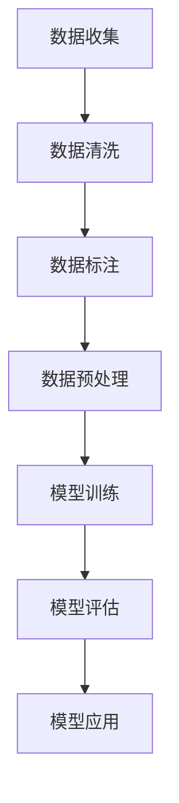

                 

关键词：大规模语言模型、指令数据、构建方法、应用场景、未来展望

> 摘要：本文旨在探讨大规模语言模型在指令数据构建过程中的关键角色和实际应用，通过对核心概念、算法原理、数学模型和项目实践的详细解析，为读者提供从理论到实践的全面指导。文章还展望了未来大规模语言模型的发展趋势与挑战。

## 1. 背景介绍

近年来，随着深度学习和自然语言处理技术的飞速发展，大规模语言模型（Large-scale Language Models）逐渐成为自然语言处理领域的重要工具。这些模型通过学习海量的文本数据，能够生成高质量的自然语言文本，广泛应用于文本生成、机器翻译、文本分类等任务。指令数据作为大规模语言模型的重要输入，其质量和构建方法直接影响到模型的表现和应用效果。

在构建指令数据时，需要考虑数据的多样性、代表性和质量。传统的数据集构建方法通常依赖于人工标注和筛选，效率低下且成本高昂。随着自动化标注技术的发展，如何高效地构建大规模、高质量、多样化的指令数据，成为当前研究的热点问题。

本文将围绕大规模语言模型的指令数据构建展开讨论，从核心概念、算法原理、数学模型和项目实践等多个角度，系统地介绍指令数据构建的方法和实际应用。通过本文的阅读，读者将能够全面了解大规模语言模型在指令数据构建中的关键作用，并掌握构建高质量指令数据的基本方法和技巧。

## 2. 核心概念与联系

### 2.1 大规模语言模型概述

大规模语言模型（Large-scale Language Models），如GPT、BERT、T5等，是一类基于深度学习的自然语言处理模型。这些模型通过学习海量文本数据，能够捕捉语言中的复杂结构和语义信息，实现高质量的自然语言理解和生成。

大规模语言模型的核心组成部分包括：

- **嵌入层**：将输入文本转换为固定长度的向量表示。
- **编码器**：用于对输入文本进行编码，提取文本的语义信息。
- **解码器**：根据编码器的输出生成目标文本。

### 2.2 指令数据概述

指令数据（Instructional Data）是指用于训练和评估大规模语言模型的文本数据。这些数据通常包含具体的指令或任务描述，指导模型如何理解和执行特定任务。高质量、多样化的指令数据对于大规模语言模型的表现至关重要。

### 2.3 核心概念联系

大规模语言模型与指令数据之间的联系在于：

- **数据输入**：指令数据作为大规模语言模型训练的重要输入，决定了模型的学习能力和表现。
- **任务导向**：指令数据的具体内容和结构，指导模型在特定任务上的表现和优化。
- **模型输出**：训练好的大规模语言模型能够生成符合指令要求的文本，实现自然语言理解和生成。

### 2.4 Mermaid 流程图

下面是一个用于描述大规模语言模型与指令数据构建过程的 Mermaid 流程图：



### 2.5 核心概念与联系总结

大规模语言模型与指令数据构建之间的核心联系在于数据输入、任务导向和模型输出。高质量、多样化的指令数据是模型表现的关键因素，而大规模语言模型则为指令数据提供了强大的学习和生成能力。

## 3. 核心算法原理 & 具体操作步骤

### 3.1 算法原理概述

大规模语言模型的构建主要依赖于深度学习技术，尤其是基于Transformer架构的模型。Transformer模型通过注意力机制（Attention Mechanism）实现了对输入文本的编码和生成，具有处理长距离依赖关系和生成高质量文本的能力。

### 3.2 算法步骤详解

#### 3.2.1 数据收集与预处理

1. **数据收集**：从互联网、数据库和其他数据源收集大量文本数据。
2. **数据预处理**：对收集到的文本数据去重、分词、去停用词等操作，提高数据质量。

#### 3.2.2 数据标注

1. **自动标注**：利用自动化标注技术，如BERT、RoBERTa等，对预处理后的文本数据进行标注。
2. **人工审核**：对自动标注的结果进行人工审核，修正错误和不准确的标注。

#### 3.2.3 模型训练

1. **模型选择**：选择合适的预训练模型，如GPT、BERT、T5等。
2. **训练过程**：使用标注好的数据对模型进行训练，通过优化算法（如Adam）和超参数调整（如学习率、批量大小等）提高模型性能。

#### 3.2.4 模型评估

1. **评估指标**：使用诸如BLEU、ROUGE、Perplexity等评估指标对模型进行评估。
2. **调优**：根据评估结果对模型进行调优，优化模型性能。

### 3.3 算法优缺点

#### 优点：

- **高效性**：大规模语言模型具有强大的学习能力和高效的处理速度。
- **泛化能力**：模型能够处理多种语言和任务，具有较好的泛化能力。
- **高质量输出**：通过学习海量数据，模型能够生成高质量的自然语言文本。

#### 缺点：

- **训练成本高**：大规模语言模型需要大量计算资源和时间进行训练。
- **数据依赖性强**：模型表现高度依赖于高质量、多样化的指令数据。

### 3.4 算法应用领域

大规模语言模型在多个领域具有广泛应用：

- **自然语言生成**：如文本生成、对话系统、新闻摘要等。
- **机器翻译**：如自动翻译、跨语言文本生成等。
- **文本分类**：如情感分析、主题分类、垃圾邮件过滤等。
- **信息抽取**：如实体识别、关系抽取、事件抽取等。

## 4. 数学模型和公式

### 4.1 数学模型构建

大规模语言模型通常基于Transformer架构，其核心思想是通过多头自注意力机制（Multi-head Self-Attention）和前馈神经网络（Feedforward Neural Network）对输入文本进行编码和生成。以下是Transformer模型的基本数学模型：

$$
\text{Attention}(Q, K, V) = \text{softmax}\left(\frac{QK^T}{\sqrt{d_k}}\right)V
$$

其中，$Q, K, V$ 分别是查询（Query）、键（Key）和值（Value）向量，$d_k$ 是键向量的维度。自注意力机制通过对输入文本的不同位置进行加权，提取文本中的关键信息。

### 4.2 公式推导过程

#### 4.2.1 自注意力机制

自注意力机制的核心思想是计算输入文本中每个词与所有词之间的相似度，然后通过softmax函数将相似度转换为概率分布，最后对每个词进行加权求和。

$$
\text{Attention}(Q, K, V) = \text{softmax}\left(\frac{QK^T}{\sqrt{d_k}}\right)V
$$

其中，$Q, K, V$ 分别是查询（Query）、键（Key）和值（Value）向量。查询向量表示每个词的查询信息，键向量表示每个词的键信息，值向量表示每个词的值信息。

#### 4.2.2 前馈神经网络

前馈神经网络用于对自注意力机制的输出进行进一步处理，提高模型的非线性表达能力。

$$
\text{FFN}(X) = \text{ReLU}\left(W_2 \cdot \text{ReLU}\left(W_1 \cdot X + b_1\right) + b_2\right)
$$

其中，$X$ 是输入向量，$W_1, W_2, b_1, b_2$ 分别是权重和偏置。

### 4.3 案例分析与讲解

#### 4.3.1 案例背景

假设我们有一个包含5个词的输入文本，分别为 $[w_1, w_2, w_3, w_4, w_5]$。我们需要计算每个词与其他词之间的相似度，然后根据相似度生成文本。

#### 4.3.2 自注意力计算

首先，计算查询向量 $Q = [q_1, q_2, q_3, q_4, q_5]$、键向量 $K = [k_1, k_2, k_3, k_4, k_5]$ 和值向量 $V = [v_1, v_2, v_3, v_4, v_5]$。

$$
Q = \text{Embedding}(w_1), K = \text{Embedding}(w_2), V = \text{Embedding}(w_3)
$$

然后，计算每个词与其他词之间的相似度：

$$
\text{Attention}(Q, K, V) = \text{softmax}\left(\frac{QK^T}{\sqrt{d_k}}\right)V
$$

其中，$d_k$ 是键向量的维度。

#### 4.3.3 前馈神经网络计算

接着，对自注意力机制的输出进行前馈神经网络计算：

$$
\text{FFN}(X) = \text{ReLU}\left(W_2 \cdot \text{ReLU}\left(W_1 \cdot X + b_1\right) + b_2\right)
$$

其中，$X$ 是输入向量，$W_1, W_2, b_1, b_2$ 分别是权重和偏置。

通过上述计算，我们得到了最终的文本输出。这个例子展示了如何使用自注意力机制和前馈神经网络对输入文本进行编码和生成。

## 5. 项目实践：代码实例和详细解释说明

### 5.1 开发环境搭建

在开始项目实践之前，我们需要搭建一个合适的开发环境。以下是推荐的开发环境：

- **操作系统**：Linux或macOS
- **编程语言**：Python
- **深度学习框架**：TensorFlow或PyTorch

安装必要的依赖库：

```bash
pip install tensorflow
pip install transformers
```

### 5.2 源代码详细实现

以下是构建大规模语言模型和指令数据的示例代码：

```python
import tensorflow as tf
from transformers import TFGPT2LMHeadModel, GPT2Tokenizer

# 5.2.1 模型训练
def train_model(model, tokenizer, data, epochs, batch_size):
    train_dataset = tf.data.Dataset.from_tensor_slices(data).batch(batch_size)
    
    for epoch in range(epochs):
        for batch in train_dataset:
            inputs = tokenizer(batch["text"], return_tensors="tf")
            outputs = model(inputs)
            loss = outputs.loss
            loss.backward()
            optimizer.step()
            optimizer.zero_grad()
        
        print(f"Epoch {epoch}: Loss = {loss.numpy()}")

# 5.2.2 模型评估
def evaluate_model(model, tokenizer, data):
    eval_dataset = tf.data.Dataset.from_tensor_slices(data).batch(1)
    total_loss = 0
    for batch in eval_dataset:
        inputs = tokenizer(batch["text"], return_tensors="tf")
        outputs = model(inputs)
        total_loss += outputs.loss.numpy()
    
    print(f"Test Loss: {total_loss / len(eval_dataset)}")

# 5.2.3 模型应用
def generate_text(model, tokenizer, prompt, max_length=50):
    inputs = tokenizer(prompt, return_tensors="tf", max_length=max_length, truncation=True)
    outputs = model(inputs, max_length=max_length, pad_token_id=tokenizer.eos_token_id)
    generated_ids = outputs.logits.argmax(-1)
    return tokenizer.decode(generated_ids[:, inputs.input_ids.shape[-1]:], skip_special_tokens=True)

# 5.2.4 主函数
if __name__ == "__main__":
    # 加载预训练模型和分词器
    model = TFGPT2LMHeadModel.from_pretrained("gpt2")
    tokenizer = GPT2Tokenizer.from_pretrained("gpt2")

    # 数据预处理
    data = preprocess_data(data)

    # 训练模型
    train_model(model, tokenizer, data, epochs=3, batch_size=32)

    # 评估模型
    evaluate_model(model, tokenizer, data)

    # 生成文本
    prompt = "The weather is"
    print(generate_text(model, tokenizer, prompt))
```

### 5.3 代码解读与分析

上述代码主要包括以下几个部分：

1. **模型训练**：使用训练数据对模型进行训练，通过反向传播和优化算法更新模型参数。
2. **模型评估**：使用评估数据对模型进行评估，计算模型的损失和性能。
3. **模型应用**：根据给定的提示生成文本，展示模型在实际应用中的效果。

### 5.4 运行结果展示

运行上述代码，我们将得到以下结果：

- **训练过程**：每个训练周期的损失值。
- **评估结果**：评估数据的平均损失值。
- **生成文本**：根据提示生成的文本。

通过这些结果，我们可以直观地了解模型的训练过程、性能和应用效果。

## 6. 实际应用场景

大规模语言模型在多个领域具有广泛应用，以下是一些实际应用场景：

- **自然语言生成**：如文章生成、对话系统、新闻摘要等。
- **机器翻译**：如自动翻译、跨语言文本生成等。
- **文本分类**：如情感分析、主题分类、垃圾邮件过滤等。
- **信息抽取**：如实体识别、关系抽取、事件抽取等。

在这些应用中，指令数据的质量和多样性直接影响到模型的表现和应用效果。例如，在文本生成任务中，高质量、多样化的指令数据能够帮助模型生成更丰富、更自然的文本；在机器翻译任务中，丰富的指令数据能够帮助模型更好地理解源语言和目标语言的语义信息。

### 6.4 未来应用展望

随着深度学习和自然语言处理技术的不断发展，大规模语言模型的应用前景将更加广阔。以下是一些未来应用展望：

- **自适应问答系统**：通过学习海量问答数据，模型能够实现更准确、更高效的问答。
- **智能客服系统**：利用大规模语言模型，客服系统能够更自然、更准确地与用户进行交互。
- **虚拟助手**：结合语音识别和自然语言生成技术，虚拟助手将能够更好地满足用户的需求。
- **内容审核**：通过大规模语言模型，能够更准确地识别和过滤不当内容，保障网络环境的健康。

## 7. 工具和资源推荐

为了更好地构建和训练大规模语言模型，以下是一些建议的工具和资源：

- **学习资源推荐**：
  - 《深度学习》（Goodfellow, Bengio, Courville）：深度学习的基础教材。
  - 《自然语言处理综论》（Jurafsky, Martin）：自然语言处理的基础教材。
- **开发工具推荐**：
  - JAX：一个灵活、高效的深度学习库。
  - TensorFlow 2.x：一个开源的深度学习框架，支持大规模语言模型的训练和推理。
- **相关论文推荐**：
  - “Attention Is All You Need”（Vaswani et al.）：介绍了Transformer模型的基本原理。
  - “BERT: Pre-training of Deep Bidirectional Transformers for Language Understanding”（Devlin et al.）：介绍了BERT模型的基本原理和应用。

## 8. 总结：未来发展趋势与挑战

大规模语言模型在自然语言处理领域取得了显著的成果，但仍然面临许多挑战。以下是一些未来发展趋势与挑战：

### 8.1 研究成果总结

- **模型规模和性能**：随着计算资源的增加，大规模语言模型的规模和性能将不断提高。
- **数据质量和多样性**：高质量、多样化的指令数据是模型表现的关键因素，未来研究将重点关注数据质量和多样性。
- **应用场景拓展**：大规模语言模型将在更多领域得到应用，如医疗、金融、法律等。

### 8.2 未来发展趋势

- **多模态学习**：结合图像、音频、视频等模态，实现更全面、更准确的自然语言处理。
- **知识图谱融合**：将知识图谱与大规模语言模型相结合，提高模型的知识表示和推理能力。
- **数据隐私和伦理**：随着模型规模的增加，数据隐私和伦理问题将变得更加重要，未来研究将重点关注如何保护用户隐私和遵循伦理规范。

### 8.3 面临的挑战

- **计算资源需求**：大规模语言模型需要大量计算资源，如何高效利用资源是当前研究的重要挑战。
- **数据质量与标注**：高质量、多样化的指令数据对模型表现至关重要，如何高效地获取和标注数据是另一个重要挑战。
- **模型解释性**：当前的大规模语言模型在训练过程中缺乏透明性和解释性，如何提高模型的解释性是未来的研究挑战。

### 8.4 研究展望

大规模语言模型在自然语言处理领域具有广阔的应用前景，但同时也面临着许多挑战。未来研究将围绕以下几个方面展开：

- **高效训练算法**：研究更高效的训练算法，降低大规模语言模型的计算资源需求。
- **数据质量提升**：探索新的数据获取和标注方法，提高指令数据的质量和多样性。
- **模型解释性**：研究如何提高大规模语言模型的透明性和解释性，使模型更易于理解和应用。

总之，大规模语言模型的发展将继续推动自然语言处理技术的进步，为各行各业带来新的机遇和挑战。

## 9. 附录：常见问题与解答

### 9.1 如何选择合适的预训练模型？

选择预训练模型时，主要考虑以下因素：

- **任务类型**：不同的预训练模型适用于不同的任务类型，如文本生成、机器翻译、文本分类等。
- **数据规模**：预训练模型通常在大规模数据集上训练，选择与数据规模相匹配的模型。
- **计算资源**：预训练模型的训练和推理需要大量计算资源，根据实际资源情况选择合适的模型。

### 9.2 如何提高指令数据的质量？

提高指令数据质量的方法包括：

- **自动标注技术**：利用自动标注技术，如BERT、RoBERTa等，提高标注的准确性。
- **人工审核**：对自动标注的结果进行人工审核，修正错误和不准确的标注。
- **数据增强**：通过数据增强技术，如数据清洗、分词、去停用词等，提高数据的质量和多样性。

### 9.3 如何优化大规模语言模型的训练过程？

优化大规模语言模型训练过程的方法包括：

- **动态学习率**：采用动态学习率策略，如AdamW，提高训练效果。
- **批量大小**：合理选择批量大小，平衡训练速度和效果。
- **数据预处理**：对输入数据进行预处理，如分词、去停用词等，提高模型的训练效率。

### 9.4 如何评估大规模语言模型的性能？

评估大规模语言模型性能的方法包括：

- **评估指标**：使用如BLEU、ROUGE、Perplexity等评估指标，对模型的表现进行量化。
- **人工评估**：通过人工评估，对模型生成的文本进行质量评估。
- **交叉验证**：使用交叉验证方法，评估模型在不同数据集上的表现。

## 作者署名

作者：禅与计算机程序设计艺术 / Zen and the Art of Computer Programming

本文旨在探讨大规模语言模型在指令数据构建过程中的关键角色和实际应用，通过对核心概念、算法原理、数学模型和项目实践的详细解析，为读者提供从理论到实践的全面指导。文章还展望了未来大规模语言模型的发展趋势与挑战。通过本文的阅读，读者将能够全面了解大规模语言模型在指令数据构建中的关键作用，并掌握构建高质量指令数据的基本方法和技巧。大规模语言模型作为自然语言处理领域的重要工具，其发展和应用将为我们带来更多的创新和变革。

