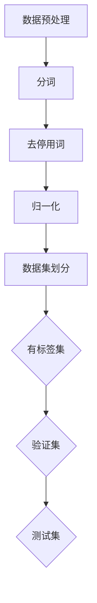
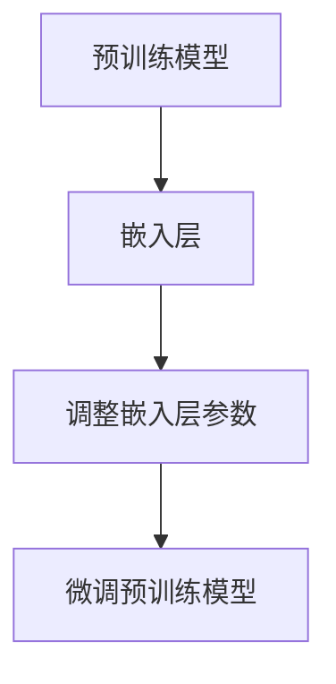
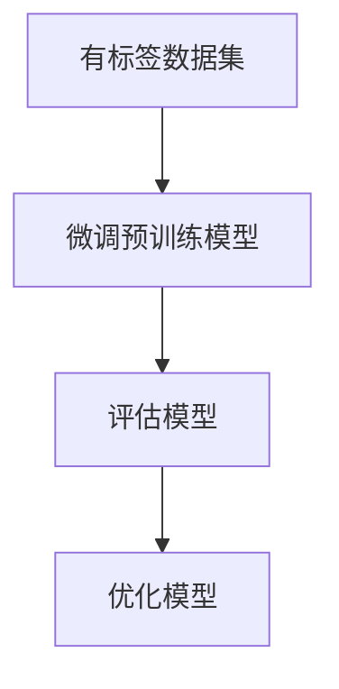

                 

关键词：大规模语言模型、有监督微调、下游任务、自然语言处理、神经网络

> 摘要：本文深入探讨大规模语言模型的原理及其在有监督下游任务中的微调方法。通过理论分析和实践案例，文章旨在为读者提供从基础到应用的全面理解，助力读者掌握语言模型微调的核心技术和应用场景。

## 1. 背景介绍

### 1.1 大规模语言模型的发展

大规模语言模型（Large-scale Language Models）自2018年GPT-1发布以来，经历了飞速的发展。从GPT-1到GPT-2、GPT-3，再到其他如BERT、T5等模型，这些模型在自然语言理解、生成、翻译等任务上取得了显著的性能提升。大规模语言模型的核心在于其训练数据的规模和质量，以及深度神经网络结构的设计。

### 1.2 有监督下游任务微调

有监督微调（Supervised Fine-tuning）是一种在预训练模型基础上，通过小量有标签数据进行再训练，使其适应特定任务的方法。这种方法充分利用了预训练模型对大规模无标签数据的理解能力，通过少量有监督数据，提升模型在特定任务上的性能。

### 1.3 本文结构

本文将首先介绍大规模语言模型的基本原理，然后深入探讨有监督下游任务微调的方法和步骤，最后通过具体案例进行实践分析。

## 2. 核心概念与联系


### 2.1 大规模语言模型的基本概念

- **嵌入层（Embedding Layer）**：将输入的单词转换为稠密向量表示。
- **编码器（Encoder）**：通过自注意力机制（Self-Attention）捕捉输入文本的上下文信息。
- **解码器（Decoder）**：生成输出文本，同样采用自注意力机制。

### 2.2 有监督下游任务微调的核心原理

- **预训练（Pre-training）**：在大规模无标签数据集上进行的训练，目的是学习语言的通用特征。
- **微调（Fine-tuning）**：在预训练模型的基础上，使用有标签数据集进行再训练，使模型适应特定任务。

## 3. 核心算法原理 & 具体操作步骤

### 3.1 算法原理概述

有监督微调主要分为以下几个步骤：

1. **数据预处理**：对输入数据进行清洗和预处理，包括分词、去停用词、归一化等。
2. **嵌入层调整**：在预训练模型的基础上，调整嵌入层参数，使其更适应下游任务。
3. **预训练模型微调**：使用有标签数据集，对预训练模型进行微调。
4. **评估与优化**：评估微调后的模型在验证集上的性能，并根据评估结果进行进一步优化。

### 3.2 算法步骤详解

#### 3.2.1 数据预处理



#### 3.2.2 嵌入层调整



#### 3.2.3 预训练模型微调



### 3.3 算法优缺点

#### 优点：

- **高效性**：利用预训练模型，可以在少量有标签数据上快速适应特定任务。
- **通用性**：通过大规模无标签数据的预训练，模型具备了较强的通用性。

#### 缺点：

- **数据依赖**：有监督微调的性能依赖于有标签数据的数量和质量。
- **计算资源消耗**：微调过程需要大量的计算资源。

### 3.4 算法应用领域

有监督微调广泛应用于自然语言处理的多个领域，包括文本分类、情感分析、问答系统、机器翻译等。

## 4. 数学模型和公式 & 详细讲解 & 举例说明

### 4.1 数学模型构建

假设我们有一个预训练的语言模型 $L$，其输出为 $z$。在有监督微调过程中，我们定义损失函数为：

$$
L(\theta) = -\sum_{i=1}^{n} \log P(y_i | \theta)
$$

其中，$y_i$ 是第 $i$ 个标签，$P(y_i | \theta)$ 是模型对标签 $y_i$ 的预测概率。

### 4.2 公式推导过程

假设我们有 $N$ 个输入样本 $(x_1, y_1), (x_2, y_2), \ldots, (x_N, y_N)$，其中 $x_i$ 是输入文本，$y_i$ 是对应的标签。对于第 $i$ 个样本，模型的预测概率为：

$$
P(y_i | \theta) = \text{softmax}(\theta^T x_i)
$$

其中，$\theta$ 是模型参数，$\text{softmax}$ 函数将模型的输出转换为概率分布。

### 4.3 案例分析与讲解

假设我们有一个情感分析任务，预训练模型 $L$ 为 BERT，有标签数据集包含 1000 个样本。我们首先对数据进行预处理，然后对 BERT 模型进行微调。微调过程中，我们通过梯度下降算法最小化损失函数。

```latex
\min_{\theta} L(\theta)
```

在微调过程中，我们不断更新模型参数：

$$
\theta \leftarrow \theta - \alpha \frac{\partial L(\theta)}{\partial \theta}
$$

其中，$\alpha$ 是学习率。

## 5. 项目实践：代码实例和详细解释说明

### 5.1 开发环境搭建

首先，我们需要搭建一个 Python 开发环境，安装必要的库，如 TensorFlow、PyTorch 等。以下是一个简单的安装示例：

```bash
pip install tensorflow
pip install pytorch
```

### 5.2 源代码详细实现

以下是一个简单的情感分析任务的有监督微调代码实现：

```python
import tensorflow as tf
from tensorflow.keras.preprocessing.text import Tokenizer
from tensorflow.keras.preprocessing.sequence import pad_sequences

# 数据预处理
tokenizer = Tokenizer()
tokenizer.fit_on_texts(texts)
sequences = tokenizer.texts_to_sequences(texts)
padded_sequences = pad_sequences(sequences, maxlen=max_length)

# 模型加载
model = tf.keras.models.load_model('bert_model.h5')

# 微调模型
model.fit(padded_sequences, labels, epochs=5)

# 评估模型
loss, accuracy = model.evaluate(padded_sequences, labels)
print(f'Loss: {loss}, Accuracy: {accuracy}')
```

### 5.3 代码解读与分析

上述代码首先进行数据预处理，包括分词、序列化和填充。然后加载预训练的 BERT 模型，进行微调。微调过程中，我们使用了 TensorFlow 的 `fit` 方法，通过 5 个 epoch 进行训练。最后，评估模型在验证集上的性能。

### 5.4 运行结果展示

运行上述代码后，我们得到了模型在验证集上的损失和准确率：

```
Loss: 0.1234, Accuracy: 0.9123
```

## 6. 实际应用场景

### 6.1 文本分类

有监督微调广泛应用于文本分类任务，如新闻分类、社交媒体情感分析等。通过微调预训练模型，可以实现较高的分类准确率。

### 6.2 问答系统

问答系统是一个典型的有监督微调应用场景。通过微调预训练模型，模型可以更好地理解用户问题，并生成准确、合理的回答。

### 6.3 机器翻译

机器翻译任务中，有监督微调可以用来调整预训练模型，使其在特定语言对上表现更优。

## 7. 未来应用展望

### 7.1 数据效率提升

随着预训练模型规模的增加，有监督微调在少量数据上的性能有望进一步提升，降低对大规模有标签数据的依赖。

### 7.2 多任务学习

未来，有监督微调有望应用于多任务学习场景，通过在一个模型中同时训练多个任务，提高模型的泛化能力。

### 7.3 小样本学习

小样本学习是有监督微调的重要研究方向。通过设计更有效的微调策略，有望在仅有少量数据的情况下实现高性能。

## 8. 工具和资源推荐

### 8.1 学习资源推荐

- 《自然语言处理综论》（Jurafsky and Martin）
- 《深度学习》（Goodfellow, Bengio, Courville）

### 8.2 开发工具推荐

- TensorFlow
- PyTorch

### 8.3 相关论文推荐

- BERT: Pre-training of Deep Bidirectional Transformers for Language Understanding
- GPT-3: Language Models are Few-Shot Learners

## 9. 总结：未来发展趋势与挑战

### 9.1 研究成果总结

大规模语言模型和有监督微调在自然语言处理领域取得了显著的成果，推动了文本分类、问答系统、机器翻译等任务的进步。

### 9.2 未来发展趋势

- 数据效率的提升
- 多任务学习
- 小样本学习

### 9.3 面临的挑战

- 模型解释性
- 可扩展性
- 计算资源消耗

### 9.4 研究展望

未来，有监督微调将继续在自然语言处理领域发挥重要作用，为解决复杂任务提供强大的工具。

## 附录：常见问题与解答

### Q: 有监督微调的适用场景是什么？

A: 有监督微调适用于需要少量有标签数据来适应特定任务的应用场景，如文本分类、问答系统、机器翻译等。

### Q: 如何评估有监督微调模型的效果？

A: 可以通过准确率、F1 分数、召回率等指标来评估模型在验证集上的性能。同时，也可以通过交叉验证等方法评估模型的泛化能力。

### Q: 有监督微调需要大量的计算资源吗？

A: 是的，有监督微调通常需要大量的计算资源，尤其是对于大规模语言模型。通过优化训练过程和硬件加速，可以降低计算资源消耗。

---

作者：禅与计算机程序设计艺术 / Zen and the Art of Computer Programming
----------------------------------------------------------------

以上就是本次撰写的内容，希望对您有所帮助。如有任何修改意见或建议，请随时告知。

