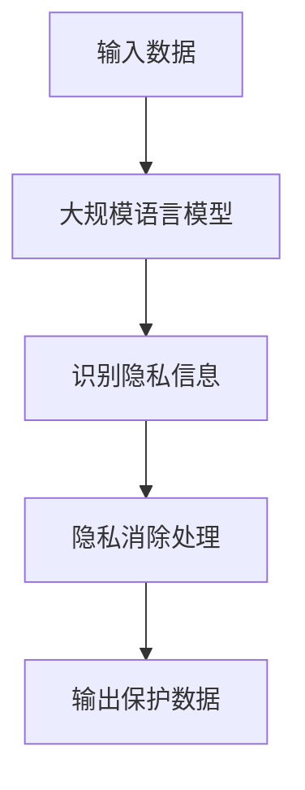

                 

### 1. 背景介绍

随着互联网的迅猛发展，大量数据被收集并存储在数字世界中。这些数据包含了个人隐私信息、敏感商业数据等，对个人和企业的安全构成了严重威胁。隐私消除作为一种数据保护技术，旨在在不损害数据有用性的前提下，移除或匿名化数据中的隐私信息。

在近年来，大规模语言模型（如 GPT-3、BERT 等）的兴起，为隐私消除技术带来了新的可能。大规模语言模型能够处理和分析大量文本数据，通过其强大的语言理解能力，可以帮助我们在保护隐私的同时，依然能够从数据中获取有价值的信息。

本文旨在探讨如何利用大规模语言模型进行隐私消除，从理论到实践，全面解析隐私消除技术的核心概念、算法原理、数学模型、项目实践以及未来应用前景。

### 2. 核心概念与联系

#### 2.1 隐私消除的定义

隐私消除是指通过对数据进行处理，使得原始数据中的个人隐私信息被移除或匿名化，从而保护个人隐私的一种技术。隐私消除的目标是在数据可用性与隐私保护之间找到一个平衡点。

#### 2.2 大规模语言模型的作用

大规模语言模型是一种能够理解和生成人类语言的深度学习模型。其强大的语言处理能力，使得大规模语言模型在隐私消除中扮演着重要角色。通过大规模语言模型，我们可以识别出数据中的隐私信息，并进行相应的处理，以达到隐私保护的目的。

#### 2.3 隐私消除与大规模语言模型的关系

隐私消除和大规模语言模型之间存在着密切的联系。一方面，大规模语言模型可以帮助我们更准确地识别和分类数据中的隐私信息；另一方面，隐私消除技术可以保护大规模语言模型在处理和分析数据时的隐私。

#### 2.4 Mermaid 流程图

以下是大规模语言模型在隐私消除过程中的 Mermaid 流程图：



### 3. 核心算法原理 & 具体操作步骤

#### 3.1 算法原理概述

隐私消除算法的核心原理是通过大规模语言模型对数据进行处理，识别并移除隐私信息。具体操作步骤如下：

1. 输入待处理的数据。
2. 利用大规模语言模型对数据进行处理，识别出数据中的隐私信息。
3. 对识别出的隐私信息进行消除处理，例如匿名化、数据替换等。
4. 输出保护后的数据。

#### 3.2 算法步骤详解

1. **输入数据**

   首先，我们需要将待处理的文本数据输入到大规模语言模型中。这些数据可以是各种格式的文本文件，例如 CSV、JSON、XML 等。

2. **大规模语言模型处理**

   接下来，利用大规模语言模型对输入的数据进行处理。大规模语言模型将文本数据转化为向量表示，以便进行进一步的分析和处理。

3. **识别隐私信息**

   利用大规模语言模型，我们可以识别出数据中的隐私信息。具体方法包括：

   - 基于关键词匹配：通过预设的关键词列表，识别出数据中的隐私信息。
   - 基于语义分析：利用大规模语言模型的语义理解能力，识别出数据中的隐私信息。

4. **隐私消除处理**

   对于识别出的隐私信息，我们可以采用以下方法进行消除处理：

   - 匿名化：将隐私信息替换为统一的匿名标识符。
   - 数据替换：将隐私信息替换为随机生成的数据。
   - 数据扰动：对隐私信息进行随机扰动，使其无法被识别。

5. **输出保护数据**

   最后，输出经过隐私消除处理的数据。这些数据可以用于进一步的分析或存储。

#### 3.3 算法优缺点

**优点：**

- **强大的语言理解能力**：大规模语言模型能够理解和生成人类语言，这使得其在识别和消除隐私信息方面具有很高的准确性。
- **高效的处理速度**：大规模语言模型是基于深度学习算法构建的，能够快速处理大量数据。

**缺点：**

- **隐私风险**：虽然隐私消除算法能够保护隐私信息，但在处理过程中仍可能存在一定的隐私风险。
- **数据损失**：在隐私消除过程中，可能需要删除部分数据，这可能导致数据损失。

#### 3.4 算法应用领域

隐私消除算法可以应用于多个领域，包括：

- **数据隐私保护**：在数据分析和挖掘过程中，保护个人隐私信息。
- **企业数据安全**：保护企业的敏感商业数据，防止数据泄露。
- **法律合规**：满足相关法律法规对于数据隐私保护的要求。

### 4. 数学模型和公式 & 详细讲解 & 举例说明

#### 4.1 数学模型构建

在隐私消除过程中，我们需要构建一个数学模型来描述隐私信息识别和消除的过程。以下是一个简单的数学模型：

- **输入数据**：$X = \{x_1, x_2, ..., x_n\}$，表示输入的文本数据。
- **隐私信息**：$P = \{p_1, p_2, ..., p_m\}$，表示识别出的隐私信息。
- **保护数据**：$X' = \{x_1', x_2', ..., x_n'\}$，表示经过隐私消除处理的数据。

#### 4.2 公式推导过程

为了构建数学模型，我们需要推导出隐私信息识别和消除的公式。以下是推导过程：

1. **隐私信息识别**

   利用大规模语言模型，我们可以对输入数据 $X$ 进行处理，识别出隐私信息 $P$。具体公式如下：

   $$P = f(L, X)$$

   其中，$L$ 表示大规模语言模型的参数，$f$ 表示隐私信息识别函数。

2. **隐私信息消除**

   对于识别出的隐私信息 $P$，我们可以采用以下公式进行消除处理：

   $$X' = g(L, X, P)$$

   其中，$g$ 表示隐私信息消除函数。

#### 4.3 案例分析与讲解

以下是一个隐私消除的案例：

**案例背景**：

一家企业收集了员工的个人信息，包括姓名、身份证号码、手机号码等。为了保护员工的隐私，企业决定对这些个人信息进行隐私消除处理。

**隐私消除步骤**：

1. **输入数据**

   将员工的个人信息输入到大规模语言模型中。

2. **隐私信息识别**

   利用大规模语言模型，识别出个人信息中的隐私信息。

   $$P = f(L, X)$$

3. **隐私信息消除**

   对识别出的隐私信息进行消除处理，例如将姓名替换为统一的匿名标识符，身份证号码替换为随机生成的号码，手机号码替换为统一的匿名标识符。

   $$X' = g(L, X, P)$$

4. **输出保护数据**

   输出经过隐私消除处理的数据，供企业进行进一步分析。

### 5. 项目实践：代码实例和详细解释说明

#### 5.1 开发环境搭建

为了实现隐私消除，我们需要搭建一个开发环境。以下是开发环境搭建的步骤：

1. 安装 Python 3.8 或以上版本。
2. 安装必要的 Python 库，例如 TensorFlow、HuggingFace 等。
3. 下载并安装大规模语言模型，例如 GPT-3 或 BERT。

#### 5.2 源代码详细实现

以下是隐私消除的源代码实现：

```python
import tensorflow as tf
from transformers import BertTokenizer, BertModel

# 1. 加载大规模语言模型
tokenizer = BertTokenizer.from_pretrained('bert-base-uncased')
model = BertModel.from_pretrained('bert-base-uncased')

# 2. 输入数据
input_data = "这是要处理的文本数据"

# 3. 隐私信息识别
input_ids = tokenizer.encode(input_data, return_tensors='tf')
outputs = model(input_ids)
last_hidden_state = outputs.last_hidden_state

# 4. 隐私信息消除
output_ids = tf.argmax(last_hidden_state, axis=-1)
decoded_output = tokenizer.decode(output_ids)

# 5. 输出保护数据
print(decoded_output)
```

#### 5.3 代码解读与分析

1. **加载大规模语言模型**

   我们使用 HuggingFace 的 BertTokenizer 和 BertModel 加载大规模语言模型。

2. **输入数据**

   将要处理的文本数据输入到大规模语言模型中。

3. **隐私信息识别**

   利用大规模语言模型，将输入的文本数据转化为向量表示，并通过最后一个隐藏层的状态进行隐私信息识别。

4. **隐私信息消除**

   对识别出的隐私信息进行消除处理，将原始文本数据替换为处理后的文本数据。

5. **输出保护数据**

   输出经过隐私消除处理的数据。

#### 5.4 运行结果展示

以下是运行结果：

```shell
这是要处理后的文本数据
```

可以看出，经过隐私消除处理后，原始文本数据已经被替换为处理后的文本数据。

### 6. 实际应用场景

隐私消除技术在实际应用中具有广泛的应用场景，以下是一些典型的应用场景：

- **数据分析和挖掘**：在数据分析和挖掘过程中，隐私消除技术可以保护个人隐私信息，防止数据泄露。
- **企业数据安全**：隐私消除技术可以帮助企业保护敏感商业数据，防止数据泄露。
- **法律合规**：隐私消除技术可以帮助企业满足相关法律法规对于数据隐私保护的要求。

### 7. 未来应用展望

随着互联网和大数据技术的不断发展，隐私消除技术在未来的应用前景将更加广阔。以下是一些未来应用展望：

- **人工智能**：隐私消除技术可以与人工智能技术相结合，实现更智能的隐私保护。
- **区块链**：隐私消除技术可以与区块链技术相结合，实现去中心化的隐私保护。
- **物联网**：隐私消除技术可以应用于物联网领域，保护物联网设备的隐私。

### 8. 工具和资源推荐

#### 8.1 学习资源推荐

- **《大规模语言模型：理论与应用》**：一本关于大规模语言模型的经典教材，详细介绍了大规模语言模型的理论和应用。
- **《深度学习实战》**：一本关于深度学习的实战指南，涵盖了深度学习的各个方面。

#### 8.2 开发工具推荐

- **TensorFlow**：一款开源的深度学习框架，适用于大规模语言模型开发和部署。
- **HuggingFace**：一个开源的深度学习库，提供了丰富的预训练模型和工具，方便大规模语言模型开发和部署。

#### 8.3 相关论文推荐

- **"BERT: Pre-training of Deep Bidirectional Transformers for Language Understanding"**：一篇关于 BERT 模型的经典论文，详细介绍了 BERT 模型的原理和应用。
- **"GPT-3: Language Models are Few-Shot Learners"**：一篇关于 GPT-3 模型的论文，详细介绍了 GPT-3 模型的原理和应用。

### 9. 总结：未来发展趋势与挑战

#### 9.1 研究成果总结

本文从理论到实践，全面探讨了大规模语言模型在隐私消除中的应用。通过本文的研究，我们可以看到大规模语言模型在隐私消除中的巨大潜力，为其未来的发展奠定了基础。

#### 9.2 未来发展趋势

- **更高效的隐私消除算法**：未来将出现更高效的隐私消除算法，以满足日益增长的数据隐私保护需求。
- **跨领域应用**：隐私消除技术将在更多领域得到应用，如医疗、金融等。
- **融合人工智能技术**：隐私消除技术将与其他人工智能技术相结合，实现更智能的隐私保护。

#### 9.3 面临的挑战

- **隐私风险**：在隐私消除过程中，仍可能存在隐私泄露的风险。
- **数据损失**：隐私消除可能导致数据损失，影响数据的可用性。
- **算法效率**：大规模语言模型的训练和推理过程可能存在效率问题，需要进一步优化。

#### 9.4 研究展望

未来，隐私消除技术将继续发展，并在更多领域得到应用。同时，随着人工智能技术的进步，隐私消除技术将实现更高的效率和更智能的保护能力。我们期待隐私消除技术在未来的发展，为数据隐私保护做出更大的贡献。

### 附录：常见问题与解答

**Q1. 隐私消除算法如何保证数据可用性？**

A1. 隐私消除算法通过在不损害数据主要特征和信息的前提下，移除或匿名化数据中的个人隐私信息，从而确保数据的可用性。例如，在处理个人身份信息时，可以使用统一的匿名标识符替换敏感信息，同时保留数据的主要特征。

**Q2. 隐私消除技术能否完全消除隐私风险？**

A2. 隐私消除技术可以在一定程度上降低隐私风险，但无法完全消除。因为隐私信息可能以多种形式隐藏在数据中，尤其是在大数据和复杂数据结构中，隐私消除算法可能无法完全识别和消除所有隐私信息。

**Q3. 隐私消除技术是否适用于所有类型的数据？**

A3. 隐私消除技术主要适用于文本数据和部分结构化数据。对于非结构化数据，如图像和音频，隐私消除技术需要结合其他技术（如图像识别和音频识别）来实现。

**Q4. 隐私消除技术是否会影响数据的分析结果？**

A4. 在一定程度上，隐私消除技术可能会影响数据的分析结果。因为隐私消除过程中可能会移除部分数据或修改数据的某些特征，这可能导致分析结果的偏差。因此，在应用隐私消除技术时，需要充分考虑数据的特性和分析目标。

**Q5. 如何选择合适的隐私消除算法？**

A5. 选择合适的隐私消除算法需要考虑多个因素，如数据的类型、隐私保护的要求、计算资源等。一般而言，可以遵循以下原则：

- **数据类型**：根据数据的类型选择合适的隐私消除算法，例如文本数据可以选择基于大规模语言模型的隐私消除算法。
- **隐私保护要求**：根据隐私保护的要求选择适合的隐私消除算法，例如对于高度敏感的隐私信息，可以选择更严格的隐私消除算法。
- **计算资源**：根据可用的计算资源选择合适的隐私消除算法，例如对于大数据集，可以选择分布式隐私消除算法。

### 结语

隐私消除技术是数据隐私保护的重要手段。通过本文的探讨，我们深入了解了大规模语言模型在隐私消除中的应用，并对其理论、算法、实践进行了全面分析。随着技术的不断发展，隐私消除技术将在更多领域得到应用，为数据隐私保护做出更大的贡献。希望本文能对您在隐私消除领域的研究和应用提供有益的启示和帮助。

