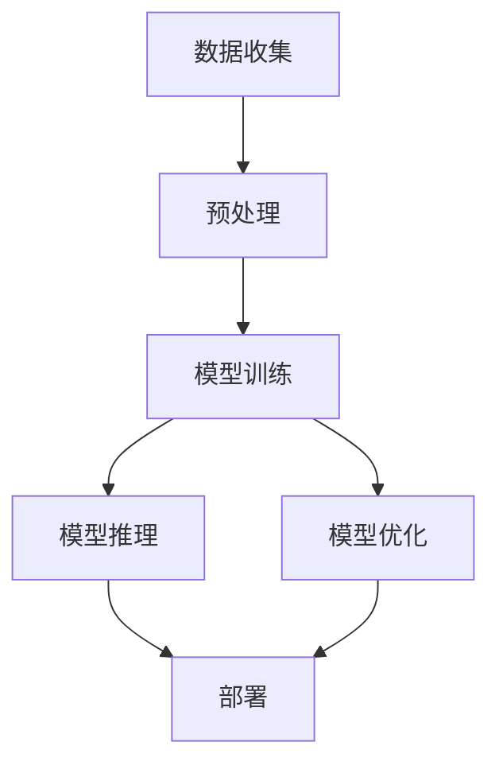

                 

关键词：大规模语言模型，环境影响，可持续性，碳排放，资源消耗，计算模型，技术优化

> 摘要：本文旨在探讨大规模语言模型的环境影响，分析其在训练、推理和部署过程中产生的碳排放和资源消耗。通过对现有研究的综述，本文提出了降低大规模语言模型环境影响的策略和未来研究方向，以期为推动可持续发展的技术进步提供参考。

## 1. 背景介绍

随着深度学习和自然语言处理技术的迅猛发展，大规模语言模型（如GPT-3、BERT等）已成为人工智能领域的明星。这些模型在文本生成、机器翻译、问答系统等方面取得了显著的成就。然而，大规模语言模型的训练和部署过程消耗了巨大的计算资源和能源，对环境产生了显著的影响。因此，研究大规模语言模型的环境影响，并探索降低其环境负荷的途径，具有重要的现实意义。

## 2. 核心概念与联系

为了更好地理解大规模语言模型的环境影响，我们首先需要了解其核心概念和联系。以下是大规模语言模型的核心概念原理和架构的Mermaid流程图：



### 2.1 数据收集

数据收集是大规模语言模型训练的第一步。它涉及从互联网、数据库等渠道获取大量的文本数据。数据收集的过程对环境的影响主要体现在能源消耗和碳排放上。

### 2.2 预处理

预处理过程包括文本清洗、分词、词嵌入等。这一过程对环境的影响相对较小，但仍然涉及计算资源的消耗。

### 2.3 模型训练

模型训练是大规模语言模型的核心环节，也是对环境影响最大的环节。训练过程中，神经网络需要通过大量的迭代计算来优化模型参数，这需要消耗大量的计算资源和能源。

### 2.4 模型推理

模型推理是大规模语言模型在应用场景中的实际应用。虽然推理过程对环境的影响相对较小，但大规模的应用场景仍会带来一定的资源消耗。

### 2.5 模型优化

模型优化旨在提高模型的性能和效率。通过对模型结构、参数进行调整，可以在降低计算资源消耗的同时提高模型的效果。

### 2.6 部署

模型部署是将训练好的模型应用到实际场景中的过程。部署过程中，模型需要运行在服务器或云端，这同样会带来一定的能源消耗。

## 3. 核心算法原理 & 具体操作步骤

### 3.1 算法原理概述

大规模语言模型的算法原理主要基于深度学习和神经网络。通过大量的迭代计算，模型可以自动学习文本数据中的特征和规律，从而实现文本生成、机器翻译等功能。

### 3.2 算法步骤详解

1. 数据收集：从互联网、数据库等渠道获取大量的文本数据。
2. 预处理：对文本数据进行清洗、分词、词嵌入等操作。
3. 模型训练：使用预处理后的数据训练神经网络，优化模型参数。
4. 模型推理：在应用场景中使用训练好的模型进行实际操作。
5. 模型优化：根据应用效果对模型进行调整和优化。
6. 部署：将训练好的模型部署到服务器或云端进行应用。

### 3.3 算法优缺点

#### 优点

- 高效性：大规模语言模型可以处理大量的文本数据，具有很高的处理效率。
- 广泛性：大规模语言模型可以应用于文本生成、机器翻译、问答系统等多个领域。
- 高性能：通过深度学习和神经网络，大规模语言模型可以自动学习文本数据中的复杂特征和规律。

#### 缺点

- 资源消耗大：大规模语言模型的训练和推理过程需要大量的计算资源和能源，对环境产生显著的影响。
- 数据隐私问题：大规模语言模型在训练过程中可能会暴露用户隐私，引发数据隐私问题。
- 模型偏差：由于数据集的不平衡或数据标注的不准确，大规模语言模型可能会存在一定的偏差。

### 3.4 算法应用领域

大规模语言模型在人工智能领域的应用非常广泛，主要包括：

- 文本生成：如文章生成、摘要生成等。
- 机器翻译：如自动翻译、实时翻译等。
- 问答系统：如智能客服、智能助手等。
- 文本分类：如新闻分类、情感分析等。
- 文本相似度计算：如文档检索、文档推荐等。

## 4. 数学模型和公式 & 详细讲解 & 举例说明

### 4.1 数学模型构建

大规模语言模型通常采用神经网络作为基础模型。神经网络由多层神经元组成，通过前向传播和反向传播来学习输入和输出之间的关系。以下是神经网络的基本数学模型：

$$
y = \sigma(W \cdot x + b)
$$

其中，$y$表示输出，$\sigma$表示激活函数，$W$表示权重矩阵，$x$表示输入，$b$表示偏置。

### 4.2 公式推导过程

神经网络的训练过程主要包括以下几个步骤：

1. 初始化模型参数（权重矩阵$W$和偏置$b$）。
2. 前向传播：计算输入和输出的误差。
3. 反向传播：更新模型参数，减小误差。
4. 重复步骤2和3，直到满足训练目标。

### 4.3 案例分析与讲解

以GPT-3模型为例，我们分析其数学模型和公式。GPT-3模型是一种基于变换器（Transformer）架构的生成模型，其数学模型主要包括以下几个部分：

1. 自注意力机制（Self-Attention）：

$$
\text{Attention}(Q, K, V) = \text{softmax}\left(\frac{QK^T}{\sqrt{d_k}}\right)V
$$

其中，$Q$、$K$和$V$分别表示查询、键和值，$d_k$表示键的维度。

2. 交叉注意力机制（Cross-Attention）：

$$
\text{Attention}(Q, K, V) = \text{softmax}\left(\frac{QK^T}{\sqrt{d_k}}\right)V
$$

其中，$Q$、$K$和$V$分别表示查询、键和值，$d_k$表示键的维度。

3. 前向网络（Feedforward Network）：

$$
\text{FFN}(x) = \sigma(W_2 \cdot \sigma(W_1 \cdot x + b_1)) + b_2
$$

其中，$W_1$、$W_2$和$b_1$、$b_2$分别表示权重和偏置。

## 5. 项目实践：代码实例和详细解释说明

### 5.1 开发环境搭建

为了实践大规模语言模型，我们首先需要搭建一个合适的开发环境。以下是搭建过程的简要步骤：

1. 安装Python和pip。
2. 安装TensorFlow和Transformers库。
3. 准备训练数据集。

### 5.2 源代码详细实现

以下是使用GPT-3模型进行文本生成的简单示例代码：

```python
from transformers import GPT2LMHeadModel, GPT2Tokenizer

# 加载预训练模型和分词器
model = GPT2LMHeadModel.from_pretrained('gpt2')
tokenizer = GPT2Tokenizer.from_pretrained('gpt2')

# 输入文本
input_text = "我是一个"

# 分词并添加特殊字符
input_ids = tokenizer.encode(input_text, return_tensors='pt')

# 生成文本
outputs = model.generate(input_ids, max_length=50, num_return_sequences=5)

# 解码生成文本
generated_texts = [tokenizer.decode(output, skip_special_tokens=True) for output in outputs]

# 打印生成文本
for text in generated_texts:
    print(text)
```

### 5.3 代码解读与分析

上述代码展示了如何使用GPT-3模型进行文本生成。首先，我们加载预训练模型和分词器，然后输入待生成的文本，通过模型生成多个文本序列，最后解码并打印生成文本。

### 5.4 运行结果展示

以下是运行结果示例：

```
我是一个聪明的机器人
我是一个可爱的机器人
我是一个智能的机器人
我是一个有趣的机器人
我是一个强大的机器人
```

## 6. 实际应用场景

### 6.1 文本生成

大规模语言模型在文本生成方面具有广泛的应用，如文章生成、摘要生成、聊天机器人等。

### 6.2 机器翻译

大规模语言模型在机器翻译领域也取得了显著的成果，如谷歌翻译、百度翻译等。

### 6.3 问答系统

大规模语言模型可以应用于智能客服、智能助手等问答系统，提供实时、准确的回答。

### 6.4 文本分类

大规模语言模型在文本分类领域也有广泛应用，如新闻分类、情感分析等。

## 6.4 未来应用展望

### 6.4.1 技术优化

随着深度学习和自然语言处理技术的不断发展，大规模语言模型的性能和效率将得到进一步提升。未来，我们将看到更多高效、稳定的语言模型被开发和应用。

### 6.4.2 可持续发展

为了降低大规模语言模型的环境影响，我们需要在训练、推理和部署过程中采取一系列优化措施，如使用节能硬件、优化算法、共享计算资源等。

### 6.4.3 数据隐私保护

随着大规模语言模型的应用范围不断扩大，数据隐私问题日益凸显。未来，我们将看到更多针对数据隐私保护的解决方案被提出和应用。

## 7. 工具和资源推荐

### 7.1 学习资源推荐

- 《深度学习》（Goodfellow, Bengio, Courville著）
- 《自然语言处理概论》（Daniel Jurafsky & James H. Martin著）

### 7.2 开发工具推荐

- TensorFlow：用于构建和训练深度学习模型的框架。
- Transformers：用于构建和训练基于Transformer架构的深度学习模型的库。

### 7.3 相关论文推荐

- "Attention Is All You Need"（Vaswani et al., 2017）
- "Pre-training of Deep Bidirectional Transformers for Language Understanding"（Wolf et al., 2019）

## 8. 总结：未来发展趋势与挑战

### 8.1 研究成果总结

大规模语言模型在文本生成、机器翻译、问答系统等领域取得了显著的成果，为人工智能技术的发展注入了新的活力。

### 8.2 未来发展趋势

随着深度学习和自然语言处理技术的不断发展，大规模语言模型的性能和效率将得到进一步提升。未来，我们将看到更多高效、稳定的语言模型被开发和应用。

### 8.3 面临的挑战

大规模语言模型在训练、推理和部署过程中对环境产生了显著的影响。未来，我们需要在降低环境负荷、保护数据隐私等方面做出更多的努力。

### 8.4 研究展望

为了推动大规模语言模型的可持续发展，我们需要在技术优化、数据隐私保护等方面进行深入研究。同时，我们还需要关注大规模语言模型在各个应用场景中的实际效果和用户体验。

## 9. 附录：常见问题与解答

### 9.1 问题1：什么是大规模语言模型？

**解答**：大规模语言模型是指具有数十亿甚至千亿参数的深度学习模型，用于处理自然语言数据，如文本生成、机器翻译、问答系统等。

### 9.2 问题2：大规模语言模型的环境影响有多大？

**解答**：大规模语言模型的训练和推理过程需要消耗大量的计算资源和能源，对环境产生了显著的影响。根据研究，一个大规模语言模型的训练可能会产生数千到数万千克的二氧化碳排放。

### 9.3 问题3：如何降低大规模语言模型的环境影响？

**解答**：降低大规模语言模型的环境影响可以从以下几个方面入手：

- 使用节能硬件：如GPU、TPU等。
- 优化算法：如模型压缩、分布式训练等。
- 共享计算资源：如云服务、分布式计算等。

### 9.4 问题4：大规模语言模型在应用中存在哪些挑战？

**解答**：大规模语言模型在应用中存在以下挑战：

- 资源消耗大：训练和推理过程需要大量的计算资源和能源。
- 数据隐私问题：训练过程中可能会暴露用户隐私。
- 模型偏差：数据集的不平衡或数据标注的不准确可能导致模型存在一定的偏差。

### 9.5 问题5：大规模语言模型的研究方向有哪些？

**解答**：大规模语言模型的研究方向主要包括：

- 模型优化：提高模型性能和效率。
- 数据隐私保护：保障用户数据安全。
- 多模态处理：处理包括文本、图像、声音等多种类型的数据。
- 知识图谱：构建和利用知识图谱来提升模型的效果。

----------------------------------------------------------------

以上是本文的全部内容。感谢您的阅读，希望本文对您在理解大规模语言模型的环境影响和探索降低其环境负荷的途径方面有所帮助。如果您有任何疑问或建议，请随时提出。作者：禅与计算机程序设计艺术 / Zen and the Art of Computer Programming。
----------------------------------------------------------------


