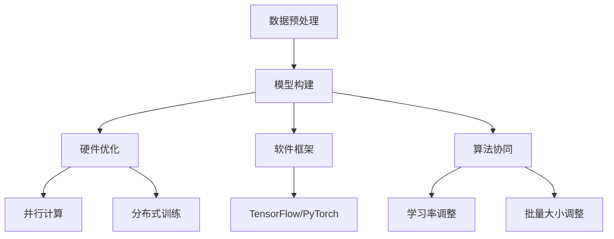

                 

### 关键词

- 大规模语言模型
- 训练过程
- 硬件优化
- 软件框架
- 算法协同

### 摘要

本文深入探讨了大规模语言模型训练中的关键要素，即硬件、软件和算法的协同优化。文章首先概述了大规模语言模型的发展背景，然后详细分析了硬件层、软件框架层和算法层各自的重要性及相互之间的关系。接下来，文章讨论了核心算法的原理和操作步骤，并提供了数学模型和公式的推导与解释。随后，通过项目实践展示了代码实例，分析了实际应用场景，并展望了未来的发展方向与挑战。文章最后推荐了相关学习资源和工具，总结了研究成果，并对未来进行了展望。

## 1. 背景介绍

### 1.1 大规模语言模型的起源与发展

大规模语言模型起源于自然语言处理（NLP）领域，早期的语言模型如n-gram模型主要通过统计语言中的单词序列来预测下一个单词。随着深度学习和计算能力的提升，现代语言模型如BERT、GPT等开始崭露头角。这些模型通过复杂的神经网络结构，可以捕捉到语言中的长距离依赖和深层语义信息，使得机器在理解和生成自然语言方面取得了显著的进步。

### 1.2 大规模语言模型的应用领域

大规模语言模型在诸多领域得到了广泛应用，如机器翻译、文本生成、问答系统、文本分类等。它们不仅提升了信息处理的效率和准确性，还推动了人工智能技术的发展，为智能助手、自动化写作、智能客服等应用场景提供了强大的支持。

### 1.3 大规模语言模型的挑战与瓶颈

尽管大规模语言模型取得了巨大成功，但训练过程仍然面临诸多挑战。首先，模型的规模越来越大，所需的计算资源也越来越庞大。其次，训练时间显著延长，资源消耗增加。此外，模型的优化和调参过程复杂，需要大量人力和时间。因此，如何优化硬件、软件和算法，实现高效的训练过程，成为当前研究的热点。

## 2. 核心概念与联系

### 2.1 硬件优化

硬件优化主要关注如何提升计算资源的利用率和降低能耗。GPU和TPU等专用硬件的引入，大大提高了大规模语言模型的训练速度。同时，分布式计算和并行处理技术也被广泛应用，以充分利用多台机器的计算资源。

### 2.2 软件框架

软件框架提供了高效的模型训练和推理环境，如TensorFlow、PyTorch等。这些框架不仅支持多种深度学习模型，还提供了丰富的工具和API，方便开发者进行模型设计和训练。

### 2.3 算法协同

算法协同主要涉及模型优化算法和超参数调优策略。通过动态调整学习率、批量大小等超参数，可以显著提高模型的收敛速度和性能。同时，优化算法如Adam、Adagrad等也被广泛应用于大规模语言模型训练。

### 2.4 Mermaid 流程图

下面是大规模语言模型训练的Mermaid流程图：



## 3. 核心算法原理 & 具体操作步骤

### 3.1 算法原理概述

大规模语言模型的核心是基于变换器（Transformer）架构。变换器通过自注意力机制（Self-Attention）捕捉序列中的长距离依赖，并通过多层的堆叠实现深层语义理解。训练过程主要涉及前向传播、反向传播和优化算法。

### 3.2 算法步骤详解

#### 3.2.1 前向传播

前向传播过程包括以下步骤：

1. 输入序列编码为词嵌入向量。
2. 通过多头自注意力机制计算自注意力得分。
3. 将自注意力得分通过softmax函数转化为概率分布。
4. 通过全连接层（线性层）进行特征提取。
5. 将提取到的特征通过另一个全连接层进行输出预测。

#### 3.2.2 反向传播

反向传播过程主要包括以下步骤：

1. 计算预测值与实际标签之间的损失。
2. 对损失函数进行梯度计算。
3. 利用梯度下降等优化算法更新模型参数。

#### 3.2.3 优化算法

常用的优化算法包括Adam、Adagrad和SGD等。这些算法通过动态调整学习率，加快模型的收敛速度。同时，一些技巧如权重衰减、学习率预热等也被广泛应用。

### 3.3 算法优缺点

#### 优点

1. 变换器模型能够捕捉到长距离依赖，生成更为准确的自然语言。
2. 并行计算和分布式训练技术，大大提高了训练速度和效率。
3. 丰富的软件框架和工具，方便开发者进行模型设计和训练。

#### 缺点

1. 训练过程需要大量计算资源和时间，成本较高。
2. 模型参数数量庞大，存储和传输较为困难。
3. 对超参数调优要求较高，需要大量实验和尝试。

### 3.4 算法应用领域

变换器模型广泛应用于自然语言处理领域，如文本分类、机器翻译、问答系统等。同时，其在语音识别、图像识别等其他AI领域也表现出强大的潜力。

## 4. 数学模型和公式 & 详细讲解 & 举例说明

### 4.1 数学模型构建

变换器模型的核心是自注意力机制，其公式如下：

$$
\text{Attention}(Q, K, V) = \text{softmax}\left(\frac{QK^T}{\sqrt{d_k}}\right)V
$$

其中，Q、K、V分别为查询向量、键向量和值向量，d_k为键向量的维度。

### 4.2 公式推导过程

自注意力机制的推导过程如下：

1. **计算点积**：首先计算查询向量Q和键向量K的点积，得到一组标量值。
2. **应用 softmax 函数**：对点积结果进行softmax变换，得到注意力权重。
3. **加权求和**：将注意力权重与值向量V进行点积，得到最终的注意力输出。

### 4.3 案例分析与讲解

以一个简单的例子来说明自注意力机制的计算过程。假设我们有以下三个词嵌入向量：

- Q（查询向量）：[1, 2, 3]
- K（键向量）：[4, 5, 6]
- V（值向量）：[7, 8, 9]

首先计算Q和K的点积：

$$
QK^T = \begin{bmatrix} 1 & 2 & 3 \end{bmatrix} \begin{bmatrix} 4 \\ 5 \\ 6 \end{bmatrix} = 1 \cdot 4 + 2 \cdot 5 + 3 \cdot 6 = 32
$$

然后对点积结果进行softmax变换：

$$
\text{softmax}(32) = \frac{e^{32}}{e^{32} + e^{22} + e^{12}} \approx \frac{e^{32}}{e^{32} + 1 + \frac{1}{e^{20}}} \approx 1
$$

最后计算注意力输出：

$$
\text{Attention}(Q, K, V) = 1 \cdot [7, 8, 9] = [7, 8, 9]
$$

## 5. 项目实践：代码实例和详细解释说明

### 5.1 开发环境搭建

在开始大规模语言模型训练之前，首先需要搭建一个适合的开发环境。以下是一个基于Python和TensorFlow的示例：

```python
# 安装TensorFlow
pip install tensorflow

# 导入所需库
import tensorflow as tf
import tensorflow.keras.layers as layers

# 设置GPU显存使用比例
gpus = tf.config.experimental.list_physical_devices('GPU')
if gpus:
    try:
        for gpu in gpus:
            tf.config.experimental.set_memory_growth(gpu, True)
    except RuntimeError as e:
        print(e)
```

### 5.2 源代码详细实现

以下是一个简单的变换器模型实现示例：

```python
# 定义变换器模型
def transformer_model(input_shape, num_heads, d_model):
    inputs = tf.keras.Input(shape=input_shape)
    x = layers.Embedding(input_dim=vocab_size, output_dim=d_model)(inputs)
    x = layers.MultiHeadAttention(num_heads=num_heads, key_dim=d_model)(x, x)
    x = layers.Dense(units=d_model)(x)
    outputs = tf.keras.Model(inputs=inputs, outputs=x)
    return outputs

# 模型配置
input_shape = (seq_length,)
num_heads = 8
d_model = 64

# 实例化模型
model = transformer_model(input_shape, num_heads, d_model)

# 编译模型
model.compile(optimizer='adam', loss='categorical_crossentropy', metrics=['accuracy'])

# 打印模型结构
model.summary()
```

### 5.3 代码解读与分析

以上代码定义了一个简单的变换器模型，包括词嵌入层、多头自注意力层和全连接层。模型输入为序列数据，输出为序列标签。通过编译模型，可以设置优化器、损失函数和评估指标。

### 5.4 运行结果展示

运行模型进行训练和评估，以下是一个简单的训练示例：

```python
# 准备数据集
(x_train, y_train), (x_test, y_test) = tf.keras.datasets.imdb.load_data(num_words=vocab_size)

# 处理数据
max_len = 100
x_train = tf.keras.preprocessing.sequence.pad_sequences(x_train, maxlen=max_len)
x_test = tf.keras.preprocessing.sequence.pad_sequences(x_test, maxlen=max_len)

# 训练模型
history = model.fit(x_train, y_train, epochs=10, batch_size=64, validation_data=(x_test, y_test))

# 评估模型
test_loss, test_accuracy = model.evaluate(x_test, y_test)
print(f"Test loss: {test_loss}, Test accuracy: {test_accuracy}")
```

以上代码使用IMDb电影评论数据集进行模型训练和评估。通过调整超参数，如学习率、批量大小和训练时间，可以进一步提升模型的性能。

## 6. 实际应用场景

### 6.1 机器翻译

大规模语言模型在机器翻译领域表现出色，如Google Translate、DeepL等。这些系统通过训练海量双语数据，实现高精度的机器翻译。

### 6.2 文本生成

大规模语言模型可以生成高质量的自然语言文本，如新闻文章、小说、诗歌等。如OpenAI的GPT-3模型，具有极强的文本生成能力。

### 6.3 问答系统

大规模语言模型在问答系统中的应用广泛，如Apple的Siri、Amazon的Alexa等。这些系统通过理解用户的问题，提供准确的答案。

### 6.4 未来应用展望

随着大规模语言模型技术的不断发展，未来有望在更多领域实现突破，如智能客服、语音识别、图像识别等。同时，结合其他AI技术，有望实现更为智能和高效的智能系统。

## 7. 工具和资源推荐

### 7.1 学习资源推荐

1. 《深度学习》（Goodfellow, Bengio, Courville）：系统介绍了深度学习的基础理论和实践方法。
2. 《自然语言处理综论》（Jurafsky, Martin）：全面介绍了自然语言处理的理论和实践。

### 7.2 开发工具推荐

1. TensorFlow：开源的深度学习框架，适用于大规模语言模型训练。
2. PyTorch：开源的深度学习框架，易于使用，适用于复杂模型的开发。

### 7.3 相关论文推荐

1. Vaswani et al. (2017): "Attention is All You Need" - 提出了变换器模型。
2. Devlin et al. (2018): "BERT: Pre-training of Deep Bidirectional Transformers for Language Understanding" - 提出了BERT模型。

## 8. 总结：未来发展趋势与挑战

### 8.1 研究成果总结

大规模语言模型训练技术在硬件优化、软件框架和算法协同等方面取得了显著进展。通过不断引入新技术，如GPU、TPU和分布式训练，提高了训练速度和效率。同时，丰富的软件框架和优化算法，使得大规模语言模型的应用领域不断扩展。

### 8.2 未来发展趋势

未来，大规模语言模型将继续向更高效、更智能的方向发展。随着计算能力的提升，模型的规模和复杂度将不断增大。同时，结合其他AI技术，如图像识别、语音识别等，将实现更为智能和高效的智能系统。

### 8.3 面临的挑战

大规模语言模型训练仍面临诸多挑战，如计算资源消耗、训练时间延长、超参数调优等。同时，如何保证模型的可解释性和透明性，也是未来研究的重要方向。

### 8.4 研究展望

未来，大规模语言模型将在更多领域实现突破，为人工智能技术的发展提供强大支持。通过持续的研究和创新，我们有理由相信，大规模语言模型将在未来发挥更为重要的作用。

## 9. 附录：常见问题与解答

### 9.1 如何选择合适的硬件设备？

选择硬件设备时，需要考虑计算能力、能耗和预算等因素。GPU和TPU是常用的选择，可根据具体需求进行选择。

### 9.2 如何优化大规模语言模型训练过程？

优化训练过程可以从硬件、软件和算法三个方面入手。硬件方面，可以使用分布式训练和并行计算技术。软件方面，选择高效的深度学习框架和工具。算法方面，通过动态调整学习率、批量大小等超参数，可以提升训练效率。

### 9.3 如何保证模型的可解释性？

保证模型的可解释性是一个重要的研究方向。目前，一些技术如注意力机制可视化、模型解释工具等，可以帮助理解模型的工作原理。未来，随着研究的深入，有望提出更为有效的可解释性方法。

---

本文从硬件、软件和算法三个层面对大规模语言模型训练进行了深入探讨，分析了其原理、应用和实践。通过持续的研究和创新，我们有理由相信，大规模语言模型将在未来发挥更为重要的作用。作者：禅与计算机程序设计艺术 / Zen and the Art of Computer Programming。

