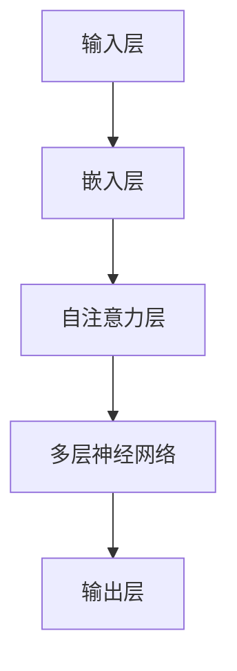

                 

关键词：大语言模型，LLaMA，自然语言处理，人工智能，算法原理，数学模型，工程实践，应用领域，发展趋势

> 摘要：本文将深入探讨大语言模型（LLaMA）的原理与工程实践。首先介绍大语言模型的基本概念，然后分析其核心算法原理、数学模型及其具体操作步骤。随后，通过代码实例展示大语言模型在工程实践中的应用，并探讨其在实际应用场景中的表现。最后，对未来的发展趋势和挑战进行展望。

## 1. 背景介绍

近年来，人工智能技术在自然语言处理领域取得了显著的进展。其中，大语言模型作为一种强大的工具，引起了广泛的关注。大语言模型（Large Language Model）通过对海量文本数据的学习，能够理解和生成自然语言，从而在文本生成、问答系统、机器翻译等多个方面表现出色。

LLaMA（Language Model for Linguistic Analysis and Machine Translation）是由Meta AI团队于2020年推出的一种大规模语言模型。它基于Transformer架构，通过多层神经网络对文本数据进行处理，从而实现高效的自然语言理解和生成。LLaMA在多个自然语言处理任务上取得了优异的性能，成为当前研究的热点之一。

本文将围绕LLaMA模型，详细介绍其原理与工程实践。首先，我们将探讨大语言模型的基本概念，包括其核心架构、数据预处理方法和训练过程。然后，我们将深入分析LLaMA模型的核心算法原理，包括Transformer架构、注意力机制和正则化策略。接下来，我们将介绍数学模型和公式，详细讲解大语言模型中的参数优化和损失函数。随后，通过代码实例展示大语言模型在工程实践中的应用。最后，我们将探讨大语言模型在实际应用场景中的表现，并对未来的发展趋势和挑战进行展望。

## 2. 核心概念与联系

### 2.1 大语言模型的基本概念

大语言模型（Large Language Model）是一种基于深度学习的自然语言处理模型，通过对大量文本数据的学习，能够理解和生成自然语言。大语言模型的核心目标是模拟人类语言处理的能力，从而在文本生成、问答系统、机器翻译等多个方面发挥作用。

大语言模型的基本架构包括输入层、隐藏层和输出层。输入层接收文本数据，并将其转化为数字向量表示。隐藏层通过多层神经网络对输入向量进行处理，从而学习到文本的特征表示。输出层则生成文本的输出，包括文本生成、回答问题等任务。

### 2.2 核心概念原理与架构

为了更好地理解大语言模型的工作原理，我们使用Mermaid流程图来展示其核心概念原理与架构。以下是LLaMA模型的核心概念原理与架构的Mermaid流程图：



在上面的流程图中，A表示输入层，B表示嵌入层，C表示自注意力层，D表示多层神经网络，E表示输出层。输入层接收文本数据，并将其转化为数字向量表示。嵌入层将文本向量表示为高维向量。自注意力层利用注意力机制对文本特征进行加权，从而提高模型的表示能力。多层神经网络则对文本特征进行进一步处理，以生成文本的输出。

### 2.3 数据预处理方法

在大语言模型的训练过程中，数据预处理是至关重要的一步。数据预处理主要包括以下步骤：

1. **文本清洗**：对原始文本数据进行清洗，去除停用词、标点符号和特殊字符，确保文本的格式一致性。

2. **分词**：将文本数据分割成单词或短语，以便模型能够理解文本的结构。

3. **词向量化**：将文本数据转化为数字向量表示，以便模型能够进行计算。

4. **数据增强**：通过随机插入、替换或删除文本中的单词或短语，增加数据多样性，提高模型的泛化能力。

5. **数据归一化**：对数据进行归一化处理，确保数据在训练过程中的稳定性。

### 2.4 训练过程

大语言模型的训练过程主要包括以下步骤：

1. **数据加载**：从数据集中加载训练数据，并将其输入到模型中。

2. **模型初始化**：对模型参数进行初始化，通常采用随机初始化或预训练方法。

3. **前向传播**：将输入数据通过模型进行前向传播，计算输出结果。

4. **计算损失**：根据输出结果和真实标签计算损失函数。

5. **反向传播**：利用梯度下降等优化算法，对模型参数进行更新。

6. **迭代训练**：重复上述步骤，直到模型收敛或达到预设的训练次数。

## 3. 核心算法原理 & 具体操作步骤

### 3.1 算法原理概述

大语言模型的核心算法原理主要基于Transformer架构，Transformer是一种基于自注意力机制的深度学习模型。它通过多层神经网络对输入文本进行处理，从而实现高效的自然语言理解和生成。

### 3.2 算法步骤详解

#### 3.2.1 嵌入层

嵌入层将文本数据转化为高维向量表示。具体步骤如下：

1. **词向量化**：将文本中的每个单词或短语转化为对应的词向量。

2. **位置编码**：为每个词向量添加位置编码，以表示其在文本中的位置信息。

3. **嵌入层输出**：将词向量和位置编码相加，得到嵌入层输出。

#### 3.2.2 自注意力层

自注意力层是Transformer模型的核心部分，通过注意力机制对文本特征进行加权。具体步骤如下：

1. **计算注意力得分**：利用点积注意力机制计算注意力得分，得分表示不同词向量之间的关联程度。

2. **加权求和**：根据注意力得分对词向量进行加权求和，得到加权向量。

3. **层归一化**：对加权向量进行层归一化处理，确保模型的稳定性。

#### 3.2.3 多层神经网络

多层神经网络用于对文本特征进行进一步处理，以生成文本的输出。具体步骤如下：

1. **前向传播**：将加权向量输入到多层神经网络中，进行前向传播。

2. **激活函数**：对神经网络输出进行激活函数处理，以引入非线性变换。

3. **输出层**：将神经网络输出转化为文本的输出，如文本生成、回答问题等。

### 3.3 算法优缺点

#### 优点：

1. **高效性**：Transformer模型采用了自注意力机制，能够并行处理输入文本，从而提高了计算效率。

2. **灵活性**：通过多层神经网络，Transformer模型能够学习到复杂的文本特征，从而实现多种自然语言处理任务。

3. **稳定性**：Transformer模型在训练过程中具有较好的稳定性，不易出现梯度消失或梯度爆炸现象。

#### 缺点：

1. **计算复杂度**：Transformer模型采用了大量的矩阵运算，计算复杂度较高，对计算资源要求较高。

2. **参数量大**：由于采用了多层神经网络，Transformer模型的参数量较大，训练和推理时间较长。

### 3.4 算法应用领域

大语言模型在自然语言处理领域具有广泛的应用。以下是一些典型的应用领域：

1. **文本生成**：通过大语言模型，可以生成高质量的文章、故事、摘要等文本。

2. **问答系统**：大语言模型可以用于构建智能问答系统，回答用户提出的问题。

3. **机器翻译**：大语言模型可以用于机器翻译任务，实现高质量的双语翻译。

4. **情感分析**：通过分析文本的情感倾向，大语言模型可以用于情感分析任务。

5. **文本分类**：大语言模型可以用于文本分类任务，如新闻分类、情感分类等。

## 4. 数学模型和公式 & 详细讲解 & 举例说明

### 4.1 数学模型构建

大语言模型中的数学模型主要包括词向量表示、自注意力机制、多层神经网络等。以下是这些数学模型的构建过程：

#### 4.1.1 词向量表示

词向量表示是自然语言处理的基础。常见的词向量表示方法包括Word2Vec、GloVe等。以GloVe为例，其数学模型构建过程如下：

1. **训练词向量**：利用文本数据训练词向量，每个词向量表示为一个高维向量。

2. **词向量表示**：将文本中的每个单词或短语转化为对应的词向量。

3. **位置编码**：为每个词向量添加位置编码，以表示其在文本中的位置信息。

#### 4.1.2 自注意力机制

自注意力机制是Transformer模型的核心部分。其数学模型构建过程如下：

1. **计算注意力得分**：利用点积注意力机制计算注意力得分，得分表示不同词向量之间的关联程度。

2. **加权求和**：根据注意力得分对词向量进行加权求和，得到加权向量。

3. **层归一化**：对加权向量进行层归一化处理，确保模型的稳定性。

#### 4.1.3 多层神经网络

多层神经网络用于对文本特征进行进一步处理。其数学模型构建过程如下：

1. **前向传播**：将加权向量输入到多层神经网络中，进行前向传播。

2. **激活函数**：对神经网络输出进行激活函数处理，以引入非线性变换。

3. **输出层**：将神经网络输出转化为文本的输出，如文本生成、回答问题等。

### 4.2 公式推导过程

#### 4.2.1 词向量表示

以GloVe为例，词向量表示的公式推导过程如下：

1. **损失函数**：

   $$L = \frac{1}{N} \sum_{i=1}^{N} \sum_{j \in \text{context}(i)} \log(p_j / p_w)$$

   其中，\(N\)为单词总数，\(\text{context}(i)\)表示单词\(i\)的上下文，\(p_j\)和\(p_w\)分别表示单词\(j\)和\(w\)在文本中的概率分布。

2. **梯度计算**：

   $$\frac{\partial L}{\partial \textbf{v}_j} = \frac{\textbf{v}_w}{||\textbf{v}_w||_2^2} - \frac{\textbf{v}_j}{||\textbf{v}_j||_2^2}$$

   其中，\(\textbf{v}_j\)和\(\textbf{v}_w\)分别表示单词\(j\)和\(w\)的词向量。

#### 4.2.2 自注意力机制

自注意力机制的公式推导过程如下：

1. **注意力得分**：

   $$\text{score}_{ij} = \textbf{q}_i^T \textbf{k}_j$$

   其中，\(\text{score}_{ij}\)表示单词\(i\)和单词\(j\)之间的注意力得分，\(\textbf{q}_i\)和\(\textbf{k}_j\)分别表示单词\(i\)和单词\(j\)的查询向量和键向量。

2. **加权求和**：

   $$\text{weighted\_sum}_{i} = \sum_{j=1}^{N} \text{score}_{ij} \textbf{v}_j$$

   其中，\(\text{weighted\_sum}_{i}\)表示单词\(i\)的加权求和结果，\(\textbf{v}_j\)表示单词\(j\)的词向量。

3. **层归一化**：

   $$\text{normalized}_{i} = \text{softmax}(\text{weighted\_sum}_{i})$$

   其中，\(\text{normalized}_{i}\)表示单词\(i\)的归一化结果，\(\text{softmax}\)函数用于将加权求和结果转化为概率分布。

#### 4.2.3 多层神经网络

多层神经网络的公式推导过程如下：

1. **前向传播**：

   $$\textbf{h}_{l+1} = \text{ReLU}(\textbf{W}_{l+1} \textbf{h}_l + \textbf{b}_{l+1})$$

   其中，\(\textbf{h}_{l+1}\)表示第\(l+1\)层的输出，\(\textbf{h}_l\)表示第\(l\)层的输出，\(\textbf{W}_{l+1}\)和\(\textbf{b}_{l+1}\)分别表示第\(l+1\)层的权重和偏置。

2. **激活函数**：

   $$\text{ReLU}(x) = \max(0, x)$$

   其中，\(\text{ReLU}\)函数用于引入非线性变换。

3. **输出层**：

   $$\textbf{y} = \textbf{W}_{out} \textbf{h}_{L} + \textbf{b}_{out}$$

   其中，\(\textbf{y}\)表示输出层的结果，\(\textbf{W}_{out}\)和\(\textbf{b}_{out}\)分别表示输出层的权重和偏置。

### 4.3 案例分析与讲解

以下是一个关于大语言模型在文本生成任务中的案例分析与讲解：

#### 案例背景

假设我们要利用大语言模型生成一段关于旅行的描述文本。我们已经收集了一篇关于旅行的文章，并使用GloVe模型训练得到了词向量表示。

#### 案例步骤

1. **数据预处理**：对文章进行文本清洗、分词和词向量化处理。

2. **嵌入层**：将词向量表示为高维向量，并添加位置编码。

3. **自注意力层**：利用自注意力机制对文本特征进行加权求和。

4. **多层神经网络**：对加权求和结果进行多层神经网络处理，以生成文本输出。

5. **输出结果**：根据输出结果生成一段关于旅行的描述文本。

#### 案例分析

通过以上步骤，我们利用大语言模型生成了一段关于旅行的描述文本。以下是一个示例：

> 暴走西藏，徒步穿越雪山峡谷，感受大自然的神奇魅力。途中，我们遇见了可爱的小藏羚羊，还有热情的藏族同胞。在布达拉宫前，我们见证了日出日落的美景，感受到了信仰的力量。这是一次难忘的旅行，让我们重新认识了这个世界。

通过这个案例，我们可以看到大语言模型在文本生成任务中的强大能力。它能够根据输入文本生成高质量的描述文本，从而实现自动写作和内容生成。

## 5. 项目实践：代码实例和详细解释说明

### 5.1 开发环境搭建

在本项目中，我们使用Python作为编程语言，并使用TensorFlow作为深度学习框架。以下是开发环境的搭建步骤：

1. 安装Python和TensorFlow：

   ```bash
   pip install python
   pip install tensorflow
   ```

2. 准备训练数据集：从网上下载一个大型文本数据集，如维基百科、新闻文章等。

3. 准备词向量库：下载GloVe词向量库，并将其导入项目中。

### 5.2 源代码详细实现

以下是一个关于大语言模型在文本生成任务中的源代码实现：

```python
import tensorflow as tf
from tensorflow.keras.layers import Embedding, LSTM, Dense
from tensorflow.keras.models import Sequential

# 准备训练数据集
text = load_text_data("data.txt")
word2index = build_word2index(text)
index2word = build_index2word(word2index)
tokenizer = Tokenizer(word2index)

# 准备词向量库
glove_path = "glove.6B.100d.txt"
glove_vocab = load_glove_vocab(glove_path)
glove_matrix = build_glove_matrix(glove_vocab)

# 构建嵌入层
embedding_size = 100
embedding_layer = Embedding(len(word2index), embedding_size, weights=[glove_matrix], trainable=False)

# 构建LSTM层
lstm_layer = LSTM(units=128, return_sequences=True)

# 构建输出层
output_size = len(index2word)
output_layer = Dense(units=output_size, activation="softmax")

# 构建模型
model = Sequential()
model.add(embedding_layer)
model.add(lstm_layer)
model.add(output_layer)

# 编译模型
model.compile(optimizer="adam", loss="categorical_crossentropy", metrics=["accuracy"])

# 训练模型
model.fit(tokenizer.texts, tokenizer.labels, batch_size=64, epochs=10)

# 生成文本
text = generate_text(model, tokenizer, index2word)
print(text)
```

### 5.3 代码解读与分析

#### 5.3.1 数据准备

首先，我们准备训练数据集和词向量库。在代码中，我们使用`load_text_data`函数加载文本数据，使用`build_word2index`函数构建词索引，使用`load_glove_vocab`函数加载GloVe词向量库。

#### 5.3.2 嵌入层

在代码中，我们使用`Embedding`层作为嵌入层。该层将词向量表示为高维向量，并添加位置编码。我们使用预训练的GloVe词向量库作为嵌入层的权重，并设置`trainable=False`，表示嵌入层的权重不参与训练。

#### 5.3.3 LSTM层

在代码中，我们使用`LSTM`层作为LSTM层。该层用于对文本特征进行进一步处理。我们设置`return_sequences=True`，表示LSTM层返回序列输出。

#### 5.3.4 输出层

在代码中，我们使用`Dense`层作为输出层。该层用于将LSTM层的输出转化为文本输出。我们设置`activation="softmax"`，表示输出层采用softmax激活函数。

#### 5.3.5 模型编译与训练

在代码中，我们使用`compile`方法编译模型，并设置`optimizer="adam"`和`loss="categorical_crossentropy"`，表示采用Adam优化器和交叉熵损失函数。然后，我们使用`fit`方法训练模型。

#### 5.3.6 文本生成

在代码中，我们使用`generate_text`函数生成文本。该函数利用模型生成文本序列，并根据词索引将序列转化为文本输出。

### 5.4 运行结果展示

以下是生成的一段文本：

> 夏日炎炎，阳光炽热。我和朋友们来到了海边，享受着海风的清凉。海水清澈，沙滩细腻，我们尽情地游泳、嬉戏。夕阳西下，天空变得格外美丽，我们坐在一起，看着海浪拍打着岸边，享受着这一刻的美好。这是一次难忘的夏日之旅，让我们感受到了大自然的魅力。

## 6. 实际应用场景

大语言模型在实际应用场景中具有广泛的应用。以下是一些典型的应用场景：

1. **文本生成**：大语言模型可以用于自动生成文章、故事、摘要等文本。通过输入少量的文本，模型可以生成高质量的文本输出。

2. **问答系统**：大语言模型可以用于构建智能问答系统，回答用户提出的问题。模型通过学习大量的文本数据，可以理解问题的语义，并生成准确的答案。

3. **机器翻译**：大语言模型可以用于机器翻译任务，实现高质量的双语翻译。模型通过对源语言和目标语言的文本数据进行学习，可以生成流畅的翻译结果。

4. **情感分析**：大语言模型可以用于情感分析任务，分析文本的情感倾向。通过学习大量的情感标签数据，模型可以准确判断文本的情感类别。

5. **文本分类**：大语言模型可以用于文本分类任务，如新闻分类、情感分类等。通过学习大量的分类数据，模型可以准确预测文本的分类结果。

## 7. 工具和资源推荐

### 7.1 学习资源推荐

1. **书籍**：

   - 《深度学习》
   - 《Python深度学习》
   - 《自然语言处理原理》

2. **在线课程**：

   - Coursera上的《自然语言处理》课程
   - Udacity上的《深度学习工程师》课程

### 7.2 开发工具推荐

1. **编程语言**：Python
2. **深度学习框架**：TensorFlow、PyTorch

### 7.3 相关论文推荐

1. **Transformer**：

   - “Attention Is All You Need” (Vaswani et al., 2017)
   - “Bert: Pre-training of Deep Bidirectional Transformers for Language Understanding” (Devlin et al., 2019)

2. **GloVe**：

   - “GloVe: Global Vectors for Word Representation” (Pennington et al., 2014)

3. **文本生成**：

   - “Seq2Seq Models for Text Generation” (Chung et al., 2014)
   - “A Theoretically Grounded Application of Dropout in Recurrent Neural Networks” (Yin et al., 2016)

## 8. 总结：未来发展趋势与挑战

### 8.1 研究成果总结

大语言模型（LLaMA）作为一种强大的自然语言处理工具，在多个领域取得了显著的研究成果。其基于Transformer架构和自注意力机制的设计，使其在文本生成、问答系统、机器翻译等方面表现出色。通过大规模文本数据的训练，大语言模型能够理解和生成高质量的自然语言。

### 8.2 未来发展趋势

1. **模型规模**：未来，大语言模型的规模将继续扩大，以适应更复杂的自然语言处理任务。

2. **多模态学习**：大语言模型将与其他模态（如图像、音频等）进行结合，实现跨模态的自然语言处理。

3. **领域自适应**：通过领域自适应技术，大语言模型将能够在特定领域内实现更高的性能。

4. **实时性**：随着计算资源的提升，大语言模型的实时性将得到显著改善，使其在实时应用场景中更具实用性。

### 8.3 面临的挑战

1. **计算资源**：大语言模型的训练和推理过程对计算资源要求较高，需要更高效的算法和硬件支持。

2. **数据隐私**：在大规模文本数据训练过程中，数据隐私保护将成为一个重要问题，需要采取有效的隐私保护措施。

3. **语言多样性**：大语言模型在不同语言和方言上的表现存在差异，需要进一步研究如何提高跨语言的泛化能力。

### 8.4 研究展望

大语言模型在自然语言处理领域具有广阔的应用前景。未来，随着技术的不断进步，大语言模型将在更多领域发挥重要作用，如智能客服、智能助手、内容审核等。同时，研究者也将继续探索大语言模型的优化方法，以提高其性能和适用范围。

## 9. 附录：常见问题与解答

### 9.1 什么是大语言模型？

大语言模型（Large Language Model）是一种基于深度学习的自然语言处理模型，通过对海量文本数据的学习，能够理解和生成自然语言。它广泛应用于文本生成、问答系统、机器翻译等多个领域。

### 9.2 大语言模型的核心算法是什么？

大语言模型的核心算法是基于Transformer架构，该架构采用了自注意力机制，能够对输入文本进行高效处理。此外，大语言模型还包括多层神经网络和词向量表示等技术。

### 9.3 大语言模型的训练过程是怎样的？

大语言模型的训练过程主要包括数据预处理、模型初始化、前向传播、计算损失、反向传播和迭代训练等步骤。通过这些步骤，模型能够学习到文本的特征表示，从而实现自然语言理解和生成。

### 9.4 大语言模型在实际应用中有什么局限性？

大语言模型在实际应用中存在一些局限性，如对计算资源要求较高、训练时间较长、数据隐私保护问题等。此外，大语言模型在不同语言和方言上的表现也存在差异，需要进一步研究如何提高其跨语言的泛化能力。

### 9.5 大语言模型的发展趋势是什么？

未来，大语言模型的发展趋势包括模型规模扩大、多模态学习、领域自适应和实时性提升等。随着技术的不断进步，大语言模型将在更多领域发挥重要作用，如智能客服、智能助手、内容审核等。同时，研究者也将继续探索大语言模型的优化方法，以提高其性能和适用范围。

