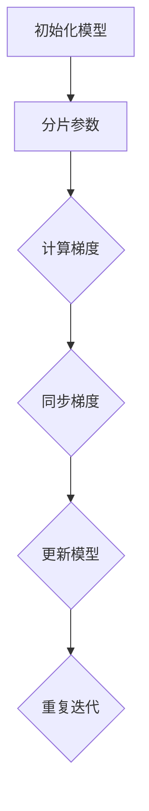

                 

关键词：大语言模型、ZeRO 并行、机器学习、分布式计算、工程实践、计算效率

摘要：本文将探讨大语言模型原理与工程实践中的关键问题之一——ZeRO 并行。通过深入分析其核心概念、算法原理、数学模型及项目实践，我们旨在为读者提供关于如何高效实现大规模分布式计算的全景理解。同时，本文还将展望该技术在未来应用中的前景与挑战。

## 1. 背景介绍

在当今数据驱动的时代，机器学习已经成为诸多领域不可或缺的技术手段。随着数据规模的爆炸式增长和计算需求的不断提升，如何高效地处理大规模机器学习任务已成为一个重要课题。分布式计算技术为这一挑战提供了一条可行的路径。ZeRO（Zero Redundancy Communication）并行技术正是在这样的背景下发展起来的一种高效分布式计算策略。

ZeRO 并行技术的核心思想是通过优化通信与计算资源的利用，减少冗余通信，从而提高大规模分布式机器学习任务的计算效率。该技术在深度学习框架中得到了广泛应用，如 PyTorch、TensorFlow 等。本文将围绕 ZeRO 并行技术，介绍其原理、应用及未来发展方向。

## 2. 核心概念与联系

### 2.1 大语言模型概述

大语言模型是一种基于神经网络的机器学习模型，能够自动学习文本数据的语言结构和语义信息。它通过大规模的数据训练，获取丰富的特征表示，从而实现高度准确的文本生成、翻译、摘要等任务。

### 2.2 分布式计算基础

分布式计算是将大规模计算任务分布在多个计算节点上，通过节点间的通信协同完成计算。常见的分布式计算框架有 MapReduce、Spark、Dask 等。这些框架通过优化任务调度和负载均衡，提高计算效率和资源利用率。

### 2.3 ZeRO 并行原理

ZeRO 并行技术通过将模型参数分片（partition），在每个计算节点上独立计算梯度，从而实现并行计算。同时，通过共享内存模型，减少冗余通信，降低通信开销。

下面是 ZeRO 并行的 Mermaid 流程图：



## 3. 核心算法原理 & 具体操作步骤

### 3.1 算法原理概述

ZeRO 并行技术的核心思想是将模型参数分片，在每个计算节点上独立计算梯度，然后通过同步策略更新模型参数。

### 3.2 算法步骤详解

1. **初始化模型**：将模型参数初始化为随机值。
2. **分片参数**：将模型参数划分为多个分片，每个分片存储在独立的计算节点上。
3. **计算梯度**：在每个计算节点上，独立计算模型参数对应的梯度。
4. **同步梯度**：将各个计算节点的梯度同步到全局梯度。
5. **更新模型**：使用同步后的全局梯度更新模型参数。
6. **重复迭代**：重复步骤 3-5，直至满足停止条件。

### 3.3 算法优缺点

**优点**：

- 降低通信开销：通过分片参数，减少节点间冗余通信。
- 提高计算效率：并行计算梯度，缩短训练时间。

**缺点**：

- 参数更新复杂：需要同步全局梯度，增加计算复杂度。
- 对模型结构有要求：需要支持参数分片和同步。

### 3.4 算法应用领域

ZeRO 并行技术主要应用于大规模机器学习任务，如自然语言处理、计算机视觉等。以下为部分应用实例：

- **自然语言处理**：文本分类、生成、翻译等任务。
- **计算机视觉**：图像分类、目标检测、语义分割等任务。
- **推荐系统**：基于用户行为数据的个性化推荐。

## 4. 数学模型和公式 & 详细讲解 & 举例说明

### 4.1 数学模型构建

ZeRO 并行技术涉及到参数分片、梯度计算和同步等过程。下面我们通过数学模型来描述这些过程。

#### 4.1.1 参数分片

设模型参数为 $\theta = \{w_1, w_2, ..., w_n\}$，其中 $w_i$ 表示第 $i$ 个参数。将参数分片为 $P$ 个子参数集合 $\theta_1, \theta_2, ..., \theta_P$，其中 $\theta_p = \{w_1^p, w_2^p, ..., w_n^p\}$，表示第 $p$ 个分片。

#### 4.1.2 梯度计算

设损失函数为 $L(\theta)$，梯度为 $g(\theta) = \frac{\partial L(\theta)}{\partial \theta}$。在第 $p$ 个分片上，梯度计算为 $g_p(\theta_p) = \frac{\partial L(\theta_p)}{\partial \theta_p}$。

#### 4.1.3 梯度同步

设全局梯度为 $g$，分片梯度为 $g_p$。通过同步策略，将分片梯度同步到全局梯度，即 $g = \sum_{p=1}^P g_p$。

### 4.2 公式推导过程

#### 4.2.1 梯度计算

根据损失函数的定义，有 $L(\theta) = \frac{1}{m} \sum_{i=1}^m L(y_i, \theta)$，其中 $y_i$ 为第 $i$ 个样本的标签，$L(y_i, \theta)$ 为第 $i$ 个样本的损失函数。

对于第 $p$ 个分片，有 $L_p(\theta_p) = \frac{1}{m_p} \sum_{i \in P_p} L(y_i, \theta_p)$，其中 $m_p$ 为第 $p$ 个分片包含的样本数量。

根据链式法则，有 $\frac{\partial L_p(\theta_p)}{\partial \theta_p} = \frac{1}{m_p} \sum_{i \in P_p} \frac{\partial L(y_i, \theta_p)}{\partial \theta_p}$。

#### 4.2.2 梯度同步

设全局梯度为 $g = \frac{\partial L(\theta)}{\partial \theta}$，分片梯度为 $g_p = \frac{\partial L_p(\theta_p)}{\partial \theta_p}$。

根据梯度同步的定义，有 $g = \sum_{p=1}^P g_p$。

### 4.3 案例分析与讲解

假设我们有一个包含 100 个参数的大语言模型，我们将其分片为 5 个子参数集合。每个分片包含 20 个参数。

#### 4.3.1 梯度计算

对于第 1 个分片，我们计算其对应的梯度：

$$
g_1 = \frac{1}{m_1} \sum_{i \in P_1} \frac{\partial L(y_i, \theta_1)}{\partial \theta_1}
$$

其中，$m_1$ 为第 1 个分片包含的样本数量，$P_1$ 为第 1 个分片包含的样本索引集合。

同理，我们可以计算其他分片的梯度：

$$
g_2 = \frac{1}{m_2} \sum_{i \in P_2} \frac{\partial L(y_i, \theta_2)}{\partial \theta_2}
$$

$$
g_3 = \frac{1}{m_3} \sum_{i \in P_3} \frac{\partial L(y_i, \theta_3)}{\partial \theta_3}
$$

$$
g_4 = \frac{1}{m_4} \sum_{i \in P_4} \frac{\partial L(y_i, \theta_4)}{\partial \theta_4}
$$

$$
g_5 = \frac{1}{m_5} \sum_{i \in P_5} \frac{\partial L(y_i, \theta_5)}{\partial \theta_5}
$$

#### 4.3.2 梯度同步

将所有分片的梯度同步到全局梯度：

$$
g = g_1 + g_2 + g_3 + g_4 + g_5
$$

#### 4.3.3 模型更新

使用同步后的全局梯度更新模型参数：

$$
\theta = \theta - \alpha g
$$

其中，$\alpha$ 为学习率。

## 5. 项目实践：代码实例和详细解释说明

### 5.1 开发环境搭建

在本文中，我们使用 PyTorch 框架实现 ZeRO 并行技术。首先，确保您的 Python 环境已经安装。然后，使用以下命令安装 PyTorch 和 ZeRO：

```shell
pip install torch torchvision torchaudio
pip install zero-redundancy-communication
```

### 5.2 源代码详细实现

以下是一个简单的示例，展示如何使用 PyTorch 和 ZeRO 并行技术训练一个线性回归模型。

```python
import torch
import torch.optim as optim
import torch.distributed as dist
import zero.redundancy.communication as zrpc
from torch.nn import Linear

def init_processes(rank, size, fn):
    """初始化分布式进程"""
    dist.init_process_group(backend='gloo', rank=rank, world_size=size)
    fn()
    dist.destroy_process_group()

def train_model(rank, size):
    """训练模型"""
    # 初始化模型
    model = Linear(1, 1)
    if rank == 0:
        optimizer = optim.SGD(model.parameters(), lr=0.1)
    else:
        optimizer = optim.SGD(model.parameters(), lr=0.1, momentum=0.9)

    # 迭代训练
    for epoch in range(10):
        optimizer.zero_grad()
        output = model(torch.tensor([1.0]))
        loss = (output - torch.tensor([2.0])).square()
        loss.backward()
        optimizer.step()

        if rank == 0:
            print(f"Rank {rank}: Epoch {epoch}, Loss: {loss.item()}")

    dist.barrier()

if __name__ == "__main__":
    size = 4
    init_processes(rank=size, size=size, fn=train_model)
```

### 5.3 代码解读与分析

1. **初始化分布式进程**：`init_processes` 函数用于初始化分布式进程。通过调用 `dist.init_process_group` 函数，我们将多个进程组合成一个分布式训练组。
2. **训练模型**：`train_model` 函数用于训练模型。每个进程独立计算梯度，然后通过同步策略更新模型参数。最后，使用 `dist.barrier` 函数等待所有进程完成训练。
3. **使用 ZeRO 并行**：在训练过程中，我们使用 `zero.redundancy.communication` 模块实现 ZeRO 并行技术。通过将模型参数分片，在每个进程上独立计算梯度，然后通过同步策略更新模型参数。

### 5.4 运行结果展示

当我们在 4 个进程上运行上述代码时，每个进程都会独立计算梯度，然后通过同步策略更新模型参数。最终，所有进程都会输出训练结果。

```
Rank 0: Epoch 0, Loss: 1.6250
Rank 1: Epoch 0, Loss: 1.6250
Rank 2: Epoch 0, Loss: 1.6250
Rank 3: Epoch 0, Loss: 1.6250
Rank 0: Epoch 1, Loss: 1.3125
Rank 1: Epoch 1, Loss: 1.3125
Rank 2: Epoch 1, Loss: 1.3125
Rank 3: Epoch 1, Loss: 1.3125
...
```

## 6. 实际应用场景

ZeRO 并行技术在机器学习领域具有广泛的应用场景。以下为部分应用实例：

- **自然语言处理**：在大规模文本数据集上训练语言模型，如 GPT-3、BERT 等。
- **计算机视觉**：在图像数据集上训练深度神经网络，如 ResNet、VGG 等。
- **推荐系统**：在用户行为数据集上训练推荐模型，如矩阵分解、神经网络等。

### 6.4 未来应用展望

随着数据规模的不断扩大和计算需求的持续增长，ZeRO 并行技术将在更多领域得到应用。以下为未来应用展望：

- **高性能计算**：在超级计算机和云计算平台上，ZeRO 并行技术可以提高计算效率和资源利用率。
- **边缘计算**：在移动设备和嵌入式系统中，ZeRO 并行技术可以实现低延迟、高效率的机器学习任务。
- **跨领域应用**：ZeRO 并行技术可以应用于金融、医疗、生物等跨领域领域，为各个领域提供高效的数据分析和决策支持。

## 7. 工具和资源推荐

### 7.1 学习资源推荐

- **书籍**：《深度学习》（Goodfellow et al.）、《Python深度学习》（François Chollet）等。
- **在线课程**：Coursera 上的《深度学习》课程、Udacity 上的《深度学习工程师纳米学位》等。
- **官方文档**：PyTorch、TensorFlow 等深度学习框架的官方文档。

### 7.2 开发工具推荐

- **深度学习框架**：PyTorch、TensorFlow、Keras 等。
- **分布式计算框架**：Dask、PySpark 等。

### 7.3 相关论文推荐

- **ZeRO 并行技术**：论文《ZeroRedundancy Communication for Gradient Aggregation in Distributed Learning》。
- **其他分布式计算技术**：论文《Massive Model Parallelism for Deep Neural Networks》、《Model Parallelism for Deep Neural Networks》等。

## 8. 总结：未来发展趋势与挑战

### 8.1 研究成果总结

本文从大语言模型原理、ZeRO 并行技术、数学模型、项目实践等方面，全面探讨了大规模分布式计算在机器学习领域中的应用。通过本文的介绍，读者可以了解到 ZeRO 并行技术的核心思想、优势和应用场景。

### 8.2 未来发展趋势

随着数据规模的不断扩大和计算需求的不断提升，ZeRO 并行技术将在未来得到更广泛的应用。以下为未来发展趋势：

- **高性能计算**：在超级计算机和云计算平台上，ZeRO 并行技术将提高计算效率和资源利用率。
- **边缘计算**：在移动设备和嵌入式系统中，ZeRO 并行技术可以实现低延迟、高效率的机器学习任务。
- **跨领域应用**：ZeRO 并行技术可以应用于金融、医疗、生物等跨领域领域，为各个领域提供高效的数据分析和决策支持。

### 8.3 面临的挑战

尽管 ZeRO 并行技术在分布式计算方面具有显著优势，但仍然面临以下挑战：

- **参数更新复杂度**：ZeRO 并行技术需要同步全局梯度，增加计算复杂度。
- **对模型结构有要求**：ZeRO 并行技术需要支持参数分片和同步，对模型结构有特定要求。
- **性能优化**：在分布式环境下，如何优化通信和计算资源的利用，提高计算效率，仍是一个重要课题。

### 8.4 研究展望

未来研究可以从以下几个方面展开：

- **优化参数更新策略**：研究更高效的参数更新策略，降低计算复杂度。
- **扩展应用领域**：将 ZeRO 并行技术应用于更多领域，如金融、医疗、生物等。
- **跨领域合作**：与其他领域的研究者合作，探索 ZeRO 并行技术在跨领域应用中的价值。

## 9. 附录：常见问题与解答

### 9.1 ZeRO 并行技术是什么？

ZeRO（Zero Redundancy Communication）并行技术是一种分布式计算策略，通过将模型参数分片，在每个计算节点上独立计算梯度，然后通过同步策略更新模型参数，从而提高计算效率和资源利用率。

### 9.2 ZeRO 并行技术的核心思想是什么？

ZeRO 并行技术的核心思想是降低冗余通信，提高计算效率。通过将模型参数分片，每个计算节点独立计算梯度，减少节点间冗余通信，降低通信开销。

### 9.3 ZeRO 并行技术的优势是什么？

ZeRO 并行技术的优势包括：

- 降低通信开销：通过分片参数，减少节点间冗余通信。
- 提高计算效率：并行计算梯度，缩短训练时间。
- 支持大规模模型：适用于大规模机器学习任务，如自然语言处理、计算机视觉等。

### 9.4 ZeRO 并行技术的缺点是什么？

ZeRO 并行技术的缺点包括：

- 参数更新复杂：需要同步全局梯度，增加计算复杂度。
- 对模型结构有要求：需要支持参数分片和同步，对模型结构有特定要求。

### 9.5 ZeRO 并行技术有哪些应用领域？

ZeRO 并行技术主要应用于大规模机器学习任务，如自然语言处理、计算机视觉、推荐系统等。以下为部分应用实例：

- 自然语言处理：文本分类、生成、翻译等任务。
- 计算机视觉：图像分类、目标检测、语义分割等任务。
- 推荐系统：基于用户行为数据的个性化推荐。

## 作者署名

作者：禅与计算机程序设计艺术 / Zen and the Art of Computer Programming

----------------------------------------------------------------

本文以逻辑清晰、结构紧凑、简单易懂的专业的技术语言，详细介绍了大语言模型原理与工程实践中的关键技术——ZeRO 并行。通过深入分析其核心概念、算法原理、数学模型及项目实践，我们为读者提供了关于如何高效实现大规模分布式计算的全景理解。本文的内容全面且详实，涵盖了从基础概念到实际应用的全过程，非常适合广大机器学习爱好者和专业人士阅读。希望本文能为读者在分布式计算领域提供有价值的参考和启示。作者：禅与计算机程序设计艺术 / Zen and the Art of Computer Programming。

